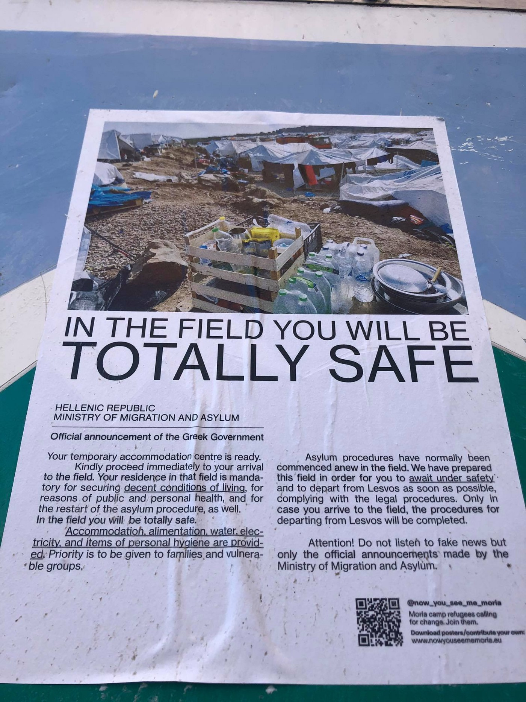
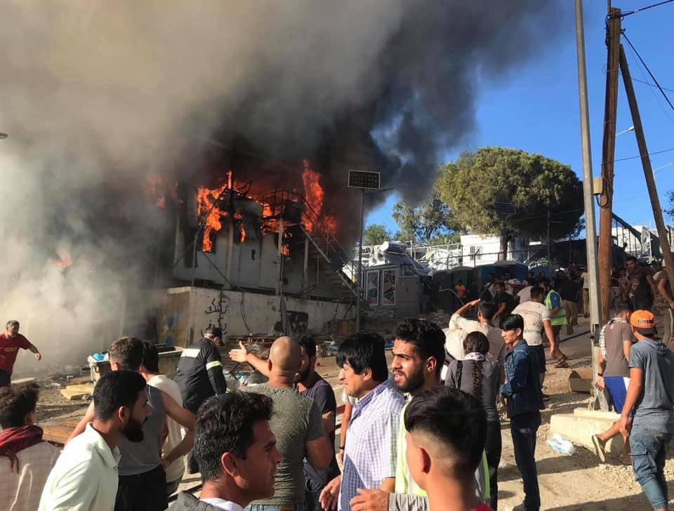
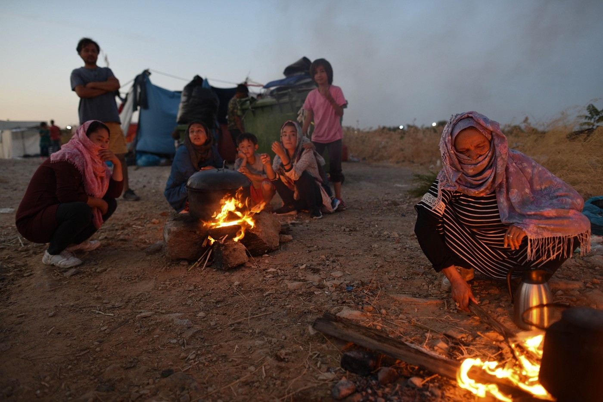
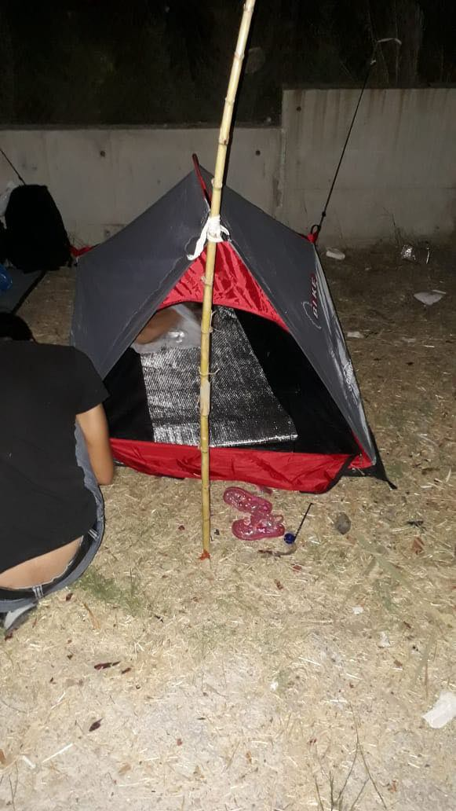
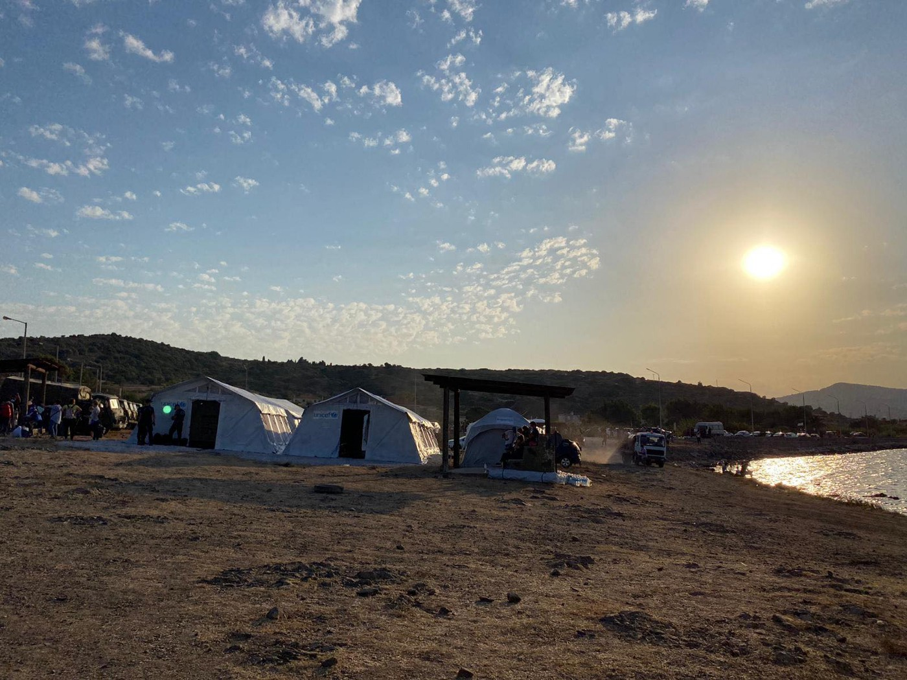
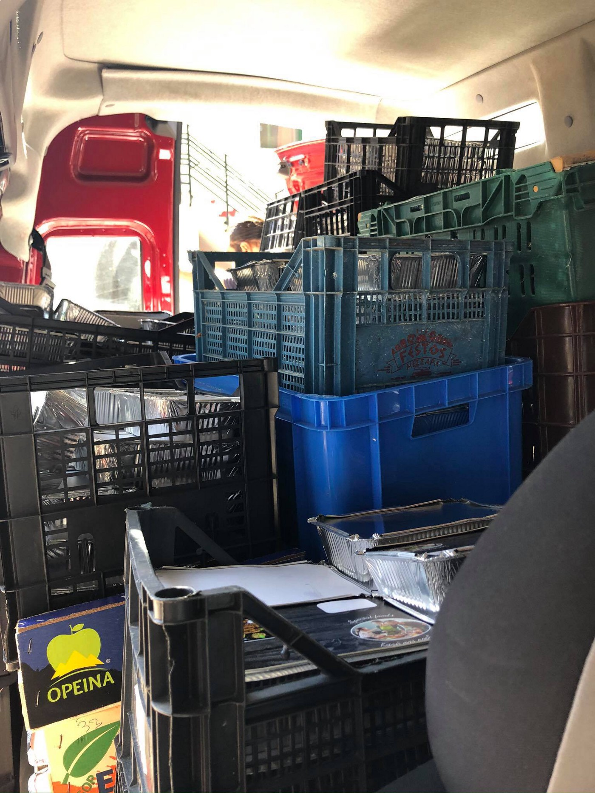
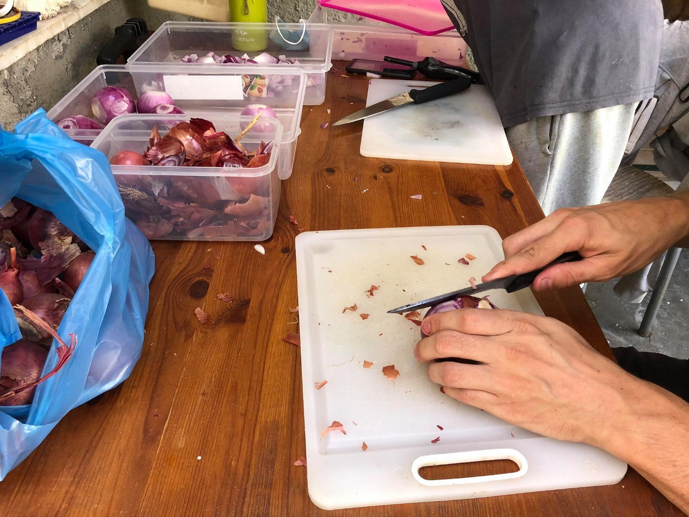
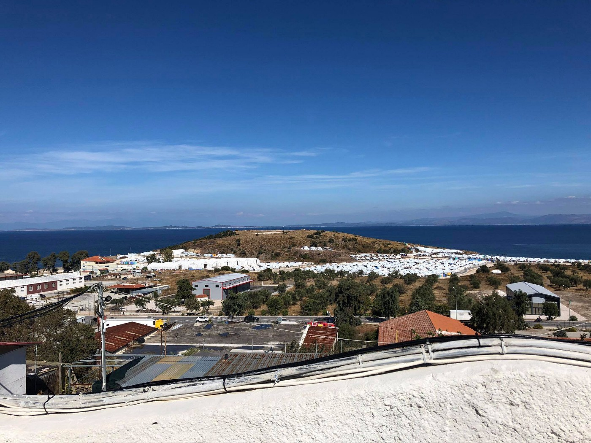
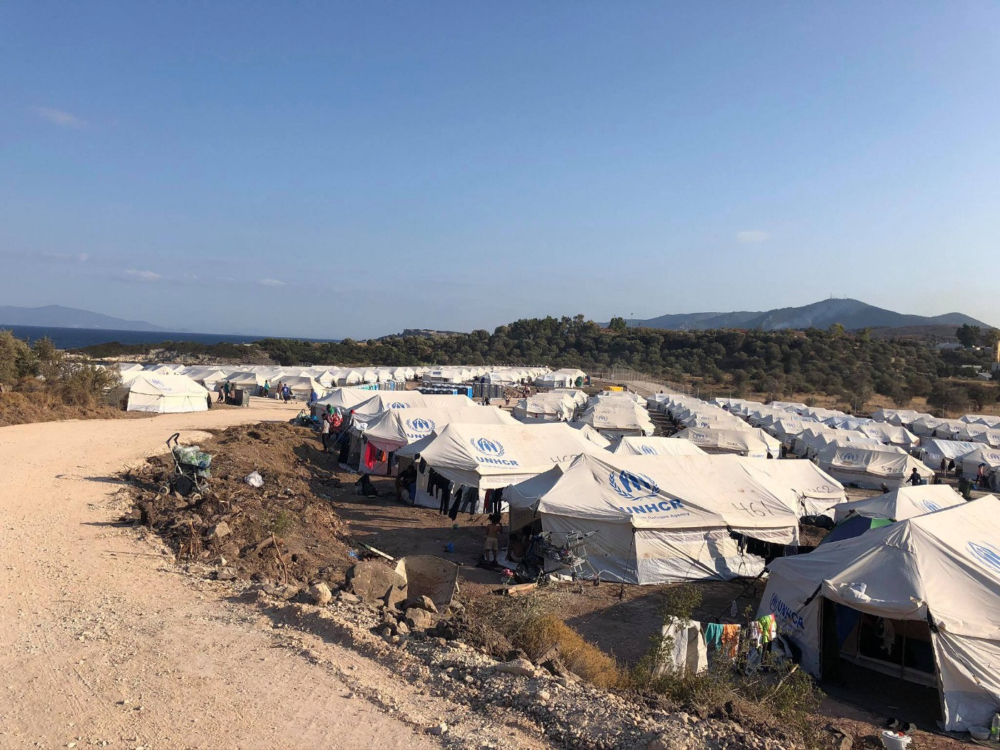

### AYS Special from Lesvos: Don’t film me chopping onions

_Rachel Sweren reports from the ground on the aftermath of the Moria fire and the impact it had on people on the move and those who work in solidarity with them\._

\(Photo Credit: Rachel Sweren\)

Solidarity smells like a pot of his wife’s spicy biryani recipe simmering on the stove, but some measurements aren’t meant to be quantified, and he told me not to film him chopping onions\. It was the first moment of calm we had all day, and it was so aromatic that just having the room to listen to my friend ask me a question felt affectionate\. In criminalizing seeking asylum, so many details are dehumanized and reduced to nothing so that those responsible feel less responsibility, or less guilt\. So emergency services designed to counter those emergencies, amid a larger crisis, should be cooked with generous amounts of olive oil and garlic, pack a little heat, and be served and eaten family\-style\.

> Radical sensitivity and empathy must always be part of emergency care and crisis mitigation, because in the two weeks of chaos just after the Moria Camp fire, without that guarantee, it was hard to tell how much I was actually contributing to the chaos, and who was benefiting from my efforts\. 

First, we need to acknowledge that “crisis” and “emergency” are two different terms, and distinguishing them when we talk about the fire is important\. To define it as simply as possible, “crisis” is a time of intense difficulty or danger, a turning point at which an important decision must be made; “emergency” is a serious, unexpected, and often dangerous situation requiring immediate action\.

 and [MSF](https://www.facebook.com/doctorswithoutborders.sg/photos/bc.AbpRXeamUbarJmomjx31jEVfRQ-ZULK4URZT2mwoFBRbqRebTEetvQQWJjXS5-Kw8eoPLoAGtEaePogWYThSlLa_FdVqPT-wo3Y2yWn85yp2eymmBc43-GjOH-1wMA0-Tt2zcNUev5Hb5JlKNvbjDBd7/1624164954411850/?opaqueCursor=AbpI7W2-ukED9iwW-sGW0GngMJXbFfStsZYcEo-aIklyjcqfoqypf1CByENi_KutklaUPT-ul03314o7cK7IRor0oYxF1QIz5pLV-_vHQvjyRHIXNg5GiYOzdtnMnBM6GIyJzZkK_YxRKUnidJTlmqb3-VFVXR-T8pMqytfiZYY7gvL_FTjwk16ZdgpNGQ9G57XdRcXXijiiMg7m6ln6gsonrSoPBjX5WBCYB5OwNpxb98wWN56jSadAOUnHJzLdMR_q5IQDT9GJ1DGznVSZWxWIVC3Y79HJFVGsi-gVYi7KoBXhXGlbUzyd79ZRVK_M7b_Vj2doB_p0BAt6JkF6zhPYjUZ2w3EwaWLcMdI4cNOlER90wbNm6ZgwUGRS9gAlHFf6HZJqApkgqxjeruxG5FOrIjwx5q_W9D0h6KyJLO2sNaeUnlGpqnbkWk7DCcciFSMborXOjK5wm5mMyGs_-e6qNll7M-Z6Mo9tY_098ghDjdMprxI94IaIExNfOS-jCJKUUiALFB_BJjRlyuO0Rxxg-ajM329cmo5mUot0ufHRlOd-IDO1KMdjo4oWBPyzC68eZ7eByKFeeMuDmyTtPvwJxKq19LieXFd8kclB1qYwCA) \)](assets/d910ef05cc49/1*L_OMo1CsbAMH6HOVihDyQg.jpeg)

\(The start of the fire and it’s aftermath\. Photo credit: [Team Humanity](https://www.facebook.com/teamhumanitynfp/photos/bc.AbovmpBxDDFL-MowBGsS7QGPVhamNLSut_lRkgJpkbv619jymCI9GVC9xqXo8oFREeMVE4bKMhE13-pY4iv2fchqGIWn4kAHleAPMl0OUSvLHOisIgQdxqg2tjYKit-O-Rh0AXe_p5cRqbSmXggKKaRw/1433121880190151/?opaqueCursor=Abrczpn5fRPH7ZAxsq_p1YaY5wlflL8mEbGhkqXNctqAGvgb5yasI6L8g8DtlhSf0b1rs2vwelco9uwZNLa_L-g_jJIGaVPmlB0R7tWHBL6YUBSQIgr6wuMwvvD2n169BHh20xjOMjuP-1b1dnIdsQ8UV9JyOjN8pShtqglBm8TDi5p2R87EpUr42tJrg8ek3UIvaXaTsTNH_sI8txyAfHpJt18aZA1KuZRK94BmilEohiMb-nEBZfJpcVt-xaOGPFKB2rr1GQFrhc80g5-RAiXbsE2pzv-NLGeF51qHDsw-cNm5wgauP5MHihi1SovxMv8_xCvEbLRjFFlBecWXZkExAAOMnvcp23XSt8kGxtc7d9U9DXkzX6yhUosRh6RoMaNxktc2GhkD7XQJ05IpIY7HpFrSmwkdqoFAln3ffgsp8kx0FZ5os5kns7CvmuCxMYJSqCpreUN19S3S6g9Fc1EeQL7Abvu1Nk-4xUg-uqWGKkQM0en6Qc8x0kV5xAYFQTE) and [MSF](https://www.facebook.com/doctorswithoutborders.sg/photos/bc.AbpRXeamUbarJmomjx31jEVfRQ-ZULK4URZT2mwoFBRbqRebTEetvQQWJjXS5-Kw8eoPLoAGtEaePogWYThSlLa_FdVqPT-wo3Y2yWn85yp2eymmBc43-GjOH-1wMA0-Tt2zcNUev5Hb5JlKNvbjDBd7/1624164954411850/?opaqueCursor=AbpI7W2-ukED9iwW-sGW0GngMJXbFfStsZYcEo-aIklyjcqfoqypf1CByENi_KutklaUPT-ul03314o7cK7IRor0oYxF1QIz5pLV-_vHQvjyRHIXNg5GiYOzdtnMnBM6GIyJzZkK_YxRKUnidJTlmqb3-VFVXR-T8pMqytfiZYY7gvL_FTjwk16ZdgpNGQ9G57XdRcXXijiiMg7m6ln6gsonrSoPBjX5WBCYB5OwNpxb98wWN56jSadAOUnHJzLdMR_q5IQDT9GJ1DGznVSZWxWIVC3Y79HJFVGsi-gVYi7KoBXhXGlbUzyd79ZRVK_M7b_Vj2doB_p0BAt6JkF6zhPYjUZ2w3EwaWLcMdI4cNOlER90wbNm6ZgwUGRS9gAlHFf6HZJqApkgqxjeruxG5FOrIjwx5q_W9D0h6KyJLO2sNaeUnlGpqnbkWk7DCcciFSMborXOjK5wm5mMyGs_-e6qNll7M-Z6Mo9tY_098ghDjdMprxI94IaIExNfOS-jCJKUUiALFB_BJjRlyuO0Rxxg-ajM329cmo5mUot0ufHRlOd-IDO1KMdjo4oWBPyzC68eZ7eByKFeeMuDmyTtPvwJxKq19LieXFd8kclB1qYwCA) \)

It makes sense that the fire should be called an emergency, as it burned Europe’s most notorious refugee camp to ashes in the middle of the night during a pandemic\. Thirteen thousand people were condensed onto a section of the main road that can only be described as “hot asphalt in the middle of the Aegean Sea,” guarded 24/7 by fully\-outfitted riot police wearing their impunity on their sleeves\.

> The events leading up to the fire were not accidental, and the fire itself was not an anomaly, but rather the result of a crisis volleyed between silent festering and volcanic inflammation\. 

So it’s necessary that we see the burning of Moria camp as an emergency within a crisis\. This crisis is a 7\-year\-long affair encouraged by governments favouring military toys to humane infrastructure, law enforcement behaving as institutional proxy militias, and a circular, impotent asylum system\. It’s absorbed by small islands, border towns, and locals forced as a state\-sanctioned sacrifice in the grand pursuit of criminalizing the “unfortunate” aftermath of violent imperialism: refugees\.

 and [MSF](https://www.facebook.com/msfindia.in/photos/bc.Abqn5Ve8KEcpMUwq5a-1-xChZT0U9u02u2gIDFZx1ctoNbi-4kpvkzRms7PCHTJpKTnuHL7pArbFc0wp4VBgrwSuM3Qb0zlDB64V5Hr51jvjYElC-sbCkFRaG7UMpalWTXPnyV01eNF8uNKzeKheeycG/3523416064385827/?opaqueCursor=AbocTouRkDF0gXprNCMrEB9TddlGBMFibVM5p3mQmMBJ2iV6NLOd6fH-pbBSs5z4yfu8SkDXPo_R30B7r7IRVxmnYzNRHS23PgPa9VJDJRbo52KP1GT7Ue3d6WSzJjRLB9fVk0P_qpXHfEzB2gOyFbLpuXBH2Tk4aLXK_tCsr0k52EZQ3e5D8R5kpL3W4xQeZGGJfboGp2NSbfJAqUwiTGfLBKgkDIWsjbiM0vXMC4lf2Si0H0If2q5XCFMlP_RdrTZuHRafnJjJpcnbqEF5RZW0JMFMAuSaG915itHFyGoWTBqRq08ILslYOZvsmpeWEd6bpSckT9bDpsYiOHfWggjIVkcEZC43bJCujKXxYAl1J-iic6EUle6dV4o8IqKfhelRQAmPhx5dT0gJYfaF5Q-wy2guO-S-9EDqHe5jgwU_EIlUE2SoZkxRINklQ-FGyUo-hJNj3VZtMf8ZJA3I6yJ9Ci5I-0qEDQ6fJnxJUmQn_YxrqAf3safAtqiuWeH7pbE) \)](assets/d910ef05cc49/1*7cNY25-NKZlyaBRfOAk28g.jpeg)

\(After the fire\. Photo Credit: [InfoMigrants](https://www.facebook.com/InfoMigrants.fr/photos/bc.AbqTG8Q5VvsB82aXXyxinak8GAliuVBhSZfjg79WbOPYxxnCrv2XTnlKNstgHY396H1vVzEJYpBzjDSFeFqoMQ0wCRjD_L7-21W18mEv9zFg_QO9t5PUM1YTZX1P8O1yE73KI_kRoIpWMVXyL0MscyYH/991390024660165/?opaqueCursor=Abp0AcNotNLWgBetuwwo38m8mGGjtYa31fdJqSQ6Rl9qnqDt6ik3YWgLzkzUngJ42K0UNJPrLBmMWy2Z0OcSata6H00eATTb712dYOrInc5Su-jU6sJt_YrdOWbyX1vKTSA3y3DGLGWkjpFuDI-MFYdoZkMC5r9IxGqr0ak2WaMUwrXX3G0LHmOmtVLYWc3SKeBgqSfe_mZGnxoN42QxGmQ03XaytQpXVySi4OSPQ_kIwjJves_bM_NaZNOltiPzPh2QLYe4slBuCIHLBU6cfDU9U9RiDFsevysULwtInorjMMEkYnlTA7IzQFhY2cpEt6oZ0XgGIxYRF8GxyG8Qyu2s4QblLO7y5UbKa7-hqZf4ZBYN_-fkUb0b0VPFIqJ54yifSIVAcHOh8coINh8MhE9yT3B7Q2J32nq21A_dVDfsi9zbezcLfO6Z9VzTJ7CiDpxHr3D56F6CvvuEmSKxmvg0ZIBvQsLXvYMSknfjDfyohImPz3pR5s3rSpX_Apoyh6o) and [MSF](https://www.facebook.com/msfindia.in/photos/bc.Abqn5Ve8KEcpMUwq5a-1-xChZT0U9u02u2gIDFZx1ctoNbi-4kpvkzRms7PCHTJpKTnuHL7pArbFc0wp4VBgrwSuM3Qb0zlDB64V5Hr51jvjYElC-sbCkFRaG7UMpalWTXPnyV01eNF8uNKzeKheeycG/3523416064385827/?opaqueCursor=AbocTouRkDF0gXprNCMrEB9TddlGBMFibVM5p3mQmMBJ2iV6NLOd6fH-pbBSs5z4yfu8SkDXPo_R30B7r7IRVxmnYzNRHS23PgPa9VJDJRbo52KP1GT7Ue3d6WSzJjRLB9fVk0P_qpXHfEzB2gOyFbLpuXBH2Tk4aLXK_tCsr0k52EZQ3e5D8R5kpL3W4xQeZGGJfboGp2NSbfJAqUwiTGfLBKgkDIWsjbiM0vXMC4lf2Si0H0If2q5XCFMlP_RdrTZuHRafnJjJpcnbqEF5RZW0JMFMAuSaG915itHFyGoWTBqRq08ILslYOZvsmpeWEd6bpSckT9bDpsYiOHfWggjIVkcEZC43bJCujKXxYAl1J-iic6EUle6dV4o8IqKfhelRQAmPhx5dT0gJYfaF5Q-wy2guO-S-9EDqHe5jgwU_EIlUE2SoZkxRINklQ-FGyUo-hJNj3VZtMf8ZJA3I6yJ9Ci5I-0qEDQ6fJnxJUmQn_YxrqAf3safAtqiuWeH7pbE) \)

It’s also important to maintain this distinction in light of discourse that comes from outside ground zero, because language matters\. Many news sources coming to report on the fire seemed too overwhelmed to decide how to talk about the fire, or they came without doing their research and described it as a “clash” or a “conflict\.” This is a very lazy, Western\-flavoured classification frequently designated to inflammatory situations involving any formerly\-colonized or otherwise suppressed people in which human rights are being debated and the distribution of force and agency among the people involved is unequal\. These linear narratives adopted more of a kaleidoscopic vision than anything else, taking the same small image and crystallizing it into a million pieces, giving the illusion of vibrancy and depth when you look at it under direct sunlight\.

> Conflating crisis and emergency when talking about the fire ignores that it was both symbolic and symptomatic of a larger problem, shifts blame away from where it needs to be, and dilutes the nuance needed to process it all\. 

The smoke and ash were suffocating, but they did eventually clear enough so we could see what was in front of us\. Reality quickly became “there was a huge fire, and people live in the street now, and there are no emergency plans in place to feed the people outside the normal system of resource allocation\.” From there, increasingly smaller, but no less urgent, emergencies began to multiply, living within each other like a matryoshka doll\. Where are people going to sleep? With what materials can we use to set up an informal camp with no clear timeline? How will food appear uninhibited? How will food appear in spite of formidable obstacles?

> If your mom is diabetic and hasn’t eaten for two days, how can you find appropriate medical attention? What happens if your newborn doesn’t have access to formula and you can’t breastfeed? What happens if your child faints from lack of food? 

If you recently miscarried and you’re now bleeding through your leggings from stress\-related complications, but an ambulance won’t come to you and the hospital might not provide reliable, non\-discriminatory care, how do you get to the nearest NGO medical clinic without getting stopped by police or tear gassed in the streets?

\(Accommodation after the fire, from the street to the beach\. Photo Credit: Rachel Sweren\)

My colleagues and I, as well as most of the volunteers on the island mobilizing themselves in these two weeks, shared the larger responsibilities, like distributions of food and supplies, if our normal projects were temporarily suspended, and made room to help our friends on the side with whatever we could\. A friend aptly describes this as “wide\-cone vision” instead of tunnel vision, citing that we weren’t just hyper\-focusing on certain things we had to get done and ignoring everything else; we were taking in massive amounts of data nonstop and filtering out what we could handle and what we needed help with or to delegate to someone else\.

> We weren’t emergency services and therefore had little formal training, but we also knew the benefits of being self\-organized as a citizens’ initiative, and could put to use our own skills and talents\. 

Coordinating food distro lines is surprisingly smoother when you use your teaching voice, any empty patch of street is the perfect spot for holding kids’ activities, and if your phone camera works, you’re doing vital frontline documentation\. The rational, realistic parts kicked into gear pretty quickly, because as individuals, we knew we physically weren’t able to treat everyone’s emergencies as our own, and being on the island for a while, we have a sense of where our limits are\. Each of us had our own set of emergencies stacked inside each other like ornate matryoshkas, but instead of just admiring them on the shelf, we were dancing elaborate tangos with them\.

\(Food after the fire\. Photo Credit: Rachel Sweren\)

But as one friend notes, we were thinking so fast that our decision\-making processes were blurry, as if the choices were already made before we had the space to consciously make them\. And everything was so solution\-based, we didn’t have the time to fully assess the quality of our solutions, and inevitably, we were making decisions we ended up regretting later\. We were also met with a crazy threefold opposition and repression\. Local fascists were walking around swinging their dicks like clubs, threatening and beating people on the move and anyone providing aid\. Law enforcement would skin you alive if you sneezed without permission, and quickly escalated to actively preventing any relief efforts from happening, even stopping medical personnel en route\.

> Governing bodies’ primary goal was to restrict as much ‘comfort’ \(meaning survival\) for those forced into homelessness so they could be easily herded into the new camp\. 

This ultimately devolved into restricting the ability to work in any capacity with those on the streets until providing emergency aid was made illegal altogether\. As one friend remembers, when you realize you’re having negotiations with a hostile government to provide water to thousands of people who were just internally displaced, it’s a slap in the face\. Maybe our choreography was getting progressively more intricate, but our balance was more like learning to walk bipedally — you do it so you don’t fall over\.

> Everyone was sleeping rough across from the Lidl parking lot, everyone was eating soggy egg sandwiches, everyone’s babies were sitting in soiled clothes, everyone’s elderly father needed his heart medicine\. 

Insecurity was at its peak and people were queueing for supplies they might not even get, so our pragmatic threshold for emergency was much higher\. Emergency is proximal, subjective, and in flux, so who the fuck are we to decide whose emergency is more urgent than someone else’s? But making this distinction isn’t personal, it’s a last resort\. We knew why we were doing it, and we had valid reasons for doing so, but that didn’t absolve us from the guilt\. As a friend explained to me, his ability to mitigate an emergency changed the classification of it\. Because “emergency” is often defined by society, we give people more power to define what that is than they need\. That’s confusing, because it isn’t physically possible to respond to every single person who says they have an emergency\. But in those moments, a mother who can’t find her kid presents significantly more of a problem than it might have been before, so the flexibility in how an emergency is defined is important\.

 \)](assets/d910ef05cc49/1*A3T0jll2I3IxgnlHPTvChw.jpeg)

\(Sleeping on the street after the fire\. Photo Credit: [Maurizio Lavarini](https://www.facebook.com/photo?fbid=10221356911185398&set=bc.Abr44qeCvCcgnZuGQ2fm57kRl0M79Svjko-eYjbd2tv8O-d7qMQxE4zerC-gCx2X-EycJMRA2FUo-5QUMg04zjwmybVcClX03wPBv1GUrch68WmQNS6_n013QiD6V3DsyB1F6HbmWLlGQd4wm4SvQXee&opaqueCursor=AbqL3r8NPIeYefP1FJx8TIX7MW3SG0Gip7TaaiV0h7brckQgzxmdKYySkBuGgvfx59NnvmrbdINSItxKPEGe2MhCTkli0F22Yrma1LVszTphuue8T4qNCyEseKlt9vbtXykxGXFhVGm7T6v5QXzzdnNPNhLGkvI2tMPmtJdXS2LnSzmmFL3nN3nDnRf2A1hHkD21fa_SvPeGDqIrWEGdZn9lBwHcjdLCZGLuotTYnoXQSTjgDz9iCT7JTC5gfVJX_sjKXyJn4COBzKcQBJHJh5o0H4EBIBwIZaktEnXLjKFG7eQBcA6VTl_EHdPz8OJl4jB3OnHB3eeNg6vUSV0DqKm_WpAu318mSuvBzfKQ7P6iDNt4oBCtxXzPRdCVb1srVO86wbQaCSYSAJxG6zIqFRMhSTzvq7R4UUMDc_A4bmiE3SGCSz87rzFn_RKZs4DiZsNy4UHEwfbrQnO8FzKaiBNd05uwCTWbg6V1vcl0xd6quuZe6mGdLJfTb8lO1zKbBxA) \)

This paradox of prioritizing and project managing emergencies is a zero\-sum game, and it’s rigged\. These governmental gains or advantages mean intentional, clear losses for people on the move, and the public sees no benefits, no improvements\. The end of those two weeks climaxed into a spectacular nothingness and a hard reset on whatever normal life was\. The main road was cleared of most debris, Lidl was open again, the road was used for cars, and the police checkpoints eroded into half\-assed monuments\.

> The UNHCR was cutting the ribbon at the inauguration of the new camp, and if you listened closely enough, you could hear a few weak claps from over in Turkey\. 

Every decision I made during those two weeks choked me in my sleep\. I felt tremendous guilt and shame for everything I did and didn’t do, even though I understood to whom the real guilt and shame belonged\. I became a paradox myself, and completely fell apart\. If I could find a flaw in something I did, I could convince myself that my friends and colleagues having to register themselves in the new camp was my fault, and could punish myself accordingly\. But if I believed I did everything I could have, and stood my ground until the last possible moment, then nothing I could have done would have kept them safe, and it will never matter how hard I work or how much risk or danger I provoke, because the people who have enough power to change the situation enough to make things better won’t do it for all the shit reasons we already know\. And that’s haunting\.

\(Moria 2\.0\. Photo Credit: Rachel Sweren\)

As humanitarian aid workers, we’re responsible for bearing witness and relating what we see and hear and know to others — so I guess the goal of this article is to explain how ritualistic this entire 2\-week period was\.

> Mistrust and mistreatment of migrants and their experiences is so dogmatic in our own asylum systems that our governments started that fire and extinguished it with contaminated ablution water and instead of being regarded as complicity, it’s revered as tradition\. 

Forcing thirteen thousand people onto the street, starving them in the sun until you throw rice and tomato sauce at them at sundown isn’t eid mubarak, it’s agnosticism\. After a while, we found people in the zone eating food they’d cooked themselves; you should never doubt someone’s ability to survive on a dare\. What if we stayed adamant and forced the authorities to do their jobs, to keep their promises? We were operating under the assumption that if we didn’t step up, nobody would\. But by caving to emergency, we helped compromise the quality of care being distributed, perpetuating the status quo, just as hegemony ordains\. We cross our hearts in anger, shame, exhaustion, and vulnerability, but time rots and expires faster than fruit purposely served to you in a plastic bag\.

**_Article by Rachel Sweren_**

**Find daily updates and special reports on our [Medium page](https://medium.com/are-you-syrious) \.**

**If you wish to contribute, either by writing a report or a story, or by joining the info gathering team, please let us know\.**

**We strive to echo correct news from the ground through collaboration and fairness\. Every effort has been made to credit organisations and individuals with regard to the supply of information, video, and photo material \(in cases where the source wanted to be accredited\) \. Please notify us regarding corrections\.**

**If there’s anything you want to share or comment, contact us through Facebook, Twitter or write to: areyousyrious@gmail\.com**

_Converted [Medium Post](https://medium.com/are-you-syrious/ays-special-from-lesvos-dont-film-me-chopping-onions-d910ef05cc49) by [ZMediumToMarkdown](https://github.com/ZhgChgLi/ZMediumToMarkdown)._
