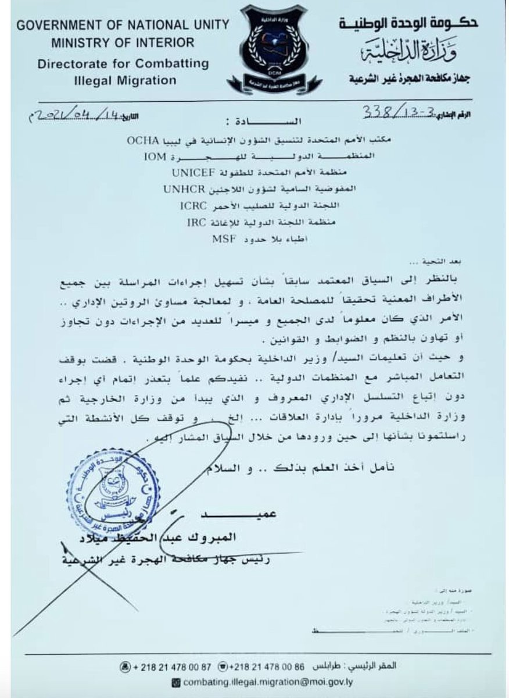
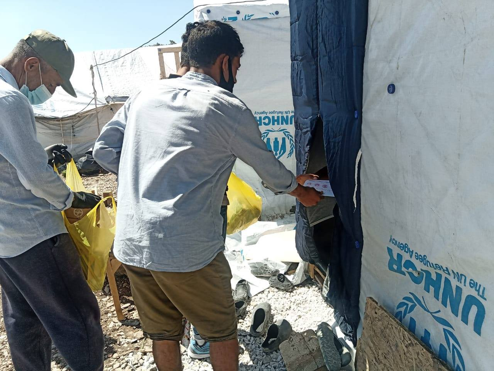
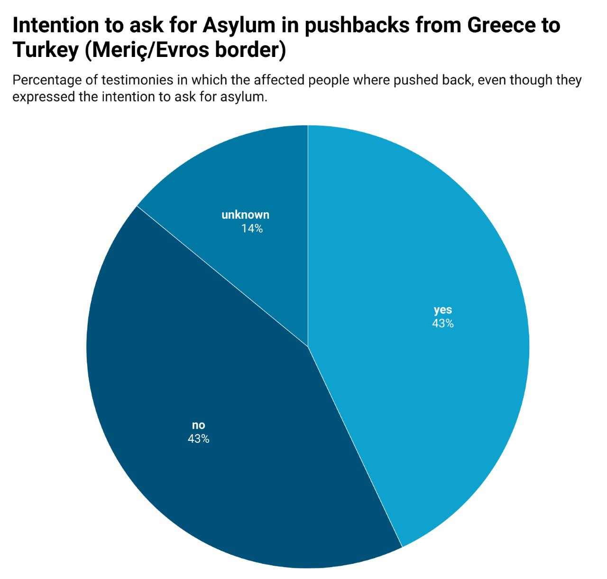
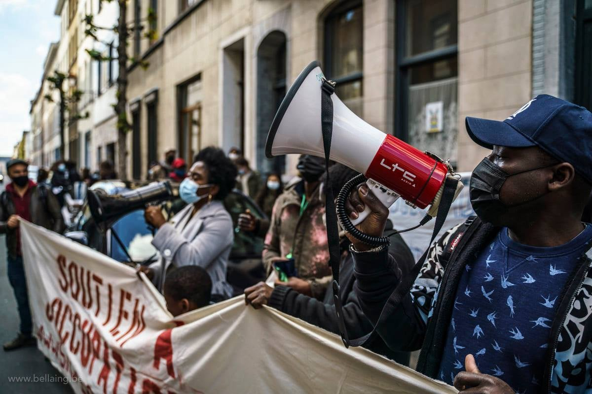
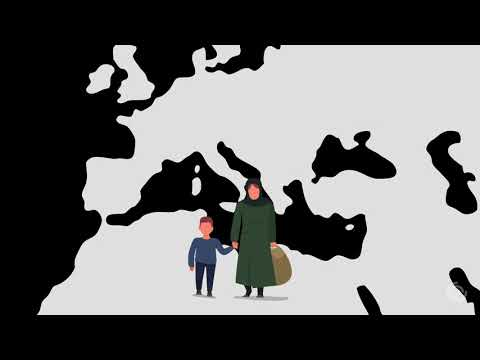
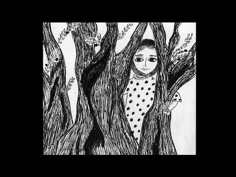

### AYS Daily Digest 01/06/21: Denmark deports to Afghanistan
#### Vaccinations start in Kara Tepe// **On the situation of people on the move in Bulgaria — BVMN report//** Reflecting critically on the actions and instruments the EU has deployed to counter migrant smuggling — a study// Recommended analysis, reads and podcast

 \)](assets/c7d636dbacb9/0*nO4_TU-vnlVpxiLg)

Belgium — 700 people start hunger strike to demand regularisation \(Photo: [Transnational Migrants Coordination](https://www.facebook.com/TransnationalMigrantsCoordination/?__cft__[0]=AZV9n9VJ1F5Z5cNrZT8ztwpUSatva4p19sXIZsg47NVF1fZPSrbFNR-4jK2A9h9LAwlFvSKs22fyUmk5S1idkEMWmvQlH87q4YAjYReZNAYx25ceYoQ2QbDRAYXkl8MH0BhsBQrks33xaxqj5X6WQ9xY93aGhpyZ4Q_8kGlG3DX6NsCWJBCYlJyVRiWTKey5-0txwpnfPrBZj7gfEZpDwYV6&__tn__=-UC%2CP-y-R) \)
#### FEATURE

**Denmark — Forced deportations to Afghanistan continue** , even as multiple reports state that it remains a [dangerous](https://t.co/ocTpVAAUhN?amp=1) place to return people to\.

[Alysia Alexandra](https://twitter.com/AlysiaAlexndra) writes **:** 
Around 4 am on Sunday, Denmark forcibly deported 5 Afghan asylum seekers back to Afghanistan\.

> One of the men was reportedly beaten by Danish police and had his legs tied during the deportation\. 

The five men had been held in Ellebæk prison, which is used as a deportation centre, for up to 18 months before being deported\. Five to eight other Afghan asylum seekers are currently being held in Ellebæk facing deportation\.
The Danish police violently and forcibly deported the five Afghan asylum seekers in the early morning so the men were unable to alert anyone that the deportation was taking place\. The men were put on a plane to Dubai and then another to Kabul\.

More deportations are expected soon for the other Afghan asylum seekers in Ellebæk\. They have been held there for almost 18 months, which is the longest Denmark can detain anyone without criminal charges, it is reported\.
#### LIBYA

Journalist [Sara Crete](https://twitter.com/saracreta/status/1399684983208415239) reports that:

> “EU Internal note lays out the restructure migration architecture in Libya, including lack of access for UN agencies \+ new jails opening in the desert\. The brutal reality: guards routinely extorting ransoms for release & shootings at migrants trying to escape\. 

> A letter send by DCIM to UN agencies & INGOs in Libya\. It lays out the new procedures for engagement with foreign actors & does entail an unclear amount of bureaucratic requirements\. Despite GNU ‘new gov’ humanitarian actors are facing more challenges to deliver assistance\. 

> The blockage of UN humanitarian flights is very concerning: there are 3 flights to Rwanda & Niger, as well as Italy\. ~600 people ready for evacuation flights that can go out quick & are blocked in Libya\. Refugees \(are\) being used to blackmail the EU ahead of the summer\.” 

#### SEA

■■■■■■■■■■■■■■ 
> **[Alarm Phone](https://twitter.com/alarm_phone) @ Twitter Says:** 

> > 🆘️ ~70 lives at risk off #Zuwara! 
A boat in distress reached out to us &amp; needs urgent rescue. The engine is not working, high waves &amp; strong wind are endangering the boat. We informed authorities, but the so-called Libyan Coastguard isn't reachable! Immediate action is needed! https://t.co/j8B0FUaJxR 

> **Tweeted at [2021-06-01 16:01:53](https://twitter.com/alarm_phone/status/1399758105311801349).** 

■■■■■■■■■■■■■■ 

### UN reports three bodies washed up onshore in Libya — all children

[The bodies](https://abcnews.go.com/International/wireStory/bodies-migrant-children-wash-ashore-libya-78007961?fbclid=IwAR2vKZQOTaZHphcgnDlijW6aoQseIFa2eIRpZ-kdH47qDD817pIzWkWXMQE) of three children were found near the Libyan town of Zuwara\. One was of a six\-month\-old, another of a three\-year\-old\. Crossings have increased in recent weeks due to warmer weather, but that doesn’t make the crossing easy\. More people, especially children, will continue to die\. AYS stands in solidarity with people on the move making this crossing and demands change for an effective sea rescue mission\.
#### GREECE

](assets/c7d636dbacb9/0*tALQ9Dur8omrgoWL)

“After we made training course our teams continue to desinfect the camp\. We all need to fight Corona together, it’s still a very big problem and also now in summer there are too many insects espeacially mosquitos in this area\. Our children suffer even more than we do\.” Photo in Info by [Moria White Helmets](https://www.facebook.com/MoriaWhiteHelmets/posts/332205928422473)
### Vaccinations will start in Kara Tepe on Thursday

According to the camp’s commander, Nikolaos Babakos, out of the 6,000 in Kara Tepe camp, **only 730 people** expressed interest in getting the Johnson&Johnson vaccine\.

There is a campaign to increase interest in the vaccine and soon the vaccine will be a requirement for “movement” of refugees and immigrants\. 83 people are still in quarantine for the virus\. More [here](https://www.emprosnet.gr/ygeia/ksekina-tin-pempti-o-emvoliasmos-ton-metanaston-ston-kara-tepe?fbclid=IwAR3NtC3W6eGAjxeawj7bESqJ9qP6_glUph49f1Qs80EJmScTotI5JkGS4S0) \.

](assets/c7d636dbacb9/1*is56bI1ggmi1_-GfZH-X2w.png)

“Today we continued with our Awareness campaign\. We visited the also singles section, which is very crowded, distributed flyers, spoke with the peoples and gave them desinfects and masks\. This is very important\. because now Corona is too much of a problem in Camp\.
We want to thank The Hope Project and WADI for their support of this important campaign\.” Photos and Info by [Moria Corona Awareness Team](https://www.facebook.com/MoriaCoronaAwarenessTeam/posts/316133160015861)

■■■■■■■■■■■■■■ 
> **[Border Violence Monitoring Network](https://twitter.com/Border_Violence) @ Twitter Says:** 

> > 1/ Pushbacks, violence in numbers and (lack of) accountability. Taking a closer look at the practices of illegal expulsion from Greece to Turkey at the Evros border.
[Thread]👇 https://t.co/DG8BEKqyhH 

> **Tweeted at [2021-06-01 13:14:16](https://twitter.com/border_violence/status/1399715923901157380).** 

■■■■■■■■■■■■■■ 

[BVMN](https://twitter.com/Border_Violence/status/1399715923901157380) \(of which AYS is a proud member\) continues to report on:
- “The pushback of over 6000 people since January 2020 via the Evros region to Turkey, with 89% of last years cases including violence tantamount to torture\.”
- While the Greek Ombudsperson’s report found “no indication of wrongdoing on the part of the police officers on the ground and that the complaints about pushbacks are likely to come from traffickers aiming to compromise the operational capabilities of the police” BVMN points to inconsistencies with the data and mounting testimonies\. \(see below\)

](assets/c7d636dbacb9/1*UroOv1akiknSi0PzhFhFeA.jpeg)

Graphs by [BVMN](https://twitter.com/Border_Violence/status/1399715923901157380)

**Virtual event with KAST — Khora Asylum Support Team**

_“Join us on [2 JUNE 2021, 8 pm](https://www.facebook.com/KhoraAthens/posts/1765590376946896) for an online discussion on the realities that asylum seekers face when they arrive via the sea through to their journey in Athens\. We will be joined by an expert panel combining lawyers, those on the forefront of the refugee crisis involved in humanitarian rescue operations, by people who have lived through the experience of coming to Athens as asylum seeker\. In this event, we will explore how language, law, and European policies constitute essential barriers for displaced people\.”_
### “Six points for a migration policy based on solidarity at the EU’s external border in the Greek hotspots”

As published on [clarabuenger\.de](https://clarabuenger.de/aktuell/sechs-punkte-f%C3%BCr-eine-solidarische-migrationspolitik-an-der-eu-au%C3%9Fengrenze-in-den-griechischen-hotspots/?fbclid=IwAR3Qknhnm9rtff_HGzePRcjLkOrJAgHvsi33ADK57MOeugSeuBuZ_wAOYTw) :

> “Between May 25 and 28, 2021, party chairman Janine Wissler, MEP Cornelia Ernst, members of the Bundestag Gökay Akbulut and Michel Brandt as well as the chairwoman of the left\-wing parliamentary group in Bremen’s citizenship, Sofia Leonidakis, were with me on the Greek island of Lesbos\. As a result of this journey, six demands arose, which are documented here below\. 

> 1\. End a humanitarian disaster in the EU — close camps at the EU’s external borders 

> 2\. Solidarity instead of isolation — human rights\-based asylum and migration policy 

> 3\. Use and expand legal access routes 

> 4\. Disarm Frontex and transform it into a European rescue mission 

> 5\. No externalization of asylum and migration policy — No more deals 

> 6\. Enable solidarity instead of preventing it” 

### A program to sustain mothers

Melissa Network: [an integration program different from those already in place:](https://www.kathimerini.gr/society/561381415/mia-melissa-fernei-tin-anoixi/?fbclid=IwAR2YcNW41LlCbEpb-V3UAHu2MzfW2P_CKdv0DAUgj9D0OOLCTjyLPHbCC-E)

“Now, along with Greek lessons, they could then do a second language and choose from a range of activities such as drama, poetry or art\. At the same time, they will be framed by the social service and will have frequent contact with people who will help them find work\.”

> We want to help you turn the source of your grief into a source of strength\. We promise you that you are safe here, that we will do for you what is humanly possible\. And we hope for some that are … impossible 

The network started with 20 women; the work that is done is individualized in the different path of each woman so they can easily evaluate what works and what does not\. The goal is to be able to repeat on a larger scale, they say\.
#### ITALY
### Update from Torino CPR

[No Cpr Torino](https://www.facebook.com/NoCieTorino/posts/2982397705415527) reports:

> “ **The stories of the boys we’ve heard these days angrily testify to the conviction that what happened on the night between May 22th and 23th was not a suicide but it was caused by the police** who intervened while Musa, inside an isolation cell, was desperately asking for a doctor’s intervention to be rescued\. 

> We’ve been told that these days they’ve stopped the hunger strike even though often organized in small groups they try to refuse as much as possible the food they’re delivered fasting for a maximum day or two days\. Protests are mainly motivated by the presence inside food of medicines that cause drowsiness and loss of lucidity\. Medicines that are administered daily to recluses without anyone knowing what type of substances they are used and in what quantities\. We heard a guy on the phone yesterday after lunch who was struggling to speak as if he had just suffered a strong dose of psychopharmaceuticals\. 

> After Musa’s death none of the prisoners had the chance to see a lawyer to provide their own version of events\. It’s evident from their testimonies how they felt abandoned by the institutions that have never sent a representative inside the CPR to hear their voice these days\. A voice that wants to be silenced instead through police violence that continues to terrorize recluses\. Two days ago a guy told us that daily searches happen inside the rooms with the aim of provoking kids and finding a trivial excuse to bathe someone\. **He also told us that the guards continue to beat with batons against the grates that divide the areas of the center to threaten them shouting: “You don’t come out alive from here\!”\.** The provocations of the guards take place, according to the testimony of the recluses, very often below The eyes of the CPR director demonstrate that whoever manages these places is accomplice and responsible for the violence suffered by the detainees\. 

> A boy from Morocco told us that he should end his detention period in a week and that yesterday the on\-call police inspector wanted to force him and two other kids to go into isolation without a clear reason\. He refused immediately and then the inspector grabbed him in the neck to provoke his reaction and have a motive to take him to jail\. His continued protests avoided his transfer to the isolation cell and then returned to the area along with his comrades\. 

> **One week after the death of Musa Balde inside the Turin CPR, nothing has changed** , actually according to many recluse the detention conditions have deteriorated\. Whoever had proposed a more humane cage for CPR detainees, outraged over the death of a 23\-year\-old boy, appears to have disappeared in the media bubble they created\. We asked a recluse boy from Tunisia to tell us what he thinks about the health service inside the CPR\. His answer was: ′′ There is no health service here\!”\. This is the normality described by those who believe that what happened to Musa is not a fatality or an episode\. 

> Inside the Red Area, where around thirty people are detained, last week an Egyptian boy climbed up a canceled to protest his imminent repatriation and the conditions in which he was forced when he suddenly slipped falling to the ground from a ft tall, hitting his head violently\. His comrades told us that he stayed for about 45 minutes on the ground unconscious, with an obvious brain bleed, without receiving any help from CPR medical staff despite their requests for intervention\. After the ambulance arrived, they didn’t hear more from their teammate\. 

> **The boy should still be in a coma inside a hospital here in Turin but we don’t have any information at the moment\. Updates will follow…”** 

#### BULGARIA

Border Monitoring EU just published a new report **Get Out\! On the Situation of Refugees in Bulgaria:**

> “‘Bulgaria is very bad’ is a typical statement made by those who have already crossed several countries on their escape\. The present report examines why Bulgaria has long enjoyed an extremely bad reputation among refugees\. 

> For this purpose, the massive violence that Bulgaria uses in the course of so\-called “push\-backs” is described in a knowledgeable way\. The intensive cooperation with Turkey in protecting the common border is also discussed\. Since the detention of refugees is compulsory in Bulgaria, the legal background for this and the miserable conditions of detention are also described\. The Bulgarian asylum system is also discussed and the special situation of refugees who were deported to Bulgaria under the Dublin Regulation is discussed\. The Bulgarian integration concept, which in fact only exists on paper, is also examined\.” 

[Find the report here](https://bordermonitoring.eu/berichte/2020-get-out/?fbclid=IwAR0A1rjtGVBqBPGezc8XswjT8yxBG62Sibdlo3SzHpIcty8Dl5WCurFFZWE) \.
#### FRANCE

![**UPDATE by Transnational Migrants Coordination:** “For a week now, 700 undocumented women and men, who are occupying the ULB \(Université libre de Bruxelles\), the VUB \(Vrije Universiteit Brussel\) and the Beguinage church, have been on hunger strike to ask for their regularization and better living and working conditions especially in the context of the pandemic\. Some of them have already been hospitalized because of their serious health conditions\.
The strikers have formed the Union of Undocumented Migrants for Regularization to organize their struggle against a racist legal and social system that wants to force upon them a life of precariousness, exploitation, and poverty under the constant blackmail of residence permits\.
The struggle of our comrades in Belgium against institutional racism is part of the transnational struggle that migrants have been fighting in these months, within and outside the European Union, for an unlimited residence permit that does not depend on income, wage and family status\. This transnational struggle saw in the mobilization on May 1st an important moment of visibility and we must keep the attention high on the need of a transnational initiative\. That is why we demand an immediate answer to the claims raised by migrants in Belgium and an unconditional European residence permit\. Their struggle is our struggle and we want our freedom without having to risk our lives to obtain it\.”
Photos by [Transnational Migrants Coordination](http://Transnational Migrants Coordination)](assets/c7d636dbacb9/1*zWz5ybxtD4ODub938kz7_w.jpeg)

**UPDATE by Transnational Migrants Coordination:** “For a week now, 700 undocumented women and men, who are occupying the ULB \(Université libre de Bruxelles\), the VUB \(Vrije Universiteit Brussel\) and the Beguinage church, have been on hunger strike to ask for their regularization and better living and working conditions especially in the context of the pandemic\. Some of them have already been hospitalized because of their serious health conditions\.
The strikers have formed the Union of Undocumented Migrants for Regularization to organize their struggle against a racist legal and social system that wants to force upon them a life of precariousness, exploitation, and poverty under the constant blackmail of residence permits\.
The struggle of our comrades in Belgium against institutional racism is part of the transnational struggle that migrants have been fighting in these months, within and outside the European Union, for an unlimited residence permit that does not depend on income, wage and family status\. This transnational struggle saw in the mobilization on May 1st an important moment of visibility and we must keep the attention high on the need of a transnational initiative\. That is why we demand an immediate answer to the claims raised by migrants in Belgium and an unconditional European residence permit\. Their struggle is our struggle and we want our freedom without having to risk our lives to obtain it\.”
Photos by [Transnational Migrants Coordination](http://Transnational Migrants Coordination)
#### Expulsions continue in Calais

People report being evicted from four provisional campsites in the area:

■■■■■■■■■■■■■■ 
> **[Human Rights Observers](https://twitter.com/HumanRightsObs) @ Twitter Says:** 

> > Ce matin à #Calais les personnes #exilées ont été #expulsées de 4 lieux de vie. 7 tentes et 12 bâches saisies. 
Un périmètre extrêmement large établi par les #FDO, pour nous empêcher d'effectuer notre travail d'observation.
#StopExpulsion 
#StopHarcèlement https://t.co/i7vt0KCaxX 

> **Tweeted at [2021-06-01 18:56:06](https://twitter.com/humanrightsobs/status/1399801947515981829).** 

■■■■■■■■■■■■■■ 

#### EU
#### **Reflecting critically on the actions and instruments the EU has deployed to counter migrant smuggling**

The published [Policy Study](https://www.euromesco.net/wp-content/uploads/2021/05/RETHINKING-EU-COUNTER-SMUGGLING-POLICY-AND-RESPONSE-1.pdf) is relying on field\-based research and other empirical sources to provide evidence\-based understandings of the dynamics present in the facilitation of “irregular migration” — including those shaped or impacted by the COVID\-19 emergency — and the current challenges faced by people on the move\.

The research study **Beyond Networks, Militias and Tribes: Rethinking EU Counter\-Smuggling Policy and Response** is divided into four chapters:

> _Chapter One identifies policy\-makers’ understanding of migrant smuggling and its implications in light of the forthcoming EU migration package\. Chapter Two examines the use of social media by law enforcement in counter\-smuggling operations and its ethical implications\._ 
 

> _Chapter Three identifies the impacts of counter\-smuggling activities in Niger, and the ways they have impacted the lives of migrant transporters and other merchants — in particular, women — who benefited from the presence of migrants\._ 
 

> _The fourth and closing chapter examines how irregular departures from Tunisia, Algeria and Morocco have been organised over the last year in spite of the pandemic, and the implications of the facilitation of irregular migration for migrants\._ 

#### UK

News in the case of Joey Bediako who was detained on 5 May and taken to Brook House immigration removal centre, where he has been threatened with imminent deportation to Ghana:

■■■■■■■■■■■■■■ 
> **[Detention Action](https://twitter.com/DetentionAction) @ Twitter Says:** 

> > UPDATE: Joey Bediako has been released! 🥳

That he was ever detained is a scandalous abuse of power. All power to his girlfriend @eternallyamour who has led the campaign to get Joey released 🌟✊and @Duncanlewispublic for speedy work today 

> **Tweeted at [2021-06-01 19:04:22](https://twitter.com/detentionaction/status/1399804028855410695).** 

■■■■■■■■■■■■■■ 

Joey Bediako has a Ghanaian passport, his parents are Italian nationals with Italian passports, and his dad worked and lived in the UK since 2016\. This details meant that [he was all this time eligible to apply to the scheme which grants him the right to live, work and access public health services in the UK now the Brexit transition period and freedom of movement has ended](https://www.gov.uk/settled-status-eu-citizens-families/eligibility) \. [Read more](https://inews.co.uk/news/uk/detained-man-blocked-applying-eu-settlement-scheme-sparks-outrage-1026490?fbclid=IwAR3nTvlDtM6WwOcXOymAcDWfBSHoAZ2wTXI4KTV0hYTbK3DHJmKqqhr-0fM) \.

[**ScotDetaineeVisitors**](https://twitter.com/SDVisitors) are supporting people detained by the Immigration Service in Dungavel IRC and influencing policy on detention\. 
Their latest blog reviews the recently\-released detention trends from the last year\. Despite an initial reduction in numbers, an increase can be seen and it’s clear there is still a lot of work to do, given the high numbers of people held for long periods\.

#### WATCH & READ
- an 18\-minute\-long documentary based on Parwana Amiri’s writings:

- Should refugees be grateful? [@DinaNayeri](https://twitter.com/DinaNayeri) talks about her book The Ungrateful Refugee, exploring the significance of waiting, dignity, gratitude and being believed:

[](https://l.facebook.com/l.php?u=https%3A%2F%2Fmixedmigration.org%2Farticles%2Fsame-old-same-old-are-we-seeing-a-resurfacing-of-the-north-south-divide-in-gcm-implementation%2F%3Ffbclid%3DIwAR0pVlX5pfnula-rvDp1PAJzn225Wxi5J1WwYYISoCvAjw39VGkBePlvX74&h=AT0CPjVO0haiMS-KWVE6RIa6SXSrv8G4JAMdw6Dq7X05-4T6mo3SwZO7FAae0Zk2nk1hy9oRU5uluewt1keCI2kJDh2_Jnnt_L2FjB5G0yOKHeIMuCfqYslspbvpgpBc2x38_HXPhqPS-Q&__tn__=R]-R&c[0]=AT1TuvGSitOdpPmBJ8xtpo2SFewhnnYEyuSQNGx8G1liuCR73IPK6Ax5etbxx2CsRllAKcHd-U2ZDtgbeCDU0StXccCgVBeaJHl8DwnPo4dTMs49m2EHR7Ik8IbwSN4arVgzlNGa5peXr0Nd50wsrGHSzDcxt9X6JCG5AEYBJThK6XwR-BDy_YJ00lDRM5JlQI0apx8GNhibL8XnLg)

**Find daily updates and special reports on our [Medium page](https://medium.com/are-you-syrious) \.**

**If you wish to contribute, either by writing a report or a story, or by joining the info gathering team, please let us know\.**

**We strive to echo correct news from the ground through collaboration and fairness\. Every effort has been made to credit organisations and individuals with regard to the supply of information, video, and photo material \(in cases where the source wanted to be accredited\) \. Please notify us regarding corrections\.**

**If there’s anything you want to share or comment, contact us through Facebook, Twitter or write to: areyousyrious@gmail\.com**

_Converted [Medium Post](https://medium.com/are-you-syrious/ays-daily-digest-01-06-21-denmark-deports-to-afghanistan-c7d636dbacb9) by [ZMediumToMarkdown](https://github.com/ZhgChgLi/ZMediumToMarkdown)._
