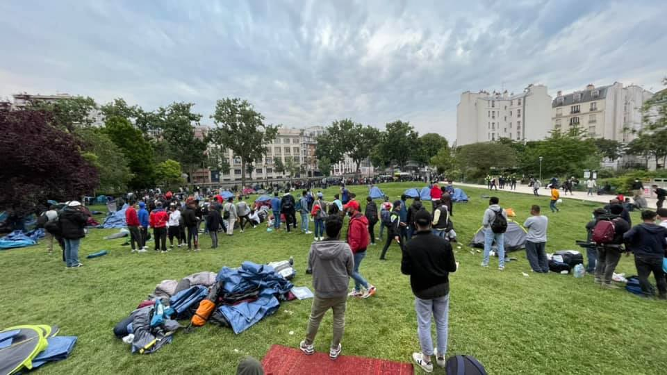
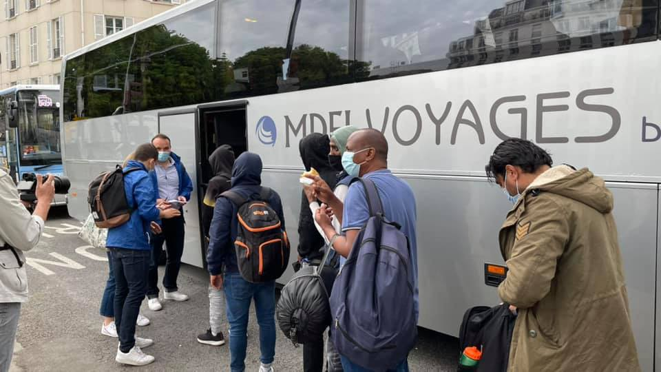
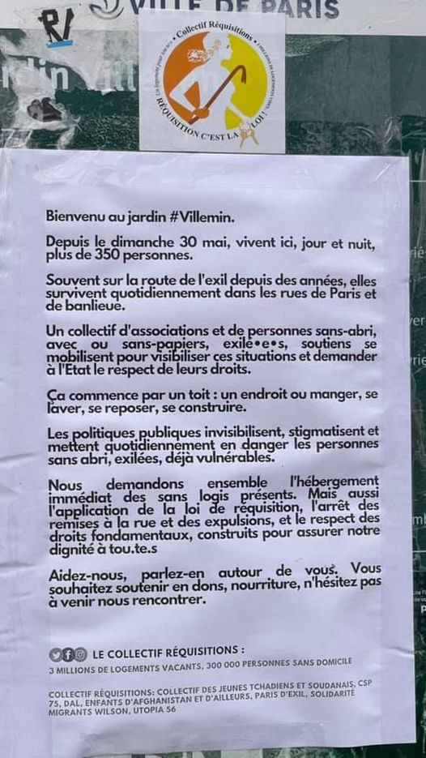
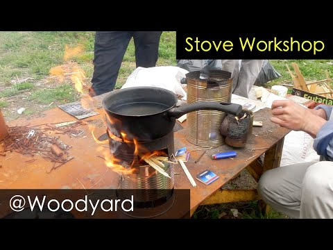
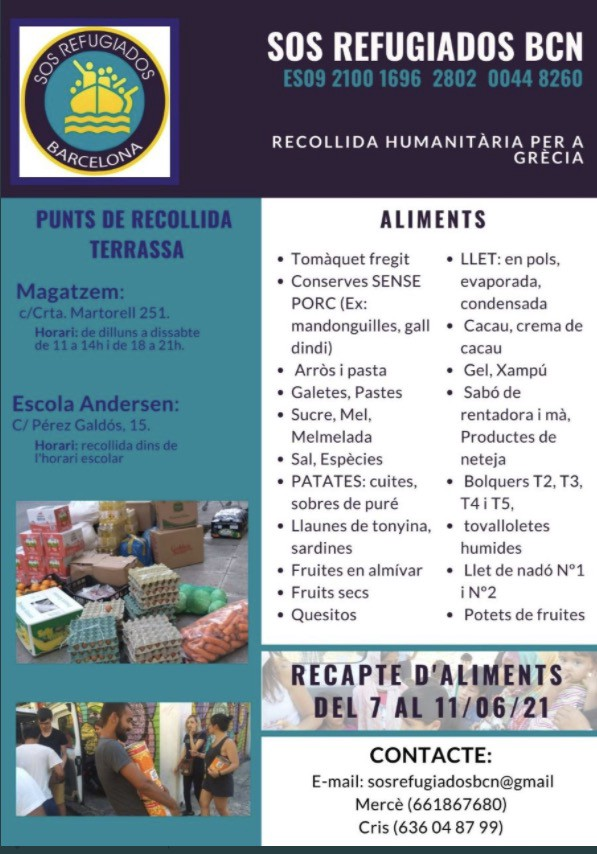
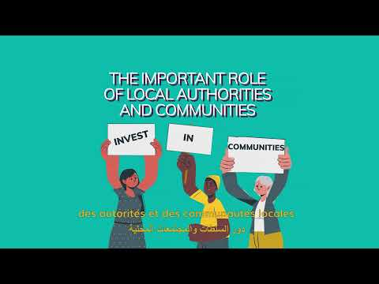

### AYS Daily Digest 2/6/21: More and more unaccompanied boys on the move
#### Germany: BAMF violated the law by unnecessarily storing personal information and checking people’s private phones, Regional Court says / Denmark pushing for foreign application centres in countries thousands of km away / Volunteer calls, workshops, recommended reads and more

Paris — homeless people on the move temporarily housed \(Photos: Solidarité migrants Wilson\)
#### Serbian activists and volunteer groups report a growing presence of children on the move\.

Info Park reports about an increase of unaccompanied boys in Belgrade, many of them under the age of 14\. All of the boys whom Info Park field teams encountered in the past week across the city’s parks came from Afghanistan and most of them spent many months on the road until they reached Serbia\. “According to their stories, they travel in larger groups, accompanied by men and other boys\. Throughout the whole journey they face various difficulties, including a high possibility of physical, emotional and sexual abuse, the risk of trafficking and related abuses, blackmailing or extortion from the smugglers and traffickers\. The majority of the boys identified by Info Park were interested in accommodation at a facility for unaccompanied children, so they were referred to outreach social workers\. All of them were provided with information on their rights and available services, legal possibilities in Serbia and asylum procedures in Serbia and other countries\.”

They also warn about the growing trend of people risking their lives under trucks and buses to try and cross the border, with several hundred people officially documented for having attempted to pass, but were prevented by the authorities\. Another worrying trend is the locals’ perception of the situation for people on the move in Serbia\. Info Park reports that an informal citizens’ group Movement for safe Sombor started a petition to move out people on the move from the private houses, hostels, hotels, train compartments, abandoned farmhouses, and village houses to the government\-run centers\. They claim that the aim of their petition is “to help migrants live in decent conditions and that town of Sombor should not host more migrants than the number of places in the reception center”\. So far, at least 2,700 citizens signed the petition\.
#### SEARCH AND RESCUE AT SEA
### At least 23 people killed in a shipwreck off the coast of Tunisia

This terrible information was shared by the Tunisian branch of the Red Crescent\.

70 people were saved in the incident\. 39 people who were on another boat that sank off the Tunisian coast near Sfax were also rescued by the local coast guard, the organisation reported\.

In Italy, the crew of the Aita Mari are having their exit permits to Burriana issued without having to wait for the end of the quarantine period\. The Salvamento Marítimo Humanitario vessel had removed 50 rescued persons in Augusta on May 17 and are now allowed to leave without further quarantine time for the crew\.
#### EU

The EU Commission is having another opportunity to examine what has been taking place in the outer edges of the EU, along its longest land border, that of Croatia with Bosnia and Herzegovina and with Serbia\.

■■■■■■■■■■■■■■ 
> **[Amnesty EU](https://twitter.com/AmnestyEU) @ Twitter Says:** 

> > The @[EU_Commission](https://twitter.com/EU_Commission) has just announced plans to overhaul the #Schengen area 🇪🇺

Perfect opportunity to make sure that countries respect people’s #fundamentalrights at the EU’s borders, where they currently face widespread and systematic violence and pushbacks. https://t.co/HU1dgPJpQJ 

> **Tweeted at [2021-06-02 10:47:37](https://twitter.com/amnestyeu/status/1400041406325002242).** 

■■■■■■■■■■■■■■ 

It seems that, in spite of all the hard evidence, reports \(those published and those that the officials have stopped from being published for now\) and the reality of the situation at the green border, along with no presence of the long\-discussed independent border monitoring system, Croatia is now entering the Schengen area, perhaps even conditioned with the actions it is now being under investigations for\.

■■■■■■■■■■■■■■ 
> **[Amnesty EU](https://twitter.com/AmnestyEU) @ Twitter Says:** 

> > The European Committee for the Prevention of #Torture has investigated the treatment of migrants, including those forcibly returned to Bosnia 🇧🇦 by Croatian officials.

But Croatia seems to be delaying publication of the report. 

> **Tweeted at [2021-06-02 10:47:40](https://twitter.com/amnestyeu/status/1400041419486736385).** 

■■■■■■■■■■■■■■ 

> The [European Commission](https://twitter.com/EU_Commission) says it is powerless to investigate EU states for Human Rights violations alleged at their borders\. Today’s proposed overhaul must ensure that they can finally be held to account for their actions\. 
 

> — _Amnesty International_ 

At the same time, the Frontex missions along the external borders and in the sea are getting all the possible space, money and blind trust from the EU:

■■■■■■■■■■■■■■ 
> **[Sergio Scandura](https://twitter.com/scandura) @ Twitter Says:** 

> > Frontex Red Carpet 💃

Praticamente si ferma un intero aeroporto internazionale per un "fate largo che atterra la Regina Dei Droni" (UAV Frontex #AS2132, nuovo giocattolino di Fabrice Leggeri che atterra a #Malta dopo la rituale missione 'a tappeto' al largo della Libia.

📷18:16 https://t.co/7E5EzvWVRW 

> **Tweeted at [2021-06-02 16:55:25](https://twitter.com/scandura/status/1400133964975808512).** 

■■■■■■■■■■■■■■ 

No Comment:

■■■■■■■■■■■■■■ 
> **[Bruno Tersago](https://twitter.com/BrunoTersago) @ Twitter Says:** 

> > Frontex message with a high WTF level https://t.co/rZqTX04IAp 

> **Tweeted at [2021-06-02 12:21:26](https://twitter.com/brunotersago/status/1400065015248523273).** 

■■■■■■■■■■■■■■ 

#### GREECE

As the reactions to the issue of pushbacks don’t cease and Greece gets a pat on the back for putting the EU policy of securitisation into practice, other alarming perspectives come into light:

■■■■■■■■■■■■■■ 
> **[Pavlos Eleftheriadis](https://twitter.com/PEleftheriadis) @ Twitter Says:** 

> > Greek government prohibits civil servants (including police) from giving truthful evidence to courts about pushbacks. Threatens criminal proceedings for civil servants not perjuring themselves before the court (in support of official government position). Incredible. https://t.co/jvrRob8LVH 

> **Tweeted at [2021-06-03 07:15:24](https://twitter.com/peleftheriadis/status/1400350386968535041).** 

■■■■■■■■■■■■■■ 

At the same time, the pressure directed at the NGOs and the media continues\. Some of the more bizarre examples include this:

■■■■■■■■■■■■■■ 
> **[RSF in English](https://twitter.com/RSF_en) @ Twitter Says:** 

> > #Greece: By taking it to a police station for questioning without a credible reason, @[hellenicpolice](https://twitter.com/hellenicpolice) obstructed a Dutch film crew working for the public media @[vpro](https://twitter.com/vpro) on pushbacks on Turkish border. @[RSF_inter](https://twitter.com/RSF_inter) urges the authorities to stop harassing journalists covering migration! https://t.co/hGqFrquXqW 

> **Tweeted at [2021-06-01 16:10:35](https://twitter.com/rsf_en/status/1399760296852459521).** 

■■■■■■■■■■■■■■ 

### Vaccination begins

Vaccination in the government run camps is starting, as we announced earlier\. Reports say that voluntary participation rate is so far reaching only up to 20% of people\. “But officials say 30% of people are under 18 so not at high risk, another 20–30% already have immunity”\.

■■■■■■■■■■■■■■ 
> **[Giorgos Christides](https://twitter.com/g_christides) @ Twitter Says:** 

> > 2/ vaccinations to take place inside camps Thursday and Friday officials told me, starting from Lesvos, Samos and Chios. Plan is to widen scope to mainland as early as next week 

> **Tweeted at [2021-06-02 11:32:04](https://twitter.com/g_christides/status/1400052592407945218).** 

■■■■■■■■■■■■■■ 

■■■■■■■■■■■■■■ 
> **[Franziska Grillmeier](https://twitter.com/f_grillmeier) @ Twitter Says:** 

> > Auch im Lager auf #Lesvos sollen die Impfungen von Campbewohner:innen Morgen beginnen. Die Stimmung im Camp bleibt angespannt. Bewohner:innen berichten, sich aus Angst vor der unhygienischen Quarantänezone nicht testen/impfen lassen zu wollen. Isolation bringt zusätzlich Stress. https://t.co/EJNsAQcOxa 

> **Tweeted at [2021-06-02 12:03:54](https://twitter.com/f_grillmeier/status/1400060604040286210).** 

■■■■■■■■■■■■■■ 

### A helpline “by refugees for refugees”

> In addition to providing psychosocial support, the team helps asylum seekers and refugees solve various problems they face, such as obtaining information about the health system, available social services, Greek language courses they can attend, how to obtain a national social security number \(AMKA\) and many other issues\. 

See [more info](https://www.unhcr.org/gr/en/20947-a-helpline-by-refugees-for-refugees-responding-to-those-in-need.html?fbclid=IwAR1kTGWrN-NwukSjjDVB8VQe8-f-9aBd_v8LqGSt3Yvkxjb2OOE2Sar-io4)
### Volunteering

[Better Life With Refugees](https://l.facebook.com/l.php?u=https%3A%2F%2Fwww.betterlifewithrefugees.org%2F%3Ffbclid%3DIwAR0UnERfFLItkpYjvO_tcmWMTBfThiSU_saHJgRp-4dQ2Km1zdCKgsUA3Jc&h=AT0IK-Qb5zxm1a6yv59DUjsqFRiYfUoyDfW92-2GY7tkWfXDEtaAWwAjpGfAvHKGxsYSYbbhmzZmWi0pmZdWTTIsdug2LzKUtlB7p5lhQKxZSIdmuNtaWUJ-7bKimtvNdQaJ70y7U0NVQA&__tn__=R]-R&c[0]=AT3eeMaWzvGvH6--HiixlsX5wFHn-DaBXboLNfEeQFM34Dvd5IrmYElDuzU_l0QEVkKXneQMbirJ8ZJidp-gqYLc8TXZqoQ_iKTipg4HtOAk4R8qm612Q59wIyQFbAkCygzP1rKjUZHyiPxd3HcTcX4awOwR5rp2FjZFdBUJyx3gKtAmlKFeQt4jmFulX3VMVqBzipXlZ4KfRttkgA) is looking for volunteers\. 
Check out their page for more info\.
#### BOSNIA AND HERZEGOVINA
### Solidarity links resulting in concrete support

Trieste’s Linea d’Ombra arrived to Una\-Sana canton with aid and support to the local team of NNK, joining them “during a particularly challenging week: constant evacuations have been happening in Bihać, while pressure on the borders is mounting in Bojna and Sturlic\. Our days have been intense and very, very full”, as they reported\.
#### AUSTRIA

Protest announcement in Wien:

](assets/57a063f293b/0*YXNLIBHNbrPCEYoS)

More info [here\.](https://www.facebook.com/events/1240044886511839/?ref=newsfeed)
#### FRANCE
### Paris

523 people on the move staying in Paris who were homeless have now been given shelter, activists [reported](http://Solidarité migrants Wilson) \.

[L’Auberge des Migrants](https://www.facebook.com/AubergeMigrants/?__cft__[0]=AZUrYRnMabcNwgmMmtT5NT_iukdV_knHnJHALkJNViqOhvfqln_Xb23c-Kfo8gX-Zz5YvYkjUsG6xlKwVV2ts_RALBB8nidle27Biu8aMYIWrzroIf3mk3bWkDNlqw8M5_zQTuzCgJs1JGvhJ03tljbf&__tn__=-UC%2CP-R) team is setting up workshops to help people learn how to make handy stuff like cooking stoves and similar useful things for themselves while in the field:

#### SPAIN
### Collecting food and other aid in Barcelona

From the 7th to the 11th of June, SOS Refugiados Barcelona will collect food and basic necessities for refugees in Terrassa\. It is the Catalan branch of SOS Refugiados, an organization born with the desire to help refugees fleeing countries in conflict\. You can contribute your grain of sand to the Andersen School and to the road to Martorell, 251\.

#### GERMANY
### Searching through phones — unlawfully

In Germany, asylum seekers have sued the country for searching their cell phones during asylum applications\. It is something thousands of people face on a daily basis, by random officers across Europe, but as the regional judges in Germany have now ruled one such search unlawful, the impact could be far\-reaching\. BAMF also violated the law by unnecessarily storing the information obtained during the search, the presiding judge said\. Read [more](https://www.infomigrants.net/en/post/32652/berlin-court-rules-searching-phone-of-asylum-seeker-was-unlawful?fbclid=IwAR253yvthA7hVMBf7uJEGjToNwuDVxm51-6O6eS1Low4Mt2I2u7tp-K1DNM) \.
#### DENMARK
### “Clearing out” from people is the idea?\!

As we have been reporting, the Danish political stance towards Syrians is getting harsh criticism from all sides, and also some indignation from the Syrian community\. Hundreds of Syrians have now [extended their sit\-in](https://www.aljazeera.com/news/2021/6/2/syrian-refugees-protest-against-denmarks-attempt-to-return-them?fbclid=IwAR0QSU9pWm-KmDPzHdSDAA-kqyGNCsPk9LQr7ii028msaFBK0SRpwhRQDoE) demonstration in front of the Danish parliament into a third week, protesting [measures](https://www.aljazeera.com/news/2021/4/20/denmark-what-may-happen-to-syrian-refugees-who-refuse-to-return) aimed at returning them to Syria\. At the same time, [a report](https://l.facebook.com/l.php?u=https%3A%2F%2Fsn4hr.org%2Fblog%2F2021%2F06%2F02%2F56281%3Ffbclid%3DIwAR2Ll6ibgwJKk8TDVG4ZG2E8PtrMqHt_KNzs2ZK8i9y9OhTThGNqJBa2ihI&h=AT3pe8reEjCEiE3buaS7s2zPS-jl2-YdZi2QR1mv5RZ9k-VC7C7pGuSeKgPbV03-ErJ-cq4Ww1QMdMknE3e4WA4Nrx-OweuyKKgir2nc70e4jU2eS63iX0Vi0s-l0wzJB09o0KgjRLHyag&__tn__=R]-R&c[0]=AT1BsX3AaLxHXZ39rPyCgONvZranx-deyjCRE3y1iezuyKyfkIZpCgsf2deJ2WWyFDlBBE34zhULKGIYps9LkyvAUiE8UzMTZOS_88HYnsnwqjJNprK7iwxggYdcqB210onzi0O-W5D36dUBeHVbvc1Ta3QaB43izdMIFm27ufmJKYn1wjZkSrOj02nZ1suXJS4_sOHLujdOhDy3mQ) has documented 162 cases of arbitrary arrest documented and tens of thousands deprived of liberty for hours to force them to vote in May 2021\.

In Denmark, there is now a political majority in the parliament backing the proposal that allows for the establishment of reception centers for asylum seekers in other countries, the newspaper Jyllands\-Posten writes\.
Denmark’s Liberal Party has informed the media that they will vote for the bill that has been presented in the Folketing by the government\. The vote is expected to take place on Thursday\.

The idea behind the proposal is that asylum seekers are flown to reception centers in other countries while their applications are processed in Denmark\. Rwanda, Tunisia, and Egypt have been mentioned as possible countries for the establishment of the centers\.

The UN High Commissioner for Refugees \(UNHCR\) has asked the Folketing to reject the proposal\.
#### GENERAL
#### 𝗥𝗲𝗳𝘂𝗴𝗲𝗲 𝗪𝗲𝗲𝗸 𝗪𝗲𝗯𝗶𝗻𝗮𝗿

[Europe Must Act UK](https://www.facebook.com/europemustactuk/posts/294471385739342?__cft__[0]=AZVMEpeVRDQmNaiLHG20xZQ9WwDIA2Ib92quJ84KuoUF9OkWMjKMTy3NPXJobMRnoVvl7kkJGlop7ybBY0mMqbfw8JH9srp1V7_SzM_i4ieOZ4mbfwyZUthfj18g6DTKdroezKIWTdfpeB7AbyeRPp7odgUfB_BZvONsxciBZOYA_x6lG6Z3JcpPARIDKspmb3I&__tn__=R]-R) is organising a webinar for June 13th focusing on the use of various forms of creative media in the Aegean to raise the voices of refugees and asylum seekers\!

#### WORTH READING
- This article contributes to the debates on de\-centring the analysis of migration governance in Europe by focusing on the potential role of the EU — find the article [**here**](https://www.tandfonline.com/doi/full/10.1080/14650045.2021.1929183?fbclid=IwAR1VXnC_mcg0LjlLh8Pd52SFUVXcWxtnrdddYfBnQar1NL1x7qUQAqpwjqM&)
- There are two contrasting images of women migrants engaged in global migration: either victims suffering from sexual violence drowning in the Mediterranean, or brave, empowered heroines supporting their families\. Such images serve a range of political, humanitarian, and economic agendas, but what are their respective implications in global migration politics?

[](https://l.facebook.com/l.php?u=https%3A%2F%2Fwww.diis.dk%2Fen%2Fnode%2F24825%3Ffbclid%3DIwAR1HVr1Cp6PobymnOboNE9U8ngKrHy82_jmqg-s0GQsUjyMvDZMskMziz2w&h=AT2FwmVLj1oaL5lAkvOSGI5Qijeb3X2Fie_YiKGl_p01dFeY2hbOY9rbsRxVjLtPPn-YBuLYG1izWlywkFVopLA7WCZRjOxqzwEuzbCWAh2JQQdGyKIH_JqoJkRnC2bZ36IENtyfkr1B2Q&__tn__=R]-R&c[0]=AT3XnnOEnh6XVv_xJSRVsPXpg5GaDWUSILVz6Fk85gCEcOhx6qfIMeqK2owWBQNYO7juws7ZOLs9MUoQaVz2Dok7DzbhB0RAYVJJdP0xl3GHTKN4wuKZgMag4PlRBROtMPe9Q4oxcpwH-QWX2muX4aywLdBbh_D0AQqleC_f4s_HplbJ3-QEmwKBGA5OnNgrDv0s6_z2B3xdr3dejqUTJFALsmE8ew)

- The story about the Sicilian fishing town of Mazara del Vallo that has had a front\-row seat to witness escalating EU efforts to curb migration across the Mediterranean, but its fishermen have paid their own high price for Europe’s strategy and its dealings with Libya:

#### **Find daily updates and special reports on our [Medium page](https://medium.com/are-you-syrious) \.**

**If you wish to contribute, either by writing a report or a story, or by joining the info gathering team, please let us know\.**

**We strive to echo correct news from the ground through collaboration and fairness\. Every effort has been made to credit organisations and individuals with regard to the supply of information, video, and photo material \(in cases where the source wanted to be accredited\) \. Please notify us regarding corrections\.**

**If there’s anything you want to share or comment, contact us through Facebook, Twitter or write to: areyousyrious@gmail\.com**

_Converted [Medium Post](https://medium.com/are-you-syrious/ays-daily-digest-2-6-21-more-and-more-unaccompanied-boys-on-the-move-57a063f293b) by [ZMediumToMarkdown](https://github.com/ZhgChgLi/ZMediumToMarkdown)._
