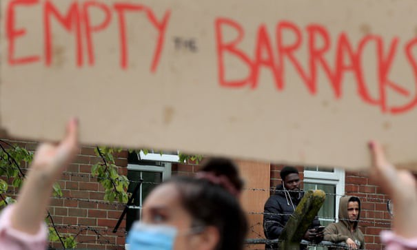
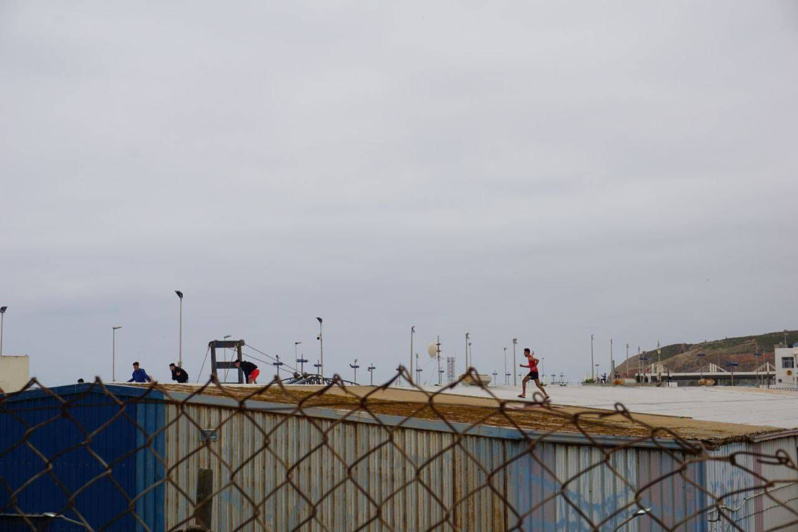
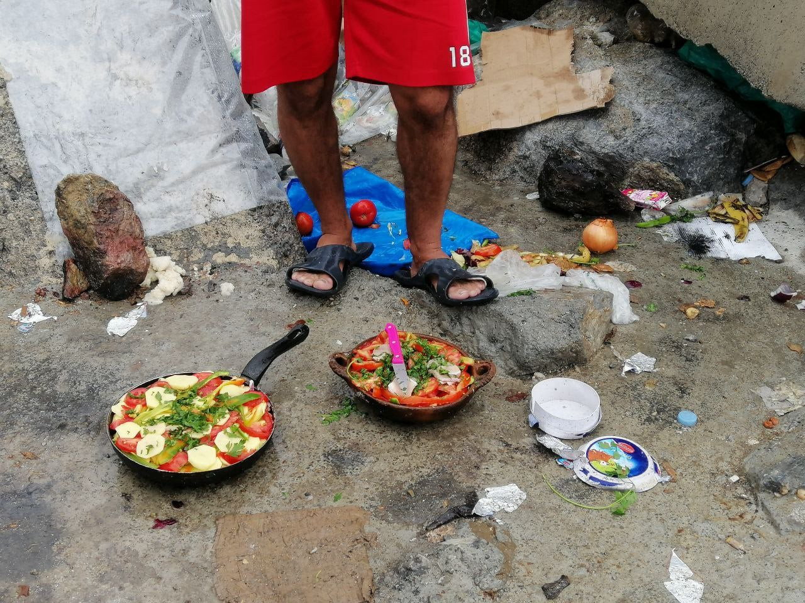

### AYS Daily Digest 03/06/2021: Napier Barracks “unlawful”, UK’s High Court Rules
### Moria 6 Trial Begins Next Week // Boats Missing off Canaries // Victory for Homeless in Paris // Denmark Passes Heinous New Law // AYS Pushes for Independent Border Monitoring Mechanism

[Are You Syrious?](?source=post_page-----b08c7f2a5421--------------------------------) · [Jun 4](ays-daily-digest-03-06-2021-napier-barracks-unlawful-uks-high-court-rules-b08c7f2a5421?source=post_page-----b08c7f2a5421--------------------------------) · 9 min read

A solidarity event outside Napier Barracks last month\. \(Photo: [Gareth Fuller/PA](https://www.theguardian.com/uk-news/2021/jun/03/napier-barracks-asylum-seekers-win-legal-challenge-against-government) \)
### FEATURE — Napier Barracks Slammed in High Court Ruling

Incredible news out of the UK yesterday: the High Court declared the infamous Napier Barracks “unlawful”, validating a legal challenge brought by six people\-on\-the\-move against the government\.

The ruling declared that the barracks are inadequate accommodations, and place people at risk of fire and contracting COVID\-19\. Additionally, the judge ruled that the government’s process for selecting people to be accommodated at the site was flawed and unlawful\. Finally, the court said that residents of the barracks were unlawfully detained there under supposed Covid restrictions\.

“We are delighted with this judgement, which follows long months of the Government ignoring a mountain of evidence and complaints that the Barracks are not only unsuitable, but highly damaging, to vulnerable people entrusted to their care”, [Care4Calais](https://web.facebook.com/care4calais/photos/a.1047087828657507/4401366033229653/) wrote on Facebook\.

The group noted, however, that over 265 people remain in Napier Barracks today and reported that the government “intends to increase numbers up to 337\.”

“It is disappointing that evidence provided by NGOs and regulators was ignored for so long and it has taken legal action to reach this verdict\. However today Napier barracks remains in use and our goal must be to get those inside moved to suitable accommodation as soon as possible\. Penally was closed and Napier should be too”, the Care4Calais post continued\.

The legal claim was initiated by six asylum seekers who were accommodated in the barracks between September 2020 and February 2021, all of whom were victims of trafficking and/or torture and whose mental health severely deteriorated during their time at Napier\. After their legal case was opened, the six men were transferred to alternative accommodation, according to Care4Calais\.

On Thursday, Justice Linden of the High Court ruled in favor of the six men in a decision that referenced overcrowding at the facility and other concerns\.

“Whether on the basis of the issues of Covid or fire safety taken in isolation, or looking at the cumulative effect of the decision\-making about and the conditions in the barracks, I do not accept that the accommodation there ensured a standard of living which was adequate for the health of the claimants,” Justice Linden said, according to [media](https://www.theguardian.com/uk-news/2021/jun/03/napier-barracks-asylum-seekers-win-legal-challenge-against-government) \.

“Insofar as the defendant considered that the accommodation was adequate for their needs, that view was irrational\.”
### SEA
### Shipwreck off Tunisia
### GREECE
### Moria 6 trial begins next week

The trial of the six teenagers charged with burning down Moria last September will begin next week, on June 11, on Chios\.

“Rather than seeing the fire as an inevitable disaster in a deadly camp infrastructure, the Greek state arrested six young Afghan migrants and presented them as the culprits and sole cause for the fire, attempting to stifle further public debate on the living conditions inside the camp and the political responsibility”, a post from [NoBlogs](https://freethemoria6.noblogs.org/english-call-for-a-fair-and-transparent-trial-for-the-accused-moria-6-based-on-the-presumption-of-innocence/?fbclid=IwAR0qXvQFj2sBOgvENmh6gvgZieelFJ1RUkLWNO4weXaG2vDGXEC-DAsB1sg) reads\.

Legal Centre Lesvos and HIAS will represent the defendants\. There will be solidarity events organized in Mytilini on the day of the trial, and a press conference/presence in the court on Chios\.

A solidarity campaign has been launched to push for a fair and free trial\. **All groups who want to sign the petition can send an email by June 5 at the latest to freethemoria6@riseup\.net\.**

Everyone is encouraged to use the hashtag **\#FreeTheMoria6** \.
### Europe Must Act: \#RaisingVoices from the Greek Islands:
### link: [fb\.watch](https://fb.watch/5VGJZMD0eG/)
### ITALY
### In Memory of Musa Balde
### [Facebook](https://www.facebook.com/plugins/post.php?href=https%3A%2F%2Fwww.facebook.com%2FInfoMigrants%2Fposts%2F3836047499850340&show_text=true&width=500)
### [Activists hung a banner in memory of Musa Balde from a building in central Rome yesterday\. The young migrant committed…](https://www.facebook.com/plugins/post.php?href=https%3A%2F%2Fwww.facebook.com%2FInfoMigrants%2Fposts%2F3836047499850340&show_text=true&width=500)
### SPAIN
### Three boats missing off Canaries

Alarm Phone [reported](https://www.facebook.com/plugins/post.php?href=https%3A%2F%2Fwww.facebook.com%2Fwatchthemed.alarmphone%2Fposts%2F2964584077149149&show_text=true&width=500) that three boats are currently missing off the Canaries\.

One of the boats left from Dakhla, Western Sahara, on May 31, carrying 29 men\. There is still no sign of this wooden boat\.

A second boat departed also on May 31\. It is a ‘pirogue’ with 36 people on board : 16 women and 20 men\. They departed from the coast of Western Sahara and there is no sign of them\.

A third boat carrying 52 people, among them 9 women and two infants, departed from Laayoune, Western Sahara on June 2\.

Alarm Phone says authorities are aware of all three cases\.
### Ceuta updates

Photos: [Asociación Elin](https://web.facebook.com/Asociaci%C3%B3n-Elin-823993751031786/?__cft__[0]=AZUpByPz50eKFIini8-8rmGGU5gR2I-7-ZSiYOthjGLBtVeZAxVrIwHtPC_QzylfbKvhsSrU2qzXA9ArluET8pfpCW85xGL65qS7Z0UPaCo8EyowldweofrO95xB2p--jI6Sa_JhDwsVVa6UsSYpNyG4GY2xjIVR5RmsB0GkCP3nYwx0q8-GA5rzAjIXakE6Xu81pxRp_OgfQaepGxocp9boeqKRpJ7Z900GEbP9RgegeG-nlpGcg6xJV6yzMpxaSSL_RexRCsZq8KS7eFXhtdB-&__tn__=kK-y-R) and Irina Samy \(No Name Kitchen\)

> _From the [Asociación Elin](https://web.facebook.com/Asociaci%C3%B3n-Elin-823993751031786/?__cft__[0]=AZUpByPz50eKFIini8-8rmGGU5gR2I-7-ZSiYOthjGLBtVeZAxVrIwHtPC_QzylfbKvhsSrU2qzXA9ArluET8pfpCW85xGL65qS7Z0UPaCo8EyowldweofrO95xB2p--jI6Sa_JhDwsVVa6UsSYpNyG4GY2xjIVR5RmsB0GkCP3nYwx0q8-GA5rzAjIXakE6Xu81pxRp_OgfQaepGxocp9boeqKRpJ7Z900GEbP9RgegeG-nlpGcg6xJV6yzMpxaSSL_RexRCsZq8KS7eFXhtdB-&__tn__=kK-y-R) and No Name Kitchen we denounce the inaction and inhumanity of the Government of Ceuta, Spain and the institutions of the European Union because of the situation that migrant people who arrive in our city are experiencing\._ 

> _We’re continually finding migrant people of sub\-Saharan origin who are in a street situation because they can’t access the Immigrant Temporary Stay Center due to lack of space for lockdown\. This collapse is being sparked by the lack of spaces enabled by the Autonomous City for this purpose\._ 

> _Until Monday, May 17, migrant people arriving in Ceuta were carrying out several days of quarantine in the Tarajal ships destined for it before accessing the CETI, however, after all the events, this resource for adults has missing and no alternative given\._ 

> _Several days ago, ′′ D\.” from Guinea Conakry arrived in Ceuta\. Four days later he’s still sleeping in the street\._ 

> _′′ M\.” another young Guinean, arrived yesterday in the same condition\._ 

> _′′ B\.” arrives yesterday morning to the Tarajal ships, badly injured by concertines and with a very serious blow to the foot that prevents him from walking\. He spends 14 hours sitting in a chair without health care, 14 hours without anyone giving him information or speaking in a language he can understand\._ 

> _′′ S\.”, ′′ I\.” and ′′ I\.” three young people of the same nationality as previous ones, also injured, wait outside CETI’s door at 22 p\.m\. There they tell them that they have to go to the Tarajal ships, where it is certain that two weeks have not been confined or hosted to persons who are not underage\._ 

> _We condemn the great uncoordination, misinformation and lack of consideration for these people, who, thousands of miles from their homes and their families and, after years of route, are condemned to spend the first days in Europe on the street\._ 

> _We consider that this situation also transcends the personal situation of each migrant person and becomes a matter of public health because the conditions in which they are found do not comply with any of the sanitary measures preventing the contagion of COVID\-19\._ 

> _We ask that the Autonomous City of Ceuta enable a worthy space to quarantine migrant and refugee people and facilitate access to the Immigrant s’ Temporary Stay Center\._ 

> _The European Union, while and once again, ignores that we are in EU territory \(although not Schengen\) and that there are international agreements signed with the aim of respecting and ensuring human rights\._ 

> _Many children continue to live on ships\. According to official reports, there are 400 minors\. We’ve heard from a boy that yesterday fell off the roof of a ship trying to escape\. He fell from a height of nine meters and suffers from cranial polycontusions, according to information he adds that he is serious\. He has been taken to a hospital in Cadiz\. If they try to escape it’s because they complain about the living conditions on those ships\. Photojournalist Javier Bauluz showed a few days ago how children were sleeping on shelves of those ships, in the absence of beds\. Meanwhile, from different Autonomous Communities of Spain there are groups reminding the government that there are first\-place centers with free places\. But the decision has been to leave people locked in town with no alternatives\._ 

> _We estimate that there are between 500 and 1\.000 people living in the streets of Ceuta\. Some hidden for fear of more returns to Morocco\. Others waiting for the opportunity to seek asylum, to seek international protection since returning to Morocco or their country of origin can be life\-threatening\._ 

### FRANCE
### A small victory for the homeless in Paris

Over 400 people who had been sheltering in the Villemin garden in Paris since Sunday were given housing yesterday\. Read more about the victory [here](https://www.infomigrants.net/fr/post/32707/evacuation-du-jardin-villemin-plus-de-500-migrants-mis-a-l-abri?ref=tw_i&fbclid=IwAR2nCQNCUmEbH4mpPbWXupbOWj21VSop1fAanQYbT4AeqQjpmg_su8klYAs) \.
### New app to help PoM launched

‘FinDaWay’, a new app to help people\-on\-the\-move in France, has been [launched](https://www.infomigrants.net/en/post/32428/findaway-new-app-to-help-asylum-seekers-in-france?fbclid=IwAR2WkBwsH7Eg6xAC3AQRZJd74w_8QLKnGFjOFKGIuqnoA5zOMJ6CXqDVo20) \. The app offers information about administrative procedures and general information about life in France\. Launched in mid\-May in the Var department in southeastern France, the system is available in six languages \(French, English, Russian, Arabic, Spanish and Pashto\) and can be downloaded free of charge on iOS and Android devices\.
### DENMARK
### Law Passed to Relocate Asylum\-Seekers to Third Countries

We at AYS have been covering Denmark’s troubling backsliding on human rights for some time now, as the country has moved to send groups of recognized refugees back to Syria\.

Now Denmark has made perhaps an even sharper turn to the right in its decision this week to relocate asylum\-seekers outside Europe to wait for their claims to be processed\. This extremely worrisome development has been heavily covered in [mainstream media](https://www.theguardian.com/world/2021/jun/03/denmark-passes-law-to-let-it-relocate-asylum-seekers-outside-europe?fbclid=IwAR1ryQCSw5jFGjikFNDQFmbpNhOkhNpKmfl8yWK_1nzBTYuWZ04mpRoQT8U) , but we wanted to echo other voices in denouncing this heinous policy\.

The UNHCR, too, [expressed its concern](https://www.unhcr.org/news/press/2021/6/60b93af64/news-comment-un-high-commissioner-refugees-filippo-grandi-denmarks-new.html?fbclid=IwAR27cM2zgWQ47TkjkhICkCcFlzXtY7xTlk7wsndNJmHR9q2f4gRJ3HikC0M) , saying it “strongly opposes efforts that seek to externalize or outsource asylum and international protection obligations to other countries\. Such efforts to evade responsibility run counter to the letter and spirit of the 1951 Refugee Convention, as well as the Global Compact on Refugees where countries agreed to share more equitably the responsibility for refugee protection\.”

All of the above are empty words, though\. We know that Europe has long violated its own migration policies and will continue to do so\. UNHCR has no real power over European government policies\. The change is that now Europe is doing this in broad daylight and with the majority consent of the parliament of an EU country\.
### GENERAL
### Are You Syrious/BVMN Push for Independent Border Monitoring Mechanism

A representative of Are You Syrious/Border Violence Monitoring Network participated yesterday in a high\-level meeting on ensuring respect for the human rights of migrants at borders, organized by the European Network of National Human Rights Institutions\.

In an exchange with Petra Maroša \(JHA Counsellor for visas and borders, Permanent Representation of the Republic of Slovenia to the EU\), Matthias Oel \(Director for Borders, Interoperability and Innovation, DG HOME, European Commission\), and Eva Tzavala \(ENNHRI’s Asylum and Migration Working Group Chair; Legal Officer at Greek National Commission for Human Rights\), we took a strong stance against the current border policies and asked for the establishment of truly independent, functioning border monitoring mechanism\.

The AYS representative said the following in the meeting:

> _A truly independent monitoring mechanism should be led by the National Human Rights Institutions, in collaboration with monitoring NGOs on the ground, and with involvement of the Fundamental Rights Agency and Council of Europe\. The mechanism should be funded directly by the Commission or through an independent agency, to avoid political pressure from the national authorities that have the power of distributing the EU funds to their preferred NGOs\[…\]Such a monitoring mechanism would benefit from an alarm system that could be triggered by potential asylum seekers in situations where their fundamental rights are violated\[…\]_ 

> _In addition to that, we urge Human Rights Institutions to independently take a more proactive stance in investigating pushbacks, to insist on better monitoring and accountability mechanisms, and to provide more support to targeted human rights defenders\. We urge them to trigger investigations against law enforcement according to their mandates, to start collaborating in cross\-border investigations that take in account testimonies of victims in the border areas, and to strengthen peer\-review mechanisms among the Ombudspersons offices\._ 

In late March of this year, BVMN co\-signed a letter to Commissioner Johansson alongside several other organizations to push for an independent monitoring mechanism\.

The letter put forward a firm stance on border monitoring, stating that the implementation of these mechanisms, particularly in the case of Croatia, should be fully compliant with fundamental rights, and that they should be “independent, meaningful and effective” to ensure violations at borders are fully investigated\.

The full text of the letter can be found [here](https://www.ecre.org/wp-content/uploads/2021/05/NGO-Letter-Croatia-Border-Monitoring-Mechanism-March-2021.pdf) \.
### Find daily updates and special reports on our [Medium page](https://medium.com/are-you-syrious) \.

**If you wish to contribute, either by writing a report or a story, or by joining the info gathering team, please let us know\.**

**We strive to echo correct news from the ground through collaboration and fairness\. Every effort has been made to credit organisations and individuals with regard to the supply of information, video, and photo material \(in cases where the source wanted to be accredited\) \. Please notify us regarding corrections\.**

**If there’s anything you want to share or comment, contact us through Facebook, Twitter or write to: areyousyrious@gmail\.com**

_Converted [Medium Post](https://medium.com/are-you-syrious/ays-daily-digest-03-06-2021-napier-barracks-unlawful-uks-high-court-rules-7c80e2b4ff03) by [ZMediumToMarkdown](https://github.com/ZhgChgLi/ZMediumToMarkdown)._
