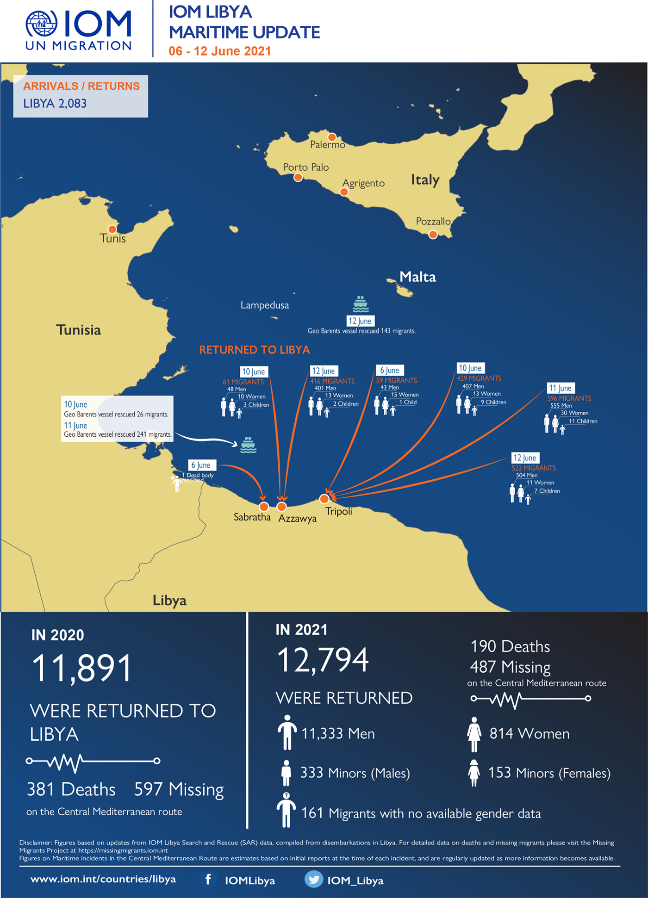
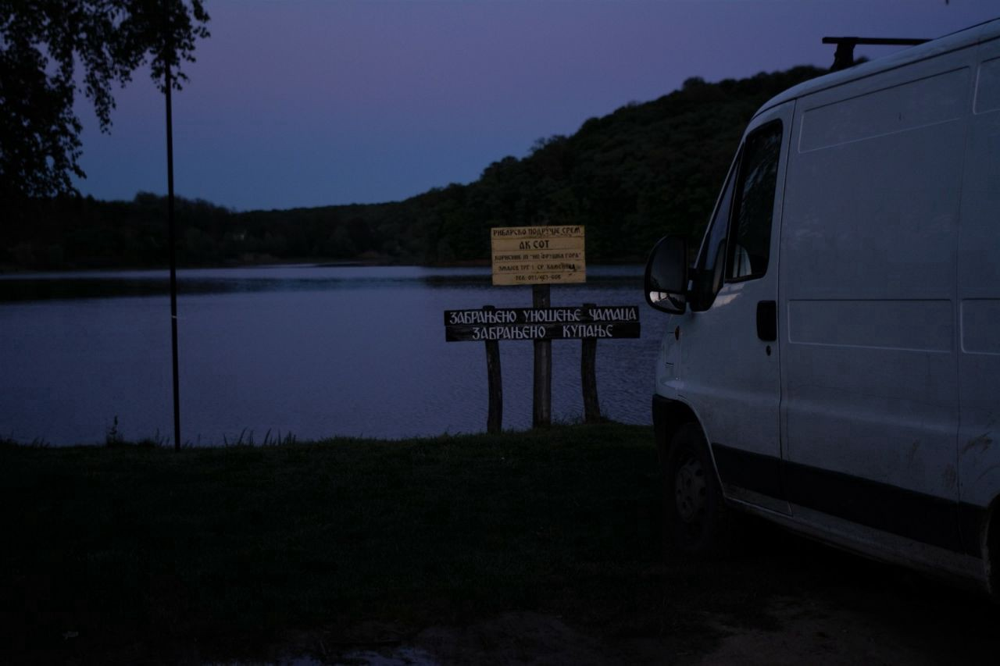
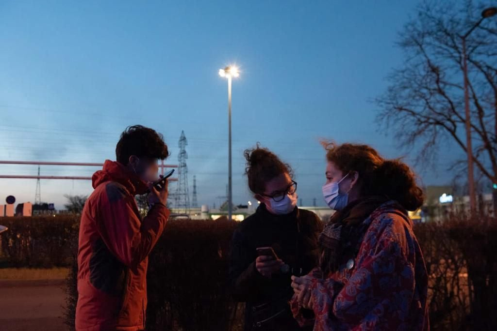
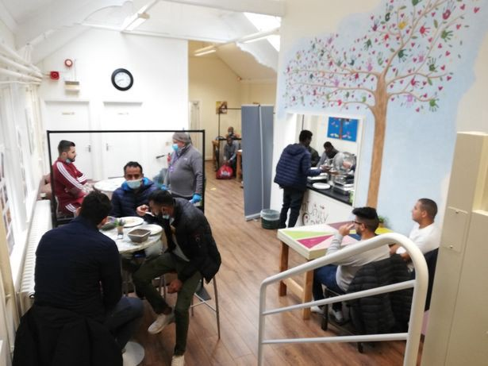

### AYS Daily Digest 14/06/21: Trial against ‘Moria Six’ not up to legal standards
### Watch out for Austria externalizing borders // conviction of smuggler in Libya // updates in Serbia and France // lots of government problems in the UK // and more…

[Are You Syrious?](?source=post_page-----7c0f4f67b8af--------------------------------)

[Jun 15](ays-daily-digest-14-06-21-trial-against-moria-six-not-up-to-legal-standards-7c0f4f67b8af?source=post_page-----7c0f4f67b8af--------------------------------) · 7 min read

Photo by Freedom for the Moria 6 who said in a press release 13/06/21 “Yesterday’s verdict came as no surprise to international trial observers who criticized the lack of evidence and spoke of an unfair trial procedure\. Only 15 people were allowed in the courtroom\. The public, including journalists, a delegation of international observers, and a representative of the UNHCR, was prevented from observing proceedings\. At least six police officers were in the room — a disproportionate number that was not necessary to secure the court\. A strong crowd of people showed their support for the defendants in the front of the court building\.” More [here](https://freethemoria6.noblogs.org/) \.
### FEATURE: “Lawyers and activists slam Greek court’s proceedings and decision to sentence four teenage Afghan refugees to 10\-years in an adult jail”

Civil Fleet Reports on the Moria fire trials and how they were not up to legal standards:

> _“The trial of four Afghan teenagers jailed for 10 years each for starting a fire that destroyed a much\-criticised refugee camp last year was not up to legal standards, observers have said\. The youths were found guilty on Saturday of ‘arson with risk to human life’ for the fire that broke out at the vastly overcrowded Moria refugee camp on the Aegean island of Lesbos\._ 

> _Greek authorities left about 12,000 people without help for days after the camp, originally built to house 3,000, was destroyed by the blaze before a new camp was hastily built on a former military firing range\. The charges were brought against six Afghan youths — known to campaigners as the Moria Six — last year, and two of them were sentenced to five years in a juvenile prison in March\._ 

> _When the latest trial began on Friday, the court blocked all members of the public — including journalists, legal observers and a representative from the United Nations rights agency \(UNHCR\) — from attending\. None of the 15 prosecution witnesses who testified against the youngsters had seen them on the night of the fire\._ 

> **_‘The only witness who identified the accused did not present himself to the court\. His written testimony was full of inconsistencies,’_** _the youths’ lawyer Natasha Dailiani said on Saturday\._ 

> _Despite the fact that three of the youths were under 18 at the time of fire, the judge rejected the defense’s application on Friday to try them in a juvenile court, meaning they will carry out their sentence in an adult prison\. After the trial, defense lawyer Effie Doussi said: ‘We will exhaust all legal remedies to ensure that the accused get a fair trial and a clear verdict showing that they are innocent\.’”_ 

[Read in full here](https://thecivilfleet.wordpress.com/2021/06/13/moria-fire-trial-was-not-up-to-legal-standards/?fbclid=IwAR3Np3t8yILQ2NVgiyiWHXrqDkxh2Xq0rFWWqUDJXbf3EsWb3IE_x_X0LAA) \.
### LIBYA
### SEA

Photo by [IOM](https://www.facebook.com/IOMLibya/photos/a.596682760492685/2024392947721652/)
### GREECE
### 40 NGOs denounce Greece’s decision to deem Turkey “safe”

They state: _“The substantive examination of asylum applications is the only safe solution for refugees\.”_

> _“With a new Joint Ministerial Decision \(JMD\) issued on 7 June,\[i\] the Greek State designates Turkey as a “safe third country” for families, men, women and children of five nationalities\[ii\] seeking international protection in Greece\. It is noted that the JMD applies even to those from countries with high recognition rates for international protection, such as Syria, Afghanistan and Somalia\. \[iii\] This decision reinforces the policy established by the March 2016 EU\-Turkey Statement that shifts the responsibility to protect refugees, including unaccompanied children,\[iv\] arriving in Europe to third countries\.”_ 

[Read in full here\.](https://greekhelsinki.wordpress.com/2021/06/14/2-121/?fbclid=IwAR2YYYTUhnnbejJ_A3gKPDUTvZURNNHw1BDw-6LYXG7JKUmT9AW9eyNdM2w)

[Amnesty International’s](https://www.amnesty.gr/news/articles/article/24450/ellada-i-toyrkia-den-einai-asfalis-gia-toystis-aitoyntesses-asylo?fbclid=IwAR1x9P03Rh80miGj9E0s-aOoVPoHTMkGILJGoRQx7D1Eu1nXP7QYC-ux4Mc) Glykeria Arapi, director of the Greek Section, said:

> _“This decision is another dangerous step towards dismantling asylum in Europe\. Greece reveals its brutal intentions to deny protection at all costs, designating Turkey safe for even more nationalities…”_ 

Photo by [Velos Youth](https://www.facebook.com/velosyouthathens/posts/2656077604689859)
### SERBIA

“News from Šid:
Here the situation seems to be getting worse week after week, despite the strength and the resistance of the people on the move we meet are extremely impressive\. The people on the move keep stuck here\. There are no safe ways to move on in order to ask for asylum\. They Tell It is very difficult crossing any border\. Also It is complicarse for them to move inside the country\.
Some of the people who are here in Serbia since weeks or months, after being repeatedly pushed\-back by the Croatian border forces, as they explain, they are telling how they are looking to try to seek path and try to reach a place where to apply for asylum by different ways\. Serbia is not really an option to stay: if you look the data, very few asylum protections are give every year\. The EU does not offer a way to people so they can migrate safely\. And around Serbia people on the move find very hostiles borders\.
The border with Bosnia, where the way leads through the Drina river, which has become famous for the death of dozens of people who tried to cross it swimming or with barely floating dinghies\. In the east and north of Serbia there are the borders with Romania and Hungary\. In this last country a metal fence stands along all the border with Serbia\. It has been erected in 2015 when Victor Orban, the PM of the Hungarian government, claimed that the EU is not doing enough to solve the “migration crisis” and stop the ‘influx of illegal migrants\.’” Read Update by No Name Kitchen in full [here\.](https://www.facebook.com/NoNameKitchenBelgrade/posts/1257407821324166) Photo by Erica Castiglione
### AUSTRIA
### Watching how Vienna’s International Centre for Migration Policy Development \(ICMPD\) externalizes Austria’s border control

Naceur continues _“ **ICMPD’s expansion substantially accelerates since its current director Spindelegger took over in 2016** \. Under his leadership, ICMPD\-s staff almost doubled, its annual budget tripled and the number of duty stations rose from 19 to 30’\. Spindelegger called ICMPD an ‘intergovernmental mediation platform & think tank for future migration policy issues\.’ In contrast, others refer to it as a ‘leading consultancy institution that aims at the Europeanization of migration policies’ & a ‘neoliberal political project\.’”_ [More from Naceur’s thread here\.](https://twitter.com/SofianNaceur/status/1404368812451975170)

**Austria is also expanding its police presence in Serbia\.** The government is worried about the increase of people coming from the Balkans\. Read about it [here](https://www.krone.at/2401059?fbclid=IwAR38-OYwileHs_2XxK4-eIEpJupjfXRYYkciC0LgE-yREuTd4lAvRL83UaA) \.
### FRANCE

“Night from June 13th to 14th,
23 pm: Two exiled people, one being minor, call us Gravelines as they are lost after jumping out of a truck that was heading the wrong direction\. After 7 hours of walking and a night without sleeping or eating, they can’t move on\. They are asking for our help\.
00 pm: A couple, whose wife is 8 months pregnant, calls us from Loon\-Plage following an attempted boat passage that resulted in failure\. The woman is extremely weak\. They are asking for our help\.
2: Eight exiled people in respiratory distress call us as they are stuck in a truck driving near Bergues in the wrong direction\. They are asking for our help and we are calling on law enforcement to intercept the truck and get the stranded people out\.
2 pm: An exiled person calls us from Offekerque\. Man just got assaulted by a road driver and needs transportation to hospital\. He’s asking for our help\.
4 pm: An unaccompanied minor is detained by police at the border following an attempted truck crossing\. Despite the fact that he informs his minority’s law enforcement, his latter refuses to direct him towards child protection\.
4 pm: Around 4 people call us following a wreck\. They had to swim the coast\. They need dry clothes, blankets and emergency food\.
4: An exiled person sends us his location, in the middle of the Channel, somewhere between France and England\. Her phone is cutting off\. Utopia 56 team is asking for coastguards, but they won’t find any boat… Since then, no more news\.
\*
Tonight, like every night on the northern coast of France, hundreds of people tried their luck to flee France and join England\. Sadly some find themselves in distress while crossing\. Utopia 56 Grande\-Synthe teams are present every night to provide emergency assistance\.” Photo and Info by [Utopia 56 Grande\-Synthe](https://www.facebook.com/utopia56grandesynthe/posts/333136725066213)
### SPAIN

No Name Kitchen comes with an important report on the state of unaccompanied minors in Ceuta
### UK
### Refugee week started Monday

There is some good news this refugee week: Ceredigion has successfully hosted many Syrians refugee families over the past five years\. Learn more about their solidarity efforts [here](https://www.tivysideadvertiser.co.uk/news/19371364.welcome-hillsides-syrian-refugees/?fbclid=IwAR1EzxDtsTI235qSMeI87IcIRdC5SDOImEyQ-yXUJvINokoD2gvMQg3N9oo) \.

Also NGOs are coming together to take a strong stance against Priti Patel’s hard line\. Read more about it [here](https://hastingsonlinetimes.co.uk/hot-topics/campaigns/refugee-support-groups-unite-to-oppose-patels-hard-line-against-asylum-seekers?fbclid=IwAR2GnPbN9WRBdexJDaAjo6Le9hUBTGxs3W8RdtNfzCP-Xgi0IRfrKLV-p_U) \.
### “The asylum seekers left to go hungry after cash card delays”

Huck mag reports: “A Home Office error over a new card changeover has left thousands of asylum seekers penniless, as well as placing a huge strain on migrant charities forced to step in where the Government has failed to\.”

> _“Asylum seekers get a paltry £39\.63 a week on a type of debit card called an ‘Aspen card’\. These were governed by a private company called Sodexo, until a new contract was taken over on May 21 2020 by Prepaid Financial Services \(PFS\), meaning all cards had to be replaced\._ 

> **_It was during this changeover period that cards were not turning up, could not be activated, had wrong names printed or had zero funds\. And close to three weeks later, the situation has still not been resolved, nor have the Home Office publicly acknowledged what charities are now calling a crisis\._** 

> _Around 61,000 asylum seekers receive Home Office financial support and more than 55,000 use Aspen cards\. Asylum seekers are banned from working to supplement the Home Office money and they cannot open UK bank accounts so can only receive extra money from friends, family or charities as cash\-in\-hand\. The botched rollout has left people penniless and hungry\._ 

> _Charities have been firefighting the fall\-out of this and stumping up the money to ensure everyone has some food\. ‘Although this situation is unique because it’s happened all at once, we have seen The Home Office failing time and time again\. We are quite used to stepping in and having to rally the troops of volunteers,’ says Imogen McIntosh, founder and director of Bristol\-based humanitarian organisation, Aid Box Community \(ABC\) \._ 

> **_Many are asking why this was allowed to happen\. The government knew there would be a changeover period, so surely some technical issues were foreseen\._** _A Home Office spokesperson said to Huck: ‘We have worked closely to develop customer services processes and plan for a number of eventualities\.’ It’s a statement at odds with reality\.”_ 

[Read in full here\.](https://www.huckmag.com/art-and-culture/the-asylum-seekers-left-to-go-hungry-after-cash-card-delays/?fbclid=IwAR1TA-mOwU_3GSsoCHYL6KDOJoq2mOG0tAw7x8dwxpa3ZoD2hD_s907PeAo)

“The Cheshire, Halton & Warrington Race & Equality Centre \(CHAWREC\) hold a weekly drop\-in session where they provide, English classes, food, clothing, support and advice for asylum seekers and refugees in the area\. They are in ‘desperate need of funds’ to continue their work\.” Please learn how you can help here\! Photo by [CHAWREC](https://www.cheshire-live.co.uk/news/chester-cheshire-news/group-supports-asylum-seekers-cheshire-20783772?fbclid=IwAR0R0yw7iuijo8AW7XECOQX7AScpBSeIDXDLHNZsCAeYHs8BiMOK03Ypew4)
### What’s going to happen to unaccompanied minors arriving in Kent now?

Kentlive reports:

> _“Fears have been raised that unaccompanied child refugees arriving in Dover will be ‘detained’ at a controversial facility\. It comes after **Kent County Council announced on Thursday \(June 10\) that it no longer has capacity to care for unaccompanied children arriving** on small boats\._ 

> _The announcement has left some of the most vulnerable people making their way to the UK in a state of limbo, unable to be housed in safe and secure accommodation\. Council leader Roger Gough said he was ‘profoundly saddened’ at the situation — the second time it has arisen in the last year\._ 

> **_Under the previous National Transfer Scheme, the government would help local councils deal with the administrative and practical side of housing asylum seekers, and allowed for transfers from areas like Kent — which see a large number of entries — to other parts of the country\. However, this scheme was disrupted by COVID\-19 and funding issues\._** _For the last two years Kent’s ability to take care of these vulnerable young people, many of whom will be granted asylum in the UK, has been stretched to ‘breaking point\.’_ 

> _Last week Cllr Gough blamed the government for not taking action, adding that the council’s support resources have become ‘significantly overwhelmed\.’”_ 

[More here](https://www.kentlive.news/news/kent-news/kent-can-no-longer-help-5519824?fbclid=IwAR2x5mCaa3DPfHGGxqL7Kkjehgk2vtIeAMf4rQmSfNBgR_iMvuLNgKcRt8E) \.
### “Home Office condemned for forcing migrants on bail to wear GPS tags”

The Guardian reports:

> _“More than 40 human rights organisations have condemned the Home Office’s introduction of 24\-hour GPS monitoring of people on immigration bail in an expansion of surveillance powers that has involved no consultation process\._ 

> _The new policy marks a shift from using radio frequency monitors \(which alert authorities if the wearer leaves an assigned area\) to round\-the\-clock GPS trackers \(which can track a person’s every move\), while also giving the Home Office new powers to collect, store and access this data indefinitely via a private contractor\._ 

> _Rudy Schulkind, at Bail for Immigration Detainees, said: ‘This is effectively an extension of immigration detention beyond the physical walls of the detention centres and prisons…This regressive and authoritarian policy is wholly inappropriate in a country that claims to uphold the right to liberty\.’”_ 

[More here](https://www.theguardian.com/global-development/2021/jun/14/home-office-condemned-for-forcing-migrants-on-bail-to-wear-gps-tags?fbclid=IwAR0uXjvUwHoeJv6JKLg5H4Egi6Up3ONAg5kgclRk-xjIv66UC0oh2Tq1lfM) \.
### Find daily updates and special reports on our [Medium page](https://medium.com/are-you-syrious) \.

**If you wish to contribute, either by writing a report or a story, or by joining the info gathering team, please let us know\.**

**We strive to echo correct news from the ground through collaboration and fairness\. Every effort has been made to credit organisations and individuals with regard to the supply of information, video, and photo material \(in cases where the source wanted to be accredited\) \. Please notify us regarding corrections\.**

**If there’s anything you want to share or comment, contact us through Facebook, Twitter or write to: areyousyrious@gmail\.com**

_Converted [Medium Post](https://medium.com/are-you-syrious/ays-daily-digest-14-06-21-trial-against-moria-six-not-up-to-legal-standards-77b25505b682) by [ZMediumToMarkdown](https://github.com/ZhgChgLi/ZMediumToMarkdown)._
