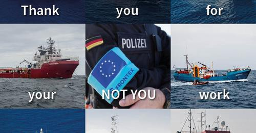
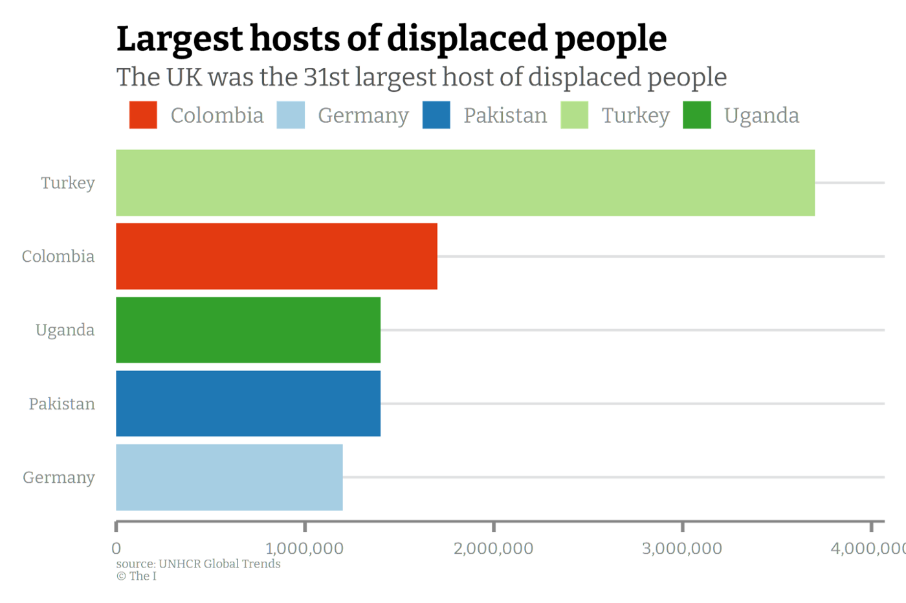

### AYS Daily Digest 18/6/21: Traumatised children, families torn apart — today’s concrete consequences of a lack of political will
### Potsdam to become a welcome city / New evictions in the north of France / Spain: Racist attacks in Murcia, 2 people dead; 4 died off the coast of Lanzarote / Danish policies separating Syrian families / UN criticizes UK policies / Recommended reads & more

[Are You Syrious?](?source=post_page-----a3710431a6e6--------------------------------)

[Jun 19](ays-daily-digest-18-6-21-traumatised-children-families-torn-apart-todays-concrete-a3710431a6e6?source=post_page-----a3710431a6e6--------------------------------) · 11 min read

Evicting people from makeshift campsites during police raids in the Grande Synthe area \(Photo: [Utopia 56 Grande\-Synthe](https://www.facebook.com/utopia56grandesynthe/?__cft__[0]=AZUG8L4duQrncf3ZaT-jLPSMsopBXE_CR2krRhxr_9J4aY4iD7uAQC7_T-dbz_BZAkIcMQHstiHz_fuN6KmxECBWooMnBlFstDUs-w_uc4NPejUvQcn5asGidEPmvf4wk2PeABMKmBS-D2S5a7smDGg1NGO_IASJzRL6G0d9eeFyUgZWenYCI4rsWB3Dh4I2aqPmGBMiX4D85Wqqak893p7M&__tn__=-UC%2CP-y-R) \)
### FEATURED

Today we would like to simply share a personal story as the featured news of the day\. Although many worrying political decisions are being made, some positive changes are appearing and quite a number of disturbing news items are coming from the ground\. 
But, from Josoor’s [Sleepless Mind series](https://www.josoor.net/post/the-reality-of-europe-beyond-pushbacks?fbclid=IwAR3BQ7jBNKQ5E1aPpROLWpwshjjD3gZDxNKq8zkjF7tgEeWevgjUspf7cgg) , alternating with previous reports about people who have had to experience pushbacks, we share their story of an eight\-year\-old Syrian girl\.

> _This young child’s experience highlights to us that a Europe which disregards the basic rights of children on a daily basis, no doubt has worse treatment in store for adults\._ 

> _I met Myriam on Lesvos, where she was a patient in my psychotherapeutic children’s group\. Myriam lived with her family in Syria until 2018, together with her two younger sisters, her older brother and her parents\. For years they had to constantly move and flee within Syria, and their house had been bombed at the beginning of the war\. They lived in ruined houses until these were also destroyed and they had to find a new place to stay\. Myriam was, as her mother later described her, an extremely friendly, bright girl: silly, curious and playful\. Until the day when a bomb destroyed her house again and her brother Yussif died in front of her eyes in the most agonising way\. Since then, Myriam has stopped speaking\. Her parents decided that they could no longer stay in Syria and that they had to try to escape to Europe despite the imminent dangers, so that Myriam and her sisters might survive and Myriam might be able to get psychological help\. Her mother did not tell me about the escape from Syria, but while trying to cross from Izmir to one of the Greek islands, the family experienced a shipwreck with several deaths\. Eventually, they were rescued by the Turkish coast guard and brought back to Turkey\. Since then, Myriam hardly sleeps at night, wets herself and screams in her nightmares\._ 

### SAR

Read the testimonies of people on board the MSF\-chartered search and rescue vessel Geo Barents:
### [Witnessing harrowing crossings onboard the Geo Barents \| MSF](https://www.msf.org/witnessing-harrowing-crossings-onboard-geo-barents?fbclid=IwAR0TtdP2op9wgBNGiueBL_HmdZSizN9QNX30SSG6OaIvITMZjhIanchYAeY)
### [“We have spent almost three days on the boat at sea with nothing to eat or drink\. It was evening when we left Zuwara…](https://www.msf.org/witnessing-harrowing-crossings-onboard-geo-barents?fbclid=IwAR0TtdP2op9wgBNGiueBL_HmdZSizN9QNX30SSG6OaIvITMZjhIanchYAeY)

[www\.msf\.org](https://www.msf.org/witnessing-harrowing-crossings-onboard-geo-barents?fbclid=IwAR0TtdP2op9wgBNGiueBL_HmdZSizN9QNX30SSG6OaIvITMZjhIanchYAeY)
### GREECE
### Living proofs of pushbacks and the fight to ask for protection

It is rare for pushback cases to involve people managing to stay behind\. This time, the successful asylum application of a Palestinian woman and her children on Samos, who were on board a boat whose 28 other passengers were pushed back to Turkey, is a [testimony](https://apnews.com/article/middle-east-europe-migration-government-and-politics-cb1fe190e0cea0e4f5bafa9a6100672d?fbclid=IwAR0sis-ahtt3qF1_n20BmqBni5HHh6Q7RvE3gyq0Y7K8rOzaZ5_O7ev85No) to the infamous practice\.
“The fact that her asylum application was accepted shows just how dangerous it is for masked men of the coast guard or the police to judge who has the right to asylum and who doesn’t,” her lawyer said\.

> _“We cannot leave the fate of something as important as the right to asylum to be determined in the middle of the sea or on the shores\.”_ 

### [Greece: Pushbacks of over 7000 migrants including children may amount to torture and must be…](https://racistcrimeswatch.wordpress.com/2021/06/18/1-1202/?fbclid=IwAR011FtiwsJxEMC7IGKQXgS941B1Dr_OtB2PXnzoZ467JIEz50badgLYtRc)
### [Joint statement Geneva — Athens, 18 June 2021 As we celebrate World Refugee Day, the Greek Helsinki Monitor \(GHM\) and…](https://racistcrimeswatch.wordpress.com/2021/06/18/1-1202/?fbclid=IwAR011FtiwsJxEMC7IGKQXgS941B1Dr_OtB2PXnzoZ467JIEz50badgLYtRc)

[racistcrimeswatch\.wordpress\.com](https://racistcrimeswatch.wordpress.com/2021/06/18/1-1202/?fbclid=IwAR011FtiwsJxEMC7IGKQXgS941B1Dr_OtB2PXnzoZ467JIEz50badgLYtRc)

At the same time, others are going through a new low in the way they are treated while applying for asylum\. [HIASGreece](https://twitter.com/HIASGreece) reported that a group of approximately 20 asylum seekers who arrived on Lesvos on Wednesday were placed in quarantine for just one day and then hastily taken to the Asylum Service to register their asylum application, where they were questioned not about their case and reasons for leaving their home country, but about Turkey as a safe country\. Reportedly, they were not given any possibility to access information and legal advice or prepare for their interview\.

> _The EU\-Turkey Deal says: Syrian Asylum Seekers are always to be returned to Turkey because there it would be safe for them\. But Turkey is not taking anyone back for 15 months now\. People remain in legal limbo — can neither go forth nor back\. This leads to human suffering and is violating Greek and European law\. — see more in the [Legal Policy Brief with HIAS Greece](https://l.facebook.com/l.php?u=https%3A%2F%2Fequal-rights.org%2Fen%2Fnews%2Flegal-policy-note-refugees-n-legal-limbo%3Ffbclid%3DIwAR3BQ7jBNKQ5E1aPpROLWpwshjjD3gZDxNKq8zkjF7tgEeWevgjUspf7cgg&h=AT36xqG-Q0tKgX22c3hZWLgAtSFnSGCuEv058oyW8qsBnx7LQyQE-xkj7QZ0ErC5mlQ3nhjGsjTTa91dBxRf7B-ryFW1iFnx_ndnuuq6mW_EI-sWoQYCa51OwuJCHa9dYhg7ASfHJJdf2A&__tn__=R]-R&c[0]=AT0QZHxBgh7LDSGOciuEguGkjed6c1ywOywqTDaQRFIBibiRgrCY0h1O8uS4IA56hoZm9sZoE8fQTT0ErQ4qM3TPSB-WEe9LTvmQ4LqvxnIF7gqsg0rnfTiY9lF7nshlDV0Yvu1f4FRQWNgY7qvBNpdLwnHQtE7ExNMl7Wz4WBSziFW1Y_y-AtLLfra0NXjFYCbgf9Uu1w4)_ 

On this note, make sure you read the proposed text about the degradation of the Refugee Convention in our “worth reading” section\.

Because the crime of deportation of refugees in the Aegean and Evros can not continue\.
Because it is not possible to remain silent in the face of the violation of every notion of law and humanity\.
Week of actions in cities and islands
### Ahead of another trial — the Vial 15: y [ou can’t evict a movement — you can’t evict solidarity\!](https://cantevictsolidarityenglish.noblogs.org/)

On Tuesday, 22 June, the trial against the Vial 15 will take place before the court of Mytilini, Lesvos Island\. Fifteen people from different countries have been accused of rioting and starting fires within the EU Hotspot Camp Vial on Chios Island on the night of 18–19 April 2020\. The arrests followed protests against the inhumane conditions of Vial camp after a woman died in an isolation container, activists recall\.

> _The 15 defendants are charged with arson with risk to human life, destruction of private property, causing injuries to people and forming a criminal group\. As we have seen in many cases such as the recent [trial against the Moria 6](https://freethemoria6.noblogs.org/) , they have been arrested without thorough investigation\. Read [more\.](https://cantevictsolidarityenglish.noblogs.org/post/2021/06/18/freedom-for-the-vial-15/?fbclid=IwAR2fWTMnWFLCb8elcAs_jjnHtzfyhtm1-Xxz6YjQBt1ku07Z3s-8E3foWwc)_ 

### AUSTRIA

Ahead of the World Refugee Day, several member organisations of the Border Violence Monitoring Network presented the Black Book of Pushbacks in Austria, both in person and in the media\.
### ITALY
### Safe route for 500

Rome’s Community of Sant’Egidio has had a track record of successful safe route projects for people to arrive in Italy, and now it seems they are taking a lead in promoting safe routes from Libya in the midst of generously supported criminal acts by the Libyan coast guard and the lack of a sustainable plan for SAR missions in the Med by the EU Member States\. Italy is now about to sign a protocol in order to bring 500 people on the move from Libya to Italy\. Reportedly, it involves the UNHCR and will be managed with Rome’s Community of Sant’Egidio and the Waldensians\. 
[Read more](https://www.infomigrants.net/en/post/33036/italy-announces-humanitarian-corridor-to-bring-500-migrants-from-libya?fbclid=IwAR3BQ7jBNKQ5E1aPpROLWpwshjjD3gZDxNKq8zkjF7tgEeWevgjUspf7cgg) on what is known about the decision so far\.
### FRANCE
### New evictions

Activists in the north of the country report the ninth consecutive expulsion of the provisional camp in the Grande\-Synthe area, where several hundred people are staying at the moment\.
“State violence, physical and psychological violence that law enforcement forces is inflicted on people on the move twice a week”, [Utopia 56 Grande\-Synthe](https://www.facebook.com/utopia56grandesynthe/?__cft__[0]=AZUG8L4duQrncf3ZaT-jLPSMsopBXE_CR2krRhxr_9J4aY4iD7uAQC7_T-dbz_BZAkIcMQHstiHz_fuN6KmxECBWooMnBlFstDUs-w_uc4NPejUvQcn5asGidEPmvf4wk2PeABMKmBS-D2S5a7smDGg1NGO_IASJzRL6G0d9eeFyUgZWenYCI4rsWB3Dh4I2aqPmGBMiX4D85Wqqak893p7M&__tn__=-UC%2CP-y-R) group stated\.
In the panic, a 68\-year\-old exiled woman lost consciousness and was injured in the eye, requiring emergency admission to the Dunkirk hospital\.
### SPAIN
### Four lost lives after a shipwreck

The capsizing of a refugee boat off the coast of Lanzarote has resulted in the death at least four people\. Among them were a child and a presumably pregnant woman, the head of the local emergency services said this Friday\. A total of 49 people were on board — 41 people were rescued in the port thanks to the help of passers\-by\. They include four children and two babies\.
### Racist attacks in the south taking lives

Following the second racist attack in less than a week in Murcia, the community of people on the move in the area is in fear\. A woman was reportedly stabbed while waiting in line for food on Wednesday, just days after a Moroccan man was shot dead by a former soldier\. The man who has been killed had been living in Spain for more than 20 years\. He was married to a Spanish woman and had adopted her two children, whom he had raised since they were infants, the Spanish media r [eported](https://english.elpais.com/spain/2021-06-18/migrant-community-in-murcia-on-alert-after-second-racist-attack-in-less-than-a-week.html?fbclid=IwAR3v0Y3XNRBjBDU0NFPg_RnieUlWdVXsOlNUipQZW5pBXMy6M0UawpOcPR0) \. 
They also stated that the “local government response to the attacks has been slow and lackluster\.” However, Murcia regional assembly issued an institutional statement condemning “the racist murder of Younes Bilal \[…\] motivated by racist prejudices that are intolerable in a democratic society\.” The document also criticized “the hate discourse promoted by a xenophobic far right, whose effects the region is already tragically suffering from\.”
### GERMANY
### Potsdam wants to sponsor sea rescuers

The city of Potsdam wants to financially support an association for the sea rescue of refugees, the local media r [eported](https://www.pnn.de/potsdam/fuer-eine-humane-fluechtlingspolitik-potsdam-will-patenschaft-fuer-seenotretter/27298968.html?fbclid=IwAR2q7VQK6wMuuBs8_CUxDQ0h3ogTIoIMbAAbX0JcHJjBF0SYiZPAzTiy6WA) \.

> _Where nations fail, cities create solutions\. Potsdam is a safe haven for people fleeing war and discrimination\. We have been coordinating the Safe Haven Cities Alliance for more than two years\. 100 cities have already declared themselves safe havens\. We fight for humanitarian values ​​and the human right to asylum\. We let ourselves be guided by moral pragmatism and the search for solutions, as well as the possibility of finding them in a growing city network — Mayor Schubert_ 

The announced sponsorship is initially planned for two years\. Within this framework, Potsdam wants to support the association based in Regensburg with a total of 20,000 euros\. This should make the topic of sea rescue better known to the public, for example with joint events\.
Schubert will also take part in a meeting in Palermo on June 25th and 26th: “From the Sea to the City — A Conference of Cities for an Inviting Europe”
### NORWAY
### Hell is a place where we let children drown

> _We lie in the sea on floating mattresses, while below us there are thousands of people who are gone forever_ 

Kristina Quintan is a journalist, half Norwegian and half Maltese, who says she feels a great deal of frustration that the issue of people on the move and the so\-called refugee crisis is not perceived as important for Norwegian media\. “News of the refugee crisis comes in narrow drops, sporadically and superficially,” she says\.

It has been almost twenty years since Quintano began collecting, interviewing and documenting the stories of people arriving by boats\. She saw a dissonance between the cruelty she saw in Malta and the way it was portrayed in the Norwegian media\. Here is [her story](https://journalisten.no/budbringeren-fra-helvete-batflykninger-flyktningkrisen/budbringeren-fra-helvete-samler-historier-fra-batflyktninger--helvete-er-et-sted-der-vi-lar-barn-drukne/466788?fbclid=IwAR2fWTMnWFLCb8elcAs_jjnHtzfyhtm1-Xxz6YjQBt1ku07Z3s-8E3foWwc) \.
### DENMARK

While some of the leading politicians in Denmark refuse to talk about the issue, others say that revoking refugee status “is not a political decision, it is a judicial decision, so that you can argue why you should still have to stay in Denmark maybe for a year, or whatever more”\. In the meantime, as a consequence of the shocking decision by the official state, hundreds of Syrian families face getting torn apart…
### GENERAL
### “Europe is the problem, not part of a solution”

That is what ECRE has to say about the EU contribution at the big decision table\. As the UNHCR Global Trends report marks another sad record with 82,4 million refugees and internally displaced, the European contribution to ensure protection remains disproportionately modest\.
### [WRD: Europe is Part of the Problem, Not Part of the Solution](https://nonprofit.xarxanet.org/opinion/wrd-europe-part-problem-not-part-solution?fbclid=IwAR2WnQsFv2o7aHtQA3JKDrksbBNERxjZeK_k4dnFbEq_T0uKinByjA-Tcbo)
### [As the UNHCR Global Trends report marks another sad record with 82,4 million refugees and internally displaced, the…](https://nonprofit.xarxanet.org/opinion/wrd-europe-part-problem-not-part-solution?fbclid=IwAR2WnQsFv2o7aHtQA3JKDrksbBNERxjZeK_k4dnFbEq_T0uKinByjA-Tcbo)

[nonprofit\.xarxanet\.org](https://nonprofit.xarxanet.org/opinion/wrd-europe-part-problem-not-part-solution?fbclid=IwAR2WnQsFv2o7aHtQA3JKDrksbBNERxjZeK_k4dnFbEq_T0uKinByjA-Tcbo)

In the meantime, Frontex is expanding its activities to Serbia:

The initiative Abolish Frontex is calling for symbolic action on World Refugee Day

UK

UNHCR criticizes UK stance toward asylum seekers

The UK’s UNHCR representative claims Priti Patel’s planned two\-track system, with rights based on how people arrived, would lead to “genuine refugees only receiving temporary protection with limited rights, under constant threat of expulsion”\. The people in need of protection have been through a particularly hard year during the pandemic, which has affected them in many ways, trying to access jobs, education, services\. Levels of suicide and depression are rising globally\. People had to leave their homes for reasons that had nothing to do with the decisions handed down to them\.
### [Global Trends in Forced Displacement — 2020](https://l.facebook.com/l.php?u=https%3A%2F%2Fwww.unhcr.org%2F60b638e37%2Funhcr-global-trends-2020%3Ffbclid%3DIwAR2fWTMnWFLCb8elcAs_jjnHtzfyhtm1-Xxz6YjQBt1ku07Z3s-8E3foWwc&h=AT2cFpfEJjYcoyMN8_2Hu8lNZOptMha3c9s_r7O7XTOJ5NFDHDkQqwLAl2qTxJxxG17G45ZSOrhsVRKTNatNpwwMu6l2w-LyU1-a-2E4r69FGRH1P3n_HIhePIjw93QrJKNs4vFFWdMCLg&__tn__=R]-R&c[0]=AT04874l3042NL5Cs-kZRp68NOPhO28SGii_yCUQek76ZWWbn-r2IFp2ZVvP9KcZ2RZNXw_k65VSPGLFpJC5jhwdnNAXXH7WJiq0EdKaDRgSAchw7uXEdeMmppoJnMMP--WhFCre0ezaMwlBvJGH0ycdbN9pONQ9Z2dpp4IlVjaUI57pcN-rErm-A74ehJ7r8DPKlfPMUR4UcE8QlQ)
### [Edit description](https://l.facebook.com/l.php?u=https%3A%2F%2Fwww.unhcr.org%2F60b638e37%2Funhcr-global-trends-2020%3Ffbclid%3DIwAR2fWTMnWFLCb8elcAs_jjnHtzfyhtm1-Xxz6YjQBt1ku07Z3s-8E3foWwc&h=AT2cFpfEJjYcoyMN8_2Hu8lNZOptMha3c9s_r7O7XTOJ5NFDHDkQqwLAl2qTxJxxG17G45ZSOrhsVRKTNatNpwwMu6l2w-LyU1-a-2E4r69FGRH1P3n_HIhePIjw93QrJKNs4vFFWdMCLg&__tn__=R]-R&c[0]=AT04874l3042NL5Cs-kZRp68NOPhO28SGii_yCUQek76ZWWbn-r2IFp2ZVvP9KcZ2RZNXw_k65VSPGLFpJC5jhwdnNAXXH7WJiq0EdKaDRgSAchw7uXEdeMmppoJnMMP--WhFCre0ezaMwlBvJGH0ycdbN9pONQ9Z2dpp4IlVjaUI57pcN-rErm-A74ehJ7r8DPKlfPMUR4UcE8QlQ)

[l\.facebook\.com](https://l.facebook.com/l.php?u=https%3A%2F%2Fwww.unhcr.org%2F60b638e37%2Funhcr-global-trends-2020%3Ffbclid%3DIwAR2fWTMnWFLCb8elcAs_jjnHtzfyhtm1-Xxz6YjQBt1ku07Z3s-8E3foWwc&h=AT2cFpfEJjYcoyMN8_2Hu8lNZOptMha3c9s_r7O7XTOJ5NFDHDkQqwLAl2qTxJxxG17G45ZSOrhsVRKTNatNpwwMu6l2w-LyU1-a-2E4r69FGRH1P3n_HIhePIjw93QrJKNs4vFFWdMCLg&__tn__=R]-R&c[0]=AT04874l3042NL5Cs-kZRp68NOPhO28SGii_yCUQek76ZWWbn-r2IFp2ZVvP9KcZ2RZNXw_k65VSPGLFpJC5jhwdnNAXXH7WJiq0EdKaDRgSAchw7uXEdeMmppoJnMMP--WhFCre0ezaMwlBvJGH0ycdbN9pONQ9Z2dpp4IlVjaUI57pcN-rErm-A74ehJ7r8DPKlfPMUR4UcE8QlQ)

The report published on Friday found the number of forcibly displaced people, including refugees, asylum seekers and internally displaced people, increased by 4 per cent last year compared to 2019, from 79\.5 million to 82\.4 million\.

The total of 34,400 people being resettled is “a drop in the ocean”, given that the UNHCR estimated that 1\.4 million refugees globally require, or would benefit from, resettlement, said a UNHCR representative, so there “shouldn’t be a barrier to restarting and increasing resettlement programmes\.”

Some of the most important facts:
- Children account for 30 per cent of the world’s population, but 42 per cent of all forcibly displaced people\.
- “Men are victims of displacement in terms of conscription and forced labour, women and children are left behind in displacement\.”
- The resettled number is at its lowest in 20 years

“If there were legal routes to safety, nobody would risk their life to cross the English Channel to come here\. Young people will have to either come over without their family, or they will die” — a [former unaccompanied minor asylum seeker](https://inews.co.uk/news/uk/a-former-unaccompanied-child-refugee-talks-about-plans-for-child-migrants-in-dover-to-be-detained-1057606?fbclid=IwAR0sxLwLu_TbA4xf3myMX7xT4mn5ujeaZ0B7nTGyRCZhII9D1McNrcvVCxo) , now a campaign voice, says\.
### WORTH READING
- [**P** RO ASYL](https://www.proasyl.de/) and Refugee Support Aegean \(RSA\) warn that the right to asylum and the 1951 Refuge Convention are being largely suspended in Greece — with the active support of the European Union\. As Europe celebrates the 70th anniversary of the Geneva Refugee Convention, attempts are being made to violate its core principles:

### [Europe turns Greece into a laboratory of anti\-refugee policies — R\.S\.A\.](https://rsaegean.org/en/europe-turns-greece-into-a-laboratory-of-anti-refugee-policies/?fbclid=IwAR2MzMD72q8hemem9NAy2D5K3D5HUaBS5o5C6tcOBkqrOw6Be8x6_ulrPgQ)
### [PRO ASYL and Refugee Support Aegean \(RSA\) warn that the right to asylum and the 1951 Refuge Convention are being…](https://rsaegean.org/en/europe-turns-greece-into-a-laboratory-of-anti-refugee-policies/?fbclid=IwAR2MzMD72q8hemem9NAy2D5K3D5HUaBS5o5C6tcOBkqrOw6Be8x6_ulrPgQ)

[rsaegean\.org](https://rsaegean.org/en/europe-turns-greece-into-a-laboratory-of-anti-refugee-policies/?fbclid=IwAR2MzMD72q8hemem9NAy2D5K3D5HUaBS5o5C6tcOBkqrOw6Be8x6_ulrPgQ)
- Domestic workers in Senegal enjoyed extensive legal protections long before the passage of the International Labour Organization Convention 189\. But the gap between the laws as they exist on paper and how they are applied in practice remains wide, to say the least:

### [Making Arrangements in Internal Migration — Rosa\-Luxemburg\-Stiftung](https://l.facebook.com/l.php?u=https%3A%2F%2Fwww.rosalux.de%2Fen%2Fnews%2Fid%2F44479%2Fmaking-arrangements-in-internal-migration%3Ffbclid%3DIwAR16UzFddfT0HKJWTBz-t3cqhU-seRYvnjqcQ2N0jHzrzkGGD8anE4XOfjE&h=AT0m1DnyyC1ZQ-7pulHAbor7Bb-f4A26wl2Jjoqwfp1oh2OWj-_Fd3tl5EKPotkiVRDDD_-NRhUpLHx0ZmlAILoTBORNXVrWikqZ-OZySa9zzu3pzywejQzdKGt3F9w1Nby7sDbKrQAVBA&__tn__=R]-R&c[0]=AT04874l3042NL5Cs-kZRp68NOPhO28SGii_yCUQek76ZWWbn-r2IFp2ZVvP9KcZ2RZNXw_k65VSPGLFpJC5jhwdnNAXXH7WJiq0EdKaDRgSAchw7uXEdeMmppoJnMMP--WhFCre0ezaMwlBvJGH0ycdbN9pONQ9Z2dpp4IlVjaUI57pcN-rErm-A74ehJ7r8DPKlfPMUR4UcE8QlQ)
### [Since the 1980s, women from rural parts of Senegal have migrated to large cities to enter the domestic labour market…](https://l.facebook.com/l.php?u=https%3A%2F%2Fwww.rosalux.de%2Fen%2Fnews%2Fid%2F44479%2Fmaking-arrangements-in-internal-migration%3Ffbclid%3DIwAR16UzFddfT0HKJWTBz-t3cqhU-seRYvnjqcQ2N0jHzrzkGGD8anE4XOfjE&h=AT0m1DnyyC1ZQ-7pulHAbor7Bb-f4A26wl2Jjoqwfp1oh2OWj-_Fd3tl5EKPotkiVRDDD_-NRhUpLHx0ZmlAILoTBORNXVrWikqZ-OZySa9zzu3pzywejQzdKGt3F9w1Nby7sDbKrQAVBA&__tn__=R]-R&c[0]=AT04874l3042NL5Cs-kZRp68NOPhO28SGii_yCUQek76ZWWbn-r2IFp2ZVvP9KcZ2RZNXw_k65VSPGLFpJC5jhwdnNAXXH7WJiq0EdKaDRgSAchw7uXEdeMmppoJnMMP--WhFCre0ezaMwlBvJGH0ycdbN9pONQ9Z2dpp4IlVjaUI57pcN-rErm-A74ehJ7r8DPKlfPMUR4UcE8QlQ)

[l\.facebook\.com](https://l.facebook.com/l.php?u=https%3A%2F%2Fwww.rosalux.de%2Fen%2Fnews%2Fid%2F44479%2Fmaking-arrangements-in-internal-migration%3Ffbclid%3DIwAR16UzFddfT0HKJWTBz-t3cqhU-seRYvnjqcQ2N0jHzrzkGGD8anE4XOfjE&h=AT0m1DnyyC1ZQ-7pulHAbor7Bb-f4A26wl2Jjoqwfp1oh2OWj-_Fd3tl5EKPotkiVRDDD_-NRhUpLHx0ZmlAILoTBORNXVrWikqZ-OZySa9zzu3pzywejQzdKGt3F9w1Nby7sDbKrQAVBA&__tn__=R]-R&c[0]=AT04874l3042NL5Cs-kZRp68NOPhO28SGii_yCUQek76ZWWbn-r2IFp2ZVvP9KcZ2RZNXw_k65VSPGLFpJC5jhwdnNAXXH7WJiq0EdKaDRgSAchw7uXEdeMmppoJnMMP--WhFCre0ezaMwlBvJGH0ycdbN9pONQ9Z2dpp4IlVjaUI57pcN-rErm-A74ehJ7r8DPKlfPMUR4UcE8QlQ)
- /NO/ an interactive article on the toddler who drowned in the English Channel and was later found on a Norwegian shore:

### [Den lille gutten som kom flytende til Karmøy](https://l.facebook.com/l.php?u=https%3A%2F%2Fwww.nrk.no%2Fdokumentar%2Fxl%2Fden-lille-gutten-som-kom-flytende-til-karmoy-1.15382958%3Ffbclid%3DIwAR2fWTMnWFLCb8elcAs_jjnHtzfyhtm1-Xxz6YjQBt1ku07Z3s-8E3foWwc&h=AT0S1xcUzd5s8Lps3jgwp-9RyS_fLKcJ8prgVuQKZ4i75nPTbMfo7HgaBDPbi1m_GLz-M5ilTeWs3JYknibe79YLyKwc_MRUWG8ukHQbhb8vXXXUuc8e3KXhYr3mdjXVPNGjJcNrksQX0w&__tn__=R]-R&c[0]=AT3Z1gxx3M2sVU7TNBQaF-ZJI7Rl_SgqADx5EgjB9kFsC5VK2Wh7LdjcedlTpOU57HdWbXWOQGUg3rltT93HBszl7oYJqva-uHHWLScoBnzwL3DF_6akKh7xFspH-uplUzq13tqNLovgHSduCOYhDY-NnnExEUth745ckBgMPBvlW-yrHjsu1_WE1Es3eIrZ54_fZzALc3sW2pij2w)
### [Kun hodelyktene lyser opp de våte, sleipe rullesteinene\. Det er mørkt og vanskelig å gå helt nede i sjøkanten\. Fredric…](https://l.facebook.com/l.php?u=https%3A%2F%2Fwww.nrk.no%2Fdokumentar%2Fxl%2Fden-lille-gutten-som-kom-flytende-til-karmoy-1.15382958%3Ffbclid%3DIwAR2fWTMnWFLCb8elcAs_jjnHtzfyhtm1-Xxz6YjQBt1ku07Z3s-8E3foWwc&h=AT0S1xcUzd5s8Lps3jgwp-9RyS_fLKcJ8prgVuQKZ4i75nPTbMfo7HgaBDPbi1m_GLz-M5ilTeWs3JYknibe79YLyKwc_MRUWG8ukHQbhb8vXXXUuc8e3KXhYr3mdjXVPNGjJcNrksQX0w&__tn__=R]-R&c[0]=AT3Z1gxx3M2sVU7TNBQaF-ZJI7Rl_SgqADx5EgjB9kFsC5VK2Wh7LdjcedlTpOU57HdWbXWOQGUg3rltT93HBszl7oYJqva-uHHWLScoBnzwL3DF_6akKh7xFspH-uplUzq13tqNLovgHSduCOYhDY-NnnExEUth745ckBgMPBvlW-yrHjsu1_WE1Es3eIrZ54_fZzALc3sW2pij2w)

[l\.facebook\.com](https://l.facebook.com/l.php?u=https%3A%2F%2Fwww.nrk.no%2Fdokumentar%2Fxl%2Fden-lille-gutten-som-kom-flytende-til-karmoy-1.15382958%3Ffbclid%3DIwAR2fWTMnWFLCb8elcAs_jjnHtzfyhtm1-Xxz6YjQBt1ku07Z3s-8E3foWwc&h=AT0S1xcUzd5s8Lps3jgwp-9RyS_fLKcJ8prgVuQKZ4i75nPTbMfo7HgaBDPbi1m_GLz-M5ilTeWs3JYknibe79YLyKwc_MRUWG8ukHQbhb8vXXXUuc8e3KXhYr3mdjXVPNGjJcNrksQX0w&__tn__=R]-R&c[0]=AT3Z1gxx3M2sVU7TNBQaF-ZJI7Rl_SgqADx5EgjB9kFsC5VK2Wh7LdjcedlTpOU57HdWbXWOQGUg3rltT93HBszl7oYJqva-uHHWLScoBnzwL3DF_6akKh7xFspH-uplUzq13tqNLovgHSduCOYhDY-NnnExEUth745ckBgMPBvlW-yrHjsu1_WE1Es3eIrZ54_fZzALc3sW2pij2w)
- /FR/ pour les Francophones:

### [Jeudi 10 juin à 18h45\. Episode 05 — El Hiblu 3 ou comment l’Europe criminalisent les personnes…](https://l.facebook.com/l.php?u=http%3A%2F%2Fjetfm.fr%2Fsite%2FJeudi-10-juin-a-18h45-Episode-05.html%3Ffbclid%3DIwAR2ZX649s31Ir5r6XnZx0Jb8H4kq3tQIrxA1A_QyqIs1c1iQw__PMYP_vjk&h=AT2ymQjn_IDv6ugfNePhFVZA5zVQMTbGenjByhzFOXMKXMBv7Z1Y3LG4oRei3M3rvq0_hhU35_sPj_mF_MiqdztM4i9UqMDk0bRXq_9whNyLnRvh0AZTAUHjoLdMYU1YuaLU81Ik5wEgvA&__tn__=R]-R&c[0]=AT2RQ10IXOJn34SiD4OhBczbEMwKex3DHcS69fpRcqkQ2GtIaXQM5VQIlIhG3CQQ4gPBHuBZOyPrtLZ8ybSJT95xASN16UWwCEGHd25Y7A0GLVYvmTHmy5jOrYzzV99wfBXFWneCQdwGceEIpRg6L1KyIwEFQOBC7fSo1Njg3ZUR2kqlqSTQt9uRnqg3LUvkXSxlCbjdnRdF9FRnFg)
### [Fin mars 2019, 108 personnes ont fui la Libye et ses camps, dans l’espoir de rejoindre l’Europe\. Elles ont été…](https://l.facebook.com/l.php?u=http%3A%2F%2Fjetfm.fr%2Fsite%2FJeudi-10-juin-a-18h45-Episode-05.html%3Ffbclid%3DIwAR2ZX649s31Ir5r6XnZx0Jb8H4kq3tQIrxA1A_QyqIs1c1iQw__PMYP_vjk&h=AT2ymQjn_IDv6ugfNePhFVZA5zVQMTbGenjByhzFOXMKXMBv7Z1Y3LG4oRei3M3rvq0_hhU35_sPj_mF_MiqdztM4i9UqMDk0bRXq_9whNyLnRvh0AZTAUHjoLdMYU1YuaLU81Ik5wEgvA&__tn__=R]-R&c[0]=AT2RQ10IXOJn34SiD4OhBczbEMwKex3DHcS69fpRcqkQ2GtIaXQM5VQIlIhG3CQQ4gPBHuBZOyPrtLZ8ybSJT95xASN16UWwCEGHd25Y7A0GLVYvmTHmy5jOrYzzV99wfBXFWneCQdwGceEIpRg6L1KyIwEFQOBC7fSo1Njg3ZUR2kqlqSTQt9uRnqg3LUvkXSxlCbjdnRdF9FRnFg)

[l\.facebook\.com](https://l.facebook.com/l.php?u=http%3A%2F%2Fjetfm.fr%2Fsite%2FJeudi-10-juin-a-18h45-Episode-05.html%3Ffbclid%3DIwAR2ZX649s31Ir5r6XnZx0Jb8H4kq3tQIrxA1A_QyqIs1c1iQw__PMYP_vjk&h=AT2ymQjn_IDv6ugfNePhFVZA5zVQMTbGenjByhzFOXMKXMBv7Z1Y3LG4oRei3M3rvq0_hhU35_sPj_mF_MiqdztM4i9UqMDk0bRXq_9whNyLnRvh0AZTAUHjoLdMYU1YuaLU81Ik5wEgvA&__tn__=R]-R&c[0]=AT2RQ10IXOJn34SiD4OhBczbEMwKex3DHcS69fpRcqkQ2GtIaXQM5VQIlIhG3CQQ4gPBHuBZOyPrtLZ8ybSJT95xASN16UWwCEGHd25Y7A0GLVYvmTHmy5jOrYzzV99wfBXFWneCQdwGceEIpRg6L1KyIwEFQOBC7fSo1Njg3ZUR2kqlqSTQt9uRnqg3LUvkXSxlCbjdnRdF9FRnFg)
### Find daily updates and special reports on our [Medium page](https://medium.com/are-you-syrious) \.

**If you wish to contribute, either by writing a report or a story, or by joining the info gathering team, please let us know\.**

**We strive to echo correct news from the ground through collaboration and fairness\. Every effort has been made to credit organisations and individuals with regard to the supply of information, video, and photo material \(in cases where the source wanted to be accredited\) \. Please notify us regarding corrections\.**

**If there’s anything you want to share or comment, contact us through Facebook, Twitter or write to: areyousyrious@gmail\.com**

_Converted [Medium Post](https://medium.com/are-you-syrious/ays-daily-digest-18-6-21-traumatised-children-families-torn-apart-todays-concrete-38cead544c53) by [ZMediumToMarkdown](https://github.com/ZhgChgLi/ZMediumToMarkdown)._
