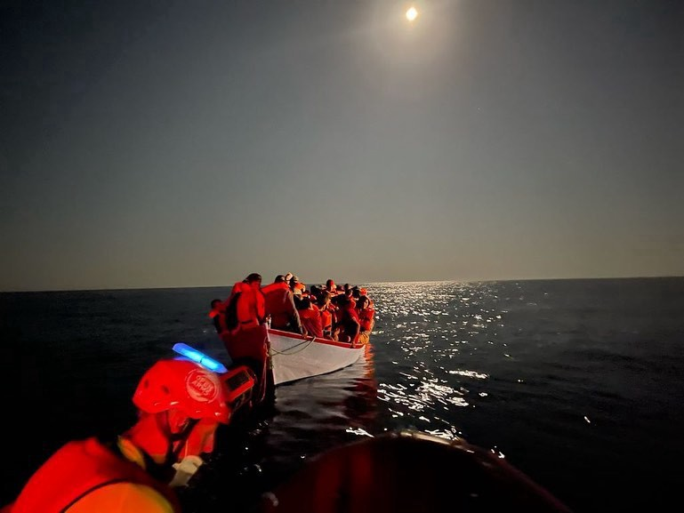

### AYS Daily Digest 23/07/2021 — Greek Rationale for Declaring Turkey “Safe Third Country” Finally Released
### Official justification for safe third country status inadequate, NGOs say//Shipwreck between Turkey and Greece//Caravan for equal rights on Canary Islands

[Are You Syrious?](?source=post_page-----1c2172e42422--------------------------------)

[Jul 24](ays-daily-digest-23-07-2021-greek-rationale-for-declaring-turkey-safe-third-country-finally-1c2172e42422?source=post_page-----1c2172e42422--------------------------------) · 9 min read

One of the distress cases in the Mediterranean over the past 24 hours\. Photo credit: [Proactiva Open Arms](https://www.facebook.com/proactivaservice/photos/pcb.4406333739397443/4406333646064119/)
### FEATURE
### Greek Asylum Service finally releases rationale behind Turkey’s “safe third country” decision — and it is inadequate

Greece has finally published the legal rationale behind declaring Turkey a safe third country for people from Syria, Afghanistan, Somalia, Pakistan, and Bangladesh\. The Joint Ministry Decision was based on an “Opinion” of the Head of the Asylum Service \(which is not considered a strong enough legal basis to declare a third country safe\), which it refused to reveal to the public for over a month, even though changes in asylum policy must be immediately justified with legal documentation\.

The Greek government fought off several legal challenges to reveal the rationale behind their decision, but now a public prosecutor ordered them to release the document\. Now that the Opinion has been released, it actually reveals that the sources the Asylum Service relied on [do not consider Turke](https://equal-rights.org/en/news/press-release-opinion-stc/?fbclid=IwAR3lW9t_UmHGHbZAa3eYnkl8z8ofEnmiGdU7r9W8TvNtqlfA5qDaiSUtjg0) y to be a safe third country\. They mentioned violations of human rights such as deportations to Syria, forcing people to sign voluntary return forms, denying Afghan people any kind of legal status, and other violations\.

The sources used were also [not rigorous enough](https://twitter.com/g_christides/status/1418478155443187712) to justify a complete change in asylum policy according to Greek law\. There was no independent fact\-finding mission, instead, the Opinion was based on existing, poorly\-cited open source information that was nowhere near rigorous enough to justify a change in policy\.

Even the [official documentation of the Home Office](https://www.gov.uk/government/publications/turkey-country-policy-and-information-notes?fbclid=IwAR3kifqQ_OlQ5OsvW5YlsAX-iMkx2Y3g_r2HQQJtaJuzvQzyaVpiLSqS3ZE) , hardly an entity known for its bleeding\-heart sympathy towards people on the move, is rigorous and up\-to\-date, a far cry from the hastily put together document that the Greek government released\.

This mimics the Danish government’s decision to declare parts of Syria safe despite the opposition of most of the organizations consulted in its fact\-finding\.

The insistence of both countries that up is down and black is white when deciding asylum policy against the recommendations of the very papers they purport to use as evidence would be absurd if it was not ruining people’s lives\. Greece has already denied several asylum applications with the rationale that Turkey is a safe third country for applicants from certain nationalities, even though it is nothing of the kind\.

It is important to look at this decision within the [wider political context](https://www.trtworld.com/opinion/war-at-home-and-political-war-abroad-for-afghan-refugees-48612?fbclid=IwAR2EwnP7iHoQ7neejaxL8mb_4zw4u45RmvHBrcYddgGKaqNc61OirM4l5jM) of Europe attempting to ignore its international responsibility towards displaced people and forcing them into camps in third countries that do not have even close to as many resources as the continent\. This decision will particularly affect Afghan people, many of whom are already fleeing the Taliban and are hoping to reach Europe\. They will probably be surprised to find that Turkey, where they are not entitled to any kind of legal protection and where many Afghans already live outside of society, is where they will be “safe\.” Then again, Europe has considered Afghanistan safe for Afghans while its own embassies in the country shutter due to the security situation, so this is nothing new\. What is unsafe for one group is apparently tolerable for others\.
### SEA
### Hundreds of new arrivals, many rescues

_Arrivals:_ On the island of Pantelleria in Italy, [over 100 people](https://trapani.gds.it/articoli/cronaca/2021/07/23/migranti-giornata-di-sbarchi-a-pantelleria-oltre-100-sullisola-22c59cc3-3118-4a02-9f00-651fcf56964d/?fbclid=IwAR3J2kqxlrwsqfWvMLh4EcrGOxgHytfjF2kZ007FnTwCrVcYSO4yAXfhxQ4) arrived in seven different boats, some of whom were intercepted off the Italian coast by the authorities\. Elsewhere in Italy, a group of [seven people](https://www.ansa.it/sardegna/notizie/2021/07/23/migranti-nuovo-sbarco-nel-sud-sardegna-arrivati-in-sei_c023bcb2-16d8-400e-a876-eb36baf44a76.html?fbclid=IwAR3UDa_qWho1NzHP67iq4ND5JCxBqwkUIT7N6xrjcYH-WqfoHV5ut4KJbc8) arrived in Sardinia and [212 people](https://www.ansa.it/sicilia/notizie/2021/07/23/migranti-10-sbarchi-nella-notte-a-lampedusa-212-arrivi_0ab1a331-ac21-4fc8-bfc9-faf53c17616a.html?fbclid=IwAR2jZlObTU7eCArEbZoXl4nWYPXzsDKSGANgPHHntET33MD7YdEF3eE9SII) in 10 different boats arrived in Lampedusa\.

_Rescues:_ In less than 24 hours, there were five boats in distress in the Central Mediterranean\. Proactiva Open Arms was [involved in three rescues](https://www.facebook.com/proactivaservice/posts/4407328649297952) , including one rescue of [50 people](https://www.facebook.com/proactivaservice/posts/4406333739397443) off the coast of Italy\. Salvamento Maritimo rescued a patera with [45 people](https://www.eldia.es/sucesos/2021/07/23/rescatan-patera-45-personas-bordo-55348969.html?fbclid=IwAR3tTEjDYUDw5o_LboY6M_yNiEmOwQTEutlB9Mf24Jfxe8iUAlRjD5n7tbA) near the Canary Islands and [six people](https://www.europasur.es/algeciras/migrantes-patera-Salvamento-punta-carnero_0_1594940947.html) in the Gibraltar strait\.

_Pullbacks to Libya:_ The cargo ship VOS APHRODITE, owned by the shipping company VROON, rescued about [200 people in distress](https://twitter.com/seawatch_intl/status/1418640572391333891?fbclid=IwAR1jQ7DiRmqLgbOjOD1WRbIaJpEeeeodpMgdhqwn-riHAJCgKKiLLDjqt8g) at sea and then immediately handed them over to the so\-called Libyan Coast Guard, thereby not meeting its obligation according to international law to take people in distress at sea to safety\. That brings the total of the number of people returned to Libya over the past three days [to 1,500](https://twitter.com/msehlisafa/status/1418612557078794241?fbclid=IwAR0CkYCaCGKkzhTkw07nzIg8QrE7nNB62i210blomlcAO1RVf5dUlPEZmrY) , almost all returning to torturous conditions\. The UN has repeatedly said conditions for people on the move in Libya [are inhumane](https://www.arabnews.com/node/1898736/middle-east) , with many detained in torture camps\.
### TURKEY
### Eight missing after shipwreck between Turkey and Greece

Eight people [are still missing](https://english.alarabiya.net/News/middle-east/2021/07/23/Migrant-boat-sinks-off-Turkey-with-45-on-board-?fbclid=IwAR3WxCb37kNaDp5MzFBQR6t2gWM2TQ51WFsSb4Gt4hOmXveVP9oVemVuONM) after a boat carrying 45 people sank about 260 kilometres off the coast of the southwestern Turkish city of Kas, [close to Crete](https://www.keeptalkinggreece.com/2021/07/23/crete-migrants-missing-rescued-greece/) \. Turkish and Greek authorities were involved in the rescue of [37 people](https://www.aljazeera.com/news/2021/7/23/boat-carrying-45-migrants-and-refugees-sinks-south-of-turkey?fbclid=IwAR3ImcaTm1xfCk98oGJtfA0fKgAWbFaBv7Ar6SwsHg8lhuD_780uqv6zJl0) \.

One of the most shameful things about this deadly shipwreck is that the Turkish and Greek governments are each using it as an opportunity to pursue their political agendas without acknowledging the role that their respective policies played in the deaths\. Neither country’s media acknowledged the presence of the other country among the rescuing forces\. In fact, it is difficult to tell that the newspapers are talking about the same shipwreck\! The Greek government even took the opportunity to blame Turkey for the shipwreck, saying that Turkey is ignoring [its international obligations](https://twitter.com/lk2015r/status/1418658895233437697?fbclid=IwAR2o8NThfYbjSPyDig4VGOLFvAc8vasuFsjhb6ylkqBODLgpE_se7tlI42g) and that the Greek government has to rescue people because of them — even as the Greek government ignores its obligations to grant asylum and the Turkish Coast Guard has had to save countless people from Greek pushbacks\.
### More Afghan people coming to Turkey

As the Taliban gains more ground in Afghanistan, more and more people are fleeing the country\. Local sources report that [hundreds of people](https://amp.observers.france24.com/en/middle-east/20210716-afghans-flee-taliban-crossing-turkey-iran-border?__twitter_impression=true&fbclid=IwAR0EQAVWXvqoDqMNLVbPM9wUbea4k6l5XWmPl3px4XOh4BhPH6cB6iGyhh8) cross the Iranian\-Turkish on foot each day\. Viral videos have been shared of long convoys of people on foot, although the Turkish interior minister has claimed that those videos are from the Iranian side of the border\.

Unfortunately, this has kicked off virulent xenophobic, dehumanizing reactions in many parts of Turkish society, who complain that Turkey has “enough” refugees already\. This dehumanization of people on the move is encouraged by politicians that purposefully stoke nationalism for their own political gain\. And xenophobia rarely stays on the Internet — a [t least six Syrians](https://ahvalnews.com/refugees-turkey/growing-dehumanisation-refugees-turkey?fbclid=IwAR1wkIAN2ndKN5cQfrVxsM0_k9ecGPciHdkHZsTtE-C3sRumvTwnkKg7_bE) were murdered last year in hate crimes\.

Of course, the European Union is hoping that these desperate Afghans will stay in Turkey, Afghanistan and neighboring states — as long as they do not come to the glistening shores of Europe\. That is why the EU is creating a [financial aid plan](https://www.independent.ie/world-news/middle-east/eu-weighs-up-financial-aid-plan-to-stem-flow-of-refugees-fromafghanistan-40681494.html?fbclid=IwAR3aRpBGaS4TWL_yQCEYRxZxVVvMhc6C469ea0XL-1ZGLrDnK1O75GvV6a8) that would give more money to Afghanistan, Pakistan, and Iran \(Turkey already receives significant money with the purpose of refugee “deterrence”\) with the goal of keeping people in Afghanistan or neighbouring countries\. Giving aid money as an incentive to stop people from moving has been proven not to work, and money will not address the main reason people are leaving their homes in Afghanistan — the resurgence of the Taliban\. But as long as Europe can keep people out, the effectiveness of what it is doing does not matter\.

The U\.S\. is also getting involved by asking the Central Asian countries of Uzbekistan, Tajikistan, and Kazakhstan to house Afghans in danger from the Taliban because they worked for U\.S\. forces \(therefore, meaning that they are displaced because of the U\.S\. government\) \. Although they say that they would eventually get U\.S\. visas, many Afghans who worked for the American military have been denied resettlement in the past\. Uzbekistan has denied the request\. Separately, Tajikistan said that they have the capacity to take in [100,000 people](https://www.msn.com/en-us/news/world/tajikistan-says-its-ready-to-take-in-up-to-100000-afghan-refugees/ar-AAMsYKY?fbclid=IwAR3aRpBGaS4TWL_yQCEYRxZxVVvMhc6C469ea0XL-1ZGLrDnK1O75GvV6a8) from Afghanistan\.

While global and local countries play hot potato with the futures of millions of Afghan civilians, the dangers that they are in will not magically go away\.
### GREECE
### Overcrowding on mainland camps

It turns out that punting people to the mainland is not a solution to relieve overcrowding in island camps\. More and more people are now winding up in [Camp Eleonas](https://www.rbb24.de/panorama/beitrag/2021/07/gefluechtete-helfer-griechenland-athen-camp-eleonas.html?fbclid=IwAR2fqhgQAkrYV5xCol1I7JpvEdperMi9I3KoZ7baJ7Pj1WW1ehZariucdA4) , a camp in Athens filled way over capacity\. Thousands of people live in the camp with no relief from the summer heat, no electricity, and no safety\.

A far\-right Greek MP has asked in Parliament if “ [on\-the\-spot deportations](https://twitter.com/lk2015r/status/1418557068982763527?fbclid=IwAR01NlmOMHnJuwjYArMp8QsrNI3apmILgkfvKndOJ3X4WqFO0Rm2RegyonA) ” \(aka illegal pushbacks\) could be carried out in Evros, citing increasing numbers\. Of course, those deportations are illegal and violations of human rights\. The panic about people coming through Evros has been fueled by local news which publishes sensationalist articles about people on the move and dehumanizing videos, usually taken without consent\.

A [new report](https://commongroundgreece.org/time-is-running-out-to-plan-for-the-social-inclusion-of-refugees-and-migrants-in-greece-according-to-a-new-report-by-two-civil-society-organizations/?fbclid=IwAR3-Vi2Y26DFjkO96l9oBCV0UVjcNiG5PsUUAKwOcOA98unWx001A3KDyb4) has found that people on the move are still facing significant barriers to integration, which has been made harder by the pandemic\. The Greek government is in the process of creating a New Strategy for Integration and must take the current situation into account\.

[Another report](https://odi.org/en/insights/addressing-the-protection-gap-in-greece/?fbclid=IwAR3NlGXvNJ9qfIP3mdiPLy15TP2D7ppC9mb_-dMaZAPpw1BBYjhguuPWv1g) examined the barriers that recognized refugees face when transitioning from humanitarian assistance to the national system\.
### BOSNIA & HERZEGOVINA
### UNHCR update

The UNHCR has published an update on the situation for people on the move in Bosnia and Herzegovina, which you can read [here](https://reliefweb.int/sites/reliefweb.int/files/resources/BiH%20UNHCR%20Operational%20update%20-%20June%202021.pdf?fbclid=IwAR2WmI3iW69GoQ_D71B1uW4fOxMrkoCF0oEQxSg731QKxEPzfTJEZJztVPY) \. In June, 1,855 people came to BiH\.
### SPAIN
### Caravan for equal rights on the Canary Islands

In the face of growing xenophobia and violence against people on the move, organizations on the ground in the Canary Islands [organized a caravan](https://twitter.com/alarm_phone/status/1418516313664860160) calling for freedom for all, regardless of citizenship status\. On Friday, the people [marched on Tenerife](https://twitter.com/Caravana_AF/status/1418514762359578625) demanding that reception policies actually follow the law instead of violating people’s rights through extensive detention\. After merging with the Las Raices column, the caravan marched past the Los Rodeos airport to protest deportations\. A separate column went to protest in front of the National Police, saying that the headquarters are a bloody place\. The caravan aimed to highlight all the institutions involved in such a bloody migration policy and calling for the right to freedom of movement for all\.
### GERMANY
### Syrian people in Germany help in flood recovery

After unprecedented floods hit Germany’s western states, a group of Syrian men now living in Germany organized a volunteer group to go and help out\. Watch the reportage about their selfless actions [here](https://www.dw.com/en/germany-floods-syrian-refugees-join-cleanup-efforts/av-58604769?fbclid=IwAR0BPo1t6g77GDx9hHuxCwamWhbIqDvwfINB7NzJ5KoSSxOXOjO7fAEwfzw) \.
### EU/FRONTEX
### The EU’s murky dealings with foreign nationals

Spying on some, cooperating with others…the EU’s policy towards third\-country nationals are in flux\. The European Commission has put forward a proposal to [expand Europol’s powers](https://www.statewatch.org/news/2021/july/eu-spying-on-foreign-nationals-member-states-want-to-stay-in-the-driving-seat/) to collect alerts from non\-European states about nationals in the European Union, but member states are reluctant to give that much power to the EU agency\.

The Commission also proposed [expanding externalization](https://www.statewatch.org/news/2021/july/tracking-the-pact-proposed-cooperation-with-north-africa-received-with-interest-external-cooperation-state-of-play/?fbclid=IwAR1QC0pWacFoU6TJCY0Iyj91XdybNUZwvNbRUFdtj0IkBUMPGZPtsvaADb4) of migration further to North African countries\.

What are Frontex’s obligations in SAR zone? Learn more in [this series](https://www.statewatch.org/analyses/2021/to-sar-or-not-to-sar-part-1-why-is-frontex-expected-to-save-lives-at-sea/?fbclid=IwAR1STIk1HRuveunQB0LGGPRXoxkbP995pOrMRt3hUMEugQmJIl6bXoh9_Pg) from Statewatch\.

Even if Frontex does not have any SAR obligations \(it certainly does not bother fulfilling them\), that does not stop it from bragging on Twitter about its officers completing training for “search and rescue activities\.” Newspeak in 2021, not 1984\!

Even as Frontex denies its obligations in any SAR zone, it is expanding its surveillance capabilities\. The agency now has [long\-range drones](https://twitter.com/matthimon/status/1418522713568817157?fbclid=IwAR3yK9pqokoFXSsEc9dkfsPufdjnXTH1IpELWHyM2VYwaiNQEQ3NP4w1R0s) in its Frontex Aerial Surveillance Service\. Frontex’s drone program has existed [since 2009](https://digit.site36.net/2021/07/22/border-drones-part-1-unmanned-surveillance-of-the-eus-external-borders-by-frontex/?fbclid=IwAR19aMGMMnD-FISmxgzmYduxHub8Font1sr5IW66msVxCWzJhaZO-o37SfM) , but since then it has rapidly expanded its program of aerial surveillance, often building close relationships with weapons and surveillance manufacturers\.
### GENERAL
### People on the move at the Olympic Games

Friday saw the official opening ceremony of the controversial 2020 Olympic Games in Tokyo\. The games have an official [Refugee Olympic Team with 29 members](https://www.unhcr.org/news/stories/2021/7/60faced14/refugee-athletes-stride-global-spotlight-tokyo-games-begin.html?fbclid=IwAR3ONw73fGnjAw3TIDxH4MQeK0MSBjuIwJAhC5nqROe2iH_OlYyHycqGbPk) to give stateless athletes an opportunity to compete\. While it is good that these athletes will not have to give up their dreams because of circumstances beyond their control, it exposes a larger problem, namely that millions of people are in states of legal [limbo and displacement](https://refugeecongress.org/news-updates/olympics-refugee-team-raises-big-questions?fbclid=IwAR1zh3wMBysYkLJb5hfZKpuR4vvm2w8EABmy3_lYcEZEyPFhd8Vdc9pagPw) , often for years on end, that prevent them from functioning normally\. Most others do not have the opportunity to work and pursue their dreams\.
### WORTH READING

ELENA have published their weekly legal update, which you can read [here](https://mailchi.mp/ecre/elena-weekly-legal-update-23-july-2021?e=1fd2db1ebf&fbclid=IwAR0Fwgn-rmNagwfgwJ-hbLPIDobIyBU59uJijgZ5bscF8lDNlHGpL-G8MeQ) \. One of the most important stories from this week was the ECtHR ruling against Bulgaria for the illegal pushback of a journalist to Turkey\.

How relevant is the U\.N\. Refugee Convention, seventy years after its signing and when most of the world’s refugees are in countries that are not signatories, and even the signatories are flaunting its guidelines? Read more in this blog on the [Refugee Law Initiative](https://rli.blogs.sas.ac.uk/2021/07/22/relevant-or-redundant-the-future-of-the-international-refugee-protection-regime/?fbclid=IwAR3B8ur8ybP7UCI4rujeCX0OAs39MosM7VHXQFPic8SlDpitf8qV2vtj1zs) \.

Deportations are more than a violent act of removal, although they certainly are violent, they are transnational processes affecting multiple countries due to institutional racism, the remnants of colonialism, and more\. One such book unpacking the process of deportation is _Deporting Black Britons: Portraits of Deportation to Jamaica\._ You can read a review of the book [here](https://www.law.ox.ac.uk/research-subject-groups/centre-criminology/centreborder-criminologies/blog/2021/07/book-review-0?fbclid=IwAR0pXP_ulvyim9jGUQpLvkaiV3d6j_ZeLWQCDJAUYVLUO50FZldcIsLQ3J8) \.
### WORTH ATTENDING

Paris\-based friends, here’s an event worth attending today\! Club Dissident is hosting a [discussion at 5PM](https://www.facebook.com/events/188225336609025/) on the situation in Afghanistan for women and minorities\. The panel will consist of Afghan people in Paris and those participating via call from Kabul\.

**Find daily updates and special reports on our [Medium page](https://medium.com/are-you-syrious) \.**

**If you wish to contribute, either by writing a report or a story, or by joining the info gathering team, please let us know\.**

**We strive to echo correct news from the ground through collaboration and fairness\. Every effort has been made to credit organisations and individuals with regard to the supply of information, video, and photo material \(in cases where the source wanted to be accredited\) \. Please notify us regarding corrections\.**

**If there’s anything you want to share or comment, contact us through Facebook, Twitter or write to: areyousyrious@gmail\.com**

_Converted [Medium Post](https://medium.com/are-you-syrious/ays-daily-digest-23-07-2021-greek-rationale-for-declaring-turkey-safe-third-country-finally-5d6df3483e2a) by [ZMediumToMarkdown](https://github.com/ZhgChgLi/ZMediumToMarkdown)._
