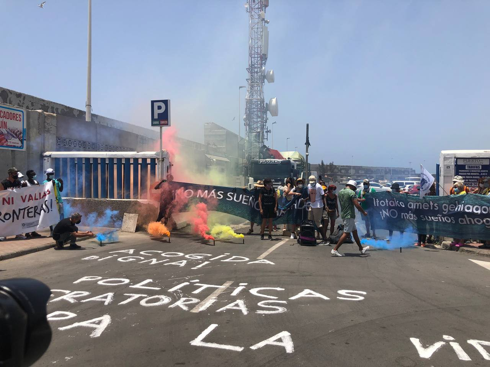
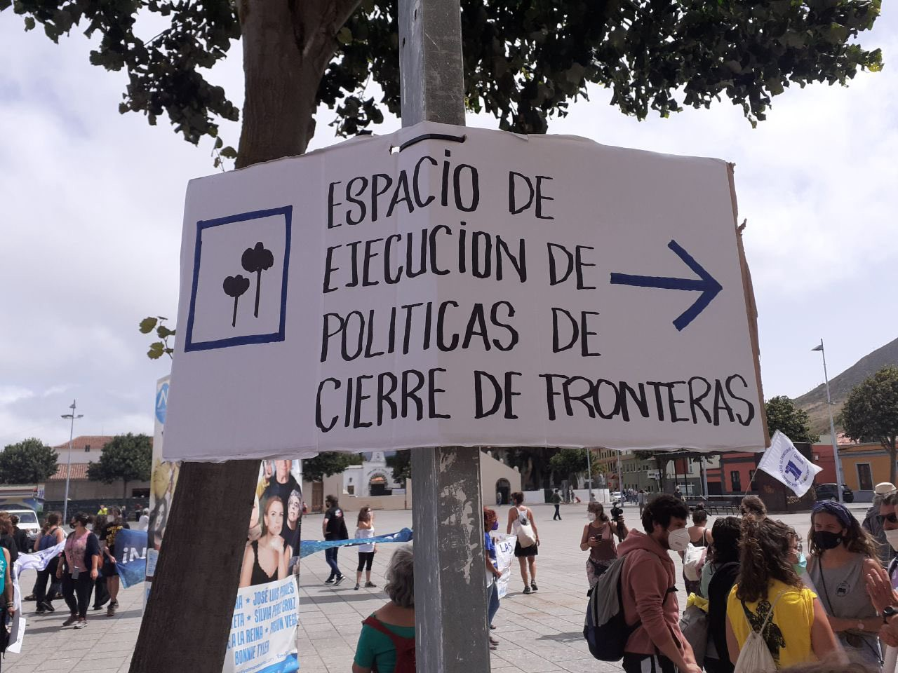
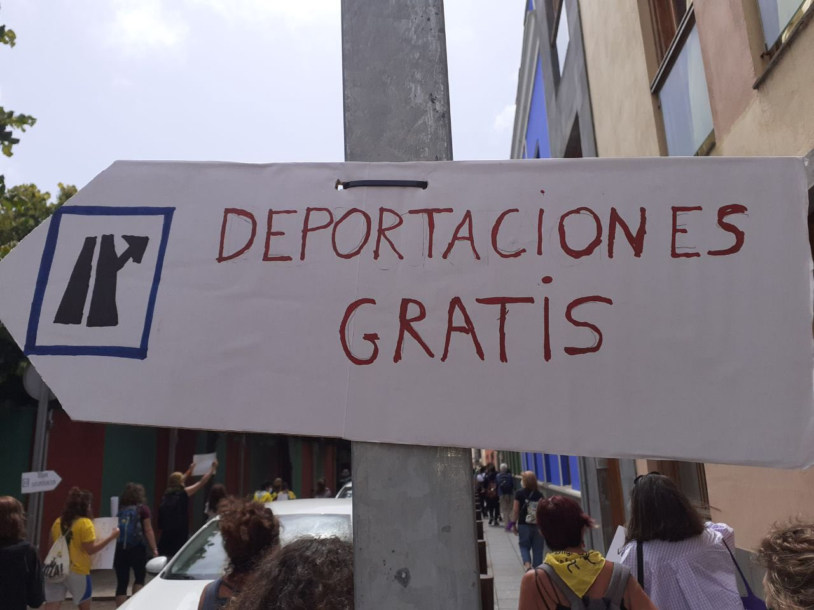
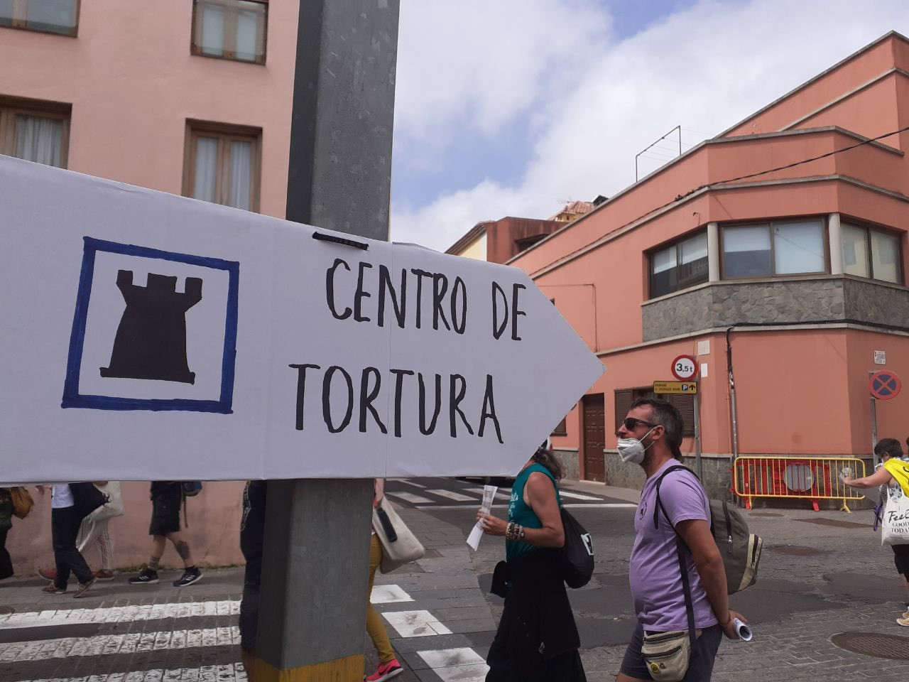
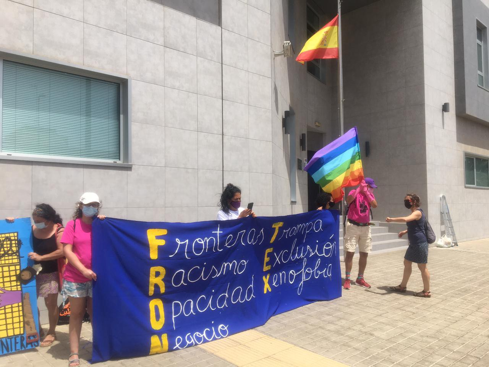

### AYS Special from the Canaries: Opening Borders, a Week of Protest\.

_This year so far [over 2000 people](https://www.arabnews.com/node/1899151/middle-east) have died trying to get to Spain, the same figure that died in the entirety of 2020\. This is an [increase of 526%](https://caminandofronteras.org/monitoreo/monitoreo-del-derecho-a-la-vida-del-primer-semestre-de-2021/) \. 12,622 people survived the crossing only to be met by diabolical conditions and often deportation\. In response to the high level of harm caused, Caravana Abriendo Fronteres organised a week of protest to make visible, denounce and combat migration policies\._

Photo from an activist on the ground
#### Migratory Necropolitics

The Canary Islands route is the most deadly\. 1,922 people have died in 57 separate shipwrecks\. This means that about [3 in 10 people](https://www.statewatch.org/analyses/2021/the-canary-cage-the-making-of-deportation-islands-on-spain-s-atlantic-border/) lose their lives and yet 1000s still take the risk because of the severity of the situation they are fleeing\. The people that lost their lives are citizens of 18 different countries\. Approximately 96% of the dead have disappeared at sea\. Their bodies have never been recovered\. This also means that some agencies will not record their deaths in official statistics\. the 4% who are found very few can be identified and repatriated for burial by their families\.

> We must highlight in these months, the high number of **women and children victims of the border\.** In May there were 90 women and 13 children, and in June 136 women and 37 children\. — [_Caminando Fronteras_](https://caminandofronteras.org/monitoreo/monitoreo-del-derecho-a-la-vida-del-primer-semestre-de-2021/) 

The total figure for women is 341 and 96 children have also lost their lives\.
#### Not Just a Spanish Problem

EU policy directly leads to people being forced to leave home\. For example, [in Senegal](https://www.europarl.europa.eu/news/en/press-room/20201111IPR91303/parliament-backs-the-renewed-fisheries-partnership-with-senegal) the European Parliament renewed a fishing agreement which permits French, Spanish and Portuguese boats to extract ‘ [over 10,000 tonnes of fish](https://www.statewatch.org/analyses/2021/the-canary-cage-the-making-of-deportation-islands-on-spain-s-atlantic-border/#_ftn4) annually from Senegalese waters in exchange for €1\.7m paid to the Senegalese government\.’

> In their creation of a cage for migrants on the Canary Islands, Spanish and European officials continue to repeat their crimes of the past, and are directly complicit both in the immediate abuses and their underlying causes\. — [_Statewatch_](https://www.statewatch.org/analyses/2021/the-canary-cage-the-making-of-deportation-islands-on-spain-s-atlantic-border/#_ftn4) 

#### Deportation Islands

 \)](assets/c9d8d5d530b7/1*4iS7VxE5DHmWB7-OqpJRBA.jpeg)

\(Photo Credit: [Statewatch](https://www.statewatch.org/analyses/2021/the-canary-cage-the-making-of-deportation-islands-on-spain-s-atlantic-border/#_ftn5) \)

> In line with concerning recent EU border control proposals, a deliberate policy of inhumane detention, illegal mobility restrictions and an overreliance on deportation ‘solutions’ is converting the Canary Islands into makeshift deportation waiting rooms and a black hole for human rights\. — [_Statewatch_](https://www.statewatch.org/analyses/2021/the-canary-cage-the-making-of-deportation-islands-on-spain-s-atlantic-border/) 

Deportation flights restarted at the end of 2020\. Meanwhile geographic restrictions mean that people cannot move on to the mainland\. At the start of the year, [AYS reported](ays-special-from-the-canary-islands-why-did-so-many-people-arrive-in-2020-and-where-have-they-gone-9b2932a4cad9) on the The Arguineguín Pier Camp — ‘The Dock of Shame’ which was used to hold people without consideration of COVID\-19 distancing regulations, limited access to water and shade leading to related health problems\. The national detention limit of 72 hours was routinely violated\.

> \[…\] conditions do not respect people’s dignity or basic rights, nor do they reflect well on Spain — [_Human Rights Watch_](https://www.hrw.org/news/2020/11/11/spain-respect-rights-people-arriving-sea-canary-islands) 

Camps were set up in response to greater arrivals under the ‘Canary Island Plan’ but with the idea that people would only be held there short term\. This opened up 7000 reception places\.
#### Mental Health Crisis

As we have seen all over Europe, policies of containment, deprivation of basic rights and the threat of deportation do not stop people coming but do lead to widespread instances of self harm and suicide\. Instances have included [a young Moroccan man](https://www.infomigrants.net/en/post/30216/canary-islands-migrants-turn-to-hunger-strikes-self-harm) who cut his own leg 27 times with a razor after he learnt that his mother was to undergo liver surgery when she could not afford it\. Another man slashed his own stomach\. A third attempted to jump from the top of a building\.
#### Las Raíces

Las Raices is one of the emergency camps set up at this time in an army barracks on the island of Tenerife\. It’s capacity is 1,800\. [It’s isolated and often cold](https://www.eldiario.es/canariasahora/migraciones/migrantes-hartan-campamento-raices-tenerife-frio-barro-comida_1_7204479.html) as it is in the north of the island\. There is limited electricity and reports state that the food is inadequate\. Over the last months, residents have protested against their living conditions and their lack of access to healthcare and for their right to reach mainland Europe\. In response, the riot police intervened and arrested 15 people\.
#### **Canarias 50**

A former army base that has been used in 2021 as a reception centre for people on the move on Gran Canaria\. It is managed by the Red Cross, whose internal policies have been the focus of debates\. There were demonstrations by residents regarding Covid\-19 measures, unhealthy conditions such as poor hygiene and wastewater, food, and asking for proper housing and freedom of movement\. In response, 64 people were expelled in one day\.
#### Barranco Seco

Another decommissioned military ground turned into a Centro de Atención Temporal de Extranjeros / Temporary Attention Centre for Foreigners \(CATE\), opened in November 2020 on Gran Canaria, following the growing scandal for the conditions at the Arguineguin pier\. The CATE has a capacity for 800 to 1000 people and is situated nearby a detention centre\. CATEs were [created](https://iridia.cat/wp-content/uploads/2021/01/INFORME-DDHH-FRONTERA-SUR-2021.pdf) in 2018 as pre\-deportation centres, and have been severely criticised for their living conditions and limited access\.
#### Opening borders

The _Caravana Abriendo Fronteras_ emerged in 2016 as an initiative to publicly denounce European migration and border policies\. Since then they have developed, in border locations such as Greece, Andalusia, Melilla, Italy, and the Canary Islands, direct non\-violent actions, demonstrations, talks, rallies and debates\.

This year, the caravana moved across the Canary islands, starting on July 17th in Gran Canaria, and concluding on the 24th in Tenerife\.

](assets/c9d8d5d530b7/1*HTk8jP9fsZBmvUBvY1s7XA.jpeg)

Credit: Caravana [Abriendo Fronteras](https://twitter.com/Caravana_AF/)

More than 350 people and dozens of groups from Spain, Italy and other European countries have joined this protest initiative during this edition\. Local groups hosted a week of events, talks and demonstrations, touching the many ‘hot spots’ on the islands: camps, CIEs, Frontex offices, municipal and government headquarters, arrival points\.

Photo by an activist on the ground

The Caravan worked to connect migratory struggles with anti\-colonial, trans\-feminist and anti\-military topics\. Italian dock\-workers who are refusing to load weapons into ships in Genova took part in the caravan, as well as representatives from Western Sahara, various south American countries, and many more\.

Photo by an activist on the ground

Once in Tenerife the Caravana was [charged](https://www.elsaltodiario.com/migracion/policia-carga-concentracion-pacifica-derechos-personas-migrantes-en-tenerife) by the police, during a peaceful demonstration in front of a government delegation office\.

 \)](assets/c9d8d5d530b7/1*9FLfKCfs-yumc1Nvsu5zvw.jpeg)

Tenerife \(Credit: [Pressenza](https://twitter.com/pressenza/status/1418180973779369986/photo/1) \)

As we have seen since our last special from the Canaries in January, little has changed\. In fact it has been exacerbated by further restrictions imposed on movement due to Covid\-19 while at the same time adequate and healthy living conditions are not met, nor is an attempt made to meet them\. While EU policies towards lower income people in African countries continue to be one of the driving factors for people fleeing, EU reception standards continue to deteriorate with deportation being seen as the only solution EU governments can agree on\. The number of those fleeing is increasing and safe and legal routes combined with humane reception conditions are the only way to prevent further deaths\.

**_AYS Info Team_**

**Find daily updates and special reports on our [Medium page](https://medium.com/are-you-syrious) \.**

**If you wish to contribute, either by writing a report or a story, or by joining the info gathering team, please let us know\.**

**We strive to echo correct news from the ground through collaboration and fairness\. Every effort has been made to credit organisations and individuals with regard to the supply of information, video, and photo material \(in cases where the source wanted to be accredited\) \. Please notify us regarding corrections\.**

**If there’s anything you want to share or comment, contact us through Facebook, Twitter or write to: areyousyrious@gmail\.com**

_Converted [Medium Post](https://medium.com/are-you-syrious/ays-special-from-the-canaries-opening-borders-a-week-of-protest-c9d8d5d530b7) by [ZMediumToMarkdown](https://github.com/ZhgChgLi/ZMediumToMarkdown)._
