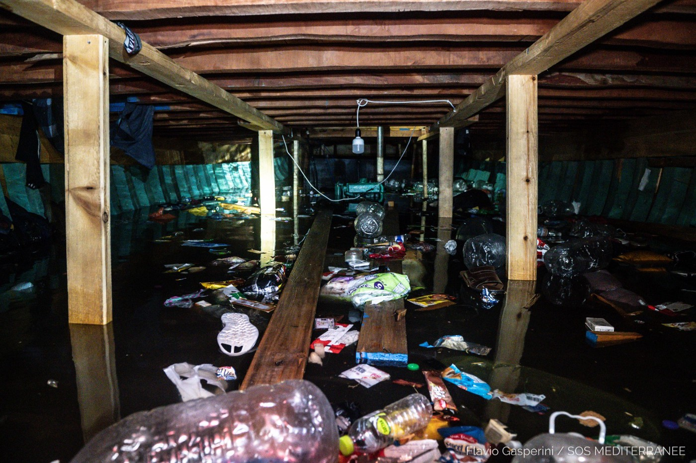

### AYS Daily Digest 2/8/21: European Court for Human Rights rules against Austria’s deportation to Afghanistan
#### Dangerous crossings in the Mediterranean — more than 800 people saved during the weekend / EU Commissioner for Home Affairs Ylva Johansson calls for barrier at the Ukranian border with Belarus / French and Greek activists need help and support / recommended reads & other news

](assets/117acc7bd16c/0*1ki54qWTjrnJBYCv)

Search and rescue at sea — “critical rescue of ~400 people from a large wooden boat taking on water\.” — via [SOS MEDITERRANEE](https://twitter.com/SOSMedIntl)
#### FEATURE

The European Court of Human Rights \(ECHR\) today stopped the planned deportation of a rejected asylum seeker to Afghanistan with a temporary injunction\. The reason given was the \(widely known, albeit ignored by the MoI\) security situation in Afghanistan\.
Although this decision only applies to this specific case, the reasons given by the ECHR for the injuction are not ‘case specific’ and could be applied to the general situation, and become accepted by other countries that have been deporting people to Afghanistan\. The temporary injunction does not constitute a complete ban on deportations to Afghanistan\. However, many other EU countries have already stopped deportations to Afghanistan due to the precarious situation in the country, the Court stated\.

In the meantime, Austria and Germany have been pressuring the Afghan government and the Ministry of Refugees and Repatriation \(MoRR\) to accept returns to Afghanistan once again\.

The pressure started building after the Ministry sent an official letter to all the European and non — European countries that regularly deport Afghans, to halt deportation to Afghanistan for at least 3 months, starting from the 8th of July\. In response, several countries like Sweden, Finland and Norway agreed to temporarily halt deportations to Afghanistan, but not Germany and Austria\. As Germany’s envoy for Pakistan and Afghanistan, Jasper Wieck, recently visited the Ministry of Refugees and Repatriation to urge the Minister to allow the deportation of 10 Afghan people to go ahead, **Austria threatened to close the Afghan Embassy in Vienna if their government refuses to accept deportations of persons from Austria to Afghanistan\.**

As a result of the pressure put on the Afghan government, MoRR has now agreed to allow 2 charter planes from Austria, the first of which is scheduled for the 3rd of August, and to accept the deportation of 10 Afghans a week later from Germany\.

Germany’s envoy for Pakistan and Afghanistan stated that all of the people who are being deported have criminal records\. Similar claims have been made in the past when group deportations have included people without convictions\. The issue around deportations to Afghanistan is currently [a huge part of German election campaign](https://www.tagesschau.de/inland/laschet-afghanistan-abschiebung-101.html?) \.

Meanwhile, [the fighting has intensified all around Afghanistan](https://amasosite.wordpress.com/2021/08/02/press-statement-austria/? fbclid=IwAR2qxP6ggLXnZt59JN7tSsMwpCcjtrIq2JOPpVJ_uN4VBM5R99VMokI_jR0) , with at least half of rural districts in the hands of Taliban, who have launched attacks on key provincial capitals such as Lashkar Gah, Kandahar and Herat, the third biggest city in Afghanistan\. Residents are reporting bodies lying in the streets of Herat after the city being a battleground for the last 4 to 5 days, [Afghanistan Migrants Advice & Support Org](https://www.facebook.com/AmasoAfg/?__tn__=-UC*F) reported\.
#### SEARCH AND RESCUE AT SEA
### **At least 1,146 people lost their lives at sea in the first 6 months of 2021**

In relation to the same period last year, the number of deaths has more than doubled, 513 people known to have been drowned in this period in 2020\.

At least 741 people died on the Central Mediterranean route, while 149 people lost their lives crossing the Western Mediterranean and six died on the Eastern Mediterranean route from Turkey to Greece\. In the same period, some 250 people drowned attempting to reach Spain’s Canary Islands on the West Africa/Atlantic route\.

The analysis, produced by the Missing Migrants Project, shows an increase in deaths coupled with insufficient search and rescue operations in the Mediterranean and on the Atlantic Route to the Canary Islands, and at a time when interceptions off the North African coast are also on the rise\.

**Hundreds of cases of invisible shipwrecks have been reported by NGOs in direct contact with those on board or with their families\. Such cases, which are extremely difficult to verify, indicate that deaths on maritime routes to Europe are far higher than available data show\.**

The verified numbers in deaths at sea are certainly lower than the actual number of persons who have died at sea while attempting to find safety\.

“IOM reiterates the call on States to take urgent and proactive steps to reduce loss of life on maritime migration routes to Europe and uphold their obligations under international law,” says IOM Director General António Vitorino\.
### **More than 800 people were rescued over the weekend**

Over the weekend, several boats [called in distress in the Mediterranean](https://www.infomigrants.net/en/post/34036/more-than-800-migrants-rescued-at-sea?) \. The NGO rescue vessels Ocean Viking run by SOS Mediterranee and Sea\-Watch 3 are now filled to capacity, the Ocean Viking carrying at least 555 people and the Sea\-Watch 3 having now 263 people on board\. Sea\-Watch has already requested admission to a safe port\.

> These SAR organizations repeatedly called for Italy and Malta in whose waters the rescues took place to act and sent help\. 

The most recent rescue was reportedly in international waters off the Tunisian coast on Sunday, with about 400 people picked up from a wooden boat that was filling with water\. Crews of the Ocean Viking, Sea\-Watch 3 as well as the sailing boat Nadir run by the German NGO ResQship participated in the rescue operation\.

The volunteers said the situation was tense, as the boat was about to sink and many people were already in the water\. Among those rescued by the Ocean Viking are at least 28 women and 33 minors, two\-thirds of whom appear to be unaccompanied\. Meanwhile, SOS Mediterranee said that “the youngest survivor rescued in this operation is just 3 months old\.”

Inside of a boat that carried people who experienced shipwreck \(Photo credits: via SOS Mediterranee, by: Flavio Gasperini\)

■■■■■■■■■■■■■■ 
> **[Sea-Watch International](https://twitter.com/seawatch_intl) @ Twitter Says:** 

> > The #SeaWatch3 has sent maydays for 3 boats by now. At least 4 boats with over 800 people are currently out at sea, @[alarm_phone](https://twitter.com/alarm_phone) reports. The situation is extremely critical. #Italy and #Malta must act quickly now to rescue the people and prevent deaths! https://t.co/BRcRoQCWgs 

> **Tweeted at [2021-08-02 12:32:23](https://twitter.com/seawatch_intl/status/1422173430418395140).** 

■■■■■■■■■■■■■■ 

#### GREECE

NoBorderKitchen need donations to continue the work on Lesbos\. Find out more on their [social media pages](https://fb.watch/79p4zzRa1c/) \.
### **Young people organizing COVID\-19 prevention awareness program**

In Ritsona camp, a group of young people took protection from COVID\-19 into their own hands, by organizing educational events and spreading awareness about the virus within the camp\. While, as has been the case since the beginning of the pandemic, for the people living in a camp it is impossible to implement prevention advice, such as physical distancing of 1 to 2 metres while waiting in queues for food, they have needed to find ways of helping to prevent the potential spread of the virus in such a precarious, hot\-bed of a situation\.

Parwana Amiri is a human’s right activist, author, poet and teacher staying in Ritsona camp and is the main initiator of the educational efforts\. Amiri’s experiences as a volunteer teacher in Moria helped her to realize that change can be achieved in an educational space, where people come together to learn something new and better understand the realities of the world\.

> “When the number of infected people was first announced, everybody was scared\. All offices and common spaces were closed down, but the large majority of the residents of the camp had little in the way of information — or, worse, had been exposed to harmful misinformation about the virus\.” 

The aid organisations withdrew or kept their distance, violence arose and medical personnel, feeling unsafe in their workspace, left the camp\.

> “The situation became truly critical: we had no time to lose\. We plucked up all our courage and took it upon ourselves to speak to the various communities, informing them about the measures they needed to take to protect themselves, their families and their neighbors\.
 

> Realizing that more needed to be done, I decided to organize a refugee\-led self\-educational programme by soliciting the collaboration of other young refugee women who had had some teaching experience in their countries of origin\.” 

The Corona Awareness Team consisted of 17 young refugee girls who started an open and inclusive programme to enable residents to pursue some sustainable goals in the midst of the pandemic\. Another objective behind this programme was to draw on the skills and abilities of girls, to help them access knowledge and develop confidence in themselves\.

> “We believed that this would contribute to a decrease in male violence and aggression toward women and girls\.” 

For further reading:

#### FRANCE
### Information evening for \(future\) volunteers of Utopia 56

Come and talk with the members of the association present in various cities in France and discover the tasks proposed by Utopia 56 as well as ways to help those exiled at the rue en Ile\-de\-France\. / Paris, [4 August, 6\.30 pm](https://www.facebook.com/U56ParisIDF/posts/2703260179973425)
#### GERMANY

400 children were left without shelter after fires at Moria camp in September of last year\. Germany eventually took in some of them\. 
In a recent visit to Hamburg for their upcoming investigative podcast series, Stavros Malichudis and Iliana Papangeli visited one of the houses where unaccompanied minors from Moria live today\.

At home, the children have their own room and shared kitchen where they cook the food they buy themselves with the money they receive\. They attend intensive German classes as well as Maths classes, taught by teachers who speak their mother tongue\.

> Some of them still look confused\. It will take them a long time, even years, to overcome the trauma they experienced in Moria but also before Moria\. For some, it may never happen to fully recover from these memories — _Masood Atmar, project coordinator of the special learning program in LEB, said\._ 

#### LITHUANIA
### **Physical Barrier Proposal at Lithuania‘s Border with Belarus**

On Monday, the European Commissioner for Home Affairs Ylva Johansson visited the Lithuania\-Belarus border with Interior Minister Agne Bilotaite\.

■■■■■■■■■■■■■■ 
> **[Ylva Johansson](https://twitter.com/YlvaJohansson) @ Twitter Says:** 

> > Visiting the #Lithuania 🇱🇹 #Belarus 🇧🇾 border today where I received a detailed briefing regarding the situation on the ground. 
The Lithuanian border guard personnel, with @[Frontex](https://twitter.com/Frontex) support, are undertaking a sophisticated operation in challenging circumstances. 
🇪🇺 🇱🇹 https://t.co/ADV315tV9x 

> **Tweeted at [2021-08-02 10:32:57](https://twitter.com/ylvajohansson/status/1422143374954573826).** 

■■■■■■■■■■■■■■ 

> “In my view, it’s a good idea, actually, to build a physical barrier” — Ylva Johansson 

The Lithuanian State Border Guard Service have already worked out a plan for building a border fence\. Initially it wants to install a barbed wire fence along the entire border with Belarus, according to the minister\. [According to the commander of the service](https://www.baltictimes.com/eu_commissioner__physical_barrier_at_lithuania-belarus_border_necessary/?fbclid=IwAR3IjicPus1KGZFRBdFT4wE2GaZ0AJayzrYhnKRFwBXv7q3XpJB1w8ouT8U) , the political decisions on the launching of the construction on a fence are expected by the end of the week\.

Commissioner Johansson suggested the project might not be directly financed by EU funds, as walls and fencing at borders have not previously been approved and financed by the EU\. She did state that they would look into different ways around this as the EU is financing “a lot of other kind of border equipment” and clearly is in favour of such a construction going ahead\.

She also met with President Gitanas Nauseda and Prime Minister Ingrida Šimonytė to discuss the ongoing situation of people of the move entering Lithuania from Belarus\.
#### UK
### **Mass Deportation to Jamaica on 11 August**

The first removal directions notice has been issued and the date has been confirmed for 50 people residing in the UK to be deported to Jamaica\. Those impacted include a high number of longterm UK residents and many who have seen their so\-called ‘country of origin’ last as young children and grew up in the UK\. Up until now, they were given indefinite leave to remain\.

In November 2020, the Home Office and the Jamaican government agreed to ensure no one who came to the UK as a child/under the age of 12 were to face deportation, it is [reported](https://www.voice-online.co.uk/news/2021/08/03/exclusive-jamaican-national-suicidal-after-being-detained-for-deportation-flight/) \. However now, it appears that this deal is being broken\.

> “Out of the three people I have spoken to in Colnbrook, two of them came to the UK as kids\. One of them came at 10 years old and the other at 11 years old and both of them had indefinite leave to remain\. Both of them were given deportation orders for their first and only offence\.” 

The independent initiative [Movement for Justice](https://twitter.com/followMFJ) has been reporting on detentions for the charter flight during the last few days\. The detainees in question include a young transgender asylum seeker who fears for their own life returning to Jamaica, as well as people with mental illnesses, victims of persecution in Jamaica and many others with established lives in the UK\. Many detainees are suicidal\.

To support the people whose lives are impacted, join the demonstration in London at the Jamaican High Commission / Wednesday 4 August / 2 pm\.

■■■■■■■■■■■■■■ 
> **[Here to Stay UK](https://twitter.com/HeretoStayUK) @ Twitter Says:** 

> > *EMERGENCY DEMO* Jamaican High Commission- THIS WEDS 4 Aug 2pm  #Stoptheplane demand JA govt REFUSES charter flights - at very least reinstate deal to exempt those who came as children!  #Jamaica50 #StopCharterFlights #EndDetention #EndDeportations REPARATIONS NOT DEPORTATIONS! 

> **Tweeted at [2021-08-02 10:26:33](https://twitter.com/followmfj/status/1422141764647981060).** 

■■■■■■■■■■■■■■ 

Here is a [petition](https://www.change.org/p/stop-all-charter-flight-mass-deportations-to-jamaica-other-commonwealth-countries-jamaica50) to support all the others which will be impacted by the Home office’s planned mass deportartions to Commonwealth countries such as Jamaica, Pakistan, Ghana and Nigeria as well as [Vietnam](https://www.theguardian.com/uk-news/2021/apr/20/uk-home-office-charters-its-first-ever-deportation-flight-to-vietnam) and Zimbabwe this summer\.
### **Judge Rules Against Home Office’s After Failure To Follow Basic Health Practices for Detainee**

A man of Congoleese descent was held in custody without access to HIV medication \(which is meant to prevent a depressed immune system that could put him at risk for infections and death\) for a number of days\. T [he case had been taken to court](https://www.freemovement.org.uk/systems-failure-denied-immigration-detainee-his-hiv-meds-judge-finds/) \. The Judge declared that the Home Office is in breach of it’s legal duty to protect HIV patients in custody\. The lack of an official policy on how to treat detainees properly is a breach of Article 3 of the European Convention on Human Rights\. According to the lawyers of the impacted man, the case is a legal first\.

> These events in August 2019 demonstrate the lack of a sufficient system\. The staff at KIU did not know how to obtain the necessary medication\. When it was obtained, staff at KIU and/or at Harmondsworth failed to appreciate the need to administer it without delay\. — Justice Bourne 

#### WORTH READING
- [This](https://www.facebook.com/Tukajsmo/posts/488640045574268) is the personal story of Faycel, who summarizes his way from Bosnia to France, with few inidviduals who encouraged him throughout the many countries, but especially the obstacles put in his way by established systems on migration routes: Prevention and disrespect towards his clear request for asylum, yet another testimony documenting an attempt of illegal pushbacks, repeated violence, disapproval of locals and having to wait, always…
- The Guardian’s ittle summary on Europe’s shame, in the year of the 70th anniversary of the UN refugee convention:

> „So far this year, close to 1,000 migrants have died attempting to cross the Mediterranean, more than four times the death toll for the same period in 2020\. Many will have been economic migrants\. Others will have been fleeing persecution\. Increasingly, Europe does not care\. All were “irregular”\. And all must be discouraged and deterred through a strategy of cruelty\.“ 

- Forced Migration Review published it’s new magazine\. It focuses on public health / WASH \(water, sanitation and hygiene\) and Non\-signatory States and the international refugee regime\.

**Find daily updates and special reports on our [Medium page](https://medium.com/are-you-syrious) \.**

**If you wish to contribute, either by writing a report or a story, or by joining the info gathering team, please let us know\.**

**We strive to echo correct news from the ground through collaboration and fairness\. Every effort has been made to credit organisations and individuals with regard to the supply of information, video, and photo material \(in cases where the source wanted to be accredited\) \. Please notify us regarding corrections\.**

**If there’s anything you want to share or comment, contact us through Facebook, Twitter or write to: areyousyrious@gmail\.com**

_Converted [Medium Post](https://medium.com/are-you-syrious/ays-daily-digest-2-8-21-european-court-for-human-rights-decides-against-austrias-deportation-to-117acc7bd16c) by [ZMediumToMarkdown](https://github.com/ZhgChgLi/ZMediumToMarkdown)._
