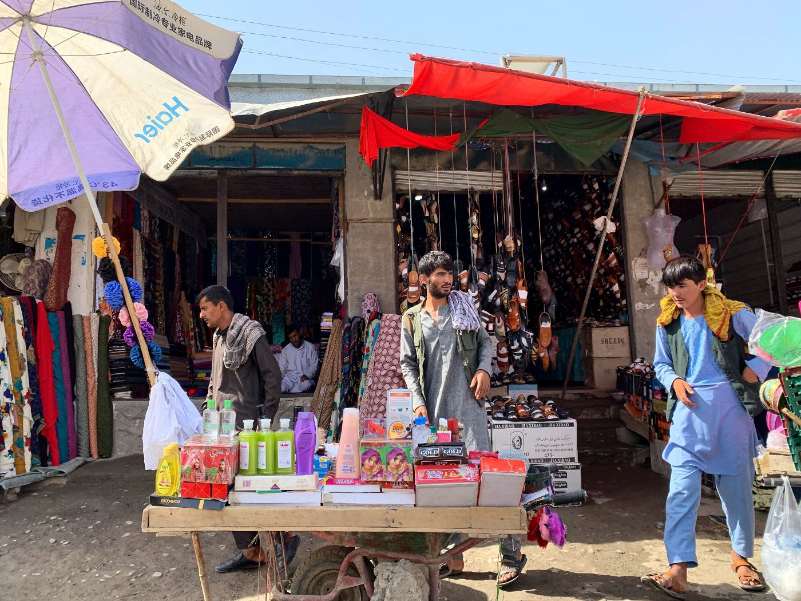

### AYS Daily Digest 11/08/2021: Afghanistan\. Finally deportations from Germany suspended
#### Updates on the situation in Afghanistan and that of Afghans outside the Country // Self\-organized crossings from Tunisia // Hunger strike in Algeria // Disembarkation from Ocean Vikings // Pushbacks from Latvia // Kurdish Family and couple fear deportation from Germany // Deportation flight from UK to Jamaica

Street life in Faizabad in 2019\. The city was conquered by the Taliban yesterday\. Copyrights: Sharif Hassan
### FEATURE: Afghanistan\.

There are days when it is especially hard to write this Digest, and today is one of them\. The situation in Afghanistan is rapidly changing, however we want to try to capture the newest developments here as well as possible\.

The Taliban’s offense is shockingly effective\. While Kabul is not yet conquered, the Taliban took control in Ghazni, a strategically important city as it is situated by the highway that connects Kandahar and Kabul\. Journalists say that the governor of the city and the police chief arranged an agreement with the Taliban and were in turn provided with safe passage out of the city\. The governor was arrested later by government forces when reaching Kabul\.

■■■■■■■■■■■■■■ 
> **[Mortaza](https://twitter.com/mortazabehboudi) @ Twitter Says:** 

> > La ville historique de Ghazni (3h de Kaboul) vient tomber aux mains des talibans. Le gouverneur et le chef de la police provinciale - les deux hauts responsables ont fait un accord avec les talibans en vertu duquel ils ont pu quitter la ville de Ghazni. #Afghanistan 

> **Tweeted at [2021-08-12 09:01:28](https://twitter.com/mortazabehboudi/status/1425744232904593410).** 

■■■■■■■■■■■■■■ 

Another recently city that has recently fallen is Faizabad\. This victory has a lot of symbolic value, as the city is among the few that the Taliban did not manage to control in the 1990s\.

At the time of writing, 10 of Afghanistan’s provincial capitals are under Taliban control\. [According to Reuters](https://www.reuters.com/world/asia-pacific/taliban-battle-government-forces-us-fears-kabul-could-fall-90-days-2021-08-12/?utm_medium=Social&utm_source=twitter) , U\.S\. Intelligence say that Kabul could be surrounded in 30 and fall in about 90 days\. U\.S\. and NATO troops will [finish their withdrawal](https://apnews.com/article/middle-east-afghanistan-taliban-26d485963b7a0d9f2107afcbc38f239a?utm_campaign=SocialFlow&utm_medium=AP&utm_source=Twitter) from the country by the end of the month\.

[In this article](https://www.bbc.com/news/world-asia-58156772) Secunder Kermani provides insight into the Taliban\-controlled Balkh province just 30 minutes from Mazar\-i\-Sharif, one of Afghanistan’s biggest cities and former base of German troops\.

The Netherlands and Germany finally announced suspension of deportations to Afghanistan\. A deportation flight from Germany that was scheduled to depart at the beginning of August was the first to be postponed\. On Wednesday however, [German Interior Minister Horst Seehofer announced](https://www.bmi.bund.de/SharedDocs/pressemitteilungen/DE/2021/08/aussetzung-abschiebung.html) that deportations are suspended “until the situation allows them again”\. On Tuesday, ambassadors of EU countries in Kabul called on their governments to stop deportations, only shortly after EU countries sent a letter to the EU\-Commission urging it **not** to stop returns \( [read more in our Digest from Tuesday](ays-daily-digest-9-8-21-afghanis-abandoned-to-their-fate-by-eu-e8defd746a5) \) \. The situation is highly contested: While it is obvious that from a humanitarian and human rights perspective that deportations are absolutely outrageous, European migrations policy hardliners won’t give in easily\. O [n Wednesday the Greek migration minister, Notis Mitarachi, said](https://www.reuters.com/world/europe/greece-says-eu-not-ready-new-migration-crisis-2021-08-11/?fbclid=IwAR2_uTANc14tS3in0At9clPnZjnyIWinm21tzTvU3MIBUNXKK_XHZAO2jSY) that Europe would not be ready for as high an influx of refugees as occurred in 2015\. Instead, Europe should support Turkey in preventing the onward movement of people\. While many people from Afghanistan reach Turkey on a daily base these days, only yesterday Turkey deported 446 people back to Afghanistan\.

■■■■■■■■■■■■■■ 
> **[AMASO](https://twitter.com/AmasoOrg) @ Twitter Says:** 

> > 460 Afghans were deported from #Turkey to #Afghanistan late last night. At the airport they were met by the officials from MoRR and IOM. Since most of the European countries have put a halt on deportation to #Afg, we urge #Turkey to do the same. source: MoRR https://t.co/8ovBbWkWcv 

> **Tweeted at [2021-08-12 05:41:50](https://twitter.com/amasoorg/status/1425693992205930498).** 

■■■■■■■■■■■■■■ 

[This report investigates the situation of refugees in Turkey, amongst them many Afghans\.](https://www.imis.uni-osnabrueck.de/fileadmin/4_Publikationen/PDFs/IMIS_WP08_SeekingRefugeinTurkey_Soykan.pdf)

Meanwhile, the criticism of Germany is getting louder, calling the country to increase efforts to provide those Afghans who worked for NATO and NGOs with the possibility of leaving the country\. [The German Defence Minister however claims](https://www.deutschlandfunk.de/verteidigungsministerin-kramp-karrenbauer-es-ist-nicht.694.de.html?dram:article_id=501588) that all efforts are being undertaken and instead it is the Afghan government that is slowing down the process\.

### SEARCH AND RESCUE
#### Report published

[The EU Agency for Fundamental Rights \(FRA\) published it’s latest report on the situation on the Mediterranean Sea](https://fra.europa.eu/en/publication/2021/june-2021-update-ngo-ships-sar-activities#TabPubTable-NGOshipsinvolvedinSARoperations1) \. According to the report, up until 15 June, 813 people have died in the Mediterranean so far in 2021\. The report contains information about the NGO ships involved in search and rescue, about their criminalization by their home countries and about the difficulties they often face in finding a safe port\. The report also contains a table of which ships have been operating\.

[This article speaks of the difficulties in counting the number of those people who die at sea](https://www.infomigrants.net/en/post/34189/dying-to-reach-europe-the-atlantic-crossing?fbclid=IwAR0JShXzjw7SNjhsvzhYL8dnDrVsyov32GOCTHq3fCoGxiklImEyvSAU1q0) , especially when it comes to the most dangerous so\-called Atlantic route from West Africa to the Canaries\.
### TUNISIA
#### Self\-organized crossings increase

A growing number of people from Tunisia are trying self\-organized crossings to Europe, [as DW reported](https://www.dw.com/en/tunisian-migrants-turn-to-self-smuggling-to-get-to-europe/a-58828200?fbclid=IwAR0JShXzjw7SNjhsvzhYL8dnDrVsyov32GOCTHq3fCoGxiklImEyvSAU1q0) \. Tunisians have been the largest group of people arriving in Italy via the sea route, according to IOM\.
### ALGERIA
#### Hunger strike after hot return

Brahim Lalami, a man from Algeria, has been on a hunger strike for 38 days while in an Algerian prison, protesting his deportation from Spain\. He has become the subject of what is called a “hot return”\. A hot return is a deportation from the Spanish enclaves of Ceuta or Melilla for which Spanish authorities deny the right to an asylum claim, arguing that there is a special zone where there is no right to apply for asylum\.

■■■■■■■■■■■■■■ 
> **[Caminando Fronteras](https://twitter.com/walkingborders) @ Twitter Says:** 

> > ‼️ Brahim Lalami lleva ya 38 días en huelga de hambre en protesta por su injusto encarcelamiento en Argelia. Las autoridades españolas son responsables de su situación, ya que a su llegada a territorio español, le arrestaron y devolvieron a Argelia de forma ilegal https://t.co/TEmyovvZoS 

> **Tweeted at [2021-08-11 18:48:49](https://twitter.com/walkingborders/status/1425529656799895556).** 

■■■■■■■■■■■■■■ 

### ITALY
#### Disembarkation

Finally 549 people who were rescued by the Ocean Viking were able to disembark at a safe port:

### LATVIA
#### Pushbacks from Latvia

Latvia seems to be following the classic script of European border enforcement, including erection of fences and employment of Frontex\. Not coming as a surprise, [Reuters has now reported on pushbacks happening at the Latvian borders\.](https://www.reuters.com/world/europe/latvia-starts-pushing-back-migrants-tense-belarus-border-2021-08-11/?fbclid=IwAR06fQn2hJe3FvXF9OoGazm4VdUXgdpvEIc5COHcOk5koeXmEschQU5-Kb8) According to the article, Latvian border guards shouted at people who tried to cross the border and scared them with patrol dogs\. According to Latvia’s Interior Ministry, 59 people have been turned back since the implementation of a state of emergency at the borders\.
### GERMANY
#### Kurdish people fear deportation

In two different cases, Kurdish people from Turkey were denied asylum and now fear deportation\.

[A family of five is currently being held in deportation detention at Berlin airport](https://fluechtlingsrat-berlin.de/presseerklaerung/10-08-2021-stoppt-die-menschenverachtende-inhaftierung-asylsuchender-am-flughafen-willy-brandt/) , after their asylum application was rejected in a fast\-track procedure\. The deportation of the family to Ukraine is scheduled for Friday, 13 August\.

[Another couple applied for asylum in Bavaria](https://www.sueddeutsche.de/bayern/bayern-abschiebung-kurden-tuerkei-1.5376301) , after being sentenced to prison in Turkey on political grounds\. Their appeal was rejected and they now fear deportation\.
#### Event with Matthias Monroy on Saturday

Researcher and journalist Matthias Monroy will speak about the new role of Frontex in Berlin on 14 August:

■■■■■■■■■■■■■■ 
> **[North East Antifa [Berlin]](https://twitter.com/antifanordost) @ Twitter Says:** 

> > #Antifa-Tresen gegen das EU-Grenzregime.

"Die neue Rolle von #Frontex"
Input von mit @[matthimon](https://twitter.com/matthimon) (@[netzpolitik](https://twitter.com/netzpolitik))

📆14. Aug 2021
📍@[KubizBerlin](https://twitter.com/KubizBerlin), Weißensee, Bernkasteler Str 78

🕑 19.30 h: open doors / 20:00 h: Input / 20:30 h: Tresen

⏩ [instagram.com/p/CSZqMolsxrq/](https://www.instagram.com/p/CSZqMolsxrq/)

#b1408 #pb1408 https://t.co/nIv1tnvS1X 

> **Tweeted at [2021-08-11 12:54:14](https://twitter.com/antifanordost/status/1425440422525083652).** 

■■■■■■■■■■■■■■ 

### UK
#### Deportation flight to Jamaica

[A deportation flight from UK to Jamaica left with fewer people then expected](https://www.independent.co.uk/news/uk/home-news/jamaica-deportation-charter-home-office-b1900539.html?fbclid=IwAR3O-mxTAm5_xMTlHJasVX3GvcsnuIQHw_nmerhjBRPwQTRChx8_yOd6o6s) , after many of those scheduled for deportation won last minute legal victories against the Home Office\. Among the people who were deported was a man in his sixties who had the right to British citizenship under the Windrush scheme but was not provided with adequate legal support\. Prior to the flight, two people tried to commit suicide and were taken to the hospital\. One of them was a man, 31 years old, who arrived in the UK as a child and now has three British children himself\.

Bella Sankey, director of NGO Detention Action stated on Twitter:

> “If the Home Office was a private company it would have been shut down for repeated regulatory breaches\.” 

For more, see this very informative thread:

**Find daily updates and special reports on our [Medium page](https://medium.com/are-you-syrious) \.**

**If you wish to contribute, either by writing a report or a story, or by joining the info gathering team, please let us know\.**

**We strive to echo correct news from the ground through collaboration and fairness\. Every effort has been made to credit organisations and individuals with regard to the supply of information, video, and photo material \(in cases where the source wanted to be accredited\) \. Please notify us regarding corrections\.**

**If there’s anything you want to share or comment, contact us through Facebook, Twitter or write to: areyousyrious@gmail\.com**

_Converted [Medium Post](https://medium.com/are-you-syrious/ays-daily-digest-11-08-2021-afghanistan-finally-deportations-from-germany-suspended-6e7023fcf08c) by [ZMediumToMarkdown](https://github.com/ZhgChgLi/ZMediumToMarkdown)._
