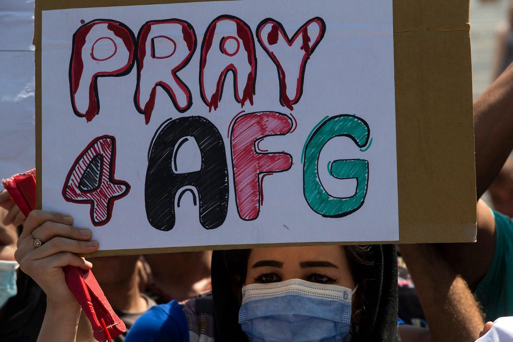

### AYS Daily Digest 20/08/2021: Solidarity and despair all over the world
### While people go on the streets in support of Afghans trying to flee Taliban, governments refuse to provide safety // New testimonies of torture from Libya // 53 people die off Canary Islands // Belarus accused of hybrid warfare

[Are You Syrious?](?source=post_page-----530754e13b7e--------------------------------)

[Aug 21](ays-daily-digest-20-08-2021-solidarity-and-despair-all-over-the-world-530754e13b7e?source=post_page-----530754e13b7e--------------------------------) · 4 min read

Protests in support of Afghan people are happening all over the world\. Credits: [Marios Lolos](https://www.facebook.com/marios.lolos.1?__tn__=-UC*F)
### Afghanistan

> _The control of Afghanistan by the Taliban will lead to the destruction of the country’s modern system of higher education, especially the equal right to education for the country’s women and ethnic and religious minorities\._ 

— conclusion of the [University of California](https://human-rights.ucdavis.edu/news/afghanistan-emergency-resource-information?fbclid=IwAR3GGPa8KFytY8XLiEA1S9DgHjGspCwuqZPT-wlEgX98do99-hydRWIE6FA) \.

However, many of Afghanistan’s neighboring countries refuse to open their borders and offer safety to the people, saying they undermine domestic security, according to [Aljazeera](https://www.aljazeera.com/news/2021/8/19/afghanistans-ex-soviet-neighbours-panic-reject-refugees?fbclid=IwAR3G-I9XExp84PbKa3qFqIFnUErzzldSMDMVUQkyz-aio9cJxmKJFE9-73U) \.

The UN underlined that for many people there is “no clear way out” of the country\. Spokesperson Shabia Mantoo explained that more than 18,000 people have left Kabul during the week and recalled that with 2\.6 million people, Iran und Pakistan are hosting 90% of the refugee population, as Reuters [notes](https://www.reuters.com/world/asia-pacific/un-refugee-agency-says-afghans-risk-have-no-clear-way-out-2021-08-20/?fbclid=IwAR1SrNjhOIN1lxUXtLKms5bczYLxAjdpP-9hBIHhKKSY6STXA-kn_qf_ETc) \. Hence, they fear another influx, France24 [adds](https://www.france24.com/en/live-news/20210817-taliban-takeover-leaves-iran-and-turkey-fearing-refugee-influx?fbclid=IwAR0Ua38knVxIYzNouC6Rut5uU1-mj7qvyKoBQ7XqAj27WBLs0UZ-9x4-iIE) \.
### [Log In or Sign Up to View](https://www.facebook.com/InfoMigrants/posts/4050636798391408)
### [See posts, photos and more on Facebook\.](https://www.facebook.com/InfoMigrants/posts/4050636798391408)

[www\.facebook\.com](https://www.facebook.com/InfoMigrants/posts/4050636798391408)

Meanwhile, European countries deported some 70,000 people between 2008 and 2020, as they deemed the country safe, Vice [calculated](https://www.vice.com/en/article/n7bmq7/europe-deported-70000-to-afghanistan-deeming-it-safe?fbclid=IwAR1ENTmqjA-a6ZxgxDXVPU8N40XBg1gij-benURgAtQy8yWr1KAY_k57N8Y) \.

The first group of Afghans has arrived in Berat, as Albania has offered temporary shelter until relocation to the US, Euronews [reports](https://euronews.al/en/albania/2021/08/19/first-group-of-afghan-refugees-arriving-in-albania-to-be-housed-in-berat/?fbclid=IwAR07s-ipdA6ALbjGFtJ9aoq0BGj_W9MOL_ni77pSyHXenk-DDLMODAMyVgY) \.

**Worth reading:**
- [European leaders are exploiting unfounded](https://www.theguardian.com/commentisfree/2021/aug/20/european-leaders-exploiting-fears-afghan-refugee-crisis-eu-afghanistan?fbclid=IwAR2vd2tUTWHcAbEMW61NXxpHNNhlIn4oztS1xwm5icFqhk-qYlRNn71kQes) fears of a repeat of the 2015 refugee crisis
- List of Resources for [People At Risk in Afghanistan](https://reliefweb.int/report/afghanistan/list-resources-people-risk-afghanistan)

### Turkey

Turkey has started building a border wall towards Iran, thus increasing its efforts to block people on the move\. According to local media, 155 of 241 kilometres are already set up, [according](https://www.euronews.com/2021/08/20/turkey-builds-a-border-wall-to-stop-refugees-from-afghanistan?fbclid=IwAR2uaehG3g4MRlMUUlo_t-br0wpSrT13M0-vu-5_2xhttzBdONeAZsgFPK0) to Euronews\.
### Libya

German TV magazine [Monitor](https://www1.wdr.de/daserste/monitor/sendungen/eu-abschottungspolitik-100.html) has shifted its focus on to the desperate situation for people trying to escape Libya, where people are exploited, tortured and raped\. They speak to survivors and analyse the situation on the ground and how the EU policy is supporting these structures\.
### Sea

With only one survivor, 53 peole died off the Canary Islands, after their boat sunk\. IOM has already recorded 250 deaths in the first six months of this year, more than twice the count of 2020, InfoMigrants [writes](https://www.infomigrants.net/en/post/34478/more-than-50-people-feared-dead-after-migrant-boat-sinks-off-canary-islands?fbclid=IwAR3fEkyu_zS6S8JoJZFTVw9JE62M6TqaPaFbpJ1OKyQZRRGP1t8nnrC_iJc) \.

Two boats heading to Lampedusa were blocked by the financial police within a few hours, [according](https://www.blogsicilia.it/agrigento/lampedusa-agrigento-sbarchi-migranti-barchini-48-profughi-guardia-finanza-tunisini/628401/?fbclid=IwAR0XQdz7DvXb-n9K_EU2s2IhmL4KtX1HYeeRxlYJzP1-ccRb5R2_sQdy2o0) to Blog Sicilia\.
### Cyprus

For almost two months, three people from Cameroon have been trapped in the demilitarized are of Cyprus’ buffer zone\. The Guardian got in touch with them and [documented](https://www.theguardian.com/global-development/2021/jul/17/no-mans-land-three-people-seeking-asylum-stuck-in-cypruss-buffer-zone?fbclid=IwAR1YG4uJqXfrY1iJM9iOkzJv08bD5ETJwn9PmIHHfqCcnXFlp163FafZLCM) their story\.
### Greece

After a shipwreck, 32 \(or 37 according to [Efsyn](https://www.efsyn.gr/ellada/koinonia/307154_limeniko-afinei-aboithitoys-37-nayagoys-prosfyges-se-brahonisida) \) peole survived trying to get to Greece\. However, they are stranded on Laros without food or water\. The efforts of the Hellenic Coast Guard are slow, writes Teacher Dude\.

Aljazeera [recalls](https://www.aljazeera.com/news/2021/8/19/taliban-takeover-a-trigger-for-child-refugees-in-greece?fbclid=IwAR3Ce5uJZ81oLVHOQZFrAGYMdr17CHENDYgTzQKKiQnIWhYYlAezwtQqjkU) that for many children in Europe, the takeover by the Taliban can trigger fears for their families left behind\. In Greece alone, there are more than 2,000 unaccompanied minors\. “The Taliban taking over Afghanistan is also a trigger\. For many refugee children, Afghanistan is a concept that has been brought to their minds and hearts by their parents\. Now it is being destroyed,” Sonia Nandzik, a founder of ReFocus, an initiative that teaches media skills to young refugees on Lesbos, said\.

Greek representatives met around the Evros river\. They walked along the border and also had a meeting with the company Space Hellas, which is contracted for an automated border surveilance system, according to Lena K\. The group made public statements that people from Afghanistan will need months to make it to the country\. Furthermore, the government is thinking of suspending the right to apply for asylum in case many people arrive in a short period, [according](https://twitter.com/MauriceStierl/status/1428729587173928962?fbclid=IwAR3DlEpfUYdAO7SmasjbAHhJrAhefUItaqMruPQF7kJpDalXWThdwKsC79Q) to Der Spiegel\.
### Belarus

For more than 12 days now, a group of 32 people from Afghanistan has been stuck in the border area between Poland and Belarus\. Both countries are refusing to take them in\. Nation\.lk [reports](https://nation.lk/online/the-afghans-marooned-on-poland-belarus-border-112591.html?fbclid=IwAR1D3pb3Mh_JmizUYIt0IXYy-P1yhPs6BgaIB8QrhJf4klNrvqsv3F9LMqE) on the case\. Lithuania has [demanded](https://euobserver.com/world/152685?fbclid=IwAR02_mjOwyaNPIv5yNF1QxW8DN1-FY4McAfd2ypax6wh87dJTJNlRRoQZuw) EU sanctions for Belarus, claiming it was using refugees as a weapon\. Also, some EU officials have criticized Minsk for its “hybrid warfare”, [according](https://www.infomigrants.net/en/post/34426/eu-leaders-condemn-belarus-for-migrant-surge?fbclid=IwAR0rNaV0CV7ZFKXkE0q_TvAS0ACBOjm1CtZm_Jo3zf9jAlpOgJdaN8Z6B7c) to DW\.
### Germany

ReFOCUS and Seebrücke have opened their Wave of Hope exhibition at Refugio Berlin\. The photos and paintings are reminders of the infamous Moria camp on Lesvos, which was burned down last year\.
### [Log In or Sign Up to View](https://www.facebook.com/refocusmedialabs/posts/3371341793096026)
### [See posts, photos and more on Facebook\.](https://www.facebook.com/refocusmedialabs/posts/3371341793096026)

[www\.facebook\.com](https://www.facebook.com/refocusmedialabs/posts/3371341793096026)

Pro Asyl invites everyone to join a protest on Sunday, demanding that people from Afghanistan be evacuated and hosted\. Seebrücke is [calling](https://twitter.com/_Seebruecke_/status/1428291337112199175) for protests all over the country this weekend\.
### France

On Thursday, police chased several Afghans in Paris, even hitting them with gas and using batons, Solidarité Migrants Wilson writes\.
### [Log In or Sign Up to View](https://www.facebook.com/permalink.php?story_fbid=1791784424355655&id=598228360377940)
### [See posts, photos and more on Facebook\.](https://www.facebook.com/permalink.php?story_fbid=1791784424355655&id=598228360377940)

[www\.facebook\.com](https://www.facebook.com/permalink.php?story_fbid=1791784424355655&id=598228360377940)
### General

Easo has [published](https://easo.europa.eu/latest-asylum-trends?fbclid=IwAR3MV8h3jGMjNiCISa603QTLG9K02mb0xfMJ5qRAivDnlt2rslHh_lFfxqk) its latest asylum trends for June 2021, counting more than 46,000 lodged asylum applications and almost 40,000 first decisions\. More than 360,000 cases are still pending\.

**Find daily updates and special reports on our [Medium page](https://medium.com/are-you-syrious) \.**

**If you wish to contribute, either by writing a report or a story, or by joining the info gathering team, please let us know\.**

**We strive to echo correct news from the ground through collaboration and fairness\. Every effort has been made to credit organisations and individuals with regard to the supply of information, video, and photo material \(in cases where the source wanted to be accredited\) \. Please notify us regarding corrections\.**

**If there’s anything you want to share or comment, contact us through Facebook, Twitter or write to: areyousyrious@gmail\.com**

_Converted [Medium Post](https://medium.com/are-you-syrious/ays-daily-digest-20-08-2021-solidarity-and-despair-all-over-the-world-74f9028f40e3) by [ZMediumToMarkdown](https://github.com/ZhgChgLi/ZMediumToMarkdown)._
