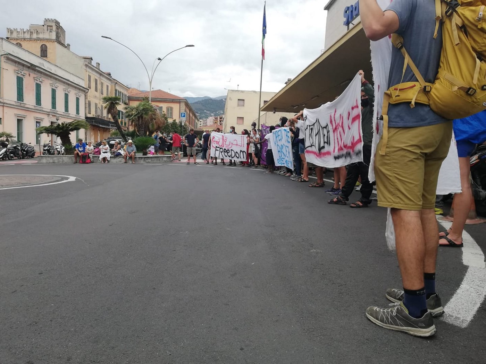
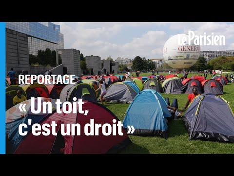

### AYS Digest 03/09/21 — MEPs challenge Slovenia over chain\-pushbacks of people on the move
#### Rescues off Spain // Multiple drownings during pushbacks in Meriç river // Updates on protest camp in France // Remembering Alan Kurdi
### FEATURE — “Tell us what you will do to stop the illegality, impunity and the brutality”: MEPs confront Slovenia over chain\-pushbacks

 \)](assets/5cb22228b080/1*YLtt0p0GeO6eEBuWh7Iq8g.jpeg)

MEPs from the Left in the European Parliament pose with BVMN’s Black Book of Pushbacks this month\. \(Source: [Twitter](https://twitter.com/Left_EU/status/1433443368953122817) \)

This week, MEPs in the Left in the European Parliament challenged Slovenian Interior Minister Aleš Hojs over Slovenia’s participation in chain\-pushbacks of people on the move during a meeting of the European Parliament’s Committee on Civil Liberties, Justice and Home Affairs\. The intervention in the EP was prepared BVMN and network members InfoKolpa and Are You Syrious, and saw MEPs criticizing the Slovenian Ministry of the Interior for continuing to ignore a Supreme Court ruling which established that Slovenia had violated the rights of a Cameroonian man through a chain\-pushback\. Malin Björk, an MEP from Sweden, had recently returned from a visit to Velika Kladuša, in northwest Bosnia, with representatives from AYS\. Björk spoke about what she saw there:

> I was in Velika Kladuša in Bosnia, I was astonished to meet many migrants and refugees that had been to Slovenia, but they had been told that the right to seek asylum did not exist in your country\. One of the persons that I met there was from Cameroon and had escaped political persecution\. Once he thought he was in safety in Slovenia he called the police himself to ask to be able to claim asylum\. Instead he was as so many others, as thousands of others, handed over to the Croatian police who brutalised him and sent him back to Bosnia\. 

> This case is a little bit special, compared to the many thousands of others, because on 9th April this year the Slovenian Supreme Court itself ruled that Slovenian police had violated the principle of non\-refoulement, the prohibition of collective expulsion and denied him the right to seek international protection\. 

> You \(Minister Hojs\) have had meetings with Commissioner Johansson and you have said you will stand up for the right to seek asylum for asylum seekers\. Now your own court has found that you fail in this case\. So my questions are: Will you stand by your words and provide a humanitarian visa for this person so that he can come back to Slovenia to apply for asylum as he was supposed to have been granted two years ago? And the second is more structural of course, how will you ensure that people have the right to apply for asylum in Slovenia, that they are not brutally pushed back to Croatian police, who are then illegally pushing them back to Bosnia in a kind of chain pushback situation which is a shame, a shame, at European borders?” 

The case to which Björk refers was the result of strategic litigation efforts led by BVMN network member InfoKolpa, which resulted in a [landmark judgement issued on 16 July 2020](https://www.borderviolence.eu/press-release-court-find-slovenian-state-guilty-of-chain-pushback-to-bosnia-herzegovina/) by the Slovenian Administrative Court\. The case established that in August 2019, the Slovenian authorities carried out an illegal collective expulsion of a persecuted English\-speaking minority member from Cameroon who wished to apply for asylum in the country\. The Slovenian Supreme Court found on April 9, 2021 that its own police force had violated the principle of non\-refoulement, the prohibition of collective expulsions and denied the individual the right to seek international protection\. The court ordered that the Cameroonian man be allowed to re\-enter Slovenia and ask for asylum, but the authorities have thus far made no efforts to respect the court’s ruling\.

During the Committee meeting, Malin Björk handed a copy of the [Black Book of Pushbacks](https://www.borderviolence.eu/launch-event-the-black-book-of-pushbacks/) to Minister Hojs\. The Black Book is a dossier of cases recorded by BVMN of pushback testimonies from across the Balkans stretching back to 2017\. The book contains a large section on Slovenian chain pushbacks — 1266 people who had been chain pushed back from Slovenia, via Croatia, to either Bosnia or Serbia\.

“I expect you as a responsible Minister, not only for your country, but for the EU Presidency to take part of this document and tell us what you will do to stop the illegality, impunity and the brutality,” Björk told Hojs\.
### TURKEY
#### Turkey won’t ‘pay to keep refugees away’ from EU anymore

The Turkish Minister of Foreign Affairs Mevlüt Çavuşoğlu said on Thursday that the EU\-Turkey deal will need to be updated in the wake of Afghanistan’s fall to the Taliban, [media reported](https://bianet.org/english/world/249679-turkey-won-t-accept-eu-s-pay-to-keep-refugees-away-approach-says-foreign-minister?fbclid=IwAR0KCT3JfiffkwYQmz5jTDpmjIOifFeUSQ09M6utfga3CuWTnSRHjavoG08) \.

“With regards to the Afghans, there will be no cooperation if there is an understanding like ‘We are paying you so you keep refugees’,” Çavuşoğlu said on Thursday, September 2, at a joint press conference with his counterpart from the Netherlands, Sigrid Kaag, in Ankara\.

“This problem is getting bigger and bigger\. It also creates problems\. If it’s a problem for the EU, it’s a problem for Turkey as well,” Çavuşoğlu continued\.
### SEA/SAR
#### Sea\-Eye 4 wants to bring rescued people to shore

Following a rescue of 29 people on September 1, the crew of Sea\-Eye 4 are now [looking for a port of safety](https://sea-eye.org/sea-eye-4-bringt-hochschwangere-und-babys-in-sicherheit/?fbclid=IwAR0Lnsr4PkRXjnx40P6xE95Pzd9nxTmGPJ2V9ezi6mimtdyodM84Lr6gySc) \. Among the rescued are 18 minors, four of whom are babies, and eight are women\. Two women are nine months pregnant\. The ship is now in rough seas, as strong winds have picked up in the days after the rescue\. The crew says the babies and the two pregnant women must be brought to shore as soon as possible to receive medical treatment\.

According to Sea\-Eye’s press release, the Italian coast guard has referred the crew to German authorities\. The ship is now on a course for Sicily and says it will continue to ask the Italians and Germans for assistance\.
#### Rescues off Spain

[Spanish authorities rescued 70 people](https://www.canarias7.es/canarias/lanzarote/salvamento-rescate-inmigrantes-20210902162622-nt.html?fbclid=IwAR1FDi2qsxPfLVriscJBJKAKJj5hClhsJu6uSFzgpxhOVLJUcYyisLVfBSo) from three boats on Thursday, two next to Lanzarote and one off Fuerteventura\. [Four people were rescued](https://www.europapress.es/andalucia/cadiz-00351/noticia-rescatadas-cuatro-personas-patera-navegaba-aguas-cadiz-20210903102011.html?fbclid=IwAR3EwT2BabZipMzG1Ajoh5BoB9t3jsWcSBxhM4om-VpepCsp-sZobTDy0Nw) on Friday morning from a boat near Cadiz, in southern Spain\. Later on Friday, another [17 people were rescued](https://www.europapress.es/andalucia/almeria-00350/noticia-rescatadas-17-personas-navegaban-patera-aguas-proximas-cabo-gata-almeria-20210903212528.html?fbclid=IwAR3ErdGUq-yXkZDQ9lVe52iZBa3Zs2GjzW5Lr60AvAEFaMbOsYdg286Bpps) in the waters off Cabo de Gata \(Almería\) \.
### GREECE
#### People thrown into Meriç River, some drowned

■■■■■■■■■■■■■■ 
> **[Lena K.](https://twitter.com/lk2015r) @ Twitter Says:** 

> > A group of people were thrown into the river by Turkish forces after they had been pushed back by their Greek counterparts. Two/three people drowned.
[mezopotamyaajansi35.com/tum-haberler/c…](http://mezopotamyaajansi35.com/tum-haberler/content/view/145495)
[anfenglishmobile.com/human-rights/l…](https://anfenglishmobile.com/human-rights/lawyer-Celik-refugees-face-death-at-turkish-greek-border-54475)
[twitter.com/HarekAct/statu…](https://twitter.com/HarekAct/status/1432115079282110471) 

> **Tweeted at [2021-09-03 17:43:24](https://twitter.com/lk2015r/status/1433848114029416452).** 

■■■■■■■■■■■■■■ 

Two new witnesses have come forward and said they were among the group of people on the move who were thrown into the Meriç River after their extradition to Turkey, [media reported](http://mezopotamyaajansi35.com/tum-haberler/content/view/145495?fbclid=IwAR2VFlrAZro9F3yK4CSARBR4WfjFk0UL7VS30umCASe_50-HKDsmRWG3H0g) \.

According to witnesses, on August 23, a group of some 45 men — among a group of 150 who were caught after crossing into Greece from the Edirne and later returned to Turkey — were thrown into the Meriç River by soldiers\.

Witnesses say that one Afghan asylum seeker in his fifties was thrown into the river after being shot by soldiers\. Apparently, two or three of the people drowned\.

One man, Sad El Delli, 24, from Syria, told his story\. He was among the group thrown into the river\. After the group was brought back to Turkey, they were separated into men and women and thrown into the river with a group of 45 people, including children over the age of 10\. Delli also said that the commander, who ordered the soldiers to do this, said “goodbye” and waved at them, recording the incident on video\.
#### Supporters of Amal the puppet girl tear\-gassed

■■■■■■■■■■■■■■ 
> **[Lena K.](https://twitter.com/lk2015r) @ Twitter Says:** 

> > Police tear gassed anti-fascists who were protesting against far right groups opposing the planned 'walk' of the Amal doll through the area of Metaxourgeio. In essence police siding with the far right, again.
[tvxs.gr/news/ellada/ak…](https://tvxs.gr/news/ellada/akrodeksioi-akyrosan-ti-bolta-tis-amal-sto-metaksoyrgeio)
[news247.gr/koinonia/akyro…](https://www.news247.gr/koinonia/akyrothike-to-perasma-tis-amal-apo-to-metaxoyrgeio-chimika-stin-antifasistiki-sygkentrosi.9343557.html) 

> **Tweeted at [2021-09-03 18:00:36](https://twitter.com/lk2015r/status/1433852442484121606).** 

■■■■■■■■■■■■■■ 

Read more about the incident [here](https://tvxs.gr/news/ellada/akrodeksioi-akyrosan-ti-bolta-tis-amal-sto-metaksoyrgeio?fbclid=IwAR3XXtDwA4H6PAKbna4fq4QEOCuuv2sdkXjupQ9Y6jOZmDa6sJxN20MGX3k) \.
#### Resources for new arrivals to Samos

Med’EqualiTeam has compiled a list of resources for new arrivals to Samos, which can be accessed [here](https://www.facebook.com/MedEqualiTeam/posts/2336980586437690) \.
### ITALY
#### Progetto20k on the recent death of a young man on French\-Italian border

> Five days ago, a young man died electrocuted on the roof of a train, trying to cross the border between Italy and France\. 

> We all know that this wasn’t the first and unfortunately it won’t be the last victim of the border unless the border system soon ceases to exist\. 

> Everything that happens — the violence, the deaths, the abuse — has been normalized and invisible: most people don’t talk about it, the media — local and national — are limited to scrapes and journalistic services that don’t deepen the situation and they don’t identify the causes\. 

> For this reason, we are calling everyone to participate in an action in Ventimiglia tomorrow, Saturday, September 4, in front of the train station at 12\.00\! 

> It’s time to raise our voices and reiterate, over and over again, that these deaths are caused by the institutions on both sides of the border, by their disinterest in the lives of individuals, by their processes of dehumanizing those people who, undocumented , they are labeled ′′ illegal “\. 

> It’s time to scream all together that borders kill and mobilize and act against these death policies\! 

Source: [Facebook](https://www.facebook.com/progetto20k/posts/1490608911299018) \.
#### Transfers from Lampedusa continue

A group of 160 people left Lampedusa for Sicily this Thursday morning, [media reported](https://www.infomigrants.net/en/post/34821/italy-migrant-transfers-from-lampedusa-to-sicily-continue?fbclid=IwAR3XXtDwA4H6PAKbna4fq4QEOCuuv2sdkXjupQ9Y6jOZmDa6sJxN20MGX3k) , but the reception centre remains at twice its capacity\. A total of 568 people are currently housed there in a facility designed for no more than 250\.
#### Open Arms’ Astral arrives in Syracuse

The Astral’s two\-week long mission, Open Arms’ 84th mission, [has come to an end](https://www.facebook.com/plugins/post.php?href=https%3A%2F%2Fwww.facebook.com%2FNewsfromtheMed%2Fposts%2F1290007958119464&show_text=true&width=500&__cft__[0]=AZWHJ7_jUVNGY0iX4AhiMzjSyw0h67sMevbG2HERvAkAyuBkQsJMyo8JeGfMbVQHuxONnlfpG5zUy2m8Q8m6CFDQGe-c0te1BBhHe7j86f50ZxaeUWOUpXowee-HnfgSxLgEcq0L4E9QPf9jVnXCJq4V1cH_VhS5Hc2Io6y-znoqYDrsBUARl429q785Nvt0OgBnpncihEQVaRJibakHyn9_&__tn__=R]-R) \. The ship will soon embark again, however\.
### SERBIA
#### Klikactiv organizes legal workshop for No Name Kitchen

> As volunteers on the ground at [\#Šid](https://www.facebook.com/hashtag/%C5%A1id?__eep__=6&__cft__[0]=AZVuwYHWT1BUoyM1Zt4zqhHRKCR-R-MDV7ZJlXtrB6W08Z1KLr4GnjbL5NB3-L8-HeozScIk1Y29epjtrqQeUWKmOj2x_8abM7dfix1pYzhJ__jpnjyZR2KQYiG6x7XIf-IF_rsvuXcxrQbW8Bd3egipiqdbRZWDrIOd56UzAHwsHGEh4sJq2r9zatv782N_7C8&__tn__=*NK-R) , we often experience the confusion and misconceptions of people who move about the European asylum process and other legal issues\. To be a little more informed, we organized a legal workshop with Milica, from [Klikaktiv\-Centar za razvoj socijalnih politika](https://www.facebook.com/klikaktiv/?__cft__[0]=AZVuwYHWT1BUoyM1Zt4zqhHRKCR-R-MDV7ZJlXtrB6W08Z1KLr4GnjbL5NB3-L8-HeozScIk1Y29epjtrqQeUWKmOj2x_8abM7dfix1pYzhJ__jpnjyZR2KQYiG6x7XIf-IF_rsvuXcxrQbW8Bd3egipiqdbRZWDrIOd56UzAHwsHGEh4sJq2r9zatv782N_7C8&__tn__=kK-R) , in Belgrade\. 

> This workshop, which was generously offered for free, was extremely clear and informative and has allowed us to answer some basic questions to prevent rumors from circulating that can sometimes be dangerous and harm people’s asylum requests\. 

Full text [here](https://www.facebook.com/NoNameKitchenBelgrade/posts/1309391732792441) \.
### SLOVENIA
#### Event: Discussion on Migration and the Situation on the Balkan Route

Info Kolpa is hosting an event on Saturday, September 11 at 18:00\. Read the event description below:

> The Balkan Route, which is one of the main migration routes to Central Europe, crosses through Slovenia\. Many travel daily across a range of countries in the Balkans to reach their destination in the north or south\. Some travel this route by car, bus or train, others are denied the right to cross borders freely and travel illegally, walk hidden in the woods or pay for hiding in a wagon or truck trailer\. Some are looking for a holiday and vacation at the seaside, others are looking for work and income abroad that would offer them a decent life\. Some have been evicted from their homes due to persecution and are looking for safety and a place where they could live a normal life again\. Who decides which of them has the right to travel, whether for vacation, safety, job search or a desire for education? What do migrations mean for the local population on the Balkan route? What are the lives of those who have no choice but to leave their homes and seek refuge even though they do not enjoy the right to freedom of movement? 

> These and similar issues will be raised at a discussion event on migration, which is being held jointly with the MKNŽ\. The event will take place on Saturday, 11 September 2021, at 6 pm in the garden of Sokolski dom in Ilirska Bistrica\. Welcome\! 

### POLAND
#### Amnesty International on Poland’s declaration of ‘state of emergency’

“The Polish government’s declaration of a “state of emergency” at the border with Belarus presents serious risks for asylum\-seekers trying to reach Poland and threatens to exacerbate the already dire situation faced by 32 Afghans, including four women, 27 men and a 15\-year\-old girl, who have been held there without adequate food and clean water for over three weeks, after being pushed back from Poland,” [Amnesty International](https://www.amnesty.org/en/latest/news/2021/09/poland-state-of-emergency-risks-worsening-already-dire-situation-for-32-asylum-seekers-at-border/?fbclid=IwAR1FRR63ufnEWel0su_-8u9HNp0apimqj6eeNZxzd3ayVkJsEPNAylKioc8) said in a press release\.

“A state of emergency allows a state to restrict certain human rights in extreme circumstances where there is a “threat to the life of the nation”\. No such threat exists in Poland where the authorities are attempting to cynically exploit this power to target asylum seekers and those who support them,” Nils Muižnieks, Director for Europe at Amnesty International, said\.
### FRANCE
#### Updates on protest camp in Paris

■■■■■■■■■■■■■■ 
> **[Utopia 56](https://twitter.com/Utopia_56) @ Twitter Says:** 

> > 3e nuit sous tente pour plus de 1000 personnes, dont 240 enfants, au pied de la préfecture de #Paris. Face au silence continue de @[gouvernementFR](https://twitter.com/gouvernementFR), riverain•es, citoyen•nes, bénévoles se mobilisent 24h/24 pour assurer une présence, et organiser la vie du campement. https://t.co/cNjHzUQ6Pj 

> **Tweeted at [2021-09-03 20:57:19](https://twitter.com/utopia_56/status/1433896912386658306).** 

■■■■■■■■■■■■■■ 

■■■■■■■■■■■■■■ 
> **[Utopia 56](https://twitter.com/Utopia_56) @ Twitter Says:** 

> > Originaires d’Afghanistan, une maman et ses trois enfants sont arrivés hier à #Paris. Ce soir, comme 800 autres personnes, ils passeront une seconde nuit en tente sous les fenêtres de la préfecture. En France, le passage par la rue reste imposé à tous les demandeurs d’asile. https://t.co/l0eQUlgYh5 

> **Tweeted at [2021-09-02 20:49:31](https://twitter.com/utopia_56/status/1433532562924781568).** 

■■■■■■■■■■■■■■ 

#### Expulsion in Calais — video

■■■■■■■■■■■■■■ 
> **[Human Rights Observers](https://twitter.com/HumanRightsObs) @ Twitter Says:** 

> > ❌Expulsion ce matin à #Calais : un gendarme a empêché des personnes #exilées de récupérer leur tente, puis a donné de violents coups de pieds dans celle-ci.

Chaque jour, des scènes similaires de #violence se produisent à la frontière franco-britannique. 

@[Prefet62](https://twitter.com/Prefet62) @[Gendarmerie](https://twitter.com/Gendarmerie) https://t.co/5aINTj4A0O 

> **Tweeted at [2021-09-03 15:00:00](https://twitter.com/humanrightsobs/status/1433806991433023490).** 

■■■■■■■■■■■■■■ 

### UNITED KINGDOM
#### UK has poor plans for housing as Afghans arrive

Thousands of Afghans evacuated to Britain in recent weeks will be placed in temporary hotel accommodation for “an indefinite period” as local councils say they have been left “in the dark” about how they can help, [media reported](https://www.independent.co.uk/news/uk/home-news/afghans-hotels-refugees-home-office-uk-b1913030.html?fbclid=IwAR1FRR63ufnEWel0su_-8u9HNp0apimqj6eeNZxzd3ayVkJsEPNAylKioc8) \.

■■■■■■■■■■■■■■ 
> **[West London Welcome](https://twitter.com/wlondonwelcome) @ Twitter Says:** 

> > We support hundreds of asylum seekers living for months in tiny hotel rooms. That newly arriving Afghans may suffer the same fate doesn’t surprise us - the Home Office has a housing crisis. They haven’t procured enough proper housing, despite asylum numbers being historically low 

> **Tweeted at [2021-09-03 10:08:42](https://twitter.com/wlondonwelcome/status/1433733686202093568).** 

■■■■■■■■■■■■■■ 

■■■■■■■■■■■■■■ 
> **[Jeff Crisp](https://twitter.com/JFCrisp) @ Twitter Says:** 

> > UK.
The inevitable photo opportunity from the person who is planning to detain, imprison and deport Afghan refugees: 

> **Tweeted at [2021-09-03 07:50:25](https://twitter.com/jfcrisp/status/1433698882626666496).** 

■■■■■■■■■■■■■■ 

#### Newcastle residents show up for Afghans — here’s how you can contribute, too

See more at [this link](https://www.chroniclelive.co.uk/news/north-east-news/see-huge-show-kindness-afghan-21474615?fbclid=IwAR0gH1qB-_mBpJEgG8AFHMBWl-3RwYZY1ZXx-TfezzwOOA4KkOr8nUb4ASo) for a list of charities and ways you can help if you live in the Newscastle area\.
#### Resources for Afghans who have been rejected for asylum in the UK

■■■■■■■■■■■■■■ 
> **[Hope Projects 🧡 @HopeProjects@mastodonapp.uk](https://twitter.com/HopeProjectsWM) @ Twitter Says:** 

> > Important information for Afghans trying to overturn refusals of asylum in the UK. Full details in English / Pashto / Dari at link

[hope-projects.org.uk/afghan-legal-i…](https://hope-projects.org.uk/afghan-legal-information/) https://t.co/WBLxyJZOyd 

> **Tweeted at [2021-09-03 12:18:45](https://twitter.com/hopeprojectswm/status/1433766411478999040).** 

■■■■■■■■■■■■■■ 

### DENMARK
#### Impeachment trial underway for former Danish migration minister

A former minister for migration in Demark who was known for separating migrant couples will face an impeachment trial in the coming months, [media reported](https://www.infomigrants.net/en/post/34804/impeachment-trial-begins-for-former-danish-migration-minister-who-separated-migrant-couples?fbclid=IwAR2VFlrAZro9F3yK4CSARBR4WfjFk0UL7VS30umCASe_50-HKDsmRWG3H0g) \. Inger Stoejberg, who held the position from 2015–2019, could face a fine or even prison time if she is convicted\.

■■■■■■■■■■■■■■ 
> **[Jeff Crisp](https://twitter.com/JFCrisp) @ Twitter Says:** 

> > The same Denmark that would like to expel all asylum seekers from its territory: 

> **Tweeted at [2021-09-03 08:29:13](https://twitter.com/jfcrisp/status/1433708649684287488).** 

■■■■■■■■■■■■■■ 

### GENERAL
#### Commemorations of Alan Kurdi

](assets/5cb22228b080/1*8aR_7TK4jAyzQSXTXS13tw.jpeg)

Source: [InfoMigrants](https://www.facebook.com/InfoMigrants/posts/4094654497322971)

It has been six years since Alan Kurdi died\. During a commemorative ceremony in eastern Turkey, activists lay down on the beach in red shirts next to the words “Aylan Baby”, spelled out in flowers\.

More commemorations:

#### Weekly bulletins

ECRE weekly bulletin — [link](https://mailchi.mp/ecre/ecre-weekly-bulletin-3092021?e=1fd2db1ebf&fbclid=IwAR0KJ0EetO7Xze96ihc_9hXOzFXbaXKY4CC5TFE6YJIoRc1AVdH7bPaxKeI)

ELENA weekly legal update — [link](https://mailchi.mp/ecre/elena-weekly-legal-update-3-september-2021?e=[UNIQID]&fbclid=IwAR0WHMQQXGZNCe55QdsTvlkh4nMHMheOFYRYwdvDrahQ8CH6F2kj9-tdzfU)
#### Funding opportunities

[Step\-Up Fund II](https://www.vluchtelingenwerk.nl/publicaties/webartikelen/step-fund-ii-call-project-proposals-2021-2022-out?fbclid=IwAR3EwT2BabZipMzG1Ajoh5BoB9t3jsWcSBxhM4om-VpepCsp-sZobTDy0Nw) — Step\-up Fund II in Spain, Italy, Croatia, and Greece to improve refugee protection and inclusion at the borders of Europe\. Non\-profit organizations from these countries can submit applications for capacity\-building support for up to €10,000 euro and receive support from the Dutch Council for Refugees in the form of knowledge exchange or training\.
#### Events

[Opening more avenues for protection for refugees](https://www.migrationpolicy.org/events/opening-more-avenues-protection-refugees?fbclid=IwAR3_M5jTgTkYC93TPU-Dlgw2rSNqkxD-0KHkGMJz_rOhC71cm_-zLZ5LrHU) , hosted by the Migration Policy Institute on Monday, September 13 at 15:00CET\.
### WORTH READING
#### Germany’s labor chief says country needs 400,000 immigrants a year

#### Thinking about Kabul: the first Afghan refugees arrive in Albania — Kosovo2\.0

**Find daily updates and special reports on our [Medium page](https://medium.com/are-you-syrious) \.**

**If you wish to contribute, either by writing a report or a story, or by joining the info gathering team, please let us know\.**

**We strive to echo correct news from the ground through collaboration and fairness\. Every effort has been made to credit organisations and individuals with regard to the supply of information, video, and photo material \(in cases where the source wanted to be accredited\) \. Please notify us regarding corrections\.**

**If there’s anything you want to share or comment, contact us through Facebook, Twitter or write to: areyousyrious@gmail\.com**

_Converted [Medium Post](https://medium.com/are-you-syrious/ays-digest-03-09-21-meps-challenge-slovenia-over-chain-pushbacks-of-people-on-the-move-5cb22228b080) by [ZMediumToMarkdown](https://github.com/ZhgChgLi/ZMediumToMarkdown)._
