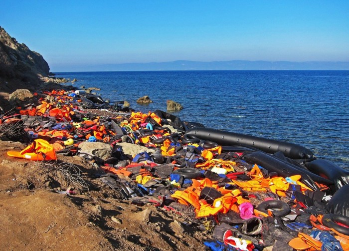

### AYS Daily Digest 06/09/21 — Bill Restricting Rescue NGOs Voted into Greek Law
### Documented pushback on Samos // Protests in Barcelona // French activists remember baby who died in Calais // Channel crossings increase

[Are You Syrious?](?source=post_page-----2bdd5b6eba5f--------------------------------)

[17 hours ago·8 min read](ays-daily-digest-06-09-21-bill-restricting-rescue-ngos-voted-into-greek-law-2bdd5b6eba5f?source=post_page-----2bdd5b6eba5f--------------------------------)
### FEATURE — Anti\-rescue NGOs bill passes in Greek parliament

Source: [Pixabay](https://pixabay.com/photos/life-jackets-syria-war-orange-3290742/)

Legislation designed to hinder search and rescue NGOs in Greece, which was [criticized recently by the Council of Europe](https://www.coe.int/en/web/commissioner/-/greece-s-parliament-should-align-the-deportations-and-return-bill-with-human-rights-standards) \(CoE\) has now been passed into law by the Greek Parliament, Greek [media has reported](https://www.efsyn.gr/ellada/dikaiomata/309000_lathro-nomoshedio-apelaseon-dioxeon-kai-ypo-oroys-diasoseon-egine-nomos) \.

AYS has already written about the legislative package in previous digests \( [Sep\. 1](ays-digest-01-09-21-european-values-are-exclusion-and-cruelty-meeting-of-ministers-on-d81a4f3da8bc) and [Sep\. 4–5](ays-weekend-digest-4-5-9-21-will-the-german-state-intervene-to-keep-its-promise-to-reunite-the-788f95e3d924) \) \.

Article 40 of the new Greek Deportations and Return Bill would introduce restrictions and conditions on the activities of civil society organizations in the regions in which the Hellenic Coast Guard holds official authoritiy\. Non\-observance of these will be subject to heavy sanctions and fines\. The law requires NGOs to submit Local Emergency Plans in advance and to agree to follow the orders of local Port authorities or risk paying fines and even prison sentences for rescue operations\. It also grants the Greek state the power to retroactively punish organizations that have carried out independent operations, even if they attempted to cooperate with the Coast Guard but were rebuffed\.

On Sep\. 3, Dunja Mijatović, CoE Commissioner for Human Rights, expressed her grave concern over the proposed legislation:

> _The Greek parliament should reconsider a legislative proposal currently being discussed, which would seriously hinder the life\-saving work carried out at sea by NGOs, and their human rights monitoring capacities in the Aegean\[…\]_ 

> _I am disappointed to learn that the comments and recommendations made by the national human rights structures and expert NGOs regarding the lack of sufficient human rights safeguards were not taken into consideration by the Greek authorities\. I call on members of the Parliament to draw on these recommendations to ensure that the Bill, once adopted, fully reflects Greece’s obligations, including under the European Convention on Human Rights and the Refugee Convention\._ 

Opposition members in the Greek Parliament also spoke out against the legislation\.

“It is a bill that continues the impassable, xenophobic and legally slippery path that the government has started down\. With more people being condemned to live in grey areas, making them invisible, without rights and obligations, without life, without balance of rights and integration with local communities,” George Psychogiou of SYRIZA said\.

Giorgos Kaminis, a former Ombudsman and mayor of Athens, asked if Prime Minister Mitsotakis and his party had “not learned anything from the past?”

“Does anyone think that stricter legislation at the expense of immigrants will solve the problem of illegal immigration in the country?”, he continued\.

The current Ombudsman said the bill presents “a serious risk of abusing the deportation return procedures by violating the guarantees of the relevant directive\. It must be clear that, especially for asylum seekers, there is an explicit exemption from the provisions of the Returns Directive and that they explicitly have the right to remain in the country until the asylum procedure is completed, without the risk of deportation\.”
### AFGHANISTAN
### Protests in major cities, fighting in Panjshir continues, humanitarian catastrophe looms
### Afghan pilots in limbo in Uzbekistan

A group of US\-trained Afghan pilots and other personnel are stranded at a camp just over the border with Uzbekistan\. They are said to be waiting for a US evacuation that does not appear to be coming\. They are too terrified to return home to Afghanistan for fear of reprisals by the Taliban\. Read more [here](https://www.eureporter.co/world/afghanistan/2021/09/06/theyll-kill-us-afghan-pilots-at-uzbek-camp-fear-deadly-homecoming/?fbclid=IwAR3u3-5nepkQuwlyv63JxU9PoZAzJFaRCJKI1636SD6KQclk9-8F4Er-ezA) \.
### TURKEY
### Afghans fear deportation

Meanwhile, in Turkey, where tens of thousands of Afghans have lived for years, working without papers, many now fear deportation to Afghanistan, according to this [media report](https://www.thenationalnews.com/world/europe/2021/09/06/afghans-in-hiding-amid-rumoured-immigration-crackdown-in-turkey/?fbclid=IwAR2Kqdqe7wUgmpY-DtliJDxhHm0XHjOU_zmVT_8e2Us-ZjNT-5MT74pnNeg) \.
### GREECE
### Robbed, kidnapped and returned in front of Samos locals

Twenty people from a boat carrying 25, which had recently landed on the island of Samos, were reportedly the victims of a violent attack by the Greek police, who robbed them, kidnapped them and left them adrift on life rafts at sea — all in front of local eyewitnesses\.

The group had apparently split in two after arriving at a beach near Karlovasi, Samos\. Five people made it to the camp, but the remaining 20 were discovered in the village of Leka by locals, who gave them food and water, according to Greek [media](https://www.efsyn.gr/ellada/koinonia/309031_toys-apigagan-toys-listepsan-toys-epanaproothisan-mprosta-sta-matia-ntopion) \.

Soon after, the police arrived\. According to multiple eyewitnesses, they took the new arrivals’ money, phones and other possessions and put them into a black bag\. The people were subsequently forced into a white van with no licence plates and were not seen again by the villagers\. Later, another villager saw from atop a mountain two Greek Navy boats driving towards Turkish waters and then returning — likely taking the people back out to sea\.

A local news outlet has photos and videos of the people who landed, which arrivals also sent to legal aid NGOs on the island\.
### Another ‘border crisis’ article

More fear mongering about possible increases in arrivals in [Greek news](https://www.kathimerini.gr/society/561486754/metanasteytiki-piesi-se-evro-kai-anatoliko-aigaio/?fbclid=IwAR0ABsffCvznrfS1ebPhzi4C4GfjALy0PI0sQVJSvGScLUl1lMzTAzy6W48) \. Researcher Lena K\. breaks down the article with some hard facts \( [see thread](https://twitter.com/lk2015r/status/1434898650686230535?fbclid=IwAR2Bx01f101tJYYi9UGu-M030qbjSdnrT6cSaDHYku8TJ1-7MPomvD3BDNI) \) \.
### ITALY
### Boats in distress, via Alarm Phone
### SPAIN
### Protests in Barcelona, via No Name Kitchen

\(Source: [Facebook](https://www.facebook.com/NoNameKitchenBelgrade/posts/1312434272488187) \)

> _Yesterday, more than 300 people gathered in Barcelona to draw attention to a plight affecting a significant number of minors\. From No Name Kitchen in [\#Ceuta](https://www.facebook.com/hashtag/ceuta?__eep__=6&__cft__[0]=AZWUaZsbkJS5bRyTyoVcbaaN_6tlluAz0hnW_-Z716qfrTfvQPkSNZoZiGyAOH1f0-BU3ydvRwNay6JVuMk6eRlPWkKtxSkfe06E2shbYLSaIzdzAUKxD7bobr5IMR1Pk8lnBhOc-b_yFXexmz0ExjhMz1FK_MU9YPfzy8y7LixHWX2riS0DNL8EkVLO8pHv5vs&__tn__=*NK-R) we join the multiple rallies that are taking place in different territories, and we show our total disagreement with the decision of the Ministry of the Interior to curb the royal decree reforming the Aliens Regulations\. This reform previously sought to adapt the Aliens Regulations to the needs of the minors \(those without guardians\) \. Therefore, by stopping it, these people are being left legally helpless\. More than a year ago, the Government pledged to carry out this reform in order to make it easier for young people and teens who have migrated alone to transition to adult life; and this pledge remains unfulfilled\. Modification is essential in order to address the exclusionary situation that forces thousands of young people to live without family and social support\. Moreover, upon reaching adulthood, these people cannot work nor can keep hold of their residency permit, leaving them in a precarious situation of Administrative irregularity due to the obstacles posed by the current Regulation\. A rule putting integration measures at the centre is urgently required; one that promotes the social inclusion of young people, putting respect for and protection of human rights above any political divergence\._ 

> _From Ceuta we want to express our concern about the hostility of the situation in the Autonomous City\. Police have been raiding and holding minors in Santa Amelia’s Polideportivo, a totally inadequate space, in very precarious conditions, where they are treated in an absolutely degrading, even violent manner by some workers\. Santa Amelia is the same center from which, a couple weeks ago, they took 55 minors and illegally returned them to Morocco against their will\. Therefore, many minors don’t want to be there and prefer to be on the street \(usually they spend their days outside the Lidl supermarket\) with everything that this entails, including systematic police control\. In addition to this fear, there is great frustration as they are aware of the legal helplessness of their predicament\. They’ve seen how some of their friends, on reaching adulthood, have been expelled from the center without any kind of documentation or have been illegally returned to Morocco\._ 

### NORTH MACEDONIA
### President stokes fears of Afghan arrivals

In an interview with [Radio Free Europe](https://www.rferl.org/a/north-macedonia-president-refugee-crisis/31446505.html?fbclid=IwAR19Rt0R4tiuMg3JWHia6pEYjkJjOWEN3L4Ykz8w9iBtNpjq7vD9-CaXsZI) , North Macedonian president Stevo Pendarovski stoked fears of a “new wave of refugees” following the fall of Afghanistan to the Taliban\.

“It will probably be like what we saw in 2015 and 2016, when one and a half million people transited through our territory and through this region,” the president added\.

Six years ago, North Macedonia dealt with migration by building a fence on its border with Greece\.

North Macedonia, Albania, and Serbia have signed onto an initiative called Open Balkans that aims to fully open their borders to each other’s citizens as well as goods and services in 2023\.

The president expressed that he felt that his country has been left out of the EU’s agenda\.

“We and the Republic of Albania, too, for various reasons, but treated in a package, are left in the waiting room,” Pendarovski said\.
### POLAND
### Updates from the border
### SWITZERLAND
### Zurich launches program to open public services to undocumented people

The city of Zurich has taken a great step in a progressive direction by approving a program to open services like health care, housing and justice to undocumented people living there, Swiss [media reported](https://www.20min.ch/fr/story/le-projet-dune-carte-didentite-pour-les-sans-papiers-en-bonne-marche-528651187816?fbclid=IwAR3_PVB_d1sUkMIhShF5vfcbslodu0EfklSdR0C1ovClktdRdH3-wqB4T7g) \. There are currently some 10,000 undocumented people in Zurich\.

The Zurich City Council just approved funds for “preparatory work” on an identity card, called the ‘City\-Card’, allocating 3\.2 million CHF \(2\.94 million €\) \. The vote, however, was not unanimous \(65–40 in favour\) and how the program will function is still debated by city politicians\.
### FRANCE
### Remembering Aleksandra, a premature baby who died on the Calais coast last year

Read more about Aleksandra and the circumstances surrounding her death [here](https://blogs.mediapart.fr/les-invites-de-mediapart/blog/050921/justice-pour-aleksandra) \.
### RCK needs volunteers\!
### UNITED KINGDOM
### Channel crossings increase, raising fears over arrivals’ safety

The RNLI lifeboat charity and others have raised concern over the safety of those crossing the English Channel as arrivals rise in recent weeks\. Some 800 to 850 people are estimated to have arrived in the UK in this manner in a single day last week, [media reported](https://www.theguardian.com/uk-news/2021/sep/06/record-numbers-of-migrants-picked-up-crossing-channel?fbclid=IwAR0CnrGy7nnUN-etaDfC3ev3F_Y-cmWUrdigEZflSgBPvNL-Vz0q69p4jfg) \.

“Refugees feel there is little choice other than to cross the Channel in flimsy boats because the government refuses to open up alternative routes to safety,” Tim Naor Hilton, the chief executive of Refugee Action, said\.

“The shocking images we’ve seen in Afghanistan has shown what forces people to leave their country\. That same terror is happening in other countries such as Eritrea, Iran, Sudan and elsewhere,” Hilton continued\.

Want to learn more about refugee resettlement and protections in the UK? Check out [this article](https://www.freemovement.org.uk/even-as-afghans-are-resettled-refugee-protection-is-under-attack/) \.
### GENERAL
### Events, press reviews
### [ECRE Press Review 6\.09\.2021](https://mailchi.mp/ecre/ecre-press-review-6092021?fbclid=IwAR0Tx8knOkyhnwFy0wvuQyGOf4WJdKFhmsLQ9-VW29JgTV0yOS5xxFtYI1Y)
### [Do you want to receive this or other newsletters from ECRE? You can subscribe following this link\. INTERNATIONAL: The…](https://mailchi.mp/ecre/ecre-press-review-6092021?fbclid=IwAR0Tx8knOkyhnwFy0wvuQyGOf4WJdKFhmsLQ9-VW29JgTV0yOS5xxFtYI1Y)

[mailchi\.mp](https://mailchi.mp/ecre/ecre-press-review-6092021?fbclid=IwAR0Tx8knOkyhnwFy0wvuQyGOf4WJdKFhmsLQ9-VW29JgTV0yOS5xxFtYI1Y)
### [Tickets für QUO VADIS FRONTEX? — REFORM, CONTROL OR ABOLISH? jetzt direkt im offiziellen SO36 Shop…](https://www.so36.com/produkte/36144-tickets-quo-vadis-frontex-reform-control-or-abolish-so36-berlin-am-25-09-2021?fbclid=IwAR19Rt0R4tiuMg3JWHia6pEYjkJjOWEN3L4Ykz8w9iBtNpjq7vD9-CaXsZI)
### [Informationen EINLASS NUR MIT EINER BESCHEINIGUNG ÜBER EINEN NEGATIVEN COVID\-19 SCHNELLTEST \(NICHT ÄLTER ALS 24…](https://www.so36.com/produkte/36144-tickets-quo-vadis-frontex-reform-control-or-abolish-so36-berlin-am-25-09-2021?fbclid=IwAR19Rt0R4tiuMg3JWHia6pEYjkJjOWEN3L4Ykz8w9iBtNpjq7vD9-CaXsZI)

[www\.so36\.com](https://www.so36.com/produkte/36144-tickets-quo-vadis-frontex-reform-control-or-abolish-so36-berlin-am-25-09-2021?fbclid=IwAR19Rt0R4tiuMg3JWHia6pEYjkJjOWEN3L4Ykz8w9iBtNpjq7vD9-CaXsZI)
### WORTH READING
### [EU’s externalization of borders enables geopolitical power plays using migrants as political pawns](https://thebarricade.online/eus-migration-policy-chemlali/?fbclid=IwAR08_QVH9Zaz6ae9O62sLF8nRjmoKvZpfVeNTMm6sKLUsvY5JKofP_t3-TQ)
### [Interview with a Danish migration researcher on the externalization agreements the EU enters into with countries in…](https://thebarricade.online/eus-migration-policy-chemlali/?fbclid=IwAR08_QVH9Zaz6ae9O62sLF8nRjmoKvZpfVeNTMm6sKLUsvY5JKofP_t3-TQ)

[thebarricade\.online](https://thebarricade.online/eus-migration-policy-chemlali/?fbclid=IwAR08_QVH9Zaz6ae9O62sLF8nRjmoKvZpfVeNTMm6sKLUsvY5JKofP_t3-TQ)
### [Log In or Sign Up to View](https://www.facebook.com/erim.hr/posts/371468181254090)
### [See posts, photos and more on Facebook\.](https://www.facebook.com/erim.hr/posts/371468181254090)

[www\.facebook\.com](https://www.facebook.com/erim.hr/posts/371468181254090)
### [EU member states: mixed views on proposed restrictive visa measures to encourage deportation…](https://www.statewatch.org/news/2021/september/eu-member-states-mixed-views-on-proposed-restrictive-visa-measures-to-encourage-deportation-cooperation/?fbclid=IwAR3OpoWQWQYQLhVq6paZZ3pYKHCpZ0TUxHUWsQ3jSgo5P413dF71F7ikgr4)
### [Earlier this year the European Commission proposed the possibility of taking measures to restrict the issuance of visas…](https://www.statewatch.org/news/2021/september/eu-member-states-mixed-views-on-proposed-restrictive-visa-measures-to-encourage-deportation-cooperation/?fbclid=IwAR3OpoWQWQYQLhVq6paZZ3pYKHCpZ0TUxHUWsQ3jSgo5P413dF71F7ikgr4)

[www\.statewatch\.org](https://www.statewatch.org/news/2021/september/eu-member-states-mixed-views-on-proposed-restrictive-visa-measures-to-encourage-deportation-cooperation/?fbclid=IwAR3OpoWQWQYQLhVq6paZZ3pYKHCpZ0TUxHUWsQ3jSgo5P413dF71F7ikgr4)
### [Conditions for Migrants at EU\-Belarus Border of Utmost Concern \| International Organization for…](https://www.iom.int/news/conditions-migrants-eu-belarus-border-utmost-concern?fbclid=IwAR01RpzMpVi2orFEOcQeXbagUi9DBwXr-Cmx6hTuYkA9kBcoREBZ3NZhLik)
### [Geneva — The International Organization for Migration \(IOM\) is deeply concerned by the dire conditions that migrants…](https://www.iom.int/news/conditions-migrants-eu-belarus-border-utmost-concern?fbclid=IwAR01RpzMpVi2orFEOcQeXbagUi9DBwXr-Cmx6hTuYkA9kBcoREBZ3NZhLik)

[www\.iom\.int](https://www.iom.int/news/conditions-migrants-eu-belarus-border-utmost-concern?fbclid=IwAR01RpzMpVi2orFEOcQeXbagUi9DBwXr-Cmx6hTuYkA9kBcoREBZ3NZhLik)

**Find daily updates and special reports on our [Medium page](https://medium.com/are-you-syrious) \.**

**If you wish to contribute, either by writing a report or a story, or by joining the info gathering team, please let us know\.**

**We strive to echo correct news from the ground through collaboration and fairness\. Every effort has been made to credit organisations and individuals with regard to the supply of information, video, and photo material \(in cases where the source wanted to be accredited\) \. Please notify us regarding corrections\.**

**If there’s anything you want to share or comment, contact us through Facebook, Twitter or write to: areyousyrious@gmail\.com**

_Converted [Medium Post](https://medium.com/are-you-syrious/ays-daily-digest-06-09-21-bill-restricting-rescue-ngos-voted-into-greek-law-3062fb1bc368) by [ZMediumToMarkdown](https://github.com/ZhgChgLi/ZMediumToMarkdown)._
