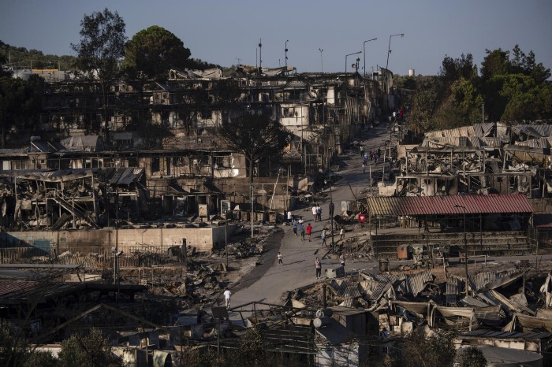

### AYS Daily Digest 09/09/21 — Home Office Announces Intention To Carry Out Pushbacks

[Are You Syrious?](?source=post_page-----6e6d28fa3091--------------------------------)

[Sep 10](ays-daily-digest-09-09-21-home-office-announces-intention-to-carry-out-pushbacks-6e6d28fa3091?source=post_page-----6e6d28fa3091--------------------------------) · 10 min read

Who Is Really “Instrumentalizing” Migration?//Dramatic Rescue Off Lampedusa Coast//Briançon 7 Win Appeal

Remnants of the Moria fire, one year ago\. Photo credit: [Petros Giannakouris/AP Photos](https://apnews.com/article/europe-middle-east-fires-greece-migration-9eaae26f819998065aa68b56125352db?utm_campaign=SocialFlow&utm_medium=AP_Europe&utm_source=Twitter&fbclid=IwAR0kEiSMoc--lLcNpx9oFA8Vm4m3ulTOorDEPCdk29xes6hgwCEkZ_aBYDA)
### FEATURE
### Priti Patel Announces Intention to Carry Out Pushbacks

Most European governments at least attempt to deny that they are carrying out pushbacks while secretly violating international law\. The UK has openly announced its intention to do so\.

Priti Patel’s Home Office announced that it was training Border Force officers in “ [turn\-around](https://www.theguardian.com/uk-news/2021/sep/09/priti-patel-to-send-boats-carrying-migrants-to-uk-back-across-channel?fbclid=IwAR2Wvt8mSMq3jpRaW6FQd2J8y2FtNAjTiJTJPGCWGCMZz0cSiyYiFJZjobs) ” tactics, which are just illegal pushbacks by another name\. The Ministry, supported by many Conservative MPs, would send people crossing in small boats back to France without allowing them to apply for asylum, although it claims that this still complies with international law and safety standards\. The government also said that “turn\-around” tactics would only be deployed in situations where it was deemed safe, but [did not reveal](https://www.bbc.com/news/uk-58495948?fbclid=IwAR3ldp1z-SBPdu7YSIiqJ_mxnYZk8_UpUGdNpKoiM2J-smcTfrY8ylm7Glg) which criteria would be used to determine if it was safe or not\.

The plan has already been met with harsh criticism by France, a state that is hardly a bastion of human rights at the borders\. Interior Minister Gerald Darmanin said that France [would not accept](https://www.infomigrants.net/en/post/34956/france-rejects-uk-plan-to-turn-back-migrant-boats?fbclid=IwAR0_XtYyoHpDP0J8dT61tZBoCx0x3YDqDo-3jkFLhpkEfN-ZtXUvkjPzEbk) any violation of international maritime law, particularly breaches that would endanger human lives, and said that the ongoing cooperation between the two governments might end if the Home Office went ahead with this plan\. \(This is not the first time that another country has stopped the Home Office’s excesses, as Ghana recently said that it is [not interested](https://mobile.ghanaweb.com/GhanaHomePage/NewsArchive/Ghana-not-interested-in-UK-s-Third-Country-Asylum-proposal-Government-1352761?fbclid=IwAR0BWwRki-g88zs6-k9FoXouwuC8u-K82rW19topTWwZdqhNq6rl0qQINUU) in participating in the Home Office’s plans to outsource asylum\) \.

People inside the UK, including representatives from Care4Calais and Channel Rescue, have already criticized the plan\. Even some Conservative MPs have said that there is no way to carry out pushbacks while keeping human lives in consideration\.

Since France has already announced that it does not intend to cooperate with the UK on this policy, it is possible that it will never be deployed\. However, there is no guarantee, and the question always stands that if the Home Office is willing to so blatantly violate international law in public, what is it doing in private?

In the meantime, follow and support organizations helping people on one of the most dangerous crossings in the world such as [Channel Rescue](https://twitter.com/ChannelRescue/status/1435898804612608001?fbclid=IwAR3GS-nkKqovLlWjQZff5lYcNCftXOflbBWa-L25YaQ0EJX9tCRc1HmByMY) \.
### AFGHANISTAN
### What’s Next For Afghan People in Afghanistan and Out?

Despite nominal attempts at portraying the image of a “new” Taliban, the organization is sticking to its violent, oppressive practices\. As an example, [over 200 female judges](https://www.independent.co.uk/asia/south-asia/afghanistan-female-judges-hiding-taliban-b1916563.html?fbclid=IwAR2FE1FqTLrqAehCUnEx153LbpGjApyWwc5X3Exuv1uWKF3cgiaY7CBIzFQ) are in hiding after the Taliban released their prisoners, some of them the men they had put behind bars themselves\. The situation is not safe for many women or anyone showing dissent\.

For the few that managed to escape the country, the situation is still uncertain\. Many were evacuated to third countries such as Albania while waiting for their resettlement in the US\. Now, Albanian authorities have said that people will have to wait [about a year](https://exit.al/en/2021/09/09/afghan-refugees-to-remain-in-albania-for-at-least-one-year/?fbclid=IwAR0AUd_ENvzC-bFFGg15YxtpwH4TWXHE8Af5cMYbqDmEXheniDCFDkVYtMY) for their US resettlement paperwork to process, which could very well take longer in the end\. Many neighboring countries, [such as Uzbekistan](https://www.hrw.org/news/2021/09/08/uzbekistan-should-do-more-help-afghans?fbclid=IwAR01u0gzqu-PgjnE4oDWDQwaDEh9JC7R8vuG25P5kaMYoWVbmp_EvXrgnfs) , have closed their borders to Afghan people and only allowing people with visas to other countries through, when they should be providing a place of safety\.

For an overview of the current situation for displaced Afghan people, go [here](https://www.hrw.org/news/2021/09/09/whats-next-afghans-fleeing-taliban?fbclid=IwAR0uf8blz6EHI2HKwNPrQ8n9H9hAZJrvPU4p95vOXrCelcFruGBmfUjz1Gc) \.
### SYRIA
### More Attacks in Idlib Displace Civilians
### SEA
### 125 People Rescued From Uninhabited Island Off Italian Coast

Over the course of 24 hours, Lampedusa saw several arrivals, bringing the total number of people in the hotspot [up to 700](https://www.agrigentonotizie.it/cronaca/lampedusa-raffica-sbarchi-soccorsi-tunisini-barcone-semiaffondato-9-settembre-2021.html) \. 125 of those people were rescued by the Italian Coast Guard after rough seas stranded them on [Isola dei Conigli](https://www.infomigrants.net/en/post/34958/italian-coast-guard-rescues-125-people-stranded-on-uninhabited-island?fbclid=IwAR0vfTpsTB2q_DlKqW5zwOi2hpik_a8f_shVREL4zCgWk9O7RybA_Zn-42s) , an uninhabited island near Lampedusa\. Several people were in shock, but luckily there were no severe injuries even though the rescue was very difficult\.

Salvamento Maritimo rescued [about 60 people](https://www.europapress.es/islas-canarias/noticia-salvamento-maritimo-rescata-ultimas-horas-patera-neumatica-canarias-60-migrantes-20210909100234.html?fbclid=IwAR1Gks91IcH7IJFF4mDgFJivAGLdi5ha1cwDmMnx1mkBsO0akoATWqWlYLY) off the coast of the Canary Islands last night\. [33 people](https://twitter.com/alarm_phone/status/1435865456171266052?s=20&fbclid=IwAR1c8Pe200Uw9SJAf6UknPf-ZEJ_z3cy3o8ceEjopXfLeychZAdzPe3cTik) had previously contacted AlarmPhone for help\.

[Another group of 60 people](https://twitter.com/alarm_phone/status/1436033655814725639?s=20&fbclid=IwAR1eNXSoXMsJum5LmUPuECpENSPErmw5iIFtku0ocgbFwluG7XqaRAJ0gBI) in distress were rescued off the coast of Chabba in Tunisia\.
### TURKEY
### Heartbreaking Violence — Togolese Man Stabbed to Death in Turkey

In another instance of racist, xenophobic violence, a Togolese man named Romeo [was stabbed i](https://twitter.com/TarlabasiDayani/status/1435894325116903427?s=20&fbclid=IwAR2nKAz_U0psI6sMQiksZC6kiNtIl3p8kdy5CGKjGCij2Z8Yv-Ddozg9-6Q) n Esenyurt\. He unfortunately passed away from the attack\. Our thoughts are with his family\.
### GREECE
### Who Is “Instrumentalizing” People on the Move?

The past year and change has had several incidents of the EU accusing other states of “instrumentalizing”, i\.e\. using people on the move for political gain — starting with Turkey and Morocco and now Belarus\. In this framing, EU countries are never the ones \(ab\)using people on the move for political gain, even though that’s been happening for years\.

For example, Greece and Romania’s foreign ministers [issued a joint statement](https://www.keeptalkinggreece.com/2021/09/09/we-will-not-allow-the-instrumentalization-of-migration-says-greek-fm/) saying that “we will not allow this \[the ‘instrumentalization’ of POM\] to reoccur\.” In the same statement, they used migration to push forward their political agenda — the accession of the Western Balkans and scaremongering about countries with “extremist” agendas\. Arguably, constant requests for security funding, military support, and tougher immigration policies is also a form of instrumentalization\.

At this very moment, the Greek government is using the deteriorating humanitarian and security situation in Afghanistan to argue that the [EU should pay more](https://www.politico.eu/article/afghan-takeover-fuels-greece-eu-border-patrol-spat/) for its border forces that conduct illegal pushbacks, which the bloc has so far refused, particularly since Greece is refusing the EU’s request to create a [national border monitoring mechanism](https://twitter.com/Balkanizator/status/1435963309920964614?s=20&fbclid=IwAR1V-DyjEsE-8bHp0BqAl5lKfMEdCK17eFs-6N8wUTgT_VEI1zb-uY3EQ1Q) \. It is also [designating third countries as safe](https://twitter.com/rspaegean/status/1435854555187712000?s=20&fbclid=IwAR1fjIpspR1IMDFzhhAS7jyNHzVnOk1v8e2n9-S5qhZpOeigpF2DtYQIyXg) based on political reasons, not conditions on the ground, and so in the process dismantling the right to asylum\.

The entire framing of these political disputes, which center on the poor aggrieved EU, instead of the innocent people on the move that get caught in the middle, is fundamentally broken for many reasons\. But this hypocrisy where only certain countries push a political agenda while others are somehow innocent should also be critiqued\.
### More Pushbacks, and Europe Doesn’t Care

On the morning of August 31, a boat carrying 23 people landed on Lesvos\. The people contacted [Aegean Boat Report](https://aegeanboatreport.com/2021/09/10/we-simply-dont-care/amp/?__twitter_impression=true&fbclid=IwAR01bb8eymhFJ_COkJPC5uo6CSFB54eZmgFRg5R56bhtMA7hpBaDFuDXqLY) and UNHCR for assistance as they hid in the woods to avoid pushbacks, but ABR lost contact with them throughout the day\. Over the next few days, evidence trickled in proving that all of the people had been pushed back to Turkey and that the Greek Coast Guard had stolen their belongings\. ABR amassed tons of forensic evidence, including pictures shared by the people themselves, location data on WhatsApp, and photos from the Turkish Coast Guard identifying the people as the same group that was on Lesvos and showing a Greek Coast Guard ship abandoning a life raft\.

This particular pushback has been documented meticulously, and so have others\. Yet Greece is allowed to continue with this practice\. As ABR writes:

> _The answer is quite simple, and it gives me the creeps, WE DON\`T CARE what happens to them, as long as we can continue our comfortable lives\. We are willing to close our eyes, look the other way, because we simply DON\`T CARE, if we had, we would have stopped this a long time ago\._ 

In a separate incident, [85 people](https://twitter.com/VassilisTsarnas/status/1435904454633607174?s=20&fbclid=IwAR1s6Du6G2jcdGVG8NcaEtIndYjbiv6GeNEIaNzU4oDhhYMEmtk8FMRlU8k) that arrived on Folegandros in the Cyclades archipelago are still missing, most likely pushed back to Turkey as the Turkish Coast Guard rescued a similar number of people nearby\.
### Moria, One Year Later

One year after the Moria fire and after people were trapped in increasingly restrictive camps, the IRC has seen a sharp uptick in people suffering from mental health problems\. A [whopping 96%](https://www.rescue.org/press-release/one-year-moria-fire-96-refugees-supported-irc-lesvos-greece-continue-experience?fbclid=IwAR3hiw9ryua2Of28juBnCdH71AGDm5lYeCu9N7V5p0yeXEk88tz419KQV80) of their clients are experiencing depression\. Even as Greece has opened borders to foreign tourists, residents in Mavromouni \(Moria 2\.0\) [cannot leave the camp](https://www.fenixaid.org/amp/press-release-trapped-in-the-fire-confined-behind-wire?fbclid=IwAR1jH_liTOnOB0ZzOmFLlIClHwtBxTuC7uCMRrRqyMrnYdmttFofLhLe-gY) more than once a week or for an appointment\. The camps are still rife with conditions that could [easily lead to another fire](https://twitter.com/refocusmedialab/status/1435740646137081862?s=20&fbclid=IwAR3NzpcnJ5lQuJoIFYhMmoOG-J6bEzmlN_EavKyL8RgiQXNRZw-C0lW_eGg) thanks to poor housing and infrastructure, even if [numerically they are less crowded](https://twitter.com/KarolinePopp100/status/1435893216256090113?s=20&fbclid=IwAR32JO10ZBxrz2x6e3MfwrTxAE29bUUSN4KM7IMP0hhjcxiOCQNQ3Pfdz08) \. Organizations such as Oxfam and the Greek Council for Refugees called the treatment “ [inhumane](https://www.infomigrants.net/en/post/34934/greece-treatment-of-afghan-refugees-immoral--oxfam-gcr?fbclid=IwAR3TJmJOvIpZmKN1lo-v0xrHGI_kiUPpu47uoG-dJyz_q91IplkqxIrkUgs) \.”

The closed, restrictive camps across Greece are causing deteriorations in the quality of life and mental health of people on the move, which you would not be able to tell from [this cheery tweet](https://twitter.com/migrationgovgr/status/1435988922090262529) from the Migration Ministry announcing the new camp in Samos\.

People that experience deteriorating mental health as a result of these conditions, such as a woman that attempted to commit suicide by self\-immolation in February, are punished instead of helped\. While the woman from this case is [now safe in Germany](https://twitter.com/maledictus/status/1435986570843148292?s=20&fbclid=IwAR1fjIpspR1IMDFzhhAS7jyNHzVnOk1v8e2n9-S5qhZpOeigpF2DtYQIyXg) , she should never have been pushed for her suicide attempt or trapped in a situation that drove her to such despair\.
### SPAIN
### Finally Some Progress on Children’s Rights

The bureaucratic mechanism that has trapped unaccompanied minors in Ceuta is finally moving its creaking wheels\. In the past few months, [about 155 children](https://www.eldiario.es/desalambre/comunidades-autonomas-ultiman-traslado-menores-migrantes-ceuta-155-destino_1_8263198.html?fbclid=IwAR0LwAWpsVDSNDABaK12cV95xsfhwFh7abK2ARgq2sfPsx5MrnZRIExO31g) have been transferred to other regions in Spain, where they will live in hopefully better conditions\. However, there are hundreds of others still experiencing awful living conditions as the bureaucratic machine turns ever\-so\-slowly\. [Over a year](https://twitter.com/platdeinfancia/status/1435858736585879557?s=20&fbclid=IwAR2FE1FqTLrqAehCUnEx153LbpGjApyWwc5X3Exuv1uWKF3cgiaY7CBIzFQ) since the government committed to a reform of Immigration Regulations aimed at helping unaccompanied children, it has yet to implement them fully\.
### FRANCE
### Briançon 7 Acquitted of Aiding Illegal Entry

The Briançon 7, a group of people criminalized for showing solidarity, were acquitted of “ [aiding illegal entry](https://twitter.com/BorderlineEurop/status/1435963175275352072) ” today at their [appeal trial](https://www.humanite.fr/delit-de-solidarite-victoire-en-appel-pour-les-7-de-briancon-719873) \! Sadly, one person did get a four month suspended sentence for resisting authorities\. Still, this case shows that there is still some legal defense against the criminalization of solidarity\.
### NETHERLANDS
### People on the Move Excluded From Labor Market

A recent study found that after getting their residence permits, [only 45%](https://nltimes.nl/2021/09/09/refugees-struggling-dutch-labor-market-planning-office?fbclid=IwAR1M33h_KMvsSQPaCT7sTUI7xx7_5h7OcQxujx4BE4ehr5uZwto1I1soI60) of recognized refugees have a full\-time job\. There are many barriers to entry into the Dutch labor market, including language barriers, discrimination by employers, and managing the aftereffects of trauma\. Many projects aiming to combat this problem were halted by the pandemic\.
### POLAND
### “State of Emergency” Regulations Target Activists and Journalists

Poland’s state of emergency nominally bans and limits movement along the Belarus border\. However, tourists and pilgrims to local churches can move freely\. The police are using the state of emergency as an excuse to [attack journalists](https://oko.press/stan-w-pielgrzymi-moga-wjechac-turysci-mogli-ale-aktywisci-i-dziennikarze-niech-zapomna-reportaz/?utm_medium=Social&utm_source=Facebook&fbclid=IwAR1EWH2YAMrAePahV8xxLLmQtG-yEHXX2Qsxmn6yq8v9JjL75ntrgOv9d4w#Echobox=1631170987) and take their phones and equipment\. Locals are also getting fed up with the state of emergency and constant checkpoints as well as the blockades in the area near where people on the move are trapped — one farmer was told to plow part of his field\. Many people are afraid to go about their normal lives and even do harmless activities such as picking mushrooms\.

The state of emergency is clearly not designed to protect the people of Poland but the reputation of the Polish state so that word of what is happening to people on the move at the border does not get out\. People on the move stuck in the area are [reporting violent treatment](https://oko.press/ci-zolnierze-nie-maja-serca-dramatyczne-doniesienia-o-przetrzymywanych-kongijczykach/?utm_medium=Social&utm_source=Twitter&fbclid=IwAR0TQ1qjH_zOR9CUyEinqhQW2LJAwoYD7nLbmroSLyP7EZguR-TyOvY3qTs#Echobox=1631125188) \.
### DENMARK
### Danish Authorities Let Biometric Data Fall Into Taliban Hands

In yet another heartbreaking warning about the dangers of biometric data, advocates fear that b [iometric data](https://danwatch.dk/perspektiv/danmark-har-delt-biometriske-data-om-afviste-asylansoegere-som-kan-ende-i-haenderne-paa-taliban/?fbclid=IwAR2gugWv9UHKxnjrqoMfrSi8atldSIoPkTMuf2QyqUOYav6tnGzDwIWd3vU) Danish authorities shared with Afghanistan when deporting people seeking asylum could fall into Taliban hands\. Privacy advocates had warned the National Police not to deport people, and if they were deporting them, not to share biometric data, as the Taliban and other groups have a history of targeting returnees\.

Despite the warnings over the past decade, Denmark and other European forces have taken the line that “the more data, the better\.” Right now, the EU is attempting to push through an [expansion of EURODAC](https://edri.org/our-work/intensified-surveillance-at-eu-borders-eurodac-reform-needs-a-radical-policy-shift/?fbclid=IwAR0Lk2hvxDd6-SSomF9Y8q8EuSAYnjewlnxJxGLM3lAVlKdlhYKWHoimiFM) , the database containing personal data of asylum seekers, which would expand data collection and target children as young as 6\.

This is not the only instance of Denmark neglecting its responsibility towards the people that turn to it for protection\. Instead of providing asylum to interpreters that risked their lives to help Danish forces in Afghanistan, the Danish government has instead been paying the UK to give them asylum and refusing interpreters entry visas into Denmark\. Out of 139 interpreters who applied for asylum in Denmark, [only 5 were granted visa](https://nyheder.tv2.dk/2021-09-08-danmark-har-betalt-storbritannien-for-at-tage-imod-tolke?fbclid=IwAR32JO10ZBxrz2x6e3MfwrTxAE29bUUSN4KM7IMP0hhjcxiOCQNQ3Pfdz08) s\.
### EU/FRONTEX
### EU “Preparing” For Arrival of More Afghans With Border Surveillance, Militarization

When you hear about a person in trouble coming to your home, you want to prepare by gathering what you need to welcome them\.

Not the European Union\. The European Union is responding to the possibility that more Afghans will come to the continent to seek asylum with more violence at the border\. Embattled Frontex head Fabrice Leggeri already said that his agency is “ [monitoring the situation](https://www.keeptalkinggreece.com/2021/09/09/frontex-preparing-for-afghans-already-abroad-to-try-to-reach-europe/) ” and claims that people will [pretend to be Afghans](https://www.euractiv.com/section/global-europe/news/eu-border-agency-preparing-for-surge-in-afghans-seeking-asylum-in-europe/?fbclid=IwAR1c8Pe200Uw9SJAf6UknPf-ZEJ_z3cy3o8ceEjopXfLeychZAdzPe3cTik) to get asylum \(there is no evidence that this is a tactic that people will attempt\) \. He said that experts at the border will be listening for dialects to determine who’s a real Afghan and who isn’t, but how can that be when in the past many people on the move have had to conduct asylum interviews without proper translation services?

Despite the cruelty from the top levels of politics on asylum policies, this does not always reflect local views\. The truth is that many Europeans support helping people on the move, as evidenced by demonstrations in support of Afghan people, petitions by cities to take in more people, and interviews with sailors and fishermen [that carry out sea rescues](https://www.theguardian.com/world/2021/sep/09/returning-migrant-vessels-violates-maritime-law-and-moral-obligation?CMP=Share_iOSApp_Other&fbclid=IwAR0kEiSMoc--lLcNpx9oFA8Vm4m3ulTOorDEPCdk29xes6hgwCEkZ_aBYDA) in defiance of their governments\.
### WORTH READING

The daily brief from Human Rights Watch summarizes developments from all over the world\. You can find it [here](https://www.hrw.org/the-day-in-human-rights/2021/09/09?fbclid=IwAR1VwpSM6NRjqOmFs6s0808EuR_ZJdjv1djPd4wfv0Qea34Sfop10hH3-C8) \.

ECRE released their press review for the day, which you can access [here](https://mailchi.mp/ecre/ecre-press-review-9092021?fbclid=IwAR3yKjmn-JtioFUlcjUGRiGoWoh7T9lfs7C7G8qAh9Msl0AehQd047Px2ec) \.

**Find daily updates and special reports on our [Medium page](https://medium.com/are-you-syrious) \.**

**If you wish to contribute, either by writing a report or a story, or by joining the info gathering team, please let us know\.**

**We strive to echo correct news from the ground through collaboration and fairness\. Every effort has been made to credit organisations and individuals with regard to the supply of information, video, and photo material \(in cases where the source wanted to be accredited\) \. Please notify us regarding corrections\.**

**If there’s anything you want to share or comment, contact us through Facebook, Twitter or write to: areyousyrious@gmail\.com**

_Converted [Medium Post](https://medium.com/are-you-syrious/ays-daily-digest-09-09-21-home-office-announces-intention-to-carry-out-pushbacks-ead06aad98a7) by [ZMediumToMarkdown](https://github.com/ZhgChgLi/ZMediumToMarkdown)._
