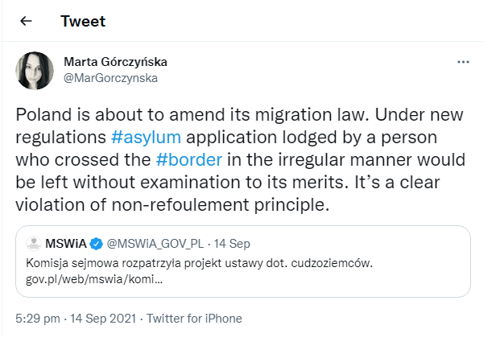

### AYS Daily Digest 15/09/2021 — EU Commission wants to tackle ‘hybrid attacks’\.

EU report against deportations to Afghanistan//Investigation into US drone strike//Missing Kurdish men deported to Syria//Education failings in Greece//Change in migration patterns to Spain

### **FEATURE**

**Hybrid Attacks**

Ursula von der Leyen, President of the EU Commission, has promised to “fight against hybrid attacks” by establishing new migration pacts\.

The reality of this statement is that people on the move are being used as weapons between countries\. This language was first used by Lithuania's [Gabrielius Landsbergis](https://www.dw.com/en/lithuanian-fm-belarus-using-refugees-as-hybrid-weapon-against-eu/a-58245160?fbclid=IwAR2JvcjWptXNnTepzZ2GyyoXuILlEB2nCHKgiyIg0dCdZCupv5NGT0M0jZ8) in July\. It was claimed that Belarus were encouraging people to travel from Iraq and elsewhere with the promise of an easy route into the European Union via Lithuania and Poland\. The reality has been that people with a hope for a brighter future are sent like weapons to demonstrate political messages related to EU sanctions\.

Ms von der Leyen used the term ‘hybrid attack’ in her State of the Union address, whilst also highlighting the European value of caring for the most vulnerable in society\.

[This twitter thread dissects the speech in more detail\.](https://twitter.com/lk2015r/status/1438193662677168136?s=03&fbclid=IwAR3rIkvR4XscmqaAS8zuB3Ri3pFLfU-tz5QtJtus68Wx3ZkgsdfqtnGK2R8) Strongly recommended reading\.

**EU — Afghanistan**

**_“the situation in Afghanistan is clearly not safe”_**

A draft European Commission action plan says that deportations to Afghanistan from European Union countries are suspended\.

Whilst this seems to be an obvious outcome given the clear dangers faced by those being returned to Afghanistan, it is not an entirely hopeful message\. The action plan still permits deportation to a ‘third safe country’ and also mentions that it is currently unclear “ [**_how the EU can engage with the new administration_**](https://www.statewatch.org/news/2021/september/european-commission-suspend-deportations-to-afghanistan-but-deport-afghans-to-other-third-countries/?fbclid=IwAR0a5irY2dKB7_oiVQlBaRitdml9TqaJhBMdbpAHdSv_JJoXQsJch9PHFqY) **_”\._**

**AFGHANISTAN**

**Innocent people were killed in a US drone strike**

The attack, which took place on 29th August 2021, was investigated by the [New York Times](https://twitter.com/democracynow/status/1438119697233362950?fbclid=IwAR2KPkC1qEH2GSuOCgx__gDmokaNnxgcRA1FrADK0KM7PpGiyf9Cln4xPWw) , with the findings showing that 10 civilians, including an aid worker, were killed\. It had previously been claimed that a member of ISIS had successfully been targeted, whilst the reality is that the lives of innocent people were needlessly taken\.

**Family Reunification**

The German government has come under criticism for allowing Afghan people to wait for potentially years for their visa application to be assessed\. The process for Family Reunification allows those with asylum status in Germany to apply for a spouse or child to join them\. [Over 4,000 people](https://www.infomigrants.net/en/post/35056/thousands-of-afghans-in-limbo-awaiting-family-reunification-visas?fbclid=IwAR0hzJ2g7IoNKb-KBQRvi3uACz5JGqHtSYFff3mLeP-MUC6xJcjAEBFXrL0) are on the waiting list to submit an application\. With the current projected timeline, people would have to wait three and a half years\. The Left Party has called on the German government to take action\.

Although there is some more positive news from Germany too, with [2,600 people](https://www.infomigrants.net/en/post/35058/germany-to-take-in-2600-afghans-and-their-immediate-families?fbclid=IwAR1wkPVdTBNYUCfQ-gEJflAIX046_42FWw8TgyQbWgT6SaEKU_JKNxhRzU0) from Afghanistan to be offered residency rights in Germany\. The list of those to be included are human rights activists, artists, scientists and journalists\.

**Turkey**

Nine Iranian Kurdish asylum seekers have been deported from Turkey to northern Syria\. The Kurdish Human Rights Network had been investigating the disappearance of the nine men who have not contacted their families since 24th August\. The investigation has found that there is a request for [$2,000 per person](https://kurdistanhumanrights.org/en/turkey-deports-nine-iranian-kurdish-asylum-seekers-to-northern-syria/?fbclid=IwAR3YyBmtOhvMi3TdxLqPwXtbI7TXQxOyeJDhYOwJ0BoLlRAeN9LS_2xeaeE) from the Syrian forces in order to secure their release\.

**Sea**

](assets/49df33d6af4d/0*Q57j7y9oCkbWg0z6)

Graphic [Seawatch International](https://twitter.com/seawatch_intl/status/1438160246342668289?fbclid=IwAR0S-APZh_11WoYy6j1UkHtEPsGML225j8e63em0pGi7l5lPR4Hi6KUalfE)

More than one thousand people have died in the central Mediterranean so far this year\.

This shocking number is double that of the same period last year\. NGO groups point out that, while deaths have doubled, [funding for EU border force Frontex has increased](https://twitter.com/seawatch_intl/status/1438160246342668289?fbclid=IwAR0S-APZh_11WoYy6j1UkHtEPsGML225j8e63em0pGi7l5lPR4Hi6KUalfE) \. This has led to a call to Defund Frontex and use the funds to help people\.

**Greece**

On Saturday 18th September, international authorities and media representatives are invited to visit the opening of the new Multi\-Purpose Reception Identification Centre on the island of Samos\. This new camp was funded from a €250 million payment by the EU\. The camp has been described by NGO groups as causing “ [isolation and marginalization](https://twitter.com/samosvolunteers/status/1438044513524662272?fbclid=IwAR0mfuejosUxksQLqtM8wHCqFYtXsiZrALUcngKoLMbSkQrSRRRb41CVSRU) ” to the people forced to stay there\.

Alongside the new camp, the EU has required Greece to set up an [independent mechanism](https://twitter.com/VassilisTsarnas/status/1438126956130750467?fbclid=IwAR32cGyK_XLmVrNs5YLzSl9AU7_Ud-lTMF0djOyWvtYBUp_XnjP9HmZABa4) for monitoring refugees’ rights at the border\.

**Education failures**

_(1).pdf) Cover Image](assets/49df33d6af4d/1*ZJmlZjhTlGKcUz8xyCkgeA.png)

[Save the Children and Greek Refugee Council Report](https://www.gcr.gr/media/k2/attachments/Education_in_Greece_Report_FInal_Edits_(002)_(1).pdf) Cover Image

A damning report by Save the Children and the Greek Council for Refugees has revealed the catastrophic failure in providing education for children living in camps in the country\.

The two organisations called for urgent action by the Greek government and the European Union to address the shockingly low numbers of refugee children attending school\.

Whilst the pandemic can be blamed for so much disruption, only a [third of children](https://www.savethechildren.net/news/greece-future-over-20000-refugee-children-air-because-government-neglect) on the move were enrolled and attending school before the lockdowns took effect\. This despite multiple millions of Euros being paid by the EU for the sole purpose of education\.

[The full report is available to read here\.](https://www.gcr.gr/media/k2/attachments/Education_in_Greece_Report_FInal_Edits_(002)_(1).pdf)

**Serbia**

A violent pushback was reported by a group of people who entered Hungary from Serbia\. The group were from Syria and included a woman\. They were all kept overnight at a police station without food or water and were victims of physical violence\. This is one story among so many which are collected by members of the [Border Violence Monitoring Network](http://borderviolence.eu)

](assets/49df33d6af4d/0*p8xf1FDW0v-5riz_)

Photo [Asylum Protection Centre Serbia](https://twitter.com/APC_CZA/status/1438026566806691843?fbclid=IwAR1t0c-UtyLb2TCUSljVSsXs6ZKQotmCKrYxy2fu1WVGcak9G0b-499zpDM)

**Poland**

People on the move continue to be trapped at the border between Belarus and Poland\. One person r [eported shots being fired into the ground](https://twitter.com/f_grillmeier/status/1438037465114320898?fbclid=IwAR2nrAeL0n4obTK8raSY1qsvzMPu3s68IIrRQde7YfUO6yakfXnMqtAk5Lw) by the Belarusian forces\.

EU Parliament member Janina Ochojska [is quoted saying](https://twitter.com/f_grillmeier/status/1438037469870571521) :

> “We don’t know if people are dying, but we know that this cannot go well for long in the sinking temperatures and without medical care\. It is life\-threatening\.” 

In a shocking move, the Polish government intends to alter its migration law to rule that those who enter the country [‘in an irregular manner’](https://twitter.com/MarGorczynska/status/1437815803928326150?fbclid=IwAR3OFODPiRQjf_T0WAy9bd64RuKvxVa03_ZS6TME3wiudXDcpEUhH7XwyA4) would not have their asylum claim heard in full\. This is a clear breach of human rights law\.

**Spain**

Higher numbers of boats have been landing on the Spanish Balearic Islands compared with the Canary Islands, demonstrating a possible shift in migration patterns\. [Infomigrants](https://www.infomigrants.net/en/post/35057/spains-balearic-islands-see-uptick-in-migrant-boat-landings?fbclid=IwAR3meQ_wuvZXUBx32-Tct138bsrroM7uRDR9CUpAqRlx0_K9fk41pIZz81U) has carried out an analysis which compares arrivals on both island groups\.

Authorities reported that 500 people arrived during the last weekend\. The countries these people are from differ from those of people travelling to the Canaries\. These are north African and sub\-Saharan counties, respectively\. Another difference noted was the size of the boats — typical arrivals on the Canary Islands have 40–50 people on board, sometimes including women and children\. In comparison, the mostly male passengers arriving on islands like Ibiza and Palma were in smaller vessels carrying 20 or so people\.

**France**

Video footage of yet more evictions in Calais has been shared by [Human Rights Observers](https://twitter.com/HumanRightsObs/status/1438171701695627266?fbclid=IwAR2gurU0OcxB629v98qiG8gS2X7qdquHvEa3Cz8WsAYNU751G2Kk4FQxbUc) \. The video shows people walking away from one of six sites where they were attempting to stay in tents, but were cleared out by the authorities\.

**Find daily updates and special reports on our [Medium page](https://medium.com/are-you-syrious) \.**

**If you wish to contribute, either by writing a report or a story, or by joining the info gathering team, please let us know\.**

**We strive to echo correct news from the ground through collaboration and fairness\. Every effort has been made to credit organisations and individuals with regard to the supply of information, video, and photo material \(in cases where the source wanted to be accredited\) \. Please notify us regarding corrections\.**

**If there’s anything you want to share or comment, contact us through Facebook, Twitter or write to: areyousyrious@gmail\.com**

_Converted [Medium Post](https://areyousyrious.medium.com/ays-daily-digest-15-09-2021-eu-commission-wants-to-tackle-hybrid-attacks-49df33d6af4d) by [ZMediumToMarkdown](https://github.com/ZhgChgLi/ZMediumToMarkdown)._
