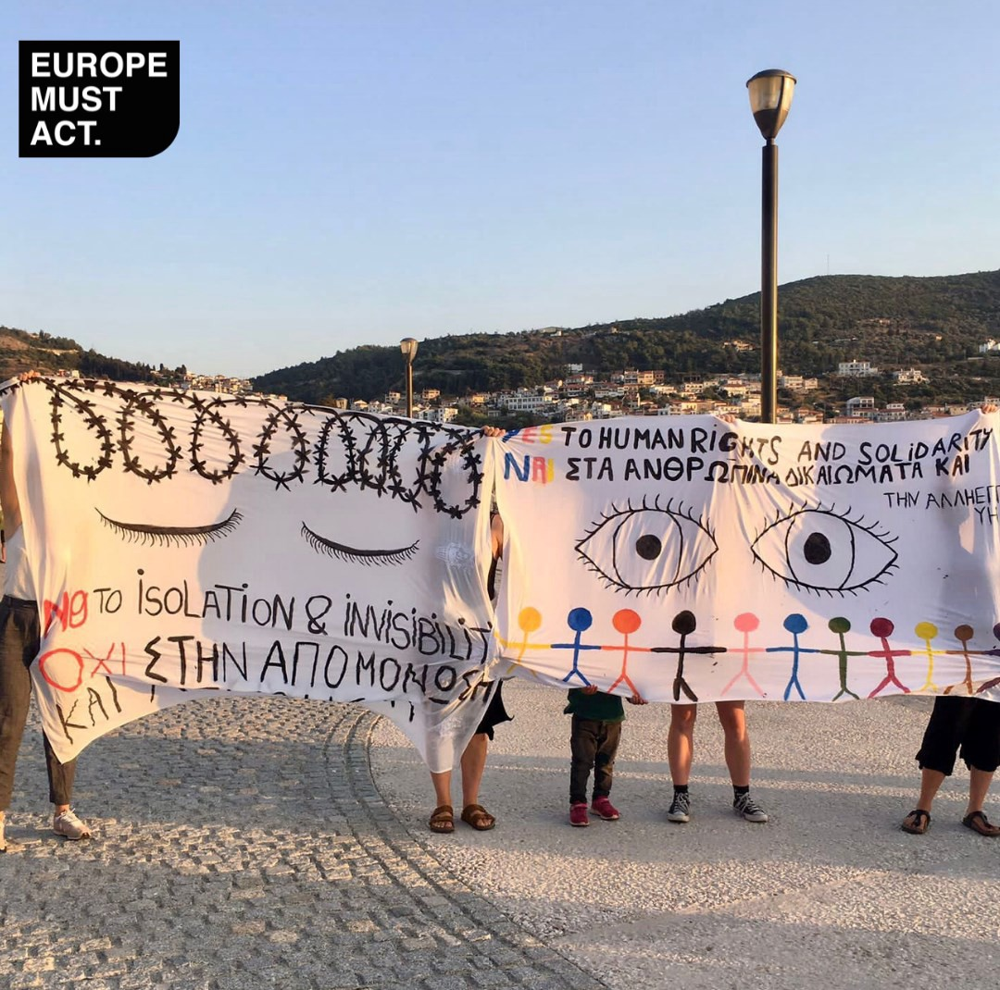

### AYS Daily Digest 21/09/21 — We Wish Foucault Were Here: The New Surveillance State in Greek Camps
#### Turkey Displaces Syrians in Ankara // Horror on Polish\-Belarusian Border in Wake of Deaths // Info for Afghans in Germany // Napier Barracks Reach Grim Milestone
### FEATURE — The Violent, Wild ‘Centaur’: Surveillance, Knowledge and Power in Greece’s New Refugee Camps

 \)](assets/3df19bd2cbb3/1*vK4Z6uO8CQzUEVjs40bmGg.jpeg)

A panopticon prison \(Photo: [CC\-BY\-SA\-4\.0](https://commons.wikimedia.org/wiki/File:Panopticon_prison.jpg) \)

In yesterday’s digest we reported on the recent opening of the highly\-criticized new camp on Samos\. Located in the Zervou area of the island, far from Samos town and any resources, the prison\-like camp is designed to host up to 3,000 people\. The facility is surrounded by barbed wire, and the entry and exit points are controlled by metal detectors; indeed, camp residents can enter only by scanning their electronic ID card and their fingerprints\. The camp’s opening this week was met with protests from camp residents, solidarity workers and local residents\. Still, of course, [transfers to the new facility continue](https://www.facebook.com/24samos/posts/4232942090167666) \.

 \)](assets/3df19bd2cbb3/1*Rq-ay9T9Go2hkd5smEaYdw.jpeg)

Protests against the new camp on Samos \(Photo credit: [Europe Must Act](https://www.facebook.com/europemustact/posts/376887340590633) \)

The Samos camp, however, is just the first of many new, high\-tech facilities the Greek government is building on its so\-called ‘hotspot islands’\. What these facilities, with their metal detectors, electronic ID entrances, and fingerprint technology represent is the dawning of a new — and we would say, insidious — era of state control over people’s bodies, a new relationship between power and knowledge\.

In the Samos camp, and in the other camps to follow, Greek Ministry of Migration and Asylum is deploying a partly\-automated surveillance system called ‘Centaur’, named after the mythical Greek creature, part\-horse, part\-man, that roams the mountains of Thessaly and Arcadia\.

 \)](assets/3df19bd2cbb3/1*u1aT7CAutsqqrkXXhxJ5xQ.jpeg)

A centaur with Cupid \(Photo: [CC BY 4\.0](https://www.lookandlearn.com/history-images/YW035938VEL/A-centaur-with-Cupid) \)

In Greek mythology, centaurs are known for their violent and untamed spirit\. They are also liminal creatures, straddling the uncertain boundary between man and beast\.

But here, in the case of Greece’s new migration surveillance technology, the Centaur is only beast\. In a [presentation](https://www.documentcloud.org/documents/20689221-493570553-ethnike-strategike-metana-steuses-sa-mos-le-sbos-khi-os-le-ros-kos-1) published by the Greek government entitled “National Migration Strategy 2020–2021,” the Centaur system is described as an “integrated digital system of electronic and physical security management placed inside and around the facilities using cameras and a motion analysis algorithm \(AI Behavioral Analytics\) \.”

What does this mean in practice? A CCTV system and video monitors; drone flights over the camp; perimeter alarms with cameras; controlled gates with metal detectors and x\-ray machines; an automated system for public announcements, broadcast over loudspeakers; and a centralized control center located at the ministry’s headquarters\.

All of this is funded by the European Union, with some of the money coming from the Internal Security Fund, which funds the management of the EU’s external borders\. Further funding comes from the Recovery Fund, a pandemic aid fund\. A spokesperson for the Greek migration ministry told [AlgorithmWatch](https://algorithmwatch.org/en/greek-camps-surveillance/?fbclid=IwAR3-fRopxgCYqyy740OYABlxEsTo5f6azHoJb0LrGe7B7JbBN5EG7M8CXs4) this April that the total cost of the project across all the camps will exceed 33 million euros\.

Does that sound at all sinister to you? Well, it should\. What we have here is a classic example of Foucault’s famous Panopticon, made even more sinister by the digital surveillance state\.

As a work of architecture, a panopticon is essentially a prison in which the prisoners are constantly surveilled by a centralized power or system without their knowledge\. The prisoners, of course, are aware that they _could_ be watched, but they never know exactly _when_ they are being watched, culminating in an immobilizing feeling that an authority is _constantly watching them_ \.

In the Samos camp, however, there is no visible watchtower like in the image above, no clear symbol of the all\-seeing eye\. Instead, the eye is everywhere, in the dozens of tiny cameras strung up across the camp, in the metal detectors through which camp residents must pass, in the fingerprint machines where they must lay their fingers to gain access to their new home\.

What does this all have to do with knowledge and power? We know that knowledge is a form of power, of course\. But Foucault took that one step further, arguing that knowledge can be gained from power — producing power itself\. Observation produces knowledge, thus producing power\. Here is Foucault:

> Knowledge linked to power, not only assumes the authority of ‘the truth’ but has the power to make itself true\. All knowledge, once applied in the real world, has effects, and in that sense at least, ‘becomes true\.’ Knowledge, once used to regulate the conduct of others, entails constraint, regulation and the disciplining of practice\. Thus, ‘there is no power relation without the correlative constitution of a field of knowledge, nor any knowledge that does not presuppose and constitute at the same time, power relations\. 

We discussed already how those inside the Panopticon — or inside the new Samos camp — are aware that they are being constantly surveilled — although the high\-tech nature of the Centaur system prevents them from physically seeing the surveillance structure\.

What happens when people feel they are being watched? Simply, they conform\. They behave — they are terrorized into doing so\. Prisons, in their very architectural structure, breed conformity; after all, without conformity, you get individuality, and free thinking breeds dissent, and prison riots\. We see this same conformity\-breeding mechanism at work in the Samos camp, and soon, we will see it in all the other camps on the hotspot islands\.

■■■■■■■■■■■■■■ 
> **[Lena K.](https://twitter.com/lk2015r) @ Twitter Says:** 

> > The new 'Incident Management Center' of  
@[migrationgovgr](https://twitter.com/migrationgovgr) will be connected to the surveillance systems of the Samos MPRIC &amp; all other similar facilities in Greece, including 'open' camps.
Massive expansion and normalisation of surveillance with EU blessings &amp; money. 

> **Tweeted at [2021-09-21 10:06:23](https://twitter.com/lk2015r/status/1440256083793117192).** 

■■■■■■■■■■■■■■ 

The more the ‘observer’ — here, the Greek migration ministry — observes, the more powerful it becomes\. Foucault wrote that knowledge and power build upon each other: “by being combined and generalized, they attained a level at which the formation of knowledge and the increase in power regularly reinforce one another in a circular process\.”

The danger here is not that the camp residents are repressed, or oppressed, by the surveillance apparatus\. It is that they are “carefully fabricated in it,” as Foucault said, their very humanity defined by the observer, the all\-seeing eye\. The Centaur system knows everything about the residents, and can exercise its power at will to define them and control them\.

It is clear that such a system breeds oppression\. But what can be done about it? What happens when all knowledge is controlled by a centralized system? What are the options for resistance?

These days there are scores of articles about how to protect ourselves online, how to secure our data, with some people choosing to go offline altogether, buy a van, and live in the woods\. But those in the Samos camp, and people\-on\-the\-move throughout Europe, really, aren’t afforded such options\. Greek refugee camps are prisons: people are not able to move freely throughout the country while their asylum claims are still pending, and thus find themselves trapped in these Panopticons for months and even years\.

What does resistance to Greece’s new Panopticon system look like? That, we don’t know yet, but as the migration ministry moves to construct more camps like Samos’ — and with EU funds\! — we need to start asking ourselves these questions\.
### TURKEY
#### Turkey cracks down further on Syrian refugees

The Turkish Interior Ministry last week ordered the demolition of buildings in Ankara’s Altındağ district, most of them inhabited by Syrian refugees, [media reported](https://stockholmcf.org/turkish-interior-ministry-orders-demolition-of-buildings-lived-in-by-syrian-refugees-in-ankara/?fbclid=IwAR07BCiTJFD_R6aWK8DIQPbKadhK2RzaB1m3PypPzVzob85VLZN6rH8pH7g) \.

The Ministry justified the decision by declaring that many of the buildings were built without proper permits, and gave residents one week to pack up and move out\. Two buildings have already been demolished, according to media\.

The Altındağ district was [the site of major protests](https://www.bbc.com/news/world-europe-58185612) last month, which saw locals attacking the houses and businesses of Syrian refugees\. [Anti\-refugee sentiment is on the rise in Turkey](https://stockholmcf.org/turkeys-main-opposition-leader-vows-to-send-syrian-refugees-back-home/) , which hosts [the largest number of refugees in the world](https://www.worldbank.org/en/news/feature/2021/06/22/10-years-on-turkey-continues-its-support-for-an-ever-growing-number-of-syrian-refugees#:~:text=Today%2C%20Turkey%20is%20host%20to,whom%203.6%20million%20are%20Syrians.) , 4 million, with approximately 3\.6 million Syrians\.
### SEA
#### Update on the three SAR boats in the Med

Civil Fleet wrote a comprehensive post on the recent rescues by the three SAR boats currently operating in the Central Mediterranean, the Ocean Viking, Nadir, and Geo Barents\. Since Saturday, the NGOs rescued some 189 people, including at least 20 unaccompanied children and a newborn baby\. You can read the entire post [here](https://thecivilfleet.wordpress.com/2021/09/20/newborn-baby-among-the-189-refugees-civilian-rescuers-have-saved-in-the-mediterranean-since-saturday/?fbclid=IwAR0SHEvf2jCZKsbwU4sDlkCYeD-NOxUgm3bV0iCzsvH3h4x9kw1denjmRdI) \.
#### Humanitarian Pilots Initiative on Swiss TV

The Swiss aerial monitoring NGO Humanitarian Pilots Initiative was the subject of a 14\-minute documentary on Radio Télévision Suisse, the Swiss public broadcaster\. The short film follows members of the group as they fly over the Central Mediterranean in search of boats in distress\. The doc, in French, can be accessed [here](https://www.rts.ch/info/suisse/12491884-des-avions-suisses-pour-sauver-les-migrants-en-mediterranee.html?fbclid=IwAR05ofK_Aiht5Bi4oSLrWua-EOyYaOUJGZsHRM1z_AJ1EdLE5zJTTX8JNP8) \.
#### Boats in distress in Ionian Sea, off Rhodes

■■■■■■■■■■■■■■ 
> **[Alarm Phone](https://twitter.com/alarm_phone) @ Twitter Says:** 

> > 🆘️! ~55 lives at risk in the Ionian sea!
We were alerted by ~55 people in distress heading to #Italy. The engine broke and the boat is drifting. Authorities are informed and need to act! https://t.co/MK4xVkTRvl 

> **Tweeted at [2021-09-21 07:28:01](https://twitter.com/alarm_phone/status/1440216229172576262).** 

■■■■■■■■■■■■■■ 

■■■■■■■■■■■■■■ 
> **[Alarm Phone](https://twitter.com/alarm_phone) @ Twitter Says:** 

> > 🆘near #Rhodes in the #Aegean: 20 people at risk of drowning. 

We have just been alerted to a boat in severe distress in #Greek waters, north of Rhodes island. 
@[HCoastGuard](https://twitter.com/HCoastGuard) was immediately alerted - rescue is needed now, don't let them drown! https://t.co/gYQe6se0LD 

> **Tweeted at [2021-09-21 15:42:57](https://twitter.com/alarm_phone/status/1440340780745310209).** 

■■■■■■■■■■■■■■ 

### SPAIN
#### Eight bodies wash up on Andalusian coast, one of them a child’s

The Spanish Civil Guard [says](https://www.efe.com/efe/andalucia/sociedad/hallan-ocho-cadaveres-en-la-costa-de-almeria-desde-el-pasado-domingo/50001109-4634320?fbclid=IwAR1Zi70Dx-RV-4GPDpUVzq69iJMR7vgUUgLGuSf6e27B4Dz_qzeiup1A5qY) that eight bodies, including a child’s, have washed up in different parts of the Almería coast since Sunday\.
### POLAND
#### Horror at Belarusian border continues

Journalist Franziska Grillmeier, as well as Polish reporters, continue to report on the situation on the Polish\-Belarusian border:

■■■■■■■■■■■■■■ 
> **[Franziska Grillmeier](https://twitter.com/f_grillmeier) @ Twitter Says:** 

> > Noch immer stecken 32 geflüchtete Menschen aus #Afghanistan auf dem Grenzstreifen zwischen #Polen und #Belarus fest. 

Seit nun knapp 7 Wochen (!), bei Temperaturen knapp über 0 Grad. Die meisten Menschen sind mittlerweile schwer krank, sagen sie. 

> **Tweeted at [2021-09-21 20:00:11](https://twitter.com/f_grillmeier/status/1440405517508091905).** 

■■■■■■■■■■■■■■ 

■■■■■■■■■■■■■■ 
> **[Franziska Grillmeier](https://twitter.com/f_grillmeier) @ Twitter Says:** 

> > Meanwhile in the north of #Poland a group of asylum seekers was found hiding in the bushes, after days without medical support, food or clean water, while temperatures are dropping. 

One man of the group is being transported to the hospital, due to freezing temperatures 👇🏽 

> **Tweeted at [2021-09-21 12:32:23](https://twitter.com/f_grillmeier/status/1440292825011130371).** 

■■■■■■■■■■■■■■ 

■■■■■■■■■■■■■■ 
> **[Franziska Grillmeier](https://twitter.com/f_grillmeier) @ Twitter Says:** 

> > Die 11 Geflüchteten hatten seit Tagen nichts mehr gegessen. Humanitäre Organisationen berichteten, die Menschen waren komplett durchnässt und geschwächt. Drei von ihnen wurden ins Krankenhaus gebracht, da sie kaum mehr ansprechbar waren. /1 

> **Tweeted at [2021-09-21 16:38:00](https://twitter.com/f_grillmeier/status/1440354636360130566).** 

■■■■■■■■■■■■■■ 

■■■■■■■■■■■■■■ 
> **[Jakub Medek](https://twitter.com/JakubMedek) @ Twitter Says:** 

> > Osiem osób zapakowano na te ciężarówkę. Funkcjonariusze @[Straz_Graniczna](https://twitter.com/Straz_Graniczna) twierdza, że zawiezie ich ona do ogrzewanego izolatorium na przejściu w Kuźnicy. Na pytanie, czy potem straż będzie ich próbowała wypędzić do Białorusi, strażnicy odpowiedzieć nie chcą
@[TOKFM_NEWS](https://twitter.com/TOKFM_NEWS) https://t.co/LwPb8DufGR 

> **Tweeted at [2021-09-21 12:43:20](https://twitter.com/jakubmedek/status/1440295582656987145).** 

■■■■■■■■■■■■■■ 

Meanwhile, the UNHCR and IOM are “deeply saddened” — they are also probably “deeply concerned” — by the news of the four deaths on the border\. The organizations “express their condolences to the families of the deceased and are calling for an immediate investigation into this tragedy\.”

The UNHCR and IOM also communicated their “growing concern” over reports of pushbacks, saying that “While States have the sovereign right to manage their borders, this is not incompatible with the respect for human rights including the right to seek asylum\. Pushbacks endanger lives and are illegal under international law\.”

At the risk of sounding snarky, someone should really collect the data on how many times the UN and IOM say that are “deeply concerned” or “deeply saddened” every week — and then do absolutely nothing\.
### FRANCE
#### Utopia56 thread on Channel crossings

■■■■■■■■■■■■■■ 
> **[Utopia 56](https://twitter.com/Utopia_56) @ Twitter Says:** 

> > Jour après jour, les interventions de nos bénévoles à Calais et Grande-Synthe s’intensifient auprès des personnes exilées, naufragées et abandonnées suite à une tentative de traversée de la Manche. Hier nous sommes intervenus à deux reprises ⤵️ 

> **Tweeted at [2021-09-21 14:50:51](https://twitter.com/utopia_56/status/1440327672534503429).** 

■■■■■■■■■■■■■■ 

### GERMANY
#### ProAsyl on current situation for Afghans in Germany

The NGO ProAsyl has released [a helpful update](https://www.proasyl.de/hintergrund/hinweise-fuer-afghanische-fluechtlinge-und-ihre-beraterinnen/?fbclid=IwAR0r2lh-5RctqEJ6XoKo6iEieScjprW5sirKeBp84vDC5GQujbV3QZPmims) on the current situation for Afghans living in Germany in the wake of confusing and contradictory information about what the withdrawal from Afghanistan means for asylum\-seekers in Germany\.

Here are the major points:
- Currently there are **no deportations to Afghanistan** \.
- The Federal Office for Migration and Refugees \(BAMF\) is currently making **only limited decisions about asylum applications from Afghans** \.
- Plus, information for: those who **already have a residency permit** ; those who **have the prospect of a residency permit** ; and those interested in **pursuing family reunification claims** \.

### UNITED KINGDOM
#### The grim one\-year anniversary of Napier barracks

The first asylum\-seekers were moved into Napier barracks on September 21, 2020 — one year ago — but the squalid facilities intended to be only temporary are still being used today\.

Although human rights advocates and those being held at Napier have condemned the barracks as unfit for human habitation, the UK government announced last month that Napier could be used until 2025, [media reported](https://www.standard.co.uk/news/uk/home-office-government-kent-folkestone-english-channel-b956401.html?fbclid=IwAR1kQMFRqJGj7NtuhHGmh_ZGgFA8E-12eugTco0Ddqdq6iz8cRyhFMxrXOw) \. In fact, the Home Office still insists that to condemn the facilities at Folkestone amounts to “an insult\.”

“The barracks are now a byword for the cruel injustice of the Government’s attempts to shirk responsibility for providing a fair, humane and properly\-run asylum system,” Steve Valdez\-Symonds, Amnesty International UK’s Refugee and Migrant Rights director, told the media\.
#### Young man on Samos to be reunited with brother in UK

An immigration judge in the UK has ruled that a young asylum\-seeker on Samos, Samir \(not his real name\), can now join his brother in the UK, [media reported](https://www.independent.co.uk/news/uk/home-news/asylum-seeker-samos-greece-uk-home-office-b1923361.html?fbclid=IwAR2-60Gdjxp9tWmVMc6nlu3c11keUmXEpODVAu1WccyZWyT-Ma70j5q2lfI) \. The Home Office had rejection his initial family reunification application in February of this year\.
### EU / FRONTEX
#### Ylva in New York to discuss Afghanistan

■■■■■■■■■■■■■■ 
> **[Ylva Johansson](https://twitter.com/YlvaJohansson) @ Twitter Says:** 

> > This coming week I will be at #UNGA in New York to discuss efforts in relation to #Afghanistan, including the 7 October Resettlement Forum that I will jointly host with HRVP @[JosepBorrellF](https://twitter.com/JosepBorrellF) 

My latest blog #TimeToDeliverMigrationEU blog outlines the issues
[ec.europa.eu/commission/com…](https://ec.europa.eu/commission/commissioners/2019-2024/johansson/blog/timetodelivermigrationeu-no15-high-level-resettlement-forum-afghanistan-4-october-2021-protecting_en) https://t.co/GPFkty9lSb 

> **Tweeted at [2021-09-19 16:55:20](https://twitter.com/ylvajohansson/status/1439634221245550592).** 

■■■■■■■■■■■■■■ 

European Commissioner for Home Affairs Ylva Johansson announced in a [blog post](https://ec.europa.eu/commission/commissioners/2019-2024/johansson/blog/timetodelivermigrationeu-no15-high-level-resettlement-forum-afghanistan-4-october-2021-protecting_en?fbclid=IwAR00ZRbiPUy2Uj4QP2d4YrqdmyIB6hEF9H2xLdGpfGTMa0urMDMSrg2qhYY) , accompanied by the hashtag \#TimeToDeliverMigrationEU, that she and EU High Representative Josep Borrell will convene a “High\-level Resettlement Forum” on October 7 dedicated to the situation in Afghanistan\.

Here is Ylva in her own words:

> The focus of the October 7 Forum will be on helping Afghans most at risk\. At risk not just because they directly supported Member State personnel but rather, because, over a generation, they tried to build a more open society\. As I told NPR radio last week, we have people that have been fighting for our values in Afghanistan\. And it’s our moral duty now to do everything we can to protect them\. Those that did so, particularly women, be it through teaching, studying, representing, providing choice and breaking down barriers, now face fear and persecution\. They chose to live democratic values\. They chose not just to promote freedoms, but to embody them in their life choices, their professional paths\. **They became our partners in democracy\.** 

> Now they need our help\. Since the collapse of the Afghan Government, a number of EU Member States and civil society organisations have been active in proposing initiatives for the EU to offer protection, a ‘safe haven’ for Afghanis most in need\. 

Pardon the editorializing, but the idea that Ylva suddenly cares about Afghan refugees is quite ridiculous\. Afghans, of course, have been fleeing Afghanistan for years, only to meet with draconian policies supported by Ylva the moment they arrive in the EU, in Greece\.

> **‘Protection pathways’** must be constructed in a way that allows for rapid deployment, without compromising on security measures\. Our \#MigrationEU proposals provide those long\-term security measures, with thorough, and most essentially, IT compatible, screening processes\. A uniform system for our external border is the objective\. 

Ylva is still talking about ‘security’ and ‘screening processes’ at the ‘external borders\.’ Nothing seems to have really changed here\. The external borders of the EU are increasingly militarized and designed to keep people — including Afghans — _out_ , not let them _in_ \. But of course, this is a highly politicized issue at the moment, at the forefront of Europe’s mind — panicked as it is by the thought of “mass migration” à la 2015 to its borders\.

So Ylva says that Afghans are good, democracy\-loving people who “need our help” — us, of course, being the white saviors\. But will anything really change for the better at the EU’s borders? The design of the new camp on Samos — a _closed_ camp under 24/7 surveillance and surrounded by barbed fire — proves no, it won’t\.
#### Frontex celebrates Malta, Malta loves Frontex drones

■■■■■■■■■■■■■■ 
> **[Matthias Monroy (@Mastodon)](https://twitter.com/matthimon) @ Twitter Says:** 

> > From the International Airport in #Malta, the current #Frontex drone (operated by Airbus Germany) initiated since May this year several thousands #pullbacks to #Libya. 

> **Tweeted at [2021-09-21 12:26:28](https://twitter.com/matthimon/status/1440291337056571394).** 

■■■■■■■■■■■■■■ 

### WORTH READING / WATCHING / LISTENING

What is ‘resignation syndrome’, and why are so many young Swedish asylum\-seekers suffering from it?

\(In Spanish\) From No Name Kitchen and Solidarity Wheels, an update on the situation at some points on EU borders, with testimonies from volunteers on the ground in Bihać \(BiH\), Šid \(Serbia\), and Spain\.

ROAR and the Resistance Studies Initiative are collaborating on an ongoing series focused on usable social research for a broad range of liberation struggles\.

An informative new podcast, ‘Refugee Law & Refugee Lives’, which explores the increasingly temporary terms of asylum in Europe and globally\.

In August the Border Violence Monitoring Network \(BVMN\) recorded 30 pushbacks, impacting 324 people across migratory routes in the Balkans\. This report brings together these testimonies with field observations from across the region, highlighting the various types of border violence being enacted by the EU and other states\.

The EU is heavily upgrading its surveillance technology and thus promoting the so\-called security industry\.

**Find daily updates and special reports on our [Medium page](https://medium.com/are-you-syrious) \.**

**If you wish to contribute, either by writing a report or a story, or by joining the info gathering team, please let us know\.**

**We strive to echo correct news from the ground through collaboration and fairness\. Every effort has been made to credit organisations and individuals with regard to the supply of information, video, and photo material \(in cases where the source wanted to be accredited\) \. Please notify us regarding corrections\.**

**If there’s anything you want to share or comment, contact us through Facebook, Twitter or write to: areyousyrious@gmail\.com\.**

_Converted [Medium Post](https://medium.com/are-you-syrious/ays-daily-digest-21-09-21-we-wish-foucault-were-here-the-new-surveillance-state-in-greek-camps-3df19bd2cbb3) by [ZMediumToMarkdown](https://github.com/ZhgChgLi/ZMediumToMarkdown)._
