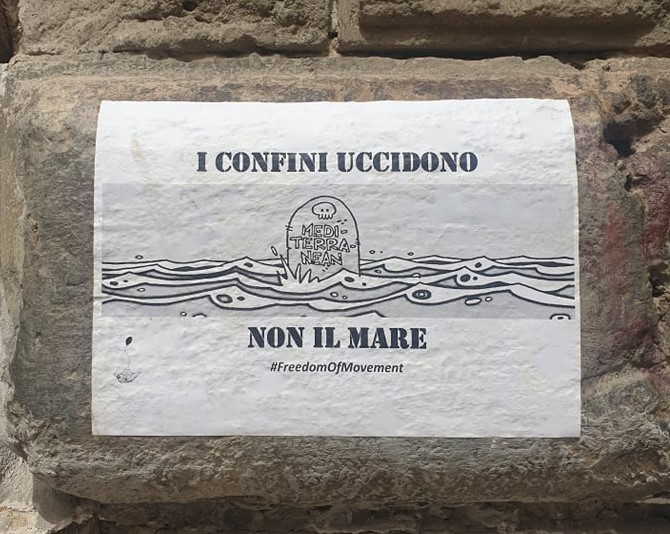

### AYS Daily Digest 27/9/21: **A 16\-year\-old boy died after being pushed back by the Polish border guards**
#### Will anyone be charged for the attacks on Syrians in Turkey? / Reports of abuse on Crete / BVMN reports to CESCR on Bosnia and Herzegovina / Support Polish groups active to support people on the move at the border with Belarus / Mixed Migration Update / a documentary on the actions of the Libyan CG & other recommended reads and reports

Borders kill, not the sea
#### FEATURED

A group with four children, including the youngest, only 18 months old, were pushed back to Belarus by officers of the Polish Border Guard\. 
Tragically, the 16\-year\-old boy died during the night\.

Before that, he was supposed to vomit blood, according to the findings of the Ocrzenie foundation\. Following the previously well tested rhetoric on other EU external borders, the PR of the border guard claimed no such instance happened, while the [MoI says](https://l.facebook.com/l.php?u=https%3A%2F%2Fwww.yahoo.com%2Fentertainment%2Fpoland-says-found-evidence-extremism-132022086.html%3Fguce_referrer%3DaHR0cHM6Ly9kdWNrZHVja2dvLmNvbS8%26guce_referrer_sig%3DAQAAAJhlgXZwU-aSo4HfmgPSdsyrMVEcMtk4I63MhbopAv0lxj2SnHAncUOmDJsOqNv1A22Uy3irvoQqBcciZqtGkRYeoAHEcO4dI-zJESrKP27X31HeHRPqhV8MgVYIrgwzaTohMoCCDDcZ4DpLmKib5zT25ha55wdbYSq0XKvvs2Ot%26guccounter%3D2&h=AT3ekaRcgWz3Ne4e-u8tUfS0mL1sCbRJv8WzDYc86MinCiKMdEYS610XEBNHxmmR_-3J5OdbXPksGfS6U_e-LEUMt-3fGgG-P5MU0QpGix-mUiKKyPdvxEfjwigYWsAAycSIp24KGHBxzQgZWQ&__tn__=%2CmH-R&c[0]=AT2odqAS4zRUMtsPI-HVMnMtTj5uWmYyym_5gsKfCWQRi_lANOBP61Nms-q-6nMB_pxag-Q2_gUpU8GLootnCWsEds1J5wIyCktWemxKTaIGvZa1ghmBMg8Anya8l9k3-6DNkDlKg2mFw08uVyXbOHN5yXW3K8yruu2X_oAAWnHMoJs0TJ_NPxTtqCdpm7Oz9dzkR7GTPriI1YeTXXQ) they corroborated their suspicions on terrorists among those fleeing, which is something also seen previously\.

Previously, as we reported, more people died last week of hypothermia and exhaustion\. The area where they were located is under a state of emergency which is being prolonged, prolonging thus also the time and space that is restricted to organisations, journalists and anyone wishing to aid the people in limbo\. — [Deputy Minister of the Ministry of Interior and Administration on the appeal of the medics to let them into the zone: “Entry not allowed”](https://bialystok.wyborcza.pl/bialystok/7,35241,27621109,stan-wyjatkowy-wiceminister-mswia-o-apelu-medykow-by-wpuscic.html)

■■■■■■■■■■■■■■ 
> **[Nick Beake](https://twitter.com/Beaking_News) @ Twitter Says:** 

> > Again, @[EU_Commission](https://twitter.com/EU_Commission) fails to explicitly condemn Poland's "pushback" policy on EU's border. 

5 people have now died this week.

EC repeats that Belarus trying to "instrumentalise" migrants (use as political pawns).
 
Urges Poland to give "necessary care" to preserve human life. 

> **Tweeted at [2021-09-24 11:32:04](https://twitter.com/beaking_news/status/1441364808381583368).** 

■■■■■■■■■■■■■■ 

#### THE MEDITERRANEAN

20 km from Sidi Mansour, off the coast of Sfax, the Tunisian navy and coast guard detained around 100 people, including 8 minors and 30 women, who were trying to leave the country, [reportedly](https://www.ansamed.info/ansamed/it/notizie/rubriche/cronaca/2021/09/27/migranti-100-fermati-dalla-tunisia-al-largo-di-sfax_09a677a4-f4f2-42c4-ae74-50fe79aa2350.html?fbclid=IwAR0i8DigVVCyjpnvZJmDxN53O1dmHjJg4wobupMfbFnMTx0RHC1Yp4Jjmz0) “without regular documents”\.

In Italy, 122 people on board the Ocean Viking safely disembarked on Sicily over the weekend\. Meanwhile, the Geo Barents is still r [eportedly](https://l.facebook.com/l.php?u=https%3A%2F%2Fwww.infomigrants.net%2Fen%2Fpost%2F35328%2F122-migrants-disembark-from-ocean-viking-60-on-board-geo-barents-still-await-safe-port%3Ffbclid%3DIwAR2bs_etkTwdUc2cwOepzFzLB5kRalcSsJ036CmBSBBFVv4JtbChQkv8A5E&h=AT3EXHTvtcPn3hZC7cS-m1JpQAFlIUCyCn6sbcgazXzuMUIIWewq9IZ06NgAsciP6yQxYsTY5ZjoYuAPCAPdwng96uGfKR65k6ZNxKIBgukXmyRUISLqDJyYGv7Wn9QNdnSdX7SdnI0KGILSM-SkQ1FGHYDpRg&__tn__=R]-R&c[0]=AT2YfoJH_uj7qRTYK7N-jLP8YmO0TgJsJG3YK0zNxQhfqNOslyuyL-yfVVqKGtqH7I55wr16TlQeKQiOmrsxoeQWGRt6adw2UOYg8U5_5stDzDUgWIUcw_NbkgZHwVO3sTtw1GubFyURjdNGIC_EIYwc_1bVLK1LVC1Z2tjsenWeombN5FjBs_rkqDOHlUMzOcgjtZiPMcICLDKYB3U) waiting for a port of safety for 60 rescued passengers and its crew\.

In Spain, a woman [has died and 113 people have been rescued](https://l.facebook.com/l.php?u=https%3A%2F%2Fwww.efe.com%2Fefe%2Fespana%2Fsociedad%2Funa-inmigrante-muerta-y-113-rescatados-del-mar-en-canarias-ceuta-granada%2F10004-4639264%3Ffbclid%3DIwAR3ZkxqezMKBORkSxHlEpdTGh2NlpeOQs4hn_mHjMh0b2yxJpnq2OyKZG7o&h=AT34MpTsFv2C_Y8yurn1uOvAwEUyJACg_9M7Ziz9GiNcKWvZcPjwq1bbeOSWEfCXnMoSDQcwa3mvltLJCfujKI_FZSft0tfOzXzhhLh_B35q_IG9qYkqRuOWrsCxyx5nC3RSvCIgxQ8zcByi9v4xQj1Su3Rv3g&__tn__=R]-R&c[0]=AT2YfoJH_uj7qRTYK7N-jLP8YmO0TgJsJG3YK0zNxQhfqNOslyuyL-yfVVqKGtqH7I55wr16TlQeKQiOmrsxoeQWGRt6adw2UOYg8U5_5stDzDUgWIUcw_NbkgZHwVO3sTtw1GubFyURjdNGIC_EIYwc_1bVLK1LVC1Z2tjsenWeombN5FjBs_rkqDOHlUMzOcgjtZiPMcICLDKYB3U) by Salvamento Marítimo and the Guardia Civil in boats at sea this Monday in operations near the Canary Islands, Ceuta and the Granada port of Motril\.

785 people died in the first eight months of this year trying to reach Canary Islands via the Atlantic, [according](https://l.facebook.com/l.php?u=https%3A%2F%2Fwww.infomigrants.net%2Fen%2Fpost%2F35322%2Fiom-over-780-migrant-deaths-on-atlantic-route-this-year%3Ffbclid%3DIwAR3kefRf7Kn4DDCgXMousU9PPKDw5hgcZ-WNNG56eE2oJAcl5NNdpHHEFj8&h=AT3sQgBOHdOeMVpCjnvAcD8-6LZL_uBVlOekcU1zZEWk9LLP1wueYcejGcFB2aT-boWqIQ113TQWXLxoofllNvopSTcGTrl6i5O2TC7uey1RPkfUKceGonP58Tfi64SC7mH0tEU79zKwDXKK1s6RAcjR8tOOhw&__tn__=R]-R&c[0]=AT2YfoJH_uj7qRTYK7N-jLP8YmO0TgJsJG3YK0zNxQhfqNOslyuyL-yfVVqKGtqH7I55wr16TlQeKQiOmrsxoeQWGRt6adw2UOYg8U5_5stDzDUgWIUcw_NbkgZHwVO3sTtw1GubFyURjdNGIC_EIYwc_1bVLK1LVC1Z2tjsenWeombN5FjBs_rkqDOHlUMzOcgjtZiPMcICLDKYB3U) to IOM\.

■■■■■■■■■■■■■■ 
> **[Open Arms ENG](https://twitter.com/openarms_found) @ Twitter Says:** 

> > There is very little left ... After weeks of work, we are finishing the last details before setting sail for the next mission in #Med. Soon our ship will start the engines and we cannot be more excited about the start of #mission86 of #OpenArms #everylifecount https://t.co/Ycj7dvBYNF 

> **Tweeted at [2021-09-27 14:38:23](https://twitter.com/openarms_found/status/1442498859868073984).** 

■■■■■■■■■■■■■■ 

■■■■■■■■■■■■■■ 
> **[Alarm Phone](https://twitter.com/alarm_phone) @ Twitter Says:** 

> > 🔴 We spoke again to the 70 people in #Malta SAR. Authorities have been informed for over 10 hours, but no help has arrived. Now it is dark and the wind is getting stronger. After two days at sea the people fear that, “no-one will survive the night”. Don’t let them drown! https://t.co/AB9GfzW4KZ 

> **Tweeted at [2021-09-27 19:03:00](https://twitter.com/alarm_phone/status/1442565454153674755).** 

■■■■■■■■■■■■■■ 

#### TURKEY
### Violent fascist groups off the hook for attacks

99 suspects were detained in the attacks against Syrian refugees in Ankara’s Altındağ district, of which 4 were arrested and 27 were released under judicial control, after intense attacks on the homes and workplaces of Syrians living in the region followed the argument that took place on August 11\. Until now, there was no information on what kind of action was taken against those detained in the incidents, activist [media sources](https://marksist.org/icerik/Haber/16620/Altindagda-gocmenlere-saldiran-4-kisi-tutuklandi?fbclid=IwAR2awdHZRcxqRs5vdKBrO_zRvNo5M0F1rwXaCbQdZsI09aZavmhrjLsnccA) remind:

> Organized nationalist fascists led the attacks against immigrants in Altındağ\. It is a fact that the attacks are pre\-planned and under the control of the state, and that racist violence is allowed\.
 

> On 13 August, 72 people were detained in connection with the racist attacks\. As of August 19, it was announced that 148 people who were determined to be involved in the attacks were detained\. However, the information on what kind of action was taken after these detentions and whether there were any arrests was not given by the authorities\. 

> Only 4 people were arrested in the events involving hundreds of people\. 

#### GREECE

The team of Alarm Phone was alerted to “5 men and a teenager who arrived on the island of Kos around 13:00 CEST\. Contact with them was lost shortly after\. Greek authorities are not providing any information\.”
### Saved off a boat to be mistreated in the ‘safe place’

[International Kurdistan Committee of Greece](https://twitter.com/StopPushbacks) reported that the group of more than 150 people who were rescued in Italian waters and brought to Crete have since been held by the Greek police in isolation, poor conditions, and uncertainty in a closed kindergarten for 3 days\. They were reportedly “interrogated by the black\-uniformed Greek police wearing balaclavas on the cargo ship for three times\. They asked to be brought back to Italy\. In the middle of the night, the police violently brought them to the coastguard boat and took them onshore\.”

■■■■■■■■■■■■■■ 
> **[International Kurdistan Committee of Greece](https://twitter.com/StopPushbacks) @ Twitter Says:** 

> > While being kept in the kindergarten on the coast of Crete, the people have been threatened and questioned individually by the Greek police. Some people were tortured. No interpreters, no legal procedure, no information on what will happen to them.
#PoliceBrutality #migrationGR https://t.co/9H1oEKVLcM 

> **Tweeted at [2021-09-26 20:37:26](https://twitter.com/stoppushbacks/status/1442226832422490122).** 

■■■■■■■■■■■■■■ 

Reportedly, a pregnant woman died, but no media [reports cite that](https://www.maritimebulletin.net/2021/09/24/aframax-crude-oil-tanker-seized-by-migrants/?fbclid=IwAR17WYYdDGDAs6ZntiKJW9CoZkzGoq6dxyXR04NOAOBxSbx3-0k4RVWSal4) , while they ‘sharpen’ the rhetoric, saying there was a ‘stand off’ between the officials and people concerned in the rescue and mistreatment\.

Also, Kurdistan Cultural Center of Greece c [laims](https://l.facebook.com/l.php?u=https%3A%2F%2Fwww.efsyn.gr%2Fellada%2Fdikaiomata%2F312176_steki-metanaston-hanion-eleytheria-metakinisis-gia-toys-prosfyges-na%3Ffbclid%3DIwAR3LhjXqLYZBM2R6RVz0GjHKxBJCHUDlL5xzWPkdcXRaJX81NrIYDRopWvw&h=AT1gdxOzYpfNuySpkAQ0wfG9k1ExDah58icBeWDvCz_IwniPA4mR7be9gRzc2LtS_A07aIjPmbW03TWsfWNyhrpCMd7E4a2fKAdlKmFsVry56fDY233JrhBTlbWgW3YYXTspepP7TDFD5JbPH5ku_Wl8Xw8XTA&__tn__=R]-R&c[0]=AT224opPwUjxYf5rvj74YYUNlqmZwIr8499AN73soP7vqYVhdwDcP6IkFU5DCqwLLMy7wIuj35ftfZufZOZoZ92-hakMB5zAqll7LdWjpN1h0UR9a68vxAYBnil1JJpYBibPaII6k9dFTmNaMMW02xebzHDX510xXGSUzCy8s7XTDG8GuTzIhPlgxjkbOKWJBO5U_EvW6aWcMEcDPwM) that two Iranian refugees were tortured by waterboarding and severe beatings by the Greek authorities in Chania, Crete in order to reveal the driver of the wooden boat transporting 152 people\.

Meanwhile, the situation at the camps doesn’t seem to get any better:

■■■■■■■■■■■■■■ 
> **[Parwana Amiri پروانه اميري](https://twitter.com/parwana_amiri) @ Twitter Says:** 

> > In #EleionasCamp the authorities asked the People under tents to camp out of the camp and will be in containers, but they put 2,3 families in one container.
“How can we live in such small place ?” Says one of the residents.
#ChangeSystemEu https://t.co/0x4yW61dsh 

> **Tweeted at [2021-09-27 10:06:22](https://twitter.com/parwana_amiri/status/1442430404510851075).** 

■■■■■■■■■■■■■■ 

More coverage on Parwana’s reporting from Lesvos and the local conditions are in [this story](https://www.thejournal.ie/moria-lesbos-camps-tgip-migration-5557312-Sep2021/?fbclid=IwAR181ditU0hMwLzN6lcECA1F6-2hOIty6XLSozLPAJXBg1kiQIyyckH4ZHc) \.

Don’t miss Petra Molnar’s take on how Greece and other EU countries prioritize surveillance over human rights:

#### CYPRUS
### NGO Kisa calling for criminal inquiry

A local NGO on Cyprus called for an independent criminal investigation into the treatment of refugees sent back to Lebanon — including the husband and two children of a pregnant Syrian woman who, as a result, was separated from her family\. The NGO, Kisa, was accused by the Minister of Interior for illegal actions, so he could dismiss their accusations\. Also, the Cypriot minister said that “in no legislation whatsoever, nor in EU directives, does this obligation \[reuniting families\] or provision exist\. Asylum seekers do not have such rights,” [adding](https://cyprus-mail.com/2021/09/25/kisa-calls-for-criminal-inquiry-into-separation-of-syrian-family/?fbclid=IwAR005DWh0DZRcOLjciUr1yY-sJilFXpVmD4rJ_quwd_cEdOAF3KImrLIZqE) this could set a precedent for other asylum seekers to bring their families to Cyprus\.
#### BOSNIA AND HERZEGOVINA
### UN submission by the BVMN

Border Violence Monitoring Network \(BVMN\) will share findings in the [United Nations Committee on Economic, Social and Cultural Rights](https://tbinternet.ohchr.org/_layouts/15/treatybodyexternal/SessionDetails1.aspx?SessionID=2442&Lang=en) \(CESCR\) related to pushbacks and protection concerns in Bosnia\-Herzegovina \(BiH\) \. In this 70th session of the Committee, BVMN has been invited to present a recent submission made regarding BiH and to outline abuses that people\-on\-the\-move are facing in the country\. These include both violations of economic and social rights suffered during cross\-border pushbacks and violations within State borders\. The submission findings also cover the systemic failings in provision of shelter, health access and basic amenities, which relate to both camps and squated accommodation\.

Issues addressed are:
- Theft of essential items, denial of access to food/water and essential medical assistance during pushbacks\.
- Physical violence during pushbacks to Serbia and Montenegro
- The use of arbitrary detention in squalid and inhumane conditions during pushbacks
- Denial of adequate health care and food in Bosnia\-Herzegovina\.
- Lack of access to adequate housing in Bosnia\-Herzegovina
- Lack of basic infrastructure and facilities for migrants, asylum seekers and refugees in Bosnia\-Herzegovina\.

#### DENMARK
### How long is too long? The limits of restrictions on family reunification for temporary protection holders

The European Court of Human Rights handed down its judgment on Denmark’s legislative tightening of family reunification rules for temporary protection holders\. The Court declared that the statutory requirement of three years waiting time for family reunification for a Syrian doctor with ‘temporary subsidiary protection’ status in Denmark breached his right to respect for family life under Article 8 of the Convention\.

> ‘temporary subsidiary protection’ holders were initially denied family reunification for one year, with this restriction increased to three years in February 2016 with retroactive application, which came to be known as the ‘three\-year rule’\. 

Read more in detail [here](https://eumigrationlawblog.eu/how-long-is-too-long-the-limits-of-restrictions-on-family-reunification-for-temporary-protection-holders/?fbclid=IwAR1eGQNs_kxZFwy6J5cGgW8MQfTzFYx_G4cqTqYmY-tPAkfawOcw1mrF0EU) \.

Also, don’t miss our team’s work on a [**Special from Denmark — Women Without Rights**](ays-special-from-denmark-women-without-rights-d4aa8f782789)

_During the last weeks, the Danish author and human rights activist AnneLise Marstrand\-Jørgensen published on her Facebook wall five stories under the common headline “Women without rights” \(Kvinder uden rettigheder\) \. The common theme and thread in these stories is the Danish asylum system and the practices and conditions for women who have had their residence permit revoked …_
#### The EU
### Slovenia focusing the issue on returns and readmissions

The Slovenian Presidency directed their questions and obviously priorities to the Strategic Commitee on Immigration, Frontiers and Asylum: [EU return policy — gaps and opportunities — discussion paper](https://www.statewatch.org/media/2771/eu-council-return-policy-discussion-paper-11816-21.pdf) , with emphasis on return and readmission in the EU’s relations with third countries, and how negotiations on readmission agreements could be improved:

> _At the forthcoming SCIFA \[Strategic Commitee on Immigration, Frontiers and Asylum\] meeting, delegations are invited to share their views on the following questions:_ 

> _Taking into consideration the new structures to be set up alongside the existing ones, are there any missing links that should be included to address the shortcomings in relation to coordination? How can we ensure that the different actors, including the EU Return Coordinator, work in synergy with one another?_ 

> _Are the enhanced emphasis on return and readmission in the external dimension and planned activities sufficient or should additional measures be put in place?_ 

> _In particular, further to the findings of the European Court of Auditors, would Member States be willing to support a more flexible approach in negotiations on return/readmission cooperation, and should existing mandates be revised accordingly? If priority is given to EU\-level instruments and more synergy ensured, how could negotiating efforts be improved?”_ 

#### UK

> **Throughout Europe, military drones are only allowed to fly in restricted areas\. This is a major obstacle for training and missions inside the country\. A British flight series with a US drone is now set to bring a breakthrough for flights in civilian airspace\.** 

An update by Matthias Monroy:

### How fair is the UK’s asylum system

MPs on the House of Commons Women and Equalities Committee are to scrutinise the current UK asylum process, investigating how far individuals fleeing persecution are able to seek asylum in the UK in a safe and fair manner\. [The inquiry](https://committees.parliament.uk/committee/328/women-and-equalities-committee/news/157756/mps-to-examine-fairness-of-the-uk-asylum-process/?fbclid=IwAR2wx3o3_E8O70TY1C9TcOwL2qPeDDdaWMTP_sdaafeXnyamZPH-BMtGrVg) will also examine the mechanics of the asylum process to assess how far the Government is able to address discrimination or specific dangers for those with protected characteristics within the existing framework\.
#### EVENTS
- **ZBIÓRKA RZECZY DLA OSÓB NA GRANICY POLSKO\-BIAŁORUSKIEJ:** support collecting goods for people at the Polish\-Belarus border:

- **How can the EU increase its capacity to control questionable exports that contribute to massive displacement?**

Join the webinar [here](https://us02web.zoom.us/webinar/register/WN_H9uvTMcQQtSmMvg6wHcvcg)

#### WORTH READING & WATCHING
- make sure you read the latest Mixed Migration Update:

[](https://l.facebook.com/l.php?u=https%3A%2F%2Fmixedmigration.substack.com%2Fp%2Fseptember-20-27-2021-mixed-migration%3Ffbclid%3DIwAR2awdHZRcxqRs5vdKBrO_zRvNo5M0F1rwXaCbQdZsI09aZavmhrjLsnccA&h=AT0eN7zAVknwimcKYTU4PWYSCMvBd4cd1Ak-9pX6fWUSb1scyBZ4eqTDcb-OTld3RmipjKXWA6NQlBJ5TRb5BLnfkhO1He_l6lKK0U-3mt8JdUoJ2LScNEzVXwu6MgfYt_7yBepwP7l4HR5ectsBalsGnXywpg&__tn__=R]-R&c[0]=AT3gXfTYT7j5evbVTa_zaidKihbnnQ_jhUSrgqiWG4jVjNVDCJm3X_KpjruQekRxgab0zTjvwM1qLwInxn65ikx5mqndu0yF5MMw4PbsM4RWiqTxQJfHRLWGmbeFc5Nzae2JRi8FfIh2c7vvKyB2M_Z7giuf9qTthyZTooRYxkGR1_g0VYgCQ6h5kEdkawgD7D34WxXur01lFmCZ9ro)

- On the _Libya, No Escape from Hell_ by Sara Creta:

- an update on the story about a father from Côte d’Ivoire, who lived in a chaotic situation in Paris where he was surviving without fixed accommodation with his then 4\-year\-old twin daughters:

[](https://l.facebook.com/l.php?u=https%3A%2F%2Fwww.infomigrants.net%2Fen%2Fpost%2F35300%2Fmy-daughters-were-granted-asylum-an-ivorian-father-in-france-says-his-situation-improved%3Ffbclid%3DIwAR2KXjs0XjeLiOdqr0v9gPUzort7aWIm_QMQ5XoIK4M1ki_SqY2YJ3skyZs&h=AT2slYbzTHEz8b49upZQsUx-sJ69CXN8tL7wSLbgZ7bkZQ63acMWpAyLNPjfcANV_bcclfYBCIYIPxSuJSm_qMKq9d6_diW0MRat9En3Grv1WMH2xERsrjBi7IUSrIgGgXxw9Sqgqq8UHQtO4g&__tn__=-UK-R&c[0]=AT3qXeJ3-X8ftCwaRoOukiy2fi_k5rZ43Jf6plP6x3R6HP4ZPaCL2sWGeIXvJ5j-D4U89nFs8jhKEk6LO8MkFpKfgLKhQI2UNqkGG0tXTl7O3AGCTDSvGTn_3Mie1ngRSg-CworWl49e4dp_kc5FHBq5dZ9jTwL9ZNAOHrOnwMuUKzyJ5yG_7kSO9xKTkkVVUiL_AjbOG-ys)

A comment — while the entire world moves, states continue to react to some of the movements histerically:

■■■■■■■■■■■■■■ 
> **[Pensare Migrante](https://twitter.com/PensareMigrante) @ Twitter Says:** 

> > Olanda, Francia, Thailandia, Chile.

E ancora Australia, Messico, Sud Africa, Algeria, Cina.
Tutto il mondo è in mvoimento, ma gli stati-nazione continuano a reagire in maniera isterica.

Saranno travolti dalle persone in cammino https://t.co/ExECXJvLWu 

> **Tweeted at [2021-09-27 08:07:51](https://twitter.com/pensaremigrante/status/1442400579964203011).** 

■■■■■■■■■■■■■■ 

**Find daily updates and special reports on our [Medium page](https://medium.com/are-you-syrious) \.**

**If you wish to contribute, either by writing a report or a story, or by joining the info gathering team, please let us know\.**

**We strive to echo correct news from the ground through collaboration and fairness\. Every effort has been made to credit organisations and individuals with regard to the supply of information, video, and photo material \(in cases where the source wanted to be accredited\) \. Please notify us regarding corrections\.**

**If there’s anything you want to share or comment, contact us through Facebook, Twitter or write to: areyousyrious@gmail\.com**

_Converted [Medium Post](https://medium.com/are-you-syrious/ays-daily-digest-27-9-21-a-16-year-old-boy-died-after-being-pushed-back-by-the-polish-border-c381bfa2bc62) by [ZMediumToMarkdown](https://github.com/ZhgChgLi/ZMediumToMarkdown)._
