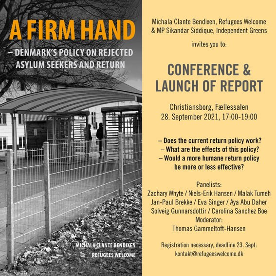

### AYS Daily Digest 01/10/21: While EU Tussles with Poland over Pushbacks, Commission Makes Deal with Iraq to Deport People From Lithuania
#### Mass arrests in Libya // Inside Samos camp // ‘Hunting’ people at night in Calais // 700 try to scale Melilla fence
### FEATURE — The EU’s Two Pushback Wars in Poland and Lithuania

![\[EPA\-EFE/ ARTUR RESZKO\]](assets/598e369c4bb0/1*z7DkUDaAQohVxlIoWyMdiA.jpeg)

\[EPA\-EFE/ ARTUR RESZKO\]

All eyes have been on the Polish\-Belarusian border this week, as each day seems to bring more tragedies for the people on the move stuck in the forests, and more “open and frank discussions” with the EU Commission that seem to lead nowhere fast\.

EU Home Affairs Commissioner Ylva Johansson met with Mariusz Kamiński, Poland’s Interior Minister, this week in Warsaw to discuss the so\-called “hybrid war” between Belarus and the EU\.

“The aggression from the Lukashenko regime deserves a firm and united response from EU,” Johansson said in a [tweet](https://twitter.com/YlvaJohansson/status/1443650293799981059) \.

Kamiński agreed, saying that “the Belarus actions need to be met with a firm response from EU member states,” [media](https://www.euractiv.com/section/politics/short_news/commissioner-johansson-failed-to-convince-poland-on-pushbacks/?fbclid=IwAR1MJ3toMCSW2IJ_sMwliOoUA_qviYb02VcT9nx2Hdjr_RNxo6AFkMyqhWE) reported\.

But what about Poland’s own actions at the border? [A bombshell digital investigation](https://www.amnesty.org/en/latest/news/2021/09/poland-digital-investigation-proves-poland-violated-refugees-rights/) by Amnesty International released this Thursday “proves”, in Amnesty’s words, that Poland has committed pushbacks at its border\.

“Poland has been cruelly holding this group of \[32\] people on their border in horrendous conditions for weeks\. Our analysis shows irrefutably on 18 August, their position shifted from Poland to Belarus overnight, which strongly suggests that they were victims of an unlawful pushback,” said Eve Geddie, Director of Amnesty International’s European Institutions Office\.

But according to Johansson, the problem at the Polish border comes down to a lack of transparency\.

“I raised the importance of the Polish authorities ensuring in a transparent way that any legislation, policy or practice at Polish Belarus border is fully in line with EU acquis,” she said\.

At a separate press conference on Wednesday, Johansson seemed to present the situation as if it were only a _Polish_ problem, neglecting, of course, the fact that the Polish border is also an EU border, and as an EU member, Poland must obey EU laws\.

Pressed on whether the moves break EU law, Johansson only said that “the commission has several question marks” on the Polish rules\.

It is hard to parse out just what is going on in the Commission’s head amidst all this confusing back\-and\-forth and nitpicking specific words\. So let us talk about something the EU is actually _doing_ to “solve the problem of migration,” in a word\.

On Friday, the EU Commission wrote in a [statement](https://www.europarl.europa.eu/doceo/document/P-9-2021-003756-ASW_EN.pdf?fbclid=IwAR0xAlzzfGQpnpthVVBukD-2gD0IuLe4Pmy3IbPFHrS7pLTOvqiTjifL32I) — actually it was Johansson herself, on behalf of the Commission — that it has struck a deal with Iraq to swiftly deport people on the move from Lithuania back to Iraq, with the help of Frontex\.

As of the middle of August, 690 people have been repatriated to Iraq from Belarus, the Iraqis said\. Lithuania has started returning Iraqi nationals with Frontex support, although the exact number was not specified in the statement\. More returns from Lithuania, however, “are in the pipeline\.”

Flights, of course, from Iraq to Belarus were suspended in the beginning of August, after the EU “insisted on better control of flights to Belarus and on the readmission of Iraqi nationals” in a July 30 meeting with Iraqi migration officials\.

How are these two issues, the pushbacks and the deportations, related? Well, as the EU has come under scrutiny for not doing more to force Poland to cease pushbacks, it seems to have found a way to return people directly to their country of origin, with the consent of that country\.

Whether a similar situation could soon occur in Poland remains to be seen, but the situation at the moment — the gross human rights violations, the state of emergency getting extended, the people freezing to death in the woods, etc\. — does seem untenable\. \(One group of people on the move reported [mass graves in the forests](https://wiez.pl/2021/10/01/na-granicy-zaciska-sie-petla/) , as entire groups simply die of exhaustion\. \)

Can this last into the depths of the Polish winter? Surely not\. So what will be done?
### LIBYA
#### Mass arrests of people on the move in Gargaresh, Tripoli

■■■■■■■■■■■■■■ 
> **[Sara Creta](https://twitter.com/saracreta) @ Twitter Says:** 

> > #Libya Arbitrary arrests &amp; brutal beatings in #Gargaresh #Tripoli. Women &amp; children brought to a nearby police station, while men are detained in Mabani. Reported injuries among #migrants. 

PM @[Dabaibahamid](https://twitter.com/Dabaibahamid) uses this opportunity for a pre-election show [facebook.com/10278366187578…](https://www.facebook.com/102783661875786/posts/231236459030505/) https://t.co/ffu9w31hPa 

> **Tweeted at [2021-10-01 15:10:41](https://twitter.com/saracreta/status/1443956540407431200).** 

■■■■■■■■■■■■■■ 

More than 500 people on the move were rounded up and arrested on Friday morning in Libya, journalists reported\.

Dax Roque, the Norwegian Refugee Council country director for Libya said the following in a [statement](https://www.nrc.no/news/2021/october/mass-arrests-libya/?fbclid=IwAR1MJ3toMCSW2IJ_sMwliOoUA_qviYb02VcT9nx2Hdjr_RNxo6AFkMyqhWE) :

> We are alarmed by reports of mass arrests of migrants in Tripoli this morning\. We are hearing that more than 500 migrants, including women and children, have been rounded up, arbitrarily detained and are at risk of abuse and ill\-treatment\. 

> Migrants and refugees in Libya, particularly those without legal residency in the country, are often at risk of arbitrary detention\. Torture, sexual violence, and extortion is rampant in Libyan detention centres\. We believe this latest wave of arrests is part of a wider crackdown by the Libyan authorities on migrants and refugees in Libya and the environment is becoming increasingly more restrictive\. 

Roque called on Libyan authorities to release the people immediately\.

However, as journalist Sally Hayden pointed out, the reason so many people remain in Libya is because they are subjected to EU\-sponsored pushbacks at sea\.

■■■■■■■■■■■■■■ 
> **[Sally Hayden](https://twitter.com/sallyhayd) @ Twitter Says:** 

> > A reminder that more than 25,200 men, women &amp; children have been forcibly returned to Libya this year alone, after they tried to cross the Mediterranean to reach Europe, &amp; that this is being done with tens of millions of euro worth of support from the EU. [twitter.com/IOM_Libya/stat…](https://twitter.com/IOM_Libya/status/1442515503830822923?s=20) 

> **Tweeted at [2021-10-01 16:24:51](https://twitter.com/sallyhayd/status/1443975204028420098).** 

■■■■■■■■■■■■■■ 

### SEA
#### Spanish activist calls shipwreck of 57 people a ‘massacre’

■■■■■■■■■■■■■■ 
> **[Helena Maleno Garzón](https://twitter.com/HelenaMaleno) @ Twitter Says:** 

> > 📢 TRAGEDIA. Han muerto cincuenta y siete personas: veintiocho mujeres, diecisiete hombres y doce niñxs, en el naufragio de una patera con destino a Canarias.
¡ Pongan fin a esta masacre en la Frontera ! 

> **Tweeted at [2021-10-01 11:30:59](https://twitter.com/helenamaleno/status/1443901250983153665).** 

■■■■■■■■■■■■■■ 

Helena Maleno Garzón, the founder of the organization “Caminando Fronteras” \(“Walking Borders”\), wrote on her personal Twitter account to condemn a recent shipwreck off the Canary Islands in which 57 people lost their lives due to EU border policies\.

Another boat with 62 people aboard has been missing since Thursday\.

Meanwhile, the [ECRE](https://ecre.org/atlantic-route-fears-about-poor-reception-conditions-on-lanzarote-almost-800-lives-lost-over-eight-months-increased-arrivals-linked-to-instability-in-countries-of-origin/?fbclid=IwAR0awIYSbTKXrJYGNMF6jZlOz6HO5YbIymFGfKjL_4eI7ld9cF_BytFaZd8) has raised the alarm about the poor reception facilities on Lanzarote, the northernmost of the Canary Islands:

> Following “incessant” arrivals in recent weeks, [emergency services](https://www.cope.es/emisoras/canarias/las-palmas/gran-canaria/noticias/puede-lanzarote-convertirse-arguineguin-20210928_1526713) and volunteers have said reception services on Lanzarote are stretched to their limits\. Journalists describe an [old warehouse](https://twitter.com/Lalailmo/status/1443237928331788301) on the island currently being used as a temporary reception centre for recently disembarked people as “seriously deficient”\. 200 people who arrived over the weekend of 26–27 September have been transferred to [Fuerteventura](https://www.cronicasdelanzarote.es/articulo/lanzarote/instaladas-varias-carpas-nave-acogida-inmigrantes-avalancha-pateras/20210927130209299149.html) and Gran Canaria due to lack of space in the temporary reception centers installed in Arrecife \(Lanzarote\) \. 

Some 800 people have died trying to reach the Canaries between January and August 2021\. Around 9,000 people have arrived in the Spanish archipelago since the start of the year, compared with 4,000 arrivals recorded in 2020\.
### GREECE
#### Journalists get inside look into new Samos camp

A group of journalists was given a tour of the new Samos camp this week by Greek Migration and Asylum Minister Notis Mitarakis himself\.

“The new structure is shiny and beautiful, huge and completely empty since it currently accommodates about 300 people, but it remains a prison and anyone who is happy with the prisons will be told to hope that he will not ever find himself inside,” media reported about the tour\.

“Our goal is for people to stay in these structures for a maximum of 3 to 4 months,” the Minister reportedly stressed during the visit\.

However, many people live in these camps for years, like a group of single Syrian men who recently wrote an open letter to the Samos camp authorities asking for freedom and the opportunity to work\.

■■■■■■■■■■■■■■ 
> **[Samos Advocacy Collective](https://twitter.com/AdvocacySamos) @ Twitter Says:** 

> > Today, while #Greece PM &amp; Migration Minister visit the new #hotspot in #Samos, a group of single Syrian men confined in the structure shared this open letter to the camp authorities.

They have spent 2+ years on this island and all they ask is for freedom and opportunity to work. https://t.co/WKYJj8nln0 

> **Tweeted at [2021-10-01 14:21:52](https://twitter.com/advocacysamos/status/1443944256847155201).** 

■■■■■■■■■■■■■■ 

Read the whole article on the Samos camp visit, with pictures, [here](https://www.politikalesvos.gr/ti-eidame-sti-nea-kleisti-domi-sti-samo/?fbclid=IwAR0GUQhSaRptNDHSHzLx8ew-RNb2j8QpIvWQqedaZZXus8UlVEQy7Ce_jPI) \.
#### Unaccompanied children to be transferred

Two hundred and twenty\-two unaccompanied minors living in camps will be transferred to more “suitable facilities” by the end of the year, [media reported](https://www.ekathimerini.com/news/1168833/unaccompanied-migrant-children-to-be-given-refuge/?fbclid=IwAR04dcSV2ob-ArKsZN-5Af5k_Ka4oxxyujkUv0eqKx71QrR6w9HEDEPAyZQ) \. Just what those facilities are exactly was not specified\.

Greece currently hosts 2,134 unaccompanied minors, just 100 of whom are slated to be transferred to other European Union countries, which have taken in 1,006 unaccompanied children from Greece since April 2020\.
### BOSNIA
#### Smuggling arrests

Four Pakistanis were arrested on smuggling charges in Bihać, the capital of Una Sana canton in northwest Bosnia, [media](https://www.federalna.ba/u-bihacu-uhapsene-cetiri-osobe-zbog-krijumcarenja-ljudi-skco0?fbclid=IwAR0xAlzzfGQpnpthVVBukD-2gD0IuLe4Pmy3IbPFHrS7pLTOvqiTjifL32I) reported\. [Other media reported](https://www.federalna.ba/u-akciji-sutjeska-lisene-slobode-bh-drzavljanke-zbog-krijumcarenja-migranata-hgn8y?fbclid=IwAR01QPFbMIZXV_NK_K2BGmV2fg3ZZ1BEIqekLB0NDPe9zjEeVe1D0iZnbck) that authorities prevented the smuggling of 11 people of “Afro\-Asian” origin in Tjentište, a village in Republika Srpska on the border with Montenegro\. The suspected smugglers are Bosnian nationals\.

Frontex is also now carrying out its own smuggling stings in the Balkans\. The agency arrested 144 suspected human smugglers in coordination with Austrian authorities from September 3 to 13\.

The operation also reportedly led to the detection of 6,656 “irregular migrants”, 76 fraudulent documents, and 13 stolen cars\.
### SWITZERLAND
#### Asylum\-seekers must hand over phones

The Swiss Parliament agreed last month to allow migration authorities to search through asylum\-seekers’ mobile phones if it is the only way to verify their identities, [media reported](https://www.swissinfo.ch/eng/asylum-seekers-to-hand-over-their-smartphone-before-entering-switzerland-/46987854?fbclid=IwAR0GUQhSaRptNDHSHzLx8ew-RNb2j8QpIvWQqedaZZXus8UlVEQy7Ce_jPI) \. The information gathered via a digital program will be stored on a secure server for one year\.

“It’s absurd that authorities trying to establish a person’s identity have to proceed blindly, without having the right to take into consideration devices which contain large amounts of information,” Gregor Rutz of the right\-wing People’s Party, and an architect of the new law, said\.

Advocates, however, say the law violates people’s rights\.

“The measure is disproportionate and constitutes a serious attack on the right to privacy,” said Swiss Refugee Council spokesperson Elian Engeler\.
### FRANCE
#### BBC joins French police to ‘hunt’ people on the move in Calais

In a video that could be distressing to some, a BBC reporter joins French police in Calais to search for people on the move trying to board boats across the Channel\. Watch the video [here](https://www.bbc.com/news/av/world-europe-58725584) \.
### ITALY
#### Fire at camp in southern Italy leaves one dead

A man from sub\-Saharan Africa has died after a fire broke out late Wednesday evening at a self\-managed migrant workers’ camp in a disused concrete factory in Castelvetrano, Sicily, [media](https://www.infomigrants.net/en/post/35451/fire-in-migrant-camp-in-southern-italy-one-dead?fbclid=IwAR2WOkhBu4830TmvzY6Wyga9shB-bAIhLnhyNwIRFjO0m_NAfup0J-vfK-Q) reported\. [Other media](https://www.fuorimercato.com/agroecologia-lavoro-migrante/363-brucia-il-ghetto-di-campobello-di-mazara-omar-e-morto-basta-ghetti-basta-sfruttamento.html?fbclid=IwAR293OfBFOEKX5WSKH31pNG3wVUUvdSzkJzCS5Zpm1fP9wouoIt1hrFKzq0) named the man as Omar, and said he died in his sleep\.

Media did not specify the cause of the fire\. Firefighters came to the scene, but one media said that help was slow to arrive\.

The former factory, which closed its doors in 2010, had been taken over by people working in nearby olive groves\. The people had been living in tents and other shelters made from cardboard, fibre cement and wood\.

The self\-managed village had a small bazaar, an area where a fire heated water for showers, and a meat butcher\.

Those who survived the blaze had to spend the night on the streets after the fire destroyed their homes\. The following morning, a group of about 50 of them gathered to protest their living conditions, blocking a provincial road\.

“We are asking for decent accommodation,” the protesters said\. “They have to understand that we have value, because without us the olives wouldn’t be harvested\. We are all brothers, those with stay permits as well as those without\.”
### SPAIN
#### Some 700 people try to scale Melilla border fence into Spain

What media described as an “unprecedented” number, 700 people tried to scale the Melilla border fence separating Morocco from the Spanish enclave, [media reported](https://english.alarabiya.net/News/world/2021/10/01/Around-700-migrants-try-to-cross-into-Spain-s-Melilla-enclave?fbclid=IwAR2WOkhBu4830TmvzY6Wyga9shB-bAIhLnhyNwIRFjO0m_NAfup0J-vfK-Q) \.

However, none of the people were able to cross, as Spanish and Moroccan authorities worked together\.

Although hundreds of people had tried to cross the fence before now, “we haven’t seen a number like 700 before,” a Spanish official said, describing their efforts to reach the fence as “very well\-coordinated\.”
### UNITED STATES / AFGHANISTAN
#### Some Afghan evacuees leaving U\.S\. bases before resettlement

Hundreds of Afghan evacuees now housed at U\.S\. military bases are simply leaving the bases and entering the country, before they have received resettlement services, [media reported](https://www.reuters.com/world/asia-pacific/exclusive-giant-can-worms-some-afghans-leave-us-military-bases-before-2021-10-01/?fbclid=IwAR1mMl29BYSXjsy66by-9-XmC5eWxiXigXtGh09HTKx4c79YrKVdbRSMF-g) \. As many as 700 people are thought to have done this, most of them those who have family ties in the U\.S\. already\.

Immigration advocates are concerned about the risks to Afghans who give up on the complex resettlement process — which is voluntary\. Refusing services could cause problems down the road, advocates warn, and cost people critical benefits, like expedited work visas\.

“It’s a giant can of worms,” one U\.S\. Citizenship and Immigration Services official told media, speaking on condition of anonymity\. “This could lead to years and years of terrible immigration status problems\.”
### WORTH READING / LISTENING TO/ ATTENDING
#### Event: A firm hand — Denmark’s policy on rejected asylum seekers and return\.

More information can be found [here](https://refugeeswelcome.dk/rapporter/pdf/?fbclid=IwAR1MJ3toMCSW2IJ_sMwliOoUA_qviYb02VcT9nx2Hdjr_RNxo6AFkMyqhWE) \.
#### ‘I pleaded for help\. No one wrote back’: the pain of watching my country fall to the Taliban

#### Beirut to Belarus: Syrian refugees embark on new, perilous route toward longed\-for EU asylum

#### How Frontex intimidates a German NGO — despite resistance from the European Parliament \(in German\)

#### Frontex steps over European Parliament, makes final push for legal fees

#### North and West Africa: INTERPOL report highlights human trafficking for organ removal

**Find daily updates and special reports on our [Medium page](https://medium.com/are-you-syrious) \.**

**If you wish to contribute, either by writing a report or a story, or by joining the info gathering team, please let us know\.**

**We strive to echo correct news from the ground through collaboration and fairness\. Every effort has been made to credit organisations and individuals with regard to the supply of information, video, and photo material \(in cases where the source wanted to be accredited\) \. Please notify us regarding corrections\.**

**If there’s anything you want to share or comment, contact us through Facebook, Twitter or write to: areyousyrious@gmail\.com**

_Converted [Medium Post](https://medium.com/are-you-syrious/ays-daily-digest-01-10-21-while-eu-tussles-with-poland-over-pushbacks-commission-makes-deal-with-598e369c4bb0) by [ZMediumToMarkdown](https://github.com/ZhgChgLi/ZMediumToMarkdown)._
