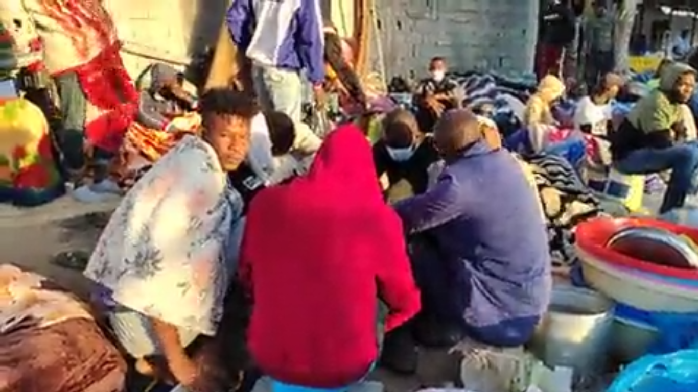

### AYS Daily Digest 11/10/2021: People stuck in Libya still seek protection at UNHCR Center
#### Demonstration and despair in Libya // New shipwreck: 15 lives lost // Italy disregards the memory of those who died in the 2013 shipwreck // Greece: more fences planned // Hunger Strike in support of people in Calais started

In the early morning hours, people freeze outside the UNHCR Community Centre in Tripoli\. Screenshot of video tweeted by: Refugees in Libya
### FEATURE
#### People in Libya seek and demand protection, while EU turns a blind eye and continues support for so\-called Libyan Coast Guards

The topic gets little international media, but we will make sure to keep you updated on the unfolding events in Libya\.

According to sources from the ground some 3000 people are currently gathering in front of a UNHCR Community Day Centre in Tripoli, in fear of arbitrary arrests and in demand of evacuation and security\. Among them are many women, some of them pregnant, and children\. Videos published in the morning showed freezing people, some gathering around a burned down fire, some wrapped in thin blankets sleeping on the ground \(see feature photo\) \.

■■■■■■■■■■■■■■ 
> **[Refugees In Libya](https://twitter.com/RefugeesinLibya) @ Twitter Says:** 

> > 🛑 Alerts. The number of refugees currently at the @[UNHCRLibya](https://twitter.com/UNHCRLibya) is proceeding 3️⃣0️⃣0️⃣0️⃣ as they protest and ask for evacuation.

@[_AfricanUnion](https://twitter.com/_AfricanUnion) @[KitchaFitFit1](https://twitter.com/KitchaFitFit1) @chaosnaybehaqi @[sallyhayd](https://twitter.com/sallyhayd) @[UNSMILibya](https://twitter.com/UNSMILibya) @[GiuliaRastajuly](https://twitter.com/GiuliaRastajuly) @[IOM_Libya](https://twitter.com/IOM_Libya) #EvacuateRefugeesFromLibya Now https://t.co/ZV4YR492ao 

> **Tweeted at [2021-10-11 09:21:50](https://twitter.com/refugeesinlibya/status/1447492629835489280).** 

■■■■■■■■■■■■■■ 

In response to the gathering, UNHCR tweeted yesterday the people should disperse in order to be able to provide access for those among them who are most vulnerable\. This tweet led to sharp criticism from people in Libya as well as from human rights activists, as there is obviously nowhere to disperse to for the people\. [As we reported,](ays-digest-08-10-21-six-shot-dead-in-tripoli-detention-centre-7154dd1a6d85) six people got shot dead and 24 injured when armed guards opened fire on people who tried to flee the detention centre at the end of last week\. These people fear for their lives and came to UNHCR as their last resort for protection\.

■■■■■■■■■■■■■■ 
> **[UNHCR Libya](https://twitter.com/UNHCRLibya) @ Twitter Says:** 

> > UNHCR staff, partners are trying to provide help at Community Day Centre, Tripoli, for asylum seekers,refugees, but crowds again preventing those needing urgent help from entering building.

We urge crowds to disperse, let us help most vulnerable. 

> **Tweeted at [2021-10-10 09:20:56](https://twitter.com/unhcrlibya/status/1447130016005902336).** 

■■■■■■■■■■■■■■ 

Meanwhile, the European Commission is about to deliver new ‘P150’ class patrol boats to the Libyan coast guard, [as media reported\.](https://euobserver.com/migration/153180?fbclid=IwAR3DWsQ9vQ5Td7ccegu1TtR6kO0wLHxfagpLV3FGwWH76ZSiMeQ2sffFvoo) The boats are meant to be used for search and rescue operations, which means: They will be used to be more effective in preventing people from leaving Libya and instead bring them back to deadly detention centres\. [In an update on the UN fact finding mission published earlier this month](https://www.ohchr.org/EN/HRBodies/HRC/FFM_Libya/Pages/Index.aspx) , it was stated that there are reasons to believe that murder, torture and rape against migrants form part of a systematic and widespread attack directed at this population and therefore could amount to crimes against humanity\. Of course, an EU Commission's spokesperson claimed that the aim of the support with the new boats was to help to save lives\. However, if this actually was the aim, why is the EU not finally ending its attempts to uphold a Libyan Search and Rescue Zone and instead implements an actual EU funded rescue mission in the Mediterranean? Another question that needs to be raised is why the UN does not openly and clearly call for the EU to stop its support of the so\-called Libyan Coast Guard?

While People on the Move in Libya are left alone in their protest and search for protection, another boat sank and bodies were washed ashore\. At least 15 people lost their lives in yet another shipwreck\. Refugees in Libya stated on Twitter:

> “We send condolences to ourselves because they were of us and we were of them”

### SEA
#### Many deaths feared on Central Med route

On Alarm Phone’s 7 anniversary, the group was informed and tried to provide assistance and rescue for a boat with 105 people on board\. It was later confirmed that the boat capsized and at least 15 people died\.

On Monday morning, Alarm Phone first tweeted about a boat in danger off the Libyan coast in the area of Zuwara\. The people on board were in fear as the weather was deteriorating\. While Libyan authorities claimed to have launched a search and rescue operation, Alarm Phone stated it took them more than 10h to reach the boat that was just off the coast\.

■■■■■■■■■■■■■■ 
> **[Alarm Phone](https://twitter.com/alarm_phone) @ Twitter Says:** 

> > This case, as so many before, shows that the task of the so-called Libyan CG is to deter people from reaching Europe, on Europe's behalf. Whether people drown or are forced back to Libya, what counts is that they do not touch European soil. We condemn this deadly border regime. 

> **Tweeted at [2021-10-12 07:50:46](https://twitter.com/alarm_phone/status/1447832100594503683).** 

■■■■■■■■■■■■■■ 

What a sad anniversary\. Alarm Phone was founded on October 11, 2014, one year after a shipwreck occurred in the Maltese search and rescue zone in which 268 people lost their lives\.

■■■■■■■■■■■■■■ 
> **[Alarm Phone](https://twitter.com/alarm_phone) @ Twitter Says:** 

> > 🔶Seven years of Alarm Phone🔶

Today, we remember the dead & missing of the 11 October 2013 shipwreck, when 268 people died in the #Mediterranean, because rescue efforts were delayed. One year later, on 11 October 2014, we started the Alarm Phone. https://t.co/d2zBSzoQsb 

> **Tweeted at [2021-10-11 11:05:55](https://twitter.com/alarm_phone/status/1447518820659343360).** 

■■■■■■■■■■■■■■ 

According to IOM data, 474 people died so far this year while trying to cross the central Mediterranean Sea while another 689 people went missing\. 26,214 people have been returned to Libya so far in 2021, 491 of them during October 3–9\.
### ITALY
#### Remains of Victims of shipwreck 2013 reburied in mass grave

October 2013 saw two of the most grave shipwrecks happening in the Mediterranean Sea\. On October 3th, about 366 people died in a shipwreck off the coast of Lampedusa\. Only eight days later, on October 11th, 268 people died in the before mentioned shipwreck within the Maltese Search and Rescue area\.

Relatives of victims of the first shipwreck now uncovered that some bodies have been moved from the burial ground and were put into a mass grave, [as Info Migrants reports\.](https://www.infomigrants.net/en/post/35644/lampedusa-shipwreck-victims-reburied-in-mass-grave?fbclid=IwAR3qttXPGyiTNDdtPhNLrAUNV1p6TcEIQe22AxbDJ4tftwSyuj4S7udbHYg) It was argued by local authorities at the request of the relatives that the remains of these people were reburied in a mass grave because the municipality was lacking burial grounds and the victims have never been identified\. The Mayor of the town Sciacca in southern Sicily promised to investigate on how this could happen\.

### GREECE
#### New border fences for Greece?

■■■■■■■■■■■■■■ 
> **[Lena K.](https://twitter.com/lk2015r) @ Twitter Says:** 

> > 🇬🇷 Citizen Protection minister T. Theodorikakos visited Evros and reportedly said the government is thinking about a further 47km of wall(s) in #Evros. Don't hold back guys, just build a wall all along the border with 🇹🇷 & 🇧🇬. That will solve all problems Greece is facing, no?🙃 

> **Tweeted at [2021-10-11 17:18:03](https://twitter.com/lk2015r/status/1447612472576331777).** 

■■■■■■■■■■■■■■ 

[According to media reports](https://www.evros-news.gr/2021/10/11/%ce%b1%cf%80%ce%bf%ce%ba%ce%bb%ce%b5%ce%b9%cf%83%cf%84%ce%b9%ce%ba%ce%bf-%cf%83%ce%ba%ce%ad%cf%88%ce%b5%ce%b9%cf%82-%ce%b1%cf%80-%cf%84%ce%b7%ce%bd-%ce%ba%cf%85%ce%b2%ce%ad%cf%81%ce%bd%ce%b7%cf%83/) , they will be added to the existing 40 kilometers \(27 in the area of ​​Feron and about 13 in Kastanies\-Nea Vyssa\) \. The fence along the Greek border will then sum up to 90 km\.
#### Small fire in Moria 2\.0

A fire broke out once again in Moria 2\.0\. Nobody was injured and the fire was extinguished fast, according to sources from the ground\.

■■■■■■■■■■■■■■ 
> **[The Hope Project](https://twitter.com/HopeProjectOrg) @ Twitter Says:** 

> > Another fire at Moria 2 camp today, thankfully no reported injuries. The cause of the fire is being investigated and luckily the fire brigade responded quickly so the fire did not spread. 
#moria2 #moria2fire #fire #fires #refugee #refugees #refugeecamp #moria2fires https://t.co/p0aSWYctRQ 

> **Tweeted at [2021-10-11 20:39:33](https://twitter.com/hopeprojectorg/status/1447663182064009219).** 

■■■■■■■■■■■■■■ 

### FRANCE
#### Hunger strike started in support of the people on the move in Calais

A group of three people started a hunger strike in Calais in order to support those who are confronted with police violence, destruction or theft of belonging and lack of access to basic provisions\. The people on strike have been active in the area before, by cleaning around the camps where the authorities did not lift a finger and by building kites out of the rests of tents that were destroyed by police\. There demands are quite basic:
- Suspension of daily evictions and dismantling during the winter break
- Stop the confiscation of tents and personal effects of exiles
- Opening of a citizen dialogue on the opening and location of distribution points

■■■■■■■■■■■■■■ 
> **[Louis Witter](https://twitter.com/LouisWitter) @ Twitter Says:** 

> > À Calais, début d’une grève de la faim pour dénoncer les conditions de vie et le harcèlement policier des exilés à la frontière franco-britannique. 

Père Philippe, prêtre ouvrier, Anaïs et Ludovic de l’association Shanti cessent de s’alimenter à partir d’aujourd’hui. https://t.co/XJlwHC5hHr 

> **Tweeted at [2021-10-11 14:38:32](https://twitter.com/louiswitter/status/1447572330339835904).** 

■■■■■■■■■■■■■■ 

### DENMARK
#### Syrians leave Denmark to the Netherlands and Belgium, in fear of deportation orders

Following Denmark's declaration of Syria being safe to return for Syrians, many people got their residencies revoked and were placed in preremoval detention centers, costing the state hundreds of Euros daily and destroying social, educational and professional lives of the affected people\. Since there is no scheme for deportation, so far, and it is very likely that courts would overturn actual deportations on grounds of violation of the non\-refoulement principle, people will be stuck in the centres without any perspective and in lasting fear of deportation potentially for years\. Many Syrians therefore decide to leave the country they have settled in, learned the language, raised their children and found jobs in the last years and try to make a fresh start in the Netherlands and Belgium, [as media reports\.](https://www.middleeastmonitor.com/20211011-syrian-refugees-flee-from-denmark-to-netherlands-belgium/?fbclid=IwAR34X5bAAX2LRoJ_WwUbMeZWwJ9aQyempQgFkhicTsGdGdKK82uqJfDVnPQ)
### UK

In the resent weeks, the UK Home Office pushed hard to make pushbacks in the Channel the number one strategy on dealing with people who try to cross\. This blog post provides an overview over the legal situation concerning obligations to rescue people in distress in British and international law:

In the last years, many young people who recently arrived to the UK and had insecure prospects on their asylum status, took their own lives\. This article looks deeper into the tragedy and how the British asylum system is harming peoples’ mental health situation\.

### WORTH READING
#### New Mixed Migration Update is out\! The weekly Newsletter collects updated on migration from all around the world:

#### Academic article by Maurice Stierl on how the pandemic has been exploited to enact deterrence through hygienic\-sanitary border enforcements:

#### Short documentary on pushbacks along EU\-borders \(in German\):

**Find daily updates and special reports on our [Medium page](https://medium.com/are-you-syrious) \.**

**If you wish to contribute, either by writing a report or a story, or by joining the info gathering team, please let us know\.**

**We strive to echo correct news from the ground through collaboration and fairness\. Every effort has been made to credit organisations and individuals with regard to the supply of information, video, and photo material \(in cases where the source wanted to be accredited\) \. Please notify us regarding corrections\.**

**If there’s anything you want to share or comment, contact us through Facebook, Twitter or write to: areyousyrious@gmail\.com**

_Converted [Medium Post](https://medium.com/are-you-syrious/ays-daily-digest-11-10-2021-people-stuck-in-libya-still-seek-protection-at-unhcr-center-d8c883a329e1) by [ZMediumToMarkdown](https://github.com/ZhgChgLi/ZMediumToMarkdown)._
