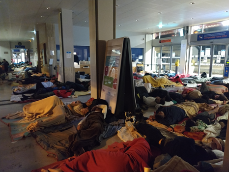
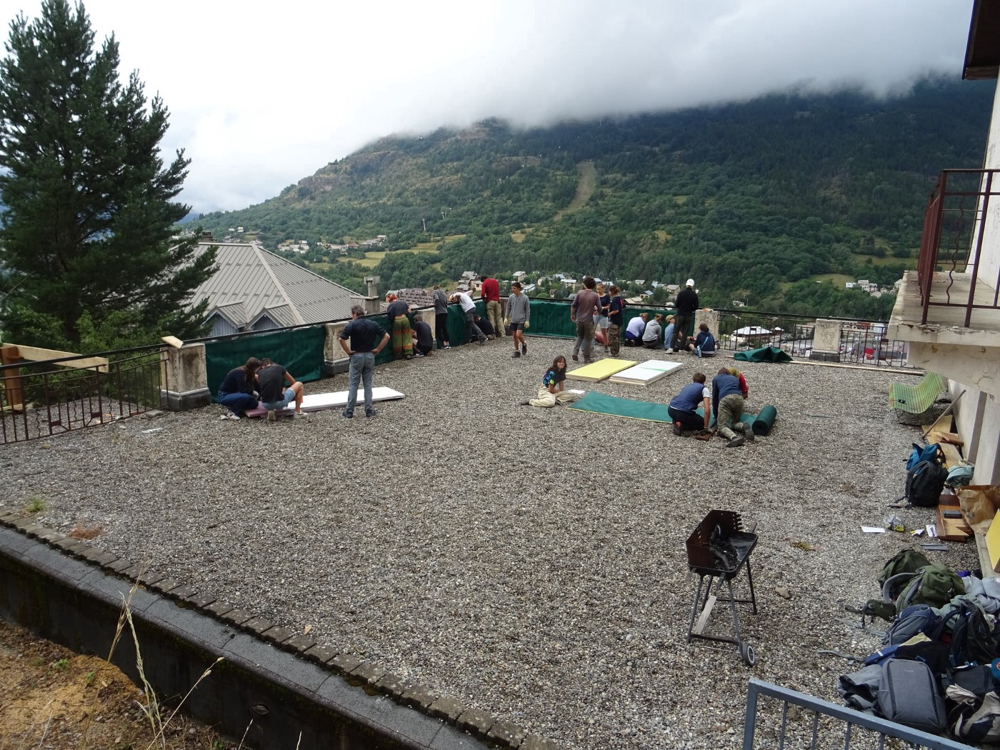
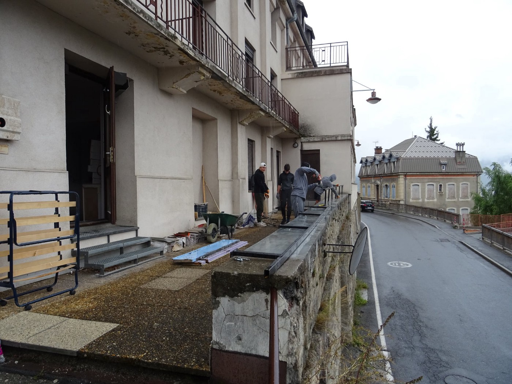
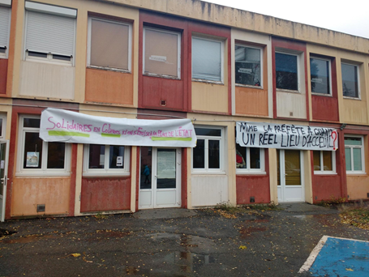

### AYS Special from Briançon — Solidarity at the Border

[Are You Syrious?](?source=post_page-----557d10e21c07-----------------------------------)

[Nov 14](ays-special-from-briançon-solidarity-at-the-border-557d10e21c07?source=post_page-----557d10e21c07-----------------------------------) · 5 min read

_Briançon, on the French\-Italian border, is one of the first cities of arrival for people on the move coming from Italy to France\. The reception situation is increasingly dire and unequal mobilities are starkly drawn\._

\(Occupation of SNF Station\)

During 2021, the number of people who need accommodation has risen consistently\. The town has seen up to 60 arrivals a day of people who cannot continue the journey due to high transport costs and the COVID\-19 pass\. As a result, there are almost no options left for people on the move\.

\(Work being completed on the Terrasses Solidaires building\)

The volunteer\-run refuge in the [Terrasses Solidaires](https://www.lesterrassessolidaires.org/) building has been [temporarily closed to new arrivals since October 24th](https://actu.fr/provence-alpes-cote-d-azur/briancon_05023/briancon-ne-pouvant-plus-etre-accueillis-aux-terrasses-solidaires-des-exiles-occupent-la-gare_45941457.html) ,as for weeks it has hosted more than 200 people, while its capacity is 80, and neither security nor a dignified stay could be guaranteed any more\.

> _The refuge volunteers and other local activists demand that authorities finally take on their responsibilities to host people\._ 

This attempt at a “power struggle” with the French state resulted in a two\-night occupation of the Briançon SNCF railway station by activists and people on the move\. The only response from the authorities was the evacuation of these places, and, once again, the arrival of nearly 200 additional “ gendarmes mobiles” \(riot police\) in the Briançon area, as well as the transfer of 10 additional border police in Montgenèvre, swelling the number of police officers to nearly 400 individuals\. Furthermore, the train station office closed, which made it difficult for people on the move to buy tickets to move on to other places\. The regional authority “prefecture” also stopped the Red Cross from conducting COVID\-19 tests for half a day, which meant that people could not take long\-distance trains\. Alongside this was the very real fear that people could be transferred to detention centres\. Consequently, the [parish of Saint Catherine](https://www.paudal.com/2021/10/26/the-migrants-who-occupied-the-briancon-station-accommodated-in-a-church/) has generously welcomed all people at risk\.

> _However, it is not the Church’s responsibility to host people, neither can they do this in the long run\._ 

In order to prevent people from becoming homeless again, on the morning of October 30th, activists and people on the move decided to take shelter in the vacant former Prorel vaccination centre\. The regional authority in Gap had promised some days before to provide shelter for those who would not fit in the refuge, but no action had been taken\. The Briancon mayor condemns all acts of solidarity\. The first steps he took when he came into office last year were to cancel the rental agreements of the former refuge and other solidarity associations\. This meant that the citizen’s movement needed to accomplish the impossible — acquire a self\-financed large building to accommodate people on the move — in a tourist city with a competitive and expensive real estate market\.

Not only are state actors refusing to take responsibility for the physical safety of people, but there is also a growing presence of repressive state actors\. The police presence has continuously increased during the last five years\. As a result, [it is well documented that people on the move are taking ever higher and more dangerous routes](https://www.infomigrants.net/en/post/30151/critical-situation-for-migrants-at-italianfrench-border) \. This increases their risk of becoming lost and thus contracting hypothermia in the extremely cold temperatures\. There is also a very real risk of avalanche\. At this inner\-European border, border militarisation does not stop people from exerting their right to move, but it does however create suffering, hardship and even death\. The French State continues its methodical work of creating precariousness, favouring the confinement of undocumented people and the manufacture of ‘undesirables’ through its rhetoric\.
### The immediate demands of Briancon activists

- a dignified and unconditional reception system in addition to the Refuge Solidaire — a new reception centre, open day and night, funded and set up by state\-actors
- that the State takes its responsibility and does not leave it to citizen associations to take care of people in danger\.
- no more repression by the state

However, here is what actually happened:

The occupation of Prorel was forced to stop on the afternoon of Saturday the 30th\. The Parish of St\. Catherine opened their doors once again\.

> _In the heart of the Alps, at an altitude of more than 1300m and due to the extremely harsh conditions, it is unthinkable to leave these people without any reception conditions upon their arrival\. The prefecture/district office however does exactly this\._ 

The space at Prorel had been taken not only to provide a space for people on the move who had already arrived and that had no other place to stay, but also for those expected to arrive\. On Friday evening for example, 50 people were forcibly returned to Italy at Montgenevre\.

For now, after negotiations, the prefecture has promised to finance an overnight reception facility \(without any guarantee of daytime reception, accompaniment on departure, etc\. \) under the condition that another association capable of doing this work is found\.

On the Italian side of the border, the squats that have hosted people have been repeatedly evicted\. Some local bus routes have even been modified to make the crossing more complex\. The regional French bus line by RESALP stopped serving Clavière, a small resort directly before the border, for vague reasons\.

> _Large groups of people on the move of all ages are thus forced to walk up to 20km to the alpine border, often only to be refouled several times\._ 

While it remains impossible for activists to provide safety information to people on the move, the probability rises that they will try dangerous and avalanche\-prone routes in snowy and freezing mountains\.
### The needs

At the moment, there is rain and snow with temperatures around 0°C\. It will only get colder\.

70people were reported to be on the way to the militarised border last Sunday\. There is a continuous demand for volunteers, both for the night shifts in shelters, and for search and rescue teams in the mountains to locate and assist people in difficulty\.

**_— Briançon Solidarity_**

**Find daily updates and special reports on our [Medium page](https://medium.com/are-you-syrious) \.**

**If you wish to contribute, either by writing a report or a story, or by joining the info gathering team, please let us know\.**

**We strive to echo correct news from the ground through collaboration and fairness\. Every effort has been made to credit organisations and individuals with regard to the supply of information, video, and photo material \(in cases where the source wanted to be accredited\) \. Please notify us regarding corrections\.**

**If there’s anything you want to share or comment, contact us through Facebook, Twitter or write to: areyousyrious@gmail\.com**

_Converted [Medium Post](https://medium.com/are-you-syrious/ays-special-from-brian%C3%A7on-solidarity-at-the-border-dbdbd5fa129) by [ZMediumToMarkdown](https://github.com/ZhgChgLi/ZMediumToMarkdown)._
