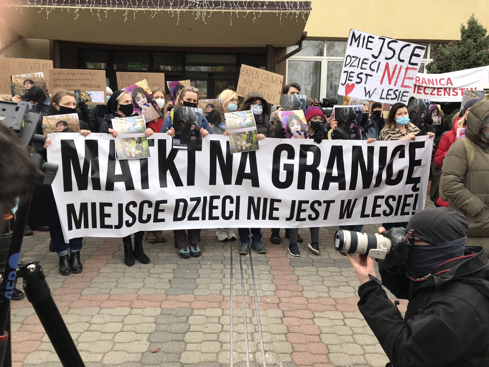

### Weekend Digest 20–21/11/2021: Seventy\-five lives lost at sea
#### Last week and over the weekend, over 75 people lost their lives in the Mediterranean Sea // Many others were rescued // Libyan Coast Guards threaten rescue crew during operation // Crete: Seventy people rescued from distress // Updates from the Belarusian border

Polish people protesting against the situation along the border\. Copyright: Sara Cincurova
#### Feature: Many lives lost in the Mediterranean

This week, at least 75 people lost their lives in the Mediterranean Sea\. As stated by UNHCR spokeswoman Safa Msehli on Saturday, the shipwreck occurred on Wednesday\. Fifteen survivors were rescued in time by local fishermen\. Their friends, family members and travel companions would still be alive if their lives were of any value to European politicians\.

■■■■■■■■■■■■■■ 
> **[Safa Msehli](https://twitter.com/msehlisafa) @ Twitter Says:** 

> > ‼️ A shipwreck off #Libya on Wednesday claimed at least 75 lives, according to 15 survivors rescued by fishermen off Zwara.
 
This is the cost of inaction. 

At least 1,300 men, women and children drowned attempting to cross the Central #Mediterranean this year. https://t.co/ysKOMADm08 

> **Tweeted at [2021-11-20 13:16:10](https://twitter.com/msehlisafa/status/1462047113559302146).** 

■■■■■■■■■■■■■■ 

Thanks to civilian rescue efforts, 375 people were rescued from distress by the Sea Watch4, in six different operations between Thursday and Sunday:

■■■■■■■■■■■■■■ 
> **[Sea-Watch International](https://twitter.com/seawatch_intl) @ Twitter Says:** 

> > After the 6th rescue, there are 375 guests on the decks of the #SeaWatch4. 120 people had been rescued by our crew on Thursday. Yesterday and today 255 people were taken on board in 4 further operations. https://t.co/PcsYwgRMqQ 

> **Tweeted at [2021-11-21 18:21:48](https://twitter.com/seawatch_intl/status/1462486420136759299).** 

■■■■■■■■■■■■■■ 

During one of the rescue operations, the Sea Watch4 had a dangerous encounter with the so\-called Libyan Coast Guards\. In audio material published by Sea Watch, one can hear the Libyans talking to them via radio, warning them to get back or otherwise they will be taken to Libya or shot at the civilian rescue ship\.

> “Clear right now, otherwise we will take you back with us to Libya\. You know the rules of Libya\. Is that clear to you? Leave right now\. 

> Libyan Coast Guards to Sea Watch4 crew via radio 

■■■■■■■■■■■■■■ 
> **[Sea-Watch](https://twitter.com/seawatchcrew) @ Twitter Says:** 

> > "Stop your engine. This is Libyan Navy, we will shoot you."

Die sogenannte Libysche Küstenwache drohte gestern wiederholt damit, auf die #SeaWatch4 zu schießen.

Zudem forderte das Patrouillenboot uns rechtswidrig auf, das Einsatzgebiet zu verlassen. https://t.co/9AxNA3EjDn 

> **Tweeted at [2021-11-19 16:01:27](https://twitter.com/seawatchcrew/status/1461726321877426178).** 

■■■■■■■■■■■■■■ 

The MSF ship Geo Barens was allowed to disembark 186 people who were rescued during the week in three different operations\. On board the rescue ship were also the bodies of 10 person who died on the wooden boat with with they tried to reach Europe\.

■■■■■■■■■■■■■■ 
> **[MSF Sea](https://twitter.com/MSF_Sea) @ Twitter Says:** 

> > Disembarkation is over and the 186 survivors are now safely onshore. These people need assistance to recover safely. They all must be given safe shelter and provided with medical and psychosocial services.
📸© @[vynguyenhoang](https://twitter.com/vynguyenhoang) https://t.co/4AVPJR6GZq 

> **Tweeted at [2021-11-20 08:17:52](https://twitter.com/msf_sea/status/1461972045777055745).** 

■■■■■■■■■■■■■■ 

Meanwhile, according to Alarm Phone, one boat with around 60 people and another one with 90 people on board are currently in distress within the Maltese search\-and\-rescue zone\. The boats are both adrift as the engine broke down or they are out of fuel\. They must be rescued by Maltese authorities now\.

■■■■■■■■■■■■■■ 
> **[Alarm Phone](https://twitter.com/alarm_phone) @ Twitter Says:** 

> > 🆘 ~90 people in danger! We were alerted by a boat in distress with 90 people in Maltese SAR zone. There are 9 women, 4 of them pregnant, and 17 children on board. The boat is drifting, the engine is off. The people are urgently asking for help! #RescueNow! https://t.co/50GQ6niW76 

> **Tweeted at [2021-11-21 16:17:48](https://twitter.com/alarm_phone/status/1462455212183011335).** 

■■■■■■■■■■■■■■ 

Over the weekend, also on the route to the Canary Islands, at least two people died while 34 were rescued by Salvamento Marítimo, the Spanish Coast Guards, [according to local media](https://vivagalicia.tv/galicia/1009707/fallecen-2-migrantes-de-una-patera-rescatada-con-34-personas-al-suroeste-de-gran-canaria/?fbclid=IwAR3hTaiGa2yvfo4caY3DMmkwAX4Qx9AlzO1e-mPBAqqUHZZ-Ut4V_4pe_IU) \.

In the Straits of Gibraltar, a boat with four people on board went missing on Friday\. [A helicopter was sent to find the boat, but returned with empty hands at dusk\.](https://www.europasur.es/campo-de-gibraltar/Salvamento-Maritimo-desaparecidos-trafalgar-levante-temporal_0_1630638935.html)
#### LIBYA

In the city of Tripoli in Libya, hundreds of people are still stranded in front of the UNHCR Community Day Center\. They came here in search of safety after a massive crackdown on people on the move by Libyan security forces at the beginning of October\. Thousands were arrested and brought to infamous detention centers\. A large group managed to flee, and gathered in front of the UNHCR center as the only place from where they would expect support and a minimum of security\. However, despite continuing protests and efforts at negotiation with the UNHCR team, no lasting solution has been found so far\. Hundreds of people have been sleeping rough for more than five weeks, among them many children\.

■■■■■■■■■■■■■■ 
> **[Son Dar Fur](https://twitter.com/Shiekhdarfur) @ Twitter Says:** 

> > 50 days in the streets in the absence of @[UnicefLibya](https://twitter.com/UnicefLibya) to provide some psychological support to the children..in their absence from the scene of the accident..most of these children study in their schools
   Don't they deserve some attention?@[UNHCRLibya](https://twitter.com/UNHCRLibya) #EVACUATEREFUGEESFROMLIBYA https://t.co/K6P6XCG1ho 

> **Tweeted at [2021-11-20 15:30:46](https://twitter.com/shiekhdarfur/status/1462080990688415750).** 

■■■■■■■■■■■■■■ 

#### GREECE
#### Boat with 70 people in distress off Crete

According to Alarm Phone, a boat carrying 70 people was in distress near Crete\. Apparently the people were later rescued by cargo ships, but one person remained missing\.

■■■■■■■■■■■■■■ 
> **[Alarm Phone](https://twitter.com/alarm_phone) @ Twitter Says:** 

> > ⚠️ SOS in the #Aegean! A sailing boat carrying 70 people is in distress near #Crete. We informed @[HCoastGuard](https://twitter.com/HCoastGuard) about the situation. There are high waves and the engine is broken - a rescue operation is urgently needed!

#Dontletthemdrown https://t.co/TQRdAbfs9h 

> **Tweeted at [2021-11-20 21:52:23](https://twitter.com/alarm_phone/status/1462177026916421636).** 

■■■■■■■■■■■■■■ 

It was later reported by local media that the people were transferred to Paleochora, south\-western Crete\.
#### More units deployed in Evros border region

The researcher Lena Karamanidou reported that according to local news, another unit will be deployed in the Evros border region with Bulgaria\. Three units are stationed there already\. As there are countless reports of pushbacks in the border region, the deployment raises serious questions about what will be the task of the soldiers\. The effects are in turn already clear: People will try to take even more dangerous routes in order to avoid being pushed back\.

■■■■■■■■■■■■■■ 
> **[Lena K.](https://twitter.com/lk2015r) @ Twitter Says:** 

> > Update: [Evros-news.gr](http://Evros-news.gr) now reports, again based on info from villagers, that a special forces unit will be deployed at the village of Megalo Dereio, near the 🇬🇷🇧🇬 border in #Evros. There are reportedly 3 units in the area already, 2 stationed in Soufli and 1 at Ormenio. 

> **Tweeted at [2021-11-20 12:23:29](https://twitter.com/lk2015r/status/1462033857130254337).** 

■■■■■■■■■■■■■■ 

A group of people who arrive on Lesvos send a message to UNHCR, hoping this will prevent them from being pushed back by Greek servicemen\. It is unclear where they are at the moment\.

■■■■■■■■■■■■■■ 
> **[Panayote Dimitras](https://twitter.com/PDimitras) @ Twitter Says:** 

> > These people sent this to @[UNHCRGreece](https://twitter.com/UNHCRGreece) but received no reply @[Refugees](https://twitter.com/Refugees) @[unhcr](https://twitter.com/unhcr) https://t.co/pC3bJyswMf 

> **Tweeted at [2021-11-20 12:36:30](https://twitter.com/pdimitras/status/1462037135050092552).** 

■■■■■■■■■■■■■■ 

#### CROATIA
#### Reactions to the judgement of the ECtHR on the death of Madina Hussiny

> “The European Court of Human Rights has confirmed that Croatia illegally expels people\. The judgement in the case of young Madina Hussiny who died during such an expulsion in 2017 is a shame not only for the Ministry of the Interior or the police, but for the whole of Croatia, all of us, its citizens, and especially for the Government\.” 

Are you Syrious? and the Centre for Peace Studies are calling for those responsible for the child to be dismissed\.

#### BELARUS

Here are insights and updates on the situation along the Belarusian border\. According to Polish civil organization Grupa Granica, the restricted zone along the Polish border remains in place\. In the zone, access is forbidden to journalists, medical personnel, lawyers and activists\. It once again becomes obvious how much states who break the law hate solidarity efforts and being monitored for their actions:

■■■■■■■■■■■■■■ 
> **[Marta Górczyńska](https://twitter.com/MarGorczynska) @ Twitter Says:** 

> > Civil rights are being more and more restricted in the #border area. Journalists are brutally searched, activists harassed and independent international observers stopped from entering the areas even outside of the restricted zone! #PolishBorderCrisis 

> **Tweeted at [2021-11-20 13:37:24](https://twitter.com/margorczynska/status/1462052458511966217).** 

■■■■■■■■■■■■■■ 

Meanwhile, British soldiers arrived on the Polish side of the border to support the Polish border work of pushing people back\.

■■■■■■■■■■■■■■ 
> **[Lena K.](https://twitter.com/lk2015r) @ Twitter Says:** 

> > Armies against people. Also a European value. 

> **Tweeted at [2021-11-20 13:03:28](https://twitter.com/lk2015r/status/1462043921010380821).** 

■■■■■■■■■■■■■■ 

[According to media articles](https://www.theguardian.com/world/2021/nov/20/poland-says-belarus-changed-tactics-border-crisis-migrants?fbclid=IwAR2lVMb6CmAtvSt3yd20mNtbtVh3NBOpvyTEGmb-iMDSFbC5iXQPQt296vQ) , Belarusian authorities changed their tactics over the weekend: Instead of pushing big groups of people towards the border, sometimes by force, they now direct smaller groups to various spots along the border\. Polish defense minister Mariusz Błaszczak expects this situation to last for some months\.

This article provides a good overview on what happens to people who are pushed back along the border and explains how and why these pushbacks are illegal:

Alarm Phone, one of the most important responders for people in distress at the various hotspots of the European border regime, received an emergency call from a group of 12 people stuck at the border, amongst them one person with heart problems:

■■■■■■■■■■■■■■ 
> **[Alarm Phone](https://twitter.com/alarm_phone) @ Twitter Says:** 

> > 🆘SOS at the Border between #Belarus and #Poland. We have been alerted to a group of 12 people stuck on the Belarusian side in the Białowieża Forest. They have no water and food and at least one person is sick, having heart problems. They need immediate medical assistance! 

> **Tweeted at [2021-11-20 21:38:08](https://twitter.com/alarm_phone/status/1462173439217782794).** 

■■■■■■■■■■■■■■ 

[This podcast \(in German\)](https://www.medico.de/push-back-europa-18439) speaks about the situation at the border with an activist from Grupa Garnica and the jouranlist, Franziska Grillmeier\.

■■■■■■■■■■■■■■ 
> **[Sara Cincurova](https://twitter.com/Sara_Cincurova) @ Twitter Says:** 

> > A few mins ago in #Hajnowka: the group 'Mothers at the border' and Polish citizens protesting against the fact that refugee children die in the woods, only a day after a 1year old baby was found dead at the border of #Belarus and #Poland https://t.co/WVGL2lHO8v 

> **Tweeted at [2021-11-20 14:43:15](https://twitter.com/sara_cincurova/status/1462069032568426496).** 

■■■■■■■■■■■■■■ 

This thread collects clips from different media on the conduct of police towards refugees but also journalists on the Polish side of the border\.

■■■■■■■■■■■■■■ 
> **[Halla Mohieddeen](https://twitter.com/hallamohieddeen) @ Twitter Says:** 

> > “I’m a man, I’m not an animal”

These are the people Poland is “defending” the EU border against. Suffering from exposure, seeking asylum and distraught. 

This is also why Poland has kept the media out. So we can’t show you the desperation of those trying to reach safety https://t.co/DKWKACJEfE 

> **Tweeted at [2021-11-21 07:20:52](https://twitter.com/hallamohieddeen/status/1462320088682541060).** 

■■■■■■■■■■■■■■ 

#### FRANCE
#### Volunteers needed in Paris\!

Solidarité Migrants Wilson is looking for volunteers to support food distribution in Paris\. Please consider joining them, if you can\!

#### WORTH WATCHING

Borderline Europe’s discussion on systematic criminalization of people for steering boats can be rewatched here\.

■■■■■■■■■■■■■■ 
> **[borderline-europe](https://twitter.com/BorderlineEurop) @ Twitter Says:** 

> > Last night, we discussed  the systematic criminalization of people for steering the boat together with @[DimitrisChoulis](https://twitter.com/DimitrisChoulis) from Samos, @[arciporcorosso](https://twitter.com/arciporcorosso) Sicily, @[alarm_phone](https://twitter.com/alarm_phone), @[IuventaCrew](https://twitter.com/IuventaCrew) and Eric from @[wellcomeunited](https://twitter.com/wellcomeunited).

📺You can watch the full discussion here: [bit.ly/3oL64hb](https://bit.ly/3oL64hb) https://t.co/08f4ce6m90 

> **Tweeted at [2021-11-21 13:51:27](https://twitter.com/borderlineeurop/status/1462418382045732864).** 

■■■■■■■■■■■■■■ 

**Find daily updates and special reports on our [Medium page](https://medium.com/are-you-syrious) \.**

**If you wish to contribute, either by writing a report or a story, or by joining the info gathering team, please let us know\.**

**We strive to echo correct news from the ground through collaboration and fairness\. Every effort has been made to credit organisations and individuals with regard to the supply of information, video, and photo material \(in cases where the source wanted to be accredited\) \. Please notify us regarding corrections\.**

**If there’s anything you want to share or comment, contact us through Facebook, Twitter or write to: areyousyrious@gmail\.com**

_Converted [Medium Post](https://medium.com/are-you-syrious/weekend-digest-20-21-11-2021-75-lives-lost-in-the-sea-89d200b2d2f6) by [ZMediumToMarkdown](https://github.com/ZhgChgLi/ZMediumToMarkdown)._
