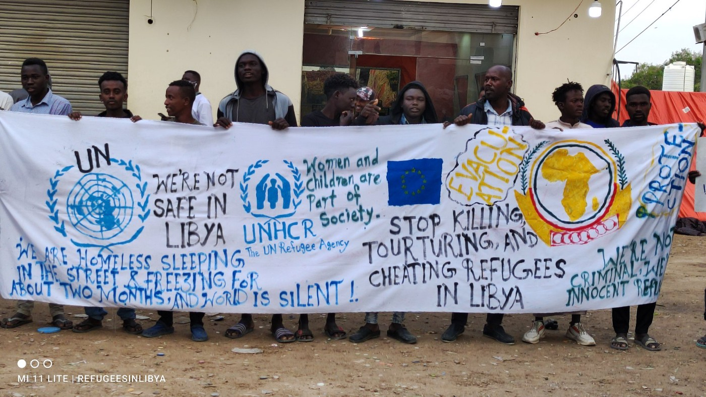
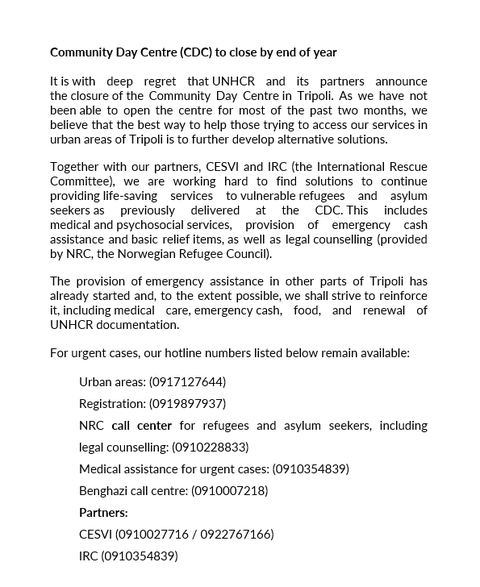
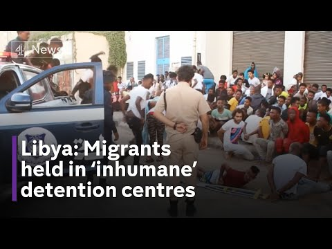
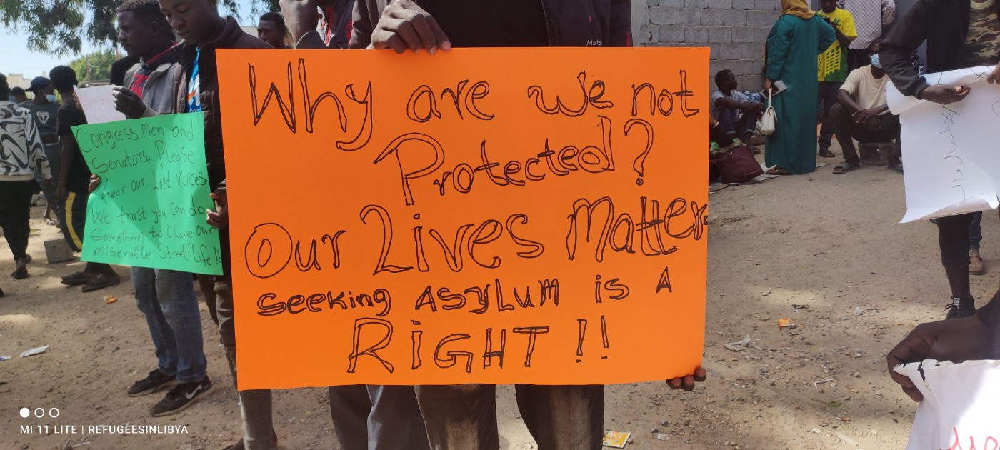

### AYS Special from Libya: Protests in Tripoli against a system made “to cause suffering”
#### In Libya’s capital, thousands of people on the move are stranded in front of a UNHCR Centre with nowhere to go\. For almost two months now, the UN’s principal mechanism for the concerns of refugees has been unwilling or unable to provide them with basic support\. While the international community offers no alternative to the EU\-backed Libyan detention system, a new political movement of people on the move arises: those who have been subject to torture and detention for years are now organising to make their voices heard\. As “ _Refugees in Libya”_ , they mobilise, claim their rights, and refute the narratives that have been put forward about them\.

Day 43 of the protests in front of the UNHCR Community Day Center in Tripoli\. \(Copyright: Refugees in Libya\)

> “Jean Paul, tell the world that you can not protect the 42 thousand refugees and asylum seekers registered with your office\!” 

[These words](https://www.refugeesinlibya.org/post/day-of-protest-33) from Yambio David Oliver Yasona show the frustration over the discrepancy between what UNHCR should stand for and what it actually means for people on the move in Libya’s capital Tripoli\. Yasona, from South Sudan, took part in a meeting with UNHCR Chief of Mission in Libya, Jean Paul Cavalieri on October 31, to discuss the situation of about 3000 people who are currently camping and protesting in front of the agency’s Community Day Centre\. Since the beginning of October, thousands are stranded there, sleeping on the street, with nowhere else to go and in constant fear of being arrested again\. Almost no support has been provided to them, neither by UNHCR nor by other organisations\.

The situation is critical: up until today, one young person died after being hit by a car and another one died after being attacked by unknown perpetrators\. A journalist who wanted to report on the situation disappeared, 3 people were injured in a clash with UNHCR security staff and one person was stabbed in the leg by an aggressive neighbour, according to protesters\. Pictures show the person’s leg covered in blood and wrapped with a piece of barrier tape to stop the bleeding\. [Latest videos posted by the protesters show armed men, supposedly UNHCR hired security staff, in front of the building, attacking protesters\.](https://twitter.com/RefugeesinLibya/status/1467419035751047169) The situation remains unchanged in its precariousness after almost two months\. There is little hope for change, as the international community turns a blind eye\.

As we write we’ve learnt that UNHCR announced in an statement the [permanent closure](https://www.facebook.com/UNHCRLibyaInfo/posts/116486877527494) of the Community Day Centre by the end of the year\. Already in October UNHCR had temporary suspended the centre’s activity following the first days of protest\. For the thousands of people gathered outside, the little protection they ascribed to the UN Flag on top of the building will be gone, and they fear, once again, getting caught in the hands of militias\.

The situation is strained to say the least, but the people in front of the building organise and raise their voices to challenge the inaction of UNHCR, the complete silence of the international community including the African Union, as well as the EU’s discreet complicity in their fate\. They mobilise and protest day after day, demanding to be treated with basic human dignity: evacuation from the country, an end to the EU’s support of the so\-called Libyan Coast Guards \(LCG\) and for their fellows to be released from detention centres\. By creating their own means of communication through a [twitter account](https://twitter.com/RefugeesinLibya) and a [website](https://www.refugeesinlibya.org/) where they publish updates, transcripts of meetings and open letters, and where they start to tell their own stories themselves\.

■■■■■■■■■■■■■■ 
> **[Refugees In Libya](https://twitter.com/RefugeesinLibya) @ Twitter Says:** 

> > 💔💔💔💔💔
How hard and how long can the world ignore this situation? 
@[hrw](https://twitter.com/hrw) @[JFCrisp](https://twitter.com/JFCrisp) @[Refugees](https://twitter.com/Refugees) @[UNHCRItalia](https://twitter.com/UNHCRItalia) @[EU_Commission](https://twitter.com/EU_Commission) @[UNHCRCanada](https://twitter.com/UNHCRCanada) @[freeiiritria](https://twitter.com/freeiiritria) @[alarm_phone](https://twitter.com/alarm_phone) @[Sarita_Libre](https://twitter.com/Sarita_Libre) @[CaroRackete](https://twitter.com/CaroRackete) https://t.co/HuSOySfV2X 

> **Tweeted at [2021-12-02 08:36:36](https://twitter.com/refugeesinlibya/status/1466325412502548489).** 

■■■■■■■■■■■■■■ 

#### The situation of people on the move in Libya

The situation for people in the move in Libya has been horrendous for years\. Countless survivors spoke about their traumatic experiences with the LCG, of horrible conditions in detention centres, of torture and forced prostitution at the hands of traffickers\. For years, human rights watchdogs have constantly warned about the situation\.

[IOM describes 600,000 people as migrants in Libya\.](https://dtm.iom.int/reports/libya-%E2%80%94-migrant-report-36-march-april-2021) Many of them came to work there, as Libya’s labor market — despite a civil war––still offers better prospects than that of many other countries\. For a much smaller number of people, Libya is supposed to be a stopover before embarking on the dangerous journey to Europe, in hope of a more stable and secure life\. In both cases people have fled difficult and/or dangerous situations at home but, especially for those who plan to leave the continent, Libya often turns into a hellish maze with no way out\. A Fact Finding Mission of the UN \(October 2021\) [established](https://migrantsatsea.org/2021/10/05/report-of-the-independent-fact-finding-mission-on-libya-to-the-human-rights-council-grounds-to-believe-that-acts-of-murder-enslavement-torture-rape-and-other-inhumane-acts-have-been-committ/) that

> “from the moment that migrants enter Libya destined for Europe, they are systematically subjected to a litany of abuses”\. 

#### No protection or legal status

Libyan law does not foresee any kind of asylum protection as required by the [1951 Refugee Convention](https://www.unhcr.org/1951-refugee-convention.html) \. Libya is not a signatory of the Convention which defines who is entitled refugee status and what legal obligations authorities have towards them\. As a result, people in need of international protection do not have any chance to get a legal status\. Instead, any irregular entry, stay, or exit of people in/from the country is against the law, effectively making the whole existence of people on the move illegal\. From the moment they enter Libya, they find themselves in a constant state of insecurity and fear of being detained in the infamous detention centres at any moment\.

For many, the cycle of violence begins in the moment the LCG intercepts the boat that was taking them towards Europe\. [Trained, equipped and supported by the](https://www.amnesty.org/en/latest/news/2020/01/libya-renewal-of-migration-deal-confirms-italys-complicity-in-torture-of-migrants-and-refugees/) EU and [working in cooperation with Frontex,](https://www.spiegel.de/international/europe/libya-how-frontex-helps-haul-migrants-back-to-libyan-torture-camps-a-d62c3960-ece2-499b-8a3f-1ede2eaefb83) the LCG try to make sure no one leaves the country: either by bringing people back or by delaying rescue and provoking their death\.
- **_For an excellent interactive article on the European approach in stopping migration from Libya, see here:_**

- **_For a long\-read article on how the EU created and upholds the system of interception and detention, see here:_**

Back on Libyan soil, people are transferred to detention centres run by the Department for Combatting Illegal Migration \(DCIM\) \. However, “run by a state department” is as misleading, as much as the term “Libyan Coast Guards“\. Sounding official, they suggest some basic standard of institutionalisation and rule of law\. Instead, both those who run the camps and those who make up the LCG are members of militias and gangs; they are traffickers and state actors at the same time\.

So far in 2021, about 30,990 people were [intercepted](https://twitter.com/IOM_Libya/status/1465340518318153729) by the LCG and returned to Libya\. While UNHCR, IOM and partners are often at the place of disembarkation to provide medical aid and basic food supplies, they only have very limited access to the detention centres and are unable to prevent people from being transferred there\.

#### Conditions in detention centres “calculated to cause suffering”

According to the already mentioned UN Fact Finding Mission’s [report](https://migrantsatsea.org/2021/10/05/report-of-the-independent-fact-finding-mission-on-libya-to-the-human-rights-council-grounds-to-believe-that-acts-of-murder-enslavement-torture-rape-and-other-inhumane-acts-have-been-committ/) , people imprisoned in Libyan centres:

> “are detained for indefinite periods without an opportunity to have the legality of their detention reviewed, and the only practicable means of escape is by paying large sums of money to the guards or engaging in forced labour or sexual favours inside or outside the detention centre for the benefit of private individuals\.” 

Currently, there are some 7,000 people in these detention centres\. The UN report describes the conditions as

> “ **calculated to cause suffering”** \. 

The report carries on, documenting the pattern of interception\-return\-detention,

> and the desire to utilise any means of escape, including by paying large sums of money to militias, criminal gangs, traffickers and smugglers who have links to the State and profit from this practice\.” 

In Libya, in a complete absence of accountability, people on the move have become a commodity, worth nothing but the money that can be squeezed out of them through inhuman treatment, torture, slavery, and forced prostitution\. The State is one of the main actors in this dark plot\. The UN report notes that these crimes are far from isolated, but

> “form part of a systematic and widespread attack directed at this population, in furtherance of a State policy\. As such, these acts may amount to **crimes against humanity** \.” 

#### **What is the UNHCR’s role in all this?**

The situation of UNHCR is anything but easy under these circumstances\. Where states are unable or unwilling to protect refugees, the agency tries to fill this gap by providing direct support for those under its mandate\.

Since there is no framework agreement in place between Libya and UNHCR, the agency’s options are very limited\. One aspect of its work is to try to register asylum\-seekers, and eventually determine their status, even though this is of little help for the people themselves\. All those registered as asylum\-seekers are handed out a certificate, stating that they are persons of concern to UNHCR Libya\. They are then eligible to basic legal support, medical care, sometimes cash assistance and counselling provided by UNHCR and its partners\. However, these certificate don’t protect people from being arrested, because Libyan authorities and those running the detention centres refuse to acknowledge their validity\. Many of those detained are indeed people of concern to UNHCR\.

Being recognised as a refugee by UNHCR is also of little help\. Options for resettlement and humanitarian visas are so limited that only a very small number of ‘extremely vulnerable’ people have a chance to even be considered\. At the moment, about 40,000 people are registered as asylum\-seekers with UNHCR and about 4,000 are recognised as refugees\. So far in 2021, 224 people were resettled to other countries\.
#### **Raids at the beginning of October**

This cycle of violence has been in place for years, as well as the lack of options for those caught in it\. Nonetheless, at the beginning of October, the Libyan Ministry of Interior went one step further\.

On the 1st of October, in a crackdown in the neighbourhood of Gargaresh, an area where many people on the move live in often precarious conditions, homes were demolished and thousands of people were arrested, all under the pretence of fighting drugs and prostitution\. Videos show servicemen carrying heavy arms and wearing balaclavas, while arrested people are lying on the ground, face to the earth, their hands shackled with cable ties behind their backs\. About 5,000 people were forcibly taken to detention centres, amongst them hundreds of children\. At least one person died during the arrests\.

[According to IOM](https://migration.iom.int/reports/libya-%E2%80%94-hai-alandalus-flash-update-03-october-2021) , they were taken to extremely overcrowded detention centres with no access to drinking water or toilet facilities, with no medical care, no separate space for women and children, no mattresses or blankets, and basically no food supply\. Al Mabani, one of the notorious centres, was four times over its capacity\. Nevertheless, the Libyan Ministry of Interior proudly described its ‘security campaign’ as a [success](https://www.facebook.com/288193584610674/posts/4374877572608901/?d=n) :

■■■■■■■■■■■■■■ 
> **[وزارة الداخلية - ليبيا](https://twitter.com/moigovly) @ Twitter Says:** 

> > تابعت إدارة العلاقات والتعاون بوزارة الداخلية الحملة الأمنية التي باشرت الأجهزة الأمنية في تنفيذها منذ فجر اليوم الجمعة 1 أكتوبر بإشراف مباشر من السيد معالي وزير الداخلية.

[facebook.com/28819358461067…](https://www.facebook.com/288193584610674/posts/4375426259220699/) https://t.co/Lh6JLwd2OZ 

> **Tweeted at [2021-10-01 21:37:01](https://twitter.com/moigovly/status/1444053763501744128).** 

■■■■■■■■■■■■■■ 

[Videos](https://twitter.com/semharnay/status/1444763256715894786) circulating on Social Media from within Al Mabani detention centre show a hall packed with people, skin to skin, one person lying unconscious, another person with blood tripping from their face, the sound of someone hammering at a metal door\.

[A country coordinator of IRC](https://www.rescue.org/press-release/irc-calls-immediate-release-over-5000-migrants-and-refugees-detained-week-dangerous) , an organisation that works closely with UNHCR and has occasional access to detention centres, said:

> “Our teams have heard reports of people being forced to use the floor on which they sleep as a toilet because they are not being allowed to access the latrines outside their cells\.” 

Similar accounts are heard from survivors, and the New Yorker article mentioned above contains detailed descriptions of Al Mabani detention centre\.
#### **Breakout**

For about 3,000 people, the detention did not last for long on this occasion\. On the 8th of October, people started rioting in Al Mabani detention centre against their imprisonment\. Eventually they managed to flee the centre in large numbers\. While most sources speak of a breakout, some said people were released when it became obvious that the centre was unable to feed them\. Dramatically confirming the first version, it was reported that at least people were shot dead during these events\. [IOM said in a statement:](https://www.iom.int/news/iom-condemns-killing-six-migrants-detention-centre-tripoli)

> “Some of our staff who witnessed this incident describe injured migrants in a pool of blood lying on the ground\. We are devastated by this tragic loss of life\.” 

In some videos of fleeing people, gunshots can be heard\.

■■■■■■■■■■■■■■ 
> **[Kaka Fur](https://twitter.com/KakaFurAndi) @ Twitter Says:** 

> > Thousands of people managed to escape today from the Lager prison of Al Mabani in Tripoli where they were held in inhuman conditions from last Friday. The Libyan authorities shot refugees, seems to kill and injuring many people. According to local sources, https://t.co/nztCFxHQ88 

> **Tweeted at [2021-10-08 19:26:20](https://twitter.com/kakafurandi/status/1446557592742989854).** 

■■■■■■■■■■■■■■ 

In fear of being arrested again, those who escaped turned to the one place where they could hope for minimal support and attention of the international community: The UNCHR Community Day Centre in Tripoli\.

#### **At the UNHCR Community Day Centre — seven weeks and counting**

This happened more than seven weeks ago\. Since then, people in front of the building, at times around 3000, continuously protest and ask for their evacuation\. They hold up posters in four different languages, calling on UNCHR for evacuation and on the international community to at last recognise their situation\.

Meanwhile, they continue to live in precarious conditions: videos posted by the protesters show rows of people sleeping on the ground at the side of a busy road, covered in light blankets or gathered around a diminishing fire\. According to one of the protesters, the people in front of the building lack blankets and tents\. As there is no toilet infrastructure, they are forced to relieve themselves at the roadside\. They struggle with flu and cold, have not enough drinking water and go hungry\. Their trust in UNHCR has been erased\.

■■■■■■■■■■■■■■ 
> **[Refugees In Libya](https://twitter.com/RefugeesinLibya) @ Twitter Says:** 

> > These are the refugees that @[UNHCRLibya](https://twitter.com/UNHCRLibya) doesn't recognize as vulnerable persons.For 35 horrible days they says they can't help but tells propaganda that these refugees are armed and uses violence
#EVACUATEREFUGEESFROMLIBYA @[hrw](https://twitter.com/hrw) @[RescueMed](https://twitter.com/RescueMed) @[KitchaFitFit1](https://twitter.com/KitchaFitFit1) @[cochetel](https://twitter.com/cochetel) @[_AfricanUnion](https://twitter.com/_AfricanUnion) https://t.co/ZLjNqRfyc5 

> **Tweeted at [2021-11-04 19:02:36](https://twitter.com/refugeesinlibya/status/1456336093192888323).** 

■■■■■■■■■■■■■■ 

They don’t feel safe to leave and and to find a place to stay in the city, as a fresh crackdown could happen at every moment\. But even if they would, it would be quite unlikely to for them to find a place to stay, as landlords are reluctant to rent places to non\-nationals, and if they do, they charge them extortionate prices\. In an answer letter to the researcher Jeff Crisps, UNHCR states that they “currently have no alternative housing for the thousands of asylum seekers and refugees stranded in Libya\.“

■■■■■■■■■■■■■■ 
> **[Jeff Crisp](https://twitter.com/JFCrisp) @ Twitter Says:** 

> > UNHCR responds to questions about the refugee situation in Libya.
Here's an unedited and pre-publication transcript of an interview I've undertaken with UNHCR on this issue:
[scribd.com/document/53722…](https://www.scribd.com/document/537221011/CrispUNHCRLibya-1) https://t.co/g6pKG6yBOc 

> **Tweeted at [2021-11-04 17:21:47](https://twitter.com/jfcrisp/status/1456310722212896775).** 

■■■■■■■■■■■■■■ 

The activities at the Community Day Centre are suspended, with UNHCR blaming “large protests continuing outside and preventing vulnerable asylum\-seekers and refugees from accessing services”\. In early November, UNHCR published a statement deploring violence and accusing the protesters of jeopardising the evacuation of extremely vulnerable people\. In response, Refugees in Libya published counter statements, denouncing UNHCR’s inability to support them\.

When UNHCR celebrated the release of 57 people from Ain Zaira Detention Centre on twitter, they [highlighted](https://www.refugeesinlibya.org/post/the-deception-used-on-victims-by-the-unhcr-in-libya) that even for those deemed ‘extremely vulnerable’, no alternative accommodation was found and they ended up in front of the UNHCR building just like the others\.

In their [Manifesto](https://www.refugeesinlibya.org/about) , protesters demand:

> 1\. Evacuations to lands of safety where our rights will be protected and respected\. 

> 2\. Justice and equality among refugees and asylum seekers who are registered with the UNHCR in Libya\. 

> 3\. The abolishment of funding the Libyan coast guards who have constantly and forcibly intercepted refugees fleeing the Libyan hell and brought them to Libya where all atrocities befalls them\. 

> 4\. The closure of all detention centers across Libya, which are fully funded by the Italian and European union authorities\. 

> 5\. The authorities should bring the perpetrators to justice who have shot and killed our brothers and sisters both in and out of the detention centers\. 

> 6\. The Libyan authorities to stop arbitrarily detaining persons of concern to the office of UNHCR\. 

> 7\. To call on Libya to sign and ratify the constitution of the 1951 Genève Refugee convention\. 

They expressed their solidarity with those People on the Move prevented from applying for asylum in Poland\.

The [UN Refugee Agency](https://medium.com/u/75f2bdd89854) would do good in following the words of Yambio David Oliver Yasona, the protester cited in the beginning: “Tell the world that it actually can’t protect the people under its mandate in Libya\.” It should side with the protesters and finally denounce who is actually jeopardising the protection of people on the move, not only but especially in Libya: The European Union and its disgraceful border regime\. As long as the EU continues its support for the Libyan detention system, the situation won’t change for the better\.

UNHCR could actually act as a mediator here\. It could use its position to put pressure on those states who disregard the human rights of thousands\. Instead, at least for now, the agency decides to remain paralysed, and positions itself against the people it was created to protect\.

**By AYS Info Team**

**Find daily updates and special reports on our [Medium page](https://medium.com/are-you-syrious) \.**

**If you wish to contribute, either by writing a report or a story, or by joining the info gathering team, please let us know\.**

**We strive to echo correct news from the ground through collaboration and fairness\. Every effort has been made to credit organisations and individuals with regard to the supply of information, video, and photo material \(in cases where the source wanted to be accredited\) \. Please notify us regarding corrections\.**

**If there’s anything you want to share or comment, contact us through Facebook, Twitter or write to: areyousyrious@gmail\.com**

_Converted [Medium Post](https://medium.com/are-you-syrious/special-from-libya-protests-in-tripoli-against-a-system-made-to-cause-suffering-77a6ce5ffc6) by [ZMediumToMarkdown](https://github.com/ZhgChgLi/ZMediumToMarkdown)._
