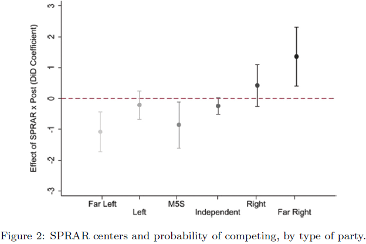

### AYS News Digest 13/12/21: 4 years after the infamous cake, ex Danish Minister jailed
#### Greek Ombudsman intervenes in the case of rejection of Refugee Support Aegean to register in the NGO registry / How the far right in Italy builds support in areas with refugee centres / updates from Belarus / recommended reads & more

](assets/f1c80210608a/0*xmq_1-hj3QBWdjdn)

“Unfortunately Santa did not pass from here the last 5 years…” — [Dr\. Apostolos Veizis](https://twitter.com/AVeizis)

In 2017, Danish Minister for Immigration and Integration, Inger Støjberg, celebrated the 50th tightening of Danish immigration law with the [controversial cake](https://www.thelocal.dk/20170315/danish-minister-in-controversial-cake-post/) \. Now, the Danish constitutional court sentenced her to 60 days in prison for illegal practices as Minister\. The [conviction](https://www.politico.eu/article/ex-danish-minister-inger-stojberg-convicted-asylum-policy/?fbclid=IwAR0AMCMLs-2bbDPj9hG_G-P5ruV8N5rEHcp-e60hhF4BvpL7mT3riA1qG6I) had only one dissenting opinion out of the total 26 judges, and the special court of impeachment \(a special part of the Supreme Court rarely used\) kept strictly to the legal aspects of the highly politicized case\.

> During her tenure she took a hard line on immigration and introduced dozens of restrictions\. Among them was an order in February 2016 that married refugees under 18 years old should not be accommodated with their spouse\.
 

> Stoejberg [ordered](https://l.facebook.com/l.php?u=https%3A%2F%2Fwww.bbc.com%2Fnews%2Fworld-europe-59636124%3Ffbclid%3DIwAR1MvJtUdvGigB3lrtnwPiWoHhH19UYOrAh0kwxcnryDc2WSPQ9K1sj2LwQ&h=AT0ToSK_O8Z6tJH92uD3nEdtyFQIKEJKl5zpSa_am-lkDoHFzfJ66Pk51fcKmkd2FkP1f1rezcojdeeuLhPKVs0da-bzN3CEU3uFEOughb2gua-50nZAb1xV8n7xJps9H7gLeatQ_sE9U80Bxg&__tn__=%2CmH-R&c[0]=AT2jyHaMw5IKhgKXHCubqOEcrAxIVhJw53jsD4xag-Ipmyi5t8Sek_j9Tk4ZXqgIaFvUPAn65vS3hXhF6BD_unBlCs8D_sEMe5kxN6F28MvYYoSr5RICvSI6Ykflqr3gHVdbhug1L2PX51f4bSdTpF6G9EkM1fqAKbwsM33oMXuNv80sK2I656ai_CJdrmML1De8-kM99w2jX9OV_cs) the separation of 23 married couples before the policy was dropped a few months later\. 

The former minister attempted to distract the core of the case — the illegal administration — with claims that she “wished to protect young girls forced into marriage with much older men “, but in the end, this smokescreen and purely political argument was not given any weight\.

However, Støjberg has a vast and faithful congregation of supporters, mainly from the far right of the political spectrum in Denmark\. Even if she faces losing her seat in the parliament \(Folketinget\), as a consequence of her conviction, she will most likely be eligible for running again in a coming general election, and with substantial chances of regaining her seat\.
Until today, Støjberg by many observers has been tipped to be the new leader of the populist Danish People’s Party \(Dansk Folkeparti\), but this remains doubtful after today\.
#### SEARCH AND RESCUE

[](https://l.facebook.com/l.php?u=https%3A%2F%2Fsea-watch.org%2Fen%2Fairborne-monthly-factsheet-september-2021%2F%3Ffbclid%3DIwAR1dZeO1TfauaV-TdY2mk8g8xomunyTFoGM4VbalVzenGUtnhUuHyAuCaZ0&h=AT2iIYD2iyGaDZ0ZRZtUdn9TozIDfnmDKtWSKcz2V0XEhTeSU7PUK59P44LCFFf4Dx8ZcbItP4q6-GrKytIFz46YUiaGt_hQfQS8Gr43F1D5C8nHP9v4Cy0VhsJripANn1idSU1_UlqD3kXNPw&__tn__=%2CmH-R&c[0]=AT1MFZ4_FEQV8QSlTrTDDnaLmSstgHMAN8VHSb8Ca3bSIOj8eA3GAsMLJw_3CkJvwBt8usqL8kQaogldGsdE3TgHPOBY5bP4QHR1a1Egv3LMMvqqkpusZfUyDu8ff2aV1PiHnn-81Nqs0X_TqpbOKG7rhgHUaC_d3YUDlMyxhTL8OmlfBEiYcsowUHrz7gP8bZ_conhsHBC2cSu-YHs)

■■■■■■■■■■■■■■ 
> **[MISSION LIFELINE](https://twitter.com/SEENOTRETTUNG) @ Twitter Says:** 

> > Nach einem Testflug konnten wir bei einer Flugstrecke von 50 km ein Gebiet von 100qkm abdecken &amp; 5000 Bilder machen. Die Drohne fliegt autonom nach einem programmiertem Flugmuster. Weitere Drohnentests mit @[srchwng](https://twitter.com/srchwng) &amp; @[SARAHSEENOTRET1](https://twitter.com/SARAHSEENOTRET1) von der #Marwa aus folgen. https://t.co/0YWBSh2eAB 

> **Tweeted at [2021-12-13 07:41:59](https://twitter.com/seenotrettung/status/1470297935212515330).** 

■■■■■■■■■■■■■■ 

#### GREECE

Greek Ombudsman intervenes in the case of rejection of Refugee Support Aegean to register in the NGO registry

> **The decision to reject the registration of a civil society organisation on the NGO Registry of your Ministry on account of the development of activity in support of persons under deportation and, due to — according to your assessment — contravention of Greek legislation, infringes the aforementioned acquis of international, EU and national law —** _the address stated_ 

Read more [here\.](https://rsaegean.org/en/ombudsman-calls-for-re-examination-of-rejection-of-rsas-registration-on-the-ngo-registry/?fbclid=IwAR11KOPoqQURWY0KkkabL5zXOfDm2FRwbuzFPz5K6BEpw8sg9ADpV6zeV_M)
### Getting more Orwellian by the day

“Border guarding saves lives,” Μigration and Asylum Minister Notis Mitarachi said on Monday, speaking at a special event of the European Affairs and Public Administration, Public Order and Justice parliamentary committees at the Conference on the Future of Europe\.

“The number of missing and dead migrants in 2021 \(28\) is a historic low compared to the previous five years and especially in 2016 when the losses were 436,” Mitarachi said adding that “it is our duty to protect human life and to dismantle the circuits of smugglers, who sacrifice lives in the name of illicit profit\.

This is the same trick their Croatian counterparts use each time an objective report proves their policies and practices go against everything the EU Human Rights documents and laws stand for — they come out with stories of policemen rescuing people, “saving” children from the rivers and such things\. 
The perception of the media and the public is, however, not so solid as a rock, so it’s always worth mentioning these are smoke and mirrors…
#### NORTH MACEDONIA

A van transporting 41 people was discovered by police in North Macedonia on Friday\. The people are reported to be from Cuba and India\.

Discoveries of people on the move traveling through North Macedonia have become less frequent after the authorities stepped up controls on the Greek\-North Macedonian border\. Last year, a barbed\-wire fence was erected on the border of North Macedonia and Serbia, [InfoMigrants reports](https://www.infomigrants.net/en/post/37161/41-migrants-discovered-in-van-in-north-macedonia?fbclid=IwAR2x0DCt8Tgp3vP2iKrCy0SUcqpWQu4j3QhfPAwevZDs013Ntqtb3upZ6kM) \.
#### CROATIA

■■■■■■■■■■■■■■ 
> **[ECRE](https://twitter.com/ecre) @ Twitter Says:** 

> > Last week, 🇭🇷's border monitoring mechanism reported police "carry out illegal deterrence (pushbacks)" at the border. 

Just days later, it was edited to read: "police carry out permissible deterrence [...]". 

@[CMSZagreb](https://twitter.com/CMSZagreb) are analysing the report &amp; fear a lack of independence 👇 

> **Tweeted at [2021-12-13 12:53:34](https://twitter.com/ecre/status/1470376349537869827).** 

■■■■■■■■■■■■■■ 

#### ITALY

■■■■■■■■■■■■■■ 
> **[Massimo Pulejo](https://twitter.com/massimo_pulejo) @ Twitter Says:** 

> > I study whether the opening of a refugee center in Italian municipalities helps explain the political investments of far-right parties, as measured by their decision to run a list of candidates to the municipal council. 2/6 

> **Tweeted at [2021-12-13 21:15:56](https://twitter.com/massimo_pulejo/status/1470502774664310787).** 

■■■■■■■■■■■■■■ 

The opening of refugee centers has generated backlash by certain segments of the population, which far\-right parties have tapped into\. Results show that this translated into a formal political investment on election day\.
So, the opening of a center increases the chances by 8\.5% that the far\-right competes, compared to the previous election\. There is also evidence that it may crowd out other lists, such as those of the 5\-Star Movement and the far left\. This is the conclusion of a study made by [Massimo Pulejo](https://twitter.com/massimo_pulejo) \.

> Overall, the paper shows how welcoming refugees may make immigration more salient in a context \(local elections\) where it usually is not\. This complements recent research on the effects of refugee centers on national elections’ outcomes\. 

#### FRANCE
### “We are in danger, we are all very afraid”

15 people of Albanian origin live in tents and barracks on the banks of the Garonne, in the Empalot district of Toulouse\. With the rise of the waters in recent days, they are worried and they ask to be urgently relocated\. There are children and elderly among them, the youngest at 5 years old, and the oldest is 70 years old\. They are all asylum seekers, as [reported\.](https://france3-regions.francetvinfo.fr/occitanie/haute-garonne/toulouse/toulouse-les-habitants-d-un-campement-de-fortune-menace-par-la-crue-de-la-garonne-demandent-a-etre-reloges-2375500.html)

Due to heavy rains, the level of the Garonne River rose sharply, disturbing the people in provisional lodging at the edge of the canal\. On Friday, December 10, police officers visited them\.

> They told us we had to leave because of the rising water, so we took blankets and clothes and left, but we had nowhere to go\. We were not offered a place to sleep, _says Mirela, who lives in the improvised camp\._ 

> Failing to relocate them, public institutions could at least take the trouble to inform them about the risks\. These people are afraid, they spend every night without knowing what will happen to them the next day\. — Utopia 56 

#### SPAIN
### Detention in Melilla

](assets/f1c80210608a/0*Gf2x0JM54_2vEDYn)

Photo: [**Solidary Wheels**](https://twitter.com/SolidaryW)

A boat arrived to Melilla in the morning with 16 people on board: 15 men and 1 woman\. They allegedly paid 400 € to reach European territory\. Now, they are detained without communication with relatives they have in the city, [**Solidary Wheels**](https://twitter.com/SolidaryW) reported\.

People on the ground have tried to approach newcomers to give them water, after they have been asked several times, but the police have forbidden it, reportedly even after identifying them\.

In the meantime, Spain prepares a new border model for Ceuta and Melilla\.
The Government assumes that tolerated smuggling will not return when Morocco reopens the steps and outlines an alternative socio\-economic and commercial plan for both cities, the [media report\.](https://l.facebook.com/l.php?u=https%3A%2F%2Felpais.com%2Fespana%2F2021-12-13%2Fespana-prepara-un-nuevo-modelo-fronterizo-para-ceuta-y-melilla.html%3Ffbclid%3DIwAR2bsnFgkIKjvKt60a9yrOo2kGlMVvkr72hdnU_qx75-ktMPvBY-A5ig1Cg&h=AT1O9IrLwM7JEqE3DJhN4_4lXLwo4OU_xlAx8WE3ELsHNSeViA3bg01_hlKhbbdklRwuh3aAsGVytKc6uSd48VtIhWGEWGff8TcjUdUMA7b0qYHRhJfopMhag49gx3Q9hvOvW7EH5hwpevYYqQ&__tn__=%2CmH-R&c[0]=AT3wYGYERgnQvEZPmwbjTJJBuUZHNqk5GRpNEgLFFKeUPqHB3JQtGfVtPWe-4VhxPvAisI9igH3Kt7TVJHsL4FWeJ7i4VK2vj0t7LFEEfzfkn8s97sRcqgh-QC8yLa9AgqQ_UJ50jrXWmgC1uGWhPhzgzKavJJ-0YmTbjb1v11Q4d-h93845N9v_cYD6R07PKhsa792-gDyCOLS8JGQ)
#### GENERAL

[_Football club Malmö FF becomes first sports club in Sweden to pledge commitment to support integration of refugees through work and sport opportunities_](https://www.unhcr.org/neu/72299-football-club-malmo-ff-becomes-first-sports-club-in-sweden-to-pledge-commitment-to-support-integration-of-refugees-through-work-and-sport-opportunities.html?fbclid=IwAR2wdXyBBzlDsnT82I2oH6X8VPU-L2NqLFfmyC7DnqZpg2CvOQxOaSroPjU)

### Events

On 10 December, more than 500 buildings in 117 countries turned green in solidarity with people on the move:

■■■■■■■■■■■■■■ 
> **[ECRE](https://twitter.com/ecre) @ Twitter Says:** 

> > On 10 Dec, 500+ buildings in 117 countries turned green in solidarity with people on the move.💚

The #HumanRightsDay  initiative was inspired by residents in 🇵🇱 who use green lights to signal that they can help people trapped in the cold border forests.💚
[bit.ly/3EPTUu9](https://bit.ly/3EPTUu9) https://t.co/149mUUNl1s 

> **Tweeted at [2021-12-13 09:51:29](https://twitter.com/ecre/status/1470330527014080519).** 

■■■■■■■■■■■■■■ 

Round table by Grupa Granica and others:

■■■■■■■■■■■■■■ 
> **[CMR_Warsaw](https://twitter.com/CMR_Warsaw) @ Twitter Says:** 

> > These 👆🏼, and many other topics will be discussed at the roundtable about Polish, Greek and the Balkan route border crises
🗓️ this Thursday, 16/12/2021, 15:00 CET
Registration is free and open for all, but register asap, as places are limited (8/10) [eventbrite.com/e/roundtable-p…](https://www.eventbrite.com/e/roundtable-polish-greek-and-the-balkan-border-crises-registration-223481578417?fbclid=IwAR1IcSfg-vMG92xgzeXvl3PzVGsOg-kFHz60xEnZeHyHYWEOsOeiamZeO70) 

> **Tweeted at [2021-12-13 14:48:24](https://twitter.com/cmr_warsaw/status/1470405247227027458).** 

■■■■■■■■■■■■■■ 

#### BELARUS

We had been strictly complying with the readmission deals with the EU\. So they should not accuse us in vain, said Lukashenko in his latest i [nterview](https://www.trtworld.com/europe/belarus-s-lukashenko-blames-refugee-crisis-on-us-eu-52586?fbclid=IwAR00HJ6AlmtreeckolrrXNYHnZltYkIJ2SVh7AQCPu8bGEHhsWPdn8TwD3s) , where he accuses the US for invading the countries people are fleeing from, as well as the EU for hypocrisy\.

The Czech Republic will hold off on sending up to 150 soldiers for now to help Poland protect its border with Belarus after the migrant situation stabilised, the Czech defence minister said on Monday\. It has been [reported](https://l.facebook.com/l.php?u=https%3A%2F%2Fwww.reuters.com%2Fworld%2Feurope%2Fczechs-hold-off-sending-troops-poland-belarus-border-2021-12-13%2F%3Ffbclid%3DIwAR3N-edjbmQ7jegnJO31PXBtNB6-oTuW75ZRPXzlnAnw2JFhgG2ZoKB8QII&h=AT0PYHnC9-i9Ul7_ebuAxzymTh7eG2MRDTHZvi9wVwt-YA7Q0k4sA96MkQln7Xp2drme2rrcv7JA_lWVDJ5-gfDhZsBOaOOW8MRLenb7bm4wp9Io9bTl1Ro4wlt3o92conHo2BeGe_Tgk-WWIFzSycdf6ALG4g&__tn__=R]-R&c[0]=AT3U4bt8jtOYH5Q7IOMCZEcDbFDsdjY4OYiOm7IXa59UlKxGUBCQMJ_PnzzovoQ_Lmj654ASdz0yip-Gc0l2tBMORdupSDVrGF2S6l6Un9T7VJRo2vMZ0GoeWDomh3cIt7lMX9s6bLmDg-vQMg2XQi5c2Mwg_FVdfsfYbFq5eymO8bukKsSGh5jttzInN1dk2f5PrIrl8-8y) that he number of attempted crossings into Poland by migrants travelling via Belarus from the Middle East or Africa has fallen from highs seen in November\. The European Union accused Minsk of engineering a crisis, but Belarus denies that\.

As reported earlier, the Polish border guard said it had detained a group of 55 people on Saturday, and [returned](https://l.facebook.com/l.php?u=https%3A%2F%2Fwww.infomigrants.net%2Fen%2Fpost%2F37167%2Fpoland-stops-more-migrants-at-belarus-border%3Ffbclid%3DIwAR3ZvLnHAb8f_nHzTFLguqnb-T8R4h6jFdxPPLKswj9kZIWX9ikOZboSuOs&h=AT0WmgchQTmmac4ZdE31lXJa00H4vRvFqeCNJ1TieSMyb3JwrZGOw4StfC0hi4f5MvbiXX3Rq_G0KTzxx_ZLNQsZj3AnNerE1NVlsIezsZgeABliS_8UVWMzXqlV_7JbUtc4MVEgtiS8sxcndETYTkrr6d5jDg&__tn__=R]-R&c[0]=AT3U4bt8jtOYH5Q7IOMCZEcDbFDsdjY4OYiOm7IXa59UlKxGUBCQMJ_PnzzovoQ_Lmj654ASdz0yip-Gc0l2tBMORdupSDVrGF2S6l6Un9T7VJRo2vMZ0GoeWDomh3cIt7lMX9s6bLmDg-vQMg2XQi5c2Mwg_FVdfsfYbFq5eymO8bukKsSGh5jttzInN1dk2f5PrIrl8-8y) them to the border\.

> “Go to Poland or go back to Iraq” 

[](https://l.facebook.com/l.php?u=https%3A%2F%2Fwww.infomigrants.net%2Fen%2Fpost%2F37126%2Fstuck-in-belarus-go-to-poland-or-go-back-to-iraq%3Ffbclid%3DIwAR1MvJtUdvGigB3lrtnwPiWoHhH19UYOrAh0kwxcnryDc2WSPQ9K1sj2LwQ&h=AT0pJQRDuMn_YiJUuddcLZPRydVO_I_R0Nd4RzBpK3L5iKDlgfZCWKIYkU8rc7JJ4NczLYBc2JIynDwq5FIYWBaoNqbjZMZmfkf5EfKwH7Ap0Dql4JIjXIfzRMJPD6kKuOxJgUMGYka_kKr8IbdcrAcOdhsSpA&__tn__=R]-R&c[0]=AT3U4bt8jtOYH5Q7IOMCZEcDbFDsdjY4OYiOm7IXa59UlKxGUBCQMJ_PnzzovoQ_Lmj654ASdz0yip-Gc0l2tBMORdupSDVrGF2S6l6Un9T7VJRo2vMZ0GoeWDomh3cIt7lMX9s6bLmDg-vQMg2XQi5c2Mwg_FVdfsfYbFq5eymO8bukKsSGh5jttzInN1dk2f5PrIrl8-8y)

#### UK

“Leaving every night” — Kurds seem still determined to reach UK after Channel tragedy; Poor governance, unemployment and Turkish airstrikes in rural areas of the Kurdistan Region are but some of the factors pushing people to leave for Europe\.

#### WORTH READING
- Drones weaponised not only [**in the EU**](https://l.facebook.com/l.php?u=https%3A%2F%2Fwww.statewatch.org%2Fnews%2F2021%2Fdecember%2Feu-draft-border-proposals-drones-and-motion-sensors-as-well-as-mobile-units-to-prevent-unauthorised-border-crossings%2F%3Ffbclid%3DIwAR11KOPoqQURWY0KkkabL5zXOfDm2FRwbuzFPz5K6BEpw8sg9ADpV6zeV_M&h=AT1Xl2zIjhivQIf2f12f3F0Yie4fOaBLfNdGtMA_NTX4-C7MBvG4AGWiqjCEpz6mDev0aHz7-THxIV0W-wzsFjCXXCZe5S0e6yt19zn_7JRuDOrin_Ftp4jw6XWpBBa610zcQl3T86LCBo2_nd0vTbupIUmDgA&__tn__=R]-R&c[0]=AT3hwvkTqczq2vqVupxTI5GcScSPwQwBTSJJ2-A9tKGKbeYbGOZ7niFjUzJa2jbk6vkYhAHseA8KFgXnkeoabBcX_HqaNVJ1YzUk7p0uFKTMH1woxI_a42hj9rNVnnjHX3_X7zhNy6TiAtvMY4Hi8zwJ05ud0b53tget0BPrn5pbjwCroN8jRBtQMpUHhpQV43fW-Hh62gllyPjMSmw) — Selling stun gun\-armed drones to attack people on the move crossing the U\.S\. \-Mexico border:

- [Joel Hernàndez](https://substack.com/profile/11237805-joel-hernandez) ’s global sweep of the last week’s most relevant migration policy developments & links in the most recent Mixed Migration Update:

- For years, Lebanon has been a host for refugees, mainly from Syria, but now it is a departure point\. Hundreds of Lebanese have tried to reach Europe this year on boats from their country’s shores, spurred by a devastating economic crisis that has thrown two thirds of the population into poverty since October 2019\. It is not a route on the scale of the main sea path from Turkey to Greece used by many refugees and migrants but it is a startling shift as Lebanese join Iraqis, Afghans, Sudanese and other Middle Eastern nationalities in leaving their homelands\.

[](https://l.facebook.com/l.php?u=https%3A%2F%2Fen.qantara.de%2Fcontent%2Fi-am-dead-here-lebanese-join-middle-east-migrants-to-europe%3Ffbclid%3DIwAR1d8GAQseynsG72QcBosvCBQUBw05uAJBbVD_e_uNuhY2TROUXx9_Obfs8&h=AT30rSQ2c1L5BDhjC1YncFMpj2jJWRql4mqkUMpDPavfFnQo8qQDwFaSC-exBUIlPQSb-9XnMaIO2tNLwHgWpGOELOS9Rg_TS3VFhfGJhyYEthYPCbaEZdupJVT2aIa-f-pnJMSOhH5-VBjdl2fEvsX7of8CWw&__tn__=R]-R&c[0]=AT1MFZ4_FEQV8QSlTrTDDnaLmSstgHMAN8VHSb8Ca3bSIOj8eA3GAsMLJw_3CkJvwBt8usqL8kQaogldGsdE3TgHPOBY5bP4QHR1a1Egv3LMMvqqkpusZfUyDu8ff2aV1PiHnn-81Nqs0X_TqpbOKG7rhgHUaC_d3YUDlMyxhTL8OmlfBEiYcsowUHrz7gP8bZ_conhsHBC2cSu-YHs)

- In this written interview, Jeff Crisp, a Committee Member of UAI in the UK, questions UNHCR about its controversial role in Libya and asks what can be done to address the terrible plight of refugees living there:

[](https://l.facebook.com/l.php?u=http%3A%2F%2Fwww.against-inhumanity.org%2F2021%2F12%2F13%2Fdetained-and-abused-refugees-in-libya-an-interview-with-unhcr%2F%3Ffbclid%3DIwAR1d8GAQseynsG72QcBosvCBQUBw05uAJBbVD_e_uNuhY2TROUXx9_Obfs8&h=AT2D-4uqygY6V2kenysdO16kC7Y9JNeIqvdEb_KDku2vl4vkZR__Wne8ZYTkEphQiwJARzmCMTRocesMR2U_e8I5KULN6CBDEMv2JqsW4uCfdfacE_hRGGEhEyO9ZVlSnNbtmewYyFAruXHrHz4iTlt6p67dSw&__tn__=R]-R&c[0]=AT0xXls_VXk2k1k_z1PC6AMNzuaFjV7qX0Vf8R5C6lSh0fD2zOZ7GOk7dhlqWTNklaJMWzNVQMTst3lOkAT5TGxiHC0YoGYa_DRV-Ae7pLNbB4WH6i-w-oJKetdjTjl9la_bxiF4gY9Q5iJHTij6L31RCkTJ9rHChtX7ksXwOR6H4ttQK2AKJsFEcak6igBTMVZXt0HB7Zfn)

- Abandoned in the Sahara\. Forced deportations from Libya by land:

[](https://l.facebook.com/l.php?u=https%3A%2F%2Fffm-online.org%2Fabandoned-in-the-sahara-forced-deportations-from-libya-by-land%2F%3Ffbclid%3DIwAR11KOPoqQURWY0KkkabL5zXOfDm2FRwbuzFPz5K6BEpw8sg9ADpV6zeV_M&h=AT3s3eoSGb_NxcKkRrjc_pZTK5CgG9wRYjLohwtlChdLRfXRmv3LH0pXy2dp58ZV5nIvMK6xcjp4M-YRVj2HiFHLCcyL3-7E4pC28Hr5dtPJiQBzXP43jzBV1G27-f4_13_nAMLgAKSj1EZDUQTGQ5P2S2stvg&__tn__=R]-R&c[0]=AT0xXls_VXk2k1k_z1PC6AMNzuaFjV7qX0Vf8R5C6lSh0fD2zOZ7GOk7dhlqWTNklaJMWzNVQMTst3lOkAT5TGxiHC0YoGYa_DRV-Ae7pLNbB4WH6i-w-oJKetdjTjl9la_bxiF4gY9Q5iJHTij6L31RCkTJ9rHChtX7ksXwOR6H4ttQK2AKJsFEcak6igBTMVZXt0HB7Zfn)

**Find daily updates and special reports on our [Medium page](https://medium.com/are-you-syrious) \.**

**If you wish to contribute, either by writing a report or a story, or by joining the info gathering team, please let us know\.**

**We strive to echo correct news from the ground through collaboration and fairness\. Every effort has been made to credit organisations and individuals with regard to the supply of information, video, and photo material \(in cases where the source wanted to be accredited\) \. Please notify us regarding corrections\.**

**If there’s anything you want to share or comment, contact us through Facebook, Twitter or write to: areyousyrious@gmail\.com**

_Converted [Medium Post](https://medium.com/are-you-syrious/ays-news-digest-13-12-21-4-years-after-the-infamous-cake-ex-danish-minister-jailed-f1c80210608a) by [ZMediumToMarkdown](https://github.com/ZhgChgLi/ZMediumToMarkdown)._
