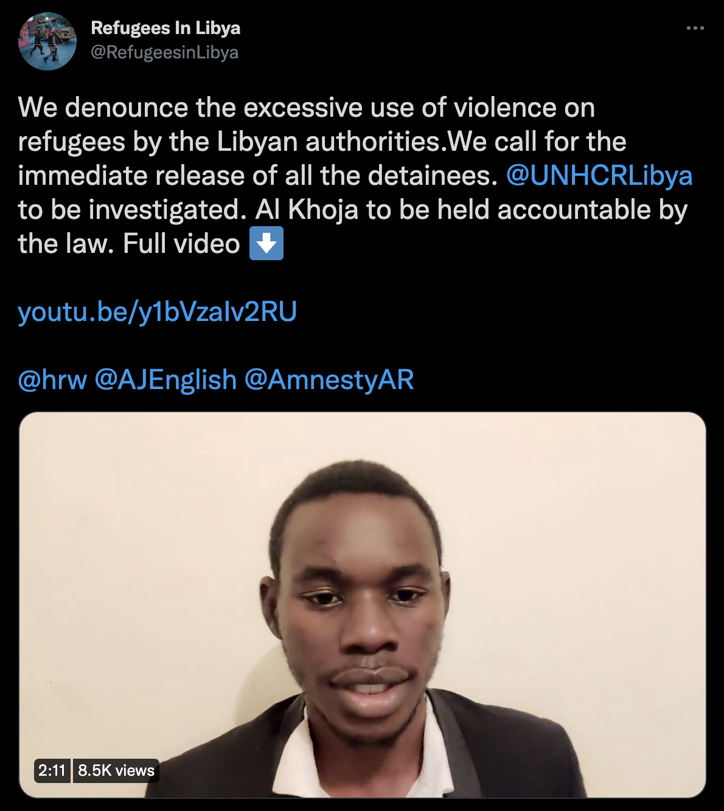

### **AYS News Digest 12/1/22: Syrians flee Denmark in fear of deportation — a dilemma for EU governments**
#### What will the fallout of the Danish decision be for the people and for other EU Member states? / 2021 deadliest year on record in the Mediterranean / EC plans no infringement procedure in case of EU Member States practicing pushbacks at the border with Belarus

](assets/8eb20a3d82b4/0*NMm4xRksgFhLwQDC.jpeg)

Ocean Viking detained in Italian port one year after release — see story [here](https://en.sosmediterranee.org/news/ocean-viking-detained-in-italian-port-one-year-after-release/?fbclid=IwAR3GWQ6j8yXt_6r1ttTpFQH-dmhvLkO6f6BBE6T-sBqcz6QF1qsuV0GGPes)
#### FEATURE

Fearing indefinite detention and deportation, hundreds of Syrians living in Denmark have had to flee to neighboring European countries since 2019\. According to an [investigation by Lighthouse Reports](https://www.lighthousereports.nl/investigation/syrians-fleeing-denmark/) , at least 421 people have moved to the Netherlands, Germany, Belgium and Sweden after Denmark became the first EU country to revoke residence permits to Syrian refugees, as we’ve been reporting already\. This puts the Member States in a tight spot: under the Dublin regulation, immigration authorities are meant to send these people back to the country where they applied for asylum\.

> But can Denmark be considered a safe country for Syrians, when it threatens to deport them to Damascus? 

In 2015, Denmark passed a law creating a temporary protection status for people fleeing indiscriminate violence, in contrast to personal persecution: this f **ragile status can be revoked immediately as soon as there is any security improvement in their home countries** \. 4,700 Syrians were granted this temporary protection\. In 2019, on the basis of a “Country of Origin Report” co\-written with the Danish Refugee Council \(which has been [strongly criticized](https://www.thenewhumanitarian.org/news-feature/2022/1/11/how-Denmark-hard-line-Syrian-refugees-aid-group-ethical-dilemma?fbclid=IwAR0Pt9ja33fBvWbIeexkDbzpJMeuFpHBzBWk6MMO51Jjfq-UP0A0SeyCkNg) for this collaboration\), the government argued that fighting had decreased in Damascus and its suburbs—a decision that came as a great propaganda tool for the Assad regime and was praised by Syrian state media\.

Court cases have been launched in Germany, Belgium and the Netherlands to determine whether or not asylum\-seekers could be sent back to Denmark\. Approaches differ in the different countries: most Syrians who fled to Sweden have been ordered to return, while those in Belgium are hoping to overstay the period of time allowing for returns under the Dublin regulation\.

After months of delay, on 13 January, MEPs from the European Parliament’s civil liberty committee will question Danish officials about whether Copenhagen is upholding its commitments to the EU\. In the meantime, the people concerned are once again living in limbo and in constant fear\.

■■■■■■■■■■■■■■ 
> **[Tineke Strik](https://twitter.com/Tineke_Strik) @ Twitter Says:** 

> > In the LIBE committee, Danish social-democratic minister clarifies its deterrent refugee policies. Depriving Syrian refugees of protection, outsourcing asylum seekers to developing countries. Paying lip service to solidarity, but in essence aiming to circumvent any responsibility 

> **Tweeted at [2022-01-13 11:15:08](https://twitter.com/tineke_strik/status/1481585600486678534).** 

■■■■■■■■■■■■■■ 

[Read more](https://www.lighthousereports.nl/investigation/syrians-fleeing-denmark/?fbclid=IwAR2hSofQt0qE8LEr0N1NUDLOQf66pUwZnPXVBPAtEB2tJyKKZ2MzkcaYZ-I) on the policies facing Syrian refugees settled in Denmark\.
#### LIBYA

■■■■■■■■■■■■■■ 
> **[LouiseMichel](https://twitter.com/MVLouiseMichel) @ Twitter Says:** 

> > “In reality they do not want us to leave Libya but to be used with the funds of the European Union” @[UNHCRLibya](https://twitter.com/UNHCRLibya) @[EU_Commission](https://twitter.com/EU_Commission) 

> **Tweeted at [2022-01-12 19:15:56](https://twitter.com/mvlouisemichel/status/1481344212142546949).** 

■■■■■■■■■■■■■■ 

After the brutal detention of hundreds of people [camping in front of a community development center and UNHCR’s office in Tripoli](https://medium.com/are-you-syrious/ays-news-digest-10-1-22-attacks-and-detention-as-the-latest-fruit-of-the-eus-deal-with-libya-7d6185afbbd6?source=collection_home---7------0-----------------------) , refugees in Libya are calling for an end to the violence and the release of all detainees\. 
[In a video](https://twitter.com/RefugeesinLibya/status/1481202383589945346) , they request for UNHCR and Libyan authorities to be held accountable\.

MSF has treated 68 people who were injured during the mass arrest two days ago\. 190 people were offered psychological support, the team [reported](https://www.ansamed.info/ansamed/en/news/sections/generalnews/2022/01/11/libya-68-migrants-treated-after-mass-arrests-in-tripoli-msf_e9d0db6f-cbe1-4eb3-a1fc-fce01dd87a24.html?fbclid=IwAR3S4PAgl1yZwq7aLnmOJNTqdIi7xfFXS8l9OG73QOIoAYf1WSYta20u0cQ) \.

> “Once again, we ask Libyan authorities to stop mass arrests and to find dignified alternatives to detention\. We also ask the EU to stop any support to the endless system of detention, abuse and violence in Libya\.” 

■■■■■■■■■■■■■■ 
> **[Sara Creta](https://twitter.com/saracreta) @ Twitter Says:** 

> > Libyan armed groups violently removed hundreds of refugees protesting in front of UN facility, only to transfer them to notorious Ain Zara Prison. 
People had "stab wounds, beating marks &amp; [were] separated from children", says Gabriele Ganci, head of @[MSF](https://twitter.com/MSF) mission in #Libya. 

> **Tweeted at [2022-01-11 15:57:58](https://twitter.com/saracreta/status/1480932002815692806).** 

■■■■■■■■■■■■■■ 

#### TURKEY
- The murder of 19\-year\-old Syrian Nail al\-Naif is the latest in what refugee rights activists say is an alarming trend of violence against refugees in the country\.
- Undocumented Afghans lack access to health care

#### SEARCH AND RESCUE AT SEA

2021 was the deadliest year on record in the Mediterranean\. The Fund for Global Human Rights points out an increase by almost 103% of deaths compared to 2020\.
- A talk with Sea Rescue Association [Sea Punks](https://www.facebook.com/seapunks.sar/?__cft__[0]=AZUllKF5E_xXzHw9uGWK5c7AhMCfn3cFvP04Q_hQzVyxsdHVffLi9VJiqhSodWwVZCwj6ZMO1Q-tjf3ZGJ1Ea2gBFDqDSMvDqGH4NMUzj43Q3yT3O6om85i1_E9iYhnL-CANiIROSuWAuaX07T9wKMSt&__tn__=kK-R) :

[](https://l.facebook.com/l.php?u=https%3A%2F%2Fwww.swr.de%2Fswraktuell%2Fradio%2Fdie-seenotretter-sea-punks-wie-drei-brueder-aus-bad-kreuznach-leben-retten-104.html%3Ffbclid%3DIwAR2guDjBG41g-n2W2TRMetMIPIm_o1oXUprQnvSpUT94Iome16TbQysqRBw&h=AT2GtVjoUbMqnhibeKF4z4IG8MOKRGJSlYnaxhEZZ4lYkDLiUFqW86vrO4gmM4pQMidKnmJ9d2VcL6LlEleLl74A0JJppXV5PDWNYM8YdYWPwHkWV2VqiU7g39X1O9LKrCDDqUO1RFi26lreiQ&__tn__=-UK-R&c[0]=AT3n7h6nRn023JddAQrWw4LGWJm-XF7mrljf521IUycxHA17IQ789s-SY0-eKImOkRb63Fp-2GIosSNuVkIWzyc2X5Dq1YOeWDKN01L48eJrdf1NwrcpiGDyc-2_lovT3lySavRxGEg8ewEpeuvpph7Fwp_NxDAi-Cx1u25m_YF1-Cg)

#### GREECE

](assets/8eb20a3d82b4/1*dyiJ7JutihFf6gpfBIcGLQ.jpeg)

“A day with very bad weather: Cold and windy\. Today we gave lentils and and flour for empty bottles\. Again more than 10\.000 empty bottles went to recycling\. Even on these pictures you see how peoples are freezing and suffering from the cold\.” — Photo: [Moria Corona Awareness Team](https://www.facebook.com/MoriaCoronaAwarenessTeam/?__cft__[0]=AZV-3Nkln8xsZZjHxhvZcnOsiWLglu8Fh3eQUvEZuW0OI39rVj8Z6SabQzhoH7YajuBKiFX7xiAjQEToT4rdDcxyfBYkobBfGpVEPMDwSLz4o6ZgfuJfo5ZEZrNvLnkGeOgVUHe3A0QZuCijbU2Nqtwg&__tn__=-UC*F)
### Naming and Shaming: Harmful asylum procedures for sexual orientation and gender identity claims on Lesvos

This report examines and contributes to the discussion surrounding the prevalence and consequences of procedural violations during asylum interviews and in the assessment of SOGIESC claims in Europe,7 with a focus on process rather than outcome\.

> The process of claiming asylum entails sharing information about private, sensitive, and often traumatic experiences\. This may be especially true for claims on the basis of sexual orientation, gender identity and expression, and/or sex characteristics \(SOGIESC\) \. An applicant seeking asylum on the grounds of their SOGIESC must demonstrate that they are at risk of persecution based on their actual or perceived orientation or identity, which is inherently personal\. Since it is unlikely that much, if any, external evidence would be available to support a SOGIESC claim, there is an even greater emphasis on the applicant’s testimony\. 

#### SERBIA

A young man from Afghanistan witnessed the constant practices of the border police of Hungary, having been forced to lie in snow for an hour prior to a violent pushback to Serbia followed up by Serbian organisations in the area\.

■■■■■■■■■■■■■■ 
> **[Azil u Srbiji Asylum Protection in Serbia](https://twitter.com/APC_CZA) @ Twitter Says:** 

> > Horgoš,11.01.22. Mađarska prilikom nasilnih #pushbacks i nečovečno postupa prema licima na njenoj teritoriji.Muhamed iz Avganistana(21) svedoči da je sinoć njih 17 bilo naterano da leže sat vremena u snegu,bez pomeranja, nakon čega su “pushbackovani”nazad u #Serbia 
#Violence https://t.co/2XFoanhhcI 

> **Tweeted at [2022-01-12 12:32:46](https://twitter.com/apc_cza/status/1481242750473416711).** 

■■■■■■■■■■■■■■ 

#### FRONTEX

■■■■■■■■■■■■■■ 
> **[Matthias Monroy (@Mastodon)](https://twitter.com/matthimon) @ Twitter Says:** 

> > The EU Fundamental Rights Agency presents its 2021 Update about blocked #SearchAndRescue (SAR) operations by authorities in the Mediterranean:
[fra.europa.eu/en/publication…](https://fra.europa.eu/en/publication/2021/december-2021-update-ngo-ships-sar-activities)

Plus 16 pages about legal proceedings by EU Member States against private SAR entities:
[fra.europa.eu/sites/default/…](https://fra.europa.eu/sites/default/files/2021-12/Table%202%20Criminalisation%20NGO%20SAR%20up%20to%20December%202021.pdf) https://t.co/mrjtY4XdUZ 

> **Tweeted at [2022-01-12 17:30:11](https://twitter.com/matthimon/status/1481317599782879233).** 

■■■■■■■■■■■■■■ 

#### GERMANY
### An increase of asylum applications

Asylum applications have increased significantly in Germany, reaching a record number of 190,800 applications accepted, the highest since 2017\. While most applications come from people fleeing Syria, 31,000 Afghans requested asylum in the country last year\. Around 17\.5% of applications also came for children under the age of one and born in Germany\. These newborns’ statuses remain unclear, especially if their parents are unable to declare them in their countries of origin\.
#### UK\-FRANCE

1002 people shipwrecked and were rescued by French forces in the English channel in 2021, triple the number of the previous year \(341 people\) \. While the French Office of Immigration and Integration claims these people were “taken into care”, activists have continuously denounced the almost daily evictions of camps along the coast and in Calais\.
#### BELARUS

An 18\-year\-old Syrian boy in a state of extreme exhaustion and hypothermia was taken to the hospital then pushed back to Belarus after a few hours\. Activists who supported him were harassed and threatened by police\. They fear he might not survive the extreme conditions of the coming days\.

“The Commission concludes that pushbacks take place at the Lithuanian/Latvian/Polish border, but doesn’t want to start an infringement procedure because of a lack of evidence\. Even the national rules allow for pushbacks\. What more do you need, Guardian of the Treaty?” — wrote MEP Tineke Strik on her social media
#### WORTH READING
- Renewed Tragedy: The Rise of Drowned & Missing Migrants & Asylum Seekers Toll in 2021 \[EN/AR\]:

**Find daily updates and special reports on our [Medium page](https://medium.com/are-you-syrious) \.**

**If you wish to contribute, either by writing a report or a story, or by joining the info gathering team, please let us know\.**

**We strive to echo correct news from the ground through collaboration and fairness\. Every effort has been made to credit organisations and individuals with regard to the supply of information, video, and photo material \(in cases where the source wanted to be accredited\) \. Please notify us regarding corrections\.**

**If there’s anything you want to share or comment, contact us through Facebook, Twitter or write to: areyousyrious@gmail\.com**

_Converted [Medium Post](https://medium.com/are-you-syrious/ays-news-digest-10-1-22-syrians-flee-denmark-in-fear-of-deportation-a-dilemma-for-eu-governments-8eb20a3d82b4) by [ZMediumToMarkdown](https://github.com/ZhgChgLi/ZMediumToMarkdown)._
