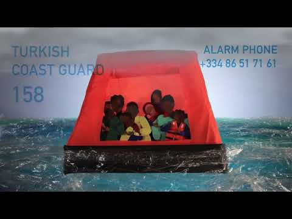

### AYS News Digest 19/01/2022 Draft The UK’s Unravelling Asylum System

Updates from Central and Western Med / New ‘smart policing’ program for Greek Police / Anti\-migrants protests in Evros against the expansion of Fylakio detention / Calais Food Collective faces criminalisation / Rwanda stands against Danish bribery…

 \)](assets/bfe5fb5dde36/1*RTOcYpNDke7C72Uur6icvg.jpeg)

Central Med \(Credit: [Louise Michel](https://twitter.com/MVLouiseMichel/status/1483861387558666241/photo/1) \)
#### FEATURE: The UK’s Unravelling Asylum System

After [the tragic death of a young man from Sudan](https://www.independent.co.uk/news/world/europe/channel-death-latest-france-update-b1993127.html) in the channel last week and multiple reports of [ceilings falling in, leaving one toddler with stitches and a mother concussed](https://www.bbc.com/news/uk-59763205?fbclid=IwAR2mk-oyQ69xkeHq_CulMQieXDJAtMoNuKU9PvaeX7UezjQoTTkoHXdRPls) , in homes for asylum seekers, the end of this week only brings more bad news\. Figures of arrivals to the UK remain very low compared to other EU and non EU countries despite media and Government scaremongering\.

■■■■■■■■■■■■■■ 
> **[Georgina Sturge](https://twitter.com/GRSturge) @ Twitter Says:** 

> > In the first 2 weeks of January 2022, 773 people are estimated to have made the crossing.

This is more than the total for the whole of the first 2 *months* of 2021. https://t.co/kno9ojsWtI 

> **Tweeted at [2022-01-18 12:10:18](https://twitter.com/grsturge/status/1483411424785440771).** 

■■■■■■■■■■■■■■ 

[Rows have erupted in Government over the potential use of the Navy in the channel](https://www.politico.eu/article/tory-mp-oppose-uk-plan-military-deter-channel-migrants/?fbclid=IwAR3Teve7jyaJtZuQJqR7ADgnRAC1PvbCuVTixGXokm2U1yqjB98ZuxzumFM) , but few have criticised this attempt to further militarise borders on grounds other than it might stretch the Navy’s resources and not be very useful\. Reports of [discussions around the use of sonic weapons](https://news.sky.com/story/migrant-crossings-no-10-policy-chiefs-explored-using-powerful-sonic-weapons-to-halt-journeys-across-the-english-channel-12518663?fbclid=IwAR3Xnj6e48PuH318_Np-r8bQLGwO-_NOIMNL_qc8RR4_usAYPPjK869Vdaw) in the channel have also been confirmed, they use sound at such a high pitch that it can induce vomiting, but for now the plan has been put to rest as a method of deterrence\. [Safe and legal routes are of course the only way to actually reduce crossings](https://theconversation.com/sending-in-the-royal-navy-is-not-the-answer-to-small-boat-migration-in-the-channel-175115?fbclid=IwAR0XsuaTfJpBTklHk0HYErYlvY9B6MNGJF0vCJ7aCo-fbbpG1dv4Nt4SbLg) \.

[Praxis reported from the Children in poverty: No Recourse to Public Funds \(NRPF\) evidence session](https://twitter.com/Praxis_Projects/status/1483732242165899266?fbclid=IwAR2bvc8bnN12eISjIPPCJGo4Xyfti8yXGylIxLyYdVEWx87hrtyjHT99LRo) on the 19th which raised important questions including why it has taken the government over a year to decide if children from NRPF families are eligible for free school meals\. Currently, they are not\. The new Nationality and Borders Bill will only increase the number of people who do not have recourse to public funds, furthering poverty and hunger in the UK\.

A [new report](https://www.jcwi.org.uk/we-also-want-to-be-safe-report) from the Joint Council for the Welfare of Immigrants also makes clear that the UK Government drastically failed to protect undocumented people in Britain during the pandemic and calls for an Public Covid inquiry\. This has been made exponentially worse by an information sharing agreement with the NHS\.

> People die in their homes, in their rooms, because they are afraid of GPs\. [_Evelyn_](https://twitter.com/JCWI_UK/status/1483368822698618882) 

After misleading headlines this weekend, [Ghana has categorically stated that it will not be involved in the UKs offshoring of asylum](https://www.theafricareport.com/168415/ghana-government-denies-uks-operation-dead-meat-scheme/) , not now, not ever\.

In a little bit of good news, [on the 19th the High Court ruled that the Home Office’s policy of age assessing young people immediately after arrival at Dover is unlawful](https://insights.doughtystreet.co.uk/post/102hgm1/home-office-acted-unlawfully-in-detaining-unaccompanied-young-people-for-age-asse?fbclid=IwAR3Teve7jyaJtZuQJqR7ADgnRAC1PvbCuVTixGXokm2U1yqjB98ZuxzumFM) as is their prolonged detention while the assessment is carried out\. [This is unfortunately too late for many](https://medium.com/@bridgetlchapman/the-home-office-is-using-age-assessments-as-a-weapon-in-the-hostile-environment-87f0491a5fd6) who have already had traumatic experiences after being wrongly assessed as adults, refused the support they were entitled to and put into inappropriate accommodation with adults\. [Alexander Tekle died by suicide](https://www.independent.co.uk/news/uk/home-news/refugee-alexander-tekle-croydon-b1986700.html) on December 17th 2017 after being placed in adult accommodation even though his age was still in dispute, four of his friends also took their own lives within 16 months of arriving in the UK\.

Meanwhile the leader of the Commons, [Rees\-Mogg, has helpfully stated](https://www.bbc.com/news/uk-59763205?fbclid=IwAR2mk-oyQ69xkeHq_CulMQieXDJAtMoNuKU9PvaeX7UezjQoTTkoHXdRPls) that the only people who need asylum coming from France are those who don’t like garlic, showing just how seriously the UK government is taking this\.

One way to take action against all this madness and specifically the Nationality and Borders Bill is to take part in local struggles\. The Solidarity Knows No Borders Project will host a [‘new joiners meeting’ on the 20th at 7pm GMT\.](https://actionnetwork.org/events/sknb-joiners-jan-2022?source=linktree&fbclid=IwAR3yGDRnOUoTPxLklPWRVIl8laEqn8bD1UGVD6ei_Xxru8VlKwtDBQ6Fdns)

■■■■■■■■■■■■■■ 
> **[The Refugee Buddy Project](https://twitter.com/TheRefugeeBuddy) @ Twitter Says:** 

> > ⚠️ HAPPENING TOMORROW! ⚠️

📢 As the #NationalityAndBordersBill passes through Parliament, will you join us in the struggle against Britain's racist &amp; violent immigration system? https://t.co/ewjOp5AGJt 

> **Tweeted at [2022-01-19 11:55:50](https://twitter.com/hastings_buddy/status/1483770172657831941).** 

■■■■■■■■■■■■■■ 

SEA

**Eastern Med**

Alarm Phone produced the following video clip for people who are considering crossing from Turkey to Greece, either via the Aegaen Sea or the land border at Evros / Meriç river\.

The video intend to provide information for a safer journey\. It shares information on precautions to take when crossing the border and how to react when fearing an illegal pushback to Turkey\.

It is part of a larger [Safety at Sea Campaign](https://alarmphone.org/en/safety-at-sea/) \. At the link, the video is available in Arabic, Farsi, French and Turkish\.
#### Central Med

MSF’s Geo Barents [rescued](https://twitter.com/MSF_Sea/status/1483808802906509317) 89 people on Wednesday\. On the same day, Louise Michel was [alerted](https://twitter.com/MVLouiseMichel/status/1483861387558666241) by Alarm Phone about a boat in distress, two hours away from our position\. “Upon arrival we witnessed the so\-called Libyan Coast Guard intercepting the boat and shooting at a person who had jumped into the water\. We do not know if the person was hit\.”

■■■■■■■■■■■■■■ 
> **[LouiseMichel](https://twitter.com/MVLouiseMichel) @ Twitter Says:** 

> > What we do know: 
The #EU financed and trained this so-called coast guard. 
This is not the first time gunshots like this have been witnessed by the #civilfleet [2/3] https://t.co/VfTXAiMq1V 

> **Tweeted at [2022-01-19 17:58:18](https://twitter.com/mvlouisemichel/status/1483861387558666241).** 

■■■■■■■■■■■■■■ 

More info on this on the [Civil Fleet blog](https://thecivilfleet.wordpress.com/2022/01/19/eu-supported-libyan-coastguards-fire-on-refugee-who-jumped-overboard/) \.
#### Western Med

62 people were [rescued](https://twitter.com/alarm_phone/status/1483518475326955529) by Salvamento Maritimo off Fuerteventura on Tuesday\.

On the same day, one lifeless body was recovered in front of Carboneras \(Almeria\) by Salvamento Maritimo\. Workers of the Spanish civil rescue agency inform that on Monday night they [approached](https://twitter.com/CGTsalvamento/status/1483748645287641095) a small boat near Almeria, with 10 people on board\. When they reached the boat, one of the passenger jumped overboard to attempt to reach the coast by swimming\.

As the Salvamento Maritimo’s workers have been [repeating](https://twitter.com/CGTsalvamento/status/1483748642624262146) for some time, “ **The militarisation of maratime rescue costs lives\.”**

GREECE
#### Lesvos: Arrivals and Pushback

Aegean Boat Reoport [published](https://www.facebook.com/AegeanBoatReport/posts/1243871459469289) news about 2 boats arriving on Lesvos on Tuesday, carrying at least 42 people\. As of yesterday, only 26 of them were registered in the quarantine camp in Maurovouni\. On Tuesday night, “Turkish coast guard found and rescued 16 people from a life raft drifting outside Ayvacik, Turkey\. The group rescued claimed that they had been arrested by police on Lesvos\.”

It seems that fear of being pushed back brings people to avoid contact with any organisation, not to risk giving away their position\. Moreover, people seems to have started reaching the quarantine camp in small groups of 3 people, to avoid detection\.
#### Evros: anti\-migrant protests against Fylakio detention site’s expansion

Lena K\. [report](https://twitter.com/lk2015r/status/1483485669297213445) about a week of protests in Fylakio, Evros region\. Within the past 7 days, three protests were organised against the expansion of the local detention site\. As we’ve been reported in the past, it is exactly those racist and anti\-migrant narratives, glorified by the government in 2020, that are now fuelling the protests, spearheaded by local figures and far\-rights groups\.
#### “Smart policing” or smarter racial profiling

Human Rights Watch and Homo Digitalis are [criticising](https://www.hrw.org/news/2022/01/18/greece-new-biometrics-policing-program-undermines-rights) Greek police’s new program “to scan people’s faces and fingerprints, \[which\] is inconsistent with international human rights standards on privacy and likely to amplify ongoing discrimination\.” In 2019 the Greek police [signed a contract](http://www.intracom-telecom.com/en/news/press/press2019/2019_07_02.htm) with the global communication company Intracom Telecoma, to introdue a “smart policing” program in the country\. Initially planned for early 2021, it was first officially delayed to August, but hasn’t yet been reported to have been implemented\. This, despite the costs having being paid in full to Intracom in September \(€4\.5 million, 75% funded by the EU Commission’s Internal Security Fund\) \.

> [Under the program](http://www.astynomia.gr/images/stories/2018/prokirikseis18/12042018-texn_prod.pdf) , police will receive smart devices with integrated software to enable them to scan vehicle license plates, collect fingerprints, and scan faces\. People’s biometric data can be immediately compared with data already stored in 20 [databases](http://www.astynomia.gr/images/stories/2018/prokirikseis18/26052018texnikesprodiagrafes.pdf#page=11) held by national and international authorities\. At least one of the databases and systems cited may already be collecting massive amounts of biometric data in public spaces\. 

> Based on the technical specifications, the system will delete fingerprint scans immediately if there is no match but will [store](http://www.astynomia.gr/images/stories/2018/prokirikseis18/26052018texnikesprodiagrafes.pdf#page=36) photographs for seven days\. If the system finds a match for the fingerprints, photographs, or facial scans, the data will be retained for an unspecified amount of time\. 

Greece had already announced the program as a better, “more “ [efficient](http://www.astynomia.gr/images/stories/2018/prokirikseis18/12042018-texn_prod.pdf) ” way, among other things, to identify undocumented or improperly documented migrants\.”

Witnesses, researches and media investigations have countless times pointed out the brutality of Greek police, as well as the racial profiling carried out by its officers and the ‘black hole’ of police detention, also for people on the move with regular documents\.

SPAIN
#### No crime has been committed in Arguineguin, Canary island — judge says\.

The Court of Las Palmas has definitively [dismissed](https://www.eldiario.es/canariasahora/tribunales/archivada-definitivamente-denuncia-hacinamiento-migrantes-arguineguin_1_8661879.html) the case against Spanish authorities for the overcrowding and prolonged detention of migrants in the port of Arguineguín, in Gran Canaria, in November 2020\.

While the court recognised that the conditions of the camp installed by the Red Cross were “regrettable”, judges didn’t found this to be the result of a voluntary and arbitrary action of the authorities to violate the rights of migrants\. On the contrary, the situation was only produced by a lack of resources, due to the large number of arrivals\.

Media report that the case, filed initially in 2020, passed from the Hate Crimes prosecutors to The Immigration Prosecutor in 2021\. Where the first had requested police report and further investigation, the second immediately requested a dismissal of the case\.

BELGIUM
#### One year after the occupation of the Beguinage church in Brussels, little has changed

One year ago, Janary 2021, a group of undocumented people, the Union des Sans\-papiers pour la Régularisation \(USPR\), occupied the Beguinage church in Brussels to bring attention to their struggle as long\-term residents to access the job market and social services\. The occupation grew, attracting coverage and attention from around the world\. During the spring, it became the main site of the hunger strike of more than 400 undocumented migrants who were demanding a clear path to legal residency, with many having lived and worked in Belgium for years\. Many had to be hospitalised\. To convince people ending their hunger strike, Belgian authorities promised negotiation talks and a speedy review of their cases\.

In November, about 40 people returned to the church and resumed their strike, complaining that authorities failed to deliver the promises made during negotiation talks\.

In an ambiguous move, the church has now formally [asked](https://www.infomigrants.net/en/post/37927/migrants-face-uncertain-future-as-brussels-church-occupation-ends) the activists to vacate the premises, and brought the request to the local ‘justice of the peace’ lower rank of Belgian justice system\. The church asserts that “this is in no way a sign that we have distanced ourselves from the struggle of people without legal residence for a more humane asylum and regularization policy”, but they are asking people to leave because the building is not not suitable for accommodating people in the freezing winter months\.

FRANCE
#### Calais Food Collective face Criminalisation and Harassment

 \)](assets/bfe5fb5dde36/1*GrHMaWoWeh_QxMWeKTy59w.jpeg)

\(Photo Credit: [Calais Food Collective](https://twitter.com/CalaisFoodCol/status/1483520977833234434/photo/1) \)

> January 12 distributing water is illegal \+ lacerated tank and stolen tap\. 

> January 15, yet another faucet stolen from another living space where a water tank had been installed\. 

> January 16, police control \[us\] because distributing food is illegal, it is for our “protection”\. 

> January 18, CRS control \[us\] because “distributing food is illegal”, and ban on filming, recording, phoning, texting during the control\. 

> Tomorrow “distri\. \.” in short you know the song\. [\#Calais](https://twitter.com/hashtag/Calais?src=hashtag_click) Solidarity hindered 

DENMARK
#### Rwanda Stands its Ground Against Danish Bribery

■■■■■■■■■■■■■■ 
> **[Allan Olingo](https://twitter.com/allanolingo) @ Twitter Says:** 

> > RWANDA rejects 250,000 Covid-19 vaccines from Denmark over claims the donation was attached to Kigali accepting to host asylum centres for Denmark. The two countries officials met in September, 2021 but Kigali has since rejected the vaccines, and proposal-Danish media reports. https://t.co/QnlikxA5Y5 

> **Tweeted at [2022-01-16 09:38:56](https://twitter.com/allanolingo/status/1482648556607524865).** 

■■■■■■■■■■■■■■ 

IRELAND
#### New Online Learning Service

A group of three non profits in Ireland have launched [SaorEd](https://saored.com/) and online platform offering courses in English language, information technology, healthcare, and career preparation\. They are available in English, Arabic, German and Spanish and are available to international protection applicants, refugees and other underserved communities in Ireland\.

EU
#### EUAA replaces EASO

The European Union Agency for Asylum started [working](https://www.euaa.europa.eu/news-events/new-eu-agency-asylum-starts-work-reinforced-mandate) yesterday\. It replaces the EASO \(European Asylum Support Office\), after the EU introduced a new [Regulation](https://eur-lex.europa.eu/legal-content/EN/TXT/HTML/?uri=CELEX:32021R2303&from=EN) for the agency in December\. The Mandate of the EUAA is expanded, with more emphasis on the improvement of a multi\-national asylum system and the deployment of personnel in support of EU Member States in case of emergency\. The European Commission has already [pledged](https://www.eureporter.co/politics/2022/01/19/euaa-begins-work/) €172 million for a budget for 2022\.
#### Pick and mix approach to the Pact on Asylum and Migration?

Statewatch has been tracking the development of the EU Pact on Asylum and Migration since its presentation in 2020\. The Pact includes a wide array of policies and instruments, which should be introduced over the next three years\. Resistance to some of this measures by member states has slowed down the path set by EU institution\. Now, it is [reported](https://www.statewatch.org/news/2022/january/eu-tracking-the-pact-french-presidency-proposes-a-gradual-approach-on-migration-and-asylum/) , the new French presidency of the Union, proposed a [gradual approach](https://www.statewatch.org/media/3046/eu-council-fr-presidency-note-pact-gradual-approach-11-1-22.pdf) to the Pact, which “would involve the member states adopting a ‘core’ of measures, with priority going to:

> — “some of the elements of the ‘screening’” at borders _\[and entry points\]_ , including support from EU agencies to implement controls and registration in Eurodac; 

> — progress on deportations and readmission policy, including the [**punitive new elements of the Visa Code**](https://www.statewatch.org/analyses/2021/eu-moves-ahead-with-plans-to-use-visa-policy-as-leverage-to-increase-deportations/) , more [**external action from Frontex**](https://www.statewatch.org/analyses/2021/briefing-external-action-frontex-operations-outside-the-eu/) , and more “joint cross\-border patrols,” presumably in the hope of detecting people engaged in unauthorised “secondary movements”; and 

> — reception, with the Presidency suggesting the possibility of “a new mechanism for the relocation of persons in need of protection” that should be “simple, pragmatic, predictable and credible\.” 

SWITZERLAND
#### Enough signatures for the No Frontex Referendum

The No Frontex Referendum campaign in Switzerlad [collected](https://twitter.com/NoFrontex/status/1484130592329449475) more than 62,000 signatures, well over the 50,000 required to put their referendum forward to be voted by Swiss citizens\. It will question the participation of Switzerland in the budget of the European Border and Coast Agency\.

GENERAL
#### Borders keep killing

No Name Kitchen tells the story of Ijaz, 24, who died recently at the doorstep of the EU\. Read the whole thread\.

■■■■■■■■■■■■■■ 
> **[NoNameKitchen](https://twitter.com/NoNameKitchen1) @ Twitter Says:** 

> > EU borders keep killing: We are very sad to communicate the death of Ijaz, whom at only 24 years, passed away a few weeks ago. His friends ask us to amplify their voices and tell his story based on the testimony of those who went on "game" with him. 

> **Tweeted at [2022-01-19 20:04:56](https://twitter.com/nonamekitchen1/status/1483893255817371651).** 

■■■■■■■■■■■■■■ 

#### Case files at the ICC against Libyan armed groups and Italian and Maltese authorities

On the 18th of January, Adala for All \(a French not\-for\-profit organization, based in France, and composed of a network of dozens of Libyan human rights lawyers and jurists with expertise in the MENA region\), StraLi \(an Italian NGO aiming at the promotion and protection of human rights through the use of strategic litigation tools\), and UpRights \(a non\-profit initiative based in The Hague, Netherlands which strives for effective access to justice for victims of serious human rights violations and international crimes\) [filed a Communication to the International Criminal Court \(ICC\)](https://www.uprights.org/news/adala-for-all-strali-and-uprights-file-communication-to-icc-concerning-crimes-in-libya-mjh9g) concerning crimes committed in Libya between 2017 and 2021 against migrants and asylum seekers which may amount to war crimes within the jurisdiction of the court\. **The Communication requests the ICC to investigate international crimes committed by Libyan armed groups against thousands of migrants, including women and children, trapped in detention centres in Libya following their interception at sea\.** Once returned to Libya, the victims were routinely and systematically subjected to various forms of mistreatments and abuse including murder, torture, rape, forced labour and forced conscription\. **The Communication underlines that the ICC Prosecutor should scrutinize, in addition to Libyan actors, the potential criminal conduct of Italian and Maltese authorities and officials for the support they provided to Libyan actors\.**

WORTH ATTENDING

■■■■■■■■■■■■■■ 
> **[Sea-Watch International](https://twitter.com/seawatch_intl) @ Twitter Says:** 

> > Tomorrow, 6 pm: join us and our panelists to hear their stories about their experiences with the relocation process and follow the discussion about the system behind it.

Register now: [us02web.zoom.us/webinar/regist…](https://us02web.zoom.us/webinar/register/WN_EMEbV6jQRoihW9cyD_iNgg) https://t.co/zRNJTF5h06 

> **Tweeted at [2022-01-19 09:49:43](https://twitter.com/seawatch_intl/status/1483738432794992640).** 

■■■■■■■■■■■■■■ 

WORTH READING
- [**Eyes on the Central Med \#3, by SOS Mediterranee;**](https://en.sosmediterranee.org/news/eyes-on-the-central-med-33/) _a publication that intends to shed light on events which unfolded in the central Mediterranean in the past four weeks\. Over 240 people died in the central Mediterranean in December resulting in over 1,553 deaths in 2021, making 2021 the deadlies year since 2017\. 11 fatalities since the start of 2022\._
- [**Deniability? Frontex and Border Violence in the EU**](https://rli.blogs.sas.ac.uk/2022/01/19/deniability-frontex-and-border-violence-in-the-eu/) , by Elif Kuskonmaz for Refugee Law Initiative \(RLI\): _Both the media and academic worlds have been increasingly galvanized by evidence of extreme border violence at the EU’s external borders\. This violence has been documented in many ways, reporters’ eye witness accounts, videos etc, yet in response to these allegations the Frontex Director has firmly denied any Frontex involvement and only admitted that perhaps Frontex officers might have seen unlawful acts of violence against migrants on one or two occasions\. Without more proof, the European Parliament’s specialised committee on Frontex accepted for the moment this position\._
- [**The story of Abdul, evacuated from Kabul and now in an Italian detention centre\.**](https://altreconomia.it/la-storia-di-abdul-evacuato-da-kabul-e-finito-nel-cpr-di-gradisca-di-isonzo/) “ _After arriving in Italy at the end of August 2021, the 22 year old man tried to reach France, but was found and taken to a pre\-deportation centre for 32 days, and his expulsion papers were filed\. This is not an isolated case, or an error\. It’s the administrative machine, operating blindly and serially\.”_ \(in Italian\)
- [**Syrian refugees in Lebanon need help and protection, not more pressure to leave**](https://www.thenewhumanitarian.org/opinion/2022/1/18/Syrian-refugees-Lebanon-help-protection-pressure-leave) \(The New Humanitarian\): _Nearly 11 years since the revolution in Syria began and violence escalated, around 1\.5 million refugees remain displaced in Lebanon — accounting for nearly a quarter of Lebanon’s total population, the highest proportion of refugees anywhere in the world\._

**Find daily updates and special reports on our [Medium page](https://medium.com/are-you-syrious) \.**

**If you wish to contribute, either by writing a report or a story, or by joining the info gathering team, please let us know\.**

**We strive to echo correct news from the ground through collaboration and fairness\. Every effort has been made to credit organisations and individuals with regard to the supply of information, video, and photo material \(in cases where the source wanted to be accredited\) \. Please notify us regarding corrections\.**

**If there’s anything you want to share or comment, contact us through Facebook, Twitter or write to: areyousyrious@gmail\.com**

_Converted [Medium Post](https://medium.com/are-you-syrious/ays-news-digest-19-01-2022-draft-the-uks-unravelling-asylum-system-bfe5fb5dde36) by [ZMediumToMarkdown](https://github.com/ZhgChgLi/ZMediumToMarkdown)._
