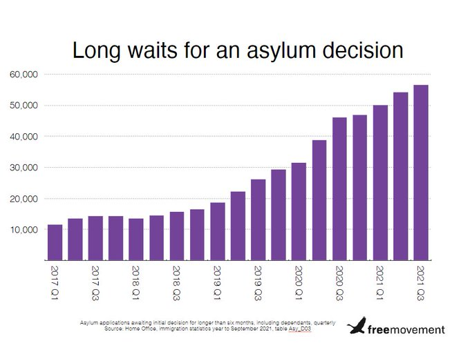

### AYS News Digest: 1–2\.2\.2022 Amnesty International: Withdraw EU connection from Libya
#### Amnesty International: Drop charges against El Hiblu 3 // Twelve people found dead at the Greek/Turkish border // 48 people have arrived in Italy from Greece, thanks to humanitarian corridors // £1\.2 million spent every day on housing people in hotels // Latvia extended the state of emergency\.
### FEATURE

### Amnesty International: Withdraw EU connection from Libya

Amnesty International along with 170 other organisations [are campaigning for the EU to withdraw all support and association with Libya\.](https://www.statewatch.org/news/2022/february/appeal-to-the-italian-government-to-unhcr-and-iom-for-the-immediate-withdrawal-of-the-italy-libya-memorandum/?fbclid=IwAR2-F_fTSKPaLjahx8O8OGnL-l5hdS8Wlywb0pC5JKG0eJFO47aEFbdEjs8) **The Memorandum of Understanding between Italy and Libya will expire in February 2023 but will be automatically renewed unless action is taken\.**

> **_“The system based on the Italy\-Libya Memorandum has not led to any significant improvements in the Libyan situation\. On the contrary, it demonstrated the impossibility of guaranteeing effective access to protection for migrants stranded in Libya\.” [Statewatch report](https://www.statewatch.org/news/2022/february/appeal-to-the-italian-government-to-unhcr-and-iom-for-the-immediate-withdrawal-of-the-italy-libya-memorandum/?fbclid=IwAR2-F_fTSKPaLjahx8O8OGnL-l5hdS8Wlywb0pC5JKG0eJFO47aEFbdEjs8)_** 

In their letter addressed to the Italian government, Amnesty International details the continued documentation of human rights abuses in Libya\. Up to [20,000 people were forcibly returned to Libya](https://it.euronews.com/2022/01/31/desaparecidos-d-africa-scomparsi-nelle-carceri-libiche-20mila-in-5-anni?fbclid=IwAR1q7u50a79XZuf5iHjtmko9lVrKycW_la9wCv0l8790Xm4Dh7ONrKvK3YM) whilst trying to reach Europe\. These people end up in the hands of smugglers and bandits who exploit, torture and abuse\. [This article by MSF](https://www.msf.org/italy-libya-agreement-five-years-eu-sponsored-abuse-libya-and-central-mediterranean?fbclid=IwAR3QC-QSD8Px6QwmTUgXY4rQbgs5wJpVbNU8tk13o74mrzx11amfygU-70k) depicts the story of a person rescued by their ship the Geo Barents as a case study of these abuses, and numerous other reports of abuse are shared in [this thread](https://twitter.com/scandura/status/1488638028813942792?fbclid=IwAR3du8x5duSjM-fpRU4La-P_WlZGb8WHkR73HzfnE3XJFT9EBI6U7uXgd9I) \. [Sign the petition here\.](https://www.amnesty.it/appelli/italia-libia-cancellare-il-memorandum-dintesa/?fbclid=IwAR3QFqmJ9xgGHncnGCnzwlyjRvMqjEtfGSN9qLVOJls3oNgBvgTAbWVZMPg)

Further details about the EU relationship with Libya over the last five years [can be read here\.](https://www.amnesty.org/en/latest/news/2022/01/libya-eu-conditions-remain-hellish-as-eu-marks-5-years-of-cooperation-agreements/?fbclid=IwAR39mZH5zkDHlL5RLODTW6stktLqkWnBRGVlWE-Vs6tAAcfOSgooB93Vy7A)
### MALTA
### Amnesty International: Drop Charges against El Hiblu 3\.

On the three year anniversary of their arrest, [Amnesty International calls for charges to be dropped](https://abcnews.go.com/Business/wireStory/amnesty-seeks-charges-migrants-2019-ship-revolt-82580607?fbclid=IwAR1QJwq9bBqykqn5cNscmrOsLAO8_kO9-_nWFSOSn923lVcxMgy-oXJ4ZEY) against three young men known as The El Hiblu 3\. The teenagers from Ivory Coast and Guinea were arrested after being rescued from a sinking vessel in the Mediterranean\. They are accused of taking control of the ship that rescued them ‘by force’ — and face life in prison\. [A delegation from Amnesty International](https://www.amnesty.org/en/latest/news/2022/02/malta-amnesty-delegation-to-attend-el-hiblu-3-hearing-as-third-anniversary-of-arrest-approaches/?fbclid=IwAR3QFqmJ9xgGHncnGCnzwlyjRvMqjEtfGSN9qLVOJls3oNgBvgTAbWVZMPg) will attend a hearing and be present on the island for several days\.

> _“These young men were only boys when they tried to protect themselves and their fellow asylum\-seekers” [Elisa De Pieri, Regional Researcher at Amnesty International](https://www.amnesty.org/en/latest/news/2022/02/malta-amnesty-delegation-to-attend-el-hiblu-3-hearing-as-third-anniversary-of-arrest-approaches/?fbclid=IwAR3QFqmJ9xgGHncnGCnzwlyjRvMqjEtfGSN9qLVOJls3oNgBvgTAbWVZMPg) \._ 

### GREECE
### 12 people found dead at the Greek/Turkish border

[12 people have been found dead at the border between Greece and Turkey](https://www.washingtonpost.com/world/turkey-12-bodies-of-migrants-recovered-at-greek-border/2022/02/02/72bf90f0-8416-11ec-951c-1e0cc3723e53_story.html?fbclid=IwAR2LbagYN9wPRVc8EuXCVCTjjfcsUsTqjwoKpBMaDiQbfT-vSge4bsiWRyo) , it was reported on Wednesday\. Turkish Interior Minister Suleyman Soylu stated they were part of a group of 22 who were found near the Ipsala border crossing without “shoes and stripped of clothing”\. [The Greek interior minister denied that pushbacks had occurred\.](https://www.keeptalkinggreece.com/2022/02/02/pushback-migrants-freeze-death-landborder-greece-turkey/)

Reports of [three people being thrown in the water](https://twitter.com/teammareliberum/status/1488500072971223042?fbclid=IwAR0pNBM74604k5dNpySC-nh66_JKWbIR-ghGuSlYXD0898WeYq4NlM24k0g) during a pushback have been made\. One person remains missing after the incident in which reportedly the Hellenic Coast Guard caused three people to enter the water\. Two people were later rescued by the Turkish Coast Guard\.

The topic and details of pushbacks at the Greek/Turkish border is the subject of [this investigation\.](https://forensic-architecture.org/investigation/pushbacks-across-the-evros-meric-river-the-case-of-parvin?fbclid=IwAR0SKKPgVbNFFghox45_yLgJRtVM1azOB8cf--1O9W6qQB5g9GuESN5icqI)

“During the first half of 2020, Parvin, a young woman from Iran, entered Greece six times in an effort to claim asylum in the EU, only to be repeatedly pushed back to Turkey\.” [Forensic Architecture Investigation](https://forensic-architecture.org/investigation/pushbacks-across-the-evros-meric-river-the-case-of-parvin?fbclid=IwAR0SKKPgVbNFFghox45_yLgJRtVM1azOB8cf--1O9W6qQB5g9GuESN5icqI)

[This Twitter thread](https://twitter.com/phesimeonid/status/1488835348822175747?fbclid=IwAR0pNBM74604k5dNpySC-nh66_JKWbIR-ghGuSlYXD0898WeYq4NlM24k0g) explores the new software that the Hellenic Coast Guard are to purchase for social media tracking\.

EU money to house refugees in Greece is ending up in the pockets of investment firms\. The private companies, which are being investigated for fraud, receive money from the Greek government via an NGO run by family members of the company owners\. More information on the [details can be found here\.](https://www.reportersunited.gr/7767/chrysa-diamerismata-o-mitarakis-oi-prosfyges-kai-oi-kinezoi-tis-golden-visa/?fbclid=IwAR0m_5dYiptHqf06zc1sCvqc4gWGZUtdjQz1fw6IARui4_KxADFyPCz7AG0#.YflIQ1IFRSo.twitter)

Residents of a camp on mainland Greece have asked [not to be walled in and separated from the community\.](https://www.synelefsi.org/post/please-don-t-treat-us-like-prisoners-refugees-react-to-walls-around-greek-camps?fbclid=IwAR093nDniSkJTnJGLDfnzotpVM-keS7sCDfFJ3FU3m-wfU9taUiHzStAavQ) People staying at Katsikas camp, Ioannina have seen materials for a three metre high concrete and metal fence be delivered\. There has also been a curfew introduced but no reason given for this\.

Residents of Samos Camp from Somalia have [created a committee](https://twitter.com/AdvocacySamos/status/1488932628334104576?fbclid=IwAR0IpGfJSekVKRca0qgF1oEoB7iKav1ZJIhv8KGtKEMt1-3K19w_oTxctc0) to raise awareness of the conditions in which they live\. The [Somalia Committee has written a letter](https://drive.google.com/file/d/1_kqYkdWQKAT6w5jViSRH5a7vhShTb9r_/view) to the EU detailing the problems they are facing, including lack of access to education for young people\. More on the camps and the conditions on Samos is [covered here\.](https://twitter.com/EuropeMustAct/status/1488807933647499265?fbclid=IwAR3D-FFx2wDatM78_nn-_4VZ2P09plpuSFnX2xPoow73HueE-3SoYycMSnQ)
### CYPRUS

The Interior Minister of Cyprus has [praised the involvement of Frontex](https://www.infomigrants.net/en/post/38289/cyprus-streamlines-migrant-returns-with-eu-frontex?fbclid=IwAR3-pUjYSAPMPAAI8VQrlc9UFdKHs9Wq46ePMnF-vhURdmGY4Vi1gTkEC7A) in managing migration\. The EU agency has helped the island nation to return people whose asylum claim has been rejected\.
### EAST EUROPE

[Latvia has extended the state of emergency](https://twitter.com/InfoMigrants/status/1488905057663963139?fbclid=IwAR1QJwq9bBqykqn5cNscmrOsLAO8_kO9-_nWFSOSn923lVcxMgy-oXJ4ZEY) \. Until May 10, border guards will continue to have authority over geographic areas, aiming to keep people out\.

People should be brought from Belarus to Germany, a German member of parliament has said\. Luise Amtsberg, Green Party MP and Human Rights Commissioner, has said that “ [the European borders ‘must be open to those who are seeking asylum\.’ ”](https://www.infomigrants.net/en/post/38255/eubelarus-border-stumbling-blocks-and-solutions-for-migrants-stuck-at-border?fbclid=IwAR13QcNApn6GqAD5BvqW97s9JIM6D8Vi7NlZyPTVYcKy_UeCyyC5aradYJE) She also brought to attention the political situation for people in Belarus\.

> _“It was appalling to learn that the number of political prisoners in Belarus exceeded the 1000 mark today\. These are 1000 individuals who have done nothing but stand up for their human and civil rights\.” [Amtsberg](https://www.auswaertiges-amt.de/en/newsroom/news/amtsberg-belarus/2508742?fbclid=IwAR1DYrZR09lgoDLQEqgjcoUAbE0q2FoWbwAD156Qomv8mmas1vH5fp2M8Cg) \._ 

[Polish camp Wędrzyn has been the location of a ‘riot](https://strajk.eu/rohin-number-887-reportage-from-the-guarded-centre-for-foreigners-in-wedrzyn/?fbclid=IwAR13QcNApn6GqAD5BvqW97s9JIM6D8Vi7NlZyPTVYcKy_UeCyyC5aradYJE) ’\. 10–15 men were protesting against the conditions in the camp, described as isolating, crowded and lacking access to legal and other services\.

[Insurance companies are set to profit](https://abolishfrontex.org/blog/2022/02/01/insurance-companies-nationale-nederlanden-and-aegon-profit-from-polish-border-wall/?fbclid=IwAR3QFqmJ9xgGHncnGCnzwlyjRvMqjEtfGSN9qLVOJls3oNgBvgTAbWVZMPg) from the construction of the border wall between Poland and Belarus\. The wall will cost €350 million paid to Polish companies Budimex SA and Unibep, insurance companies hold shares in these companies\. [Details here\.](https://abolishfrontex.org/blog/2022/02/01/insurance-companies-nationale-nederlanden-and-aegon-profit-from-polish-border-wall/?fbclid=IwAR3QFqmJ9xgGHncnGCnzwlyjRvMqjEtfGSN9qLVOJls3oNgBvgTAbWVZMPg)

The human rights abuses extended further than Belarus\. Lithuania has been the subject of several articles recently\. [An article by Statewatch examines events since 2020](https://www.statewatch.org/analyses/2022/building-walls-restricting-rights-lithuania-s-response-to-the-eu-belarus-border-crisis/?fbclid=IwAR3D-FFx2wDatM78_nn-_4VZ2P09plpuSFnX2xPoow73HueE-3SoYycMSnQ) \. This personal story highlights the conditions in Lithuania, with shocking details about handcuffed interviews and “ [automatic negative outcomes\.”](https://www.infomigrants.net/en/post/38251/you-do-your-asylum-interview-wearing-handcuffs-sekou-in-lithuania?fbclid=IwAR0TJlDXs2dCZMRHKPGpqTOJ17xVf9E9TbsTLp_hLu--O_toon6hCSsNE4Q) Grupa Granica [shares the stories of individuals’ experiences](https://www.facebook.com/watch/?v=407329571192112) and this article explores the [Lithuanian camps in more detail too\.](https://www.infomigrants.net/en/post/38261/migrants-in-lithuania-six-months-after-their-arrival-where-are-they-now?fbclid=IwAR2j1phf3Yygbj8vxiq0D1Gwz69NSEYp68LyQvHRYAGFIwju7xcSRVIt5PQ)
### TURKEY
### [150 people were reportedly deported from Turkey](https://www.middleeasteye.net/news/turkey-syria-refugees-deported-scores?fbclid=IwAR0SF33m-lxDRh73wvGfFr-dNZF7ZhUwEhgKCm7YNZIXaEZeosjYQULNyNg) to Syria on Saturday\.

Syrian media reports show people with Turkish resident papers being held in detention centres, before being taken from Istanbul to northern Syria\. Allegedly, young men from certain areas of the city were rounded up and forced to sign papers agreeing to their own deportation\. This comes as anti\-refugee sentiment is increasing in Turkish politics, but violence in Syria remains a risk to life\.
### ITALY
### [48 people have arrived in Italy from Greece](https://www.infomigrants.net/en/post/38245/48-asylum-seekers-arrive-in-rome-via-humanitarian-corridors?fbclid=IwAR0FGBpCepPeXYX-muKQfCMacEWGhSYEKjRoRVgOmyiYX-Dlwlep65HXUms) , thanks to humanitarian corridors\.

The people are from Afghanistan, Cameroon, the Democratic Republic of Congo, Iraq, Syria and Somalia and have all spent long stretches of their lives in camps in Greece\. This resettlement was made possible by the hard work of associations and [is entirely self\-financed by those involved](https://www.santegidio.org/pageID/30284/langID/it/itemID/46297/Sono-arrivati-questa-mattina-a-Fiumicino-48-profughi-dalla-Grecia-grazie-ai-corridoi-umanitari.html?fbclid=IwAR3keyICqcdfJk7xjHQhuCavoBp0DGP5qwDa6L3pxqLzijs8Hcsy6QOBFec) \.

[One person was killed on the roof of a train in Ventimiglia](https://www.primocanale.it/cronaca/3744-ventimiglia-migrante-folgorato-mentre-viaggia-sopra-treno.html?fbclid=IwAR1XtEPe5x3ti_Ybj59lBEpuIZKnrVgVTldPvaz-oY3vYTIdb1tqY6cSS_0) as it was travelling to France\. The man, who has not been identified, was electrocuted as he held on to the high voltage cables, hoping to reach France without being seen\.

A cultural hub in Palermo [was destroyed](https://www.infomigrants.net/en/post/38271/palermo-fire-destroys-moltivolti-a-symbol-of-migrant-inclusion?fbclid=IwAR0TJlDXs2dCZMRHKPGpqTOJ17xVf9E9TbsTLp_hLu--O_toon6hCSsNE4Q) in a fire, cause unknown\. Moltivolti — many faces — was a restaurant and cultural hub run by and for migrants\. An investigation is underway\.
### FRANCE

Footage of [evictions in Calais](https://twitter.com/HumanRightsObs/status/1488469492476821514?fbclid=IwAR3keyICqcdfJk7xjHQhuCavoBp0DGP5qwDa6L3pxqLzijs8Hcsy6QOBFec) have been shared which represent nine different operations\. This comes as one area just outside the French city is being made private property\. [This thread](https://twitter.com/LouisWitter/status/1488539763753771017?fbclid=IwAR1EHG0yu-sSdjA_XDQIu94ptCX-kN-UJx9n4M5Q2oq9dIKVrLrKx23CdyY) explores what the impact will be on the area and the several hundred people who are staying there\. The change in ownership means that evictions will be easier to authorise — part of the worsening conditions for people in Northern France\.
### UK
### [£1\.2 million is being spent every day on housing people in hotels](https://www.independent.co.uk/news/uk/home-news/asylum-seeker-hotels-refugees-afghanistan-b2005910.html?fbclid=IwAR1DYrZR09lgoDLQEqgjcoUAbE0q2FoWbwAD156Qomv8mmas1vH5fp2M8Cg) \.

Photo Credit: [Freemovement](https://twitter.com/ColinYeo1/status/1488897749714092034?fbclid=IwAR2CADR9Pb6iizKPWA0yTbzVMQnZLjc5G1X91FDx8XcuQRnRvDXJkxJL5M8)

37,000 people are being housed in temporary accommodation, including those who were evacuated from Kabul in August\. The Home Office is being highly criticised for the waiting times to move from temporary housing to more suitable living conditions, and also for the time that people are waiting for asylum interviews\. [The above graph shows](https://twitter.com/ColinYeo1/status/1488897749714092034?fbclid=IwAR2CADR9Pb6iizKPWA0yTbzVMQnZLjc5G1X91FDx8XcuQRnRvDXJkxJL5M8) how waiting times have increased, causing public spending to increase and of course the emotional effects on those waiting for their decision\.

Also in the UK, the impact of the Nationality and Borders Bill on people who identify as the LGBTQ\+ \. [A refugee from Ethiopia has shared their story\.](https://www.pinknews.co.uk/2021/12/14/lgbt-asylum-seekers-refugee-nationality-borders-bill/?fbclid=IwAR0xnBKpcFMHEGqF2YrWkYZRwRTyLb65lOxTZigUu4kUuKHGElXrEOijhMI)
### SEA / Search and Rescue

[More than 2000 people](https://en.sosmediterranee.org/news/eyes-on-the-central-med-34-more-than-2000-people-attempt-the-perilous-crossing-of-the-central-mediterranean-in-january-and-more-than-80-lives-are-lost/?fbclid=IwAR010_FIZN_U-XQYcMX39JFl-C_GIFtAo6xGVPgqFtpPqRttXscQaPNcFmI) were rescued from the Mediterranean during the month of January, according to [this report\.](https://en.sosmediterranee.org/news/eyes-on-the-central-med-34-more-than-2000-people-attempt-the-perilous-crossing-of-the-central-mediterranean-in-january-and-more-than-80-lives-are-lost/?fbclid=IwAR010_FIZN_U-XQYcMX39JFl-C_GIFtAo6xGVPgqFtpPqRttXscQaPNcFmI) This includes 800 people rescued in just one week during bad weather\. 80 people are known to have lost their lives during the same period\.

[63 people were rescued](https://www.middleeasteye.net/news/morocco-children-among-sixty-three-rescued-sinking-ship?fbclid=IwAR0xnBKpcFMHEGqF2YrWkYZRwRTyLb65lOxTZigUu4kUuKHGElXrEOijhMI) from a sinking boat off the Moroccan coast on 1st February\. The group included 13 women and three children\.
### DENMARK

[A recent survey](http://refugees.dk/en/news/2022/february/new-survey-danes-do-not-support-strict-refugee-policies/?fbclid=IwAR3zLH6eMZvz-y2BOP0pSFreJT3a_zEdJh294xJUBfrI8mdeX1mK6onhDPo) has found that Danish citizens do not support the harsh measures and policies about migration\. The survey, conducted by Voxmeter, showed that just 19% of those surveyed agreed with the government’s plan to expel refugees from Syria — which demonstrates that the ruling Social Democrats are out of step with voters\. [Read the full findings here\.](http://refugees.dk/media/2110/meningsma-ling-om-udlaendingepolitik-tabelrapport-december-2021.pdf)
### EU \+ FRONTEX

[The millions of Euros](https://twitter.com/matthimon/status/1488631979734192129?fbclid=IwAR2smdQd65O_Lxla0RPKJXsIB5GVRq2YyRPtPhCo8ude7V2NWNnGwqAOOwA) being sent to Lithuania, Latvia and Poland have been criticised\. The budget for ‘border surveillance’ of €360 million for the three EU member states is additional to €200 million in ‘top up’ grants\. EU Commissioner Ylva Johansson described this extra money as a bonus to combat “ [state\-sponsored instrumentalisation of migrants at the EU external border\.”](https://www.europarl.europa.eu/doceo/document/E-9-2021-005269-ASW_EN.pdf)

[Commemoration](https://missingattheborders.org/en/news?fbclid=IwAR3QFqmJ9xgGHncnGCnzwlyjRvMqjEtfGSN9qLVOJls3oNgBvgTAbWVZMPg) — a day of commemoration of those who have lost their lives because of border regimes will take place on 6th February, with events of remembrance and action taking place over the weekend\. [To find out more visit this newsletter](https://www.antira-kompass.info/sites/default/files/2022-02/101KompassNL_en.pdf?fbclid=IwAR2eJXTg3uys1dEGr6m-8hQLe-KVXRNlHAw9p5i8To0qXhtFuMBh5XULBDg) and [this facebook page\.](https://www.facebook.com/groups/330380128977418/)

On January 27th, the EU human rights sub committee met to discuss the situation in Libya\. This detailed article discusses [Is the EU Funding a ‘War on Migration’?](https://theoutlawocean.substack.com/p/is-the-eu-funding-a-war-on-migration?fbclid=IwAR1DzG7et2j9b-2nf3J5hxNozieWNIIzxQx3kh3-zxZ4Mjshf9Mzxzi2G0s) The use of Frontex planes to monitor and inform the so\-called Libyan Coast Guard on people in the Mediterranean is particularly highlighted\.
### FURTHER INTEREST
- [This guest post on the Oxford University Law](https://www.law.ox.ac.uk/research-subject-groups/centre-criminology/centreborder-criminologies/blog/2022/02/workers?fbclid=IwAR3-pUjYSAPMPAAI8VQrlc9UFdKHs9Wq46ePMnF-vhURdmGY4Vi1gTkEC7A) blog covers experiences of non\-EEA workers in the Irish fishing industry\.
- [The Economic Crisis in Afghanistan is covered here\.](https://www.nytimes.com/2022/02/02/world/asia/afghanistan-migration-refugees.html?fbclid=IwAR35KFXrhnz2eTw4xFLjdZbzTSDXkA4Z8qI7nzPslxidosdwlCeTqiFHJpw)
- [This video summarises the situation at the Poland\-Belarus border\.](https://www.ardmediathek.de/video/wdrforyou-reportage/als-der-wald-seine-unschuld-verlor-gefluechtete-zwischen-polen-und-belarus/wdr/Y3JpZDovL3dkci5kZS9CZWl0cmFnLWVhZTI5YmI5LTU1YTItNGM5YS04ZWVhLWVlMzFhNWIzOTc4Mg/?fbclid=IwAR3acSZqVgtT3ZuD1rSuY7HSJplzxyv_BBsARwEUkfMtIjVEH9J0QLieqtQ)

**Find daily updates and special reports on our [Medium page](https://medium.com/are-you-syrious) \.**

**If you wish to contribute, either by writing a report or a story, or by joining the info gathering team, please let us know\.**

**We strive to echo correct news from the ground through collaboration and fairness\. Every effort has been made to credit organisations and individuals with regard to the supply of information, video, and photo material \(in cases where the source wanted to be accredited\) \. Please notify us regarding corrections\.**

**If there’s anything you want to share or comment, contact us through Facebook, Twitter or write to: areyousyrious@gmail\.com**

_Converted [Medium Post](https://medium.com/are-you-syrious/ays-news-digest-1-2-2-2022-amnesty-international-withdraw-eu-connection-from-libya-f124e62d7251) by [ZMediumToMarkdown](https://github.com/ZhgChgLi/ZMediumToMarkdown)._
