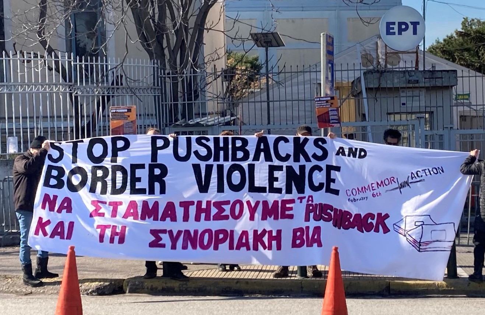
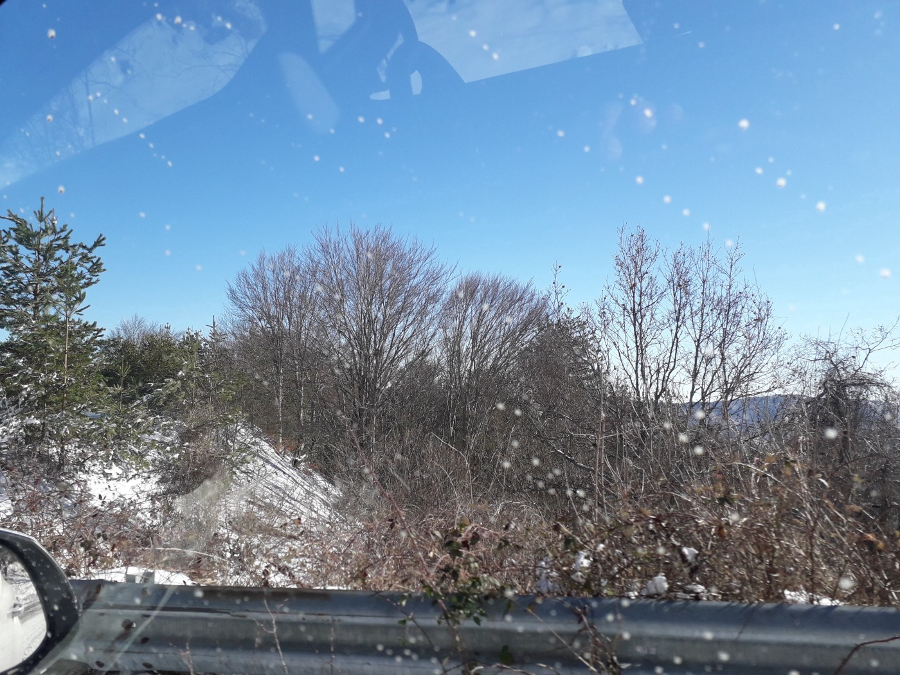
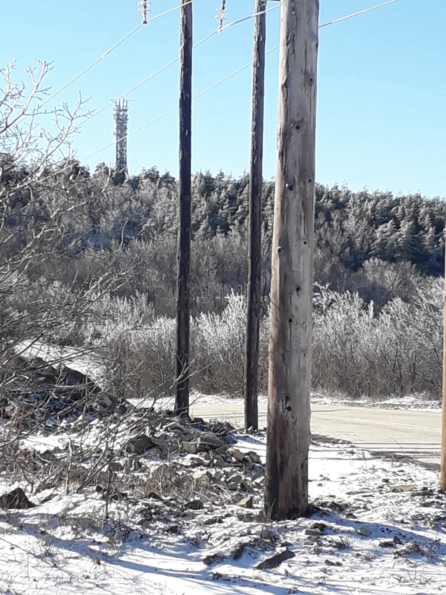

### AYS Special from Greece: “I cannot swim\.”

[Are You Syrious?](?source=post_page-----bf1b1bd091eb-----------------------------------)

[Feb 6](ays-special-from-greece-i-cannot-swim-bf1b1bd091eb?source=post_page-----bf1b1bd091eb-----------------------------------) · 5 min read

_Today is a global day of [CommemorAction](https://twitter.com/alarm_phone/status/1486981418626527232) for people who have died, gone missing or forcibly disappeared on their journeys across borders\. In Greece and throughout the world there will be acts of commemoration and resistance at the end of a week that has seen two further reports of violent deaths at the border\._

\(Banner in Athens\. Photo Credit: [International Kurdistan Committee](https://twitter.com/StopPushbacks) \)

‘I cannot swim’ were the last words of a young man before he was thrown overboard by the Hellenic Coast Guard into the Aegean on the 31st of January 2022\. He has been missing since\. Below is the video of his cousin’s testimony\. They were given life jackets too small for them and left in the water\. His cousin believes that he has drowned\.

Further reports of [19 deaths](https://www.aa.com.tr/en/europe/germany-urges-probe-after-19-migrants-found-dead-at-greek-turkish-border/2493032) came through on 2nd and 3rd February 2022 at the Greek\-Turkish land border in the Evros Region\. [They had died of exposure, having had their clothes and shoes taken from them](https://www.bbc.com/news/world-europe-60229206) \. Greece and Turkey both blame each other for their deaths and are using these lost lives to further political aims on both sides\. The remains were found on the Turkish side of the border, suggesting that they had been pushed back from Greece\. The Migration minister, Notis Mitaraki, continues to deny that pushbacks and border violence take place\.

> _In cases of pushbacks in the Aegean, where people are left adrift on life rafts, or are pushed into the river in the Evros region, this violence can be understood as attempted murder\. This violence is not limited to border regions, but extends throughout the territory, as people are abducted and subsequently pushed back from deep in the interior of the territory and in urban centers\. The perpetrators are Greek police officers, border guards, military officers, and their co\-conspirators\. They are supported by the Greek state, ministry of migration, and other government institutions that either deny that pushbacks are happening, or deny their illegality\. — **Open Assembly against Pushbacks and Border Violence Press Conference**_ 

\(The hilly areas of Evros, between the villages of Aisymi and Megalo Dereio, in mid\-January\. Photo Credit: [Lena K\.](https://twitter.com/lk2015r/status/1489254605712068609/photo/2) \)

During the press conference of the Open Assembly against Pushbacks and Border Violence, three people narrated their personal experiences of pushbacks, all of which included experiences of having clothes and shoes taken by border police, just as happened to the people who lost their lives this week in Evros\. They all had their possessions taken, were beaten and were forced into small boats to cross back into Turkey over the Evros river\. They are all lucky to be alive\.

> _By using a lot of violence against them, they make them know that they are not welcome in Greece — Dimitris Choulis_ 

Dimitris Choulis, a lawyer from Samos, stated that he is currently dealing with a case of two men who were raped by border police using their truncheons before being pushed back to Turkey from Samos\. In another case, a woman miscarried in the forest after arriving\. After she sought help in a village and the police came, they directly pushed her back to Turkey\. He described the situation thus:

> _A government who gives the special forces power to decide who lives and who dies, who will go safely into the country, who will claim asylum\. who will be humiliated in front of their children, who will be raped\._ 

None of these cases are isolated events\. In 2020, Parvin, a young woman from Iran, crossed the Greek\-Turkish border seven times; six times across the Evros/Meriç river and once over the Aegean Sea\. She was arrested and pushed back six times\. [Forensic Architecture](https://twitter.com/ForensicArchi) , together with Human Rights 360 and ECCHR Berlin, have completed [a full reconstruction of her journey\.](https://forensic-architecture.org/investigation/pushbacks-across-the-evros-meric-river-the-case-of-parvin?fbclid=IwAR18jfkNUBn0Yk5b4ysSn7IxbWooTU7ki92lQzNA_utk13a-H2_-EZKZzdM)
### Why Turkey is not Safe

And if people are pushed back to Turkey, what will happen to them? For Kurdish people this is a particularly important question, as [activists, journalists and members of the HDP party continue to experience enforced disappearances and imprisonment](https://www.hrw.org/world-report/2022/country-chapters/turkey) \. There are frequent reports of torture and deaths in custody\. Many people are still displaced from [the burning of Kurdish villages and massacres by Turkish forces during the 1990s](https://www.nytimes.com/2003/10/24/world/kurds-are-finally-heard-turkey-burned-our-villages.html) and more recent military conflicts\. For other nationalities, the situation is also dangerous with a rise in racist and xenophobic attacks against foreigners, the degradation of rights for women and LGBTQI\+ people and [a high instance of child labour](https://reliefweb.int/report/turkey/gender-sensitive-study-urban-child-labour-istanbul) \. [Turkey only ever offers temporary protection to people who flee to the country](https://asylumineurope.org/reports/country/turkey/temporary-protection-regime/qualification-temporary-protection/cessation-temporary-protection/) , not refugee status\. Temporary protection can be easily rescinded and does not offer the chance of a stable life\.
### What can we do?

> _We do protest but we cannot get much support\. — [Parwana Amiri](https://twitter.com/parwana_amiri)_ 

People on the move have been organising against conditions in camps, lack of access to education, pushbacks and the fast\-track asylum process \(Turkey interview\) and more, but as camps in Greece have become increasingly closed, they struggle to have their voices heard and to connect to local movements\. Amplifying these struggles, documenting these violent crimes against unarmed people, raising our voices together, are steps we can all take\.

How long can a state kill people at its border without intervention or complaint from its people or from external countries and institutions? As long as they are allowed to\. Pushbacks are illegal under national and international law\. People perpetrating pushbacks use tactics legally identified as torture\. Pushbacks kill\. Pushbacks must and will stop\.

**_Article by Emma Musty, AYS_**

**Find daily updates and special reports on our [Medium page](https://medium.com/are-you-syrious) \.**

**If you wish to contribute, either by writing a report or a story, or by joining the info gathering team, please let us know\.**

**We strive to echo correct news from the ground through collaboration and fairness\. Every effort has been made to credit organisations and individuals with regard to the supply of information, video, and photo material \(in cases where the source wanted to be accredited\) \. Please notify us regarding corrections\.**

**If there’s anything you want to share or comment, contact us through Facebook, Twitter or write to: areyousyrious@gmail\.com**

_Converted [Medium Post](https://medium.com/are-you-syrious/ays-special-from-greece-i-cannot-swim-196079f4e48e) by [ZMediumToMarkdown](https://github.com/ZhgChgLi/ZMediumToMarkdown)._
