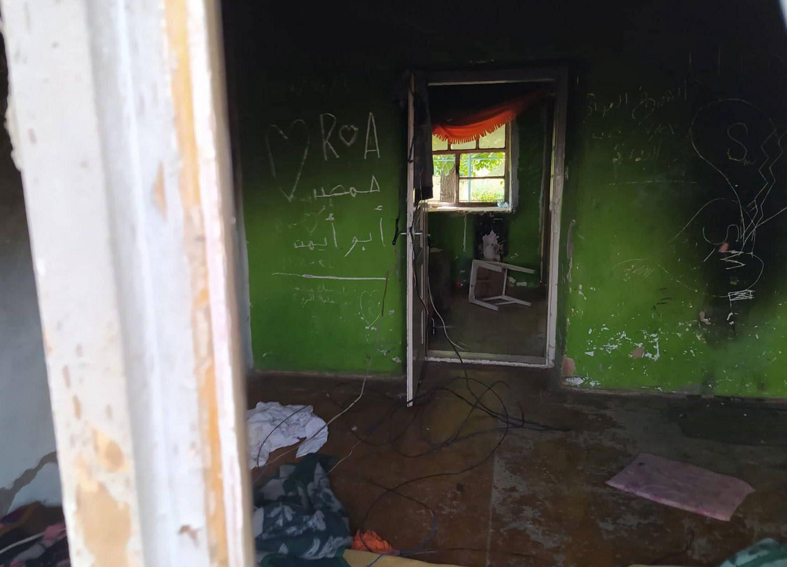
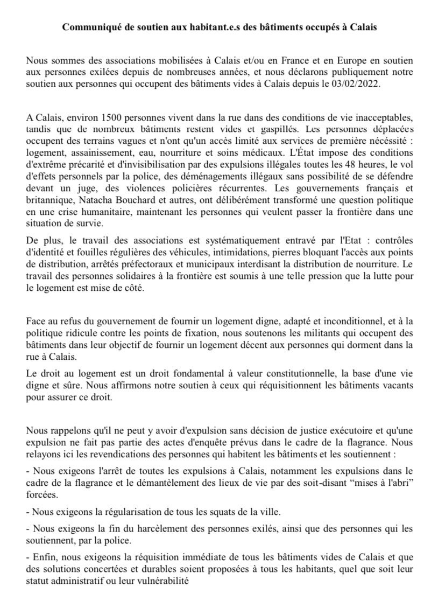
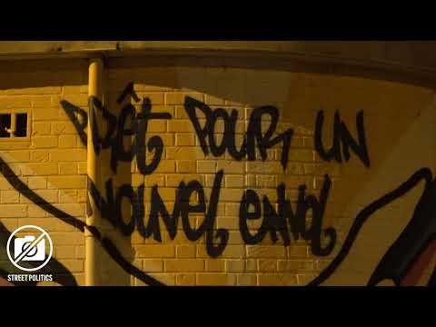
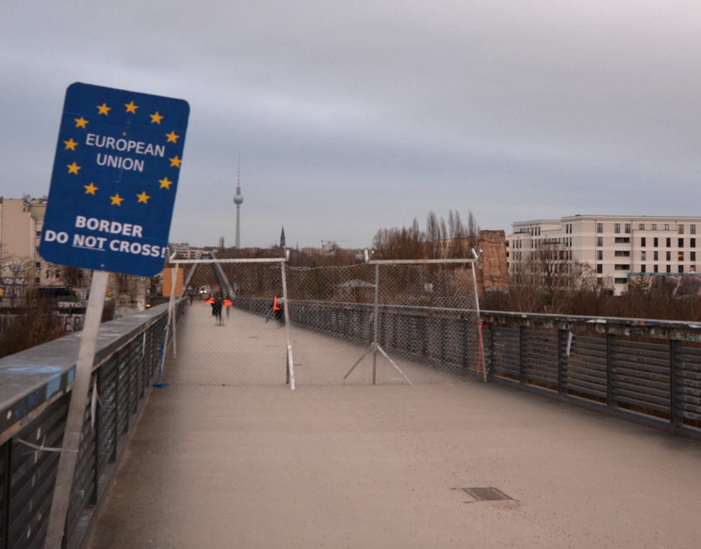
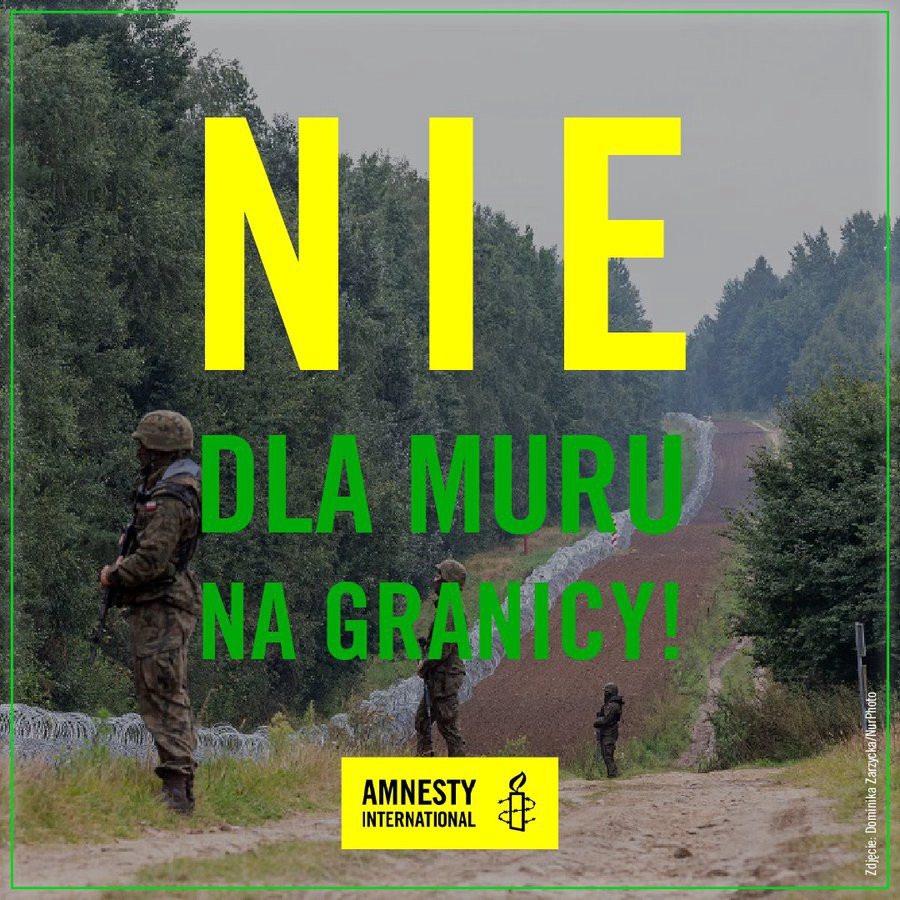

### AYS News Digest 9/2/22: Precarious situation at Serbian/Romanian border

Greece accused of torture and dangerous living conditions // EU funds spent on food for people who don’t exist // Support free journalism in Greece // Draconian food rules in Serbia // Two new occupations in Calais // Protests in Germany // Poland\-Belarus border updates // Frontex…\.

Photo taken by Klikaktiv’s team and the copyrights are with Klikaktiv
#### Precarious situation at Serbian/Romanian border

**In the period from July 2020 to November 2021, the situation at the Serbian\-Romanian border has drastically changed and has not yet been documented extensively\.**

A report published by KlikAktiv and ProAsyl analyses cases of push\-backs on the Balkan refugee route, more specifically on the border between Romania and Serbia\. KlikAktiv collected testimonies describing the push\-backs of 3,700 people on the move in the period between July 2020 and November 2021\.

Over the reporting period \(July 2020 — November 2021\), KlikAktiv’s team regularly visited the villages of Majdan and Rabe at the border triangle of Hungary, Romania and Serbia, which are the main spots for border crossings for people on the move\. Also, there are several squats \(self\-organized residential spots\) in these villages, since there are no official government accommodation facilities in this area\.

**Police encourage people to go to the “Game”**

Despite a large police presence in both villages, people on the move are not being provided with any assistance by Serbian authorities, nor are they granted access to the Serbian asylum procedure\. People are not being informed about their rights, options for seeking asylum, or the consequences of their illegal residency in Serbia\.

The report also gives an overview of the developments along the Romanian\-Serbian border from the early establishment of this route in June 2020 until the present day\. Over the reporting period, the number of illegal pushbacks has increased, as has the violence perpetrated by the Romanian police\. In 2021, Romanian police officers used different methods of beating, humiliating and threatening people on the move\.

In October and November 2021, people on the move also reported the presence of Frontex officers on Romanian territory, near the border with Serbia\. Even though most people on the move pursuing this route come from Syria and Iraq and are clearly in need of international protection, Romanian authorities never allow them access to the national asylum procedure, but instead return them illegally to the territory of Serbia\.
#### GREECE
#### Greece accused of torture

An Iranian woman, now living in Germany, has taken a claim of torture, abuse and pushbacks against Greece to the UN Human Rights Committee\. It all started with a pushback at Evros\. Read the whole story [here](https://l.facebook.com/l.php?u=https%3A%2F%2Fwww.infomigrants.net%2Fen%2Fpost%2F38319%2Fmy-name-is-parvin-iranian-woman-files-claims-of-torture-and-abuse-against-greece%3Ffbclid%3DIwAR0z239BpJkrQGF9YxceGTxogfXHnBZoFtrvAkLkzrqOQMFvRXosfC9ueYU&h=AT2ASu-9bs_kdOeXheYMZI26vi6UKmDIhrwKZuiUOqhTLuKAiFH-3OFSRCBj_KG3Km-ICKcN0sZwlxqntZtrcLTaq5ollKAR34epUYZhfIFu8muJ1eZX2gEcPJm0plC6mmRESdv6PXASUizwU_IMSi_kIONT-A&__tn__=R]-R&c[0]=AT34VHIbf8XTLm_wfFzlqAwHRo3QJhhn4ygcST8tUO7gO1izYKkIWStRKyrAKjA93bi68g_ftmMTbdFnvQVh-7XaSteITgsVGsjTAYuOinPUkJXqE_JjHd2v0eQ0dv6D1IRdw6-hBBPUTp2alVMxv6dlrWGHpEW_p1gQhMdW6c8DyvMJkc07A7xUB_QqXD8ml7Hd41HAYY6Ipw71caU) \.
#### Syrian family wins in Greek court

> In a landmark decision, a Thessaloniki court has vindicated a family of Syrian asylum seekers, awarding damages payable by the state, after a fire at their camp in 2016 severely injured the family‘s eight and five\-year\-old children\. 

> The Court rejected state arguments that the refugees themselves, and not the authorities, were responsible for the cause of the fire \(a short circuit in their tent\) and asserted the state‘s legal obligation to provide adequate and safe reception conditions\. The family is now in Germany, reunited with their father\. Their case was handled by Arsis\. The NGO’s lawyer told me they had found no legal precedent while preparing this case\. The Greek state will appeal the decision\. The facility where the fire broke out has since closed down, _writes [Giorgos Christides](https://twitter.com/g_christides) \._ 

#### Cheating on food

While many people in the government\-run camps are malnourished, it seems that some companies are reporting feeding people who are not there\. The Competition Commission imposed fines of €304,000 on the catering companies POT & PAN, TZANETOS, SALAS, and PLIADES, which provided catering services to refugee accommodation structures\. The companies admitted their participation in a “horizontal cartel”\. In the context of a series of reports on the squandering of European funds for food in hospitality structures, these companies were also the focus of a report examining the situation starting in 2017\.

Contracts were signed in some structures to feed hundreds more refugees than were actually there\. Moreover, companies secured food contracts for a structure that was [not even operational](https://t.co/QMB0zbLgAa) \.

What really was \(and to a large extent still is\) true about the food provided in the accommodation structures:

#### Support free journalism\!

■■■■■■■■■■■■■■ 
> **[RSF in English](https://twitter.com/RSF_en) @ Twitter Says:** 

> > #Greece: @[RSF_inter](https://twitter.com/RSF_inter) condemns the intimidation of @[reporters_gr](https://twitter.com/reporters_gr) & @[we_are_solomon](https://twitter.com/we_are_solomon) for their stories about spending #EU funds for asylum policy. The incriminated NGO Hopeten sent them pre-litigation warnings, although the journalists’ work is in the Greek & European public interest https://t.co/DIjFePexZa 

> **Tweeted at [2022-02-08 14:21:31](https://twitter.com/rsf_en/status/1491054592066420740).** 

■■■■■■■■■■■■■■ 

#### SERBIA
#### Queue for food or lose it for a day

APC team reports that in Adaševci, most complaints from people on the move are about the lack of hot water and hygiene products, as well as the lack of blankets and the cold, if they are staying in tents\.

Also, at 9 pm every day, there is a kind of “line\-up”, and if someone is not present at that moment, he loses the “bread paper”\. Then the person will not have access to food for the whole day\.

Security violence was present six months ago, especially in the form of punishment, in a special room, next to the administration office, as described by persons from Afghanistan at the time\. We had no reports of violence at this time, their teams reported\.
#### FRANCE
#### Occupied space blocked by the police

2 buildings have been opened in recent days and are currently occupied in Calais\.

However, [Auberge des Migrants](https://twitter.com/AubergeMigrants) reports that the police has besieged the building previously occupied by Calais Logement, as we reported in earlier News Digests, to prevent any water and meal supplies\.

This seems to be their constant practice, preventing any initiatives in solidarity with the people stuck in the area with no support or system to provide basic amenities for them\.

Photos: Auberge des Migrants

32 French migrants’ rights organisations have signed a letter condemning the violence and mistreatment of migrant men, women and children in Northern France, created by the terms of the Le Touquet agreement that externalises the UK border to Calais\.
#### GERMANY
#### Protests In Germany

 \)](assets/bdf11db98d9d/1*zK5n8us6Ng69J1XgZFqJ0A.jpeg)

\(Photo Credit: [No Border Assembly Berlin](https://de.indymedia.org/node/173534) \)

On 8 February, to highlight the new border fence between Poland and Belarus, built for several million euros, activists have constructed their own border fence in the “heart of the beast” in order to:

> disturb and irritate the people of Berlin in their happy ignorance of the realities at the EU’s external borders\. 

They built it at the former inner\-German Wall border crossing on Schwedter Steg\.

 \)](assets/bdf11db98d9d/1*43NFt4SS-G7-eFNNwlEMIg.jpeg)

\(Photo Credit: [@Abschiebez\_BER](https://twitter.com/Abschiebez_BER) \)

Another protest was held on 9 February in Berlin against the new deportation centre planned in the city\. They highlighted the number of jobs which will be necessitated by the new complex\.

> Gate Building: 40–60 Arrivals Building: 60–70 Courthouse: 20–30 Transit Buildings: 8–10 Detention Building: 35–40 Supply Buildings: 20–30 Repatriation building: 90 We won’t allow that\! 

#### POLAND

Grupa Granica warns about the populist move of border guards who published how they ensure safe pathways for the buffalos that walk from the Belarus side to the Polish one:

■■■■■■■■■■■■■■ 
> **[Grupa Granica](https://twitter.com/GrupaGranica) @ Twitter Says:** 

> > Żubry nie potrzebują drutu kolczastego, wojska ani @[StrazGraniczna](https://twitter.com/StrazGraniczna) 🤷🏻‍♀️ Cyniczne poprawianie wizerunku przez pokazywanie jak „witacie” Państwo żubry w 🇵🇱, nie zmienia faktu, że @[Straz_Graniczna](https://twitter.com/Straz_Graniczna) jest odpowiedzialna za wypychanie setek osób, kobiet i dzieci, chorych, za te same druty 

> **Tweeted at [2022-02-09 12:55:40](https://twitter.com/grupagranica/status/1491395372887191552).** 

■■■■■■■■■■■■■■ 

### \#NieDlaMuru\!

More than 21 organizations presented the EU Commission in Poland with three appeals: a letter from scientists, an appeal by local communities, and a list of over 150 organizations — all calling for the cessation of the construction of the border wall\.

You too can now sign Amnesty International’s petition against the wall in the forest area between Belarus and Poland:

#### EU/FRONTEX
#### Johansson’s Reality Paradox

Ylva Johansson [surpassed herself on Tuesday](https://twitter.com/saracreta/status/1491110734859669506?fbclid=IwAR0PsC6bCEwYPc5B8gFNIajPHUPyZZso_POl2bRF-z4d3pwkC8Q_ksyItD8) when she told Irish MPs: “I don’t need to tell you that building walls & barbed wire fences is not the way forward for the [\#EU](https://twitter.com/hashtag/EU?src=hashtag_click) ” — and a few minutes later “we need to invest in better equipment for border protection”\. Ta da\!

Meanwhile, Executive Director of Frontex Fabrice Leggeri has had three vice directors to work with since October\. The increasingly all\-powerful agency [deported 40 Albanians from Spain and Italy on 25 January](https://www.jungewelt.de/artikel/420222.grenzregime-macht-ohne-grenzen.html) using the EU delegation in Tirana to obtain the necessary documents and permissions for the mass deportation\. Their “European Return Centre” is headed by German federal police officer Lars Gerdes, “Deportation Director”\. It offers Member States a “complete range of services” for deportations\. Gerdes previously headed [the Federal Police’s training mission in Afghanistan](https://www.migazin.de/2022/02/08/neue-abteilung-frontex-deutscher-polizeidirektor/) \.

The agency is now using satellite surveillance under Operation Copernicus to carry out activities including detecting boats and observing refugee camps, [yet all the information relating to their work in this area is heavily redacted](https://twitter.com/matthimon/status/1491049586689212417?fbclid=IwAR1D11dlv1nPA3OYuMseHuhG14ALT5IikGQQgzZKw7sus0lQ8K1h0sPM0ko) when requested through freedom of information requests\.
#### Pushbacks

While Europe continues to support the Libyan Coast Guard and has spent € [450 million to teach them about human rights](https://twitter.com/RescueMed/status/1491331322224451587?fbclid=IwAR2pQjl-_Of_iOVOsv-ocFp0lTqJRw0DNOe3RmrElH97e9rjpZxzt5XPVBA) , the Border Violence Monitoring Network, of which AYS is a member, has handed over the latest instalment of the Black Book of Pushbacks to France ahead of their EU Presidency\.

■■■■■■■■■■■■■■ 
> **[Amandine Bach](https://twitter.com/AmandineBach) @ Twitter Says:** 

> > Thanks to the incredible work of @[Border_Violence](https://twitter.com/Border_Violence), @[ASPelletier](https://twitter.com/ASPelletier) presented yesterday to French Home Affairs minister the Black book of push backs, @[GDarmanin](https://twitter.com/GDarmanin) replied that they are against push backs, let's see then how French presidency will ensure this practice ends #timetoact 

> **Tweeted at [2022-02-08 19:38:54](https://twitter.com/amandinebach/status/1491134463090491392).** 

■■■■■■■■■■■■■■ 

#### WORTH READING
- [**All sails set for more of the same: Leaked EU Document on the Operational Coordination Mechanism for the External Dimension of Migration**](https://migration-control.info/all-sails-set-for-more-of-the-same-leaked-eu-document-on-the-operational-coordination-mechanism-for-the-external-dimension-of-migration/?fbclid=IwAR1tg65zyG49wJCEJT4OpgQheWj9SYP2HvKYAQO_p5cOT6RfgkPmLNmqUo4) **—** _A new Council cooperation mechanism on the EU’s external dimension is foreseen for launch in 2022\. A [leaked document](https://migration-control.info/wp-content/uploads/2022/01/Mecanisme-operationnel-de-coordination-des-actions-pour-la-dimension-externe-des-migrations.pdf) obtained by migration\-control\.info shows that the mechanism reproduces wider trends that have shaped the EU’s external dimension for years\._
- [**Europe Expands Virtual Borders to Thwart Migrants**](https://spectrum.ieee.org/remote-sensing-of-migrants) **—** _Our investigation reveals that Europe is turning to remote sensing to detect seafaring migrants so African countries can pull them back_
- A shocking letter from Tiba, a teenager from Iraq who has been refusing to eat for almost a month to protest the way she and her family are being held in the Guarded Center for Foreigners\. The story of Tiba and her journey also shows what a nightmare the road to Poland is\.

- Another report on the dramatic living conditions in Guarded Centers for Foreigners\. “Every three days someone tries to hurt himself,” say those in Wędrzyn:

- Documentary about Parwana Amiri:

■■■■■■■■■■■■■■ 
> **[2Doc.nl](https://twitter.com/2Docnl) @ Twitter Says:** 

> > Onverschilligheid, dat ziet vluchtelinge Parwana Amiri (17) om zich heen. Door haar activistische gedichten te delen op sociale media, brengt zij lotgenoten bij elkaar. 
▶️Kijk ‘De muze van Moria’ nu online of ma 7 feb 22.45, NPO 2 [2doc.nl/muzevanmoria](http://2doc.nl/muzevanmoria) #spokenword #moira #2doc https://t.co/lZ7gqhhhPf 

> **Tweeted at [2022-02-07 16:00:01](https://twitter.com/i/status/1490716989647695873).** 

■■■■■■■■■■■■■■ 

**Find daily updates and special reports on our [Medium page](https://medium.com/are-you-syrious) \.**

**If you wish to contribute, either by writing a report or a story, or by joining the info gathering team, please let us know\.**

**We strive to echo correct news from the ground through collaboration and fairness\. Every effort has been made to credit organisations and individuals with regard to the supply of information, video, and photo material \(in cases where the source wanted to be accredited\) \. Please notify us regarding corrections\.**

**If there’s anything you want to share or comment, contact us through Facebook, Twitter or write to: areyousyrious@gmail\.com**

_Converted [Medium Post](https://medium.com/are-you-syrious/ays-news-digest-9-2-22-precarious-situation-at-serbian-romanian-border-bdf11db98d9d) by [ZMediumToMarkdown](https://github.com/ZhgChgLi/ZMediumToMarkdown)._
