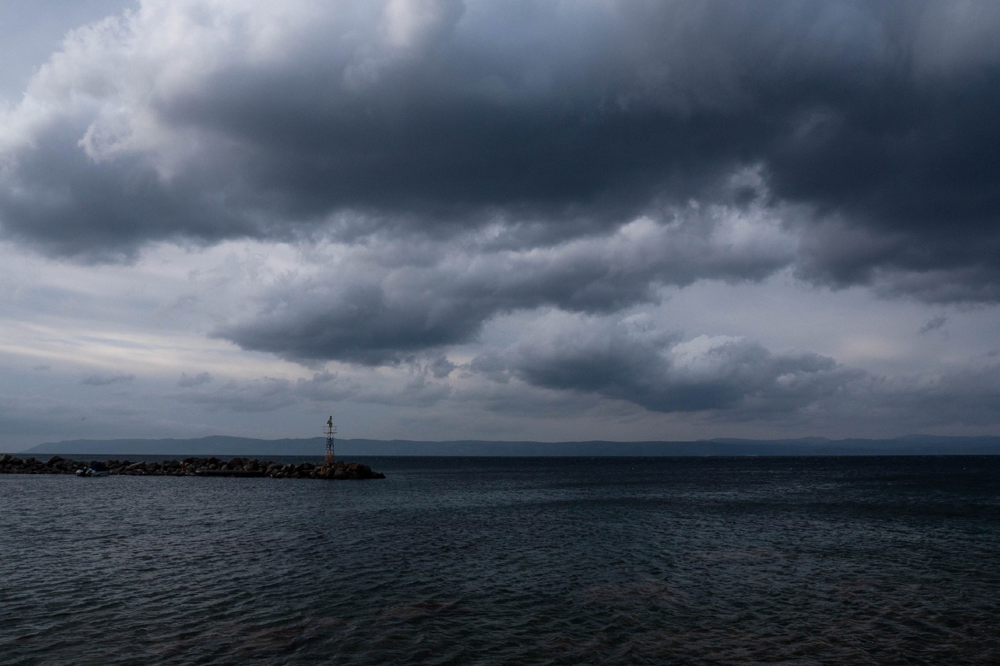

### AYS News Digest 18/02/22: Two men thrown overboard by Hellenic coastguard and drowned highlight a new brutal pushback practice
#### **Frontex to assist in Cypriot deportations / Inhabitants of Białowieża Forest denounce a “lawless zone” / Afghans facing destitution and uncertainty / News and recommended reads from our Info Team members**

The stormy Aegean sea, with Turkey on the horizon
### **FEATURE**

An investigation coordinated by Lighthouse Reports has looked into the deaths of two men, from Ivory Coast and Cameroon, whose bodies washed up on Turkish shores in September 2021\. The research confirms accusations that **the men were thrown into the Aegean sea by members of the Hellenic coast guard** without any liferaft or lifejacket, after having arrived on the island of Samos\. Throwing people overboard and telling them to swim to Turkey is becoming a regular practice of the coastguard, whistleblowers [told the journalists](https://www.theguardian.com/global-development/2022/feb/17/its-an-atrocity-against-humankind-greek-pushback-blamed-for-double-drowning) : public tenders for new liferafts to replace those used for illegal pushbacks might raise questions\.

The testimony of Ibrahim \(an alias\), a former member of the Cameroonian navy, was central to piecing together what happened to the two deceased men, Sidy Keita and Didier Martial Kouamou Nana\. On 15 Septembers 2021, a group of 36 people crossed from Turkey to Samos, and were immediately found and arrested by Greek authorities\. Eight people managed to hide in the bushes\. The others were beaten, strip\-searched and violently pushed back at sea on two engineless liferafts\.

Among the eight who escaped, four made it to Vathy camp\. One woman was arrested by the police and cast out to sea alone on a small dinghy\. Ibrahim, Keita and Kouamou were arrested on 16 September\. Ibrahim testified that they were loaded onto a speedboat and pushed into the sea\. He was the only one who could swim, and made it to the Turkish shore\. Keita and Kouamou both drowned\.

■■■■■■■■■■■■■■ 
> **[Lighthouse Reports](https://twitter.com/LHreports) @ Twitter Says:** 

> > They were then taken out to sea towards Turkey &amp; thrown overboard without life vests. Our team verified his accounts using open source evidence. Fully breakdown on methodology here
[twitter.com/JackSapoch/sta…](https://twitter.com/JackSapoch/status/1494246063028551680?s=20&t=CoJoNXhrzXkGupWE23kY3g) 

> **Tweeted at [2022-02-17 10:40:57](https://twitter.com/lhreports/status/1494260572430512130).** 

■■■■■■■■■■■■■■ 

According to asylum\-seekers, NGOs and Turkish authorities, people were thrown overboard and told to swim to Turkey in at least 29 instances since May 2021\.

The Greek government, as usual, has [denied all the accusations](https://twitter.com/lk2015r/status/1494706932187381761?fbclid=IwAR2PQP2iyxzqJCvZR3JZY5dyXzvdywA7PhCFomVzzR_bvRIVlKtrm-6cjTk) , calling it “Turkish propaganda”\. The Hellenic coastguard published a statement saying, “The practices described and attributed to operational assets and personnel of the coastguard do not correspond with our operational processes in deterring non\-authorised border crossings, or dealing with third country nationals during the surveillance of sea borders” — but didn’t specify what these “operational processes” to deter border crossings consist of …

[Read more](https://www.lighthousereports.nl/investigation/aegean-pushbacks-lead-to-drowning/) about this investigation\.

Coinciding with the publication of these findings, a French\-Turkish woman is suing Greece, saying she was violently pushed back while trying to flee political persecution in Turkey\. The woman, who was studying in Turkey, was accused by Turkish authorities of being a member of a terrorist group\. As she was issued with a travel ban, she decided to cross the Evros river into Greece with her husband\. Despite showing her French papers and desperately contacting the French embassy and consulate in Greece, the couple were forced back across the river with a group of other asylum\-seekers\. They are now imprisoned in Turkey\.

Although violent and illegal pushbacks are common practice, **it is the first time that one of its victims is a European citizen** \.

> “\(It\) should give pause to European citizens everywhere to think about what these policies are doing to us, as well as to the people we’re trying to keep out,” Catherine Briddick, a lecturer in International Human Rights and Refugee Law at Oxford University, [told the Associated Press](https://apnews.com/article/middle-east-france-prisons-greece-europe-1c58212ff10310deebae2b769d31e386?utm_medium=AP_Europe&utm_source=Twitter&utm_campaign=SocialFlow) \. 

### **CYPRUS**

**Frontex to assist in deportations**

Frontex head Fabrice Leggeri announced that the agency is ready to facilitate flights to deport people whose asylum claims have been rejected\. At least 1,000 people have arrived in the southern, European part of Cyprus since the beginning of this year, including 100 people who [crossed the buffer zone dividing the island on Wednesday](https://www.infomigrants.net/en/post/38604/cyprus-over-100-migrants-cross-buffer-zone-in-one-night?fbclid=IwAR3FUBVFbYI_9YXNA8_B71qwmwEGbtM4l0kif4D4nsOotzhx_DX6CWBDty8) \. While these numbers are generally small, the Mediterranean island now has the highest ratio of asylum\-seekers to the population: 4\.6% of the country’s population currently are asylum seekers or beneficiaries of protection, according to the Cypriot Interior Minister\.

Cyprus was split in 1974 when Turkey invaded the North following a coup aiming at a political unification with Greece\. The island is now divided by a UN\-administered buffer zone, a no\-man’s land eight kilometers wide which asylum\-seekers need to cross to seek protection in the South\. Last year, 12,000 people arrived to seek asylum in the southern country of 1\.2 million people\.
### **POLAND**

**Inhabitants of the Białowieża Forest denounce a “lawless zone”**

People living in the area close to the border with Belarus have protested the construction of the wall which is supposed to cut through the protected Białowieża forest\. They say their rights have been violated ever since an emergency zone was established in September to stop thousands of people trying to cross the border\. The locals now [have to live](https://www.tokfm.pl/Tokfm/7,103085,28116807,strefa-bezprawia-tu-jest-cos-osobnego-od-polski-na-pograniczu.amp?fbclid=IwAR0DqqjXOp85ckyffA0RTk5U1XvgGrKQe8uYN9EpBYFT1dehNw3iJracoa0) “according to the whims” of the authorities\.
### **UK**
#### **Afghans risk destitution after delays issuing new visas**

Thousands of Afghans who were evacuated to the UK after the Taliban takeover are now at risk of falling under the Home Office’s “hostile environment” regime because of delays in issuing new visas\. The temporary six\-months visas they were issued after their evacuation will expire in a matter of days, terminating their access to housing, to free NHS healthcare, opening a bank account or finding work\.
#### **Another proposal to send asylum\-seekers offshore**

■■■■■■■■■■■■■■ 
> **[Andrew Connelly](https://twitter.com/connellyandrew) @ Twitter Says:** 

> > Another day, another demented British proposal to magically make asylum seekers disappear by flying Channel crossers to fantasy islands. This time it's Policy Exchange's turn to put on the dystopian wizards' hat 1/ [thetimes.co.uk/article/send-c…](https://www.thetimes.co.uk/article/send-channel-migrants-ascension-island-report-urges-3tdp7svn5) 

> **Tweeted at [2022-02-16 14:44:38](https://twitter.com/connellyandrew/status/1493959510381285381).** 

■■■■■■■■■■■■■■ 

### SPAIN

**Wrongly deported unaccompanied minors to be returned**

A judge in Ceuta has ordered 14 unaccompanied minors to be returned to Spain, after the government illegally deported them to Morocco in August\. The expulsion of the minors neglected “all procedures” and put them at risk, [the ruling foun](https://www.eldiario.es/desalambre/juzgado-ceuta-ordena-gobierno-retornar-espana-menores-devueltos-marruecos-agosto_1_8758319.html?fbclid=IwAR0q1MdC8g4Ib6itm3Ulke4GUHi2264WsnRr9SXwnyC1EM5VNxt9TbuFLUU) d:

> “There has been no initiation of proceedings, no request for reports, no allegations phase, no hearing, no evidence phase, not even a resolution agreeing to the repatriation of the minors, i\.e\. there is no trace of any repatriation file\.” 

### DENMARK

**Afghans facing uncertain status**

After Syrians, Afghans seeking refuge in Denmark are now [facing an uncertain future](https://www.aljazeera.com/features/2022/2/17/afghan-syrian-refugees-face-uncertain-future-in-denmark?fbclid=IwAR0hz3__PZebVAjoU0kFWxDiUKu7xA9tHkiygsC4eZvld6kL4VchJ1omiXU) , as they have been told their asylum would only be granted for two years\. A total of 956 people were evacuated from Afghanistan to Denmark in August 2021, and the temporary protection status leaves them concerned and unable to build a life in the country — especially when over 100 Syrians have seen their asylum revoked in recent months\.
### **SWITZERLAND**

**Concerns for transfers to Italy**

The Swiss Refugee Council has [urged](https://www.infomigrants.net/en/post/38647/switzerland-urged-to-stop-transfers-of-vulnerable-asylum-seekers-to-italy?fbclid=IwAR2h21nr1spF0Lk-mMoITN1GyJG357fOqHs4uQjOKHvwAyCs2cemLpYClHQ) Switzerland to stop transferring vulnerable asylum\-seekers back to Italy, where their reception conditions are very precarious\. The NGO raised concerns especially about the treatment of people with mental health issues\.

**Conditions in deportation centres violate children’s rights**

The Swiss National Commission for the Prevention of Torture also [released its findings](https://ecre.org/switzerland-kids-suffer-in-deportation-facilities-government-lambasted-over-afghan-humanitarian-visas-initiative-to-welcome-refugees-at-local-level-warnings-against-dublin-transfers-to-italy/?fbclid=IwAR2mQXWi_OG7wMjHaIOqTebAn_z1371Fsaxqk6k6-37mUSoznQPaeXBmlME) after visiting three deportation centres accommodating families with children before their removal: the centres were found to be “run down with outdated infrastructure”, and in violation of children’s rights to decent living conditions\.
### TUNISIA

**Protests in front of UNHCR**

Displaced people have been demonstrating for eight days in front of UNHCR offices in Zarzis and Medenine, in southern Tunisia\. They are protesting the increasing expulsions from reception centres and denounce their abandonment by UNHCR\.

■■■■■■■■■■■■■■ 
> **[Alarm Phone](https://twitter.com/alarm_phone) @ Twitter Says:** 

> > Personas refugiadas en #Túnez se manifiestan frente a las oficinas del #ACNUR desde que fueron expulsadas de los centros y viviendas de acogida hace 8 días. ¡Nosotres y muches otres nos solidarizamos con las personas refugiadas en Túnez!
[alarmphone.org/es/2022/02/18/…](https://alarmphone.org/es/2022/02/18/cuando-acnur-tunez-echa-a-la-calle-a-las-personas-refugiadas-como-si-fueran-basura/) 

> **Tweeted at [2022-02-18 15:44:17](https://twitter.com/alarm_phone/status/1494699296310005761).** 

■■■■■■■■■■■■■■ 

### BALKANS

[ECRE weekly report](https://ecre.org/balkan-route-new-croatian-pushback-revelations-mistreatment-of-people-in-transit-states-block-afghans-but-declare-hospitality-vis-a-vis-ukrainians/?fbclid=IwAR2qcZ-aqe4hywcsgSv3IMKDBUxPxruQW2KWpx_r5ZohhVRbdzc77EusgCA) : New Croatian pushback revelations, Mistreatment of people in transit, States block Afghans but declare hospitality vis\-à\-vis Ukrainians\.

And BVMN’s [January report is also out](https://www.facebook.com/borderviolencemonitoring/posts/1338697683311555) , including 29 testimonies of pushbacks impacting 344 people across the Balkans\.
### HUNGARY

**Increasing crossings defy Orban’s fortress**

Increasing numbers of people are crossing to Austria through Hungary, despite Viktor Orban’s harsh anti\-immigration stance\. Frontex recorded 6000 people crossing the Western Balkan route in January, [an increase by 148%](https://uk.news.yahoo.com/despite-border-fence-hungary-route-142630918.html) compared to last year\.
### SEA/SAR

**Maltese SAR coordinator testifies on orchestrated pushback**

A Search and Rescue coordinator from the Maltese Armed Forces told a court that he had been ordered to send 52 people back to Libya in April 2020\. The case was brought by the asylum seekers against the Maltese State, after the Maltese authorities organized their rescue by a private Libyan\-registered fishing vessel, the Dar Al Salam, which then returned them to Libya\. The SAR coordinator [confirmed](https://timesofmalta.com/articles/view/rescue-coordinator-says-he-got-order-to-send-migrants-back-from.935065?fbclid=IwAR0Oo7XMqZYKMsPfCkZGBBngmeUhoLoxZ4Cb1wiKDWScHOZVnW6wsXg8mUM) that he had received the order from his chain of command\.

247 people will disembark in Pozzallo, after five days and five requests to maritime authorities by the Ocean Viking\. And while the Aita Mari has been released from quarantine, the Sea\-Watch 4 has just rescued 121 people\.
### EU \+ FRONTEX

**What about “Freedom of Information” ?**

Frontex is refusing to share 119 documents concerning their sharing of information with the Libyan coast guard to intercept boats in the Mediterranean\. Their \(cynical\) argument? Sharing these documents would put the lives of people on the move in danger …

■■■■■■■■■■■■■■ 
> **[Tineke Strik](https://twitter.com/Tineke_Strik) @ Twitter Says:** 

> > We requested access to all @[Frontex](https://twitter.com/Frontex) documents that prove data- or coordinate sharing of vessels in distress with the Libyan Coast Guard. This week, the Agency responded that they already hold 119 (!) of such documents for 2020 alone but refuse access. (1/3) https://t.co/SydogOXdiR 

> **Tweeted at [2022-02-17 16:34:46](https://twitter.com/tineke_strik/status/1494349614216105985).** 

■■■■■■■■■■■■■■ 

And in another show of cynicism, for Frontex “rescue” seems to mean “migration management”:

■■■■■■■■■■■■■■ 
> **[Matthias Monroy (@Mastodon)](https://twitter.com/matthimon) @ Twitter Says:** 

> > #Frontex ordnet #Seenotrettung dem "effektiven Migrationsmanagement" unter.

Besser hätte ich es auch nicht kritisieren können. 

> **Tweeted at [2022-02-17 17:56:51](https://twitter.com/matthimon/status/1494370273465876485).** 

■■■■■■■■■■■■■■ 

### GENERAL

**Rising displacement in coming years**

A [report by the Danish Refugee Council](https://drc.ngo/about-us/for-the-media/press-releases/2022/2/report-on-global-displacement?fbclid=IwAR0qP9KrVfLSFNDnjNiAp59SLelZPGDY9fIjPjxy-zeKIYzl-zF1pZubSYE) warns that displacement in 2023 will have doubled over a decade, reaching 35 million people displaced from their homes from 2014 to 2023\. In 2021, there was an increase of 30% in fatalities from conflict in the 26 countries covered by the report, while incidents of violence against civilians rose by 22%\. These numbers should, however, be taken with a pinch of salt, as future displacement is very complicated to predict\.
### EU, LIBYA

As European and African leaders met in Brussels on 17 and 18 February for the sixth European Union \(EU\) — African Union \(AU\) summit, two members of Lawyers for Justice in Libya [are calling](https://ecre.org/op-ed-the-eu-must-stop-trapping-migrants-in-libya-or-risk-complicity-in-crimes-against-humanity-and-war-crimes/?fbclid=IwAR2crxXtSwgxqvUG93q6AKGoBUQWeYxq7U-R1j3L96uIEWiRRvCjDGJcV3o) for the EU to stop trapping people on the move in Libya\. “Long overdue, today’s summit is a vital opportunity for leaders to address the desperate situation\. Continued inaction to correct damaging policies will confirm the EU’s complicity in crimes against humanity and war crimes,” they say\.
### WORTH READING
- Two interesting articles about the increased use of technology at the borders:

- A solidarity initiative as an alternative to the indignity of refugee camps:

- A podcast interview with journalist Matthieu Aikins about his book _The Naked Don’t Fear the Water: An Underground Journey with Afghan Refugees:_

**Find daily updates and special reports on our [Medium page](https://medium.com/are-you-syrious) \.**

**If you wish to contribute, either by writing a report or a story, or by joining the info gathering team, please let us know\.**

**We strive to echo correct news from the ground through collaboration and fairness\. Every effort has been made to credit organisations and individuals with regard to the supply of information, video, and photo material \(in cases where the source wanted to be accredited\) \. Please notify us regarding corrections\.**

**If there’s anything you want to share or comment, contact us through Facebook, Twitter or write to: areyousyrious@gmail\.com**

_Converted [Medium Post](https://medium.com/are-you-syrious/ays-news-digest-18-02-22-2-deaths-thrown-overboard-by-hellenic-coastguard-shine-a-light-on-new-228ca567c017) by [ZMediumToMarkdown](https://github.com/ZhgChgLi/ZMediumToMarkdown)._
