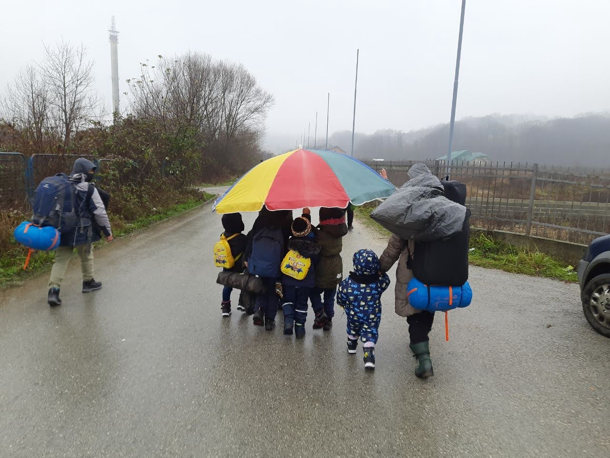
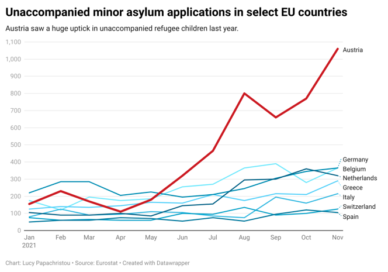

### AYS Special from Austria: **“It’s the beginning of a new crisis\.”**

_In Austria, asylum applications by unaccompanied children shot up last year\. Between incapacity and lack of political will, the country seems unable to cater for these children\. Left with little hope, a lot of them end up “disappearing”\._

An Afghan family walks through the rain in Velika Kladuša, northwest Bosnia, on their way to Western Europe in December 2020\. \(Photo: Lucy Papachristou\)

One day last spring, a 15\-year\-old boy named Mohammed was separated from his family somewhere in the forests of eastern Croatia\. That day the large Afghan family of about ten, including babies and older adults, had crossed over the border from Bosnia into EU\-member state Croatia in a bid to seek asylum in Western Europe\. But the family was caught by Croatian police officers in the forest\. In the confusion, Mohammed got separated from his relatives, who were pushed back to Bosnia\.

The teenager, however, managed to press on, reaching Austria via public transport and walking\. He applied for asylum and waited for his family to join him, according to his relatives\.

Mohammed is just one of thousands of unaccompanied minors, or UAMs, who have sought asylum in Austria\. While recent data shows that UAM arrivals increased in many European countries last year, in Austria the numbers shot up exponentially\.

While just over 150 children applied for asylum there in January 2021, by November that number had reached 1,060 children — a roughly 600% increase\. Other EU countries saw only minor increases in such applications\. \( [Europe\-wide data](https://ec.europa.eu/eurostat/databrowser/view/MIGR_ASYUMACTM__custom_2002825/default/table?lang=en) is only available through November 2021\. \) All asylum applications in the EU [increased slightly](https://ec.europa.eu/info/strategy/priorities-2019-2024/promoting-our-european-way-life/statistics-migration-europe_en#developmentsin20192018) last year after slumping in 2020 due to Covid\-19\.

Amid the sharp rise in refugee children arrivals, asylum experts in Austria fear that the vulnerable youths are arriving to a country that is ill\-equipped to care for and integrate them, and at a time when the political winds have shifted against migration as Europe [shores up its borders](https://www.aljazeera.com/news/2022/1/25/poland-begins-work-on-400m-belarus-border-wall-against-migrants) against incoming refugees\.

“After 2015 there has been such a focus on ‘managing migration’\. Governments are fixated on controlling every aspect of migration,” explains Wiebke Judith, a legal policy adviser at Pro Asyl, a large refugee rights nonprofit in Germany\.

> “For the group of people we want to represent and work for, this is quite problematic as there are almost no safe and legal pathways for refugees to the EU\. What it can turn to is that Europe tries — and I mean this is what they do — to really prevent all irregular crossings at the border and by that also prevent people from seeking protection in the first place\.” 

Most of the children who arrived to Austria did so by crossing borders irregularly, according to experts\. And while the numbers are stark, asylum experts don’t have a clear understanding of why so many children came last year\.

Looking at last year’s figures gives Katharina Glawischnig a feeling similar to the one she had in 2014, the year before thousands of people arrived in Europe\. Now, Austria finds itself at “the beginning of another crisis,” Glawischnig, a lawyer with Asylkoordination Österreich, an umbrella advocacy group of asylum lawyers and experts, says\.

> “We had Syria, and now we have Afghanistan\.” 

But this new crisis isn’t caused by the high numbers of arriving children\. Rather, Glawischnig says, it’s a crisis of management\.

> “We had more asylum seekers before and were able to manage them\. And now, \[the Austrian government\] are just not able to organize themselves,” she says\. “They said everything would be great and perfect\. And now we see they are not organized and not able to handle this\.” 

Theresa Lahr, an asylum lawyer representing UAMs for the city of Vienna, attributes the rise in children’s applications to long\-term instability in Afghanistan and a worsening situation in Syria\.

“Ninety to ninety\-nine percent” of the children who arrived in Austria last year were very young Syrians, some just eight or nine years old, Lahr says\. Many came via Albania with the aid of smugglers\.

“My personal guess is that the Albanian mafia got into smuggling a little bit,” Lahr says, noting, however, that this is “really just speculation”\.

Other popular routes to Austria run through Bosnia, Serbia and Bulgaria\. While such clandestine travel is dangerous for anyone, it is especially so for children\. At least 18,000 unaccompanied minors [disappeared along the way to Europe](https://www.theguardian.com/global-development/2021/apr/21/nearly-17-child-migrants-a-day-vanished-in-europe-since-2018) in 2018\.

Conditions for refugees in Austria have vastly improved in recent years\. At the height of Europe’s refugee crisis in 2015, newspaper headlines decried the [squalid, overcrowded Traiskirchen camp](https://www.usatoday.com/story/news/world/2015/10/12/austria-migrants-global-post/73806236/) , Austria’s largest, as thousands came into the country\. [Some 88,000 people](https://ec.europa.eu/eurostat/databrowser/view/tps00191/default/table?lang=en) applied for asylum in Austria that year\.

> “We had 900 children sleeping on the floor or in tents,” Glawischnig recalled of the camp seven years ago\. “If it was raining, families took some blankets to put over the children so that they would not get wet while they were sleeping\.” 

While the Traiskirchen of 2021 is a far cry from squalid, large numbers of unaccompanied children are currently being held there for months while their asylum claims undergo an initial check\. At the end of last year, around 800 children were housed there at any given time, waiting for an average of six to nine months before being transferred to a residential facility in one of Austria’s nine federal states\.

The procedure to transfer children from federal to state care should move much faster\. “In cases without complications, we expect the admission procedure to be completed within approximately 3 weeks,” Harald Sörös, a spokesperson for Austria’s Ministry of Interior wrote in an email last month\. He did not comment on the lengthy wait times observed last year\.

Recently the burden of children has eased somewhat\. Lahr, the asylum lawyer in Vienna, says there were around 500 children in federal state care in January, though she added that this figure “is of course still a challenge” to manage\.

Last year’s rapid and unpredictable increase in children created a backlog in the asylum system\. But the backlog could have been better addressed, experts concur\.

When the numbers of arriving refugees [dropped](https://ec.europa.eu/eurostat/databrowser/view/tps00191/default/table?lang=en) after 2015, Austria shut down many of its residential facilities for UAMs\. The nonprofits who run the facilities are paid a flat daily rate per child they house, so fewer children arriving meant less money to hire staff or rent apartments\.

> “Now we are missing these facilities\. It’s a stupid system, actually,” Glawischnig said\. “You would need these facilities to be paid all the time\.” 

There used to be about 2,000 to 2,500 places for such children\. That number fell to around 600, according to Glawischnig\. To address the recent surge, the federal state has opened three new facilities for unaccompanied minors, Sörös of the Interior Ministry wrote\.

But those who work with refugee children daily say it’s not enough\. Dieter Schrattenholzer, the director of SOS\-Kinderdorf Vienna, a residential facility for UAMs, said he has long pleaded with the government for more funds to keep up with rising wages and taxes\.

“We say all the time, please give us a higher daily rate because it is much more expensive than it was five years ago,” Schrattenholzer explained\. “We want to help\. But it costs\.”

Many children get lost in the system, experts say\. Some are trafficked\. Others leave Austria after applying for asylum to join family elsewhere in Europe\. Around half of unaccompanied minors in Austria, Glawischnig estimated, effectively “disappear\.”

> “We have a lot of very, very desperate children separated from their parents,” Lahr from the city of Vienna said\. “They have a lot of pressure from their parents\. They have the feeling of having totally failed\. This is like a catastrophe in the making with them\.” 

The problem now is pushbacks, as Austrian authorities [have been implicated](https://ecre.org/austria-calls-for-investigation-after-new-case-confirms-court-conclusion-on-systematic-pushbacks-cjeu-offers-iraqi-asylum-seeker-another-chance/) in dozens of such illegal deportations in recent years\. Most of these are so\-called “chain pushbacks” in which asylum\-seekers are sent back across multiple national borders — such as from Austria through Slovenia and Croatia to Bosnia — often with the collaboration of multiple national authorities\.

Just last month a teenager from Somalia [won an appeal](https://www.asyl.at/aduploads/info/presseaussendungen/systematicbreachoflawattheborderconfirmed/) in a regional court in Austria, which ruled that the young man’s July 2021 pushback from the country had been unlawful\. In its decision, the court in the Austrian state of Styria wrote that “push\-backs are to some extent methodically applied in Austria,” paving the way for similar violations to be brought to court\.

When Mohammed, the Afghan teenager, got separated during their pushback from Croatia last spring, his family tried nearly every day to reunite with him\. Interviewed last summer in Bosnia, his relatives said they were pushed back dozens of times by Croatian border forces, a [common practice](https://www.aljazeera.com/features/2021/5/25/the-afghan-fathers-risking-beatings-to-reach-family-in-croatia) that seeks to shut refugees out of the EU\.

Gathered together on an old carpet in an abandoned house last summer in Šturlić, a Bosnian town a stone’s throw from Croatia, Mohammed’s cousins video\-called the teenager in Austria\. Mohammed seemed in good spirits as he reclined on a bed in the home of his foster family, and said he was quickly learning German in school\.

But in the end, his family didn’t wait years for the wheels of family reunification to turn\. They managed to reach Croatia on and then traveled to Berlin\. Mohammed left Austria and joined them, becoming one of Austria’s “disappeared” children\.

**By Lucy Papachristou**

**Find daily updates and special reports on our [Medium page](https://medium.com/are-you-syrious) \.**

**If you wish to contribute, either by writing a report or a story, or by joining the info gathering team, please let us know\.**

**We strive to echo correct news from the ground through collaboration and fairness\. Every effort has been made to credit organisations and individuals with regard to the supply of information, video, and photo material \(in cases where the source wanted to be accredited\) \. Please notify us regarding corrections\.**

**If there’s anything you want to share or comment, contact us through Facebook, Twitter or write to: areyousyrious@gmail\.com**

_Converted [Medium Post](https://medium.com/are-you-syrious/ays-special-from-austria-its-the-beginning-of-a-new-crisis-9b8d30e98e0a) by [ZMediumToMarkdown](https://github.com/ZhgChgLi/ZMediumToMarkdown)._
