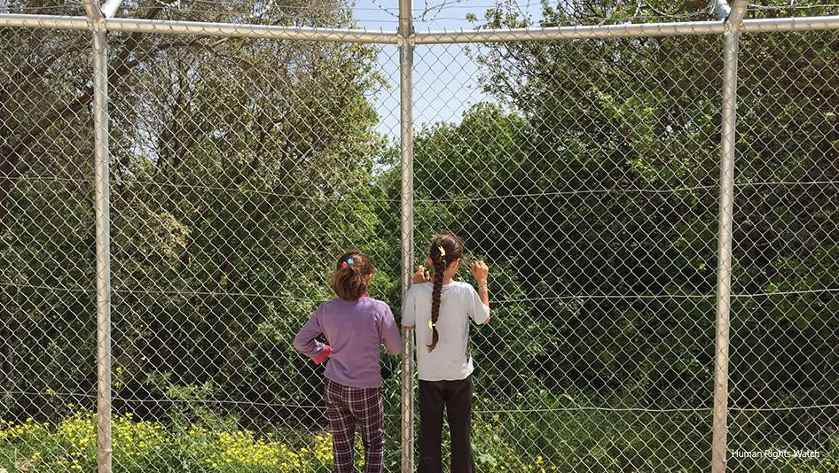
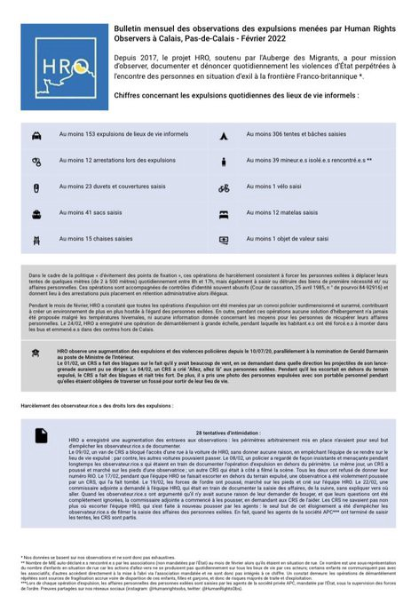
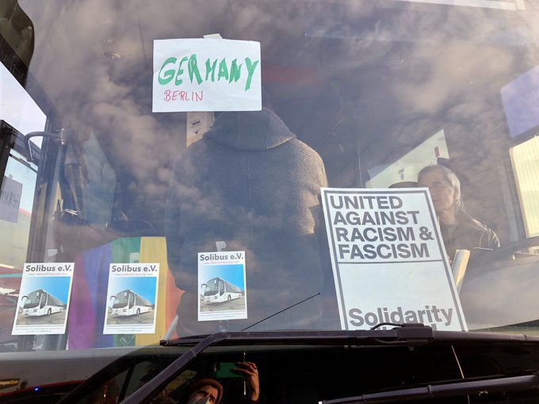

### AYS News Digest 9/3/22: An unborn child died because of illegal detention for the purpose of a pushback
#### Italy and Malta still enacting punitive tactics against vessels that fulfill international and maritime law by refusing to abandon people at sea / France: Press release condemning the banning of giving food and water in the city / Double standards of the EU’s response to people fleeing evident more and more by day / \+ more news & a list of important updates, long reads and reports chosen for you by our team

Illustration photo by HRW
#### FEATURE

The deadly consequences of illegal practice of pushbacks are present and visible in ttoo many people’s lives on a daily basis\. Sometimes, a tragedy happens that makes it all the more visible and tragic manifestation of our common policies of securitisation, illegal detention and deterrence\. A life was never given a chance because detention stopped a mother getting the necessary help she needed to deliver the child\.

On Friday morning, some locals of Samos in the area of ​​Vlamari, just outside Vathi, noticed a young pregnant woman in poor condition\. She was reportedly shivering from the cold and she was barefoot\. A car that picked up the girl, assuring her they would transport her to the hospital, ended up taking her to detention\. “Her traces disappeared until one in the afternoon, when she was transported to the Closed Controlled Structure of Samos”, it is further reported\.

“The serious consequences of the illegal actions that the uniformed officers of the Coast Guard and the Police are obliged to carry out in the Aegean islands are becoming more and more visible”, the Greek media reported\. The victim was an unborn baby who died a few hours before his first breath, after his dying young mother fell victim to illegal detention, resulting in them being transferred to Samos Hospital too late, where doctors could only remove the dead fetus and save the woman’s life\.
#### GREECE
### Ignoring convictions for human rights violations

Greece is at the bottom of the list in terms of its compliance with the European Court of Human Rights in terms of its compliance with convictions, according to data presented by Professor Ioannis Ktistakis, Judge of the European Court of Human Rights\. Informing the members of the Monitoring Committee of the European Court of Human Rights\.

2214 individual appeals against Greece are pending, much more than those pending in previous years\. 81% of them relate exclusively to detention conditions in the country’s penitentiaries\.

432 cases concern almost all articles of the European Convention, with the predominant violations being the non\-compliance of the administration with the national court decisions, the police violence, the freedom of expression and the property rights\.

Belgium has only 285 convictions, as opposed to 948 of Greece and only 234 pending appeals, while there are 2,214 in Greece, Left [reports](https://left.gr/news/i-ellada-agnoei-tis-katadikes-gia-paraviasi-anthropinon-dikaiomaton-apokardiotikos-apologismos?fbclid=IwAR0NPtHZYbQRjJg-ph47ZDQVe-ElHhnplapdXuDqKoWXCl-0j6EXjIwn3Fg) \.
### Implementation of the safe third country concept in Greece

27 civil society organisations active in the areas of asylum and migration in Greece urge the European Commission to promptly take the necessary measures against Greece to ensure effective compliance with Article 38\(4\) of the Asylum Procedures Directive\. The organisations highlight the need to ensure that asylum seekers to whom the safe third country concept has been applied have their applications promptly examined on the merits and are provided with respective legal status and adequate reception conditions, as well as to safeguard the integrity of the Common European Asylum System against systematic non\-compliance\.
See their letter [here](https://rsaegean.org/wp-content/uploads/2022/03/CSO_Letter_CION_STC.pdf) \.
### Parwana Amiri reports from Ritsona camp

The Ritsona camp in Greece is secured with walls, barbed wire, entry controls and surveillance technology\. Activist Parwana Amiri gave an insight into the situation:

#### SEARCH AND RESCUE AT SEA
### 26 lives stuck on a container vessel need immediate disembarkation in closest port in Malta or Italy

In the evening of March 5th, the Alarm Phone was alerted by a relative about 26 people on a rubber boat in distress in international waters\. “As no state actor reacted to our alert and the NGO\-vessel Geo Barents was too far away to reach the people in distress on time, Alarm Phone started contacting several merchant vessels in the area, as to prevent a possible tragic shipwreck\.” Later, they found out the people were saved by the crew of the container vessel CMA CGM Rivoli\. Now, they are again stranded since more than 48 hours on a container vessel heading to Dunkerque\. Alarm Phone brings [the story and timeline of event](https://alarmphone.org/en/2022/03/08/26-lives-stuck-on-a-container-vessel-need-immediate-disembarkation-in-closest-port-in-malta-or-italy/?fbclid=IwAR3UpWWh9coQC_i8igDL6QOWzRjO66rw2Rr_j3ajYcWvfJiHxakXgpbhogE) s\.

More distress at sea captured by the MSF team:

■■■■■■■■■■■■■■ 
> **[MSF Sea](https://twitter.com/MSF_Sea) @ Twitter Says:** 

> > 🔴"This was the most difficult rescue I've ever done," said Javier Filgueira Guimerá, a SAR technician on the #GeoBarents. The camera on his helmet captured the terrifying moment of the most recent rescue when 31 people were rescued after their boat capsized.
▶️⬇️⬇️ https://t.co/ciFdeOcURi 

> **Tweeted at [2022-03-08 17:49:59](https://twitter.com/msf_sea/status/1501253915131535369).** 

■■■■■■■■■■■■■■ 

#### FRANCE
### Calais

Abubaker’s death could have been avoided\.” A week ago, Abubaker was hit by a train while helping a friend settle into a camp in Calais\. Accompanied by the day care of Calais, his family and friends wanted to share a message:

■■■■■■■■■■■■■■ 
> **[Utopia 56](https://twitter.com/Utopia_56) @ Twitter Says:** 

> > "La mort d’Abubaker aurait pu être évitée." Il y a une semaine, Abubaker a été heurté par un train alors qu'il aidait un ami à s'installer sur un campement de Calais. Accompagnés par l'accueil de jour de Calais, sa famille et ses amis ont souhaité partager un message. https://t.co/oZiQ4ZPsO7 

> **Tweeted at [2022-03-08 10:46:24](https://twitter.com/utopia_56/status/1501147314374774785).** 

■■■■■■■■■■■■■■ 

February report by the [Human Rights Observers](https://twitter.com/HumanRightsObs)

### Press release condemning the banning of giving food and water in the city

■■■■■■■■■■■■■■ 
> **[Calais Food Collective](https://twitter.com/CalaisFoodCol) @ Twitter Says:** 

> > https://t.co/jhDywS9t19 

> **Tweeted at [2022-03-08 16:32:38](https://twitter.com/calaisfoodcol/status/1501234449039646722).** 

■■■■■■■■■■■■■■ 

#### SPAIN

1000 people tried unsuccessfully on Tuesday morning to enter the Spanish enclave of Melilla, on Morocco’s northern coast, days after the most massive attempt ever recorded, local authorities said\. The story is already reported, so we bring the link to it:

#### POLAND
### Pushbacks still taking place at the Polish border…

■■■■■■■■■■■■■■ 
> **[Piotr Czaban](https://twitter.com/CzabanPiotr) @ Twitter Says:** 

> > 'We're on the police car, he'll take us to the border' - napisał jeden z Jemeńczyków.
- Wyrzucili ich na Białoruś - potwierdza Mariusz - Człowiek Lasu. 

> **Tweeted at [2022-03-08 16:45:24](https://twitter.com/czabanpiotr/status/1501237662216298504).** 

■■■■■■■■■■■■■■ 

### Fighting the double standards on the ground

German activists offer free bus service to Berlin, prioritizing 3rd\-country nationals who may face barriers & discrimination accessing free transport & housing\. Nationals of Senegal, Ethiopia, Pakistan, Algeria, Syria fleeing Ukraine are among those who have hopped on buses\. Many are students, according to activist & bus driver Luca Kruczynski \(pictured\), who’s been shuttling between Germany and Poland to transport people\.

[Lydia Emmanouilidou](https://twitter.com/lydiaemman) spoke to an activist, Luca Kruczynski over the weekend, he said he was encouraged by official & civilian response to refugee crisis but decried Europe’s treatment of non\-white, non\-Christian refugees — now & in the past\.

> “If I can see one thing clearly, it’s that we’re still in a racist society,” 

\-Kruczynski said\. While Ukrainians — mostly white, Christian — have been deemed “good” refugees & embraced by EU “people coming from Afghanistan or African countries have been treated differently\.”

> Notably, last November Kruczynski & team tried, unsuccessfully, to offer free bus rides to Iraqi Kurds, Syrians & others stuck at Poland\-Belarus border, being violently pushed back when trying to enter EU & some freezing to death in Polish forests\. In response to arrivals of asylum seekers at its border w Belarus this past summer/ fall, Poland instituted a no\-access zone within 5km of the border, barring everyone, including humanitarian workers, from the area\. Kruczynski & the team tried to enter the area & help but were turned away\. “It was a very sad experience” Kruczynski said of previous unsuccessful attempts to access Poland\-Belarus border & provide support\. 

> “Now, the same Polish border police that forced us turn around near the Belarussian border is here to celebrate Ukrainians arriving\. It’s ridiculous\.” 

#### GERMANY

As we’ve been reporting, the injustice and racism of Europe has just been exacerbated during the first weeks of the war in Ukraine\. European politicians have, among others, [stressed](https://twitter.com/Jairo_I_Funez/status/1499510506314514432) that Ukrainian refugees are qualitatively superior by virtue of their race and religion to those from countries in Latin America, Asia, Africa and Oceania — collectively known as the [Global South](https://journals.sagepub.com/doi/pdf/10.1177/1536504212436479) , as it is [reported](https://theconversation.com/ukrainian-refugees-are-welcomed-with-open-arms-not-so-with-people-fleeing-other-war-torn-countries-178491?fbclid=IwAR23WSURFoJEeNB94nGggpyGAIU0BfcvZ1oecDkUI1JEHphhNXt5oW4mAyA) \.

[](https://l.facebook.com/l.php?u=https%3A%2F%2Fwww.hrw.org%2Fnews%2F2022%2F03%2F09%2Feus-generous-response-ukraine-refugees-shows-another-way-possible%3Ffbclid%3DIwAR23WSURFoJEeNB94nGggpyGAIU0BfcvZ1oecDkUI1JEHphhNXt5oW4mAyA&h=AT00xQ3Vp6ThyJJ4zLt_qBfpYEivpSUzarA3ul32h0G7XRkEkb7ZjSqQZI1X8qbGTZTIicCTOo_Fi-W1YBefkE94J5Z4irjl7zqI9U8dmguEV-_DPArndcUbSbI2osto4khhMww_Dev7DQ&__tn__=R]-R&c[0]=AT2h0i1GDETrQ8XTWvoOU0oMTz22BXlKTNMV3UNfGRBNC9pIy92x8ZuJ5shQlzFZg1W19Tt3CR26C6shpTBqslTMzkMufdLd69GEc1by9yayq0ShVAYS33Zb1sbolaVSBroxoqgZaWGA2o_D-DRDwaGCuax8fNE1RFNIRHtW5fh240iVCTnGRTlCi-UJJ4O8uit6X3LaOEEI5lgWkQE)

One such case of double standards is the one in Germany, where up to a thousand refugees from Ukraine are to be accommodated temporarily in the so\-called anchor center on the Bundeswehr site\. The asylum seekers who have been living there so far [reportedly](https://www.sueddeutsche.de/muenchen/fuerstenfeldbruck/fuerstenfeldbruck-ukraine-gefluechtete-jemen-afghanistan-ankerzentrum-1.5543105?fbclid=IwAR0oWZ3QBM4djPjCauV7livP70L57YKOtHCO8-FHPc-hGcvvY2jzG2l7DVY) have to move\.

> Asylum seekers from Yemen and Afghanistan have to move to other accommodations in Upper Bavaria\. The city and Caritas complain that the previous residents have to quit language courses and leave schools\. 

At the same time, the practice of pushbacks silently continues…

#### UKRAINE

[](https://l.facebook.com/l.php?u=https%3A%2F%2Ftheintercept.com%2F2022%2F03%2F08%2Fukraine-refugees-europe-border-policy-libya-sally-hayden%2F%3Ffbclid%3DIwAR3WAhLcYDLYDkUuD-IHZGU7NTXtUjEZ4-kZCknZ5cpeURH-6Jb8grtR2vM&h=AT2OKQ88mhVQiAN-bRUoWr2FG0UCLtWqLZdDq-yrkoOEXwP3pppXgp7uxo2XH8ZejjPloVF1uvOarkkt-1abui2eXwvUZATIYsfIHX14pAi3UcwUvw2Ox2VA8Iz752f3GqTuNOd3Thr5gA&__tn__=R]-R&c[0]=AT26lBxfmM4MgzgPSDYQKdRRQCFNcwg5ui8kwUZYUeQ1O-cjQTEkim6TVTSqwQgkNbHYfRppmjQezJXp4EsFC6toRqKErzDO7pcV3vGKtns781GhFVbMUKwja_XhfcrcMRQmn2jGQ5BSM1tBst8WJQEKIMII4MAKZ1EXZcOLRafgpy_3wfwon0zg_HUB-PHasIxdDLOC0reO)

On the topic of European responses to the protection needs of refugees from the war in Ukraine, the Odysseus Academic Network questions why was temporary protection not offered during the large\-scale arrival of refugees to Europe in 2015\. The TPD, due to its open definition of ‘mass influx’, relies on the political will of the EU to be implemented\.

[](https://l.facebook.com/l.php?u=https%3A%2F%2Feumigrationlawblog.eu%2Fcollective-protection-as-a-short-term-solution-european-responses-to-the-protection-needs-of-refugees-from-the-war-in-ukraine%2F%3Ffbclid%3DIwAR1fpdxi2Jt95Q4YL7coQiTBMQaccHyE0pbkX4isVPVn7tR2ubRR-H-ZdIg&h=AT07GWfqxiEYCzEz6bVSHF4zvxHtFbHCooZNbcVrV3F-CUtJemp7VpDgAH7gnUTAVkoDhUYMJESJdkPLPlxWDNgi6evR8pQwMQA26OJd9KovtjMn6Ju3jzhrxdsRHGccE0CtUcWyoGYFwA&__tn__=R]-R&c[0]=AT26lBxfmM4MgzgPSDYQKdRRQCFNcwg5ui8kwUZYUeQ1O-cjQTEkim6TVTSqwQgkNbHYfRppmjQezJXp4EsFC6toRqKErzDO7pcV3vGKtns781GhFVbMUKwja_XhfcrcMRQmn2jGQ5BSM1tBst8WJQEKIMII4MAKZ1EXZcOLRafgpy_3wfwon0zg_HUB-PHasIxdDLOC0reO)

Important information for everyone engaged in human rights fight in Ukraine:

[](https://l.facebook.com/l.php?u=https%3A%2F%2Fwww.thenewhumanitarian.org%2Fopinion%2F2022%2F03%2F09%2Ffrom-cyber-attacks-to-bot-farms%3Ffbclid%3DIwAR2SwvfuSGO4PtdrwrjY_uA9NAxohiSwrQfoSy5Rnm8dEikKkY5WJDwKoa8&h=AT2ldCWr8TViuXTviRdnGytBVgfcfmXKfAVI1vKjsjlfkY2d55v36Xi1wJUG988T6uZfd-2IgqRhLZUzeyqaralXrnjuy36VIJg8KgzPN0I_4BOKPNT1rt51VHJ0f50_lLv74qTKXggE7g&__tn__=R]-R&c[0]=AT2h0i1GDETrQ8XTWvoOU0oMTz22BXlKTNMV3UNfGRBNC9pIy92x8ZuJ5shQlzFZg1W19Tt3CR26C6shpTBqslTMzkMufdLd69GEc1by9yayq0ShVAYS33Zb1sbolaVSBroxoqgZaWGA2o_D-DRDwaGCuax8fNE1RFNIRHtW5fh240iVCTnGRTlCi-UJJ4O8uit6X3LaOEEI5lgWkQE)

### The 8th of March

■■■■■■■■■■■■■■ 
> **[Solidarity with migrants](https://twitter.com/MigrantsSoli) @ Twitter Says:** 

> > #8M2022 in Athens. 
Migrant women asking for their rights.
#antireport #RefugeesGR https://t.co/1XO4dnhdOF 

> **Tweeted at [2022-03-09 16:51:53](https://twitter.com/migrantssoli/status/1501601677790613508).** 

■■■■■■■■■■■■■■ 

5th annual Feminist [\#NoBorders](https://www.facebook.com/hashtag/noborders?__eep__=6&__cft__[0]=AZVlf0a5CabtFGrj6j2H3S8wQGIFGVOdbKeV0T4zMSoFw5Ca9vtRk-rpQGGf2w78lVcMbQKLoLVbL39dSQO-8BXdkA5G1w8DXS52VNsK25WBJKcWhWOOA1zHU6TiedH_exaHVqIBJGVTNHAkX_0WkGpTqwKpukhY0XexEynsq3P-yJEa3C9UDeZZMxH0qZc1zE0&__tn__=R]-R) Summer School \(15–18 June 2022\)

#### WORTH READING
- No abolition for the Hungarian government:

[](https://l.facebook.com/l.php?u=https%3A%2F%2Fwww.hrw.org%2Fnews%2F2022%2F03%2F08%2Fhungarians-helping-ukraines-refugees-no-excuse-limited-government-action%3Ffbclid%3DIwAR091J1U9M-QYaXwGOrXmJzd0qIM7llVf5qnlXKMIjilUgrSwwVKBWGQy6c&h=AT2D79OIGdRUdGb1akZulclhAjzRUVYilcWwIZTmn37jPYqL7QzIAo_DmFPQ2WFbUyNwZgrTKl2QcSRHE0I1ylarrf2YSUgP4CADuZyw2fXQ-zRPge3G9EHWHgxKDcSiXKz1Uzjl2gKUXw&__tn__=R]-R&c[0]=AT0lmFFxYPtJhYoVFpSKWR4o5sETS_SMsxZSR8qkQ2oS--N5QWRk21TLxrTMYCrBXO0Y2I2OU1cI2H5LeRpYhk4uK0cLujpcGTdl0jTsMhvPLLeOZJHbDwfkzpmS3RJQGEmuUwHwy_Sf3OXJHIN5K9X9HxJHDIgmluAos35eql7En8Nvbq6S5O6oc5p2iLjS5H_hjKn_Q0f3)

- an important read and a different take on the issue of pushbacks:

[](https://l.facebook.com/l.php?u=https%3A%2F%2Fwww.motherjones.com%2Fpolitics%2F2022%2F03%2Fpushback-greece-lesbos-refugees-asylum-seekers-ukraine%2F%3Ffbclid%3DIwAR1fchDfvsB096xJcXnTZJzvd-pP19uiHDp3YIZjOJ1XCzwCTFZX30QmvN0&h=AT1Bv4sRTI5w8oseCS9zfoeIlYIvc4z-22EzO6YBcHTU_UwnTj2BeZF3aAfAbrBtP1Gs4TZgp67H7D6l4yk-5y2ZaMioJyMY4PJVix2SA4NGMCH6nrv3fereyaWoM_XPJFh-yqHoknvZNg&__tn__=R]-R&c[0]=AT1Ggh58pqInwcDWNRz8Qye_MJIrL_XKHH_pumz1ImZ8e0duvhjk-Ksmkhj7Wn8sG_-TLUL1IHJJvGxOITaqScVFnUH8nT5CkP0WCA2TRcvgFv6Opkcf-nPIk9IJQsRdg5KzTLv3CiX3L1yi2bCB-Bu-Ezd-m4xdUaTLgTxedGGG9PtUh8muuG0M9x7-a6m0alJpj5iJgmIR)

- The world has its eyes on Ukraine, but what about the other humanitarian crises around the world? Here are eight \(among many other\) conflicts and crises that deserve your attention too:

[](https://l.facebook.com/l.php?u=https%3A%2F%2Fwww.thenewhumanitarian.org%2Fnews%2F2022%2F03%2F07%2Fbeyond-ukraine-eight-other-humanitarian-crises-raging-around-globe%3Ffbclid%3DIwAR3t8J1SuoZkcBxZihn0ygnMygkScbHug1-PEjUC-NHuhqu2g6-m_1pJWNo&h=AT0GOL16B8HIGMT_v5jOKcINkXyXWrxwUQYsjZshC0Gtf9YE2vsY0I6GwKtvrvREtbr9Vy4KU32w9DXbN3K0R_AbWMj15PFtlVSpKl75Qx-PTKHBWpGiEW0dOVMtv8Y-3Q&__tn__=%2CmH-R&c[0]=AT1OXXzJ0jo9yotdiF2pZF-_YrHWR3dtC3JViVMarU9JyB2QzShlopbjP8hDBhEE2lzvwlWIYqlK4nb6t7oPi7MJe6xmi74PWgASX-a1cUUNPm682Hq3JbKKJNvD5ZU6QIaBiKiGeeoSvfp4e-yXE1KPatNz0wRwx_88drLRHN0fc9XH)

- the bizarre case of the UK ‘even’ when it comes to the Ukranian refugees:

[](https://l.facebook.com/l.php?u=https%3A%2F%2Fwww.independent.co.uk%2Fvoices%2Fhome-office-ukraine-refugee-visas-b2031110.html%3Ffr%3Doperanews%26fbclid%3DIwAR2SwvfuSGO4PtdrwrjY_uA9NAxohiSwrQfoSy5Rnm8dEikKkY5WJDwKoa8&h=AT1MyFsOKI-Kwcd2k6-MULSo6ZoP0gXT4uCGlfK5h3RYwO8lC8QKtWUbwfi-mcA13o7ekAW3L31pypSM7PEPUl7Jy0b8fTLZxxR9LsrDRmZZwp_AraNg0YO3TzdH44c_462DtWDvSa71_Q&__tn__=R]-R&c[0]=AT2GoKs36uOVH-dlfwoKBaAZ0VBZJxn_LlcEr1RShC02NHXLXtvR-T63lp7-N2o-yndKcH9LFEh7gRnuHHORJRLVmdQVNIzzywaWlqsZZhaAdBxeHbywW8TjlCjoTqv4y0VzQhFAR4MAJnIU-sJqVAMrMDraaY1qJdTFQrXlbC8FjZiTl2rjlapihLaYsDISxJpQxt9llEDo)

- EU pressuring Iraq to take in deportees:

**Find daily updates and special reports on our [Medium page](https://medium.com/are-you-syrious) \.**

**If you wish to contribute, either by writing a report or a story, or by joining the info gathering team, please let us know\.**

**We strive to echo correct news from the ground through collaboration and fairness\. Every effort has been made to credit organisations and individuals with regard to the supply of information, video, and photo material \(in cases where the source wanted to be accredited\) \. Please notify us regarding corrections\.**

**If there’s anything you want to share or comment, contact us through Facebook, Twitter or write to: areyousyrious@gmail\.com**

_Converted [Medium Post](https://medium.com/are-you-syrious/ays-news-digest-9-3-22-an-unborn-child-died-because-of-illegal-detention-for-the-purpose-of-a-9f56e9b580d0) by [ZMediumToMarkdown](https://github.com/ZhgChgLi/ZMediumToMarkdown)._
