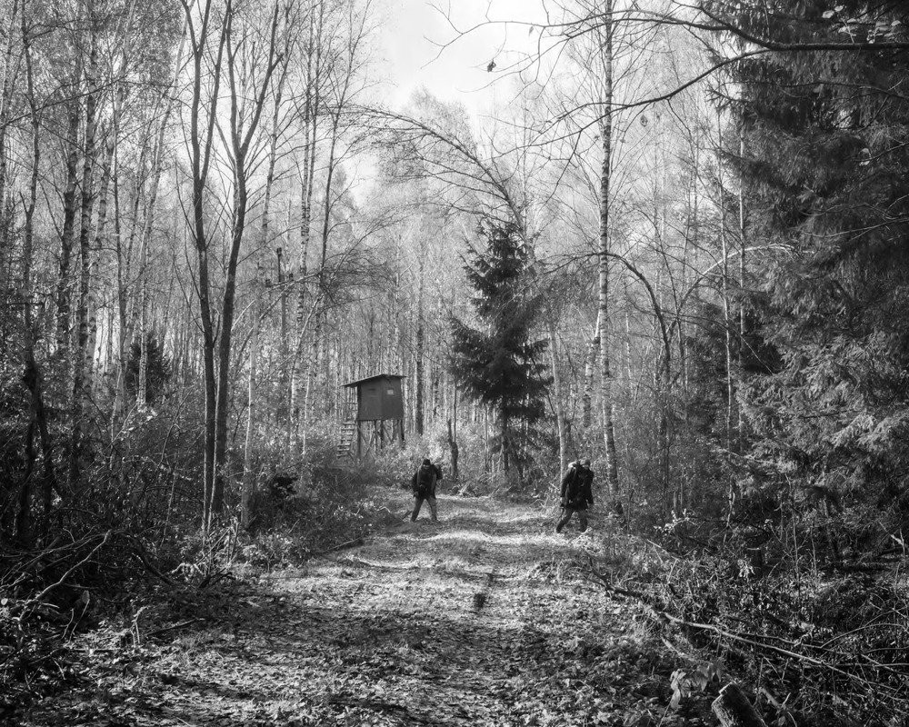
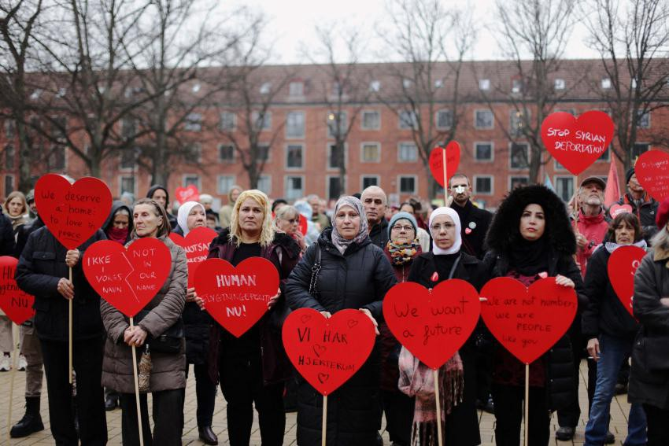
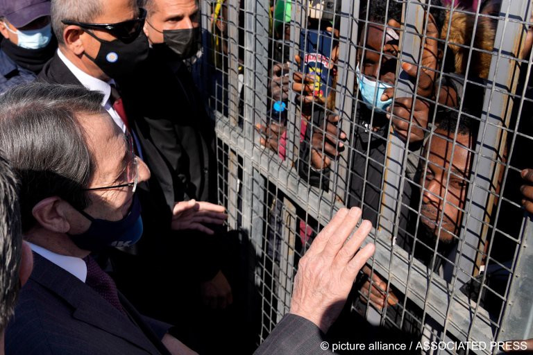
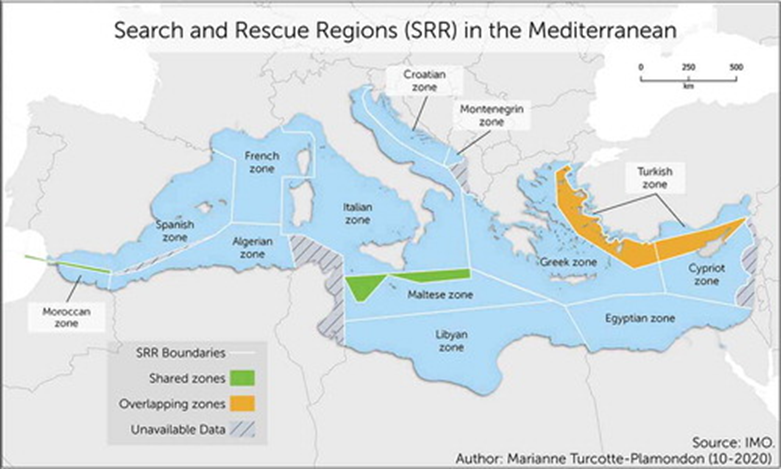

### AYS News Digest 16/03/22: There is no such a thing as a “bad” refugee
#### 11 years since the start of the Syrian war / Indication of trafficking and exploitation in Ukraine and surrounding regions / Changes in the SAR systems for European member states / Latest analysis of the UK’s asylum procedure / Continued critique and discussion of the responses from European states towards Ukrainian refugees, and more…

\- The New Humanitarian — A group of men from the Yemen hiding in a forest in Poland
#### **FEATURE**

**The Danish Immigration Service [requested that the Danish municipalities assess their capacity to accept Ukrainian refugees](https://www.hrw.org/news/2022/03/16/denmarks-mismatched-treatment-syrian-and-ukrainian-refugees?fbclid=IwAR3mbr90n4IduvAqciUodJEI-UZ2BLTFacdTZsQAya-FhT6rJquT-7IiM6Y) \.**

**Denmark** in recent years has shown great hostility to refugees and asylum seekers\. For instance, the government implemented a so\-called “jewellery law” whereby the government has the right to seize asylum seekers’ assets, such as jewellery, to fund their stay in the country\. They also implemented a zero\-asylum policy\. More recently, the Immigration Service removed temporary protection from Syrian refugees, despite Syria still being exceptionally dangerous to return to\. Nonetheless, Ukrainian refugees are exempt from this hostility, and are welcomed into Denmark\. This is, of course, a commendable response, but this welcome needs to be extended to all refugees\.
#### SYRIA
### **Experiencing war and conflict for 11 years**

15th March 2022 marked 11 years since the start of the war in Syria, with reports, tweets, and [articles](https://www.theguardian.com/world/2022/mar/15/the-enemy-is-the-same-idlibs-message-to-ukraine-as-syrian-war-enters-12th-year) raising awareness of the continued suffering and the [similarities](https://www.aljazeera.com/news/2022/3/16/for-syrian-survivors-russias-tactics-in-ukraine-eerily-similar) between the current wars in Ukraine and Syria\.

The tweets below raise awareness of the continued violence and forced displacement of so many Syrians for over a decade\.

■■■■■■■■■■■■■■ 
> **[Sally Hayden](https://twitter.com/sallyhayd) @ Twitter Says:** 

> > Syria's war turned 11 yesterday. Half a million people dead. More than 13 million displaced. Almost no justice. [twitter.com/sallyhayd/stat…](https://twitter.com/sallyhayd/status/1501947344861859844?s=20&t=91TFyVvxDEd7DUxD4YuzkA) 

> **Tweeted at [2022-03-16 06:53:05](https://twitter.com/sallyhayd/status/1503987703448223746).** 

■■■■■■■■■■■■■■ 

■■■■■■■■■■■■■■ 
> **[Choose Love](https://twitter.com/chooselove) @ Twitter Says:** 

> > 📷 from Hassan Akkad's post: [instagram.com/hassanakkad/](https://www.instagram.com/hassanakkad/) 

#ChooseLove 

> **Tweeted at [2022-03-15 12:02:44](https://twitter.com/chooselove/status/1503703241158279174).** 

■■■■■■■■■■■■■■ 

#### TURKEY
### **At least 246 people detained in three “security operations” across Turkey**

The groups of people on the move were predominantly from Afghanistan, Syria, Iraq, Iran, Egypt, and Yemen\. The groups were found and held in different parts of Turkey; two groups held on suspicion of human smuggling or trafficking\.
#### GREECE

■■■■■■■■■■■■■■ 
> **[Lena K.](https://twitter.com/lk2015r) @ Twitter Says:** 

> > People still stranded on islet in Evros river since Saturday. Police, UNHCR, Frontex, Ombudsman &amp; the recently established National Commission of Human Rights' mechanism for recording pushbacks all informed. Preview of how independent monitoring mechanisms will work (not), maybe. 

> **Tweeted at [2022-03-15 19:14:20](https://twitter.com/lk2015r/status/1503811854212243458).** 

■■■■■■■■■■■■■■ 

As mentioned in our previous digest, 20 Syrian asylum seekers are **STILL** stranded on the Evros river islet, without any food or water\. Among them is a pregnant woman who is in need of medical attention\.

■■■■■■■■■■■■■■ 
> **[Vassilis Tsarnas](https://twitter.com/VassilisTsarnas) @ Twitter Says:** 

> > These 20 Syrian #RefugeesGr are still helpless on an #Evros river islet, in extreme cold for a 3d day, without water &amp; food &amp; with a pregnant woman bleeding! They had tried to seek asylum in #Greece but commandos approached them &amp; warned them to return to Turkey 1/
#StopPushBacks 

> **Tweeted at [2022-03-15 16:41:09](https://twitter.com/vassilistsarnas/status/1503773307006599172).** 

■■■■■■■■■■■■■■ 

#### CYPRUS
### **Improvements promised a** fter growing criticism of the camp conditions

The Cypriot commissioner for children’s rights, Despo Michalidou, stated that the conditions in the camp are “miserable” and “unhygienic”\. It has also been said that asylum seekers in Pournara camp do not receive enough food, and there aren’t enough bathrooms for everyone\.

#### **UKRAINE**
### **Increased risk of human trafficking for people fleeing Ukraine**

[IOM](https://www.iom.int/news/iom-warns-increased-risk-trafficking-persons-people-fleeing-ukraine?fbclid=IwAR3Wqv5mO0sVTphlLciiGA3XbyG-9cUa3tLLgwKqXzslEh2owGh2rIRptEY) has raised concerns of the risk of human trafficking, sexual exploitation and abuse in Ukraine and the surrounding region\. Individuals fleeing war are much more vulnerable to potential exploitation\. There have already been instances of sexual violence, and through individuals promising onward transportation and support, there have also been signs of exploitation\.

IOM advises individuals and community members who are providing transportation and accommodation to **coordinate with local protection agencies** \. They should also “share contact details, transportation routes, and accommodation locations to improve oversight and safeguarding\.”

Online materials, raising awareness of counter\-trafficking and safe migration are available through the organisation\.

The **Global Detention Project** has further released information about stranded detainees in Zhuravychi migrant centre:

■■■■■■■■■■■■■■ 
> **[Global Detention Project](https://twitter.com/migradetention) @ Twitter Says:** 

> > We have received multiple credible reports of migrant detainees in Ukraine's Zhuravychi migrant centre who may have been stranded as Russian bombing neared the city of Lutsk. IF DETAINED MIGRANTS REMAIN AT CENTRE THEY MUST BE RELEASED AND ASSISTED. https://t.co/OrJaaP7xjm 

> **Tweeted at [2022-03-15 17:16:49](https://twitter.com/migradetention/status/1503782279591649281).** 

■■■■■■■■■■■■■■ 

#### POLAND
### Personal experience from the forest crossing

[A Syrian recounts his experience](https://www.thenewhumanitarian.org/first-person/2022/03/15/ukraine-poland-syria-refugee-welcome-forest?fbclid=IwAR21835fbzv9gCdfLwX7ocXNGYv1ayAfCItWkUU9a36tQxg-giT7VAnPETE) of crossing the border into Poland, where he had to hide in a forest from the Polish army\. He was forced to travel at night so that no one would see him, and he knew that if he tried to turn back to Belarus, the soldiers would beat him up\. He talks about how he views the drastic difference in response to Ukrainian refugees versus Syrian or other Middle Eastern refugees\.

> “Because of my own experiences, I feel the pain and suffering of Ukrainian refugees more than most\. But when people started to come to Poland from Ukraine, and I saw how enthusiastically Polish society welcomed them, it hurt so much\.” 

The same idea is reiterated in a recent **Al Jazeera** [article](https://www.aljazeera.com/news/2022/3/16/ngos-say-ukraine-refugee-crisis-easier-with-govt-support) , focusing on Poland, but mentioning other countries, such as Slovakia, Hungary, and Greece\. Aid workers and lawyers talk about their experience of trying to support refugees in the end of 2021, where Poland had introduced a state of emergency and banned entry to the border zone\. The reaction from authorities to NGO workers in Poland is very different from even a few months ago\.

However, in Belarus it is still the same; the Belarusian border has a great deal of surveillance and security\.
#### **SPAIN**
### Official SAR dodging their responsibility?

**Recent research has shown that European member states are transforming their national Search\-and\-Rescue \(SAR\) systems to avoid legal responsibilities in areas with high migration\.**

In the Mediterranean, the coastal states have the responsibility of their own Search and Rescue Regions \(SRR\), as shown in the map below\. They are obligated to have a national SAR system; however, they have autonomy over how they do this, and who is responsible for carrying out sea operations\.

[An article by Luna Vives and Paola Arenas](https://www.law.ox.ac.uk/research-subject-groups/centre-criminology/centreborder-criminologies/blog/2022/03/death-sea?fbclid=IwAR3Sjp2a_hhukZeeNUnSA6BDWqkR2c8KC_sW5TSlI_zqjyHuziMilHGePEA) discusses such changes within the context of Spain\.

**Case study: SASEMAR**

In Spain, SASEMAR is the main agency responsible for their SAR\. SASEMAR was created in 1993, and at this time, migration was not seen as a political issue, which helps to explain why SASEMAR rescue crews today do not have law enforcement training nor equipment\. SASEMAR rescue crews openly dispute governmental efforts to develop the agency’s border enforcement initiatives\.

Nevertheless, in 2018, there was a restructuring of the agency\. Three strategies were implemented and resulted in worse working conditions for the rescue crews, a transfer of rescue responsibilities to the military, and a transfer of SAR responsibilities from Spain to Morocco\. This third strategy is one that is very common among coastal states in the Mediterranean\. In the case of Morocco and Spain, there is a much harsher border now between the two SRR, compared to in the past, where both parties used to operate in both SRR and provide greater support to each other\.
#### SWEDEN
### Possible re\-introduction of ID checks on entering Sweden

As a response to the growing numbers of refugees fleeing Russia’s invasion of Ukraine, Sweden is considering [reintroducing measures to safeguard national security](https://www.government.se/press-releases/2022/03/government-proposes-possibility-of-reintroducing-id-checks-on-buses-trains-and-passenger-ships/) \. A temporary act enabling ID checks was implemented in 2015 as a response to the numbers of refugees at that point, but this act is no longer applicable\.
#### **FRONTEX**
### **On the 15th March 2022, Frontex deployed its own plane, the DO328–100 to support France and Belgium in patrolling the coastline**

This plane has surveillance sensors, such as a thermal camera, and communication equipment that allows for direct transferring of data to the Frontex Situation Centre\. It does also have the necessary equipment to carry out search and rescue operations if requested by national authorities\.

■■■■■■■■■■■■■■ 
> **[Matthias Monroy (@Mastodon)](https://twitter.com/matthimon) @ Twitter Says:** 

> > Die EU-Grenzagentur #Frontex überwacht jetzt auch im #Ärmelkanal mit einem eigenen Flugzeug. 
Im Vergleich zu den geleasten Luftfahrzeugen (und Drohnen) im Mittelmeer ist die Dornier DO328-100 deutlich größer und trägt vermutlich mehr Sensorik:
[twitter.com/Frontex/status…](https://twitter.com/Frontex/status/1503736540354203649) 

> **Tweeted at [2022-03-15 14:56:00](https://twitter.com/matthimon/status/1503746843846586374).** 

■■■■■■■■■■■■■■ 

Frontex claims to not cooperate with the Libyan coastguard, however, documents prove otherwise:

■■■■■■■■■■■■■■ 
> **[Tineke Strik](https://twitter.com/Tineke_Strik) @ Twitter Says:** 

> > I asked @[Frontex](https://twitter.com/Frontex) access to data on its contact with the Libyan coastguard in 2021. Important, as [Frontex](https://twitter.com/Frontex) denied working together 👇

[Frontex](https://twitter.com/Frontex) gave us 2 documents, but reveals they have 433 doc’s listing interaction (!). Remarkable if you don’t cooperate.

[twitter.com/Frontex/status…](https://twitter.com/Frontex/status/1389863194135568385?s=20&t=Ccdn7GUhXYfIqgtSO9hr4w) https://t.co/3Wp112O6NJ 

> **Tweeted at [2022-03-16 08:08:38](https://twitter.com/tineke_strik/status/1504006714131193858).** 

■■■■■■■■■■■■■■ 

#### **UK**
### **The Ukraine Family Scheme**

Special visa schemes have been introduced for Ukrainian refugees, including the [Ukraine Family Scheme](https://www.freemovement.org.uk/can-ukrainians-take-refuge-in-the-uk-immigration-concessions-and-asylum-policy/?fbclid=IwAR2lUWaNqb4PrGFX1w_Fw-ma6hcGGPX4VaxyaOIpX9HNbdeg1PUXqMJI82c) \. Alongside the scheme, the Home Office is reviewing its policy on asylum claims made by Ukrainian citizens who are already in the UK or who are en route\. However, the need for a visa to enter the UK still applies for Ukrainian refugees\.

Ukraine Family Scheme — This scheme allows for British citizens and many immigrants in the UK to sponsor Ukrainian relatives who would not normally qualify for a family visa\. This visa includes the right to work and the application is free, however, it only lasts up to 3 years with no real talk of whether this can be extended\. It is also important to note that in order to sponsor someone you must have one of the following statuses;
- Indefinite Leave to Remain
- EU Settled Status
- EU pre\-settled status
- Refugee status
- Humanitarian protection

For those eligible to be sponsored, there are different categories\. Firstly, there is **immediate family** i\.e\. a partner of a UK\-based sponsor, a parent of a child under the age of 18 who is the child of the UK based sponsor, among other forms of eligibility\. **Extended family** may also be eligible, such as, a grandparent, a sibling, an aunt/uncle, among others\. Extended family members may also bring some of their own immediate family\.

However, [issues have been raised](https://news.sky.com/story/ukraine-war-number-10-put-brakes-on-home-office-plans-for-more-generous-refugee-offer-sky-news-understands-12563556) about the realities of the Ukraine Family Scheme\. For instance, Ukrainians with permanent UK visas can sponsor extended family, but those with temporary visas cannot\. The Home Office has considered reviewing this issue\.
### **Homes for Ukraine Scheme**

Since the implementation of this scheme, the Foreign Office minister, James Cleverly, has stated that there are around [“10,000 people every hour”](https://www.theguardian.com/world/2022/mar/15/homes-for-ukraine-website-crashes-refugees) signing up\.

This scheme allows for any Ukrainian to be brought to the UK to live in someone’s home for a minimum of 6 months\. With this scheme, refugees could live and work in the UK for up to 3 years and have access to welfare services\.

However, Labour has criticised this scheme as UK families would need to identify a Ukrainian family they wish to support\.
### **The latest extensive analysis of the UK’s asylum procedure has been published**

This year’s report includes the latest immigration statistics from 2020 and details any policy changes throughout the year\.

_UK ending their involvement with the Dublin Agreement_
- This agreement allowed signatory states to transfer asylum seekers from one country to another for several reasons, including family reunification\.

_Covid\-19_
- The report distinguishes between longer term policy changes and temporary ones implemented as a response to the pandemic, such as reception conditions and the asylum procedure itself\.

The full report can be found [here](https://asylumineurope.org/wp-content/uploads/2021/03/AIDA-UK_2020update.pdf) \.
#### **WORTH READING**

Difficulties for Ukrainian nationals and those who are being forced to flee violence and war for the second time:

■■■■■■■■■■■■■■ 
> **[Lighthouse Reports](https://twitter.com/LHreports) @ Twitter Says:** 

> > 72/ @[Jana_Kalaaji](https://twitter.com/Jana_Kalaaji), the Syrian med student from the (From 🧵) has travelled all the way to Germany. This is the second time in her life that she has had to flee from Russian bombardments.”I am a two time refugee” https://t.co/gUTuyuE1SP 

> **Tweeted at [2022-03-14 22:14:31](https://twitter.com/lhreports/status/1503494813576015878).** 

■■■■■■■■■■■■■■ 

- “Will Ukraine Change How Europe Treats Refugees?”

- “Channel crossings: ‘More than 300’ migrants arrive”

- “Europe urged to improve refugee plan as Ukraine war stokes pandemic”

- Germany — workshop on how to support migrant rights:

**Find daily updates and special reports on our [Medium page](https://medium.com/are-you-syrious) \.**

**If you wish to contribute, either by writing a report or a story, or by joining the info gathering team, please let us know\.**

**We strive to echo correct news from the ground through collaboration and fairness\. Every effort has been made to credit organisations and individuals with regard to the supply of information, video, and photo material \(in cases where the source wanted to be accredited\) \. Please notify us regarding corrections\.**

**If there’s anything you want to share or comment, contact us through Facebook, Twitter or write to: areyousyrious@gmail\.com**

_Converted [Medium Post](https://medium.com/are-you-syrious/ays-news-digest-16-03-2022-there-is-no-bad-refugee-47c9cf9d7221) by [ZMediumToMarkdown](https://github.com/ZhgChgLi/ZMediumToMarkdown)._
