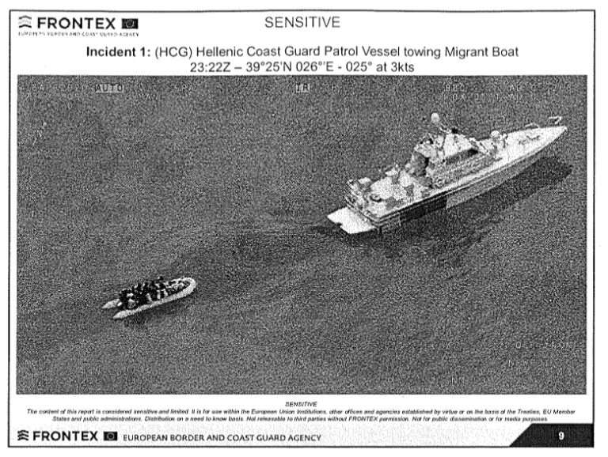

### **AYS News Digest 18/03/2022: A final blow for Frontex boss Leggeri?**
#### “Day of Political Prisoners” in Greece / The weaponization of humanitarian data / Analysis of the Libya refugee protests / Tories rebel against Priti Patel / Updates on Germany, France, Poland …

A pushback by the Hellenic Coast Guard, as documented by a Frontex plane and shared by Lighthouse Reports\.
### FEATURE
#### **A final blow for Frontex boss Leggeri?**

A Hellenic Coast Guard cutter,towing a dinghy full of people towards Turkey, and then casting them adrift, without an engine, on the other side of the EU’s maritime border: these are images that anyone involved in migrant rights has seen and imagined over and over\. But this time, [these images](https://twitter.com/stluedke/status/1504405299905638401?fbclid=IwAR3WDkrqrYaSfRdA0Fd-R_DTztxnLytRiR56fWcpXMB4gnSCsZs47NIhyz4) are coming from the EU’s Border Guards themselves\. The photos of the pushback, taken by a Frontex airplane on 18–19 April 2020, were obtained by Lighthouse Reports and Der Spiegel\. They [could just be the final blow](https://twitter.com/LHreports/status/1504449092973481995) to Frontex’s boss, Fabrice Leggeri: they prove that Frontex knew early on about a pushback, covered it up, and even lied to EU lawmakers\.

The case was reported within Frontex as a “possible violation of Fundamental Rights”, but Fabrice Leggeri intervened, backed by Germany and France, to clear Greece of all responsibility\. This cover\-up is now at the center of an investigation by the EU’s anti\-fraud watchdog, OLAF, which recommends disciplinary action against 3 Frontex senior officials — and sources told Lighthouse Reports that Leggeri is one of them\.

These revelations, about which we are sure to hear more in the near future, come as another landmark case is brought against the EU’s Border and Coast Guard agency: [for the first time, a pushback victim is suing Frontex](https://twitter.com/LexFront/status/1504389380856811524) \. 22 year\-old Alaa Hamoudi, from Syria, arrived on the island of Samos on April 2020\. But he was forced back into a “death\-raft”, towed and abandoned in Turkish waters, as a Frontex aircraft watched from above\.

> “Under the leadership of Fabrice Leggeri, Frontex poses a threat to the legal order of the EU\. The board of directors must remove him from office immediately,” members of the Front\-Lex legal team [told Der Spiegel](https://www.spiegel.de/ausland/frontex-skandal-warum-fabrice-leggeri-doch-noch-stuerzen-koennte-a-c5af6fff-2e06-4908-b252-205b356bc5ee) \. 

Somewhat ironically, these revelations and the announcement of the court case against Frontex took place in the week marking [the 6 years of the EU\-Turkey deal](https://twitter.com/seawatch_intl/status/1504829287010115585?fbclid=IwAR0H1umkIJh9Dd8f8WAlnQwlQsf1s-qp7bFeVFyR2p6HbRrLd8MtLahkECs) \. “It has become a hallmark of the EU shirking its responsibility to protect refugees,” [commented](https://twitter.com/RESCUE_EU/status/1504459563013128195?fbclid=IwAR09wBdG1D5S_AB5AdBta_m_ugDH88lCG_xIioHB0SLBorarfnELfqMv2cw) the International Rescue Committee\.

■■■■■■■■■■■■■■ 
> **[International Rescue Committee - EU](https://twitter.com/RESCUE_EU) @ Twitter Says:** 

> > Yet, in 2020, #Turkey stopped receiving returns from #Greece.

As a result, thousands of people are now stuck in legal limbo - including children. 

These people have no access to asylum, legal status, work or services in the Greek camps they live in. (3/6) https://t.co/cs4WQ4PsE2 

> **Tweeted at [2022-03-17 14:08:08](https://twitter.com/rescue_eu/status/1504459575147347970).** 

■■■■■■■■■■■■■■ 

### GENERAL
#### **Digital security and the “weaponization of humanitarian data”**

Aid organizations across the world collect extremely sensitive information on millions of highly vulnerable people\. But a recent cyber\-attack on the ICRC, which compromised confidential data on more than 515,000 people, highlights the issues of data security in the humanitarian sector\. The director\-general of the ICRC called the cyber\-attack [“an outrage”](https://reliefweb.int/report/world/hacking-data-world-s-most-vulnerable-outrage?fbclid=IwAR3baOVUenuVLpito_kD7IynGRyLNogysngYeNs-sTCp44b9FLahhCGJZJU) \. Security and privacy policies and processes are “impractical, irrelevant, and often ignored,” highlights a former aid worker now specializing in information security in [an article by The New Humanitarian](https://www.thenewhumanitarian.org/interview/2022/02/28/data-security-in-frontline-aid?fbclid=IwAR2xeOW3Iem-i2IXs0luB9JWwUQu2iiOcFgaxwytt2tTDWcxlOdOe_31C9A) \.

“Sensitive data is often collected on personal devices, sent over hotel WiFi, scrawled on scraps of paper then photographed and sent to headquarters via WhatsApp, or simply emailed and widely shared with partner organisations”\.

In December 2019, concerns were raised after the Turkish authorities arrested a lawyer working for the German embassy and [confiscated the highly sensitive data](https://ecre.org/turkish-authorities-confiscate-personal-data-of-hundreds-of-turkish-asylum-seekers/?fbclid=IwAR09wBdG1D5S_AB5AdBta_m_ugDH88lCG_xIioHB0SLBorarfnELfqMv2cw) of at least 83 Turkish asylum\-seekers\. Organizations estimated the numbers of cases to be much higher, and Turkish sources claimed up to 4000 case files had been confiscated\.

[Find here some important information and best practices for data breach prevention\.](https://orglearningcenter.org/ngos-and-data-security-best-practices-for-data-breach-prevention/?fbclid=IwAR3baOVUenuVLpito_kD7IynGRyLNogysngYeNs-sTCp44b9FLahhCGJZJU)
### UKRAINE

More than 3 million people have fled Ukraine into the EU since the beginning of the war, in what UNHCR has qualified as the fastest growing population exodus since World War II\. The Helsinki Foundation for Human Rights has raised concern over risks of human trafficking and the difficult reception conditions in Poland, where 2 million people have been welcomed mostly by volunteers as the authorities are not doing enough\.

[This article by ECRE](https://ecre.org/european-ukraine-response-refugee-arrivals-continue-across-europe/) highlights the responses to these massive refugee arrivals across the EU\. While organizations have highlighted the stark difference in treatment between Ukrainian and other refugees — a double standard ridiculously [denied](https://www.thejournal.ie/eu-denies-double-standard-refugees-ukraine-syria-5714808-Mar2022/?fbclid=IwAR1iVj0IS8z-aKJM-t8JZiedOn4F5UPgXlpUJ_tUHN1VOBknPtVEh4zkU2Y) by the EU Commission vice president — others raise concerns about worrying signs: Frontex will be deployed to help Moldova “protect its borders”\.

■■■■■■■■■■■■■■ 
> **[Amandine Bach](https://twitter.com/AmandineBach) @ Twitter Says:** 

> > Worried about impact of this cooperation on conscientious objectors from Ukraine. Johansson told LIBE MEPs that one of the aim is to cut smuggling into Moldova from Ukraine while she also said this is the only possibility for Ukrainian men to go out. 

> **Tweeted at [2022-03-18 06:58:00](https://twitter.com/amandinebach/status/1504713713928048641).** 

■■■■■■■■■■■■■■ 

The Asylum Protection Center in Serbia has [sent an urgent appeal](https://twitter.com/APC_CZA/status/1503645512100106244?fbclid=IwAR2FjN4eD-Z0DQMS0eaY-EgJJr3SWztKOv4yej0EmaYLO7oJbof4OYbY5sA) to the government to take a decision on temporary protection for Ukrainian refugees: More than 2000 people are currently left without protection and grounds to stay in Serbia\.
### GREECE
#### Trials against asylum\-seekers and solidarity

What a cynical coincidence: on the International Day of Political Prisoners, 18 March, several trials that could easily be qualified as such were planned to take place in Greece\. After spending 2 years in prison under accusations of having driven a boat to Lesvos, Amir Zahiri and Akif Razuli were hoping to see their 50\-year prison sentence revoked or diminished in the appeal court\. But after waiting for 2 days, along with their families and supporters outside the courtroom, [their trial was postponed to April 7](https://dm-aegean.bordermonitoring.eu/2022/03/18/appeal-trial-against-amir-and-razuli-interrupted-until-7-april-2022-after-two-days-of-waiting/?fbclid=IwAR0H1umkIJh9Dd8f8WAlnQwlQsf1s-qp7bFeVFyR2p6HbRrLd8MtLahkECs) \.

> “When you are free, it is easy to say that it is just 20 days of postponement\. But when you are in a criminal prison, 20 days are not “just” 20 days,” [said their lawyer](https://twitter.com/cantevict/status/1504845637241741313) Dimitris Choulis\. 

In front of the same court, another case raised scandalized voices: the internationally acclaimed Norwegian photographer Knut Bry was arrested on Wednesday on charges of espionage\. His crime? Having taken photos of Hellenic Coast Guard and Navy vessels for his new photo book on migration\. 75\-year\-old Knut Bry was also a volunteer for Lesvos Solidarity, who called his arrest “another example of the unjustified activation of the criminal mechanism against the innocent”\.

Knut Bry arrested by the Greek police\. Photo shared by Lesvos Solidarity\.
#### 30 Syrians stranded in Evros finally “rescued”

After leaving 30 people stranded on an islet in the Evros river for six days, a 4 year\-old child drowning, a pregnant woman in serious medical distress, the Greek authorities have [finally gone to the rescue of this group](https://twitter.com/rights360/status/1504775078231355400) \. Their official excuse for not intervening sooner? They “couldn’t find them”\.

The NGO Human Rights 360 [had to reach out to the European Court of Human Rights](https://twitter.com/rights360/status/1504775087282663424?fbclid=IwAR1tsODlmzOKQSwCpztfH5w6PMZU-AXqTFU-AWQOSO3ovDmHkRo8_Vkrios) , which called on the Greek authorities to intervene and not push back the 30 Syrians\. A prosecutor has been called to investigate possible criminal liability of the authorities\.

■■■■■■■■■■■■■■ 
> **[Lena K.](https://twitter.com/lk2015r) @ Twitter Says:** 

> > Rescued only after @[rights360](https://twitter.com/rights360) applied for Rule 39 measures, granted by ECtHR. A 4-year-old has reportedly drowned. The Supreme Court ordered the Orestiada prosecutor to investigate possible criminal liability of the authorities. Any legal action would be a miracle, though. 

> **Tweeted at [2022-03-18 20:11:39](https://twitter.com/lk2015r/status/1504913444243447811).** 

■■■■■■■■■■■■■■ 

#### Police raiding undocumented in Athens

The police [arrested dozens of people](https://twitter.com/MigrantsSoli/status/1504402987850022919?fbclid=IwAR3Hu2uF7Eu9GuNHgQQBcEyz1vNgcIsJT0T6s9EqMWWgV8uKZtsfjNRt6Kk) in the streets of Athens for 3 days\. Activists [see this as](https://twitter.com/maledictus/status/1504465950254387213?fbclid=IwAR2hmm-7sdRHnrEHC8_NGcEiStdMKyPrmMOQeb3RyrM6E1LoOpZQ3j0UzOw) a “cynical effort to get votes from those who see migration as a threat”\.

And while all of this criminal activity was happening, 6 people whose bodies washed up on the beaches of Lesvos on the 1st of March were buried on the island:

■■■■■■■■■■■■■■ 
> **[Franziska Grillmeier](https://twitter.com/f_grillmeier) @ Twitter Says:** 

> > A plastic rose &amp; olive seeds at the cemetery for asylum seekers who drowned at sea on #Lesvos. 

Six people were buried here in a close circle of the Somalian &amp; Ethiopian community on the island today. They were found on the southern beach of Mytilini on the 1st of March. https://t.co/O5eSZeimdI 

> **Tweeted at [2022-03-17 18:27:21](https://twitter.com/f_grillmeier/status/1504524807374782466).** 

■■■■■■■■■■■■■■ 

### LIBYA
#### **An “information battleground” between UNHCR and refugee protesters**

Researcher Chiara Denaro [analyses](https://www.law.ox.ac.uk/research-subject-groups/centre-criminology/centreborder-criminologies/blog/2022/03/beyond-violent?fbclid=IwAR2FjN4eD-Z0DQMS0eaY-EgJJr3SWztKOv4yej0EmaYLO7oJbof4OYbY5sA) how UNHCR was active in silencing black refugee voices in the context of protests against their detention conditions in Libya starting in October 2021\. She observes an “information battleground”: on the one side UNHCR’s dominant narrative, calling refugees “protestors” and accusing them of “preventing vulnerable asylum seekers and refugees” from accessing their services, and on the other side the refugee voices themselves, highlighting the rightful and peaceful nature of their protests\. Despite the strong repression, she concludes, “the criminalisation of protests failed to silence refugee voices”\.

A reminder of the brutality and tragedy of the Mediterranean routes:

■■■■■■■■■■■■■■ 
> **[Sally Hayden](https://twitter.com/sallyhayd) @ Twitter Says:** 

> > Going through photos for work &amp; remembering this love letter found with a drowned Syrian lady on Libya's shores by Mohamed Ben Khalifa (later killed). 
"Yesterday it was, &amp; today it's happening. My only love that filled my heart &amp; feelings, will it go on Inshallah? I love you." https://t.co/24nx3EX568 

> **Tweeted at [2022-03-18 14:38:27](https://twitter.com/sallyhayd/status/1504829589645926402).** 

■■■■■■■■■■■■■■ 

### POLAND
#### More violence at the Belarus border

While all efforts and attention are focused on the border with Ukraine, the situation at the Poland\-Belarus has been seriously worsening, [warns Grupa Granica](https://www.facebook.com/grupagranica/posts/375301387731796) \. From March 8 to 14 they received requests for help from 123 people, including 20 children\. Reports of violence from the Belarusian border guards are also increasing, including sexual assault and rape\.
### GERMANY
#### Big loss for Berlin State willing to take in refugees

The federal administrative court in Leipzig has [ruled](https://www.migazin.de/2022/03/16/bundesverwaltungsgericht-innenministerium-aufnahme-moria-fluechtlingen/?fbclid=IwAR1uuHmgW7GihiDJrMz6oMHlzKP5DzKMNXfMq57K_5-5nDg2eaY-7SUZpWI) that the German Ministry of Interior had acted lawfully when it refused to take in 300 asylum\-seekers from the old Moria camp in June 2020, dismissing a lawsuit by the State of Berlin\. Berlin had announced its willingness to take in 300 vulnerable refugees from the “world’s worst refugee camp”, but the request had been denied by the Ministry, arguing that the Dublin regulation took precedence\.
### UK
#### Tory rebellion against “clearly ridiculous” Borders bill

Priti Patel is facing a Conservative rebellion, as Members of Parliament [have called](https://www.theguardian.com/politics/2022/mar/18/patels-plans-to-process-asylum-seekers-abroad-facing-tory-rebellion?CMP=Share_AndroidApp_Other) her plans to process asylum seekers abroad “clearly ridiculous”\. Among amendments circulated among the Tories ahead of a vote on the Nationality and Borders Bill on Tuesday is a proposal to instead create a global resettlement scheme to accept 10,000 people a year from war\-torn regions\.

The UN High Commissioner for Human Rights Michelle Bachelet has called on the UK government to ensure that the Bill avoids undermining protection of human rights for refugees and other migrants\. And the Ukrainian refugee crisis should influence the attitudes towards the bill:

■■■■■■■■■■■■■■ 
> **[Zoe Gardner](https://twitter.com/ZoeJardiniere) @ Twitter Says:** 

> > I cannot emphasise enough: anything that we would not allow Patel to do to a Ukrainian refugee, she cannot do to any refugee.
Whether that is sending them to jail or sending them to Ascension Island.
Tories must rebel.
The vote is on Tuesday. #r4today [theguardian.com/politics/2022/…](https://www.theguardian.com/politics/2022/mar/18/patels-plans-to-process-asylum-seekers-abroad-facing-tory-rebellion?CMP=Share_AndroidApp_Other) 

> **Tweeted at [2022-03-18 08:06:39](https://twitter.com/zoejardiniere/status/1504730991067283457).** 

■■■■■■■■■■■■■■ 

### FRANCE
#### Expulsions and violence against the “wrong” refugees

The French police has [led 36 expulsions](https://twitter.com/HumanRightsObs/status/1504839486999511067?fbclid=IwAR3sAdSVQXtihoRLmNYhdinGpicdmUmkfj8_mOxcz5i8-YsHXDMr2StjakI) of asylum\-seekers this week in Calais, using tear gas and seizing the people’s belongings\.
### ITALY
#### “The Strait of Sicily as a cemetery”

The Mediterranean [continues to be a fast\-growing cemetery](https://gds.it/foto/cronaca/2022/03/16/il-canale-di-sicilia-come-un-cimitero-oltre-duemila-migranti-morti-in-un-anno-375bb01e-5806-451b-9ee6-b7ef4102c123/?fbclid=IwAR19fWRXy91-pkGNO8rJXaPNwgjJECpn1Hfslht1qLFy19wwHop1LFHyeJI) : over 2000 people went missing or drowned trying to reach Italy in 2021\.
### Worth Reading
- **An opinion piece on the double standards towards non\-Ukrainian refugees:**

- **Two refugees, both on Poland’s border\. But worlds apart\.**

- A dispatch from Ukraine’s Mariupol, from the last international journalists present in the city:

**Find daily updates and special reports on our [Medium page](https://medium.com/are-you-syrious) \.**

**If you wish to contribute, either by writing a report or a story, or by joining the info gathering team, please let us know\.**

**We strive to echo correct news from the ground through collaboration and fairness\. Every effort has been made to credit organisations and individuals with regard to the supply of information, video, and photo material \(in cases where the source wanted to be accredited\) \. Please notify us regarding corrections\.**

**If there’s anything you want to share or comment, contact us through Facebook, Twitter or write to: areyousyrious@gmail\.com**

_Converted [Medium Post](https://medium.com/are-you-syrious/ays-news-digest-18-03-2022-a-final-blow-for-frontex-boss-leggeri-4d6a7f9f2a06) by [ZMediumToMarkdown](https://github.com/ZhgChgLi/ZMediumToMarkdown)._
