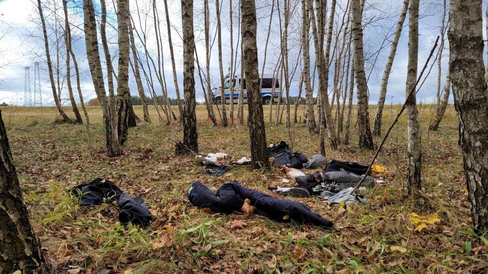
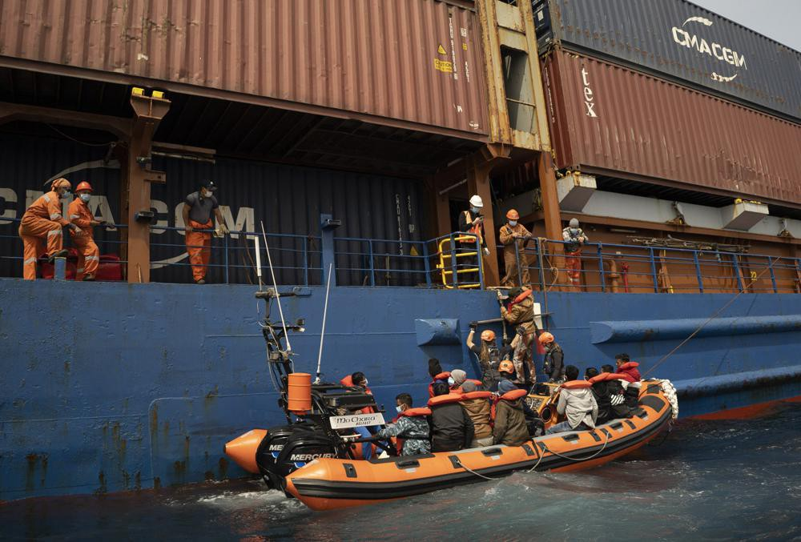
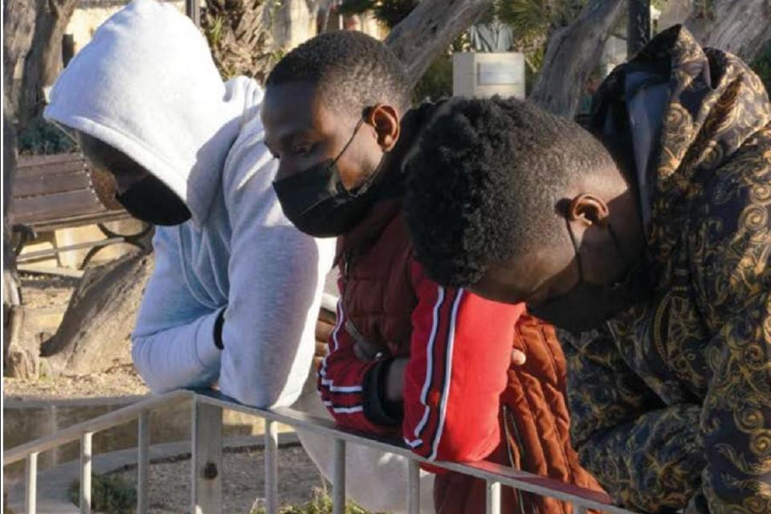
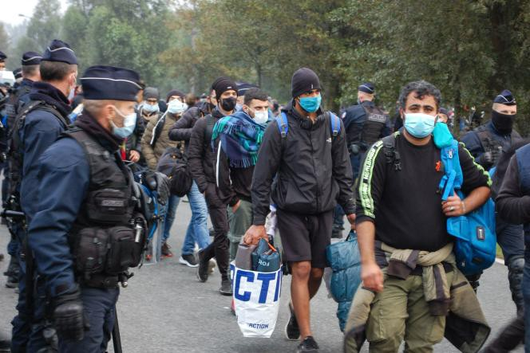

### **AYS News Digest 30/3/2022: The UK Home Office seized 2000 asylum seekers’ phones under an unlawful policy**

Greece national transparency watchdog claims there are no pushbacks taking place by the Greek authorities/ 34 people stranded on a river islet in Greece/ Italian government is providing 428 million euros to welcome Ukrainian refugees/ Germany announces it will stop providing training to the Libyan Coast Guard/ The UK Home Office seized phones from asylum seekers

\(Source: CrimethInc, Photograph: Items abandoned by refugees in Poland\)

**GREECE**

**“Controlling the message: Challenges for independent reporting in Greece” — Media Freedom Rapid Response \(MFRR\)**

The MFRR collaborated with Reporters Without Borders in December 2021 on this [report](https://ipi.media/wp-content/uploads/2022/03/Greece-mission-report-MFRR.pdf) and found that the protection of journalists and the independence of the media in Greece are systemically challenged and restricted in the country\.

This results in a lack of reporting in media outlets that overtly criticizes or shines a negative light on the government\. [The International Press Institute](https://ipi.media/greece-mfrr-report-finds-systemic-challenges-to-press-freedom/?fbclid=IwAR2ZW2Acy5lfkJJsJuPBlsowFw7wyi4jkloGPtFkSYyn7-jGWbhPYiB9vbk) argues that looking at the financial and political instability over the last several years is important in understanding journalism in Greece today\. Furthermore, since 2019, when the Nea Dimokratia gained power, there has been even greater control of the press and the message being sent out to the public\.

The report further covers the murder of crime reporter Giorgos Karaivaz that was a crucial point highlighting the lack of journalistic freedoms and protection in Greece\.

There are particular topics that are problematic in the area of journalism in Greece\. For instance, reporting on protests can lead to harassment from law enforcement and protesters towards journalists\.

_The MFRR has provided recommendations to the Greek authorities and to the European community\._

[**InfoMigrants reports**](https://www.infomigrants.net/en/post/39535/greek-authority-finds-no-evidence-of-migrant-pushback-claims?fbclid=IwAR0ZvTuwDnnxNHAz7ZY1CpxnSy7WO-oDLI8nmplUJVyI2PUI40-1tWyNF14) **that the Greece’s national transparency watchdog found no evidence of migrant pushback after holding an investigation**

Media outlets, such as, Spiegel, and Lighthouse Reports, alongside the UNHCR itself, have reported multiple pushbacks at the hand of the Greek authorities\. The UN High Commissioner for Refugees, Filippo Grandi, has also raised great concern over the reports of pushbacks\. Nonetheless, the investigation by the national transparency watchdog found no evidence to support claims that pushbacks have been taking place by Greek authorities\.

■■■■■■■■■■■■■■ 
> **[Minos Mouzourakis](https://twitter.com/MinosMouz) @ Twitter Says:** 

> > 🇬🇷 gov't body tasked with investigating whether 🇬🇷 gov't carries out #PushBacks found no evidence of wrongdoing on the part of 🇬🇷 gov't

[aead.gr/press/press-re…](https://aead.gr/press/press-releases/oloklirwsh-ereunas-ws-pros-th-diaxirisi-twn-metanasteutikwn-rown-stin-elliniki-epikratia-kai-ta-dialamvanomena-se-dimosieuma-peri-atipwn-anagastikwn-epistrofwn-epanaprowthisewn) 

> **Tweeted at [2022-03-29 12:41:08](https://twitter.com/minosmouz/status/1508786332423933971).** 

■■■■■■■■■■■■■■ 

■■■■■■■■■■■■■■ 
> **[Giorgos Christides](https://twitter.com/g_christides) @ Twitter Says:** 

> > The National Transparency Authority statement saying they found "no evidence to corroborate" reporting by @[LHreports](https://twitter.com/LHreports), @[derspiegel](https://twitter.com/derspiegel) et al. on pushbacks in Greece. I am certain the authority will now honour its middle name and publish the investigation to allow outside scrutiny https://t.co/gb0EI7no94 

> **Tweeted at [2022-03-29 18:58:49](https://twitter.com/g_christides/status/1508881380343693313).** 

■■■■■■■■■■■■■■ 

Recent video footage provided by Spiegel proves contrary to the findings of the investigation…

■■■■■■■■■■■■■■ 
> **[Steffen Lüdke](https://twitter.com/stluedke) @ Twitter Says:** 

> > Footage leaked to @[derspiegel](https://twitter.com/derspiegel) shows how Frontex recorded an illegal pushback. The images were livestreamed to Warsaw. Frontex director #Leggeri covered it up.

Read more about how #Frontex is complicit in the Greek pushback campaign in our latest report:
[spiegel.de/international/…](https://www.spiegel.de/international/europe/we-have-a-lot-of-evidence-pressure-growing-on-frontex-chief-from-pushbacks-investigation-a-047934ed-5f94-44c8-8474-df974644f002) https://t.co/IIXloU7sxV 

> **Tweeted at [2022-03-29 14:49:46](https://twitter.com/stluedke/status/1508818705244950541).** 

■■■■■■■■■■■■■■ 

**Alarm Phone has further reported that a group of 24 people have been stranded on a river islet for two days\. Authorities have been made aware\.**

■■■■■■■■■■■■■■ 
> **[Alarm Phone](https://twitter.com/alarm_phone) @ Twitter Says:** 

> > 🆘on land border between #Greece &amp; #Turkey!

34 people are stranded on a river islet for 2 days: "We have young children, women &amp; an old man. We suffer from the cold &amp; lack of food &amp; two children are in poor health." Authorities are informed. #StopPushbacks #Refugeesgr https://t.co/ji0kHlT00g 

> **Tweeted at [2022-03-30 11:02:56](https://twitter.com/alarm_phone/status/1509124008243081220).** 

■■■■■■■■■■■■■■ 

**SEA/SAR**

**Alarm Phone reported a group of 20 people who were at risk of drowning in the Aegean off the island of Rhodes\. The group were taken on Hellenic Coast Guard board vessel 616, with the hope that they will be safely taken to Greece\.**

■■■■■■■■■■■■■■ 
> **[Alarm Phone](https://twitter.com/alarm_phone) @ Twitter Says:** 

> > 🆘 in the Aegean - 20 people at risk of drowning!

We received a call by a group in severe distress off the #Greek island Rhodes. A video shows people at sea, stabilizing the rubber boat that is full of water. Authorities are informed, rescue is needed now!

#DontLetThemDrown! https://t.co/zzLvRBKE6N 

> **Tweeted at [2022-03-30 07:21:29](https://twitter.com/alarm_phone/status/1509068278521647108).** 

■■■■■■■■■■■■■■ 

■■■■■■■■■■■■■■ 
> **[Alarm Phone](https://twitter.com/alarm_phone) @ Twitter Says:** 

> > @[HCoastGuard](https://twitter.com/HCoastGuard) vessel 616 arrived on scene and took the people on board. We hope everybody is safe and demand disembarkation in #Greece! But we stay alerted, as there is still a high risk of an illegal #pushback. Once again, people had to put their lives at risk to reach Europe. https://t.co/ftcnvkfLz4 

> **Tweeted at [2022-03-30 08:48:08](https://twitter.com/alarm_phone/status/1509090086377472001).** 

■■■■■■■■■■■■■■ 

**BELARUS/POLAND/LITHUANIA/LATVIA**

**The use of refugees as pawns on the Belarus border**

Since 2021, the Belarusian government has used refugees as human pawns to put pressure on the European Union\. Lukashenko’s government encouraged refugees from Afghanistan, Syria, Iraq, and many other parts of Asia and Africa to pass through Belarus with the promise of aiding them to reach the European Union\. Once they arrived in Minsk, they were detained and forced the cross the borders, outside of the official checkpoints, into Poland, Lithuania, and Latvia\.

Whilst Belarusian soldiers force refugees to cross into neighbouring countries at unofficial points, the neighbouring countries then push refugees back into Belarus\. Refugees then find themselves in the limbo zones, where governments have denied them access to food, shelter, healthcare and legal support\.

Despite a restricted zone being created to prevent aid workers to help such individuals, the **No Borders Team** have crossed into this zone to assist those who are trapped\.

You can read more of this article on the recent history of the Poland\-Belarus border here: https://pl\.crimethinc\.com/2022/03/29/solidarity\-in\-an\-age\-of\-war\-and\-displacement\-anarchists\-confront\-the\-weaponization\-of\-refugees\-on\-the\-poland\-belarus\-border?fbclid=IwAR09KYfFd2JV2VkmEJkWPq4ZB\-JI4V\-m839VHekhTOXkBMzm1noiEr2PHKw

The link to the No Borders Team Facebook page is here: [No Borders Team](https://www.facebook.com/nobordersteam/?hc_ref=ARSe1aLbTSB1RoWTmH6FTLzX9Ty-zj0ijvadex-x59HpkLR1A5VeGbUB1PDWM1H-H3E&fref=nf&__xts__[0]=68.ARAgSR6GI6CT3wkjmR3g6iCuvgrAV0Cpzief1CcIwPm76Kcv-jZjif14mjTKAUtRZY_ZVPEjq4yUPfFKxradTY2dgM0NBDtnSzgs12NpaaNmcKheubM41-9MG9OUAfeF3_fVQN-fwqycwmsTVpQlfTQsKBPrI7mxxjizNwIQH5i2JMQ4TiSBG4EYshqSrgc-heUE42_639SIrkVdIBvrYpG5V85gZpwdfMEFLFLVBmMX_rQB5-T1sOYvaaPG3uULfvU3DXNEewiHr0ne_RO4skASC1tJRHxYwuslREemqzVQu1Isc0Q)

**LIBYA**

**Rising cases of tuberculosis in Libya, particularly among migrants and refugees**

The Libyan health system has been greatly affected by years of civil war and the COVID\-19 pandemic\. The instability caused has meant there has been [a slow development in the way of providing specific treatments and creating facilities to support the number of TB patients](https://www.infomigrants.net/en/post/39523/libyas-tb-crisis-worsens-among-migrants?fbclid=IwAR2bj_WS1gS2AAuVtc24bQvrMAtVorYe1ST3SI286ukS6j6zEzVaZeGQpHg) \. Current hospital conditions are often cramped with poor ventilation, allowing for the disease to spread\. In addition, a failure to conduct surveys targeting specific areas which would show how the disease is spreading has limited the level of research that would allow for the early detection of cases and a greater understanding of the disease\.

**Germany announced that its [military will stop providing training to the Libyan coast guard](https://apnews.com/article/europe-middle-east-germany-migration-european-union-ed724be5068d95e9da907754c7e18c4c?fbclid=IwAR1zg4Dh0JTJc-kvfiAOa2H1QWCo-eJEKO50G_qdD--DKXhd2cMEHDWvbug) due to claims of mistreatment of migrants**

This training began seven years ago under Operation Sophia, which was then replaced by Operation Irini in 2020\. Whilst Operation Irini has been criticised for not making enough effort to save migrants at sea, Andrea Sasse, the Foreign Ministry spokeswoman stated:

> “The German government cannot currently justify the training of the Libyan coast guard by German soldiers in view of the repeated unacceptable behavior by individual units of the Libyan coast guard toward refugees and migrants, and also toward non\-governmental organizations\.” 

**MALTA**

[**AP News reports**](https://apnews.com/article/pope-francis-business-religion-libya-africa-9d2cd93f0a6624ded61ced5932eee6b6) **that Sea\-Eye, a German humanitarian group, has called for Malta to take in 32 migrants who have been rescued off the coast of Libya\.**

The group of migrants were initially rescued by a German container ship\. The Sea\-Eye 4 then supported the ship, and assisted the group of migrants\. They now hope that the Maltese authorities will allow their ship to dock and disembark the passengers\.

\(Source: AP News\)

**El Hiblu 3**

[The campaign El Hiblu 3 aimed to free Kader, Amara and Abdallah](https://timesofmalta.com/articles/view/el-hiblu-case-exposes-how-europe-treats-migrants-of-colour-conference.944193?fbclid=IwAR31EN-j9yGHCDz4RF3TM5MjqtXJuftTyxIvqSuyjwXS4Favqtbili85_5Y) who were separated and detained in prison in Malta after having arrived from Libya\. They were charged with crimes amounting to terrorist activity, for which they have pleaded not guilty\.

> “We had arrived with at least 100 other people, but they separated the three of us\. I couldn’t understand why, as we had done nothing wrong\. When I arrived in prison, I was treated in a way I never expected to be treated in Europe\. I was 16\. I lost hope\. I couldn’t sleep\.” — Kader 

In November 2019, they were released on bail, and have remained on parole in Malta\. On the [El Hiblu 3 website](https://elhiblu3.info/) , it states they have to register at the police station every day and attend monthly hearings\. [Amnesty International](https://www.amnesty.org/en/petition/w4r-2020-malta-el-hiblu-3/) has demanded that their charges be dropped and the case closed before trial\.

\(Source: Times Malta, Photo: El Hiblu 3 campaign\)

**ITALY**

**The Italian government will provide [428 million euros to support the reception of Ukrainian refugees](https://www.infomigrants.net/en/post/39524/72000-ukrainians-in-italy-as-reception-aid-arrives?fbclid=IwAR3UQADfuwsIaYakWhiCCG3QX7rXkCa7P9kZ8kQhBfXArKjmslSRkWep3y8)**

The Civil Protection Department is working to ensure this money is channeled in the correct way to reach those who need it\. Many Ukrainians are lodging with relatives or friends, others are staying with families that have offered their homes through volunteer organisations, and some Ukrainians are being lodged by interior ministry reception centres\. The Civil Protection regulation will help to decide which different types of reception qualify people for different levels of living expenses, and thus distinguish what monthly payments individuals may receive\.

Around 71,940 people have arrived in Italy from Ukraine to date; the numbers of individuals are now slowing down\.

**FRANCE**

**Le Monde reports that the prefect of the Pas\-de\-Calais unlawfully dismantled a migrant camp on 29 September 2020\.**

\(Source: Le Monde, Photograph: Bernard Barron, AFP\)

In December of that same year, a group of 11 migrants and eight organisations called into question the legality of this event\. The Court of Justice has now produced a document stating that the prefect did in fact act outside of the law and without the correct authority to dismantle the migrant camp\.

**UK**

[**The Home Office broke UK law by confiscating asylum seekers’ phones**](https://www.opendemocracy.net/en/priti-patel-home-office-refugees-phones-illegal-high-court-ruling/?fbclid=IwAR2Eg3jf2n_4JVrPO9NDVGVA4qgvCjksOdAQJI-rD60bUp4TUNrhNg_jQ10)

The law states that one cannot be searched by an officer of the state, or your property seized, without a specific legal basis\. During most of 2020, asylum seekers arriving in the UK would have their phones taken from them, the Home Office officers would then demand their passwords, download all the data onto their systems, and then refuse to give back the phones\.

The matter of seizing phones was in fact a Home Office policy that was denied during much of the Home Office legal proceedings regarding the matter of seizing phones, but the department later admitted it did in fact exist\.

This policy treated asylum seekers as criminals as soon as they reached the UK, not ignoring the fact that two thirds of those arriving by boat to the UK do eventually prove they are refugees fleeing persecution\. Phones contain personal data and may be the only form of communication between asylum seekers and their families and friends\.

**Whilst 28,300 applications have been received under the Homes For Ukraine scheme, [only 2,700 have been granted](https://www.standard.co.uk/news/uk/home-office-government-yvette-cooper-lisa-nandy-european-b991337.html)**

The scheme began accepting application on 18 March\. Despite other European countries waiving the visa requirements for Ukrainians, the UK still requires an individual to have a visa to enter the country\.

In total, including the Homes for Ukraine scheme, **25,500 visas** have been issued\. There does seem to be some progress in the processing of visa applications as the Home Office has improved its systems, however, a lot more needs to be done to welcome greater numbers of people seeking refuge\.

Further reading: [https://www\.standard\.co\.uk/news/uk/ukraine\-prime\-minister\-local\-government\-association\-homes\-conservative\-b991416\.html](https://www.standard.co.uk/news/uk/ukraine-prime-minister-local-government-association-homes-conservative-b991416.html)

**GENERAL**

Thomas Coombes writes about how the [language used by organisations and the media reinforces the sense of fear of towards refugees](https://www.thenewhumanitarian.org/opinion/2022/03/29/humanity-not-crisis-aid-refugees?fbclid=IwAR33EeWZmzHMGWURXl7DGzFNg5CtTBUvfOxlqil5pVIPg6kAtY_UeI5917A) \. The terminology and imagery used to describe the movement of refugees into Europe is often linked to large crowds, an ‘influx’, a sense of disaster and overcrowding\. Coombes also states there is often a strong link to climate disaster, such as, ‘wave’, ‘flood’, ‘flows’ which causes even greater fear\.

[Mindworks Lab](https://mindworkslab.org/) , an initiative set up by Greenpeace, explains the timeline that follows the reactions of the public towards crises\. It begins with the “honeymoon phase” where there is a general consensus of empathy and support shown and ends with compassion fatigue and a sense of helplessness\. There needs to be greater messaging relating to togetherness, and what we can do to support refugees\.

Thomas Coombes explores **five** **things** people can do to help push for a more humane and sustainable response to refugees\.

> “ **Here are five things we can all do right now:** 

> \- Call this a moment for action, not a crisis\. 

> \- Talk about humans and people, not refugees or asylum seekers\. 

> \- Share stories that show the change we want to see\. 

> \- Let people on the move tell their own, complete stories — of suffering, but also of aspiration, determination, solidarity, and [resilience](https://www.ragp.org.uk/programmes/resilience) \. 

> \- Show audiences in host countries how they can be part of the solution: Together, that we can do this\.” 

**Further reading/resources:**
- ‘Europe’s Big Secret: Funding Offshore Migrant Prisons’ — Foreign policy Research Institute

- Helena Maleno has received an Honorary Doctorate for her work defending human rights, including her work supporting the rights of migrants\.

■■■■■■■■■■■■■■ 
> **[Javier Baeza](https://twitter.com/14kilometros) @ Twitter Says:** 

> > Con emoción e ilusión comienza el acto de nombramiento de @[HelenaMaleno](https://twitter.com/HelenaMaleno) Doctora Honoris Causa en la @[UIBuniversitat](https://twitter.com/UIBuniversitat) 
Contra criminalización de los poderes oscuros el reconocimiento de los intelectuales
#DefenderaquienDefiende https://t.co/lWDR7B7zix 

> **Tweeted at [2022-03-30 09:59:33](https://twitter.com/14kilometros/status/1509108055899840513).** 

■■■■■■■■■■■■■■ 

- A video by the Guardian — ‘Life as a refugee in Calais: the Ukraine war is a wake up call’

**Find daily updates and special reports on our [Medium page](https://medium.com/are-you-syrious) \.**

**If you wish to contribute, either by writing a report or a story, or by joining the info gathering team, please let us know\.**

**We strive to echo correct news from the ground through collaboration and fairness\. Every effort has been made to credit organisations and individuals with regard to the supply of information, video, and photo material \(in cases where the source wanted to be accredited\) \. Please notify us regarding corrections\.**

**If there’s anything you want to share or comment, contact us through Facebook, Twitter or write to: areyousyrious@gmail\.com**

_Converted [Medium Post](https://medium.com/are-you-syrious/ays-news-digest-30-3-2022-the-uk-home-office-seized-2000-asylum-seekers-phones-under-an-unlawful-371149ff7ac5) by [ZMediumToMarkdown](https://github.com/ZhgChgLi/ZMediumToMarkdown)._
