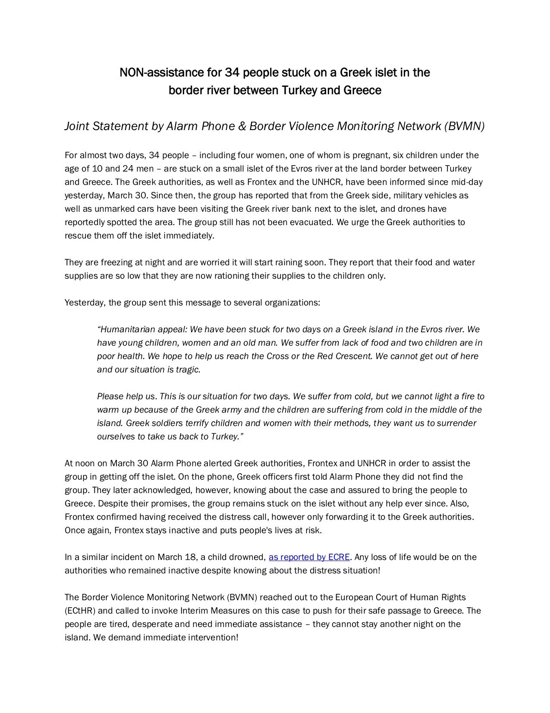
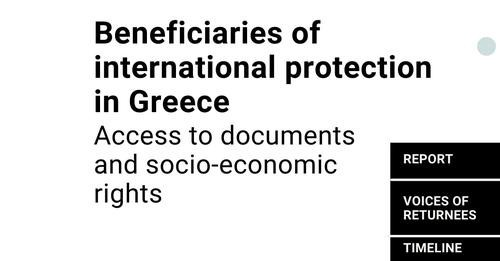

### AYS News Digest 1/4/22: Approved interim measures for people stuck between Turkey and Greece, but what happens next time?
### BVMN and AlarmPhone demand immediate evacuation to Greece of 34 people who were stuck on the islet in Evros between Turkey and Greece / Report on access to social and economic rights in Greece / EP blocks Frontex’s report, now what? / Analysis: increased immigration does not result in increased terrorism rates caused by the immigrants themselves / more reports on the European hypocrisy in refugee reception & other news

Photo credit: Migrants and Refugees Movement Naples

Together with [Alarm Phone](https://twitter.com/alarm_phone) , our network Border Violence Monitoring Network has demanded immediate evacuation to Greece of 34 people who were stuck on the islet in Evros between Turkey and Greece\.

This resulted in interim measure request being granted\. 
ECHR notified the Greek state to tell them they are obliged to give shelter and food to the people\.

> _We are still in contact with the group & they just said they have been attacked by men in military clothes\. This must stop — bring them to a safe place\! — Alarm Phone_ 

### LIBYA
### SAR IN THE MED
### 25 people assumed deceased

It is [reported](https://l.facebook.com/l.php?u=https%3A%2F%2Fwww.infomigrants.net%2Fen%2Fpost%2F39603%2Fcanary-islands-survivors-say-25-bodies-were-thrown-overboard%3Ffbclid%3DIwAR1AVi-Wb7UBqGUQFLwecp4KKHimqgokpmN5BDjYFi9oIxxDGrwR-lHF3IU&h=AT2MIWdcyXGfG8bSSgHi1417K87fiEkZaZOPRGNYNTLLVClO2c2Lmiw0gL2ieoqZqt2kIe55KQG4TZIqGZYBFz5mbsPaoi_DEDSaMSwmHQPnofm4ab-Pe9M4yXAVbnQHfsMardw1rbCru55l1NlFyf-YVS0FKQ&__tn__=R]-R&c[0]=AT2a1Ep8WWV6MaJHJH6fTNepJUbRDaJO-vK6uTGsz0DJPBequ5fJsco497M2mPIZL29RScEVdKCqtiYqUbmOJkxhKdkKiUG4XFs_7LW8e8C3giFCGRm7WLIOzsLudKGYGbm7IXzJnmLohHiL2AG1uiWLWnVEsYHhUYhV7wqN8P0Hek8TULafg_a0EPNzT2unLHlYrzvJK-Ub) that around 25 people are believed to have died during an attempt to reach the **Canary Islands** by boat\. Survivors said the bodies of the dead were thrown overboard\.
### EU

The EU and US will likely have their next “team meeting” where they swap ideas on how to “counter irregular migration” on June 24th:
### EP blocks Frontex

A majority of lawmakers sitting on a budget control committee [voted](https://euobserver.com/migration/154639?fbclid=IwAR0rIiAYgoBfxVNvJqZWRJwPC4W4fAF0yyoHeFTgQ4nCgbLx0p5NO7S5qlk) on Thursday \(31 March\) to postpone Frontex’s discharge, a measure used by the European Parliament to hold EU institutions and agencies to account\. Aside from Frontex, all other EU agencies had their books cleared by the committee\.

> _In a vote with 6 in favour to 23 against and 1 abstentions in the so\-called [discharge procedure](https://www.europarl.europa.eu/news/en/headlines/eu-affairs/20150427STO46470/discharge-procedure-how-parliament-scrutinises-the-eu-budget) , MEPs in the Budgetary Control Committee postponed the decision on the 2020 accounts of the EU’s border control agency, Frontex\. They cited, as reasons behind the decision, a failure to fulfil the conditions set out in Parliament’s [previous discharge report](https://www.europarl.europa.eu/news/en/press-room/20210923IPR13401/ep-committee-asks-for-part-of-frontex-budget-to-be-frozen) , as well as findings by the EU’s Anti\-Fraud watchdog regarding harassment, misconduct and migrant pushbacks involving the Agency, presented to the committee by the OLAF Director\-General and judged by the Members to be serious enough to postpone the discharge\. Reported violations in Greece were not addressed and the operations in Hungary were continued regardless of the ruling by the Court of Justice that refugee return operations in Hungary in 2020 were incompatible with EU law, they [say](https://www.europarl.europa.eu/news/en/press-room/20220328IPR26301/meps-withhold-discharge-of-eu-border-control-agency-frontex-accounts) \._ 

### GREECE

The updated report on the situation of beneficiaries of international protection in Greece, published today by [RSA](https://rsaegean.org/en/beneficiaries-of-international-protection-in-greece-report/?fbclid=IwAR2fiMO6_4x0gfiuuRQl54dAgYLdddOZzatw1d_i3Hjs5eUHGQBL-u7bDhc) and Stiftung PRO ASYL, highlights chronic legal and practical barriers excluding them from the basic documents and socio\-economic rights needed to rebuild their lives\.

Seven cases of refugees granted status by Greece and readmitted thereto by other European Union countries in the last two years illustrate the particular impact of these systemic obstacles on people returned to Greece\.

[Downlaod the Report](https://rsaegean.org/wp-content/uploads/2022/03/2022-03_RSA_BIP_EN.pdf)
### Greek version of the truth
### ITALY
### Special protection accepted by the Court of Turin, in favor of a Senegalese citizen applicant

The court concluded, among others, that “proceeding with the comparative assessment between the integration situation that the applicant has in Italy and that which he experienced before departure and in which he would live in case of return, there is an effective and unbridgeable disproportion between the two contexts\. of life in the enjoyment of fundamental rights which are an indispensable prerequisite for a dignified life”\.

Read more:
### [Protezione speciale al cittadino senegalese dopo domanda reiterata di asilo](https://l.facebook.com/l.php?u=https%3A%2F%2Fwww.meltingpot.org%2F2022%2F04%2Fprotezione-speciale-al-cittadino-senegalese-dopo-domanda-reiterata-di-asilo%2F%3Ffbclid%3DIwAR1p6sfRgPvdGEUaPkXtKnT6sVYg5wnSvouGoj7DPAJWmrEIDan5efpX9LI&h=AT2AouVp5zhtP4A1t9KVeqv_0yPjsW68oPneJwWTyK6X91fpjqS-rD86o8ehfNdgZAPHQ10CAAjtgIOWA1cDhayIvLNK36uQbI4eLqqudjA6MJPRKbHZSqlf7z9t-9lFODcjoIRCZoXf0pHAQ97FUZC9tqY8Sw&__tn__=R]-R&c[0]=AT2lB6zPHXI2JFFr1Vu3aAqFbeVUpS3LkuiTTh9ZPNRDhTyjHjLEZE9YXdgdfvsVTQ2oX9Rwt-ciYiWZzwBqCQlCFlFITDT92nQgv2kTX2AWBA6Jc7qxtauLRbDZBbAM9Yudvuvey3PtgrULzCkbeb7Xz6qbwg19QN9qEeKtmiOrg5jP-NAd78Xd_Dl_Tl1F8uqOk-GTQeG7X1JNnpodn47M_XQtwZpFNItRKuQ5d30)
### [Una protezione speciale accolta dal Tribunale di Torino, in favore di richiedente cittadino senegalese\. Secondo il…](https://l.facebook.com/l.php?u=https%3A%2F%2Fwww.meltingpot.org%2F2022%2F04%2Fprotezione-speciale-al-cittadino-senegalese-dopo-domanda-reiterata-di-asilo%2F%3Ffbclid%3DIwAR1p6sfRgPvdGEUaPkXtKnT6sVYg5wnSvouGoj7DPAJWmrEIDan5efpX9LI&h=AT2AouVp5zhtP4A1t9KVeqv_0yPjsW68oPneJwWTyK6X91fpjqS-rD86o8ehfNdgZAPHQ10CAAjtgIOWA1cDhayIvLNK36uQbI4eLqqudjA6MJPRKbHZSqlf7z9t-9lFODcjoIRCZoXf0pHAQ97FUZC9tqY8Sw&__tn__=R]-R&c[0]=AT2lB6zPHXI2JFFr1Vu3aAqFbeVUpS3LkuiTTh9ZPNRDhTyjHjLEZE9YXdgdfvsVTQ2oX9Rwt-ciYiWZzwBqCQlCFlFITDT92nQgv2kTX2AWBA6Jc7qxtauLRbDZBbAM9Yudvuvey3PtgrULzCkbeb7Xz6qbwg19QN9qEeKtmiOrg5jP-NAd78Xd_Dl_Tl1F8uqOk-GTQeG7X1JNnpodn47M_XQtwZpFNItRKuQ5d30)

[l\.facebook\.com](https://l.facebook.com/l.php?u=https%3A%2F%2Fwww.meltingpot.org%2F2022%2F04%2Fprotezione-speciale-al-cittadino-senegalese-dopo-domanda-reiterata-di-asilo%2F%3Ffbclid%3DIwAR1p6sfRgPvdGEUaPkXtKnT6sVYg5wnSvouGoj7DPAJWmrEIDan5efpX9LI&h=AT2AouVp5zhtP4A1t9KVeqv_0yPjsW68oPneJwWTyK6X91fpjqS-rD86o8ehfNdgZAPHQ10CAAjtgIOWA1cDhayIvLNK36uQbI4eLqqudjA6MJPRKbHZSqlf7z9t-9lFODcjoIRCZoXf0pHAQ97FUZC9tqY8Sw&__tn__=R]-R&c[0]=AT2lB6zPHXI2JFFr1Vu3aAqFbeVUpS3LkuiTTh9ZPNRDhTyjHjLEZE9YXdgdfvsVTQ2oX9Rwt-ciYiWZzwBqCQlCFlFITDT92nQgv2kTX2AWBA6Jc7qxtauLRbDZBbAM9Yudvuvey3PtgrULzCkbeb7Xz6qbwg19QN9qEeKtmiOrg5jP-NAd78Xd_Dl_Tl1F8uqOk-GTQeG7X1JNnpodn47M_XQtwZpFNItRKuQ5d30)
### GERMANY
### Asylum in Germany for those saved in the sea

Since summer 2018, until the end of 2021 **only five people** rescued by German sea rescue NGOs in the Mediterranean have **received a protection** status in Germany\.

No April joke: As from a response published the day before yesterday by the federal government to a small request from the AfD, in the period from August 1 2018 to December 31 2021 there were **5773 people in the Mediterranean** rescued by the German SAR NGOs and who now reside in Germany\. However, systematic statistical lifts are not carried out by the federal government, “so that the fullness, resilience and final validity cannot be judged”\.

Of the people saved by these organizations in the mentioned period and transferred to Germany, **155** have applied for asylum in the Federal Republic, **only five of them have received a protection status** \. One person was granted asylum according to Article 16a basic law, another person refugee protection under §3 Asylum Act, and three other persons subsidized protection under §4 Asylum Act\.
### FRANCE
### Mailbox for justice and end of Illegal evictions

Mailboxes have been set up in informal living areas in Calais\. From now on, the authorities will be obliged to respect the rule of law\. With the mailboxes, people can’t be evicted because French law protects “homes”

They were able to install mailboxes on the property, allowing people to register and receive mail and preventing them from expulsion\. 
\- Clever thinking, and maybe inspirational\!
### Mosaïc Calais

A new organisation, Mosaïc Calais, was set up to provide a cultural space and recreation to displaced people in the area
### [Mosaïc Calais — Culture et partage avec les exilés](https://www.mosaic-calais.com/?fbclid=IwAR1eFCKy81cVu_mBPWsftWNYs-u4jblnkUXFZv4j-AmaYI-nPLB9rI2IMqw)
### [Mosaïc intervient à Calais pour réunir exilé·e·s et français·e·s autour d’activités culturelles et artistiques qui…](https://www.mosaic-calais.com/?fbclid=IwAR1eFCKy81cVu_mBPWsftWNYs-u4jblnkUXFZv4j-AmaYI-nPLB9rI2IMqw)

[www\.mosaic\-calais\.com](https://www.mosaic-calais.com/?fbclid=IwAR1eFCKy81cVu_mBPWsftWNYs-u4jblnkUXFZv4j-AmaYI-nPLB9rI2IMqw)
### Expulsions continue

However, at the same time, new evictions were reported in the Dunkirk area, leaving more than 300 people outside under the rain with no shelter, Utopia 56 teams reported\.

Utopia 56, Collective Aid and Action Humanitaire further [report](https://l.facebook.com/l.php?u=https%3A%2F%2Fwww.meltingpot.org%2F2022%2F04%2Fda-calais-a-dover-nessun-porto-e-sicuro-per-alcuni-migranti%2F%3Ffbclid%3DIwAR1kpgW9HbibHkeJEEQUAJKyPbWqOmlEL3rzqpCJuRC4Vii9eu1SGVMnyxU&h=AT2rpUp9EsOJzmSdyBif04GKimZQgIegIyQCjzzniKVJyEHxiyiebw-RChkC_yk7zNfhL93YJIbLI0Rk_G0J5ZKdG03ZjFAn1FItzrCbpWr8lqCoUyofvS_R-Lip0zl20g5d6Us6gjPI_vkZ12veambGbgI6yw&__tn__=R]-R&c[0]=AT2DYTHvKR6M5tyWOwQtMwkEojcfx_mOdVQYKhS09jvvna0bfGYS2FKcpwPY_VmDUhilPylhlUNa2vTDxMsbEUWKoofi3w_9UOyOUfQ68GU8Q5inJdw3X7VcTUoLNYjlK1aQwsYnQW5P2-ZU-eBWLiJ12gyChr92O1miiqt2ChoshUc72ek_jVavvyVQ7mfi12uB8jw94lt1) that on the basis of nationality, the French authorities protect or do not protect people requesting humanitarian protection\.

The municipality of Calais has warmly welcomed hundreds of Ukrainian people and provided them with accommodation\. On the other hand, 1,500 Afghan, Ethiopian, Eritrean, Iraqi and Syrian people are still in Calais with the same request for protection but do not benefit from the same treatment\. The latter are stranded along the Franco\-British border in adverse weather conditions, living in damp sheds or tents\.

> _Reception is not a question of financial or material means, but of political will_ 

### LITHUANIA
### 100 people decided to file a collective lawsuit against Lithuania and need help to raise money for lawyers
### [Stop the Detention of Migrants in Lithuania\!, organized by L\. H\.](https://l.facebook.com/l.php?u=https%3A%2F%2Fwww.gofundme.com%2Ff%2Fstopdetentionlithuania%3Ffbclid%3DIwAR20Kp0RIkadv_G15DDb8jlTV1chlpaTuLrXarV_ThSJLrNPfANhiZMnRkE&h=AT0opx2-FFS0oVy5j93Az7vcDM2OZUAqH1S_vsLFgyfZs0UFZ117HLLFZ3y4Y0vb3dpHTqNk-SXLgqmuuHgy3Vmbt0uxn1iLtdVYjPabkzF0I0YUGEfA5OqToGi-4mrDaa7jvyAl0vEYcpPvlg&__tn__=-UK-R&c[0]=AT1wVwTXZ2k86zinEJUwHvefUePYOSw-w93rA-u1eJav0lxJxKVusuMs7QeVsPDqM7ueDEa4R6YYQoqoRx6VX3jh-kf6qBhzHVVbEMvaYjlDzfs5pr7mjiIgdMdzLA3v9Lus_v96ssIYfzirKwc3Mv5jqcsudyRvLf3156d-KH71ZR8s)
### [Fundraising campaign to take legal steps against the illegal detention of thousands of migrants in Lithuanian camps We…](https://l.facebook.com/l.php?u=https%3A%2F%2Fwww.gofundme.com%2Ff%2Fstopdetentionlithuania%3Ffbclid%3DIwAR20Kp0RIkadv_G15DDb8jlTV1chlpaTuLrXarV_ThSJLrNPfANhiZMnRkE&h=AT0opx2-FFS0oVy5j93Az7vcDM2OZUAqH1S_vsLFgyfZs0UFZ117HLLFZ3y4Y0vb3dpHTqNk-SXLgqmuuHgy3Vmbt0uxn1iLtdVYjPabkzF0I0YUGEfA5OqToGi-4mrDaa7jvyAl0vEYcpPvlg&__tn__=-UK-R&c[0]=AT1wVwTXZ2k86zinEJUwHvefUePYOSw-w93rA-u1eJav0lxJxKVusuMs7QeVsPDqM7ueDEa4R6YYQoqoRx6VX3jh-kf6qBhzHVVbEMvaYjlDzfs5pr7mjiIgdMdzLA3v9Lus_v96ssIYfzirKwc3Mv5jqcsudyRvLf3156d-KH71ZR8s)

[l\.facebook\.com](https://l.facebook.com/l.php?u=https%3A%2F%2Fwww.gofundme.com%2Ff%2Fstopdetentionlithuania%3Ffbclid%3DIwAR20Kp0RIkadv_G15DDb8jlTV1chlpaTuLrXarV_ThSJLrNPfANhiZMnRkE&h=AT0opx2-FFS0oVy5j93Az7vcDM2OZUAqH1S_vsLFgyfZs0UFZ117HLLFZ3y4Y0vb3dpHTqNk-SXLgqmuuHgy3Vmbt0uxn1iLtdVYjPabkzF0I0YUGEfA5OqToGi-4mrDaa7jvyAl0vEYcpPvlg&__tn__=-UK-R&c[0]=AT1wVwTXZ2k86zinEJUwHvefUePYOSw-w93rA-u1eJav0lxJxKVusuMs7QeVsPDqM7ueDEa4R6YYQoqoRx6VX3jh-kf6qBhzHVVbEMvaYjlDzfs5pr7mjiIgdMdzLA3v9Lus_v96ssIYfzirKwc3Mv5jqcsudyRvLf3156d-KH71ZR8s)

[Ewa Wołkanowska\-Kołodziej](https://www.facebook.com/ewa.wolkanowska?__cft__[0]=AZWUu43ZVg-J7IqyaPVeSNXMFupRxf6nsdS-GfG--i_8wN7CqMNkmqmLGB5PiIXUxcHW8Ozz6_uu5hd4FvzqW3aBk0cn-uVP946nODpi0-IniI-gpCWM8UptHcu_xFiqQUwtyzgEWgoBRacJWxT7OncK&__tn__=-UC%2CP-R) reported about the fates of the people in detention centres:

> _He is young in his twenties\. I will call him Matthew\._ 

> _Do you remember the protest in Miedniki? What I’m going to talk about started there March 2nd\. Although the wounds on Matthew’s body appeared the day before yesterday\._ 

> _Refugees then organized a protest in which Matthew was not involved\. Four officers entered his room this morning\. One of the men kicked him in the leg\. Matthew fell to the floor along with his chair\. When he raised his head, the man pushed it to the floor with his shoe and said something, pointing at the gun\._ 

> _Two minutes, no more\. They’re out\. They went to the next room\._ 

> _Two minutes\. Or rather 8 months and two minutes, because that’s how much Matthew spent in a closed resort in Lithuania\. Refugees trapped for months, bursting\. Almost every day I get a picture of someone broken\. Someone’s friends forcefully pulled a knife out of his hand because he shaved himself\. A farewell letter\. Message: “I can’t sleep, I have to make sure my friend doesn’t kill herself\.” And Mateusz and his younger colleague broke up in such a way that they decided to run away\._ 

> _They ran into the night\. They run into the woods\. They say it’s been an hour somewhere when they lay on their stomachs to check on the map exactly where they are\. They made sure no one noticed the phone light\._ 

> _Security guards showed up out of nowhere\. Their dog was the first to throw himself on the back of an eighteen\-year\-old\. At that time, the officer gave Matthew pepper gas in the eyes\. The dog then started biting Matthew\. Too bad I won’t show photos of these mornings\. I’m looking at them by myself, winking to protect myself from this view\. The bodyguard said : “Bravo\! Well done\! “_ 

> _There were five of them guardians\. Four men, one woman\. And there goes this dog\._ 

> _Matthew doesn’t know if it’s because of gas or because of further bites, he’s unconscious\. When he pooped, the officer held him by his neck, telling him to get up and go\._ 

> _They went to the building where the ambulance was already waiting\. The nurse, when she saw the wounds of the migrants, turned to the guard and asked, “What did you do to them?” “ She laughed\. And they laughed \._ 

> _The ambulance driver, an older man, brought water to Matthew\. “As my only sympathy” — the story\._ 

> _When it became clear that they had to take him to the hospital, Matthew asked to see his friend\. “He only turned 18 a month ago\. He’s in a poor mental state, crying a lot”\. He heard: “Calm down, we are not going to rape him\.”_ 

> _At the hospital he got an anemia shot\. He asked for water — he didn’t get it\. He wanted to go to the location — they weren’t allowed him\. He asked for a release — they only gave him a registration number as a souvenir of the event\._ 

> _He returned to the guard around 6am\. A mate was there too, frozen\. They asked for a blanket\. They didn’t get it\. There was water in the faucet, they could have drank\. “After four hours, three uniforms came to us, who beat us\. I remember their faces, I can describe them\. I have them in front of my eyes all the time,” he says\._ 

> _Finally, they were taken back to the resort in Medniki Krolewski\. It’s been taken apart\. It has been searched\. Took money and power banks\._ 

> _Matthew’s leg hurt more and more\._ 

> _The ambulance was called again\. He didn’t have the strength to reach her\. His colleagues helped him\. Did he get anesthesia, or maybe some calming pills? Sam doesn’t know what they gave us\._ 

> _The officer said, “This is what happens when you escape the camp\.”_ 

She concludes her report by saying: “I have more reports of both boys including their mates\. I have videos and pictures to upload\. So scary, so drastic\. Full of violence and helplessness\.”
### [Cold water and 3 square metres of space — what’s life like in Lithuania’s prison\-turned\-migrant…](https://l.facebook.com/l.php?u=https%3A%2F%2Fwww.lrt.lt%2Fen%2Fnews-in-english%2F19%2F1610208%2Fcold-water-and-3-square-metres-of-space-what-s-life-like-in-lithuania-s-prison-turned-migrant-cetre%3Ffbclid%3DIwAR1eFCKy81cVu_mBPWsftWNYs-u4jblnkUXFZv4j-AmaYI-nPLB9rI2IMqw&h=AT0B4JjSfMWkTcIy0l7Q3SbM_QR10yX9gvtDaVtuPvZfLaCTTZq9Bwbl4fErNrBXXT-zOeBbTft3URjidYyUdMpPPdDaCpzzNdGJ3upDBud_2j5aQ4e3V2r-9Pa9FimgXmAkwuue8EO62xnsW-GkrRzDN9BBjw&__tn__=R]-R&c[0]=AT0A1zR65UcmwlQCGumhzzxwoV2ubB3AxxJl4NXTiOzzNXY3eikRvBpiX189caaRPNmGRNYGlFOaW-RQVIzsy-zvuwFE-G7h2DF8Mwxwt-Up7b8rzAeMCI_mZkfajMZFzNOBCl7J9TSNUILk2gu0M9nmG1y1YLhD5vgyBs3csq-BfuWUVIyG3vtvVJSr829JEDL0brtqNMWx)
### [Poor food, no hot water, living in prison cells with no personal space\. These are some of the complaints of migrants…](https://l.facebook.com/l.php?u=https%3A%2F%2Fwww.lrt.lt%2Fen%2Fnews-in-english%2F19%2F1610208%2Fcold-water-and-3-square-metres-of-space-what-s-life-like-in-lithuania-s-prison-turned-migrant-cetre%3Ffbclid%3DIwAR1eFCKy81cVu_mBPWsftWNYs-u4jblnkUXFZv4j-AmaYI-nPLB9rI2IMqw&h=AT0B4JjSfMWkTcIy0l7Q3SbM_QR10yX9gvtDaVtuPvZfLaCTTZq9Bwbl4fErNrBXXT-zOeBbTft3URjidYyUdMpPPdDaCpzzNdGJ3upDBud_2j5aQ4e3V2r-9Pa9FimgXmAkwuue8EO62xnsW-GkrRzDN9BBjw&__tn__=R]-R&c[0]=AT0A1zR65UcmwlQCGumhzzxwoV2ubB3AxxJl4NXTiOzzNXY3eikRvBpiX189caaRPNmGRNYGlFOaW-RQVIzsy-zvuwFE-G7h2DF8Mwxwt-Up7b8rzAeMCI_mZkfajMZFzNOBCl7J9TSNUILk2gu0M9nmG1y1YLhD5vgyBs3csq-BfuWUVIyG3vtvVJSr829JEDL0brtqNMWx)

[l\.facebook\.com](https://l.facebook.com/l.php?u=https%3A%2F%2Fwww.lrt.lt%2Fen%2Fnews-in-english%2F19%2F1610208%2Fcold-water-and-3-square-metres-of-space-what-s-life-like-in-lithuania-s-prison-turned-migrant-cetre%3Ffbclid%3DIwAR1eFCKy81cVu_mBPWsftWNYs-u4jblnkUXFZv4j-AmaYI-nPLB9rI2IMqw&h=AT0B4JjSfMWkTcIy0l7Q3SbM_QR10yX9gvtDaVtuPvZfLaCTTZq9Bwbl4fErNrBXXT-zOeBbTft3URjidYyUdMpPPdDaCpzzNdGJ3upDBud_2j5aQ4e3V2r-9Pa9FimgXmAkwuue8EO62xnsW-GkrRzDN9BBjw&__tn__=R]-R&c[0]=AT0A1zR65UcmwlQCGumhzzxwoV2ubB3AxxJl4NXTiOzzNXY3eikRvBpiX189caaRPNmGRNYGlFOaW-RQVIzsy-zvuwFE-G7h2DF8Mwxwt-Up7b8rzAeMCI_mZkfajMZFzNOBCl7J9TSNUILk2gu0M9nmG1y1YLhD5vgyBs3csq-BfuWUVIyG3vtvVJSr829JEDL0brtqNMWx)

Ombudswoman’s report:
### POLAND

“Snow has fallen across Poland\. [\#Refugees](https://www.facebook.com/hashtag/refugees?__eep__=6&__cft__[0]=AZUBwvRNVxV48gdu4VPbj8mi3aBu-JJ5YBx1vUc31sPSAKIxb6LgzhpWCLtAhJl4D6QR-XY8OYD3fDI8WjetF-rpI9_X_0pdvw4NnjGbnch017THdxVd4anXChH1EG1Mx07w0pKG-M0t1xbui8gt1Oc3JEuXPaUK7K_eN1pZdNRVhqnw_vaxSPj-5ew_AZW1alQ&__tn__=R]-R) ; young children, people in need of medical care, have been camping literally metres from the [\#Poland](https://www.facebook.com/hashtag/poland?__eep__=6&__cft__[0]=AZUBwvRNVxV48gdu4VPbj8mi3aBu-JJ5YBx1vUc31sPSAKIxb6LgzhpWCLtAhJl4D6QR-XY8OYD3fDI8WjetF-rpI9_X_0pdvw4NnjGbnch017THdxVd4anXChH1EG1Mx07w0pKG-M0t1xbui8gt1Oc3JEuXPaUK7K_eN1pZdNRVhqnw_vaxSPj-5ew_AZW1alQ&__tn__=R]-R) border for almost a week now\. Sadly, this is not an April Fools’ [\#joke](https://www.facebook.com/hashtag/joke?__eep__=6&__cft__[0]=AZUBwvRNVxV48gdu4VPbj8mi3aBu-JJ5YBx1vUc31sPSAKIxb6LgzhpWCLtAhJl4D6QR-XY8OYD3fDI8WjetF-rpI9_X_0pdvw4NnjGbnch017THdxVd4anXChH1EG1Mx07w0pKG-M0t1xbui8gt1Oc3JEuXPaUK7K_eN1pZdNRVhqnw_vaxSPj-5ew_AZW1alQ&__tn__=R]-R) but a reality at the [\#PolandBY](https://www.facebook.com/hashtag/polandby?__eep__=6&__cft__[0]=AZUBwvRNVxV48gdu4VPbj8mi3aBu-JJ5YBx1vUc31sPSAKIxb6LgzhpWCLtAhJl4D6QR-XY8OYD3fDI8WjetF-rpI9_X_0pdvw4NnjGbnch017THdxVd4anXChH1EG1Mx07w0pKG-M0t1xbui8gt1Oc3JEuXPaUK7K_eN1pZdNRVhqnw_vaxSPj-5ew_AZW1alQ&__tn__=R]-R) border this morning\.”

The court ruling that the deportations of refugees as inhumane and illegal did not make any impression on the Polish border guards\. For the third time, they pushed two Kurdish families with seven children over the border wire
### [Prawo i miłosierdzie na pograniczu: push\-backi nielegalne, a chora kurdyjska dziewczynka wyrzucona…](https://l.facebook.com/l.php?u=https%3A%2F%2Fbialystok.wyborcza.pl%2Fbialystok%2F7%2C35241%2C28286110%2Cprawo-na-pograniczu-push-backi-nielegalne-a-chora-kurdyjska.html%3Ffbclid%3DIwAR1kpgW9HbibHkeJEEQUAJKyPbWqOmlEL3rzqpCJuRC4Vii9eu1SGVMnyxU&h=AT3hfB0qz6qyVdwuimaieY-lmpMb8mO_T1BJPcrHIHMmwLHfK4UR9a06g_8fOOzP-NmiagmraItyNXJyYYJ6_yazzt_SdzjPinMt735YUJcwrNR3E-KF6Inv_h2wOZf9CDBvWu7hqNbUhe9MOehmNvq7XFiFsQ&__tn__=R]-R&c[0]=AT0A1zR65UcmwlQCGumhzzxwoV2ubB3AxxJl4NXTiOzzNXY3eikRvBpiX189caaRPNmGRNYGlFOaW-RQVIzsy-zvuwFE-G7h2DF8Mwxwt-Up7b8rzAeMCI_mZkfajMZFzNOBCl7J9TSNUILk2gu0M9nmG1y1YLhD5vgyBs3csq-BfuWUVIyG3vtvVJSr829JEDL0brtqNMWx)
### [Ci ludzie stoją teraz po białoruskiej stronie, za żyletkowym płotem, metr od granicy, naprzeciwko zabudowań polskiej…](https://l.facebook.com/l.php?u=https%3A%2F%2Fbialystok.wyborcza.pl%2Fbialystok%2F7%2C35241%2C28286110%2Cprawo-na-pograniczu-push-backi-nielegalne-a-chora-kurdyjska.html%3Ffbclid%3DIwAR1kpgW9HbibHkeJEEQUAJKyPbWqOmlEL3rzqpCJuRC4Vii9eu1SGVMnyxU&h=AT3hfB0qz6qyVdwuimaieY-lmpMb8mO_T1BJPcrHIHMmwLHfK4UR9a06g_8fOOzP-NmiagmraItyNXJyYYJ6_yazzt_SdzjPinMt735YUJcwrNR3E-KF6Inv_h2wOZf9CDBvWu7hqNbUhe9MOehmNvq7XFiFsQ&__tn__=R]-R&c[0]=AT0A1zR65UcmwlQCGumhzzxwoV2ubB3AxxJl4NXTiOzzNXY3eikRvBpiX189caaRPNmGRNYGlFOaW-RQVIzsy-zvuwFE-G7h2DF8Mwxwt-Up7b8rzAeMCI_mZkfajMZFzNOBCl7J9TSNUILk2gu0M9nmG1y1YLhD5vgyBs3csq-BfuWUVIyG3vtvVJSr829JEDL0brtqNMWx)

[l\.facebook\.com](https://l.facebook.com/l.php?u=https%3A%2F%2Fbialystok.wyborcza.pl%2Fbialystok%2F7%2C35241%2C28286110%2Cprawo-na-pograniczu-push-backi-nielegalne-a-chora-kurdyjska.html%3Ffbclid%3DIwAR1kpgW9HbibHkeJEEQUAJKyPbWqOmlEL3rzqpCJuRC4Vii9eu1SGVMnyxU&h=AT3hfB0qz6qyVdwuimaieY-lmpMb8mO_T1BJPcrHIHMmwLHfK4UR9a06g_8fOOzP-NmiagmraItyNXJyYYJ6_yazzt_SdzjPinMt735YUJcwrNR3E-KF6Inv_h2wOZf9CDBvWu7hqNbUhe9MOehmNvq7XFiFsQ&__tn__=R]-R&c[0]=AT0A1zR65UcmwlQCGumhzzxwoV2ubB3AxxJl4NXTiOzzNXY3eikRvBpiX189caaRPNmGRNYGlFOaW-RQVIzsy-zvuwFE-G7h2DF8Mwxwt-Up7b8rzAeMCI_mZkfajMZFzNOBCl7J9TSNUILk2gu0M9nmG1y1YLhD5vgyBs3csq-BfuWUVIyG3vtvVJSr829JEDL0brtqNMWx)
### New rule as another instrument of the so\-called discriminatory legalism

There is a new proposed rule that promotes more transparency of funding of Polish NGOs, supposedly in response to claims that NGOs are leveraged by Russia, but these actions are often quickly wielded against NGOs who simply do not toe the political line \(including refugee support NGOs\) \.

The dean of the Faculty of Law at the SWPS University in Warsaw also explained why the Solidarity Poland project was negative: “The bad thing about this law is that it will not serve the purposes for which it is allegedly created, but will serve to threaten, repress and discriminate against those organizations that are undesirable, those that act contrary to the political interest\.”
### [Ziobro chce “deputynizować NGO”\. Bodnar: “Ustawa będzie służyła straszeniu i represjonowaniu”](https://l.facebook.com/l.php?u=https%3A%2F%2Fwww.tokfm.pl%2FTokfm%2F7%2C103087%2C28288158%2Cziobro-chce-deputynizowac-ngo-bodnar-ustawa-bedzie-sluzyla.html%3Ffbclid%3DIwAR1NS9TAHkspBR84Uq1wjSTIJ1i9I-pY7HVUn9IvoyA2zzgO-pvLbVwC5kU&h=AT00tZQYpbLxoq4edYX3ainfowpd155x_dftwYS5RkP1cMUvLsAMX_vIKFDinknPEAfgcNLF9QN6dq2g-KIhQnEQMCYA-MJ7Shnrp5nmXY4ArPsygGQc8WbTJgnNDzDTB4EyiYZTGVQqdOumCIq8C3g8kyr_zQ&__tn__=R]-R&c[0]=AT0A1zR65UcmwlQCGumhzzxwoV2ubB3AxxJl4NXTiOzzNXY3eikRvBpiX189caaRPNmGRNYGlFOaW-RQVIzsy-zvuwFE-G7h2DF8Mwxwt-Up7b8rzAeMCI_mZkfajMZFzNOBCl7J9TSNUILk2gu0M9nmG1y1YLhD5vgyBs3csq-BfuWUVIyG3vtvVJSr829JEDL0brtqNMWx)
### [Solidarna Polska złożyła w Sejmie projekt ustawy o transparentności finansowania organizacji pozarządowych\. Prof\. Adam…](https://l.facebook.com/l.php?u=https%3A%2F%2Fwww.tokfm.pl%2FTokfm%2F7%2C103087%2C28288158%2Cziobro-chce-deputynizowac-ngo-bodnar-ustawa-bedzie-sluzyla.html%3Ffbclid%3DIwAR1NS9TAHkspBR84Uq1wjSTIJ1i9I-pY7HVUn9IvoyA2zzgO-pvLbVwC5kU&h=AT00tZQYpbLxoq4edYX3ainfowpd155x_dftwYS5RkP1cMUvLsAMX_vIKFDinknPEAfgcNLF9QN6dq2g-KIhQnEQMCYA-MJ7Shnrp5nmXY4ArPsygGQc8WbTJgnNDzDTB4EyiYZTGVQqdOumCIq8C3g8kyr_zQ&__tn__=R]-R&c[0]=AT0A1zR65UcmwlQCGumhzzxwoV2ubB3AxxJl4NXTiOzzNXY3eikRvBpiX189caaRPNmGRNYGlFOaW-RQVIzsy-zvuwFE-G7h2DF8Mwxwt-Up7b8rzAeMCI_mZkfajMZFzNOBCl7J9TSNUILk2gu0M9nmG1y1YLhD5vgyBs3csq-BfuWUVIyG3vtvVJSr829JEDL0brtqNMWx)

[l\.facebook\.com](https://l.facebook.com/l.php?u=https%3A%2F%2Fwww.tokfm.pl%2FTokfm%2F7%2C103087%2C28288158%2Cziobro-chce-deputynizowac-ngo-bodnar-ustawa-bedzie-sluzyla.html%3Ffbclid%3DIwAR1NS9TAHkspBR84Uq1wjSTIJ1i9I-pY7HVUn9IvoyA2zzgO-pvLbVwC5kU&h=AT00tZQYpbLxoq4edYX3ainfowpd155x_dftwYS5RkP1cMUvLsAMX_vIKFDinknPEAfgcNLF9QN6dq2g-KIhQnEQMCYA-MJ7Shnrp5nmXY4ArPsygGQc8WbTJgnNDzDTB4EyiYZTGVQqdOumCIq8C3g8kyr_zQ&__tn__=R]-R&c[0]=AT0A1zR65UcmwlQCGumhzzxwoV2ubB3AxxJl4NXTiOzzNXY3eikRvBpiX189caaRPNmGRNYGlFOaW-RQVIzsy-zvuwFE-G7h2DF8Mwxwt-Up7b8rzAeMCI_mZkfajMZFzNOBCl7J9TSNUILk2gu0M9nmG1y1YLhD5vgyBs3csq-BfuWUVIyG3vtvVJSr829JEDL0brtqNMWx)
### On persecution of volunteers at the border
### DENMARK

A Kurdish woman was expelled from Denmark alongside two of her children on Monday, following the use of excessive physical force by Danish authorities during her attempted deportation back to Iran\.

The family has lived in Denmark for the last seven years, but their petition for asylum was rejected in 2017\. Read the entire [story](https://www.rudaw.net/english/world/310320221?fbclid=IwAR00zvhrbBrSaBn3qcye8hLfgH99WD9PK0DjtC3GpwTQztG9r0ncBbnenhY) \.
### UK
### Up for some art?
### GENERAL
### Does the Threat of Terrorism Justify Migration Restrictions?

An [analysis](https://verfassungsblog.de/os5-migration-restrictions/?fbclid=IwAR1kpgW9HbibHkeJEEQUAJKyPbWqOmlEL3rzqpCJuRC4Vii9eu1SGVMnyxU) of European data from 1980 to 2004 concludes that increased immigration does not result in increased terrorism rates caused by the immigrants themselves, but does lead to an increase in terrorism by domestic right\-wing terrorists hostile to migrants\.

If this last finding is sound, it suggests a pathway by which immigration does indeed significantly increase terrorism\. But it would be perverse to restrict migration for the purpose of limiting terrorist attacks generated by right\-wing nativists\. It would also set a dangerous precedent\.
### WORTH READING
- Congrats to the great teams:

### [IJ4EU Impact Award 2022 winners announced — IJ4EU](https://www.investigativejournalismforeu.net/ij4eu-impact-award-2022-winners-announced/?fbclid=IwAR1xNkzdFvgSG2kFrOwAK3zKVb5WG5SEg9qxxDOTcQN6yaJe-ndTyOrL3fM)
### [The Investigative Journalism for Europe \(IJ4EU\) fund announced on Thursday three winners of its annual IJ4EU Impact…](https://www.investigativejournalismforeu.net/ij4eu-impact-award-2022-winners-announced/?fbclid=IwAR1xNkzdFvgSG2kFrOwAK3zKVb5WG5SEg9qxxDOTcQN6yaJe-ndTyOrL3fM)

[www\.investigativejournalismforeu\.net](https://www.investigativejournalismforeu.net/ij4eu-impact-award-2022-winners-announced/?fbclid=IwAR1xNkzdFvgSG2kFrOwAK3zKVb5WG5SEg9qxxDOTcQN6yaJe-ndTyOrL3fM)

Hypocrisy in different versions:
- Poland continues to push back non\-Ukrainians trying to enter Poland from Belarus\.

### [Polish pushbacks to Belarus continue as Ukrainians are welcomed](https://l.facebook.com/l.php?u=https%3A%2F%2Fwww.infomigrants.net%2Fen%2Fpost%2F39601%2Fpolish-pushbacks-to-belarus-continue-as-ukrainians-are-welcomed%3Ffbclid%3DIwAR1zyE9OOYqi5vKMC8kRzY3PacqSVbI-WyU9zEgS2QnoIZMiug34yM8Hxak&h=AT161tIc9bZcLxtt4HO1-vYTs_CgvXHW_oOZgctIvzatFutO41Sw3RZT4PcXlfttpT2cwtzq8Aq-h2vbJCL75ISfOr32P42i5bdl1dg1-JdllH9PeC7K7FFp2pWjpomNYMIf88K9cTWRm5tH_ZZwMeY0brwH1Q&__tn__=R]-R&c[0]=AT0A1zR65UcmwlQCGumhzzxwoV2ubB3AxxJl4NXTiOzzNXY3eikRvBpiX189caaRPNmGRNYGlFOaW-RQVIzsy-zvuwFE-G7h2DF8Mwxwt-Up7b8rzAeMCI_mZkfajMZFzNOBCl7J9TSNUILk2gu0M9nmG1y1YLhD5vgyBs3csq-BfuWUVIyG3vtvVJSr829JEDL0brtqNMWx)
### [Poland has swiftly welcomed more than two million refugees escaping from war\-torn Ukraine\. Yet just north of that…](https://l.facebook.com/l.php?u=https%3A%2F%2Fwww.infomigrants.net%2Fen%2Fpost%2F39601%2Fpolish-pushbacks-to-belarus-continue-as-ukrainians-are-welcomed%3Ffbclid%3DIwAR1zyE9OOYqi5vKMC8kRzY3PacqSVbI-WyU9zEgS2QnoIZMiug34yM8Hxak&h=AT161tIc9bZcLxtt4HO1-vYTs_CgvXHW_oOZgctIvzatFutO41Sw3RZT4PcXlfttpT2cwtzq8Aq-h2vbJCL75ISfOr32P42i5bdl1dg1-JdllH9PeC7K7FFp2pWjpomNYMIf88K9cTWRm5tH_ZZwMeY0brwH1Q&__tn__=R]-R&c[0]=AT0A1zR65UcmwlQCGumhzzxwoV2ubB3AxxJl4NXTiOzzNXY3eikRvBpiX189caaRPNmGRNYGlFOaW-RQVIzsy-zvuwFE-G7h2DF8Mwxwt-Up7b8rzAeMCI_mZkfajMZFzNOBCl7J9TSNUILk2gu0M9nmG1y1YLhD5vgyBs3csq-BfuWUVIyG3vtvVJSr829JEDL0brtqNMWx)

[l\.facebook\.com](https://l.facebook.com/l.php?u=https%3A%2F%2Fwww.infomigrants.net%2Fen%2Fpost%2F39601%2Fpolish-pushbacks-to-belarus-continue-as-ukrainians-are-welcomed%3Ffbclid%3DIwAR1zyE9OOYqi5vKMC8kRzY3PacqSVbI-WyU9zEgS2QnoIZMiug34yM8Hxak&h=AT161tIc9bZcLxtt4HO1-vYTs_CgvXHW_oOZgctIvzatFutO41Sw3RZT4PcXlfttpT2cwtzq8Aq-h2vbJCL75ISfOr32P42i5bdl1dg1-JdllH9PeC7K7FFp2pWjpomNYMIf88K9cTWRm5tH_ZZwMeY0brwH1Q&__tn__=R]-R&c[0]=AT0A1zR65UcmwlQCGumhzzxwoV2ubB3AxxJl4NXTiOzzNXY3eikRvBpiX189caaRPNmGRNYGlFOaW-RQVIzsy-zvuwFE-G7h2DF8Mwxwt-Up7b8rzAeMCI_mZkfajMZFzNOBCl7J9TSNUILk2gu0M9nmG1y1YLhD5vgyBs3csq-BfuWUVIyG3vtvVJSr829JEDL0brtqNMWx)
- _Aid workers are particularly concerned for those fleeing countries other than Ukraine after a four\-year\-old Syrian boy died:_

### [Greece embraces Ukrainians as picture darkens for other refugees](https://www.aljazeera.com/news/2022/4/1/greece-embraces-ukrainians-as-picture-darkens-for-other-refugees?fbclid=IwAR33HMVEpU3MOjRrNSqf75fv6XWc4I_n7YiSkYzsZdEitMk-sVYpihpz3xY)
### [Athens, Greece — As Ukrainian refugees are bussed into Greece to receive a warm welcome by authorities, aid workers and…](https://www.aljazeera.com/news/2022/4/1/greece-embraces-ukrainians-as-picture-darkens-for-other-refugees?fbclid=IwAR33HMVEpU3MOjRrNSqf75fv6XWc4I_n7YiSkYzsZdEitMk-sVYpihpz3xY)

[www\.aljazeera\.com](https://www.aljazeera.com/news/2022/4/1/greece-embraces-ukrainians-as-picture-darkens-for-other-refugees?fbclid=IwAR33HMVEpU3MOjRrNSqf75fv6XWc4I_n7YiSkYzsZdEitMk-sVYpihpz3xY)
- does it make sense to compare the arrival of more than a million people at Europe’s southern borders in 2015, with the arrival of more than 4 million people across borders between Eastern European countries in 2022 \(so far\)? And if so, what are the similarities and differences?

### [Different Responses to Mobility at Europe’s Borders](https://l.facebook.com/l.php?u=https%3A%2F%2Fwww.law.ox.ac.uk%2Fresearch-subject-groups%2Fcentre-criminology%2Fcentreborder-criminologies%2Fblog%2F2022%2F03%2Fdifferent%3Ffbclid%3DIwAR0zgcbKGfpu4bmhYnEpN5XBaGcV5CFjl8h03B0y-Nwtl9ivpGasZpXDG5c&h=AT2lD8o9Lr-DmRDhjf0it4ER6uxio0KJxVBpgRZGVQPtgkbTSC5Jg6aYBXZ984rra-kLsVb9JPvDjmniFrb-1cW0PPKQJTmVs7TOtnq7NHfPAIUOTuFqDp5PdXvRppixbWSdjIQGD8sEJuPPZT2P2LR0jhRUYg&__tn__=R]-R&c[0]=AT1z3Uv0OMXsb6o5wvP8GiQSTGNNQ7tlLTg0U7VVJxrBx0NSeMrRTaroDsiVr2LLYTs6kQ4Pu3YyzS5e8WKOWWAKWvDhV4x40S0JiektXnsjoIL63BytVdv5Tx-My8HJ222DxBVAQBVtTP5HQTYTiR3HivbH2d_Svt0AOL0ObVUQ4ohuh8ZUXxRtECDslNc_F_UjpV4TfmublyJTiC4)
### [Guest post by Marta Bivand Erdal \(Research Professor and Co\-Director of PRIO’s Migration Center\) and Maria Gabrielsen…](https://l.facebook.com/l.php?u=https%3A%2F%2Fwww.law.ox.ac.uk%2Fresearch-subject-groups%2Fcentre-criminology%2Fcentreborder-criminologies%2Fblog%2F2022%2F03%2Fdifferent%3Ffbclid%3DIwAR0zgcbKGfpu4bmhYnEpN5XBaGcV5CFjl8h03B0y-Nwtl9ivpGasZpXDG5c&h=AT2lD8o9Lr-DmRDhjf0it4ER6uxio0KJxVBpgRZGVQPtgkbTSC5Jg6aYBXZ984rra-kLsVb9JPvDjmniFrb-1cW0PPKQJTmVs7TOtnq7NHfPAIUOTuFqDp5PdXvRppixbWSdjIQGD8sEJuPPZT2P2LR0jhRUYg&__tn__=R]-R&c[0]=AT1z3Uv0OMXsb6o5wvP8GiQSTGNNQ7tlLTg0U7VVJxrBx0NSeMrRTaroDsiVr2LLYTs6kQ4Pu3YyzS5e8WKOWWAKWvDhV4x40S0JiektXnsjoIL63BytVdv5Tx-My8HJ222DxBVAQBVtTP5HQTYTiR3HivbH2d_Svt0AOL0ObVUQ4ohuh8ZUXxRtECDslNc_F_UjpV4TfmublyJTiC4)

[l\.facebook\.com](https://l.facebook.com/l.php?u=https%3A%2F%2Fwww.law.ox.ac.uk%2Fresearch-subject-groups%2Fcentre-criminology%2Fcentreborder-criminologies%2Fblog%2F2022%2F03%2Fdifferent%3Ffbclid%3DIwAR0zgcbKGfpu4bmhYnEpN5XBaGcV5CFjl8h03B0y-Nwtl9ivpGasZpXDG5c&h=AT2lD8o9Lr-DmRDhjf0it4ER6uxio0KJxVBpgRZGVQPtgkbTSC5Jg6aYBXZ984rra-kLsVb9JPvDjmniFrb-1cW0PPKQJTmVs7TOtnq7NHfPAIUOTuFqDp5PdXvRppixbWSdjIQGD8sEJuPPZT2P2LR0jhRUYg&__tn__=R]-R&c[0]=AT1z3Uv0OMXsb6o5wvP8GiQSTGNNQ7tlLTg0U7VVJxrBx0NSeMrRTaroDsiVr2LLYTs6kQ4Pu3YyzS5e8WKOWWAKWvDhV4x40S0JiektXnsjoIL63BytVdv5Tx-My8HJ222DxBVAQBVtTP5HQTYTiR3HivbH2d_Svt0AOL0ObVUQ4ohuh8ZUXxRtECDslNc_F_UjpV4TfmublyJTiC4)
### [A Tale of Two Refugee Crises: THE GDP NEWSLETTER](https://l.facebook.com/l.php?u=https%3A%2F%2Fwww.globaldetentionproject.org%2Fa-tale-of-two-refugee-crises-the-gdp-newsletter%3Ffbclid%3DIwAR09kqzFXxklBHTwqozFX0oRl2mDux2EH00KNjZ-34ueOiU9vHJ3fgKyFfw&h=AT34sr-B_NFFkxrQ1qLhX3RcMjV2vOiylNfE_Y4qyc4NGsBwJCa-OiMFwErJh270KD3mNzackU24ZWtnDBAwzrfx5YKb7PQcbRovUlqBz-ERpNdB-uPqJT0uPlF0w5PbdbXRhAWKAzUqS_zj-7b6kopouea3NA&__tn__=R]-R&c[0]=AT1z3Uv0OMXsb6o5wvP8GiQSTGNNQ7tlLTg0U7VVJxrBx0NSeMrRTaroDsiVr2LLYTs6kQ4Pu3YyzS5e8WKOWWAKWvDhV4x40S0JiektXnsjoIL63BytVdv5Tx-My8HJ222DxBVAQBVtTP5HQTYTiR3HivbH2d_Svt0AOL0ObVUQ4ohuh8ZUXxRtECDslNc_F_UjpV4TfmublyJTiC4)
### [Welcome to the Global Detention Project’s roundup of current research, publications, and events\. For any questions…](https://l.facebook.com/l.php?u=https%3A%2F%2Fwww.globaldetentionproject.org%2Fa-tale-of-two-refugee-crises-the-gdp-newsletter%3Ffbclid%3DIwAR09kqzFXxklBHTwqozFX0oRl2mDux2EH00KNjZ-34ueOiU9vHJ3fgKyFfw&h=AT34sr-B_NFFkxrQ1qLhX3RcMjV2vOiylNfE_Y4qyc4NGsBwJCa-OiMFwErJh270KD3mNzackU24ZWtnDBAwzrfx5YKb7PQcbRovUlqBz-ERpNdB-uPqJT0uPlF0w5PbdbXRhAWKAzUqS_zj-7b6kopouea3NA&__tn__=R]-R&c[0]=AT1z3Uv0OMXsb6o5wvP8GiQSTGNNQ7tlLTg0U7VVJxrBx0NSeMrRTaroDsiVr2LLYTs6kQ4Pu3YyzS5e8WKOWWAKWvDhV4x40S0JiektXnsjoIL63BytVdv5Tx-My8HJ222DxBVAQBVtTP5HQTYTiR3HivbH2d_Svt0AOL0ObVUQ4ohuh8ZUXxRtECDslNc_F_UjpV4TfmublyJTiC4)

[l\.facebook\.com](https://l.facebook.com/l.php?u=https%3A%2F%2Fwww.globaldetentionproject.org%2Fa-tale-of-two-refugee-crises-the-gdp-newsletter%3Ffbclid%3DIwAR09kqzFXxklBHTwqozFX0oRl2mDux2EH00KNjZ-34ueOiU9vHJ3fgKyFfw&h=AT34sr-B_NFFkxrQ1qLhX3RcMjV2vOiylNfE_Y4qyc4NGsBwJCa-OiMFwErJh270KD3mNzackU24ZWtnDBAwzrfx5YKb7PQcbRovUlqBz-ERpNdB-uPqJT0uPlF0w5PbdbXRhAWKAzUqS_zj-7b6kopouea3NA&__tn__=R]-R&c[0]=AT1z3Uv0OMXsb6o5wvP8GiQSTGNNQ7tlLTg0U7VVJxrBx0NSeMrRTaroDsiVr2LLYTs6kQ4Pu3YyzS5e8WKOWWAKWvDhV4x40S0JiektXnsjoIL63BytVdv5Tx-My8HJ222DxBVAQBVtTP5HQTYTiR3HivbH2d_Svt0AOL0ObVUQ4ohuh8ZUXxRtECDslNc_F_UjpV4TfmublyJTiC4)

**Find daily updates and special reports on our [Medium page](https://medium.com/are-you-syrious) \.**

**If you wish to contribute, either by writing a report or a story, or by joining the info gathering team, please let us know\.**

**We strive to echo correct news from the ground through collaboration and fairness\. Every effort has been made to credit organisations and individuals with regard to the supply of information, video, and photo material \(in cases where the source wanted to be accredited\) \. Please notify us regarding corrections\.**

**If there’s anything you want to share or comment, contact us through Facebook, Twitter or write to: areyousyrious@gmail\.com**

_Converted [Medium Post](https://medium.com/are-you-syrious/ays-news-digest-1-4-22-approved-interim-measures-for-people-stuck-between-turkey-and-greece-but-24a89862f75a) by [ZMediumToMarkdown](https://github.com/ZhgChgLi/ZMediumToMarkdown)._
