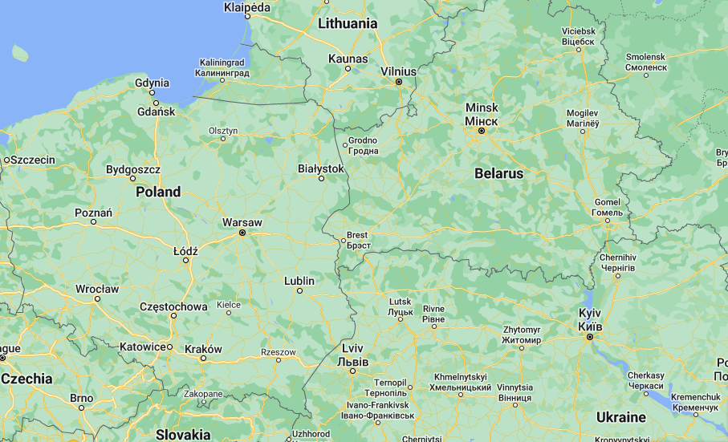

### AYS News Digest 13/04/2022: Unconscious youth at Polish border
#### UN Committee on Enforced Disappearances “gravely concerned” about Greece // Italian detention centres are abusing detainees // Confiscated papers evidence of racism in Germany // Melilla Morocco Border to reopen
### FEATURE
#### **Unconscious youth at Polish border**

Photo Credit: Google Maps

A 16\-year\-old boy from Yemen [remains unconscious at the border](https://www.facebook.com/watch/?v=1032738290956381) between Poland and Belarus\.

For more than two days, the boy has been in critical condition\. With medical professionals being barred from the area, doctors have attempted to provide help via video link\. Yet, the assessment is immediate hospitalisation or the boy will face death\.

The group of eight people from Yemen report that they can see Polish border guards from their position, and have asked for water\. Their requests have been ignored\. The group was very reluctant to release this video, as they didn’t want the footage to worry the boy’s mother, but they are left with no choice as the boy’s condition continues to deteriorate\.

Grupa Granica — an activist group from Poland which has been reporting on and supporting the situation at the border since the escalation in November 2021 — are in contact with the group\. They state:

> “Today, one of the victims of this conflict lies just under a fence stretching along the Polish border\. The boy was beaten by the Belarusian authorities, his condition is getting worse day by day\.” [Grupa Granica](https://www.facebook.com/grupagranica/) 

#### GREECE
#### UN Committee on Enforced Disappearances “gravely concerned”

[The Committee published its reports](https://www.ohchr.org/en/press-releases/2022/04/un-committee-enforced-disappearances-publishes-findings-greece-and-niger?fbclid=IwAR3Lcf22nmrNu_9CuPUo__7A_V-SefgGOmVcIROIEnVOYyEipGnK0uC8dxs) about Greece and Niger, which included being “gravely concerned” about the criminalisation of rescue NGOs and human rights defenders\. The report also raised concerns about the disappearances at sea and on the Evros River\. It suggests that Greek authorities should make greater efforts to search for those who disappear, including in the case of pushbacks\.

Meanwhile, pushbacks continue\. [31 people were reported as landing on Lesvos](https://aegeanboatreport.com/2022/04/12/our-precious-european-values/?fbclid=IwAR2hh2Se337FP-bR28hHyokHPtftvFl9NyMIba8rTQfTsyBuqgbJVWJGf9g) on Wednesday, but they never made it to the camp there\.

[This interview with Lesvos Legal Centre](https://www.meltingpot.org/2022/04/isola-di-lesbo-lassistenza-legale-ai-migranti-tra-commando-armati-e-respingimenti-illegali/?fbclid=IwAR3INBWlriNY_55H6SUDOIbBMuLANV9gCMyKlVtHZGtZ4MpiE-mbE4l9IzM) sheds further light on the current issues on the island\.
#### ITALY
#### Italian detention centres are abusing detainees

The Repatriation Detention Centers \(CPR\), which are intended to be where people wait whilst documents are sorted prior to deportation, are failing to fulfill their function\. [People are held at the CPR](https://www.meltingpot.org/2022/04/la-violenza-della-detenzione-nei-cpr-due-testimonianze/?fbclid=IwAR3wq76RjE8hHv3KApQdYKumaoj709OJM93cks3OH-_54AHMTvkJAKLgG0c) either because they were working illegally or because their asylum claim was rejected\. In reality, people being held there are not accessing their legal rights, because of language barriers, mental or physical illness, lack of explanations and other failures\.

The full article includes the testimony of an individual who experienced the CPR and suffered at the hands of the system\.

> “I could not ask for international protection, because no one spoke to me about this right\. I don’t understand why I am here, I have heard that I have a lawyer, but I have not seen him and I have not seen the results of his interventions to guarantee my rights as a human being, I have not committed any crime, except that I did not have pieces of paper that proved my right to remain on Italian soil “\. [Kamal](https://www.meltingpot.org/2022/04/la-violenza-della-detenzione-nei-cpr-due-testimonianze/?fbclid=IwAR3wq76RjE8hHv3KApQdYKumaoj709OJM93cks3OH-_54AHMTvkJAKLgG0c) via MeltingPot 

In a different and positive story, The Justice of the Peace in Milan has ruled in favour of an individual facing expulsion\. [Read the full statement here\.](https://www.meltingpot.org/2022/04/annullamento-espulsione-per-successiva-domanda-di-regolarizzazione-ex-art-103-d-l-34-2020/?fbclid=IwAR2Ovdp0pbKQleo30CJUo6BtpGh7Y2HYYmWsvPWdJz_8Pbx0ZfbxhpgzhiM)
#### UKRAINE

](assets/43bb843947e3/0*tQ6gcm8Szi_zp9nm)

Photo Credit: [Blindspots](https://www.facebook.com/blindspots.support/posts/479098520666250)

[Sinti and Roma people are being discriminated against](https://www.facebook.com/blindspots.support/posts/479098520666250) inside and outside of Ukraine\. These minority groups have always faced issues but are now being classed as ‘second class refugees’\. In a statement by NGO Blindspots, the segregation and discrimination are highlighted in detail\.
#### POLAND

The plight of refugees from the Middle East in Poland is [highlighted in this article by the British broadcaster, ITV](https://www.itv.com/news/2022-04-09/the-refugees-freezing-to-death-a-few-miles-from-where-others-get-a-warm-welcome?fbclid=IwAR32MLPO10nuyjoa9xg7D3-ml_hUwjSUGB3rzlwvWfaROcu-17aV0Yom51w) \. Ukrainian refugees are welcomed by the same border guards who illegally deport people arriving from Belarus\.
#### GERMANY
#### Confiscated papers evidence of racism in Germany

German authorities have been accused of confiscating papers of third\-country nationals who have fled Ukraine\. [This report describes how an Egyptian national and Ukraine resident](https://taz.de/Deutsche-Behoerden-entziehen-Paesse/!5845005/) was treated as he fled the war to the safety of Germany\. The fact that papers were taken from different groups once they arrived in Germany is illegal and highlights the racist response to this tragedy\.

The International Organisation for Migration \(IOM\) has criticised the unequal treatment of those fleeing the war, citing this confiscation of papers as evidence\. IOM Deputy Director General Ugochi Daniels, speaking in Berlin, said:

> [“We applaud the warm welcome Ukrainians and people from other countries have received in the neighboring countries\. At the same time, we continue to emphasize that this support must be provided without discrimination based on sex, race, gender, ethnicity or religious basis\.”](https://www.infomigrants.net/en/post/39741/iom-takes-stance-against-discrimination-of-nonukrainian-refugees?fbclid=IwAR2S4nCv_IUV_PMfR0QS8NViYmSu1B9T3sR1vv8FEQpEp2JjRtDif2i0kyU) 

An estimated 213,000 third\-country nationals have left Ukraine since the war began\.
#### LIBYA

](assets/43bb843947e3/0*Y_9r9mclPbG-TsHp)

Photo Credit: [Refugees in Libya](https://twitter.com/MigControl/status/1513851420306550785?fbclid=IwAR0l4HM8VrEOSRQGGR0D4RyONmqnHY8B4Uv9r_lxdMPoT-RCVSrKBGb93cs)

The actions of Refugees in Libya continue as Wednesday, 13 April, saw the [189th day of protest](https://twitter.com/MigControl/status/1513851420306550785?fbclid=IwAR0l4HM8VrEOSRQGGR0D4RyONmqnHY8B4Uv9r_lxdMPoT-RCVSrKBGb93cs) \. Watch the latest video via [their YouTube channel here\.](http://youtube.com/watch?v=nKFmTBsjFsw)
#### SPAIN

Melilla Morocco Border to reopen

The border between [Melilla and Morocco is to open](https://euroweeklynews.com/2022/04/12/melilla-border-with-morocco-to-open-this-thursday-april-14/?fbclid=IwAR0_-SLk4QBtrcgyumEJOqR4WsH1C9UOS5TkNABJGmhpBMXZyxkQ-W9D4gM) after more than two years\. Following talks between the two heads of state, it was agreed that the border would be prepared for opening but only to residence card holders in Melilla, Schengen visa holders, Moroccans residing abroad, and European tourists\. The border was closed in March 2020 as part of the COVID response to stop travel\.

Information following a recent rescue off the coast of Gran Canaria has been released\. [After a week adrift on the open ocean](https://www.efe.com/efe/canarias/sociedad/dos-de-los-ocupantes-la-patera-rescatada-el-domingo-se-suicidaron-tras-una-semana-a-deriva/50001312-4782620) , two passengers on the boat were reported to have ended their own lives by jumping overboard\. The boat was finally rescued 83 km from shore\.
#### UNITED KINGDOM
#### Asylum seekers to be held in Rwanda

Prime Minister Boris Johnson [is expected to announce](https://www.theguardian.com/uk-news/2022/apr/13/priti-patel-finalises-plan-to-send-asylum-seekers-to-rwanda?fbclid=IwAR0PlEYAs6zi7itj7qA1lQT8D46fXZRO128Ch0TkU47pnq-PxD_l6KbD5Dc) further harsh measures in an attempt to reduce the number of people arriving in the UK\. As well as flying people 4,500 to the African country, the Royal Navy will be charged with monitoring the Channel\. Opposition party Labour has described off\-shore processing as “unworkable and unethical”\.

The ‘Homes for Ukraine’ scheme has [come under fire from the UNHCR](https://www.theguardian.com/world/2022/apr/13/stop-matching-lone-female-ukraine-refugees-with-single-men-uk-told?fbclid=IwAR07Yxbxe8wguxdLcgqbqSa2JQO6aGkypiHc3Z0ckFUR6b1zv8jrzVW-cKk) \. Lone female refugees should not be matched with single men as hosts, over fears of sexual exploitation\. The scheme relies on hosts and refugees matching in advance of making an application, leaving unmonitored social media groups as a place for people to find matches\.
#### SEA/SAR

[201 people remain aboard Sea Watch 3](https://twitter.com/seawatch_intl/status/1514219127782707200) which is waiting for the offer of a safe port\. This follows a busy few days for the rescue ship on the Mediterranean as reported in the [previous digest\.](ays-news-digest-11-4-22-the-council-of-europe-to-member-states-governments-stop-pushbacks-at-eu-b4dd01037cf9)

The number of people who have lost their lives on the Mediterranean continues to rise, with a reported [four ship wrecks in four days\.](https://twitter.com/alarm_phone/status/1513772211383021569?fbclid=IwAR2yHuc4CSOVDEXR091CxjhLv-pgr6ISkcaDkp7Yb9LqWTd0isj5qccpTfk) 41 people are known to have died this week\. [This long read](https://palermo.repubblica.it/cronaca/2022/04/13/news/gia_476_migranti_morti_la_strage_senza_rumore_nel_mediterraneo_delloblio-345256389/?ref=RHTP-BG-I345047677-P10-S1-T1&fbclid=IwAR2Ovdp0pbKQleo30CJUo6BtpGh7Y2HYYmWsvPWdJz_8Pbx0ZfbxhpgzhiM) examines the situation in more detail\.
#### EUROPE

A court has ruled against a pushback group who were removed from North Macedonia to Greece\. The case involved the deportation of 1,500 people in March 2016 and was brought by eight members of the group with [Pro Asyl](https://www.proasyl.de/en/) and [ECCHR](https://www.ecchr.eu/) \. The ECHR ruled that the rights of the individuals had not been violated\. [Read more about this disappointing result here\.](https://mixedmigration.substack.com/p/april-4-11-2022-mixed-migrationhebdo?fbclid=IwAR07Yxbxe8wguxdLcgqbqSa2JQO6aGkypiHc3Z0ckFUR6b1zv8jrzVW-cKk&s=r)
#### WORTH READING, WATCHING AND LISTENING

[Six Years since the EU Deal with Turkey written by Levos\-based NGO Fenix](https://www.law.ox.ac.uk/research-subject-groups/centre-criminology/centreborder-criminologies/blog/2022/04/six-years-europes?fbclid=IwAR2ig56JZE1e_0UWZljTNejwGjBQUPfridJ7fY6mLXA0Tl2MgehC3xUAb0Y)

[New Animated Film — Released this week by No Name Kitchen](https://www.youtube.com/watch?v=AFz3PVVckC0)

[Pushbacks in Greece — detailed piece from the Oxford Law Faculty](https://www.law.ox.ac.uk/research-subject-groups/centre-criminology/centreborder-criminologies/blog/2022/04/pushbacks-greece?fbclid=IwAR07ptxxaXm81TKx7nm3pQs2AXKgd-YFp9Sr4OIUN-KVF4uFhnf_5Y9l5Bg)

[Background and current news about the crisis in Yemen](https://salamlab.pl/pl/jemen-tysiace-dzieci-zolnierzy-sa-wysylane-prosto-na-smierc/?fbclid=IwAR3klu9nbGmDEJUskYGbl7aOmipTVE9kEqXFs66msr5XNoS2Dk76H-5tkcs)

[Europe’s Big Secret — podcast about Libyan detention centres](https://www.spreaker.com/user/foreignpolicyresearchinstitute/ianurbina-fullep-mixdown-1?fbclid=IwAR2lKaCZhLUg-uJb9_xpuLzg_7DFV4M4JJ35YjKwmAnxlFAS03YHOOQRxc0)

**Find daily updates and special reports on our [Medium page](https://medium.com/are-you-syrious) \.**

**If you wish to contribute, either by writing a report or a story, or by joining the info gathering team, please let us know\.**

**We strive to echo correct news from the ground through collaboration and fairness\. Every effort has been made to credit organisations and individuals with regard to the supply of information, video, and photo material \(in cases where the source wanted to be accredited\) \. Please notify us regarding corrections\.**

**If there’s anything you want to share or comment, contact us through Facebook, Twitter or write to: areyousyrious@gmail\.com**

_Converted [Medium Post](https://medium.com/are-you-syrious/ays-news-digest-13-04-2022-unconscious-youth-at-polish-border-43bb843947e3) by [ZMediumToMarkdown](https://github.com/ZhgChgLi/ZMediumToMarkdown)._
