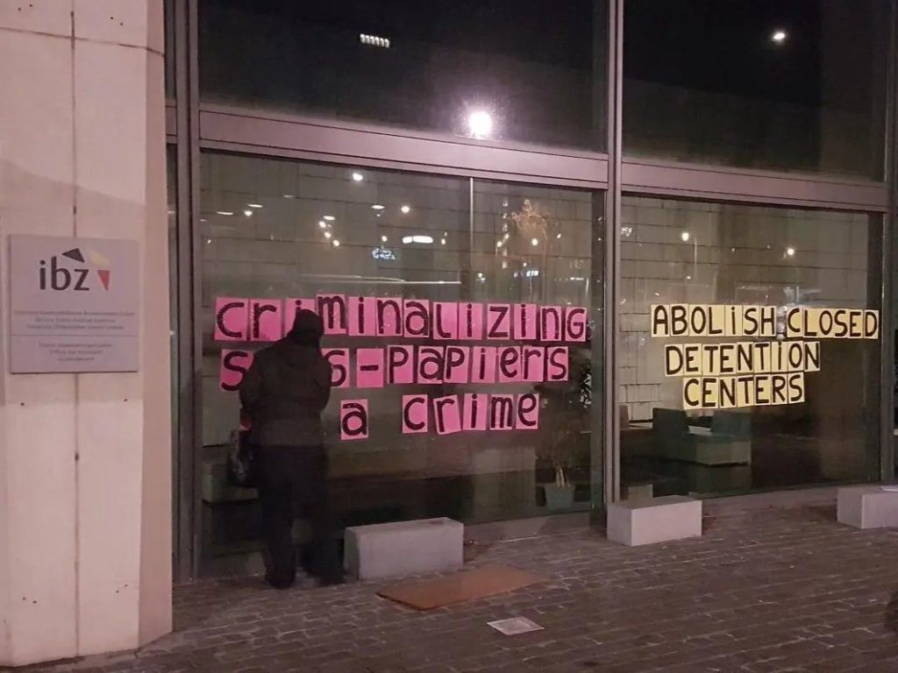
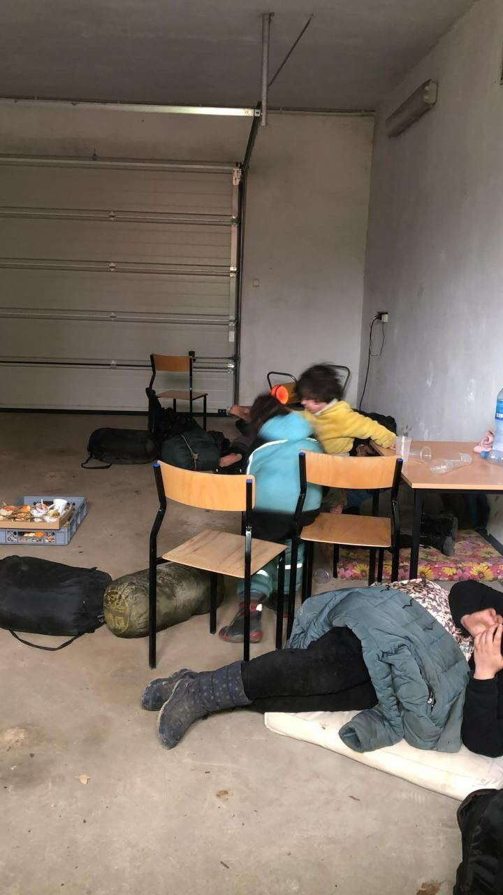

### AYS News Digest 18/4/22: Detained children in the ‘heart of Europe’
#### Pushbacks and double standards along the Polish border / thought\-provoking text of someone who just came back from the Polish\-Ukranian border / **inadequate health care in Spanish centres for youth — reports from Ceuta / many good reads and reports from the ground**

#### FEATURE

In Belgium, it seems it is not uncommon for the Foreigners’ Office to lock up young minors in a detention centre, disputing their age, even though it is written on their birth certificate, claiming that it is false\.

> It is thanks to our contacts with detainees that we are sometimes made aware of these unacceptable situations\. It is totally unacceptable that very young people are mistreated by our authorities, Getting The Voice Out team reports\. 

The most recent report documents a case of three children who had to spend a night in a police cell, after which they were transferred to a detention centre\.

Two 12\-year\-old girls were sent to the detention centre of Holsbeek and a 10\-year\-old boy was sent to the one of Merksplas\. Reportedly, when the officials arrived at the closed centres, noticing the young age of the children, they were entrusted to the guardianship service, as they should have been since the start\.

This is, of course, not something taking place only in Belgium, but across the EU and also in the UK\. Hundreds of unaccompanied children who have arrived in the UK on small boats in the last few months are [reportedly](https://www.theguardian.com/uk-news/2022/apr/18/lone-child-refugees-suffering-neglect-in-uk-hotels-charities-say?CMP=Share_iOSApp_Other&fbclid=IwAR2NKmgDuPjRzQKU4BMhVh7WHI9CDa-4yX1rWT-kM3TF_WnLVaOaXBUldlE) suffering from hunger and neglect in hotels\.

The local Belgian group fighting against expulsion and reporting on the situation on people who have been detained, proposes a way for you to take part in supporting these people as well:

> We receive a lot of requests for phone top\-ups from people detained in closed centres\. Their telephone is very often their only contact with the outside world, whether it be with family, friends, their lawyer, or to make their situation known publicly\. 

> Whether their arrest takes place on their migration route or in their place of residence, whether their family and friends are here or in the country, being able to warn and communicate with their loved ones is crucial\. Many of them would not be able to do so without your help\. 

> You can support the detainees by buying a 10 euro top\-up from Lycamobile at your local grocery store, nightshop or bookshop\. Then send us the pin code from this top\-up to our email address gettingthevoiceout@riseup\.net \. We will send this code to the prisoners who request it\. You can also, if it is easier for you, pay or even better make a standing order of 5, 10, 20 euros or more on the dedicated account : 

**Collectif Contre Les Expulsions** 
**Triodos Bank BE58 5230 8016 1279 BIC: TRIOBEBB** 
**Communication: Lyca**
#### KURDISTAN — IRAQ
### Turkey launched a new military offensive against the PKK positions in the Kurdistan Region

At least six alleged Turkish warplanes bombarded suspected Kurdistan Workers’ Party \(PKK\) positions in Kurazhar Mountain near the town of Shiladze in Duhok province

> For hours, the areas of Zap, Metîna and Avaşîn, controlled by PKK guerrilla forces, have been subjected to massive aerial and ground missile bombardment\. 

Clashes between the Iraqi army and PKK\-affiliated forces in Shingal have taken place several times\. The Iraqi government and the KRG signed an agreement in 2020 to “normalise” the situation which includes the withdrawal of all PKK\-affiliated forces in the city\. The agreement has been rejected by the PKK and its proxies\.

The Iraqi army has yet to comment on the fresh clashes, the media [report](https://l.facebook.com/l.php?u=https%3A%2F%2Fwww.rudaw.net%2Fenglish%2Fmiddleeast%2Firaq%2F180420222%3Ffbclid%3DIwAR3M3aDLl2k7TRyVPzQPyg1t-k1oYDh3aKX9Mi87GqBVmjm2Vd7EI0GgoPs&h=AT1EMlcXEPMhLDfbwi7-3c4k5m9XYnoaBlygLVfGKmiCx3EFw9sPy6VCCT2mQfXc_mLZW7uYaXGb7QmrFQIfdHSNLnIkTVsuDYflK9fePJr6XG6LRmR7qUFYn6f7GZWRaU1Au9ypqaJC9QBN7VP_HNt857a25A&__tn__=R]-R&c[0]=AT1dPeNqv7_dZx1aKw109YINSeLKQMNtdb8nfbXif9keCbjzEVjnRq9vqtfgQXDgpCjcEJW-dMoF_qLC1fcEQIH8T58VWepTIo3AJOLySdKe1l4v_HTB34m613ZtsP1cz7pCh95w8NnADeOg9bytM9LFYfM-H_rojofjmse7EJGsK_mpxX3gwQAuTVvWmss1-2HPdhAqUCxPMl7uuzQ) \.
#### TURKEY

[](https://l.facebook.com/l.php?u=https%3A%2F%2Fanfenglishmobile.com%2Fhuman-rights%2F101-refugees-of-afghan-nationality-detained-in-van-59378%3Ffbclid%3DIwAR1oUTLC9IwMKcBZ6myVaijybepRVfsTlwGyJq3yoIC0d-PWEYPC28Hk7sg&h=AT2EhP0K2vZ0dozxD_kUBRWNA_9fEumswT4ffn-dEkTs-A0uXg4tBRCff-DYYfrLbzYI1dZDUK3dds4HU4IaZfLX9dER83kQ4qrvKBDZBg0Y6GuFly80yj645uscMdPN4SzZGj1DpiOe5icOJ1sFcOI9KY-yuQ&__tn__=R]-R&c[0]=AT2rWKV3OX7kgQO2HjXynIQh83z4YRSJVVoHgapkcsrpB-h8uPi5F3xcWtmM9lbMjYS7wFR2MTGqxpUyl5TudbVKTQmtfKli-Trti1sctjZC74az-0G8sYQXQdqGY9BUpdc4BP9uQSKKIAhlveLDvo8Fgi4md7CHPE2FWd3kDf1cAr-aVogsHeVyJosdKh4YJINVXHHf5NUX)

#### LIBYA

Even after all the evidence of crimes against humanity committed in Libya against people [detained in government\-run detention centres](https://www.theguardian.com/world/2019/nov/03/libya-migrants-tripoli-refugees-detention-camps) , situation seems to remain the same, and reports of abuse just multiply…

■■■■■■■■■■■■■■ 
> **[Refugees In Libya](https://twitter.com/RefugeesinLibya) @ Twitter Says:** 

> > Yesterday the so-called security forces made a violent nightly raids on the homes of immigrants in #Zuwara &amp; rounded up 300.All are said to have been transferred to #AinZara where atrocities awaits them.Libya continues to violate its legal obligations to protect women &amp; children https://t.co/tiHH0VtyvY 

> **Tweeted at [2022-04-15 23:34:21](https://twitter.com/refugeesinlibya/status/1515111314607251456).** 

■■■■■■■■■■■■■■ 

#### SEA

At the same time as people continue suffering in Libya, those who decide and manage to leave the country in any way, often end up being part of the news about distress at sea\. A small wooden boat carrying around 35 people capsized off Sabratha\.

At least 476 people died along the central Mediterranean route between 1 January and 11 April, [according](https://www.theguardian.com/world/2022/apr/16/migrant-boat-capsizes-off-libya-with-35-people-dead-or-presumed-dead?fbclid=IwAR2GGbwf2yyYHlYY0hyQFk10epuLFIryeo94nbALSx02kpVZnL04kkOPvxI) to the IOM\.
### 27 people rescued from 2 boats in front of Andalusia

News From the Med report that Salvamento Marítimo rescued 27 men of North African descent in the early morning hours of this Monday, who were trying to reach the coasts of Almería and G Ranada on two small boats\. They were all in good health and were landed in the ports of the capital of Almería and Motril \(Granada\) \.
#### FRANCE

**Facing another round of elections in France, this text is another reminder of how foreigners are viewed by Le Pen**

This is the 142nd proposal of Marine Le Pen’s program, and it can be summed up in one line: “Reserve the allocation of social housing as a priority for the French, without retroactive effect, and mobilize it towards the public who need it most\.”

[](https://l.facebook.com/l.php?u=https%3A%2F%2Fwww.liberation.fr%2Fsociete%2Flogement%2Fsi-elle-est-elue-marine-le-pen-expulsera-plus-de-1-million-de-locataires-etrangers-20220415_GOZZVQGHGJABDCJPLVSUMX7YXE%2F%3Ffbclid%3DIwAR3Sd6qprlBnBD08g0wvR5kJVFbKstwoUd5MJ6twlyRzZXkSbNFzuakfStw&h=AT3klRzTSWEtzjYVaX136JNDDTjRdB5DniMumMabq5VgkBMRQ7jNOrM-d-fuPJTcw8_lkDU79C_jAZY8rbCBmvTBMmUIGP93dw3NmtmLqrb-w5lFMkKquw1Ln0b9-97HM8MK-o6vQ0Mrn7S0UKJr82KzfedxcQ&__tn__=R]-R&c[0]=AT25BOpmpcNMhfWdztXFoPHYxn-YsFlBVfykv6kwZ-c6Knik_eW7HO25Z4yj38Xg5vSm_s39J8bM9HlkB6ze8U4Ydzu2jhKXqK8cbie_VlbP-rGV3_YkceEdDr8myIkQPJBZaEppTJ3O3nS7UJ3wYstG4luRvyPjVd_yRE9PqMAwF2VUgFIuMsfgt76P7cmOBgrwnwSK5hpf)

#### SPAIN
### Three volunteers on NNK Spain reported from Ceuta:

**“This week we collected testimonies of five minors who live in “La Esperanza”, one of the two juvenile centers in Ceuta, who are suffering from inadequate health care conditions\.”**

> According to the testimony, there are around 80 minors living in La Esperanza right now, 50 of which are estimated to be suffering from scabies\. We were told that for months the minor center “La Esperanza” has not been providing a new doctor or nurse after the previous doctor left the center\. Since then, there has not been a person with medical knowledge looking after the minors in the center\. Educators from the center have been made to take upon themselves going to the hospital with any minors that need it\. 

> As reported by the boys, the only medical care they occasionally receive is from one of the educators, who, now and then hands out medicine in bigger quantities, if he detects, for example, an outbreak of scabies\. Nevertheless, there have not been further treatments made regarding the scabies infestation, like the treatment of bigger wounds or a follow\-up care to see if the treatment had an effect\. 

> According to the testimonies made, educators hand out very little medicine, even though they have open wounds\. 

> One boy is called Mohamed, we met him for the first time a few weeks ago\. He told us that he escaped from the minor center because they didn’t let him take showers and that he wasn’t given any scabies treatment\. One day, he told us, an educator gave him the necessary material for curing his wounds and told him that he should put on a patch himself\. 

He showed us his wounds of scabies all over his arms, some with a radius of 3 cm\.

His wounds were in an advanced state, which usually only occurs with people who have no access to health care at all\. From that day on, he asked us to treat his wounds and came to see us almost every day\.

Another boy told us that over the last ten months he was not given any treatment for his skin disease, psoriasis, even though he told the center that he was suffering from that disease and he wanted to get medical treatment\.
#### POLAND
### Impressive notes from a trip to the Polish border

> Some of the Polish volunteers in Medika I had the opportunity to speak with, during the first huge wave of refugees, had come from various parts of Poland with the express purpose of checking that other non\-Ukrainian migrants “take advantage” of the situation and penetrate the border\. — “ Before we were only rivals among us fans, what Putin did instead united us”\. So one of the organizers of the patrols told me, also adding: « There were too few police, so groups of fans wanted to keep order to keep the city calm as before\. We decided to walk around the city, when we meet people without documents, we escort them to the place where all the refugees are, so that they too can feel safe”\. 

> Yet the availability, kindness and courtesy of the Polish border police towards Ukrainian refugees is commendable, disarming: children carried in their arms, elderly women accompanied step by step to the nearest means of transport as soon as they cross the border\. \(…\) It is at least disorienting to see the same uniforms, located on the Belarusian border, rage against the few hundred Yemenites, Syrians, Afghans and Pakistanis stuck in a nobody’s red zone, with absolute ferocity and ruthlessness\. \(…\) 

> And at the same time that empty space is dangerously filled with ambiguous presences and weapons\. \(…\) 

> And with the post\-historical eyes of an Italian accustomed to peace built on the backs of distant wars, geographically and culturally, I cannot decipher the ideological panorama that opens up in front of me… \(…\) 

Make sure to read the entire story [here](https://www.meltingpot.org/2022/04/calma-apparente-a-leopoli/?fbclid=IwAR1DYMNnOtJgb4zEdgAFBaxEsOcXv_EWcWAahWraNqm86guNs-iMSHom9z0) \.

In the meantime, given the percentage of Catholics in Poland and their alleged devotion to the fundaments of Catholic faith, on the occasion of the biggest Christian feast, the activists from the border areas wanted to raise some of that Christian conscience and solidarity, so they left some quotes lying around the border towns:

■■■■■■■■■■■■■■ 
> **[Grupa Granica](https://twitter.com/GrupaGranica) @ Twitter Says:** 

> > Z okazji #Świąt Wielkanocnych miejscowości #Podlasie obrały nowe motta. „Co uczyniliście jednemu z braci moich - mnieście uczynili.” Nomiki ; „Nie ma takiej ilości jedzenia, którą nie można się podzielić” Może #Polska w głębi duszy jest miłosierna i gościnna ? https://t.co/G6aKVFum41 

> **Tweeted at [2022-04-16 07:26:58](https://twitter.com/grupagranica/status/1515230250581512192).** 

■■■■■■■■■■■■■■ 

Reports of pushbacks didn’t stop even during Easter days:

■■■■■■■■■■■■■■ 
> **[Grupa Granica](https://twitter.com/GrupaGranica) @ Twitter Says:** 

> > Wielkanocny #pushback. O 4 nad ranem, w Wielką Niedzielę @[Straz_Graniczna](https://twitter.com/Straz_Graniczna) wyrzuciła 4 dzieci i 8 osób dorosłych do #Białoruś, gdzie byli bici. Komendant Straży Granicznej podobno sprzeciwia się wywózkom? [bialystok.wyborcza.pl/bialystok/7,35…](https://bialystok.wyborcza.pl/bialystok/7,35241,28347615.html) 

> **Tweeted at [2022-04-17 13:00:55](https://twitter.com/grupagranica/status/1515676683382267906).** 

■■■■■■■■■■■■■■ 

This group has been pushed back 10 times before and previously were at the border facility where they requested asylum\. Grupa Granica attempted to stay in contact througout this period, but it appears this did nothing to prevent the illegal deportation:

#### UK
### The State Church criticising the State

The Archbishop of Canterbury has criticized the British government’s plans to fly out some asylum seekers to Rwanda\. The responsibility of exterminating refugees did not stand a divine test, the spiritual head of the Anglican church, Justin Welby, said in his Easter Sunday sermon\. He said in an unusual direct political statement, in order to send asylum seekers abroad, there were “serious ethical questions”, he said\. “ Read [more](https://l.facebook.com/l.php?u=http%3A%2F%2Fwww.handelsblatt.com%2Fpolitik%2Finternational%2Fmigration-erzbischof-kritisiert-londons-ruanda-plaene-fuer-asylsuchende%2F28258870.html%3Ffbclid%3DIwAR2NKmgDuPjRzQKU4BMhVh7WHI9CDa-4yX1rWT-kM3TF_WnLVaOaXBUldlE&h=AT1LiyEXnkNM_SPc7iRL6Yi6eW_x5bAF4xAKYQVZIfLQela-lmqgC_RxAgfFxvj7dg2UbirdfW78PiUqxjJbbBS81U3pK07WE0umXfYEzKBOQDUu_EMETmYVQffWebF5qenbk229A52-z4xxZg&__tn__=-UK-R&c[0]=AT2R6Z-HyrcNfTqvfIVvB1egNSWjBEfVzmJrEtEjlq6tFNJFyjBupUOOWgKlXc-1whPD1-OyA1xGjCXNC8tIZ0aXJ_U4BsjJk8acjqrHxec6mAR4jx5MbvrMhvvOxS8FI9PXMwJLjpcBEZ_GJkDfZ_m4H8DitziQG_cJABt90yA--I0) \.
#### WORTH READING

[](https://l.facebook.com/l.php?u=https%3A%2F%2Fothersideofhope.com%2Findex.html%3Ffbclid%3DIwAR17IBIFiAnglnMYCXZj19LY1kpvNaB4m1lJN8kwCpM3her613mB4aOcNG8&h=AT11Exv1BHCGec889jUHhfROW8ctOvHJ5oVkECVjb9-l84XwrSQdgAgiSsd0TitMIea146H_XW0b5hnel7qE_w5AqyPeXXwjfHguTyLyoIEAyZNA__RXb1LL21GQ2FDcx7nxgFbjEVuVEdhJmYRZYpKvl6NOOg&__tn__=R]-R&c[0]=AT3A2bOdCA6UsDltQXrxrWyhWv5uM6c5jmHJPMsg0V-kYa14DmAL9PPPpbdQbaQwGJK2dPV604sigvcq3K9i6UdofY4_uXL5H3f42Y4MlS6YqLUDYTSwDvm5LgyQ29BLRAi3y8tCOJOg22bOwN9Ztfzatk6PK3Sg1dsiAmW-wdsRcwqGl46xiFruOO_hb6iyxlSzu2eVF_v4)

- A great editorial of a timely special issue, as our team member puts it:

[](https://l.facebook.com/l.php?u=https%3A%2F%2Fwww.tandfonline.com%2Fdoi%2Ffull%2F10.1080%2F21622671.2022.2046633%3Ffbclid%3DIwAR0PRC8oQkU1dzo5e-TCjw-K3WE2Ek9hRcgYCqt24rtGqlfGbofmcVvwIKY%23.Yl0WOF9vqIM.twitter&h=AT3dPn2VsH-qIx7IBYi-yn84X5ERVTeEwpXTcx08ZG54f5kwKkXV4AWoAJb5spNm051OgRB_1piQxqH-0PXmo-BgZqppEBZD9F1Lfvu81IDR0k7J2dz5uvTsQGzp87Ck7dtkhMIZkVe3E2IwIS_FiWFpu-9DSA&__tn__=R]-R&c[0]=AT3A2bOdCA6UsDltQXrxrWyhWv5uM6c5jmHJPMsg0V-kYa14DmAL9PPPpbdQbaQwGJK2dPV604sigvcq3K9i6UdofY4_uXL5H3f42Y4MlS6YqLUDYTSwDvm5LgyQ29BLRAi3y8tCOJOg22bOwN9Ztfzatk6PK3Sg1dsiAmW-wdsRcwqGl46xiFruOO_hb6iyxlSzu2eVF_v4)

- Mixed Migration hebdo:

[](https://l.facebook.com/l.php?u=https%3A%2F%2Fmixedmigration.substack.com%2Fp%2Fapril-11-18-2022-mixed-migrationhebdo%3Fs%3Dr%26fbclid%3DIwAR0Cn0CHiTfK7USpxd8hG5wLdPElvPUrt2fzLEYWIsuoibP7N7mUTwo00ms&h=AT3mMiGG0IDmvggpciSxN6EOWicadg6H7YZNO0RhwIHdwvataD4f4bJO56iuaCwrIYdP35OHNq9_sv87XLCKUShz75sTDTTPqie-C-vbnIm3hvm3ao9BftOA64GMfsRoKE1efHgpYhblwmE6UA4_oVJjssihXg&__tn__=R]-R&c[0]=AT3A2bOdCA6UsDltQXrxrWyhWv5uM6c5jmHJPMsg0V-kYa14DmAL9PPPpbdQbaQwGJK2dPV604sigvcq3K9i6UdofY4_uXL5H3f42Y4MlS6YqLUDYTSwDvm5LgyQ29BLRAi3y8tCOJOg22bOwN9Ztfzatk6PK3Sg1dsiAmW-wdsRcwqGl46xiFruOO_hb6iyxlSzu2eVF_v4)

- How does Germany do it?

[](https://l.facebook.com/l.php?u=https%3A%2F%2Fwww.infomigrants.net%2Fen%2Fpost%2F39883%2Fhow-germany-manages-eu-funds-in-africa%3Ffbclid%3DIwAR0pazgtR-1Uup6sZ9eWc0SdClHpztruXjIHRCjhW5B_L7qTSSkSLBMeKlA&h=AT38IDjteM8Iog6o9OjrdGl_a9n-0Gs5Wqh8NqS6ODHwqBkBZC-wXwOP0pSeRZymHqQm2CFUdAvSd2dwlawb-Avj0WOp1dXXpDieUdGxSdPHeBJEE79LgNP1zu8zJG9MlkmdvEhOWeay9XHm6MDlUaHbo-55zA&__tn__=R]-R&c[0]=AT04s2S_8uCDzi3KlgUve8DgmHyH2rOqzSf1a020KNCNL9vWwLG9jaKqWJ1-J_CayLXqvCej1yH8yQG8NGG8MUCMa5eymAlTwLhJOPWPKboXFXnvrA6zS87lYESHb1UgpuzuMsP12YFztsUwa5AAVjykVQEliV9p3GM4m_c_t5neIwSxlBDWQEbtJNhNPdR_LnGAhOpTaqAqDCqsW7g)

**Find daily updates and special reports on our [Medium page](https://medium.com/are-you-syrious) \.**

**If you wish to contribute, either by writing a report or a story, or by joining the info gathering team, please let us know\.**

**We strive to echo correct news from the ground through collaboration and fairness\. Every effort has been made to credit organisations and individuals with regard to the supply of information, video, and photo material \(in cases where the source wanted to be accredited\) \. Please notify us regarding corrections\.**

**If there’s anything you want to share or comment, contact us through Facebook, Twitter or write to: areyousyrious@gmail\.com**

_Converted [Medium Post](https://medium.com/are-you-syrious/ays-news-digest-18-4-22-detained-children-in-the-heart-of-europe-1771fe18d637) by [ZMediumToMarkdown](https://github.com/ZhgChgLi/ZMediumToMarkdown)._
