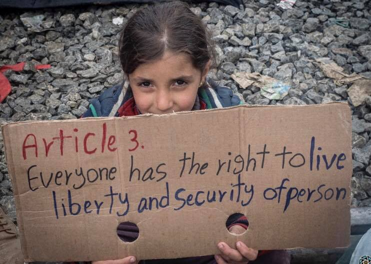

### AYS News Digest 25/5/22: Demanding **equal treatment for all refugees from Ukraine**
#### More emergency cases reported in the Evros region as Greece repeats they will close the door / Turkey scares people who might be forced back to Syria / News on search and rescue operations in the Mediterranean / Shocking footage from the Polish\-Belarusian border / and other important news

#### FEATURE

**State refugee councils and PRO ASYL demand equal treatment for all refugees from Ukraine**

On the occasion of the Conference of Ministers of the Interior in Würzburg from 1–3 June 2022, PRO ASYL and the State Refugee Councils as well as many other organisations and initiatives demand a nationwide regulation that guarantees the protection of all refugees from Ukraine and an immediate stop to discrimination against third\-country nationals and stateless persons from Ukraine\.

According to the [Ukraine Residence](https://www.bundesanzeiger.de/pub/publication/jPaah7D7T0xoPuPKr2Z/content/jPaah7D7T0xoPuPKr2Z/BAnz%20AT%2003.05.2022%20V1.pdf) Transitional Ordinance, all people from Ukraine are allowed to stay in Germany until August 31st\. This is intended to give them the opportunity to either apply for temporary protection or to meet the requirements for other residence\-related purposes\. However, the latter is hardly possible for many refugees in the short time available\. In the long term, there is a risk that people will find themselves in precarious living conditions, the press release states\. Read it in full [here](https://www.proasyl.de/pressemitteilung/landesfluechtlingsraete-und-pro-asyl-fordern-die-gleichbehandlung-aller-gefluechteten-aus-der-ukraine/?fbclid=IwAR1y3wf28wfWiHfy66nCS7P5bJU9JAgHRUUcpI6fVvoiS3NUklk5jPXibIQ) \.
#### TURKEY

Syrian refugees in Turkey are worried about Erdogan’s plans to relocate up to one million of them to “safe areas” inside Syria\. Damascus is also unhappy, fearing a Turkish landgrab and the return of dissidents\.

As we [previously reported](ays-digest-11-5-22-2-500-asylum-seekers-and-refugees-being-held-in-prolonged-inhumane-detention-a882087ec876) , the Turkish president said he would not send the Syrians back to their war\-torn country, but now the Turks seem to be bragging about having “cleared out” zones in Syria where it’s “safe for the people to return”\. More reactions in the [media](https://l.facebook.com/l.php?u=https%3A%2F%2Fwww.dw.com%2Fen%2Fsyrian-refugees-in-turkey-turn-into-a-political-pawn%2Fa-61915356%3Ffbclid%3DIwAR0bx2jPX-7VQcpzqWIzSmjbMtqU9bNwXfloZjS8jZ8hyjfKa4HBoIKQUG0&h=AT2A4w-mtSxDuqPhLU4xXYswqK4sWGOWp6tQLkX16bEjN9GVzgFnOv_6kkNy2w6ZpkNCqu5LB3WuYy4A2H5PohxOBI9KO3p7hzMQLhxXpCph_2CfYwv8mVjM1fu3qYz91zv1vsrQbg5RuWmKUaFlJgDSuOcliA&__tn__=R]-R&c[0]=AT1eRg8W9fLxmWWaMSovdeYtcwBKNqLgGJvG3imuR9APsrTA1KnLmpxTL0IFDQgPqZ--4RQG2Me4BGCUV4bmehoiMVWy_5jAYlADJUyDXnF7oeGy6Kw9J57vTYRDvPM7hBgX7dQnM6K3NlVE3rOh4kZ3qoOcGZoiVzhmVkjCbA44vttN0N8eqBKauGdJnVCTaUx6YgWdjaIr) reports\.
#### SEARCH AND RESCUE AT SEA

The court of Trapani excluded Amnesty International, ECCHR Berlin, European Association of Lawyers for Democracy & World Human Rights, and [Giuristi Democratici](https://mobile.twitter.com/giurdem) from observing the preliminary hearing in the case of the four members of the Iuventa crew accused of facilitating irregular migration for saving thousands of people at sea\.

[](https://l.facebook.com/l.php?u=https%3A%2F%2Fwww.theguardian.com%2Fworld%2F2022%2Fmay%2F22%2Fits-a-never-ending-nightmare-crew-of-refugee-rescue-ship-facing-jail%3Ffbclid%3DIwAR1l8wqyW54DduwNIujaszwBPypA0p6E2ggck147B61yYVNlbUFh433eKFY&h=AT21na_a3hpC2ikSrElnQFjk_VNR_-pLmNPw7QYerFVW-CWiYFH7ZF28oIh-rVBpuuWi3O3UtO6iwxZ4hex4VUshqofi2drz4O74N_5sO3bVJ1ZPbzZ6Cuqz3BIEJV-IRAf3Cp8grn3CdeBadBYFe3K0F0FIZQ&__tn__=R]-R&c[0]=AT3Y2x1zttC2cYEA7tlXuAJf2EFkK15yhkYkhQ4bOc9kH88zO7Hw2jE9t9AcaruWmMVUZEkoYTG5idArIdZ7Q0nKNWU7KxHYQb0-kuiG17vIW0ehZFAQnRpqBfwRWIkJnFTW4q98LWUT_5o5DTyfMJmewbnb-uxLCsAfFDthcxpkxXaMkox_0Pl8H8Pvap56_aFqA-OHjLrE)

Amnesty [expressed](https://t.co/enSo92vjjt) concern about this criminal investigation when it became known and wanted to monitor this trial from the start, including the preliminary hearing\.

■■■■■■■■■■■■■■ 
> **[Elisa De Pieri](https://twitter.com/Elisa_De_Pieri) @ Twitter Says:** 

> > There are 21 human rights defenders (HRDs) and two NGOs prosecuted for saving the lives of refugees and migrants at sea, in contravention of the UN Declaration on HRDs 

> **Tweeted at [2022-05-21 10:41:18](https://twitter.com/elisa_de_pieri/status/1527962732133330944).** 

■■■■■■■■■■■■■■ 

“Together with 21 sea rescuers, he was on trial because of baseless accusations a few days ago\. Now, Dariush from Iuventa\-crew is preparing for the next rescue operation of Sea\-Watch 3\. Criminalization will not stop our fight for the right to life\! Sea rescue is not a crime\!”

Watch the [video](https://www.facebook.com/watch/?v=1076123256594027)
### Over 300 people on board Ocean Viking

**Activists saved the lives of another 64 people in the central [Mediterranean](https://thecivilfleet.wordpress.com/tag/Mediterranean/) , just a day after they prevented the [EU\-supported Libyan coast guards](https://thecivilfleet.wordpress.com/2021/03/05/eu-urged-to-continue-support-for-libyan-coastguard-in-leaked-document/) from intercepting over 70 refugees\.**

> The survivors were given first aid and then escorted to the Ocean Viking, which had already rescued 158 people from two overcrowded rubber boats in Libya’s SAR zone last Thursday\. 

> SOS Mediterranean said the survivors from that rescue had been at sea for nine hours, and that some of them were being treated for heat exhaustion and emotional distress by the Red Cross medical team\. 

> The survivors later told the Ocean Viking’s crew that one of their number had gone missing a few hours prior to their rescue\. Five people had fallen off the boat, but only four had managed to swim back to their unseaworthy vessel\. 

Read [more](https://thecivilfleet.wordpress.com/2022/05/23/activists-save-64-refugees-a-day-after-preventing-the-libyan-coastguard-from-intercepting-75-others/?fbclid=IwAR1VDL4y0iahAIKbt3LxO5pNYiY591UOGo_KnliEXUWP52JgzlHI-pxDa2Y)

](assets/1f4a2c44accb/0*P2zM5DCmVC7taMWj)

Photo: [https://thecivilfleet\.wordpress\.com/](https://thecivilfleet.wordpress.com/)

While more pushbacks [continue](https://l.facebook.com/l.php?u=https%3A%2F%2Fwww.keeptalkinggreece.com%2F2022%2F05%2F23%2Fgreece-migrants-turkey-mass-exodus%2F%3Ffbclid%3DIwAR3o-r7YD5gRAJBPG5rOf05gVW3Dq-uaST1Qvbrv5_krq3XEF4QUHyE5XUA&h=AT3UK8b5jHJHaPKYPA8zPXY-ep_xK8w-5Z2bGcExO9cF8Fxu_CP3rM2DWSxwdA3yrI7H3uGbs2GPTsUWMRmDXdjYeVI55N1U2vt_pJxveffQVZlHg5iJ1oj0dDULxpvUwtnT01MjXOnYitrr48eTadQAmuwYBQ&__tn__=R]-R&c[0]=AT3Y2x1zttC2cYEA7tlXuAJf2EFkK15yhkYkhQ4bOc9kH88zO7Hw2jE9t9AcaruWmMVUZEkoYTG5idArIdZ7Q0nKNWU7KxHYQb0-kuiG17vIW0ehZFAQnRpqBfwRWIkJnFTW4q98LWUT_5o5DTyfMJmewbnb-uxLCsAfFDthcxpkxXaMkox_0Pl8H8Pvap56_aFqA-OHjLrE) on the Aegean side \(with Athens [accusing](https://l.facebook.com/l.php?u=https%3A%2F%2Fwww.infomigrants.net%2Fen%2Fpost%2F40725%2Fgreece-turns-hundreds-of-migrants-back-amid-aegean-tensions%3Ffbclid%3DIwAR1XLawTvNAhL4_uu7hARvwgstPJCRqn_H__WRTVHyc6m8J7wUzC7j_eIV4&h=AT1kznSMAto_c9IruMNGiaU0o3rmSGdXusrHnalQXOr7jiUKovwkjqt75AO5mBvIUUeVjwnIKHBbHUaAvmTzYsXRWkPuM_cUjv5UxHAkjctWEWg0FaWGKnKVZvk0X8v9coJreeBEGqhNL_QMe9YUoVBOymUfMg&__tn__=R]-R&c[0]=AT3ZM2UmCVgf5BmGvXtdECeFW_HGUtjYsj0DX5GStO-p_cA4EYo_5xwbpPuQJGOBEnd4hBouYVgxr458oO7GmakNMqTlNqZaBCJQjVG8py0JEczf40SQfVSs-f3tpAniaQCLNbrvj38HzatcwyA8rcjqWrnain4bRIXwu6MT54RjTc1mghyPgxlSj0qMIGGCUq71cC3GliZy) Turkey of sending the boats deliberately towards its neighbor\), in the central Mediterranean the activists on board SAR vessels keep stepping up while EU authorities keep failing to rescue — Open Arms took in the 100 people Alarm Phone previously reported were in distress at sea:

■■■■■■■■■■■■■■ 
> **[Alarm Phone](https://twitter.com/alarm_phone) @ Twitter Says:** 

> > 🆘from the Central Med!
We’re in contact with a boat carrying ~100 people who have been at sea for almost 24 hours. Their engine stopped working &amp; winds are strong. The people are urgently asking for help! We call on authorities to start a search and rescue operation immediately! https://t.co/pS8vQtScXZ 

> **Tweeted at [2022-05-23 20:19:01](https://twitter.com/alarm_phone/status/1528832897234395137).** 

■■■■■■■■■■■■■■ 

> Europe belongs on trial for this one night alone — it’s not chaos, it’s on purpose 

■■■■■■■■■■■■■■ 
> **[Sergio Scandura](https://twitter.com/scandura) @ Twitter Says:** 

> > 📍 Caos Mediterraneo

Naufragio notturno di 110 Persone in fuga dalla Libia, salvate dai velieri ONG #Nadir @[resqship](https://twitter.com/resqship) e #Astral #OpenArms.

OSINT map via Radio Radicale

Thread in progress🔢
🧵 https://t.co/k6JKhPGC1v 

> **Tweeted at [2022-05-25 20:12:55](https://twitter.com/scandura/status/1529556139012153344).** 

■■■■■■■■■■■■■■ 

### GREECE

Another emergency was reported in the Evros region\. Alarm Phone teams were informed about a group stranded in the forest near Soufli\. Reportedly, one person was in critical condition [from a snake bite](https://l.facebook.com/l.php?u=https%3A%2F%2Fwww.efsyn.gr%2Fellada%2Fdikaiomata%2F345312_se-katastasi-kindynoy-apo-dagkoma-fidioy-syros-prosfygas-ston-ebro%3Ffbclid%3DIwAR1XLawTvNAhL4_uu7hARvwgstPJCRqn_H__WRTVHyc6m8J7wUzC7j_eIV4&h=AT20SUOHJgbxcIWOOv-Qi2FqJfR5oofnqRtuSSr7I_mvMc2TWlV_b4XFu5DqwHPf1pAI_kML-Lgl1FEx3P_01FYfO9k9nBEZ_OAUqyfRv_WoJneSR8fRBnB3mKnbHH0vBDKaSV9w5Ze8Bf3eT53TfZ3z3--0nw&__tn__=R]-R&c[0]=AT3ZM2UmCVgf5BmGvXtdECeFW_HGUtjYsj0DX5GStO-p_cA4EYo_5xwbpPuQJGOBEnd4hBouYVgxr458oO7GmakNMqTlNqZaBCJQjVG8py0JEczf40SQfVSs-f3tpAniaQCLNbrvj38HzatcwyA8rcjqWrnain4bRIXwu6MT54RjTc1mghyPgxlSj0qMIGGCUq71cC3GliZy) \.

Authorities were informed, but at the time of reporting no help had arrived\. Immediate rescue was needed\. Comments on the lack of a reaction were quicker:

■■■■■■■■■■■■■■ 
> **[Lena K.](https://twitter.com/lk2015r) @ Twitter Says:** 

> > No rush then, and let's hope the snake wasn't a viper. 
The mountainous areas around Soufli are indeed remote and there aren't many villages there, but they're not exactly the Olympos mountain, and there are roads and paths in the area. 
[twitter.com/alarm_phone/st…](https://twitter.com/alarm_phone/status/1529179892197228544) 

> **Tweeted at [2022-05-24 21:01:34](https://twitter.com/lk2015r/status/1529205994043105283).** 

■■■■■■■■■■■■■■ 

After yet another interim measure being approved, the Greek authorities now have to provide humanitarian assistance to the 94 people stranded on the Evros islet\. Court asked to be informed by June 2nd\. [This](https://l.facebook.com/l.php?u=https%3A%2F%2Fwww.efsyn.gr%2Fellada%2Fdikaiomata%2F345449_entoli-diasosis-gia-toys-94-egklobismenoys-prosfyges-ston-ebro%3Ffbclid%3DIwAR3F8TJK2obp6Pxbew4cBcp4mbAz_3bsqXlgwzJ8oAI74vrqfI4HhObPe00&h=AT15-oh8sNKjX81jTb5Q52ZTsCoz-c7AK3aL4CFcKGhb0m3WSQw8oi07la_pTDDMo3EuhHEcSfqmpVO7H11TjPzJdMs0ZsS8n1Doc7219q-_T_kJgeHlaAAdoj5I3CGgIGh7zlNYZ03RdttL5T6rrUn3hVMMvA&__tn__=R]-R&c[0]=AT3ZM2UmCVgf5BmGvXtdECeFW_HGUtjYsj0DX5GStO-p_cA4EYo_5xwbpPuQJGOBEnd4hBouYVgxr458oO7GmakNMqTlNqZaBCJQjVG8py0JEczf40SQfVSs-f3tpAniaQCLNbrvj38HzatcwyA8rcjqWrnain4bRIXwu6MT54RjTc1mghyPgxlSj0qMIGGCUq71cC3GliZy) is the case in question:

■■■■■■■■■■■■■■ 
> **[Giorgos Christides](https://twitter.com/g_christides) @ Twitter Says:** 

> > "You must go back. I'm telling you for last time. You have to go back": Greek officers are recorded warning asylum seekers to return to Turkey. 94 people, including 30 minors, have been stranded on an islet on Evros river since Sunday. 1/5 [youtube.com/watch?v=TnC_P8…](https://www.youtube.com/watch?v=TnC_P8ErQUc&t=22s) 

> **Tweeted at [2022-05-25 17:43:45](https://twitter.com/g_christides/status/1529518598095622149).** 

■■■■■■■■■■■■■■ 

At the same time, the country openly warned \(on Tuesday\) that it would “not allow the illegal entry of migrants by land or by sea”, after a sharp increase in attempted entries over its Aegean islands and the land border with Turkey over the past few days, as reported in our SAR section\.
#### ITALY
### From sea to prison\. An interview on the criminalisation of so\-called traffickers

On issues related to Article 12 of the Consolidation Act on Immigration, the 20\-year\-long criminalisation at a political and media level of the so\-called ‘scafisti’ \(traffickers\) and the lives of migrants who end up in prison for aiding and abetting illegal immigration, we interviewed Richard Brodie, an activist of the Arci Porco Rosso in Palermo\. The activists and researchers of the Sicilian section of the association produced and published in October 2021 a report which, through elaborate investigative work, tries to encourage a national debate on these issues\. Have a [read](https://l.facebook.com/l.php?u=https%3A%2F%2Fnapolimonitor.it%2Fdal-mare-al-carcere-uninchiesta-sulla-criminalizzazione-dei-cosiddetti-scafisti%2F%3Ffbclid%3DIwAR2NHuaEPp-roSEKn6NecqEl_ac6GBqxzogwBA2B_IAp0o_Hypk4rJpM2jE&h=AT2qCV2znVq8cco45AL7jpctohe5OLwnJhhUwISDcUsnmol_XNy7Z498fPzZwi9uo_JfFMf7Cj7YIJtUsDDjMxXDyvO9V0IF67nWIsNo1rseB9x7OJaew9QrGC4m_iC0g8OWhCsBJt58QKbBh5UHRupgfvhETQ&__tn__=R]-R&c[0]=AT1HB_rFEY0xt-zgpUFtvDIhZ43Rjdffe0mmwUb8pM0wsrcZzyVCX9aCR8nZ-U0dnm-FbDLTnIxudekEX3KEXJ3wZHnTOVHUvmWErC9aHYDrh8Go9ULB10pAt4svKEnCGC9zuG7_N9X08KyvERvnYnEY1u_70_KX0lxP5GmfixZG1bL07CiOxKqrlS92XWAhZgidAFlWANyp) \.
### ‘I hope for justice’

In Reggio Calabria, the second\-degree trial [began](https://l.facebook.com/l.php?u=https%3A%2F%2Fwww.ansa.it%2Fcalabria%2Fnotizie%2F2022%2F05%2F24%2Friacedomani-processo-appello-a-lucano-spero-in-giustizia_a045c721-8c9f-4db4-a58b-5b083e2c348b.html%3Ffbclid%3DIwAR2gWRnYnRauYnZdcgayqAIyboeXdryEA__HpDPnVwfHasqU-XuJOUvxKb8&h=AT2GghR_JaHClMQCALuqIOGVXPXtlt2Ln0hicX_UaGNO77sKWnFcrHLG6KXzDpuewN6uaYPI4EZj89ZNF7WXMD5heVc7heuJqWqKTZE4q25wpp2DUhk6kqI3IXDN6IM9P0sCsNL3i46ucbfLEivqVIax9nAlqw&__tn__=R]-R&c[0]=AT1HB_rFEY0xt-zgpUFtvDIhZ43Rjdffe0mmwUb8pM0wsrcZzyVCX9aCR8nZ-U0dnm-FbDLTnIxudekEX3KEXJ3wZHnTOVHUvmWErC9aHYDrh8Go9ULB10pAt4svKEnCGC9zuG7_N9X08KyvERvnYnEY1u_70_KX0lxP5GmfixZG1bL07CiOxKqrlS92XWAhZgidAFlWANyp) in the Court of Appeal against 64\-year\-old Mimmo Lucano, the former mayor of Riace, who was sentenced in September last year by the Locri Court of First Instance to 13 years and two months in prison for allegedly behaving irregularly in the management of migrants during his time as mayor of the centre of Locri\.
### Verdict: Solidarity is not a crime

A good outcome at least in one other case :

[](https://l.facebook.com/l.php?u=https%3A%2F%2Fwww.infomigrants.net%2Fen%2Fpost%2F40702%2Fitaly-eritrean-migrants-aquitted-for-helping-fellow-migrants-solidarity-not-a-crime%3Ffbclid%3DIwAR15hHG9UNzyz3KcRg67HabszPSN9gz727JIjwsUrNp0m27evs7-_qyx0G0&h=AT11buIbLx1ZhY6P__k-Wc7oQvbDTNJPvdrj-ZUVwFBeUGH1G2XBElAkkGP4ZlhUI44_wGnBTXqgvHUB8eLuGEJu24DbtwqcPsjhBNOIb9fXdCa8Z2RDRHerdu_pLFtHovj3jXanfeOPn56sgdZrK6Pc2u6HJA&__tn__=R]-R&c[0]=AT1HB_rFEY0xt-zgpUFtvDIhZ43Rjdffe0mmwUb8pM0wsrcZzyVCX9aCR8nZ-U0dnm-FbDLTnIxudekEX3KEXJ3wZHnTOVHUvmWErC9aHYDrh8Go9ULB10pAt4svKEnCGC9zuG7_N9X08KyvERvnYnEY1u_70_KX0lxP5GmfixZG1bL07CiOxKqrlS92XWAhZgidAFlWANyp)

#### BELGIUM

Arrests are going on in the streets of Brussels, in public transport, at the airport and in some people’s homes\.

> We are in contact with many women arrested at the airport, often fleeing forced marriages, very serious domestic violence, to the point where one of them tells us “I want to stay in the centre\. This is the only place where I feel safe\.“ _, the report of Getting the Voice Out [reads](https://l.facebook.com/l.php?u=https%3A%2F%2Fwww.gettingthevoiceout.org%2Farrests-detention-centres-and-deportations-22-05-2022%2F%3Ffbclid%3DIwAR0T7Hsc93HE401sPBcA6OND0xNeFKMSNie_y7MfLPAe29gJhCVTsHszEWo&h=AT0TfxuL0ltiJSFFWIT_oUAhfeSGoVPIV7CPbMx9cJPC6MBDtJ_KjH68HKF-vIw_a0S_UjW9LYroyzcE7tTU8K02MuBNb7Yg1yAJBM3su70fCu7ijKCpNNSH7NSUUKP3vstbowyjQwxJiJ9eT5OCZzmr8ELmEw&__tn__=R]-R&c[0]=AT0OVdQwA-kKp7n2bsSGsgLd1lEzw5MhiXVNkK08jjnq5h_6Ehvj8b8B_D-yTLD0lDUr-EITl9rhnxNS3ecsSZN-EOQgiGaogjl3hpXYoaAV7UMAnUsGG9wKaVHO9q-rU7NedGoaWY6Gnfuvxnp1qLEAvycHMbx-wNTDw3fA1tcz-XtnzwraNSBU9h9nTLoJ_W0nb6tA_ENs) \._ 

#### GERMANY
### Thousands of Afghans wait for appointments for a German family visa

In the midst of a tense security situation, thousands of Afghans are waiting for an appointment to apply for a German visa for family reunification, the German media are [reporting](https://l.facebook.com/l.php?u=https%3A%2F%2Fwww.migazin.de%2F2022%2F05%2F24%2Funzumutbar-tausende-afghanen-termin-familienvisum%2F%3Ffbclid%3DIwAR3C11WqFA6ShIIrqa1ztwsvHLeSXEyXnHHYMwmjs0ZlQ_JdkZFuOVAl5GU&h=AT2_ZCP-H3ydekVjKi01jA32dDE6ffVC7r824ZvgtwkIlMbAzUYlPJTgFAA8AoWjNVFK2CvNw1yM-_LvboIwb07Ngob3nzNmWvM3exOa6z3VQD1zSUqT8bGRrfRtdI_-xzXZQf55U5wCAUFUuwM9sJuFWLpaHg&__tn__=R]-R&c[0]=AT0YwsRAsZy8itZKkRR7PtlWlPVlE48ZMsmDlf4G20fHfaBJTfdwGB7KoEGYm9PLE5QsF39igqmKflCR1s4h_5odVovUo8AT8q9OkyGs-0y4crVrSt_XmwXMS3D55QmT6_CCGn5OovUKj_fOTKTRq1KB1aaKR5FPLdlRLdrDLo9hueTSRlcjWMhrp_BualuHHqrkIb8PCr7S) \. The responsible visa offices at the German embassies in Islamabad, Pakistan, and New Delhi, India currently have just under 5,000 people registered \(according to a response from the federal government to a question from Clara Bünger, a member of the Bundestag for the Left Party, which was made available to MiGAZIN\) \. The waiting time is more than a year\. Especially for women travelling alone, it is difficult to leave Afghanistan at all\.
#### POLAND

Shocking footage from the Polish\-Belarusian border\. Shows how migrants are being treated by Belarusians\. And what people face when being pushed back from Poland\. People entering from Belarus are victims of a brutal regime and must be protected, the Polish human rights lawyer reports:

■■■■■■■■■■■■■■ 
> **[Marta Górczyńska](https://twitter.com/MarGorczynska) @ Twitter Says:** 

> > Shocking footage from the Polish-Belarusian border. Shows how migrants are being treated by Belarusians. And what people face when being pushed-back from Poland. People entering from Belarus are victims of a brutal regime and must be protected. 

> **Tweeted at [2022-05-25 19:48:33](https://twitter.com/margorczynska/status/1529550002955198464).** 

■■■■■■■■■■■■■■ 

At the Border Guard post in Białowieża, refugees crossing the Polish\-Belarusian border were to wait for the results of coronavirus tests in a garage — on a concrete floor, where old and dirty mattresses were spread\. There was a table and a few chairs, a water bowl and two portable toilets outside\. It is possible that the refugees have also been here in other situations and for a long time\.
#### WORTH READING
- A reminder of the double standards:

[](https://l.facebook.com/l.php?u=https%3A%2F%2Fwww.dw.com%2Fen%2Fafricans-fleeing-ukraine-accuse-germany-of-double-standards%2Fa-61879479%3Ffbclid%3DIwAR2gtlKjsc_2xyUnKpO2SPwBY-TKtJeTkBV1o4K5dTFx62LPNoqW48meSoo&h=AT2CZKlwbrgPT7djJWMw0gS4b0G3SJHaMyle3vXDMP_7iLGmhxQ_VPkgE1izvS15c9hJx71ac3ANRln_Xebx_ERxz8GmxpbDHoj5g-hgLbKr8wBtr_RLGMZhxAux38XCWjOe2NJv5-4MECfpeA&__tn__=R]-R&c[0]=AT0YwsRAsZy8itZKkRR7PtlWlPVlE48ZMsmDlf4G20fHfaBJTfdwGB7KoEGYm9PLE5QsF39igqmKflCR1s4h_5odVovUo8AT8q9OkyGs-0y4crVrSt_XmwXMS3D55QmT6_CCGn5OovUKj_fOTKTRq1KB1aaKR5FPLdlRLdrDLo9hueTSRlcjWMhrp_BualuHHqrkIb8PCr7S)

- EU Anti\-Migration Hardliners Won’t Let a Good Crisis Go to Waste: BIRN [article](https://balkaninsight.com/those-in-the-eu-trying-not-to-let-a-crisis-go-to-waste/?fbclid=IwAR2bKMzzw01wx894ChgwQhqMdj9izGTBVr1-xItFGkivT8t6qAHiIzZVHhc)
- Denmark: ‘Zero asylum seekers’\- Denmark forces refugees to return to Syria — Under a more hostile immigration system, young volunteers fight to help fellow refugees stay — but their work is never done

[](https://l.facebook.com/l.php?u=https%3A%2F%2Fwww.theguardian.com%2Fglobal-development%2F2022%2Fmay%2F25%2Fzero-asylum-seekers-denmark-forces-refugees-to-return-to-syria%3Ffbclid%3DIwAR0bx2jPX-7VQcpzqWIzSmjbMtqU9bNwXfloZjS8jZ8hyjfKa4HBoIKQUG0&h=AT0wsXqG4hDpa_JzVgnGgWrL1J80wik7b_u54dtqCW07fF6cRkMNh-PCJm9TenFWL1P4ZdtxTjz0IF93mCeCMH2Mu-lsyB8JS-grfhoaEV9V0B-SaGUn6f1lec2cgoSAoqt49UA3g5R0SbZeceIj8LYpXoIL1g&__tn__=R]-R&c[0]=AT2-Qf6cE2xSvgNAko3-QSuoVR5-r6-708sHXFInhlFk4P-iYStP5SguDs2b1AGhBgqPgJZHXYtixm5bF2ypNICs76CtZMzBBDhDCbc_23jh4MpPxrC3yvkzjdhqUO4axMpJ71qCNzDTDq1UgrJsgzP0so8pFpMf2SAeZ75E8TTkhP86YBTyHxTFosdfdQ7yf3sboBbMT5Mp)

- ECRE’s weekly bulletin

[](https://l.facebook.com/l.php?u=https%3A%2F%2Fmailchi.mp%2Fecre%2Fecre-weekly-bulletin-25052022%3Fe%3D5105b82624%26fbclid%3DIwAR2yreTgiAPkQkQaGzDN8mBEL7_bJLFXeGaihpBB_OU0TTj9CD_OigE0T3o&h=AT3OPYEyYIXhK66JAHOnj2aVxV8O6Dt5QEmke8jICTV4dHWlwf7l0d13P3nhn8_Hbq6X9fuWKSPtnMxHDgfAu9znRz6VUo90RGLa6WIkyMsclxL_pNJLez6moGaQ-aFjaU8Gu-IwYQRpXyCSIveP3gP5oxaQ5g&__tn__=R]-R&c[0]=AT1Rb5B-2OHqjsm7zlWJcOJftzz7QdeY6U6vQpQkHbU2YRwPd3u138GiM4YHotPpkmbOnA8qhhd24l7e_ay2aYl8sjn-RVoNrsT28LBb2f2YmMUmjfy9QsLKVp09_WkjthyUvD7t3db119XNW56KOyqt-ATGq95Th1zJL5lSMPMnxLkkF18yaLG0WRwTkOsRoMwQL4YWGoi8)

- Humanitarian crisis grows as Ukrainian Roma families stuck at Czech train station say they are not treated like other refugees:

[](https://l.facebook.com/l.php?u=https%3A%2F%2Fwww.theguardian.com%2Fglobal-development%2F2022%2Fmay%2F25%2Fthey-wont-accept-us-roma-refugees-forced-to-camp-at-prague-train-station%3Ffbclid%3DIwAR2eBGzAJ8kW0HNgemwm7lWq92gqu91rvemN83MQmCOv4_qCxK1kgDbj7kg&h=AT0cgcU2aio3cdLouBYBDhzQuBHnasXCgpheIIHeBwffjWaWM58PumptR5VfDQ3v4PBvWfRuW7MjkVkZOMluBEo__-FxFiK2xy_nobN7vxIxujnXufldKTM13L2oW98Ffdzz-M3ADK2Uxv-Pv91ssEis6JNp4A&__tn__=R]-R&c[0]=AT0Ax5T5Ua3mk77GOIHWaqjOAZaDB2PR-idA4Ouz-MQ0Tx7K36IowWTWj4JpLtMt4AhV3FZPRg_GwCZIAGV9etFM5-ORY7qB7EmqK7bZI9xVhn59P-KFwL_PRALyM7M-OpE-2AAdMslflCINFDMHUhpHvDvz3GFlCvwIMEqsg7riKa98KYq9hGEaTo8ohhAaWCUrRF2fxqsZ)

More stories on how Roma refugees who fled from Ukraine to Moldova are now in limbo

[](https://l.facebook.com/l.php?u=https%3A%2F%2Fwww.npr.org%2F2022%2F05%2F21%2F1098489307%2Froma-refugees-moldova-ukraine-war%3Ffbclid%3DIwAR3C11WqFA6ShIIrqa1ztwsvHLeSXEyXnHHYMwmjs0ZlQ_JdkZFuOVAl5GU&h=AT3KV1H4zKWEbCug-CjPuUqEujgSvO7SPtzkxKPxkW2BJ6VerdlMWm7Ti5nfYqMjy4Qt_FxD54A6sVHUGHQABViFboCH_Zcmba-Du4zWw4Jt8DuxTBlnnxYxN9mHGQlh4WnGjWG26nBM2shj5w&__tn__=R]-R&c[0]=AT0Ax5T5Ua3mk77GOIHWaqjOAZaDB2PR-idA4Ouz-MQ0Tx7K36IowWTWj4JpLtMt4AhV3FZPRg_GwCZIAGV9etFM5-ORY7qB7EmqK7bZI9xVhn59P-KFwL_PRALyM7M-OpE-2AAdMslflCINFDMHUhpHvDvz3GFlCvwIMEqsg7riKa98KYq9hGEaTo8ohhAaWCUrRF2fxqsZ)

**Find daily updates and special reports on our [Medium page](https://medium.com/are-you-syrious) \.**

**If you wish to contribute, either by writing a report or a story, or by joining the info gathering team, please let us know\.**

**We strive to echo correct news from the ground through collaboration and fairness\. Every effort has been made to credit organisations and individuals with regard to the supply of information, video, and photo material \(in cases where the source wanted to be accredited\) \. Please notify us regarding corrections\.**

**If there’s anything you want to share or comment, contact us through Facebook, Twitter or write to: areyousyrious@gmail\.com**

_Converted [Medium Post](https://medium.com/are-you-syrious/ays-news-digest-25-5-22-demanding-equal-treatment-for-all-refugees-from-ukraine-1f4a2c44accb) by [ZMediumToMarkdown](https://github.com/ZhgChgLi/ZMediumToMarkdown)._
