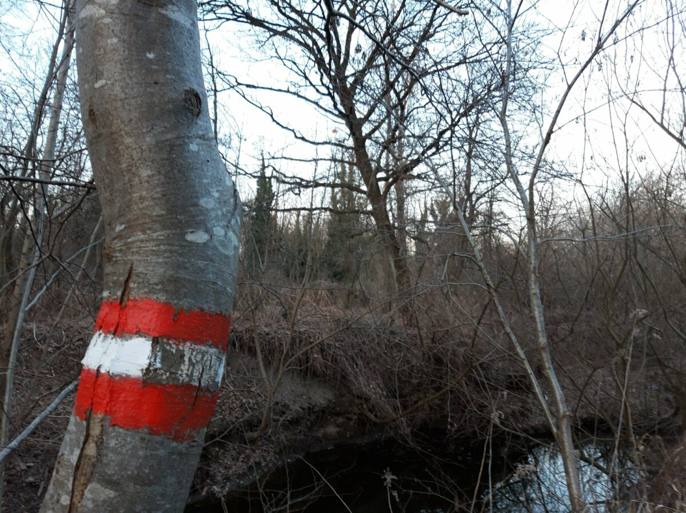
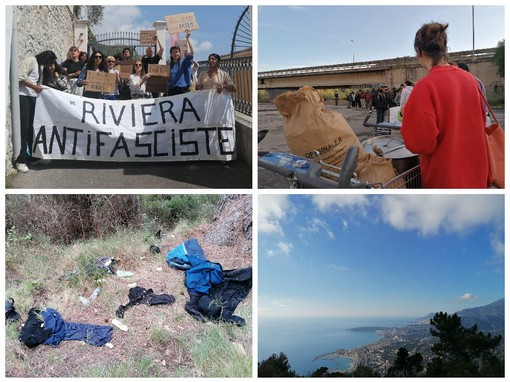
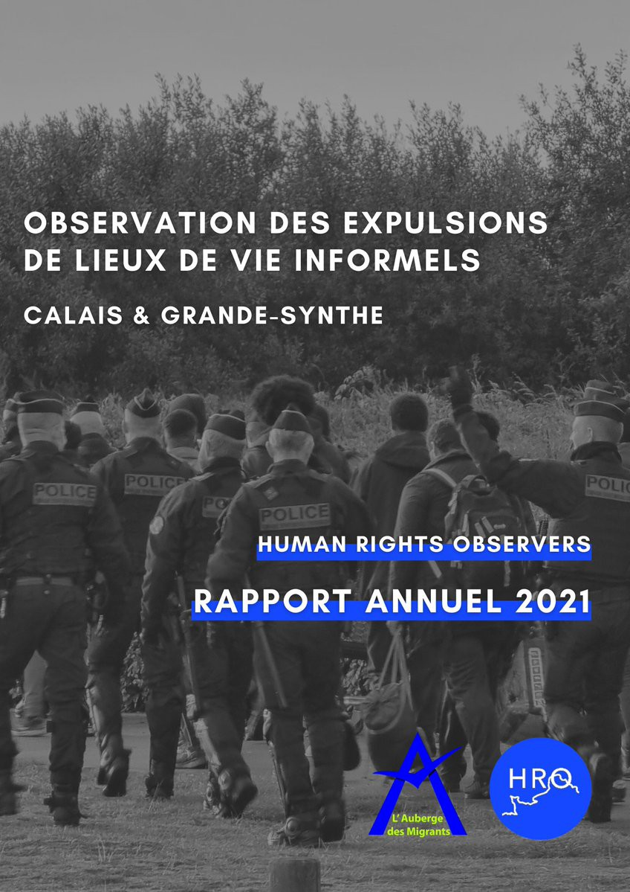
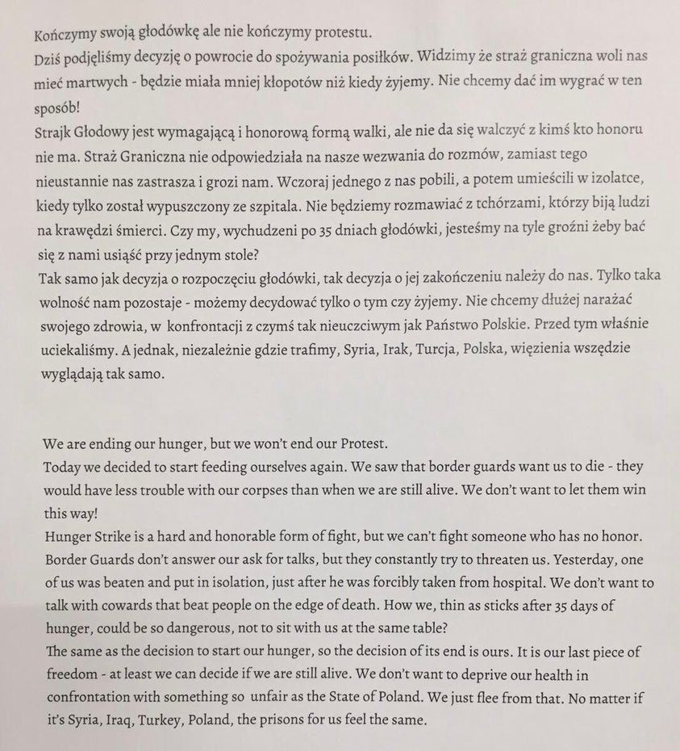

### AYS News Digest 8/6/22: Austrian Supreme Court confirms — police carried out an illegal pushback
#### Poland: Human Rights Watch report/ The 450 people from Mare Jonio and Sea Watch will disembark in Pozzallo / In France, child detention continues in spite the ECHR decision / 40 NGOs denounce the risk of more racial profiling / Frontex may end up in the European Court in Luxembourg for maintaining operations in Greece despite numerous reports of violations

Source: Push\-Back Alarm Austria
#### FEATURE

Now it is also [confirmed](ays-daily-digest-5-7-21-court-confirmed-the-systemic-chain-pushbacks-b8e0749604ad) by the Supreme Court: In Sicheldorf, southern Styria, **police officers carried out an illegal push\-back to Slovenia during the tenure of Interior Minister Karl Nehammer** \.

Our partners and friends from Austria with whom we worked on providing the visibility to the issue of chain pushbacks \(see our earlier [report](ays-daily-digest-10-09-21-a-visit-to-the-austrian-border-police-doing-what-they-are-told-at-d61f88d8b2e5) from the Austrian border in September 2021\) reported:

Requests for protection were ignored and those affected were forced to undress naked and kneel down individually in front of officers\. The Administrative Court rejected the revision and confirmed the decision of the Administrative Court of Styria, which concludes that push\-backs are partly methodically used in Austria\. In addition, the police has the right to respect the human dignity of the affected Ayoub N\. Hurted\.

The noteworthy procedure had brought about a complaint against measures by Ayoub N\. This one was on the 28th September 2020 with six more people, despite his seeking asylum in southern Styria, within just forty\-eight hours, were forcibly repatriated to Bosnia via Slovenia and Croatia\. According to the Interior Ministry, three of the affected were unaccompanied minors\.

**Karner ready to resign — abuses of internal control**

Interior Minister Karner needs an explanation: He stated to Parliament in December 2021 that there were no illegal push\-backs in Austria\. “The question arises is whether the Home Minister lied to Parliament or if he simply has no idea what is happening within his sphere of influence\.” In both cases he is ready to resign,” Lukas Gahleitner\-Gertz, spokesman for the asylum coordination of Austria, demands consequences\. Until now, despite the serious accusations, disciplinary proceedings have not even been initiated\. “So far, Karner has only referred to the pending procedure when it comes to questions about internal offenses\. That’s now concluded: Where are the consequences? “Gahleitner\-Gertz points to the poor quality of internal ministry exams, according to which “no misconduct” was found\.

**Immediate stop of human rights violations at the border**

The Interior Ministry also failed to deny the systemic nature of push\-backs in the Balkans\. From the statements of the officials before the Administrative Court it was recognized that since 2020, hundreds of repatriations have been expired identical on the Austrian southern border with Slovenia\. According to official statistics, more than 14,000 people were handed over to Croatian officials in 2020 and 2021, by the Slovenian police, including Ayoub N\. This makes it clear that the push\-back scandal has long been of an international dimension\.

Regardless of the court decisions, after raids in the border area, the Austrian police continue to carry out reparations\. “As an immediate measure, all deportations to Slovenia must be suspended and the police actions must be externally evaluated,” demands Klaudia Wieser from the Push\-Back Alarm Austria initiative\. “According to Slovenian police, 27 people have been taken over by Austria this year, almost twice as many as in the comparison period last year\. “

Illegal behavior must not be acceptable for the authorities

> “We have managed to provide evidence of a violation of an absolutely valid human right\. However, it is unsatisfactory that despite the legal violation, my client does not automatically have the right to re\-enter Austria,” — says lawyer Clemens Lahner, the Ayoub N\. represented by\. 

The initiative Push\-Back Alarm Austria and asylum coordination Austria demand that this legal gap be closed: if a push\-back is judicially determined, the affected people should be allowed to re\-entry automatically and a lump sum to provide chain compensation for the violation of fundamental rights suffered\. Lawyer Lahner has already been tasked with examining claims for impeachment, the initiative Push\-Back Alarm Austria with a crowdfunding campaign for Ayoub N\. looking to fund\.

> Supreme Court’s decision warning to the Interior Ministry 

Job N\. hopes that the decision of the Supreme Court will put an end to the unlawful actions of the authorities on the so\-called Balkan route\. Job N\. is currently homeless in Serbia: “The nightmare has to end\.” Two years of my life was stolen\. “

Push\-Back Alarm Austria and asylum coordination Austria call for effective measures to immediately end illegal push\-backs on the Austrian southern border:

Suspension of all deportations to Slovenia following border arrest and external evaluation of deportations in the past two years with regard to chain push backs, torture and inhumane treatment\.

Human rights\-compliant design of government practice in the border regions: use of a mandatory catalogue of questions after arrests, which explicitly contains the question of whether asylum is sought\. As well as the obligatory joining of qualified interpreters in case of a planned refusal\.

In case of judicial unlawful refusal, claim and official issuance of an entry visa for affected persons and lump sum compensation for affected persons in the amount of € 50,000,\-
#### GENERAL
### Denouncing legitimisation of racial profiling at the borders

A coalition of almost 40 NGOs, in a [joint statement](https://picum.org/joint-civil-society-statement-schengen-borders-code/) , [denounces](https://picum.org/press-release-new-schengen-borders-code-to-legitimise-racial-profiling-at-borders/?fbclid=IwAR1dZLDCroONFALtigbc3AlgzxDuISU4dZqS35m30kv2c8ebDvOsPAcK3IQ) the risk of more racial profiling and other fundamental rights violations under the proposed new rules to of the [reform of the Schengen Borders Code](https://eur-lex.europa.eu/legal-content/EN/TXT/PDF/?uri=CELEX:52021PC0891&from=EN) \.

> “In conjunction with other legislative documents of the New Pact, such as provisions for pre\-screening procedures that rely heavily on the arbitrary detention of POM and the failed attempts at implementing an IBMM in Croatia and Greece, the SBC reform contributes to the emergent paradigm in European migration policy that frames movement as a security concern in order to justify disregard for fundamental human rights provisions”\. — Hope Barker 

EU Justice and Home Affairs Ministers are meeting on 9–10 June to discuss various issues related to their portfolios, including the new Schengen Borders Code\. The provisional agenda can be read [here](https://www.consilium.europa.eu/en/meetings/jha/2022/06/09-10/) \.

### Frontex caretaker leader could face EU court

The EU’s border police Frontex may end up in the European Court in Luxembourg for maintaining operations in Greece despite numerous reports of violations, it is reported\. However, the new acting executive\-director Aija Kalnaja has so far refrained from pulling Frontex from Greece in light of those violations\. Read more about this ongoing [story](https://euobserver.com/migration/155148?fbclid=IwAR3JgordsUpzhFrAVsVe2H8CfFrnNDUpr-omOkEpnnn1U9OPKb2ziSLjrPo) on a lack of accountability\.
#### LEBANON

The Lebanese military has arrested 64 people trying to sail from northern Lebanon in an attempt to get to Europe, the army command has [said](https://www.aljazeera.com/news/2022/6/7/lebanese-army-arrests-people-trying-to-sail-to-europe?fbclid=IwAR3BUt9piA2RZglCYEP5eo9waX2mzRviuZak5udA8ZDFbXopiZTyHhoxqgU) v\.

1,570 people, 186 of them Lebanese, left or tried to leave by sea from Lebanon between January and November 2021\.
#### TUNISIA
### Once again, protesting in front of the UN organisation’s doors

People on the move have been protesting in front of the UNHCR office building in Tunis for weeks\. They are trying to draw the attention of the media and humanitarian organizations to their living conditions, and to demand that the UNHCR expedite their requests for international protection\.

[](https://l.facebook.com/l.php?u=http%3A%2F%2Fwww.infomigrants.net%2Fen%2Fpost%2F41048%2Fvideo-refugees-in-tunis-demand-to-be-evacuated%3Ffbclid%3DIwAR0vfPCFzRtkY1AYmzRx0mNUxSH-Hd1S3Gx7lv7Zebh1nUn_DhNX88e5CxA&h=AT1UX5rcsbg_VxVzgV104jzmyBYjz2bj6juBy5oHJY4BYfQd9AzErloFhOfjuKW1QQrODoLaVvRsFx3vUzBPhjwQ7gXp69KS2T_5qFX13hp_psWnEuhPJ-ip7L9NgFx3Dsr4YfLWpSz-zg&__tn__=R]-R&c[0]=AT29YrcR3zj0YdI2zEq8_YQD2CPaMz57uQWDl0GUyDOKPNlNXwR94D0lfAKl5PPzMqJjVI18aqs-wufqsTi9wMDSBMFHSu7WAmcqAyrACoqC4d2CT-zwV-YHaD33m0GmVWjSYF63D1e_mOrm61SxIGn3vpm8QB-46z30I3DXLykE6ASBvC5mrER3nWQ7ICoomFEN5oDn5mw8)

At the same time, a boat was caught on fire, AlarmPhone reported:

#### GREECE
### Arrivals

A boat carrying 7 refugees arrived east of Eftaloue, Lesvos north\. During the night they moved slowly east, towards the quarantine camp Megala Therma\. They arrived at the camp at around 11am, as far as we know without assistance on the ground, ABR reported\.

Others report 30 people arrived to Samos, but only 4 were registered\.
### Evros

What some call human rights violations, Greece calls business as usual:

■■■■■■■■■■■■■■ 
> **[Alarm Phone](https://twitter.com/alarm_phone) @ Twitter Says:** 

> > After being pushed back a few days ago, the group tried to cross again &amp; is now stuck on an islet in the #Evros river, on Greek soil. The @[ECHR_CEDH](https://twitter.com/ECHR_CEDH) #ECHR already granted interim measures for this group: They have the right to apply for asylum in #Greece &amp; need to be rescued now! 

> **Tweeted at [2022-06-08 09:23:10](https://twitter.com/alarm_phone/status/1534466052469444613).** 

■■■■■■■■■■■■■■ 

Situation on Evros continues, but so do the Greek interpretations of what it means to file a request for interim measures and insisting on the respect of human rights\.
### Protest in Athens

A protest took place in front of the Greek migration ministry in Athens yesterday\. Demonstrators called for better treatment of migrants and refugees, and for a stop to all pushbacks\.

#### ITALY

Mediterranea’s ship had decided to enter the port even without the authorization of the Ministry of the Interior to put an end to the long wait on board the people rescued several days ago\.

**No more unnecessary waiting and suffering for shipwrecked people rescued at sea**

Read the group’s report [here](https://mediterranearescue.org/en/news-en/a-place-of-safety-now-for-survivors-aboard-the-mare-jonio-and-sea-watch-3/?fbclid=IwAR3BUt9piA2RZglCYEP5eo9waX2mzRviuZak5udA8ZDFbXopiZTyHhoxqgU) \.
### Arrivals on the rise

20,928 people have landed in Italy since the beginning of the year until today, which is 5,000 more than in the same period last year\. On Sicily, the centre [reportedly](https://www.difesapopolo.it/Fatti/Aumentano-gli-arrivi-via-mare.-Hotspot-di-Lampedusa-in-sovraffollamento-Condizioni-disumane?fbclid=IwAR2qNXsS5_eD5fnSM3qV02dg7EgPyBighYV1F7oW9uDDO0MYa6jnm0VArpo) cannot even meet basic needs\.

> Not even clean clothes are guaranteed for people who have survived a sea crossing\. It is shameful 

Barabino \(Fcei\) cites poor reception conditions\.
The top three nationalities arriving are Bangladesh, Egypt and Tunisia\. 
 In recent days, several newspapers have raised the alarm on the possibility of an increase in arrivals due to the wheat crisis linked to the war in Ukraine\.
### Ventimiglia — More than 24,000 people turned back at the border

The situation is dramatic and on the verge of implosion at the border with France: arrivals are increasing daily and without a clearly defined programme, the area will soon continue to be synonymous with death and lawlessness for many\.

> Being able to travel the twenty kilometers that separates the last urban agglomeration in Italian territory from France and reaching Menton means on the one hand access to a new life, on the other **an unknown and often fatal danger\. —** [_read more_](https://www.imperianews.it/2022/06/08/leggi-notizia/argomenti/cronaca-6/articolo/oltre-24-mila-i-migranti-respinti-alla-frontiera-senza-una-riforma-legislativa-e-civica-anche-quest.html?fbclid=IwAR3wd78K5WXk1SoKuR8mab_8TolmId_0hdOfmbmkUkWYs8Vn0oZ5OVbA0eQ) 

“It is to this place that migrants who are intercepted before they are able to enter French territory without papers are taken\. The majority of them are stopped on a bus which crosses the French [Italian border regularly](https://www.infomigrants.net/en/post/31096/italy-migrants-evicted-from-occupied-building-near-french-border) ”:

#### FRANCE

■■■■■■■■■■■■■■ 
> **[Human Rights Observers](https://twitter.com/HumanRightsObs) @ Twitter Says:** 

> > 📢 Petit rappel pour ceux qui auraient raté l'info, demain à 19h, nous organisons un Spaces sur cette page !

L'équipe HRO et @[LouisWitter](https://twitter.com/LouisWitter) répondront à vos questions sur le rapport annuel 2021, sur la situation à la frontière et plus précisément à Calais et à Grande-Synthe ! https://t.co/hwi1bm3FLB 

> **Tweeted at [2022-06-08 12:13:59](https://twitter.com/humanrightsobs/status/1534509037793992706).** 

■■■■■■■■■■■■■■ 

### Child detention continues

On 31 March 2022, the European Court of Human Rights condemned \(for the 9th time\) the French administration for its policy of imprisoning children in administrative detention centres\. Since 2012, the jurisprudence of the Court has been consistent in that it **considers that the detention of detained children constitutes inhuman and degrading treatment\.**

This did not prevent the police prefecture of Paris \(75\) and the prefecture of the Bas\-Rhin \(67\) from imprisoning these families, decisions systematically confirmed by the judge of freedoms and detention who does not even bother to mention the presence of these children to prolong the confinement of families\.

> Mr and Mrs B and their son aged one and a half had to endure the incessant noise of the planes and the calls to the megaphone that frightened the boy\. The family spent six days locked up behind bars at the ARC\. 

> Mrs D and her one\-year\-old daughter underwent a medical evacuation on their first day because of the child’s health\. On their return to the detention centre, conditions still impacting the child’s health, the mother called 112 and had to wait 16 hours before seeing a doctor\. The family spent five days locked up\. 

> Mrs O, locked up with her 3\-year\-old daughter, was taken directly to the hospital\. They spent 4 days locked up\. 

[La Cimade](https://www.lacimade.org/presse/6-enfants-dans-lenfer-de-la-retention/?fbclid=IwAR1fDV6ahd-79pYde9pr9yK3BPFq4LFJXV0FMZT3FG61vxh-Jv_Z9v919h0) reported, documented and acted upon these incidents\.
### Paris

■■■■■■■■■■■■■■ 
> **[Utopia 56](https://twitter.com/Utopia_56) @ Twitter Says:** 

> > Paris se reveille. Depuis 11 jours, une soixantaine de jeunes isolés et à la rue continuent de porter la mobilisation place de la Bastille. Mme la secrétaire d’État à la protection de l’enfance, faites ce qui est juste, les écouter, les protéger. #mineursàlarue https://t.co/QenJ8UlYcc 

> **Tweeted at [2022-06-07 04:29:05](https://twitter.com/utopia_56/status/1534029657301037056).** 

■■■■■■■■■■■■■■ 

Human Rights Observers have released their [annual report](https://l.facebook.com/l.php?u=https%3A%2F%2Fhumanrightsobservers.org%2Fwp-content%2Fuploads%2F2022%2F06%2FRapport-annuel-2021-VF.pdf%3Ffbclid%3DIwAR1WRbKY_ZRuAoFZvFdD206tyt-Nji1-TRDGtlgbqQnWgnc87L4doZOPX6o&h=AT1cyM0HXM9_yjKz5J0M7PjlXcL63WMltAyRifFZqqVtaCgtXWiDYrFjc1QNT5gRmELLEDQ-iYmOZX-ZHnxuw0Hz9NaeHr7oIcFDSmGhEy8J0y-PfOVmCQ3WuasGN8UADQ&__tn__=R]-R&c[0]=AT1C2SaNavo_Hp8fVZPdqtz9nQUdb7cmZFyq5UpUcX6VNIbdoFYO2fdUGRku2mg2CO1WKgWkl0ISlLhZ3QYtVxaaVlrgZao7y8G0_7cfW4lAYz_dhXufrh8nPaiD3Cw-Vl4B631p64upO8c7MQvanAjHM7xjRxewhLm7lvsQ0AHoxa2lkoMZHCEeDJFxLv223L8Om_pMhDYE)

#### POLAND
### Human Rights Watch report on the violence at the border with Belarus

> Poland unlawfully, and sometimes violently, summarily pushes migrants and asylum seekers back to Belarus, where they face serious abuses, including beatings and rape by border guards and other security forces\. At least one person drowned and another disappeared in March 2022 in the course of being pushed back\. 

Commanders at two border guard stations in Poland in May confirmed they summarily push people back, citing an October 2021 Polish law that permits the removal of foreigners from Polish territory to Belarus\.

> People interviewed said they had been trapped in the area between the two border fences, as well as inside Polish territory, being stranded in forests, wandering through swamps and rivers in freezing temperatures for days and weeks without food or water, and drinking swamp water to survive\. 

Find the entire report [here](https://www.hrw.org/news/2022/06/07/violence-and-pushbacks-poland-belarus-border?fbclid=IwAR1rR0141bLoCrob3L86oqV48k0IuMPTkN_qYXd_fsnTp1TxsbEgPA4-1Ig) \.
### Hunger strike update

“We will not talk to cowards who beat people to the brink of death,” write those who have been on strike for 35 days at the Guarded Centre for Foreigners in Lesznowola\. They decided to end their hunger strike\. However, the protest continues\.

> “Today we made the decision to go back to eating\. We see that the border guards prefer to have us dead — they will have less trouble than when we are alive\. We don’t want to let them win this way\!” 

Grupa Granica published the strikers’ statement:

#### UK

This Sunday, solidarity demonstration against the flights and deportations to Rwanda:

Solidarity demo @ Brook House, Sunday 12th June, 3pm Demo outside the Home Office, Monday 13th June, 5\.30pm

#### WORTH READING
- What will become of Denmark’s trying to make a deal with Rwanda for the past few years but have so far only officially agreed a rather vague, non\-binding [Memorandum of Understanding](https://jyllands-posten.dk/indland/article12953714.ece/BINARY/L%C3%A6s%20aftalen%20mellem%20Danmark%20og%20Rwanda) with no specific action points

- Why are Afghans heading to Iran? The story of several who took the dangerous people\-smuggling route that passes via Pakistan in hopes of feeding their families

[](https://l.facebook.com/l.php?u=https%3A%2F%2Fwww.thenewhumanitarian.org%2FNews-feature%2F2022%2F05%2F17%2FAfghans-risky-crossings-Iran%3Ffbclid%3DIwAR2R1U1YEbEZgxuoAGt6W-LrjdMG2mCR-Hs97Bqf80LKyXTagDVGsqgHfFY&h=AT2enui6sZIsCyniH0_5eDWJ8Bbu7aJ2DPW37Nkw_B6d_qF80bWoEi1VdzPXH0jZuGih5h78pu46cGa51m_lCOb3E2iWgx9zO31iWA14dR_WNW1Yji1PLqWFr2ryKX1RO9H5vjXaRyJ_FeGQ6g&__tn__=%2CmH-R&c[0]=AT112M_Hz79oWx_TYyFehPi9VwxgsJx3dJJhTOtAAObSSy_V0QQJpkSY0qt05eW2vDMIgr5tvkp9hazVW9aVWmwftqDendAKcuWU8zTRicdTRJJNdgSbkVCMtS0M1_WUTLPRLLRtNtHxNJH8KcGlRBoqacJWcF6fXvn7Zl90s8xeQo1HhGVBDFQ8uQ4_8h2CfjVxTqOnn7U)

- personal stories — “Franck\* has been in contact with the editorial staff of InfoMigrants for two years\. Twice, the Congolese had shared his difficult daily life in a camp on the Greek island of Samos\. Despite his refugee status, he was forced, with his wife and three children, to live in precarious conditions\. The family is now housed in a reception center in France where they can finally envisage a future\. Testimony:

[](https://l.facebook.com/l.php?u=https%3A%2F%2Fwww.infomigrants.net%2Ffr%2Fpost%2F41033%2Fdepuis-que-je-suis-en-france-cest-la-joie-le-soulagement-de-franck-apres-pres-de-trois-ans-de-calvaire-en-grece%3Ffbclid%3DIwAR1ew3iOzgOxyeHZdWhYZru4u-Q9erqjlsLJnFh1hrkdenm0XAtW3mSZiX4&h=AT2p0CH2sTDkkn68IcsvW4XoG7kszik4HSPtaLIW0CEH-ysWV2I1l9G5u78WV9UXOMaZMx-5RfXFLuvPJphjW5-yrpA3-4vNpcddV2X1tcgaH0_4QSUUrC23WbLODCWIwtWLru9EcoBjzhDLM3BTzqF2dZcnKg&__tn__=R]-R&c[0]=AT1C2SaNavo_Hp8fVZPdqtz9nQUdb7cmZFyq5UpUcX6VNIbdoFYO2fdUGRku2mg2CO1WKgWkl0ISlLhZ3QYtVxaaVlrgZao7y8G0_7cfW4lAYz_dhXufrh8nPaiD3Cw-Vl4B631p64upO8c7MQvanAjHM7xjRxewhLm7lvsQ0AHoxa2lkoMZHCEeDJFxLv223L8Om_pMhDYE)

- Pushbacks: The timeless denial of the Greek governments:

[](https://l.facebook.com/l.php?u=https%3A%2F%2Fwearesolomon.com%2Fmag%2Fon-the-move-el%2Fepanaproothiseis-h-diaxronikh-arnhsh-twn-ellhnikwn-kyverhsewn%2F%3Flang%3Del%26fbclid%3DIwAR38dIA_h-2CIZx0ANS_lPEkd557RBbJ0p-oPQ18yNR9549ZaCYlt5nNpVo&h=AT0o8FGYvJZWm0R3yaua0VVf773RaBaNuXVgNBWDSYWqxYKZxinGwUsI25EC9vw4zuURgnY3fKF3T46iVwVGRw29BwcAFAzzA9Pnuczc6oP66bfsJF-qFoN24EKHs6V2D_TaDDF5JVQVnzaS1SF3FvO1XmiDSg&__tn__=R]-R&c[0]=AT2e96LLxBuKWq9qMKOpbG_BYF1qPh6sOTUcFmJaay-yz-2TZyWKuTJJiLIq-7w5dCD9N1v_3kBjlQIMz341CUUqL8RN5pt8U8V-GXIaJW_Pbm2SSVQGY-W3kXafHE4JRB4K1fTvc5Ltx39DJHGEh3ivB0372CUB67Wt_P05sAEbbnPP-j6lmKo5G_4pUoJ88m5q2W4yGlM8)

**Find daily updates and special reports on our [Medium page](https://medium.com/are-you-syrious) \.**

**If you wish to contribute, either by writing a report or a story, or by joining the info gathering team, please let us know\.**

**We strive to echo correct news from the ground through collaboration and fairness\. Every effort has been made to credit organisations and individuals with regard to the supply of information, video, and photo material \(in cases where the source wanted to be accredited\) \. Please notify us regarding corrections\.**

**If there’s anything you want to share or comment, contact us through Facebook, Twitter or write to: areyousyrious@gmail\.com**

_Converted [Medium Post](https://medium.com/are-you-syrious/ays-news-digest-8-6-22-austrian-supreme-court-confirms-police-carried-out-an-illegal-pushback-6a9392f541a1) by [ZMediumToMarkdown](https://github.com/ZhgChgLi/ZMediumToMarkdown)._
