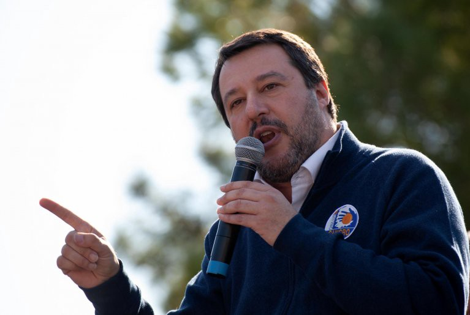

### AYS News Digest 13/6/22: France’s new proposal — relocation of 10,000 asylum seekers per year across EU states
#### France’s new EU asylum pact proposal // Turkey announces tighter immigration measures // Alarmphone has lost contact with a group stranded on the Evros islet//High rate of fatalities still in the Mediterranean // UK protests against the first planned flight to Rwanda // FRONTEX publishes data on migration flows into the EU // UN report published on human rights violations at the EU borders // and extra resources/reading…\.

Source: UN News, 2022
#### **GENERAL**
#### **Felipe Gonzalez Morales has published a report on human rights violations at international borders**

You can read the full report here: [Human rights violations at international borders: trends, prevention and accountability](https://documents-dds-ny.un.org/doc/UNDOC/GEN/G22/328/57/PDF/G2232857.pdf?OpenElement)

Key conclusions from this report include;
- Pushbacks continue to be used as a deterrent mechanism in many States
- Reports of pushbacks are often not investigated thoroughly enough and dismissed by national authorities
- Certain States have created conditions in which law enforcement officers involved in pushbacks have been provided immunity
- Morales emphasises his support of the New Pact on Migration and Asylum, that would help to mobilise independent monitoring mechanisms at national and EU level borders

■■■■■■■■■■■■■■ 
> **[Felipe González Morales](https://twitter.com/UNSR_Migration) @ Twitter Says:** 

> > Just released my report about human rights violations at international borders, including a follow-up about the grave and extended practice of "pushbacks", the issue of safe 3rd countries and other related matters. I will present it at @[UN_HRC](https://twitter.com/UN_HRC) on June 23.
[undocs.org/Home/Mobile?Fi…](https://undocs.org/Home/Mobile?FinalSymbol=A%2FHRC%2F50%2F31&Language=E&DeviceType=Mobile&LangRequested=False) 

> **Tweeted at [2022-06-10 14:48:05](https://twitter.com/unsr_migration/status/1535272594726825984).** 

■■■■■■■■■■■■■■ 

#### **FRONTEX have also published a report on the numbers of people who have entered EU external borders**

The reports claims that more then [5\.5 million Ukrainian nationals have entered the EU from Ukraine and Moldova since February](https://frontex.europa.eu/media-centre/news/news-release/eu-external-borders-in-may-detections-in-western-balkan-region-more-than-double-gsEhc8) \.

> “In the first five months of 2022, the most active migratory routes into the EU were the Western Balkan, Central Mediterranean and Eastern Mediterranean routes\.”

#### **France proposes an EU plan whereby [10,000 asylum seekers a year are relocated from EU border countries](https://www.aljazeera.com/news/2022/6/10/france-proposes-plan-to-unblock-eus-asylum-seeker-pact)**

The proposal considers all 19 EU states in the Schengen zone to welcome asylum seekers who are currently in Italy, Greece and Malta\. States that would not agree to be a part of this plan would be required to provide financial contributions to those who do welcome more asylum seekers\.
#### **TURKEY**
#### **Turkey has announced tighter migration controls on Syrians in the country**

> “The percentage of foreigners who are allowed to live in each neighborhood will be reduced from 25 percent to 20 percent, starting from July 1, closing 1,200 districts to settlement”

Source: Arab News, 2022

The idea is that foreigners, including Syrian nationals, will not be able to live in a neighbourhood that already has foreigners making up 20% of the population in that area\.

[In addition, Syrians will not be allowed to visit family in Syria during the upcoming Muslim holiday, Eid Al\-Adha\.](https://www.infomigrants.net/en/post/41147/turkey-limits-residence-permits-for-foreigners) Refugees risk losing their refugee status if they visit Syria during this holiday\.

In addition, with these new measures, taxi drivers are now permitted to ask clients for official ID documents when moving between cities, further creating a network of security and control within the country\.

[**1104 migrants have been detained by Turkish authorities**](https://www.dailysabah.com/turkey/turkey-detains-over-1100-irregular-migrants-in-istanbul/news) **— whilst Turkey hosts over 4 million refugees, more than any other country, current policy changes and harsher security measures are being introduced\.**

The previous day, another 1,682 migrants were detained across various cities in Turkey\. Last Friday, 221 Afghan nationals were flown back to Afghanistan\.
#### SEA/SAR
#### UNHCR data shows a sharp increase in numbers of dead or missing individuals trying to cross to Europe from 2020 to 2021

Whilst the numbers of refugees and asylum seekers crossing into Europe has decreased since 2015, [the rate of fatalities is still exceptionally high, and is increasing](https://www.globalist.it/world/2022/06/11/perche-il-mediterraneo-e-sempre-piu-il-mare-della-morte/?fbclid=IwAR1hrAtItk9-aJtXcmKBdeBoiqeHf0-UCFodwFXBfW5h9OOspOtO4RiDazU) \.

Source: UN News, 2022

Deaths and abuses on land routes follow a similar trend, particularly in countries of origin and transit, such as, Eritrea, Somalia, Ethiopia, Sudan, Djibouti, and Libya\.

You can read the full article here: [UN News](https://news.un.org/en/story/2022/06/1120132?fbclid=IwAR2uMe34RVnSbSHUQXPEcbEQncNsZzMK6xGxKur4Zr29OqwiwpQUql9Q1Lg)
#### **GREECE**
#### **Following on from the report in AYS News Digest 10/6/22, Alarm Phone has stated that they lost contact with the group stuck on the Evros islet\.**

■■■■■■■■■■■■■■ 
> **[Alarm Phone](https://twitter.com/alarm_phone) @ Twitter Says:** 

> > Yesterday, we lost contact to the 28 people. In our last contact they told us that they were watched from the Greek side. We fear that all their phones were stolen by the Greek authorities. We remind Greece to follow @[ECHR_CEDH](https://twitter.com/ECHR_CEDH)’s ruling and offer protection! No #pushback! 

> **Tweeted at [2022-06-11 07:35:57](https://twitter.com/alarm_phone/status/1535526233651429378).** 

■■■■■■■■■■■■■■ 

■■■■■■■■■■■■■■ 
> **[Giorgos Christides](https://twitter.com/g_christides) @ Twitter Says:** 

> > UPDATE: Contact with the group of migrants on the Evros islet has been lost.  🇬🇷 authorities tell me no one was found at the location, in Greece’s very own Bermuda Triangle where it is  people that keep vanishing into thin air instead of ships and planes. [twitter.com/alarm_phone/st…](https://twitter.com/alarm_phone/status/1535526233651429378?s=21&t=G-sb436UFPWjwWaZzNq2zw) 

> **Tweeted at [2022-06-11 08:04:35](https://twitter.com/g_christides/status/1535533438572314627).** 

■■■■■■■■■■■■■■ 

They believe another pushback has taken place, and that the group members have had their phones taken away from them\.
#### **A truck fleeing police in Thessaloniki hit a fence, [killing one migrant and injuring 17 others](https://apnews.com/article/politics-greece-police-accidents-7040aa3b1c150eccbcd5307667ca1f31)**

The driver ran through a checkpoint, and instead of stopping, he sped up\.
#### **An Afghan male was shot and killed in a village in Greece, near the border with Turkey**

■■■■■■■■■■■■■■ 
> **[Lena K.](https://twitter.com/lk2015r) @ Twitter Says:** 

> > An Afghan man was shot dead by Greek security forces at the #Evros border near Edirne, according to a CNN Turk report. A 🇬🇷local news site dismissed the news as propaganda. Possible, but not the first such incident at this border.
[cnnturk.com/dunya/son-daki…](https://www.cnnturk.com/dunya/son-dakika-yunan-guvenlik-gucleri-sinirda-gocmenlere-ates-acti-1-afgan-hayatini-kaybetti) 

> **Tweeted at [2022-06-13 19:21:35](https://twitter.com/lk2015r/status/1536428586999201793).** 

■■■■■■■■■■■■■■ 

[Greece’s minister for Citizen Protection denied any involvement](https://www.keeptalkinggreece.com/2022/06/13/evros-alleged-incident-shooting-afghan-migrant/?fbclid=IwAR3942UUaiiYmwrUyMWmfXaHE-wnRUbVnv77FVyBWoaCTNof0ebj4-cahLM) , and claimed that Turkey are spreading fake news\.
#### POLAND
#### Polish government will lift the state of emergency imposed along its border with Belarus

Poland began constructing the border wall in 2021 when the numbers of migrants crossing through Belarus to Poland was rising\. The government restricted the rights of most individuals entering the border area under emergency powers\. They have said that whilst the state of emergency will be lifted, they will continue preventing individuals from going within 200 metres of the wall\.
#### **SLOVENIA**
#### [**InfoMigrants reports**](https://www.infomigrants.net/en/post/41109/slovenia-to-dismantle-border-fence-with-croatia) **that Slovenia’s new left\-liberal government plans to remove the border fence along the Croatian border by the end of 2022\.**

It was originally built in 2015, as a response to the increasing numbers of asylum seekers attempting to cross through Slovenia\. It has been extended several times in the last few years\.
#### ITALY
#### Defamation case against Matteo Salvini, leader of Italy’s far\-right League party, has begun

He is accused of damaging the reputation of Carola Rackete, the former captain of Sea\-Watch 3 migrant rescue ship, after making personal, targeted, remarks on social media from June to July 2019\.

Source: InfoMigrants, 13/6/2022
#### **UK**

You can use the interactive map [here](https://firmcharter.org.uk/week-of-action/?fbclid=IwAR24xl9h7XNJAMrjxfHI4rT66LiL2DrUNXSi3zb8yCgedjVEKUcNErgLTR8) to find an action/event near you\.

This week of action follows the rejection of a legal challenge against the UK’s attempts to deter asylum seekers from coming to the UK\. [The High Court in London ruled that the removal of asylum seekers from the UK to Rwanda can commence this week\.](https://www.infomigrants.net/en/post/41137/uk-court-sides-with-government-in-deporting-asylumseekers-to-rwanda)

People have come together across the UK, opposing tighter immigration policies and the first flight for Rwanda that is planned to take place on Tuesday 14/6/22\.

In Manchester, protesters marched through the city centre — [there were hundreds of people](https://www.theguardian.com/uk-news/2022/jun/12/hundreds-gather-in-manchester-to-oppose-rwanda-deportation-plan?CMP=share_btn_fb&fbclid=IwAR1GUao2SA_CjOFVZ26NSXwN39qjO5n5N2c201TiEOUibzm7MUCRnDG70EU) attending, fighting against the UK’s immigration policies\.

Source: The Guardian, 2022

In Peckham, South East London, [protesters blocked an immigration enforcement van that was holding a Nigerian man](https://www.theguardian.com/uk-news/2022/jun/11/protesters-block-immigration-officers-van-during-peckham-arrest) who had been arrested for overstaying his visa\. The protesters sat in front of the van for hours\.

Source: The Guardian, 2022

Protesters outside Gatwick airport on Sunday 12th June:

■■■■■■■■■■■■■■ 
> **[Nick Dearden](https://twitter.com/nickdearden75) @ Twitter Says:** 

> > Amazing scenes down here in Gatwick. We’ve found a back way to Brook House removal centre. Detained refugees protesting inside and we’re protesting outside and talking to folk in there. Very emotional for everyone. #StopRwandaFlight ✊✊✊ 

> **Tweeted at [2022-06-12 15:17:35](https://twitter.com/nickdearden75/status/1536004797064683520).** 

■■■■■■■■■■■■■■ 

■■■■■■■■■■■■■■ 
> **[Nick Dearden](https://twitter.com/nickdearden75) @ Twitter Says:** 

> > Just arrived at the immigration removal centre in Gatwick to say #StopRwandaFlight. Many people here showing solidarity with the refugees being imprisoned and protesting this horrific deportation policy. https://t.co/C6jZ7I5NBu 

> **Tweeted at [2022-06-12 14:22:41](https://twitter.com/nickdearden75/status/1535990979848814593).** 

■■■■■■■■■■■■■■ 

Protests have taken place on Monday 13/6/22 outside the Home Office:

■■■■■■■■■■■■■■ 
> **[PoliticsJOE](https://twitter.com/PoliticsJOE_UK) @ Twitter Says:** 

> > 🚨 We are at a demonstration outside the Home Office. 

“Refugees are welcome here,” chant protestors, in opposition to tomorrow’s scheduled Rwanda deportation flight https://t.co/SXdF2jqBJC 

> **Tweeted at [2022-06-13 16:43:12](https://twitter.com/politicsjoe_uk/status/1536388727584571395).** 

■■■■■■■■■■■■■■ 

Care4Calais provided regular updates on the deportees, and reported that 2 more individuals have had their tickets cancelled:

■■■■■■■■■■■■■■ 
> **[Care4Calais](https://twitter.com/Care4Calais) @ Twitter Says:** 

> > BREAKING: Two more Rwanda deportees have had their tickets cancelled. 

Twenty three people have now had their Rwanda tickets cancelled. Eight still have live tickets for tomorrow. 

> **Tweeted at [2022-06-13 13:02:11](https://twitter.com/care4calais/status/1536333109465165826).** 

■■■■■■■■■■■■■■ 

#### EXTRA RESOURCES:
- A really interesting joint NGO statement in regards to the changes required in EU migration policy and resettlement —

- A Q&A with Sally Hayden on the abuse and human rights violations taking place in Libya’s detention centres

- Following on from this, there is a very powerful testimony by Zoule who was detained in a detention centre in Libya for 8 months

■■■■■■■■■■■■■■ 
> **[MSF Sea](https://twitter.com/MSF_Sea) @ Twitter Says:** 

> > After 8 months in detention in #Libya, Zoulé now safely reached Europe. “Guards called our families and demanded money from them to release us. I had no money and no family, so I spent eight months locked up and being beaten”, he says.  
⬇️ https://t.co/VouHrjBjpO 

> **Tweeted at [2022-06-13 14:46:24](https://twitter.com/msf_sea/status/1536359334233489409).** 

■■■■■■■■■■■■■■ 

- James O’Brien discusses the UK Rwanda Policy

■■■■■■■■■■■■■■ 
> **[LBC](https://twitter.com/LBC) @ Twitter Says:** 

> > James O'Brien blasts Boris Johnson for jumping on 'another Farage flavoured bandwagon' with his Rwanda refugee policy, to distract from 'the 'reality of Brexit' becoming 'ever more obvious and harder to ignore'. 

@[mrjamesob](https://twitter.com/mrjamesob) https://t.co/YkX3w6L0yj 

> **Tweeted at [2022-06-13 11:16:19](https://twitter.com/lbc/status/1536306468546281473).** 

■■■■■■■■■■■■■■ 

- Mixed Migration article/summary of recent events — June 6–13

**Find daily updates and special reports on our [Medium page](https://medium.com/are-you-syrious) \.**

**If you wish to contribute, either by writing a report or a story, or by joining the info gathering team, please let us know\.**

**We strive to echo correct news from the ground through collaboration and fairness\. Every effort has been made to credit organisations and individuals with regard to the supply of information, video, and photo material \(in cases where the source wanted to be accredited\) \. Please notify us regarding corrections\.**

**If there’s anything you want to share or comment, contact us through Facebook, Twitter or write to: areyousyrious@gmail\.com**

_Converted [Medium Post](https://medium.com/are-you-syrious/ays-news-digest-13-6-2022-frances-new-proposal-relocation-of-10-000-asylum-seekers-per-year-f970236f0624) by [ZMediumToMarkdown](https://github.com/ZhgChgLi/ZMediumToMarkdown)._
