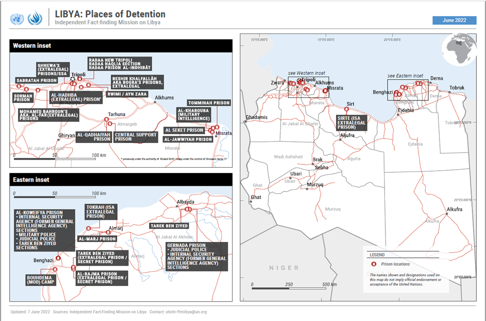
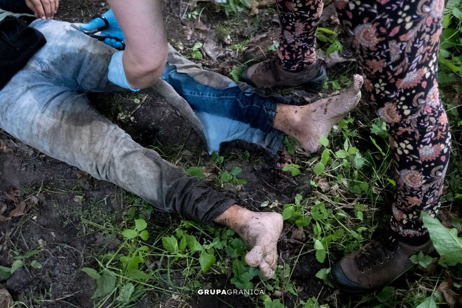

### AYS News Digest 1/7/22: European court decided\- no right to detain people just because they entered ‘illegally’
#### **BVMN investigation into the use of islets in illegal pushbacks, disregard for interim measures by the Greek state, and the unfolding dynamic of criminalisation through smear campaigns against human rights defenders /** The UN’s Independent Fact\-Finding Mission on Libya issues a report corroborating earlier claims of serious human rights abuses / Poland completes Belarus border wall / other reports, news and updates

#### FEATURE — The Court slams automatic detention and denial of asylum

The Court found the practice of denying the right to asylum to be in violation of EU law, including the EU Charter of Fundamental Rights, and debunked the Lithuanian claims that the country has the right to derogate European law in “extraordinary situations” or during the “mass influx of foreigners“\.

Depicting detention as ‘temporary accommodation’ or even an ‘alternative to detention’ allows no derogation, Amnesty International said earlier\.

All this confirms AI’s earlier report citing abuses against people who crossed into Lithuania from Belarus\.

Press release of the Court [decision](https://eur-lex.europa.eu/legal-content/EN/ALL/?uri=CELEX%3A62022CJ0072&fbclid=IwAR1Xo8kMCqw6voNu3xFKxP0PxRd7eIttI8eP0qnHEBtDDHsaUbQI8-vGYA4) in [French](https://curia.europa.eu/jcms/upload/docs/application/pdf/2022-06/cp220115fr.pdf?fbclid=IwAR3_JnsaoVjGNzlefrUlXM-ImgsBu1p3tQdWUWV05VI_QgdqpQg168iOZ-M) and the ProAsyl German version is available [here](https://l.facebook.com/l.php?u=https%3A%2F%2Fwww.proasyl.de%2Fpressemitteilung%2Feuropaeischer-gerichtshof-verurteilt-litauen-und-zieht-rote-linien%2F%3Ffbclid%3DIwAR17UY63AaVbqwPVzlz0N9_GuWVueJShPF9sHqE4p-6okQMGVDDFSqseUPQ&h=AT0Caat7EHhepJNQI711JXuHhljwhroQKIvZAmOLEYPT7c6gsFRlmnHXRsNSHMqZn-fbMBdZYU5IUP5HEl5wK5t_UJaCLN3LXUGLLCdOEjQtvSP73gNvazDZWueM5MoieqoQYVI7EOi-8w&__tn__=R]-R&c[0]=AT2LJnscf0_d5X1boix4BixiubRdSqkGc9T8tecVdUnck1SFlytOhkHmw8pb8SxRLPn1H6NPhjGyY_Y1p0OltsthAbryXbS9ylDtpCp5DPeUFSxKhxh7CcmCUQgzYqjYOx6j2Lfl7F1zgytIYQRRXLPJVMmzy_XgZT1OkHclM9efB_iqQaTIzcKo4hhnc4JpCCvxzg3XoPSk) \.
#### GREECE

“Violent and illegal deportations of migrants must stop, now,” [said](https://www.keeptalkinggreece.com/2022/06/30/eu-commissioner-johansson-greece-pushbacks-funds/?fbclid=IwAR3_JnsaoVjGNzlefrUlXM-ImgsBu1p3tQdWUWV05VI_QgdqpQg168iOZ-M) Home Affairs Commissioner Ylva Johansson after meeting Greek government ministers, adding however that “protecting EU external border from illegal entry is an obligation”\. Greek authorities openly said they had stopped a significant number of people from entering, approving of the pushbacks\.

■■■■■■■■■■■■■■ 
> **[Alarm Phone](https://twitter.com/alarm_phone) @ Twitter Says:** 

> > The Turkish Coast Guard just told to us that they rescued a group of 38 people on 2 life rafts last night. Since we lost contact to the people, they can't confirm but we have to assume that they became target of yet another #pushback in the Aegean! Stop the war on migrants! 

> **Tweeted at [2022-07-01 12:40:19](https://twitter.com/alarm_phone/status/1542850589553573888).** 

■■■■■■■■■■■■■■ 

The Border Violence Monitoring Network shared a letter of concern it sent to Frontex, regarding illegal pushbacks at the Greek\-Turkish border and the recent publication of new evidence of Greek authorities coercing asylum seekers into pushing other transit groups back to Turkey by Lighthouse Reports, Le Monde, der Spiegel, the Guardian, and other media outlets\.

[](https://l.facebook.com/l.php?u=https%3A%2F%2Fwww.spiegel.de%2Finternational%2Feurope%2Fsystematic-abuses-at-eu-external-border-greek-police-coerce-refugees-to-commit-illegal-pushbacks-a-32988662-06c8-420d-a2c9-fde426bef1b1%3Ffbclid%3DIwAR2j2G48SdjZaRqrjpr0HLERpJ06SRjvFRcEjmaE-sV-8JBJPoEHV5G7UDM&h=AT3kNI22JVercqYuNu-H0VK4FT3onPbkwLfjcxLyRTGTtXXP84DDmr2Fz9AwzWq18cY7QlmEgEggwcYicmrJ-45nnUqqRwQh3nN29z0MuVQfmJX1LKq6Pg0Vi5k_aeaJM60vSy9xc4Yekw&__tn__=R]-R&c[0]=AT0taT5YkEkYkcOWyhURZThgkjMSOHXpbopC0tEgFLFjgozSGo4a13KjRbZ-h8_bCrkr6_1KUwtk0U5T3qPbQpwEKRZLVvz1z018DdlYfgCPTRlYNzFZlFxjgaF_M0XSsKkNqnkzO0Kgv496B42uIAdnl3HC1uLk2mKXuDFsQ1xsz6qnAolPkaaKnLzHM0qOiuIquMGOCRgp)

**The BVMN also published its investigation into the use of islets in illegal pushbacks, disregard for interim measures by the Greek state, and the unfolding dynamic of criminalisation through smear campaigns against human rights defenders\.**

You can read more about the criminalisation cases in the upcoming AYS Special\.

The report documents the recent increase in use of Rule 39 measures on the Greek mainland, in order to secure access to international protection\. It specifically details and analyses three case studies whereby transit groups were stranded on islets in the Evros river over the months of May and June 2022, and sent distress calls to state and civil society actors across Greece expressing their will to claim asylum\. In all three cases, civil society organisations, including the Greek Council for Refugees, Human Rights360, AlarmPhone, and The Rule 39 Initiative submitted applications for interim measures on the behalf of the transit groups, and a Rule 39 decision was indicated by the European Court of Human Rights, legally binding the Greek state to provide temporary access to Greece and material reception conditions\.

**Despite the Court’s rulings, as well as the extensive public documentation of the cases on social media platforms and in news outlets, all three transit groups were reportedly pushed back to Turkey after several days on the islets without food, water, or medical care\.**

In the context of the cases documented here and the recent investigation by Lighthouse Reports we, the Border Violence Monitoring Network, call for Greece to be held accountable and for all operational and financial support to be suspended until the rule of law is restored\.

Download the report [here](https://www.borderviolence.eu/?mailpoet_router&endpoint=track&action=click&data=WzE5MSwiMTNscWd4c20wY3FvOG9nc3N3d2Nvb3c0MHdnd28wb2ciLCIyOCIsIjc1MWIzNWE3M2U1NSIsZmFsc2Vd) \.
### Greek Asylum Case Law Report

The new issue of the Greek Asylum Case Law Report released today provides excerpts from 79 decisions issued in the first half of 2022 by Administrative Courts, the Independent Appeals Committees and the Asylum Service\.

In addition to the Greek Council for Refugees \(GCR\), HIAS Greece and Refugee Support Aegean \(RSA\), Issue 1/2022 of the Greek Asylum Case Law Report received contributions from civil society organisations METAdrasi, Fenix Humanitarian Legal Aid and Equal Rights Beyond Borders, as well as lawyers of the Legal Aid Registry of the Asylum Service, selected from their respective casework\.

[](https://l.facebook.com/l.php?u=https%3A%2F%2Frsaegean.org%2Fen%2Fgreek-asylum-case-law-report-issue1-2022%2F%3Ffbclid%3DIwAR2VlPJ0fvsCMWY1f4bykH4NTczXqP6dIaYXc5GCTmO04snUbspwssIDc4A&h=AT39rTxB6YyXxL96F0kEI_YYXnIsHk83hcTTEbyFuC_hAzGV6HcIeLEcT3T4mPc1BL6WFbjmzV3ptqf4buRKItZ1pQ-KFsMVv2JODDN-V4NThFNme84R_XVlF7tRtW8HwVCtHp-R-yKwzA&__tn__=R]-R&c[0]=AT0taT5YkEkYkcOWyhURZThgkjMSOHXpbopC0tEgFLFjgozSGo4a13KjRbZ-h8_bCrkr6_1KUwtk0U5T3qPbQpwEKRZLVvz1z018DdlYfgCPTRlYNzFZlFxjgaF_M0XSsKkNqnkzO0Kgv496B42uIAdnl3HC1uLk2mKXuDFsQ1xsz6qnAolPkaaKnLzHM0qOiuIquMGOCRgp)

#### LIBYA
### **Mass graves, forced to submit to rape in exchange for food, …**

The UN’s Independent Fact\-Finding Mission on Libya issued a report that confirms all the previous testimonies, reports and watchdog groups’ findings already pointed out\.

> Crimes against humanity of murder, torture, imprisonment, rape, enforced disappearance and other inhumane acts have been committed in several places of detention in Libya since 2016 

The findings and the conditions surrounding the visit were not done in full capacity, as the report warns:

> The Mission continues to await access to prisons and wishes to highlight the delays by the authorities in the west and the east to allow it to visit Sebha \(south\) \. Further investigations on the ground in other regions, including the east, are also essential\. Furthermore, the true operational duration of the Mission has been significantly limited by the COVID\-19 pandemic, a United Nations budgetary freeze and other administrative matters, including the recruitment of staff\. The Mission needs additional time to discharge its mandate fully\. 

However, the mission has nonetheless reported and documented serious human rights abuses — cases of rape in places of detention or captivity whereby migrant women are forced to have sex in order to survive, in exchange for food or other essential items\.

There are reasonable grounds to believe that some of the acts committed in prisons amount to war crimes committed in the context of the non\-international armed conflict that took place in and around Tripoli from April 2019 to June 2020, especially when individuals linked to the LNA were tortured when its forces advanced on Tripoli\.

The Mission continued its investigations of extrajudicial killings in relation to violations of the right to life associated with the mass graves discovered in and around Tarhuna, in western Libya\.

Many cases of enforced disappearances documented by the Mission started with violent abductions and arbitrary detention and were frequently accompanied by torture and ill\-treatment\. The emblematic cases of extra\-judicial killings and enforced disappearances included in this and previous reports highlight how impunity continues to prevail in Libya\. Investigations and prosecutions of such gross violations of human rights are urgently needed\.

In the meantime, it was [reported](https://l.facebook.com/l.php?u=http%3A%2F%2Fwww.infomigrants.net%2Fen%2Fpost%2F41628%2Ften-migrants-found-dead-in-niger%3Ffbclid%3DIwAR1PJzbGamuKX5XZ5Ow0N2GauMbUMtApULljp_GiYOpfPsuVwpYdFANY0Fw&h=AT1ERJeO7OxOkfaMNXJIJHomZqxM5fIp-FhllXjfsY13SP3ZJIWSyrllSlfdOHRmuh3O4A6drVKn4cy8JnYgZPk8DtuKIAJfk7szGJWT1dFwt2n2xVxKpukTC2xjVt8vIwtSYyCPoHKWkg&__tn__=R]-R&c[0]=AT386C95k2BttGdGqxI2BYfyPZ_outKEHqhBi8-qRojhCvmDlcDhRabYFnT8HiULi1i8WlrZM41mh-1dVBp9FHIKXj_6e04WsTHmk_xkodBPjmAKvtF40hy1rrylBSbJuXLbtjovb7SDdw3tqZTKvlugIqJp8tA4Wkq18idVcxCrQyq6Ggbbb0V4QbZwzx6aYut-cZO3txUd) that a group of ten people was found dead in Niger, not far from the Libyan border, which was also confirmed by the Nigerian military\. Authorities are reportedly “investigating the cause of death but thirst is one supposition”, the reports say\.
Earlier this week, on Wednesday, June 29, authorities in Libya reported finding **20 people who had died of thirst in Libya, near the Chadian border\.**
#### SEARCH AND RESCUE AT SEA

Geo Barents was finally assigned Taranto as a place of safety to disembark the 65 survivors on board\. 
The port is about 24h from their current location, which meant another day of waiting at sea\. The vessel is still carrying the body of a dead woman who passed away during the rescue\.

■■■■■■■■■■■■■■ 
> **[MSF Sea](https://twitter.com/MSF_Sea) @ Twitter Says:** 

> > 🔴Update 🔴
After 4 days, @[Viminale](https://twitter.com/Viminale) finally assigned us #Taranto as a place of safety to disembark the 65 survivors on board. The port is about 24h from our current location, which means another day of waiting at sea. https://t.co/QN3h0LFVuf 

> **Tweeted at [2022-07-01 17:22:48](https://twitter.com/msf_sea/status/1542921678166040576).** 

■■■■■■■■■■■■■■ 

#### ITALY
### Coast Guard removes data on search and rescue activity in the Mediterranean Sea

All the data relating to the search, rescue and safeguarding of human life at sea was deleted from website by the Italian Coast Guard\.

All the “precious information through which it was possible to observe the nature and effects of the [strategy of “delegated rejection”](https://altreconomia.it/prodotto/respinti/) of people implemented in recent years by the European Union and Italy at the hands of the Libyan coastal militias” is made unavailable this way, Altreconomia reports\.

However, the information is now republished in its entirety in the original layout:

](assets/393daca19934/0*IyZDVPL_4JmUfGr5)

[Report](https://i0.wp.com/altreconomia.it/app/uploads/2022/06/Schermata-2022-06-29-alle-09.44.51.png?w=619&ssl=1)

However, that is not the only transparency problem\. In the 67 pages of [the 2021 Annual Report](https://www.guardiacostiera.gov.it/stampa/Documents/Rapporto%20annuale%202021%20Guardia%20Costiera.pdf) , where Libya can never be mentioned, they even distinguish between “rescued people” and “rescued migrants”\.
#### SPAIN
### Melilla

#### POLAND
### Poland completes Belarus border wall

On Friday, Polish authorities will lift a state of emergency along the border which blocked access to journalists, rights workers and others to the border region\.

Meanwhile, [in a sharp contrast to its treatment of refugees](https://www.dw.com/en/in-u-turn-on-migrant-policy-poland-rolls-out-welcome-mat-for-ukrainians/a-61019601) from Iraq, Syria and Afghanistan, Poland has welcomed hundreds of thousands of Ukrainians fleeing Russia’s war, as InfoMigrants also pointed out in their [text](http://www.infomigrants.net/en/post/41621/poland-completes-belarus-border-wall-to-prevent-migrant-crossings?fbclid=IwAR2CbtBW3b50e0bRYDylGjYJHE5DTpHBr6T0lh_0LyNGmcQonHVzT8jhmZs) \.

Deportations over the barbed wire, punishment for helping, troops on the street\. Breaking the law at the Polish\-Belarusian border — a report:

[](https://l.facebook.com/l.php?u=https%3A%2F%2Foko.press%2Fwywozki-na-drut-karanie-za-pomoc-wojsko-na-ulicy-lamanie-prawa-na-granicy-polsko-bialoruskiej-raport%2F%3Ffbclid%3DIwAR0shZLbSjJFDFcKzYznZ49NyWRg6G8C51qk-lSzO8_TGolb9ldOsrxeOUY&h=AT2-FIsxl4K9x50v2lF_7zG6XIrFOvhH9cNtWpc8sYO9mUWSPmXrJBCcdWm0cpHtO7xoeDVe2bb37vg9FE3YMOD_dpPHyEQBGVP_RrZItfABD6F3JJR3P9CrU4DSsnMRGC0DDLDXeZ2gQQ&__tn__=R]-R&c[0]=AT0SymeivEm1finFUzH6U2cG9uFj9vZ5H4qaHA9cdJJQq8994umODR3TsscCnPUv6T4gIaM8-02oIQ8CpqcXPMfSVuwLUe1fTU6no2-M7VWKyImUanLS2-XHoGxosV6xf69uOoJUZM7ocoBhWWeARWndpvBH6dRebm2beSVqJ1GX7JY-bf_YfHlWv7fpPwdwslGgSy8DeRja)

> **_Every week, at least 100 requests for humanitarian assistance are received to volunteers working in the zone near the border with Belarus\. Many of the people who request it also require medical intervention — they are often physically exhausted, malnourished, suffering from dirty water poisoning, untreated injuries and frostbites they suffered while trying to cross the border in a month in the cold of winter\._** 

> Not everyone asking for data is waiting for help\. Some people are reached by the Border Guard patrols earlier, and then they are threatened with detention and brutal deportation back to Belarus\. Below are photos that document the successful interventions that took place this week\. 

> To talk about returning to “normality” after 10 months of arbitrarily introduced state of emergency and a ban on entering the border zone \(partially expiring on July 1\), the Polish authorities would have to meet the following conditions: 

> \- complete and unconditional abolition of the export policy \(push\-backs\), which in themselves represent a violation of Polish law, as well as a threat to the health and lives of refugees and refugees; 

> \- permission of medical and non\-governmental organizations to operate along the entire Polish\-Belarusian border; 

> \- lifting restrictions on the documentation and reporting of the negative effects of the humanitarian crisis by journalists and non\-governmental organizations; 

> \- implementation of resident support programs and rebuilding areas \(e\.g\. roads, public objects\) devastated by SG and military during state of emergency and entry ban; 

> \- implementation of a policy aimed at de\-escalating violence and respecting universal human rights; 

> \- restoration of legally provided procedures for persons seeking protection on the territory of Poland; 

> \- to draw consequences against those who impede saving the health and lives of forcibly migrating people\. 

Grupa Granica — a social movement formed in response to the humanitarian crisis\.

Photo by Nicholas Kiembłowski

More important court judgements — ECHR on Russian Asylum seekers

[https://hudoc\.echr\.coe\.int/eng\. \. \.](https://hudoc.echr.coe.int/eng?fbclid=IwAR2HWeZS7-hySb6Dt_E4K-6sfvYnPrN79gBskyNg3GOrBv5Vto3NUMMM3_o#{%22tabview%22:[%22document%22],%22itemid%22:[%22001-218069%22]})

[https://hudoc\.echr\.coe\.int/eng\. \. \.](https://hudoc.echr.coe.int/eng?fbclid=IwAR1pnKNj0etg7dULC-UX0GEeGHWVnHIpypz5iHPttUxljs2GSjm3oEfiF7Q#{%22tabview%22:[%22document%22],%22itemid%22:[%22001-218070%22]})

**Find daily updates and special reports on our [Medium page](https://medium.com/are-you-syrious) \.**

**If you wish to contribute, either by writing a report or a story, or by joining the info gathering team, please let us know\.**

**We strive to echo correct news from the ground through collaboration and fairness\. Every effort has been made to credit organisations and individuals with regard to the supply of information, video, and photo material \(in cases where the source wanted to be accredited\) \. Please notify us regarding corrections\.**

**If there’s anything you want to share or comment, contact us through Facebook, Twitter or write to: areyousyrious@gmail\.com**

_Converted [Medium Post](https://medium.com/are-you-syrious/ays-news-digest-7-7-22-european-court-decided-no-right-to-detain-people-just-because-they-entered-393daca19934) by [ZMediumToMarkdown](https://github.com/ZhgChgLi/ZMediumToMarkdown)._
