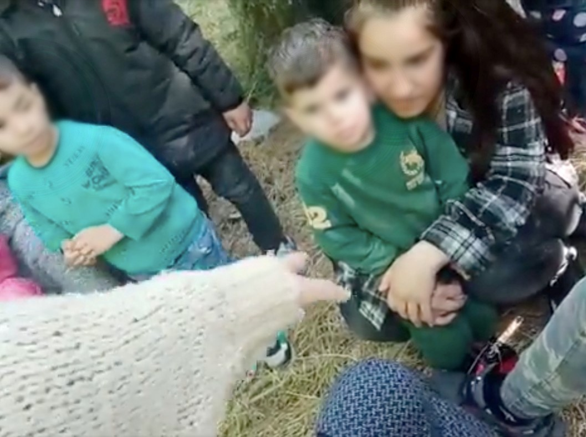
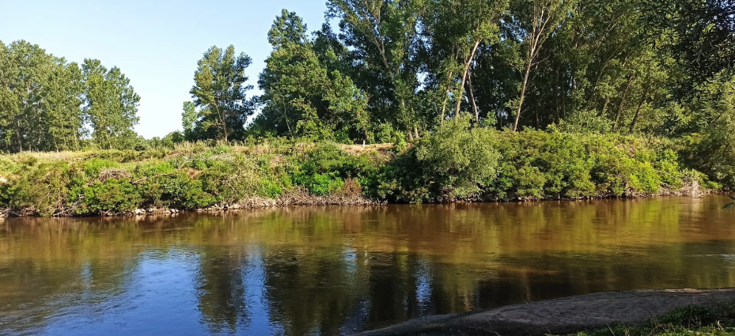

### AYS Special from Greece: Human rights defenders targets of defamation and media smear campaigns
#### Since the election of the right\-wing Nea Demokratia party in 2019, the promulgation of the International Protection Act \(IPA — L\. 4636/2019\) and the events that unfolded at the Evros border in March 2020 when Erdogan [“opened the doors”](https://www.nytimes.com/2020/02/29/world/europe/turkey-migrants-eu.html) to Europe, the rule of law in Greece has been subject to coherent and systematic erosion\.

Photo: BVMN
### EU hinting a potential non\-reimbursement due to violent pushback, but…

The mass proliferation of human rights abuses at the land border between Greece and Turkey has become commonplace, with field reporters from the [Border Violence Monitoring Network \(BVMN\)](https://www.borderviolence.eu/) recording 163 testimonies pertaining to the Evros land border since the summer of 2019, relating to the experience of approximately 10,800 individuals\.

> Over the last week, two investigations have revealed mounting evidence of pushbacks and border violence in Greece 

Over the last week, two investigations have revealed mounting evidence of pushbacks and border violence in Greece, which has seen increasing pressure on both State officials — to acknowledge and disavow these practices — and on the European Commission, to commence non\-reimbursement of funds until rule of law is restored\.

Commissioner Johansson seemed to publicly respond to these demands after [meeting with Greek ministers](https://www.aljazeera.com/news/2022/6/30/eu-tells-greece-to-stop-violent-deportations-of-asylum-seekers) two days ago \(30/06/2022\), after which she called on Greece to stop [“violent and illegal deportations”](https://twitter.com/YlvaJohansson/status/1542480771126018049?s=20&t=shzV0e4QwOBJS0MkTTTasg) and hinted at a potential non\-reimbursement stating that EU funding [“is linked to EU fundamental rights being correctly applied\.”](https://twitter.com/YlvaJohansson/status/1542480772766076928?s=20&t=shzV0e4QwOBJS0MkTTTasg)

**Her tweets also revealed that Greece has committed to a new system to safeguard fundamental rights to be in place by 1 September 2022, but no further details about this system were given\.**

This comes after the [shambolic release](https://www.politico.eu/article/greek-transparency-agency-report-data-breach-migration-european-commission/#:~:text=ATHENS%20%E2%80%94%20Greece's%20National%20Transparency%20Authority,in%20an%20embarrassing%20data%20breach.) of the National Transparency Authority’s investigation into pushbacks last month which saw failed redactions prove that the majority of interviews were carried out with border officials\. However, there are a number of interlocking issues in the current state of play in Greece that need to be addressed in order to ensure that fundamental rights guarantees are being upheld\.

In November 2021, the Greek government issued a [Circular](https://migration.gov.gr/en/diadikasia-ypovolis-aitimaton-asyloy/) which terminated the Skype pre\-registration system and mandated that all new arrivals seeking to lodge an application for international protection should do so at Reception and Identification Centres \(RICs\) \. On the mainland there is one sole RIC, Fylakio, which is located 20 km from the notorious Evros border\.

BVMN has taken [testimonies](https://www.borderviolence.eu/violence-reports/january-29-2022-0900-neo-cheimenio-elcili/) from individuals who have been illegally pushed back from Fylakio as a direct result of requesting access to asylum procedures\. Furthermore, Fylakio does not accept people walking in by themselves to apply for asylum, nor has the capacity for more than 282 people\.

Another possibility is for individuals seeking international protection to present themselves to the authorities to get a police note in order to register their asylum claims \( _see Mobile Info Team [report](http://www.mobileinfoteam.org/blockedfromthesystem)_ \) \. Yet, police notes are inconsistently distributed by police in Thessaloniki, and people live in well\-founded fear of the authorities due to the prevalence of pushbacks\.

> This leaves many people undocumented for extensive periods of time despite their efforts to register their asylum claims, exposing them to arrests and subsequent detention or pushbacks as a result\. 

### Arrests and arbitrary detention

Since 2020, BVMN has been recording arrests taking place in the city and its surrounding areas, with people being driven to the border with Turkey and subsequently pushed back\. BVMN has equally recorded instances of pushbacks of people detained in administrative detention sites\. As this has been unfolding, the Greek state has concurrently launched [operations targeting people\-on\-the\-move](http://www.astynomia.gr/index.php?option=ozo_content&lang=%27..%27&perform=view&id=109858&Itemid=2808&lang=) \(POM\) in [Athens](https://www.borderviolence.eu/balkan-regional-report-march-2022/#more-20102) and [Thessaloniki](https://www.borderviolence.eu/wp-content/uploads/Press-Release-Thessaloniki_3004.pdf) since March 2022, which has lead to the arbitrary arrest and detention of over 600 POM, many of whom have been unable to access the asylum system due to the aforementioned developments in asylum procedures in Greece\.

A number of civil society actors and [international human rights institutions](https://www.ohchr.org/en/documents/thematic-reports/ahrc5031-human-rights-violations-international-borders-trends-prevention) have expressed their concern at the unfolding regime of containment, control, and illegal pushbacks in Greece, reiterating the State’s obligations to act in full respect of EU law, the Charter of Fundamental Rights and the 1951 Refugee Convention\.

**Over the last two weeks, two investigations have been published which contribute to an extensive body of evidence that has been documenting systematic violations of fundamental rights at the Greece\-Turkey land border\.**

Photo: BVMN

On Tuesday \(28/06\) a joint publication between [Lighthouse Reports](https://www.lighthousereports.nl/investigation/we-were-slaves/) , [Der Spiegel](https://www.spiegel.de/international/europe/systematic-abuses-at-eu-external-border-greek-police-coerce-refugees-to-commit-illegal-pushbacks-a-32988662-06c8-420d-a2c9-fde426bef1b1) , [Le Monde](https://www.lemonde.fr/en/international/article/2022/06/28/video-investigation-into-the-greek-police-s-use-of-slave-migrants-to-push-back-other-migrants_5988235_4.html) and [the Guardian](https://www.theguardian.com/global-development/2022/jun/28/greek-police-coerce-asylum-seekers-pushbacks-migrants-turkey?CMP=Share_iOSApp_Other) revealed details about the phenomenon of third\-country nationals \(TCNs\) being coerced into enacting brutal violence against transit groups apprehended at the Evros border and operating dinghy boats to push them back into Turkish territory\. The individuals who testified as to their experience reported that they were held in cells, brought out at night to perform these illegal operations, and compensated by being allowed to take their pick of the belongings confiscated from members of the transit groups\.

This reflects a trend that BVMN [has been documenting](https://www.borderviolence.eu/wp-content/uploads/Working-Doc-August-Report-BVMN-2.pdf) through testimony collection since 2020 and spoke to in a recent [Al Jazeera article](https://www.aljazeera.com/features/2022/6/17/greece-accused-of-using-migrants-to-push-back-other-migrants) on the topic where Policy Analyst, Hope Barker, called the trend a “well\-known secret” in the Evros region\.

> …held in cells, brought out at night to perform these illegal operations, and compensated by being allowed to take their pick of the belongings confiscated from members of the transit groups\. 

### People used to carry out the dirty work of pushbacks, thus protecting Greek border officials

Indeed, the Spiegel article quotes local residents calling the practice an “open secret”, saying that POM are not seen in Evros, “except for those who work for the police”\. The investigation illuminates what actors on the ground have known for some time, that POM are being used to carry out the dirty work of pushbacks, protecting Greek border officials from reprisals by Turkish authorities on the other side of the border\.

Just a few days after these reports were published across international media outlets, BVMN [released an investigation](https://www.borderviolence.eu/20548-2/) that documents the increasing use of Rule 39 measures to ensure secure access to international protection for asylum seekers in the mainland\. The report details three case studies whereby transit groups were stranded on islets in the Evros river, and sent out distress calls to state and civil society actors who responded by filing for interim measures at the European Court of Human Rights \(ECtHR\) \.

Photo: BVMN

Despite all three cases receiving positive indications from the Court, as well as there being extensive public documentation on social media platforms and in news outlets, all three groups were reportedly pushed back to Turkey by Greek authorities\. Additionally, two of the groups mentioned TCNs being involved in the pushbacks, building on the evidence brought in the reports detailed above\. The actions of the Greek state in these incidents entail **violations of Articles 2, 3 and 4 of the European Convention on Human Rights, Articles 4, 18 and 19 of the European Charter of Fundamental Rights, the core principle of _non\-refoulment_ , the Asylum Procedures Directive, the Reception Conditions Directive and the Return Directive** \.

Across these islet cases there have been five deaths, most recently of [a four\-year\-old boy](https://www.humanrights360.org/a-positive-outcome-of-the-case-of-the-30-syrian-refugees-confined-on-the-islet-of-evros-river/) who lost his balance and fell off the boat during the pushback, and of [a woman](https://www.efsyn.gr/ellada/dikaiomata/340820_kamia-kinitopoiisi-gia-toys-egklobismenoys-prosfyges-toy-ebroy-para-tin) who has left on an islet without access to lifesaving dialysis medication, despite the Greek authorities having information about her health condition and her exact coordinates\.

Both of these investigations illuminate a process whereby groups are either pushed back to small islets in the Evros river or are stranded on them upon entering and seeking to lodge an application for international protection, subsequent non\-action on the part of the Greek state leaving groups of asylum seekers without access to food, water, medical care, or asylum procedures, and then Greek authorities coercing other POM to violently push these groups back to Turkey\.

This is evidently an illegal and brutal system that has no basis in international human rights law and no justification through the argument of securing the EU’s external borders\.

> …an illegal and brutal system that has no basis in international human rights law and no justification through the argument of securing the EU’s external borders\. 

### Defamation and media smear campaigns by the State actors

Since the election of the Nea\-Demokratia party in 2019, there has been an increasingly prevalent and worrying [phenomenon of criminalisation](https://www.borderviolence.eu/criminalisation-report-accused-of-solidarity/) of both POM and migrant rights defenders\. In particular, BVMN has witnessed a clear pattern of defamation and media smear campaigns, instigated by State agencies in Greece, depicting CSOs as ‘smugglers’ who have directly acted as a ‘pull\-factor’ for people to travel to state territory and receive their aid\. This tactic has been directly employed in response to the recent use of interim measures by CSOs, as they attempt to ensure that transit groups who are stranded on islets in the Evros river have full access to their fundamental rights and the Greek asylum system\.

On 29 May 2022, and following a series of such interim measure cases, an [article](https://www.dikaiologitika.gr/%20eidhseis/koinonia/387291/evros-kleidomenes-apo-tis-%20arxes-tesseris-mko-%20gia-perierga-kolpa-me-metanas-%20tes-sto-potami) was released in Greek news outlet D News, leaking information that four CSOs, who are “active in Evros”, are being targeted in an investigation by the Greek authorities for knowing the coordinate locations of transit groups stranded on islets in Evros\.

A second [article](https://www.real.gr/politiki/%20arthro/4_gkrizes_mko_stelnoun_metanastes_ston_ebro-%20838138/) was published on 6 June 2022, accusing CSOs of being responsible for the increase in migration flows at the Greek\-Turkish land border in the first five months of 2022\. It further states that the Greek services are already taking preventative measures to ‘closely monitor’ the four CSOs who are being investigated, in order to contribute to ‘more effective guarding of the Evros border’\.
### Human rights defenders considered a security threat

This discourse falls into the age\-old narrative whereby POM and migrant rights defenders are considered a security threat, legitimising the use of surveillance technologies to monitor borders and CSOs\. This is particularly disturbing following the [recent allegations](https://www.independent.co.uk/topic/allegations) of a journalist’s phone being infected with advanced spyware in 2021\. Criminal allegations also contribute to fear\-mongering and decreasing public support for HRDs, thus exposing CSOs to reductions of funds, resources and safe civil society spaces, as well as the potential for a formal investigation\.

After a recent country visit to Greece \(June 2022\), UN Special Rapporteur on the situation for HRDs, Mary Lawlor, acknowledged the detrimental impact of smear campaigns used to target migrant rights defenders\. In her [press release](https://srdefenders.org/greece-migration-policy-having-suffocating-effect-on-human-rights-defenders-says-un-expert-press-release/) , she expressed grave concern at the “suffocating effect” on civil society in Greece,

> “particularly those who are supporting migrants, refugees and asylum seekers and who are targeted by hostile comments, including by key stakeholders in the government\. They are described as traitors, enemies of the state, Turkish agents, criminals and smugglers and traffickers\.” 

At the end of 2020, AYS published [a special](ays-special-from-greece-the-evros-border-a-shocking-year-of-systematised-violations-fad0f7eb48fb) that detailed the marked deterioration of the situation at the Evros land border across a year of shocking systematised violations\.

It ended by saying, “reporters in the region have continued to accumulate evidence, and continued to be met with point\-blank denial by Greek authorities, or entirely ignored by the European Commission”\. The state of play in 2022 is far worse with technologies of control and manipulation at the land border further developed, the architecture of pushbacks further entrenched, and the backlash against civil society actors further enhanced\.

**If the rest of the year continues along with this trend, we risk seeing the Greek state fall into a position where the rule of law is entirely eroded\.**

_Written by our BVMN network activists_

**Find daily updates and special reports on our [Medium page](https://medium.com/are-you-syrious) \.**

**If you wish to contribute, either by writing a report or a story, or by joining the info gathering team, please let us know\.**

**We strive to echo correct news from the ground through collaboration and fairness\. Every effort has been made to credit organisations and individuals with regard to the supply of information, video, and photo material \(in cases where the source wanted to be accredited\) \. Please notify us regarding corrections\.**

**If there’s anything you want to share or comment, contact us through Facebook, Twitter or write to: areyousyrious@gmail\.com**

_Converted [Medium Post](https://medium.com/are-you-syrious/ays-special-from-greece-human-rights-defenders-targets-of-defamation-and-media-smear-campaigns-2db92bc6c791) by [ZMediumToMarkdown](https://github.com/ZhgChgLi/ZMediumToMarkdown)._
