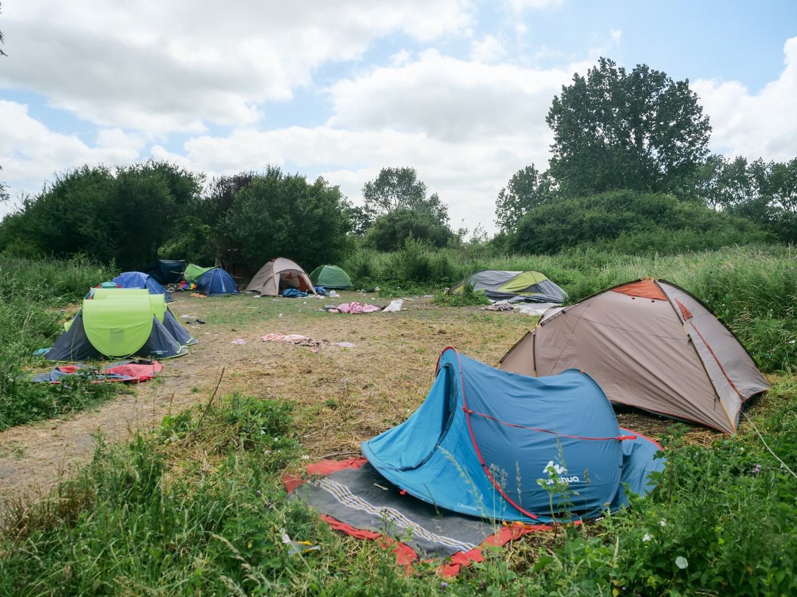
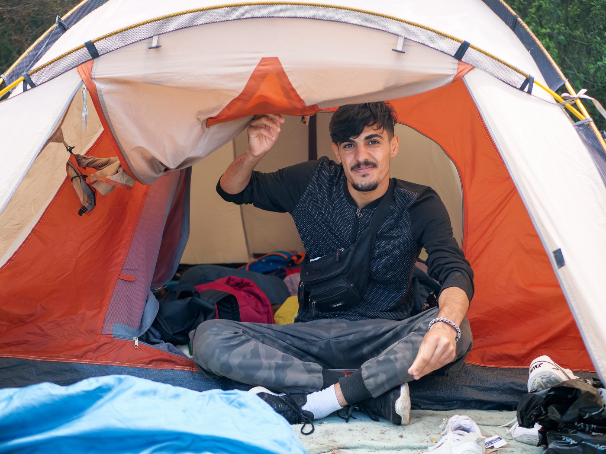
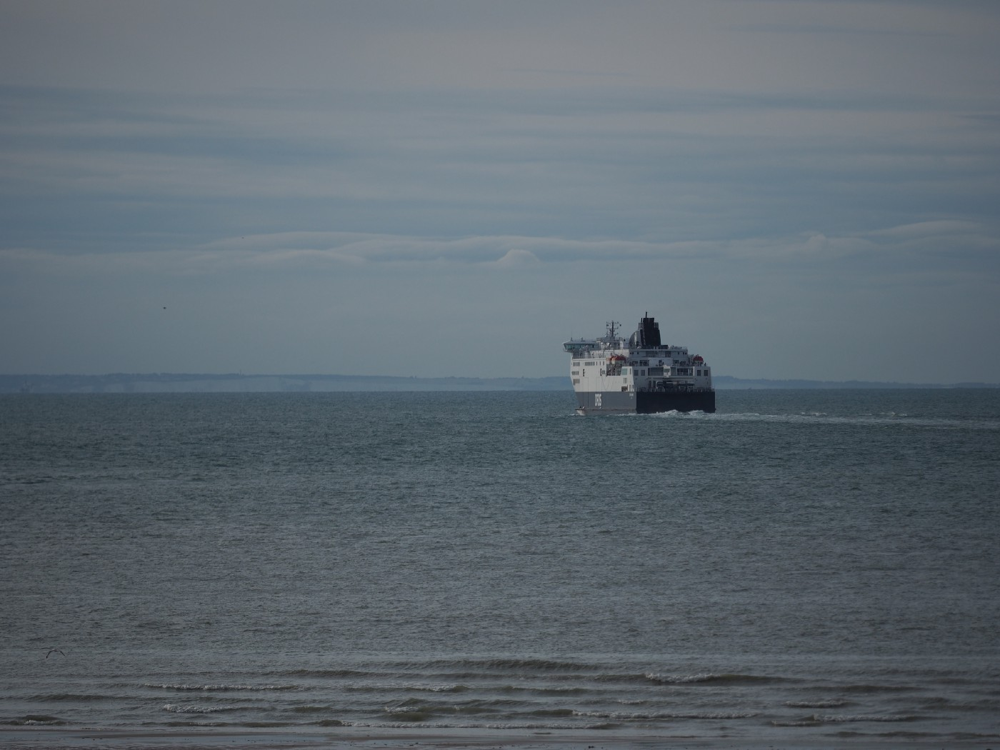
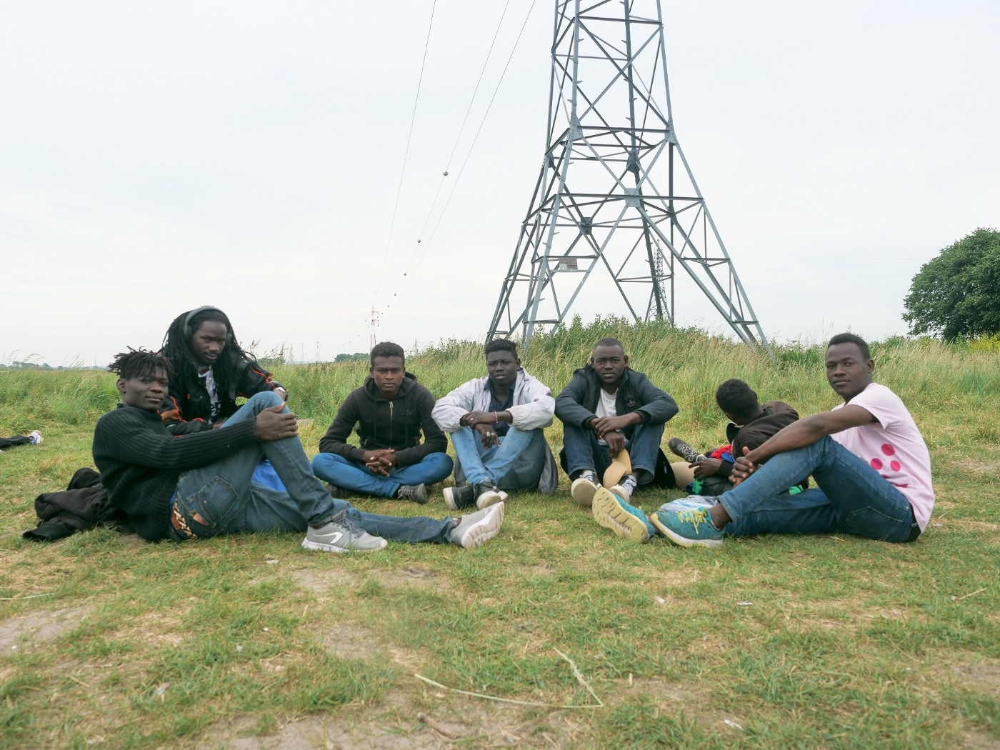
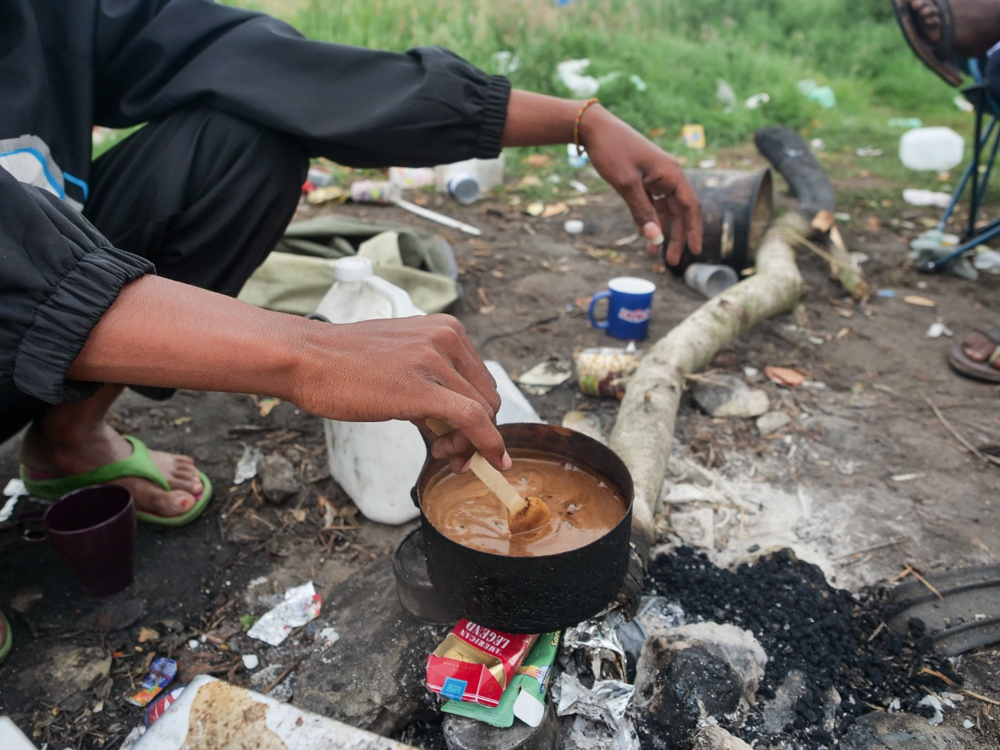
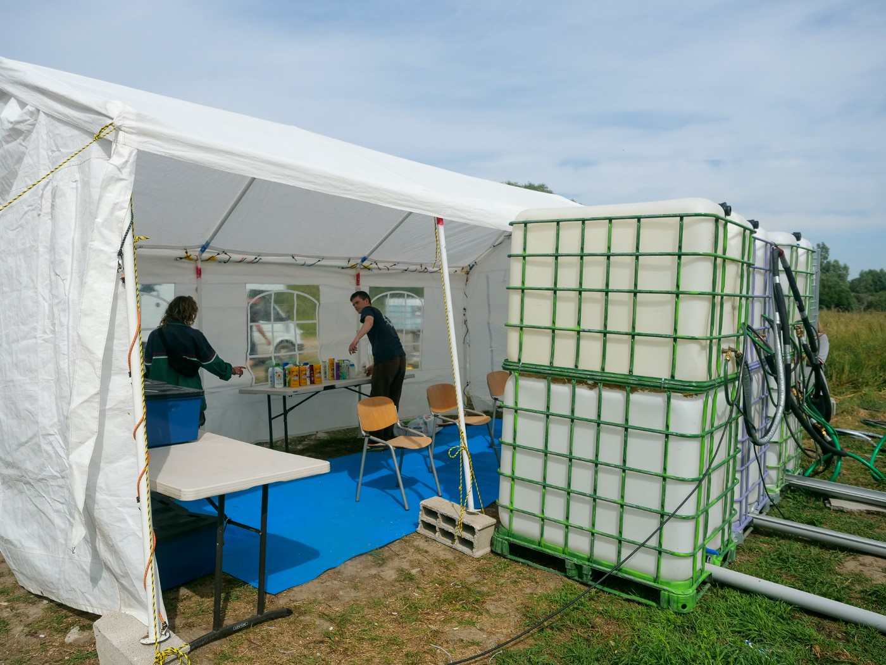
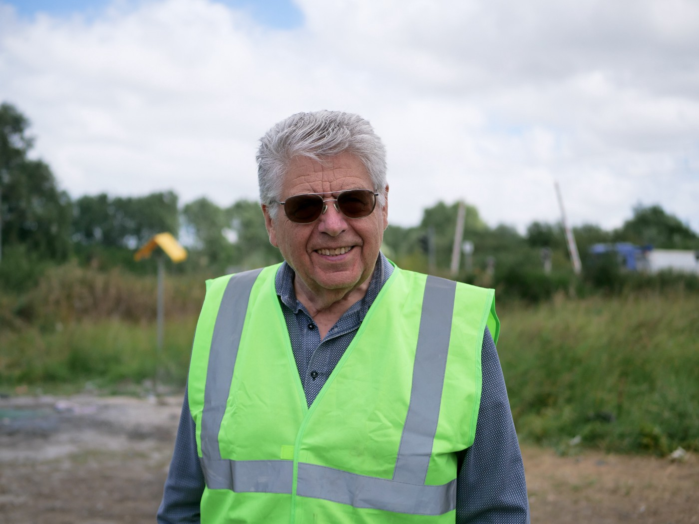
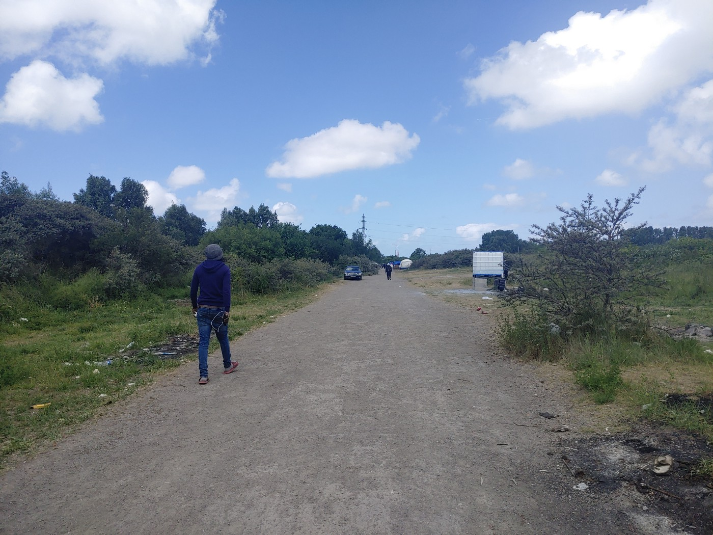

### AYS Special from Dunkirk and Calais: The British dream is still present
#### Despite the UK’s plans to deport new arrivals to Rwanda, more than 1000 people gather in Calais and Dunkirk hoping to cross the channel from Northern France\.

The tent site where Arian stays\. Photos: Niklas Gollitschek

Deep inside the small green area, between bushes, trees and grass, a circle of tents pops up\. It’s what Arian, 22, and his two brothers, one of them 11 years old, call their temporary shelter in Dunkirk —down the country road from Grande\-Synthe to Loon Plage, next to a railway track\. Similar to Calais, another port city in Northern France, more than 1000 people try to make their way to the UK\.

Some 40 people are living in this corner alone, explains Arian\. “These are new people here, because one group left to the UK,” he adds\. That’s how it goes here: one group leaves, another one is coming\. They come from Kurdish Iraq, like Arian and his siblings, Afghanistan, Georgia, Albania\. “Every country is coming here,” he says and laughs\. More serious is that they are all waiting to go on a vessel and try the crossing\. Arian already did\. “My boat broke, the oil finished,” he says\. They were rescued by a French ship and brought back to Calais\.

Arian shares his tent with his brothers\.

But even if he and his brothers succeed, the future remains uncertain\. The UK government wants to deport new arrivals to Rwanda to process the asylum applications\. In June the European Courts for Human Rights \(ECHR\) stopped the first flight at the last minute, stating concerns of human rights violations of this scheme\. However, the Johnson cabinet is working on a solution to ignore this ruling — and international law: the bill of rights\.
#### Rwanda is just part of a much bigger problem

Clare Moseley, founder of the charity Care4Calais, is still shocked about what’s going on in the UK\. She doesn’t only refer to the decision makers, who want to implement this practice\. But even more the British courts, who have decided in favour of it, before the ECHR intervened\. “It’s the fact that the judges in the UK decided to kind of ignore the law,” she says frustrated\. They shouldn’t have lost as the evidence was “really good and the law was on our side”\. So the judges decided to make politics themselves, Moseley concludes\. A signal she considers scary and frightening\.

A ferry heading to Dover in 2018\.

The Rwanda issue is only one point of a much bigger scheme, “because the rest of the nationality and borders act is actually even more scary than Rwanda and the rest of it will all hinge on that point about discrimination against refugees because of their method of arrival,” Moseley explains\. Because the key fact is that the UK wants to deny people asylum, if their arrival is considered illegal\. Care4Calais is fighting a much bigger fight than just the Rwanda cases\. With repeated propaganda and even false facts stated in parliament, the government made people believe that this is legit\.

> “We want a normal life\.” 

After the government announced the Rwanda plan, many people had left Calais and Dunkirk, Arian recalls\. But they are coming back these days, often with the false assumptions that the ECHR ruling stopped the whole scheme\. And after having seen war and violence, crossing the desert and sea, been tortured in Libya or beaten on the Balkans, the dream of making it to the UK is still strong\. “First of all, we want to go the UK because of the language\. Second, the situation of refugees is better than in France or Italy\. We want a normal life and we see it in the UK,” Abdalwhab, who left Sudan four years ago, explains\. Others are even joking that Rwanda would be a nice place and they’d have the chance to visit their families again\.

Abdalwhab \(left\) has been on the move for almost four years\. Recently his group arrived in Calais\.

Even if they were not so keen on the UK, there are other problems in asking for asylum for example in France\. Abdalwhab was already fingerprinted in Italy, and Arian in Bulgaria\. “Lampedusa is too hard, man, you can’t handle it”, says Abdalwhab\. Arian says he was beaten, robbed and arrested by border guards in Bulgaria when he crossed the border\. So how should he consider it to be safe for him? “I’m not going to this country,” he says and adds, that he even tried to ask for asylum in France\. “I like this country, it’s beautiful and the people are good,” he says, although his parents live in the UK\. But when authorities took his fingerprints, they saw he was already registered in Bulgaria and would send him back there according to the Dublin III agreement\.
#### UK as a second chance

This also applies to people whose asylum application in other European countries has been rejected and who face deportation to their country of origin\. Hence, in Calais and Dunkirk the term “Dublin” became a trigger word even among those, who don’t speak good English\. As soon as it drops, the whispering starts\. Since Brexit, the UK is not part of the Dublin agreement anymore and therefore considered as a second chance for asking asylum in Europe — if they manage to cross the channel\.

While the “Dublin” is well known among the people in Calais and Dunkirk, they often lack enough information, for example with the impact of the ECHR ruling\. The Refugee Info Bus is trying to fill this gap\. Volunteers gather any important information and provide it in several languages by handing out the “New Arrival Guide” \(NAG\) \. This is how people in Calais and Dunkirk know which services are provided by NGOs and the state\. “Apart from that, we try to give people basic information on procedures of asylum in France and other countries,” volunteer Beatrice Basso explains, underlining that this is not legal advice\. Additionally, the Info Bus shares the most important facts with other volunteers and organizations in the field\. When the team visits different spots in Calais, it also provides free WIFI and phone charging stations and SIM cards — including a monthly top\-up — for the people there\.
#### French state withdraws humanitarian help

As the attention moved to the UK’s policy and the Rwanda plans, the situation in Calais has worsened recently\. “Now the state completely stopped giving food and water\. They removed toilets from a living site after a big eviction, even if a small number of people is still there,” Basso gives one example\. Evictions happen almost every second day leaving the people without any chance to settle a bit, meaning sometimes they will lose the very last of their belongings and documents\. Basic services are mainly brought from NGOs and volunteers\. “The state provides water in three main places in Calais,” Basso explains\. In Dunkirk it is also up to volunteers to refill the big water containers, providing up to 10,000 litres on hot days, or set\-up mobile showers\.

Volunteers from MRS set up mobile showers in Dunkirk\.

Guy Dequeker from Lille has been volunteering in Northern France for 15 years, and nowadays he is distributing warm meals with the NGO Salam\. When his wife, Regine, organizes the queue and hands out the spoons, people greet here with “Bonjour Mama”\. Some 300 meals are served here daily, mostly cooked and donated by locals and local businesses\. “I don’t agree with my country,” the 81\-year\-old criticizes the lack of state support for the people here: “Our country is not doing it, we do it\.”

Guy Dequeker has been volunteering in Northern France for 15 years\.
#### Criminal networks rule the business in Dunkirk

Especially in Dunkirk this absence makes it easy for smugglers to expand their criminal business\. In May a shooting in the camp between rival groups scared residents and volunteers\. It’s no secret, that if a Mercedes drives along the dust road, who is inside\. Arian wouldn’t dare to enter a boat here without a smuggler\. “If you go by yourself, the smuggler will shoot you, kill you,” he says\. Smugglers have divided the different parts of the coast amongst them, being in charge for their territory\. After he left Kurdish Iraq to avoid getting involved in clan fights, he now finds criminal network structures in Northern France\. One day, when the sea is calm and the smuggler gives the green light, he hopes to reunite with his parents and live a normal life in the UK, and to not be deported to Bulgaria or Rwanda\.

A Mercedes parked at the road\.

**_Written by AYS team member and contributor Niklas Golitschek_**

**Find daily updates and special reports on our [Medium page](https://medium.com/are-you-syrious) \.**

**If you wish to contribute, either by writing a report or a story, or by joining the info gathering team, please let us know\!**

**We strive to echo correct news from the ground through collaboration and fairness\. Every effort has been made to credit organisations and individuals with regard to the supply of information, video, and photo material \(in cases where the source wanted to be accredited\) \. Please notify us regarding corrections\.**

**If there’s anything you want to share or comment, contact us through Facebook, Twitter or write to: areyousyrious@gmail\.com**

_Converted [Medium Post](https://medium.com/are-you-syrious/ays-special-from-dunkirk-and-calais-the-british-dream-is-still-present-85d1fe6b8989) by [ZMediumToMarkdown](https://github.com/ZhgChgLi/ZMediumToMarkdown)._
