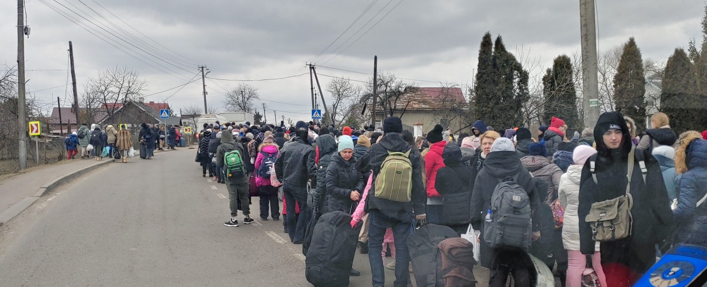
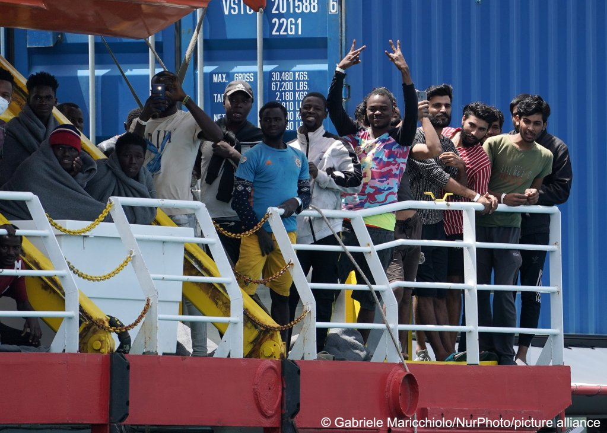
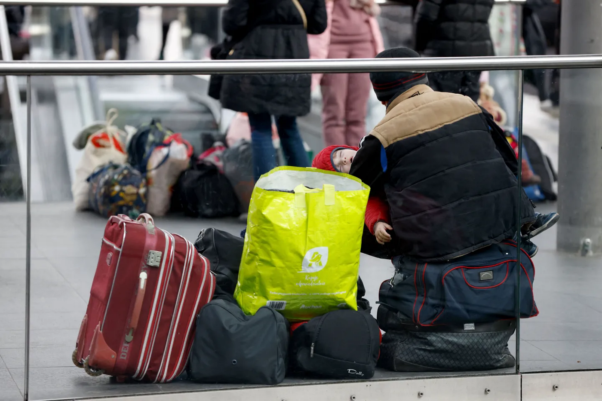

### AYS Digest 15/7/2022: 5\.8 million Ukrainians displaced in 4 months
#### Attack on people on the move in Belgrade, police violence in Subotica // Greek authorities tortured 32 people on Kos // **Ireland is running out of room for Ukrainians**

Impressions from Shehyni at the Ukraine\-Poland border in March 2022\. Photo: Niklas Golitschek

**UKRAINE**

**More than 5\.8 million Ukrainians displaced in the last four and a half months**

Within this figure, 1\.6 million people have entered the Russian Federation, with limited accessibility to NGO support, while 3\.6 million have sought protection in the EU, under the unprecedented Temporary Protection Directive\.

The movement of people is complex, however, as many Ukrainians passed through Poland to go west but have now returned to Poland\. Others have also been travelling back and forth to Ukraine to visit loved ones\. By late May and the beginning of June, the rate of people returning had slightly outweighed those leaving\. There are several reasons why this is happening, but some of the main ones are: certain areas in the West of Ukraine are currently considered relatively safe; people are running out of money and resources; many people did not expect the war to last this long and want to visit their family and friends who are forced to stay in the country\.

You can read the full article here: [The New Humanitarian \| Ukraine: Snapshots of a refugee crisis in flux](https://www.thenewhumanitarian.org/news-feature/2022/07/14/Ukraine-snapshots-of-a-refugee-crisis-in-flux?fbclid=IwAR07Gvl5I5flqOVff4F_xzjhMtId1xhE4J1GcAwv0DoK3BCFzegEjorPwXU)

**SERBIA**

A group of up to 30 people has attacked people residing in the Luka Celović Park in the centre of Belgrade\. Info Park [demands](https://rs.n1info.com/vesti/info-park-grupa-izbeglica-i-migranata-napadnuta-u-centru-beograda) that the police investigate the case and arrest the attackers\.

Žene u crnom reports on the bad behavior of police officers in Subotica on Thursday\. They were “harassing dozens of people, unreasonably holding them in an unnatural position, kneeling or sitting on the ground, with their heads bowed and hands on the back of their heads,” the group writes\. The police argued they had found illegal objects\. However, the number of objects does not justify the big number of people being harassed, the volunteers note\. They ask authorities to take action against such discrimination\.

**FRONTEX**

Frontex has stated that they will end their border surveillance support in Lithuania\. This move follows a European Court ruling in late June that criticised Lithuania’s legislation approving mass detention of asylum seekers\. Aija Kalnaja, the acting FRONTEX executive, stated that the move was unrelated to the court ruling, however, and that more personnel is needed in the Mediterranean at this time\.

[Frontex ends Lithuania border surveillance operation \(euobserver\.com\)](https://euobserver.com/migration/155523?fbclid=IwAR2zK8sI38EVp8lXVMtFYzMs8MzXPEj-qq5u0Zeg7r1cMc9Vjg9RFPkhG3I)

**GREECE**

Aegean Boat Report [documente](https://aegeanboatreport.com/2022/07/14/32-refugees-tortured-on-kos-held-captive-for-12-hours-by-greek-authorities/?fbclid=IwAR2ZQ5lMrqoegsL5qTVYX3yJL1yiDn624GAvpyhs5ZV_iGGGLmC25aG5A9U) d how 32 people had been tortured and held captive for 12 hours by Greek authorities upon arrival on Kos at the end of June and finally got pushed back\. “At gunpoint everyone was ordered to hand over all belongings, bags, money and papers\. The men were separated from the women, handcuffed and forced to lie down on the floor in a separate room, those who refused was severely beaten,” ABR writes, relying on several testimonies from the group\. During the 12 hours neither food nor water was provided\. Later they were forced to go on a ship, presumably owned by the Greek Coast Guard, and board small vessels to go back to Turkey\. The Coast Guard there rescued people from the open sea\.

**Forensic Architecture/Forensis has published a new report on pushbacks taking place in Greece**

They found over 1000 cases, involving 27,464 people, between March 2020 and March 2022\.

[Investigation reveals illegal ‘drift\-backs’ in Greece \(euobserver\.com\)](https://euobserver.com/tickers/155552)

**MOROCCO**

AMDH Nadoor published footage from June showing people deported from Nador being expelled from Casablanca\.

On June 24, up to 37 people died trying to cross the land borders at Melilla and Ceuta\. The Harvard Law Blog analyses the situation at the border and the spike of crossing attempts\. It highlights the high recognition rate in Spain especially of Sudanese poeple asking for asylum there: “Another known fact is that the only way that people currently have to seek refuge in Spain is by crossing the border, since it is impossible to access the office located on the Spanish side in any other way\.”

[**Tragedia en Melilla: Asfixiados Por La Lógica Securitaria De Las Fronteras \| Oxford Law Blogs**](https://blogs.law.ox.ac.uk/blog-post/2022/07/tragedia-en-melilla-asfixiados-por-la-logica-securitaria-de-las-fronteras?fbclid=IwAR1SROqEG7TpJuupxeC-RUOeWurO-ZTKzunWLJopjj6BXU0Lb0OPLzRxDj0)

**ITALY**

**Infomigrants has published a list of abbreviations for asylum seekers:**

[**Terms and acronyms that asylum seekers need to know in Italy — InfoMigrants**](http://www.infomigrants.net/en/post/41893/terms-and-acronyms-that-asylum-seekers-need-to-know-in-italy?fbclid=IwAR36Ay6wYnqO03cmnNHTZu98V85_yqvX9TecisY7tlAgVHhv9EVBFbgedZg)

**GERMANY**

[No chance of a chance stay in Bavaria \(fluechtlingsrat\-bayern\.de\)](https://www.fluechtlingsrat-bayern.de/in-bayern-keine-chance-auf-chancen-aufenthalt/?fbclid=IwAR3Pez4Co8o9BSCA6c3QuXjD2cUmgq9gQN_n_ZwGwOfG1wTlvHZuKJd60S8)

**IRELAND**

**Ireland is running out of room for Ukrainians**

The government announced that its network of emergency accommodation sites is now full, leaving newly arrived Ukrainian refugees to sleep on the floor or benches in Dublin airport\.

The Irish army is planning to build a makeshift tent city north of Dublin for new arrivals\.

The Irish Prime Minister, Michael Martin, stated that their asylum system has seen an increase in applications from African and Middle Easten asylum seekers who fear being deported to Rwanda through the UK’s new policy\. As a result of this increase, there is no longer enough accommodation for everyone trying to seek asylum in Ireland\.

[Ireland runs out of rooms for Ukrainians — and blames UK’s Rwanda policy — POLITICO](https://www.politico.eu/article/micheal-martin-ireland-ukraine-war-refugees-uk-rwanda-policy/?utm_source=Twitter&utm_medium=social&fbclid=IwAR153kHaFLWQAD41QSx0pOiCSQmuEfNdiUb70b1tSWLBfF52JUoVHMr2N1E)

**Find daily updates and special reports on our [Medium page](https://medium.com/are-you-syrious) \.**

**If you wish to contribute, either by writing a report or a story, or by joining the info gathering team, please let us know\!**

**We strive to echo correct news from the ground through collaboration and fairness\. Every effort has been made to credit organisations and individuals with regard to the supply of information, video, and photo material \(in cases where the source wanted to be accredited\) \. Please notify us regarding corrections\.**

**If there’s anything you want to share or comment, contact us through Facebook, Twitter or write to: areyousyrious@gmail\.com**

_Converted [Medium Post](https://medium.com/are-you-syrious/ays-digest-15-7-2022-5-8-million-ukrainians-displaced-in-4-months-26500d6ee63b) by [ZMediumToMarkdown](https://github.com/ZhgChgLi/ZMediumToMarkdown)._
