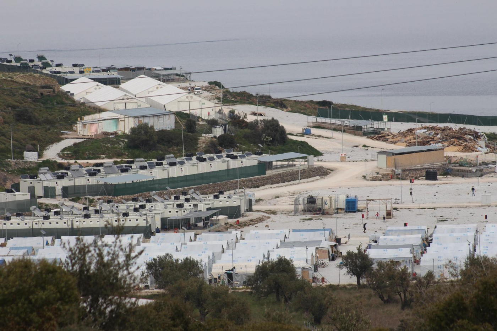
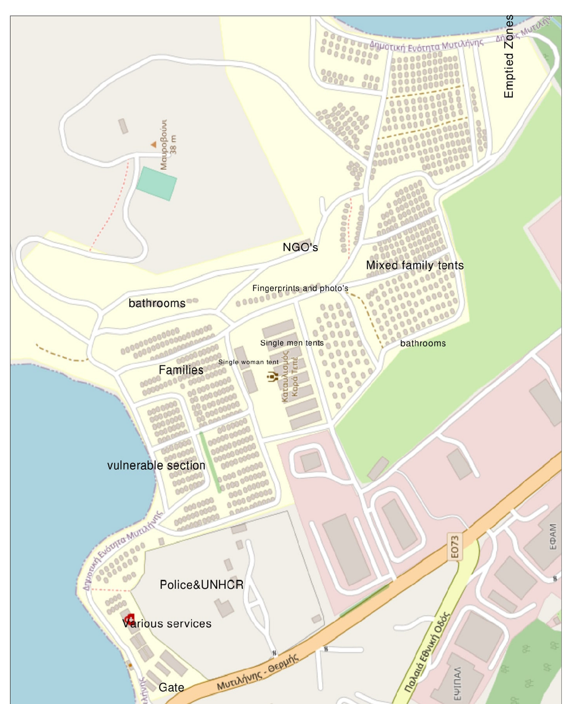
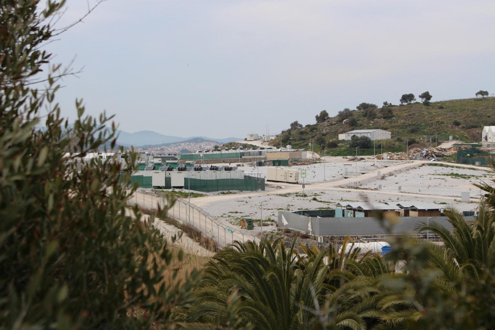
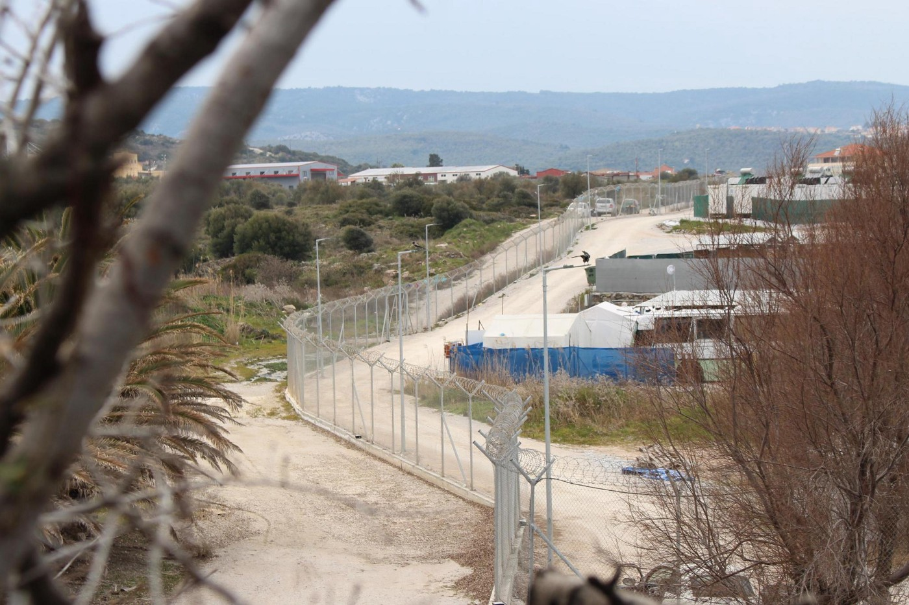
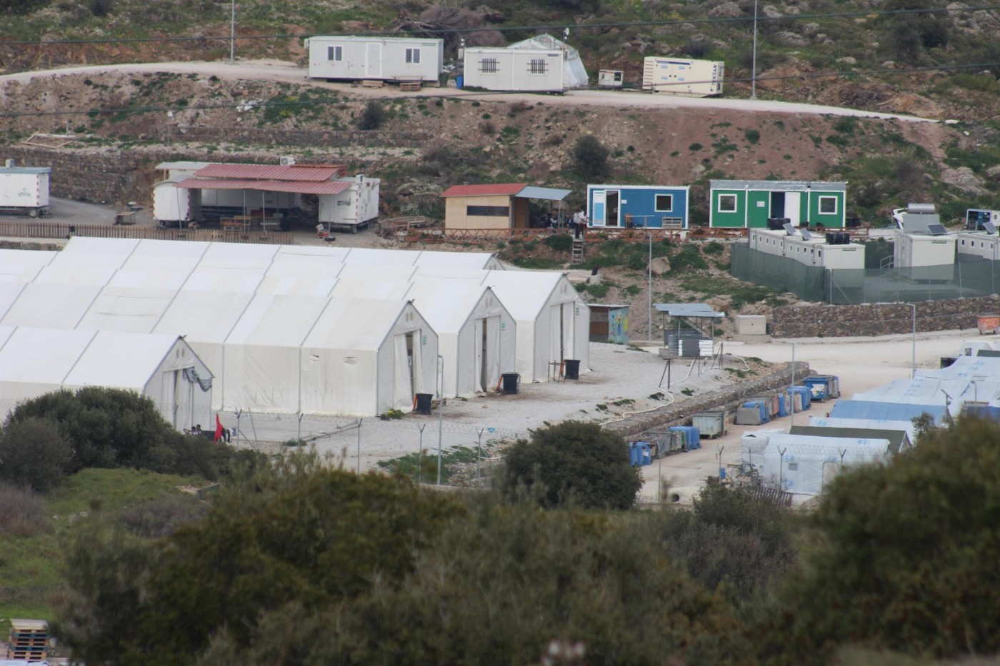

### AYS Special from Greece: What is happening in the Mavrovouni camp on Lesvos?
#### **The following article was written by volunteers from different collectives on Lesvos in close collaboration with multiple people on the move after they expressed a strong desire to share their experiences\. For them, it is important that you, the reader, know what is going on inside Mavrovouni camp on Lesvos\. And not only to know but to take action\.**

> _“Police also doesn’t respect refugees\. A family wanted to bring dinner to their family in quarantine, from jail to jail — ‘Time is finished, yes or no, are you listening, yes or no, do you understand, yes or no’_ 

> _\(If\) The police understand that they want to give food, why do they not allow it_ \.” 

Mavrovouni was established in 2020 after Moria famously burned down in a fire\. It took the authorities six days to claim the former military site as a supposed “temporary” facility that was quickly built with the international support of UNHCR and some NGOs\.

This camp is not a place that is generally in the media spotlight\. It is however as bad as the previous detention facility on Lesvos was, the notorious Moria camp\. Moria was well known for its dehumanizing conditions\.

Mavrovouni is terrible in mostly different, more subtle ways\. Not a lot is known nowadays about the situation at the camp\. This is partly because of a lack of interest from the International press, but also because inhabitants are “heavily discouraged” from sharing information or footage from inside the camp\.

> Of course “heavily discouraged” means active oppression by security and police inside the camp through fines, intimidation but also outright abuse and violence\. In addition, most of the “house rules” are unclearly stated and communicated, increasing the confusion\. 

Much like the new facility on Samos, for people with interests in maintaining and continuing the status quo it is important that the illusion of peace and security \(“dignified”\) of these facilities is upheld\. With the construction of the new facility in a seemingly permanent limbo, it is likely to assume that this facility will be in use for the foreseeable future\. As you will read in the article below, changes in policy are a daily occurrence and constructions are seemingly being made to make the camp more permanent\.

### 1\. Location and description

> _“My daughter is crying every time we are going to camp\. Children understand everything\.”_ 

The camp is located approximately 10 kilometers from Mytilini, the biggest city on Lesvos\. First, let us paint you a picture of the camp\. Imagine a small area between the sea and a main road\. A concrete wall and a fence with barbed wire on top surround the Mavrovouni camp\. From the road you can only see the gate with its checkpoints, and a bus of riot police always posted next to it, and a first glimpse of the wall\. Behind it the roofs of white tents and containers are slightly visible\. But most of the fence and everything behind it is hidden between a big supermarket and a couple of warehouses\.

There are buses going six days a week in order for people to be be able to reach the city\. Currently, people living at the camp are allowed to leave the camp seven days a week during daytime, but the bus does not go on Sunday\.

The camp is divided into colored zones according to single/family dynamic, gender/sex and nationalities\. All of the families and most of the single women have been moved to containers, so\-called “ISOboxes”, only some of the single women and the single men remain in big white tents\.

These tents contain multiple “rooms”, which now two or three people have to share\. Most of the services available at the camp are located between the main gate and the entrance to the “living section”\. These services include EASOU offices for issuing asylum decisions and passports/IDs, the office of UNHCR, medical organizations, in addition to a general practitioner and a dentist, plus an office for psychological support and a small grocery shop\. The two NGOs with offices at the camp, Eurorelief and Movement on the Ground, are located farther inside the camp, between the living sections\.

There is also a facility that is indicated as being a school inside the camp, that has however been described to us as more of a daycare facility without a regular schedule\.
### 2\. Security and policing

> _“They ask for ID — I say ‘What ID? Your government is not giving me an ID’\. This is an asylum card madame”_ 

One of the major changes going from the old Moria camp to Mavrovouni is the extremely increased control of its inhabitants\. Through private security and police and with the aid of multiple checkpoints, control of the camp is tight\. And as it seems from the people we spoke to, mostly this is not to the benefit of its inhabitants\. Take for example the gate, that every single person living inside has to enter\.

Without papers stating that one is either a registered asylum seeker or working for an in\-camp registered NGO there is no chance of entering\. This also means: If a person living at the camp does not have their papers on them, or their phone with a photo of the papers dies, they cannot enter their living space\.

Besides having to provide papers one also has to stick to the opening hours of the camp\. If one arrives at the gate too late, they can be fined — police and security are stationed at the gate 24 hours a day\.

Every body and bag that enters the camp is searched\. Upon arrival one has to lay out their belongings on a table to then undergo a full body check with metal detectors\. During the searching people are often harassed and asked humiliating questions\. There are many stories of guards showing personal belongings around and laughing about them, such as contraception, hygiene
articles or underwear, or letting people wait for being searched for an unreasonably long time without any obvious explanation\.

Certain groups, like single men, are often searched more intensely than others\. For example, sometimes single men are even asked to take off their shoes\. Police stationed at the gate are often rude, disrespectful and generally demeaning when communicating with the people\.

It seems, that what exactly is or isn’t allowed to be brought into the camp is not transparent and does not only depend on security for the people inside\. Beer for example is available at the camp for €1\.50 per can, whilst alcohol is not allowed to be brought inside\. It is forbidden to bring cameras inside and phones are regularly checked, most likely for people making an attempt at documenting their living conditions\.

> “They will search you\. They search everything, and you must put everything you have on a table and they will search your bag\. Cameras are forbidden, and you can be fined €350, sometimes even €500 for that\. Sometimes they don’t find it\. It depends on the police if you are allowed to bring in alcohol or similar stuff\.” 

Checkpoints have to be passed in order to move anywhere, and NGOs like Eurorelief and Movement on the Ground play a large role in controlling and checking the inhabitants\. Eurorelief is responsible for keeping track of how many people are at the camp and where they are living\. In practice this means that people are going from tent to tent, door to door, every day, checking who is present\. Eurolief calls this the “census”\. In a similar manner, by bringing a paper to the assigned tent or ISObox, they seem to inform people when and where they have appointments\. As such, life inside the camp is tightly controlled by the police, NGOs and private security\.
### 3\. Utilities

> _“From food line only water and fruits we use, the \(cooked\) food we throw away”_ 

Besides the intense control, utilities often malfunction at the camp\. The utilities at the camp are as badly organized as they were at old Moria, despite the fact that there are many fewer people housed inside\. Electricity especially seems to be kept deliberately scarce\. Until last month, seemingly at random in some zones, electricity was available the whole day, whilst in other parts—only for a few hours\. Currently, electric power seems to be organized in yet another way\. Now, there are parts of the day where the whole camp has power and other times when it doesn’t\.

> “For example for one part they bring electricity 24 hours, but for other zones we have maybe three time a day, maybe morning, maybe lunch and for sure in the evening\. Also in the winter people stayed without electricity, so without heat\. When there is electricity available 24 hours in this part, then why not in all parts?” 

This means that in summer there is no way of cooling living spaces \(meaning tents and containers, so the heat inside is often unbearable\) and in the winter there is no means of heating them for a significant number of the inhabitants\. Also charging a phone, the only connection people have to family, information and some form of distraction is impossible for a remarkable portion of the day\.

There seems to be no clear answer as to who decides what power goes where\. The hygiene facilities available are still inadequate, despite the drastically reduced number of people at the facility\. Also education for the children is lacking and has been described more as a daycare than as an actual school, only open two to three times a week\. Education possibilities for adults are non\-existent\.

The food is, as it always has been, notoriously bad\. Often there isn’t is enough, and people who have received a second rejection are excluded from receiving food from the food line\. The food is often so bad that people throw it away or take the contents, wash them and re\-cook the ingredients themselves, especially since parts of the food, like the meat, are often undercooked\.

Cooking outside of the tent or ISO\-box is not allowed and sometimes leads to police intervention, claiming it would be a fire hazard\.

Mavrovouni from a different angle, clearly showing the spaces where the burnt down single men facilities were located\.
### 4\. Medical care

> _“It’s not hard to see a doctor \(at the camp\), but they only appear to give paracetamol\. It’s safe to say medical assistance is minimal\. Paracetamol is the only thing they give\. If they have, they give”_ 

Medical care is equally lacking\. Doctors are available, but the medical services that are provided at the camp are extremely limited and inconsistent, as a lot of the medical staff consists of short\-term volunteers\. In practice this means that from what we know, the only medicine that is reliably provided is paracetamol\.

Appointments are rarely ever given, resulting in long waiting hours that often end with being sent away to come again another day\. Referrals for seeing a doctor outside of the camp are rare, and it is very hard to go to a doctor outside without a referral\.
 
Outside, the treatment of migrants in need of medical help is often not any better and people struggle to get adequate medical care at the local hospital\. In Greece, the state of medical care is very low in general, but this goes double for migrants who in addition to being confronted with the
 structurally underfunded Greek health care system are also faced with the additional racism of some of its staff\.

> “On this island, you can’t find a special doctor for everybody\. They really don’t respect health problems\. I went to the hospital, they gave me medicine, but it was wrong\.” 

### 5\. Mental issues

> _“Psychologist said ‘Of course you can’t change the big situation, but better if you change your small situation\. Go to the gym’\. You cannot remove my mind problem, because the problem is my \[asylum\] decision\.”_ 

Between the institutional apathy, living conditions that barely fulfill basic needs and the aggressive behavior of police and security, people are constantly made to feel unwanted and precarious\. As a result of these and traumatic past experiences, many people deal with psychological problems\. Psychological care is also technically available, but seems to be on roughly the same level as the medical care\.

People who approached us to tell their story complained of extremely basic level advice they were given after sharing their stories with therapists at the camp\. Because of the limited resources available, it is impossible to provide proper mental care even when the organizations try their best\. The psychology clinic at the camp is available only in the evening between 5pm and 9pm\.

People are upset at getting advice like the above because it doesn’t really help them in any way\. For psychological care a safe environment without acute danger and with basic needs met would be needed — something the camp surely does not provide in any way, shape or form\. Rather, the opposite is the case — life at the camp is even more damaging for their mental health\.

One of the outer edges of the camp\.
### 6\. Day\-to\-day life

> _“During the night the refugees are not sleeping, also the children wake up because their parents have stress\. People are walking around, sitting, not sleeping\. All of us are sick, no one is happy\.”_ 

Daily life at the camp is often described as stagnant, monotonous and dull\. The basic schedule is dictated by the camp\. The day starts with getting in the food line for breakfast\. Before 8:30am nobody is allowed to leave the camp anyway\.

Then limited options are possible — people without papers are not allowed to work properly, though quite a few take “volunteer” positions at NGOs, which result in many working hours, often translating under difficult situations, in exchange for €20 — €100 per month in vouchers for a specific supermarket\. Besides this exploitation, there are only few opportunities to educate oneself or connect with others\.

So the day is filled with waiting for updates on the case, for the next food line, to see a doctor, for electricity, for time to pass\.

Around 8pm or 9pm the camp day officially comes to an end\. The gate is closed, everybody entering after this can be fined\. Meeting others inside the camp after these hours is difficult, the police check and break up gatherings\.

> “At night it’s difficult\. If you go to pee/pi, police can stop you\. Seeing
 

>  friends is difficult\. Sometimes the police raids all the single people tents on
 

>  a regular basis\.” 

A picture of the single men's tents\.

It doesn’t help either that the situation at the camp at night seems to differ little from old Moria\. Women are still afraid to go the the bathroom at night\. Violence is still commonplace and the police is especially present in the single\-men section\. They have multiple checkpoints around and the attitude towards the single men has been described as abysmal\.

Particular discrimination of young non\-white males being perceived as barbaric lustful individuals is an ongoing story that we have heard multiple times over the years\. It is an old racist stereotype, but a persistent one\.

_“Every refugee has a story, and it does not make sense to me that we should be selected based on factors that are not within our control\. There are a lot of organizations that work with and take care of minors and families, but none that take care of single people\. When you are a single person on this Island, nobody cares about you\.”_

But the oppressive atmosphere is in no way confined to the single\-men section only\. Abuse of power and authority is a structural phenomenon at the camp, and it strongly resembles those of any prison\. The most visible proof of this on the outside are the often arbitrary court cases that happen related to incidents at the camp such as fires\.

> “One time we try to play football, and the police come after ten minutes and told us to go back to our tent\. Parties are also not allowed, and are broken up with violence and teargas\.” 

### 7\. Asylum process

> _“It is too bad, one refugee, a new arrival, gets decision after few days, to others from Moria don’t get attention for two, three years”_ 

In addition to the general situation at the camp, the asylum process itself is a very stressful procedure for many\. The overly bureaucratic approach to processing asylum claims in Greece is well known worldwide, but the changes that are being made are exclusively for the worst\.

Since 1 January 2022, people have to pay €100 to apply after an initial rejection of their asylum claim\. And €100 is money that a lot of people just do not have\. The Greek state should in theory provide a ridiculously small allowance for people, but in practice they don’t\. People are only eligible for cash assistance if they are awaiting their asylum decision\.

> After you receive a decision, no matter if negative or positive, you will not receive any more cash support\. 

They often wait as long as possible to issue the so called “cash card” for receiving this allowance, usually until just before people are expected to receive their decision, so that they don’t actually have to pay anything\. Sadly this is only part of the problem\. The asylum process itself has often been described by people, as it has been described to us again, as an extremely dehumanizing process\. Generalizations are common and so is the impatient and uncaring staff that usually populates these offices\.

> “Asylum service is big stress for refugees\. Camp is emergency life\. They keep us waiting for many weeks, it is too bad\. If we ask for decisions, we get bad answers: ‘Why are you asking, you have to wait” “Go back to your tent, Eurorelief will inform you’ — not even checking in the computer\.” 

Adding to this is the seemingly arbitrary way in which these institutions prioritize whom to process first\. It seems that decisions for new arrivals are handed out rather quickly in most cases\. So quickly in fact, that some people are not even aware that they are being interviewed\. As the following quote describes well:

> “During the quarantine they got rejections\. People didn’t know it was an interview\. When I came 2020 I also didn’t know, I thought it was registration\. We got out of the water, still wet, and the Irani translator made fun of us, laughed at us\.” 

Feelings of unequal treatment between communities of different countries have of course always existed, both institutionally and socially\.

> “Two nights in the jungle, a group of Afghans and Africans, Africans were registered, Afghans were pushed back\. \(During last week of April\) What is the problem of the Afghan people?” 

### 8\. Conclusion

> _“Everybody keeps saying ‘Oh it’s the government, we can’t do anything’\. ‘It’s the rule’ yeah who makes the rule? Rule is not coming from sky like this\.”_ 

As much as it might appear on the outside, not a single aspect of the life at the camp is left to chance\. What might seem to be happening because of “lack of funds” or “scarcity” is deliberately organized in a way to make the camp run as inefficiently, unsafe, and unwelcoming as possible by only instituting the absolute minimum of “human rights” mandated services as possible\. Structurally underfunded consciously by European and national governments, people are left to rot for indeterminate amounts of time behind walls and fences\.

Behind these walls, police and private security forces threaten them with apathy at best, and outright harassment and police brutality at worst\. Basic human needs like water and electricity are only minimally available, and the food is often described as unfit for humans\. In addition, health care, both physical and mental, is extremely lacking\.

This trend seems to be pervasive in all things related to migration in Europe at the moment\. This article is a snapshot of what the conditions are currently like in the Mavrovouni camp, but they are in no way unique\. Thanks to the prevailing attitude towards Ukrainian migrants we know that Europe can do better, if they want to\. That the money and the resources are in fact there to properly take care of people forced to leave their homes behind\. That the suffering they are currently being subjected to is not rooted in economic considerations but in the attitude and will of those in power who claim to uphold “human rights”\.

**With this article we channeled a multitude of people who shared their stories in the hopes of being listened to, but also because they are angry and tired\. Angry at the conditions under which they are forced to live and tired of waiting\.**

**Find daily updates and special reports on our [Medium page](https://medium.com/are-you-syrious) \.**

**If you wish to contribute, either by writing a report or a story, or by joining the Info Gathering team, please let us know\!**

**We strive to echo correct news from the ground through collaboration and fairness\. Every effort has been made to credit organisations and individuals with regard to the supply of information, video, and photo material \(in cases where the source wanted to be accredited\) \. Please notify us regarding corrections\.**

**If there’s anything you want to share or comment, contact us through Facebook, Twitter or write to: areyousyrious@gmail\.com**

_Converted [Medium Post](https://medium.com/are-you-syrious/ays-special-from-greece-what-is-happening-in-the-mavrovouni-camp-on-lesvos-b31e6afcadb6) by [ZMediumToMarkdown](https://github.com/ZhgChgLi/ZMediumToMarkdown)._
