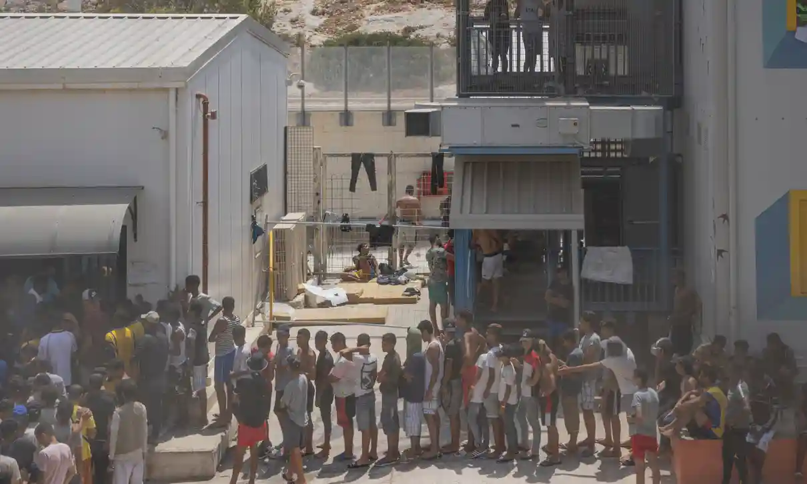
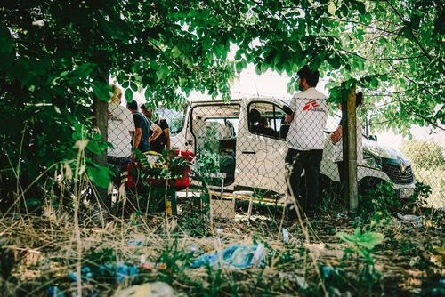
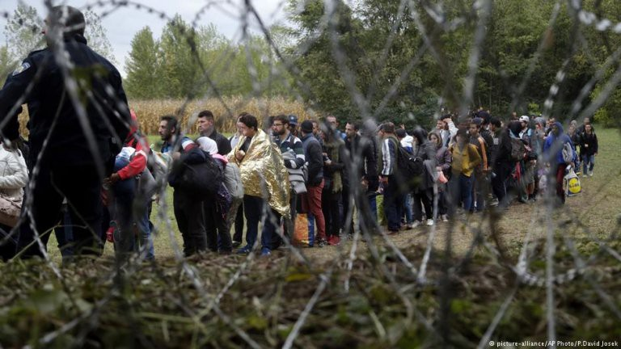

### AYS News Digest 8/8/22: 35 people in danger in the middle of the sea between Italy and Malta
#### No rescue operation has yet been launched by European authorities to help 35 people in distress // Six people died off Algerian coast // Construction of closed camps on the Aegean islands // Group stuck on Evros river islet in need of urgent support // Extreme border violence and humiliation reported at the Hungary\-Serbia border // On how asylum seekers are at the heart of the far\-right campaign for the Italian elections // The story of Adnan Miakhel // and much more…

Overcrowding in Lampedusa’s refugee facility\. Photograph: Roberto Salomone/The Observer\. \(Source: The Guardian 7/8/2022\)
#### FEATURE

After 24 hours [without any contact](https://twitter.com/alarm_phone/status/1556309651532169216) , 35 people were able to launch a distress call again, warns Alarm Phone\. But despite this, they remain abandoned in the middle of the sea between Italy and Malta, and no rescue operation has yet been launched by European authorities despite the fact that the first distress call was made on [August 7th](https://twitter.com/alarm_phone/status/1556002956172050434) \.

■■■■■■■■■■■■■■ 
> **[Alarm Phone](https://twitter.com/alarm_phone) @ Twitter Says:** 

> > Dopo oltre 24h dall'ultimo contatto, le ~35 persone in pericolo in mare ci hanno chiamato di nuovo! Sono nella zona SAR condivisa tra #Italia e #Malta. Non sappiamo come siano sopravvissute, ma le autorità UE non hanno lanciato un’operazione di soccorso. Non lasciatele annegare! https://t.co/LxYPXI6BtA 

> **Tweeted at [2022-08-08 14:59:42](https://twitter.com/alarm_phone/status/1556656402751537154).** 

■■■■■■■■■■■■■■ 

In previous days, [people rescued by Sea\-Eye](https://twitter.com/seaeyeorg/status/1555949403256545280) in Maltese SAR zone were left onboard the ship for several nights because Malta rejected the request for a safe harbour\.

](assets/e32b6ad16216/1*iZPcrMLHFqmni7LyCQJfhw.jpeg)

People rescued by Sea\-eye waiting for a safe port\. [Credit: Martina Morini via Sea\-eye](https://twitter.com/seaeyeorg/status/1555949602842492928)

Many of the people risking their lives leave from North African coasts\. More than **250 people** were returned to Tunisia by the country’s coast guard over the past weekend as they attempted to cross the Mediterranean\. According to a Facebook statement the National Tunisian Guard said that maritime authorities:

> “were able to rescue 255 would\-be migrants, including 170 people of various African nationalities, with the rest being Tunisian\.” 

Tunisia is a major departure point for migrants trying to reach the EU, particularly Italy\. During the summer period, departures have increased and with them coast guard activities\. On July 18, the Tunisian National Coast Guard said it [had rescued 455 people](https://www.infomigrants.net/en/post/42008/tunisian-coast-guard-rescues-455-migrants) \.

](assets/e32b6ad16216/1*VvHvi4Nmco47Ip_jFbfeTA.jpeg)

Many people leave Tunisia from Zarzis, a town near the border with Libya\. The Tunisian maritime guard tries to prevent the boats from being reused by breaking them in half\. [Credit: Mehdi Chebil for InfoMigrants](https://www.infomigrants.net/fr/post/42128/plus-dun-millier-de-personnes-debarquent-en-italie-en-deux-jours)

Among the people heading to Europe, some manage to reach Italy\. As it was reported by the Italian Ministry of the Interior, between January 1 and July 22 of this year, [34,000 people arrived by sea](http://www.infomigrants.net/fr/post/42438/tunisie--255-migrants-secourus-alors-quils-partaient-pour-litalie?fbclid=IwAR2k9sFoNCMPMxqm3O97pbkJTnA7GdqD-Di7sba91Z9tQc6u2PA5smaX-8E) to Italy\. On August 2, a new centre was opened in Pantelleria to handle the planned secuirty process and to speed up the process of transportation to the mainland\.

However, the cost in terms of human lives is high, as the absence of legal routes leads to dangerous journeys\. The International Organization for Migration \(IOM\) has estimated that 1,200 people have lost their lives in the central Mediterranean since the beginning of the year\. These lives lost add to the approximately 3000 deaths last year\. Read more [here](http://www.infomigrants.net/fr/post/42438/tunisie--255-migrants-secourus-alors-quils-partaient-pour-litalie?fbclid=IwAR2k9sFoNCMPMxqm3O97pbkJTnA7GdqD-Di7sba91Z9tQc6u2PA5smaX-8E) \.
#### ALGERIA
### Six people died on the journey to Europe

A shipwreck claimed the lives of six people near the Algerian town of El Hammamet\. Six other people were injured, including a pregnant woman while the others who were on the boat are still missing\. They were hoping to reach the city of Alicante, Spain\. Like many others leaving the Algerian coast without visas, they risked their lives to get to Europe\. The government is responding with criminalization and arrests to stop sea departures\. In fact, according to the Ministry of Defence, 2352 people fleeing Algerian shores have been arrested this year since the “offence of illegal exit” can be punished by national law\.

#### GREECE
### AI surveillance used in EU\-funded camps in Greece

_Journalist Lydia Emmanouilidou speaks of the use of closed camps that have been constructed on several islands in Greece_

So far there are camps on Samos, Kos, and Leros\. They are structurally different to the makeshift camps that were constructed in 2015/2016\.

There is a much higher level of security, with the entrance to camps having turnstiles, magnetic gates, two\-factor access control system, and finger\-print scanning\. Within the camps, there are also sensors and cameras\. The Migration Ministry states that all this security and technology aims to make the spaces more secure and safe for residents and the local population\.

On Samos, she was told that there is one security guard every 30 metres, and with the exception of Leros, these camps are very isolated\.

When visiting camps, there is a high level of security for anyone visiting the camp, including journalists\. This evidently affects her work as individuals may not feel comfortable to discuss their views with security present\. However, some individuals whom she was able to speak to, did say they feel slightly safer as there may be less chance of violence, in particular sexual violence which was a very present issue in camps across Greece\.

Nevetherless, with all this security and technology, basic needs are often not being met\. Lydia mentions that whilst millions of euros have been spent on these camps, many individuals are not being provided with adequate food, clothing, and even running water\. NGOs have previously been able to meet this demand and fill the gap, however, it is much harder for NGOs to access individuals in the camps\. In addition, many NGOs have struggled with the ethical issue of working in these spaces that have become more ‘prison\-like’, and have had further barriers to put in place by the Migration Ministry that prevents them from accessing the camp\.

You can watch the full interview here:

In addition, a video has been published showing the Hellenic Coast Guard pushing back a boat into Turkish waters:

■■■■■■■■■■■■■■ 
> **[Madi Williamson](https://twitter.com/madikwilliamson) @ Twitter Says:** 

> > Are @[ForensicArchi](https://twitter.com/ForensicArchi) looking into this! I took a testimony from a pushback consistent with this story in June I’d be interested to see if stories and locations etc line up 

> **Tweeted at [2022-08-08 18:08:18](https://twitter.com/madikwilliamson/status/1556703866036649990).** 

■■■■■■■■■■■■■■ 

On Saturday August 6, Alarm Phone reported on a group of individuals stuck on the Evros river islet after being beaten by both the Greek and Turkish border forces\.

■■■■■■■■■■■■■■ 
> **[Alarm Phone](https://twitter.com/alarm_phone) @ Twitter Says:** 

> > 🆘 - 32 adults and 8 children in urgent situation at Evros river! The people have been exposed to violence from #greek and #turkish border guards since 2 weeks already and reportedly 3 people already died - this needs to stop immediately! 

This is what they report:
1/3 https://t.co/DBkOJjhbSl 

> **Tweeted at [2022-08-06 11:59:05](https://twitter.com/alarm_phone/status/1555886172785844224).** 

■■■■■■■■■■■■■■ 

#### HUNGARY
### MSF reports extreme border violence on the Hungary\-Serbia border

Since January 2021 MSF doctors have treated 423 individuals who have experienced physical violence at the Hungary\-Serbia border\. Their data and the testimonies from said individuals correlate and indicate extreme physical violence and a lack of basic services\.

> “Beatings with belts and batons, kicking, punching, various forms of humiliation, use of pepper spray and tear gas are all reported to be common deterrence practices, prior to pushbacks and denial of assistance\.” 

Some individuals stated that their belongings have been stolen, and others were forced to strip naked, even in freezing temperatures\.

MSF workers standing by a barbed wire fence during a medical consultation of the MSF mobile clinic in Horgos 2 border crossing area in Serbia\. Serbia, July 2022\. \(Source: MSF, 4/8/2022\)

**Police claim a human smuggler caused a car crash in southern Hungary that killed 3 migrants and 11 left injured**

[InfoMigrants](https://www.infomigrants.net/en/post/42453/hungarian-police-blame-fatal-car-crash-on-migrant-smuggler) reports that the identities of the individuals injured are still unknown, but the accused was a Georgian national who was allegedly attempting to transport the group of 15 across the country\.

Source: InfoMigrants, 8/8/2022
#### CROATIA
### Importance of strategic litigation to put an end to violent pushbacks

Two of our Border Violence Monitoring Network \(BVMN\) members, CPS and Blindspots, talked about the importance of strategic litigation when it comes to border violence\.

Our colleague from CPS, Antonia Pindulić, analyzed the development of the practice of pushbacks in Croatia\. Stressing the importance of the European Court of Human Rights ruling regarding [Madina Husseini](ays-news-digest-17-11-21-echr-serves-justice-for-little-madina-croatia-found-guilty-cbf8e70f6e84) , she noted again that this was an important legal step because it shows the responsibility of Croatian police in collective deportations and human rights violations at the border\. Connected to the case is also the criminalisation case of AYS volunteer Dragan Umičević, something we reported extensively about, and a story that is not nearly over…

**The violence interpreted during the deportations has remained and remains unpunished because it was conducted in such a way that most of the victims lack evidence\.**

#### ITALY
### Right\-wing set to win the upcoming Italian elections?

The right wing candidate for Prime Minister is Giorgia Meloni, who has the chance of becoming Italy’s first far\-right leader since Mussolini\. In addition, he once stated that Italians needed to:

> “Repatriate the migrants back to their countries and then sink the boats that rescued them” 

As seen many times before, politicians within this coalition turn the current situation in places like Lampedusa to their advantage\.

Despite Lampedusa winning the Nobel peace prize for its solidarity toward asylum seekers, in 2019 EU elections, the far\-right League party won almost 46% of votes\. Prior to the crisis in 2015, Lampedusa was taking in asylum seekers, and the rates of individuals arriving kept increasing, reaching 21,000 in 2015\. Whilst countries, such as Greece and Croatia began introducing harsh immigration policies, Lampedusa continued to receive individuals in a more welcoming manner\.

However, the criminalisation and rejection of asylum seekers heightened in the media and within politics, resulted in a rise in xenophobia and discrimination\.

> The facility in Lampedusa today resembles a prison environment, with heavy security, overcrowding and a lack of basic necessities for those staying there\. 

#### FRANCE
### Four years since police in Calais started evictions

■■■■■■■■■■■■■■ 
> **[Human Rights Observers](https://twitter.com/HumanRightsObs) @ Twitter Says:** 

> > Aujourd'hui, le 08/08/22, cela fait 4 ans que les #expulsions sous le régime de la flagrance ont lieu dans le #Calaisis.
4 années d'humiliations, de vols, de harcèlement, de violences envers les personnes exilées.
4 années d'une politique raciste et mortifère.
#Stopauxexpulsions https://t.co/qCJ8zVIgEX 

> **Tweeted at [2022-08-08 17:07:10](https://twitter.com/humanrightsobs/status/1556688480750780416).** 

■■■■■■■■■■■■■■ 

#### GERMANY
### German government abandons Afghans facing evacuation difficulties

_](assets/e32b6ad16216/1*Km_99heyS5TuKN_0GiUTAQ.jpeg)

_People evacuated from Afghanistan\. [Credit: Marc Tessensohn/Bundeswehr/picture alliance via Info migrants](https://www.infomigrants.net/en/post/42431/taliban-blocking-afghan-evacuations-to-germany-report?fbclid=IwAR0Dt3wlY3Yyp3MXKcrVoKAHJk-sZSD_080bKEPcGCS2D2qoqybxuQsaPyo)_

New rules decided by the Taliban [have blocked the German government’s evacuation plans](https://www.infomigrants.net/en/post/42431/taliban-blocking-afghan-evacuations-to-germany-report?fbclid=IwAR0Dt3wlY3Yyp3MXKcrVoKAHJk-sZSD_080bKEPcGCS2D2qoqybxuQsaPyo) , according to Der Spiegel\. Out of 7,700 people who had to be evacuated between July and September, only 1044 arrived to Germany\. According to the new regulations, the Taliban allow people to leave Afghanistan only with a valid documentation, but passports are rarely issued\. Thousands of people are still waiting to be evacuated\. However, the federal government [has not fulfilled its responsibilities](https://taz.de/Von-Deutschland-im-Stich-gelassen/!5870083/) , leaving many people at risk within the country\. Since 15th August, civil society has reacted by supporting people at risk in Afghanistan\. [Kabul\-Luftbrücke](https://www.kabulluftbruecke.de/) is an NGO that is constantly active and engaged in the rescue of Afghans that have been abandoned by NATO governments\. The NGO has decided to evacuate people offering safe passage, provided that the German Government gives a letter of acceptance to people who need to flee the country\. \(Read more [here](https://www.rbb-online.de/doku/m-n/mission-kabul-luftbruecke---dokuserie/mission-kabul-luftbruecke-kabul.html?fbclid=IwAR00ffPyV46Luj78LSYipG5Jn4uJuNZDLU-EpCvHt-lxq8WwKv98DYIlqog) \)

■■■■■■■■■■■■■■ 
> **[Kabul Luftbrücke](https://twitter.com/KabulLuftbrucke) @ Twitter Says:** 

> > Wir wollen mit euch feiern, dass wir unsere Arbeit dank eurer Unterstützung schon so lange machen können und ein Jahr später immer noch die Möglichkeit haben, gefährdete Personen zu unterstützen und gerechte Aufnahmewege zu fordern. 
[kabulluftbruecke.de/1jahr/](https://www.kabulluftbruecke.de/1jahr/) https://t.co/y3p39p9fKD 

> **Tweeted at [2022-08-02 05:52:25](https://twitter.com/kabulluftbrucke/status/1554344349219053568).** 

■■■■■■■■■■■■■■ 

Until the very last minute before the Taliban took over, Germany carried out deportations to Afghanistan\. And it seems that the German government wants to continue the policies of deportations\. No border assembly states in his press release :

> “ [Today’s publications](https://www.rbb24.de/politik/beitrag/2022/08/berlin-brandenburg-flughafen-ber-investor-stuebgen.html?fbclid=IwAR36iJnUHyxQx6OTrCwy0D29_NyeZCfjNrq6w3E8cl5hAf5B2W_R_P9AJ-Y) \( \. \. \) demonstrate the questionable means the Brandenburg Ministry of the Interior is resorting to in order to push through the construction of a deportation center at BER Airport, bypassing its own coalition partner and the state parliament” 

[No Border Assembly](https://noborderassembly.blackblogs.org/scandal-about-the-planned-deportation-center-at-ber-airport-no-deportation-center-anywhere/?fbclid=IwAR0F5bQzrokxgON8CWUiTsr2RG4YG1c8qvnOvG9ZjQy2Ibd129cbyMiDicY) has denounced that the new deportation center is being built at BER airport, in which refugees are deliberately isolated and locked up\.
#### UKRAINE
### The story of a Nigerian student, Collins Okoro, who was living in Kiev and fled to Germany after the Russian invasion of Ukraine began

InfoMigrants details his story and what he hopes to do now that he is in Germany:

#### UK
### Adnan Miakhel — a young Afghan cricketer who was picked up by Freddie Flintoff’s BBC series

[He talks of his experience leaving Afghanistan and being smuggled across Iran, Turkey and Greece](https://www.theguardian.com/sport/2022/aug/07/cricket-is-everything-adnan-miakhel-england-dreams-alive-as-asylum-granted) \. He arrived as an unaccompanied minor in the UK and was left in limbo for 12 months before he received his refugee status\.

He also describes his love of cricket, which has made him a local hero in the town he is currently living in\. Freddie Flintoff, a well known British cricketer, interviewed Adnan and pushed for his asylum claim to be approved by the Home Office\. Adnan is currently playing for Wigan Cricket Club and hopes to eventually play for England\.

#### FURTHER RESOURCES:
- The New Humanitarian covers the devastating impacts of drought in parts of Somalia, Ethiopia, and Kenya\. Guyo Malicha discusses the failures in responding to the drought, the mechanisms that could aid in the response, the impacts on affected communities, and future predictions:

- Aegean Boat Report — an article on the numbers of pushbacks in recent years by Greek authorities

**Find daily updates and special reports on our [Medium page](https://medium.com/are-you-syrious) \.**

**If you wish to contribute, either by writing a report or a story, or by joining the Info Gathering team, please let us know\!**

**We strive to echo correct news from the ground through collaboration and fairness\. Every effort has been made to credit organisations and individuals with regard to the supply of information, video, and photo material \(in cases where the source wanted to be accredited\) \. Please notify us regarding corrections\.**

**If there’s anything you want to share or comment, contact us through Facebook, Twitter or write to: areyousyrious@gmail\.com**

_Converted [Medium Post](https://medium.com/are-you-syrious/ays-digest-06-09-08-22-35-people-in-danger-in-the-middle-of-the-sea-between-italy-and-malta-e32b6ad16216) by [ZMediumToMarkdown](https://github.com/ZhgChgLi/ZMediumToMarkdown)._
