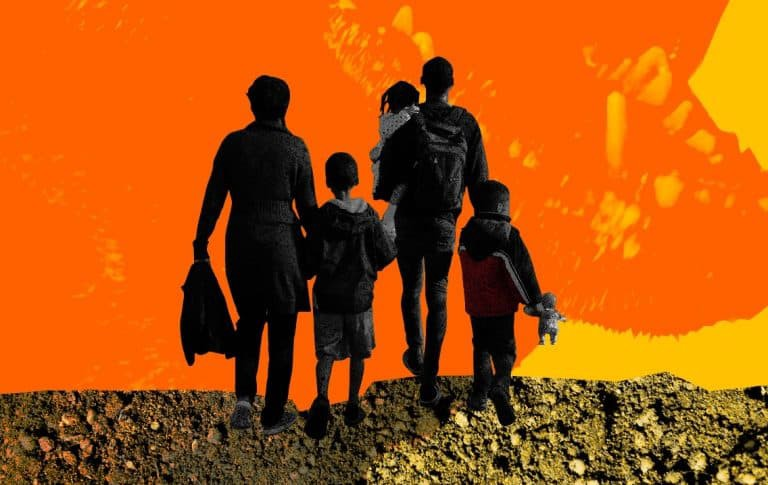
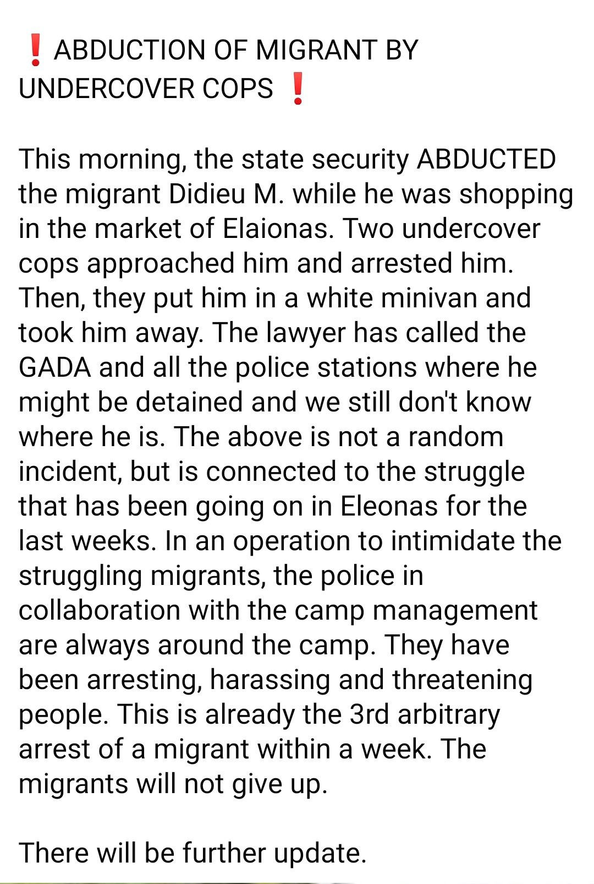

### AYS News Digest 29/8/22: European Court of Human Rights \(again\) rules against officials in Hungary
#### European Court of Human Rights ruled in the case of young asylum\-seeking children and their parents in favor of the family // Bulgaria: More than 140 Afghans detained near Burgas on the Black Sea coast // Official pressure on free journalist continues in Greece // Germany’s commemoration marked by an arson attack// & more news

Illustration via HHC
#### FEATURE

**An Afghan family of four was detained for 211 days in the Röszke transit zone in Hungary\. Today, the European Court of Human Rights ruled in the case of young asylum\-seeking children and their parents\. The Strasbourg court found that the Hungarian state detained the family illegally and in inhumane conditions, without the possibility of an effective legal remedy, and moreover starved the father\.**

As the Hungarian Helsinki Committee \(who [represented](https://helsinki.hu/a-strasbourgi-birosag-szerint-is-jogserto-1-es-3-eves-gyerekek-fogvatartasa/?fbclid=IwAR3Os6uuCUXRd55Zb3nUtPUM7sf50TL5foChIz-aP74ad8eoo3F9P2slb3g) the family\) reports, despite their repeated requests, the family members who experienced severe abuse and trauma did not receive adequate care and accommodation from the asylum authority during their nearly seven month detention\.

> All this happened despite the fact that the European Court of Human Rights obliged the Hungarian state with two decisions, according to which the family must be moved to suitable conditions in view of the vulnerable situation of the family\. 

> For the second time, the urgent action of the court in Strasbourg had to be requested because the family — although the asylum procedure was still ongoing — was transferred to even worse conditions in the transit zone than before: they were placed in the sector for those about to be deported, where the father was starved for six days\. 

The court in Strasbourg [awarded 15,000 euros in compensation to](https://hudoc.echr.coe.int/eng?i=001-218877) the family, because the detention of the mother, who was struggling with a serious illness, the young children and the starving of the father were classified as inhumane and humiliating treatment, as well as illegal, against which Hungary has not insured judicial remedy\.
#### LIBYA

■■■■■■■■■■■■■■ 
> **[Refugees In Libya](https://twitter.com/RefugeesinLibya) @ Twitter Says:** 

> > Under such circumstances,Refugees and civilians whose life depends on daily activities for  bread and water become the first to be victimized, some are shot by floating bullets and their crime is that they wanted to exist in a peaceful environment
@[hrw](https://twitter.com/hrw) @[SoliwRiLibya](https://twitter.com/SoliwRiLibya) @[Pm_govly_ar](https://twitter.com/Pm_govly_ar) https://t.co/et8FXDAO2e 

> **Tweeted at [2022-08-27 15:57:22](https://twitter.com/refugeesinlibya/status/1563556286645813249).** 

■■■■■■■■■■■■■■ 

#### SEARCH AND RESCUE

■■■■■■■■■■■■■■ 
> **[Consolidated Rescue Group](https://twitter.com/unifiedrescueg1) @ Twitter Says:** 

> > (1)
Izmir / Samos Island
We got a distress call from an inflatable boat carrying about 23 migrants at 11:00 am.
The boat was heading to the island of Samos, and it was intercepted by the Greek coast guard,

 #Unified_rescue_group https://t.co/dWwWn9obAo 

> **Tweeted at [2022-08-29 11:17:24](https://twitter.com/unifiedrescueg1/status/1564210606332329986).** 

■■■■■■■■■■■■■■ 

Nadir gets a port of safety after waiting since August 27:

■■■■■■■■■■■■■■ 
> **[RESQSHIP](https://twitter.com/resqship_int) @ Twitter Says:** 

> > 🟢 UPDATE: #Nadir has a port of safety! 

More than 40 hours after the rescue, authorities assigned an entry permit for the port of #Lampedusa, where all people could finally disembar in safety during the night. (1/2) https://t.co/kiKITbep0O 

> **Tweeted at [2022-08-28 11:37:44](https://twitter.com/resqship_int/status/1563853334917824512).** 

■■■■■■■■■■■■■■ 

Ocean Viking had to save more people at sea:

■■■■■■■■■■■■■■ 
> **[SOS MEDITERRANEE](https://twitter.com/SOSMedIntl) @ Twitter Says:** 

> > A 7th rescue was just performed by #OceanViking. The overcrowded small wooden boat was spotted via binoculars in international waters off Malta. 32 people, including 6 women and 1 baby spent 2 days at sea and are exhausted. 

@[SOSMedIntl](https://twitter.com/SOSMedIntl) &amp; @[ifrc](https://twitter.com/ifrc) are now caring for 387 survivors. https://t.co/D1kQRWGwup 

> **Tweeted at [2022-08-27 13:02:19](https://twitter.com/sosmedintl/status/1563512230980624384).** 

■■■■■■■■■■■■■■ 

■■■■■■■■■■■■■■ 
> **[MSF Sea](https://twitter.com/MSF_Sea) @ Twitter Says:** 

> > ‼️ Another rescue has just been performed. 

The alert was sent yesterday by the @[alarm_phone](https://twitter.com/alarm_phone) and confirmed this morning by #SeaBird, the humanitarian aircraft from @[seawatch_intl](https://twitter.com/seawatch_intl). The #GeoBarents navigated full speed towards the boat in distress for more 10 hours. https://t.co/DZDLhdrbQU 

> **Tweeted at [2022-08-29 19:21:09](https://twitter.com/msf_sea/status/1564332342843506690).** 

■■■■■■■■■■■■■■ 

#### GREECE

A man has [reportedly](https://twitter.com/PaggioI/status/1563596227672805376) been apprehended by the police and people who have tried to reach out to him since, including his lawyer, have failed to do so\.

■■■■■■■■■■■■■■ 
> **[Lena K.](https://twitter.com/lk2015r) @ Twitter Says:** 

> > A group of academics researching connections between the experiences of the Asia Minor refugees in 1922 and refugees today were verbally threatened and illegally videoed by security guards at the #Elaionas camp during their visit last Saturday. 
[efsyn.gr/ellada/koinoni…](https://www.efsyn.gr/ellada/koinonia/357074_propilakismos-epistimonon-sto-kamp-toy-elaiona) 

> **Tweeted at [2022-08-29 11:47:13](https://twitter.com/lk2015r/status/1564218107308216322).** 

■■■■■■■■■■■■■■ 

In the meantime, those reporting on the injustice, incoherence and inconsistency in the practice of pressure and pushbacks, are being put under severe pressure by the officials\. Next in line seems to be the Greek journalist Giorgos Christides\.

The ministry is now threatening “legal action” and is trying to teach a lesson in journalistic ethics to the German magazine Spiegel, which met the refugees of the island at the Reception and Identification Center of Evros Prison and [interviewed the parents](https://www.efsyn.gr/ellada/dikaiomata/356985_spiegel-diapseydei-ton-prothypoyrgo-gia-tin-5hroni-maria-ston-ebro) of the dead five\-year\-old Maria and others\.

Read more on the case [here](https://www.efsyn.gr/ellada/dikaiomata/357041_ypoyrgeio-metanasteysis-stohopoiei-tora-kai-spiegel) \.

Many journalists have expressed support:

■■■■■■■■■■■■■■ 
> **[Katy Fallon](https://twitter.com/katymfallon) @ Twitter Says:** 

> > He has done some of the most important work out there into the pushbacks of asylum seekers happening at Greek &amp; European borders. It has never been more important to support journalists in Greece and Giorgos’ work which you can follow here @[g_christides](https://twitter.com/g_christides). Proud to know him. 

> **Tweeted at [2022-08-28 18:55:56](https://twitter.com/katymfallon/status/1563963612326248449).** 

■■■■■■■■■■■■■■ 

#### BULGARIA
### **More than 140 people from Afghanistan detained near Burgas on the Black Sea coast**

Police in Bulgaria detained 141 migrants in two separate incidents on Sunday\. A group of 88 men was travelling in a vehicle registered in North Macedonia and driven by a 60\-year\-old Macedonian national\. The second group of 53 people — also men from Afghanistan — was found in a wood near Burgas, apparently awaiting transport\.
#### THE NETHERLANDS
### People getting evacuated from Ter Apel

Hundreds of asylum seekers were evacuated on Friday from the Netherlands’ main migrant center to shelters across the country\. Dozens more remain camped outside the gates of the facility as the government struggles to tackle the ongoing crisis, InfoMigrants [reports](https://www.infomigrants.net/en/post/42911/dutch-authorities-move-asylum-seekers-camped-outside-ter-apel-center?fbclid=IwAR3tpN80Q5ILD_wIm5bEiPDl-tPSf5lA9hN8h0K_4M8AGDuXO57v2IhT9OM) on the case in Ter Apel that we [wrote](ays-news-digest-27-08-2022-worsening-conditions-for-refugees-in-ter-apel-reception-center-led-to-1675f6014bbb) about earlier\.
#### GERMANY
### Commemoration turned arson attack

30 years after the racially motivated riots in Rostock\-Lichtenhagen, several thousand people gathered at the same location for a commemorative event\. Meanwhile, unknown persons carried out an arson attack on a refugee centre in Leipzig\.

In 1992:

> In August, 1992, several hundred people besieged a tower block that had been turned into an asylum\-seeker reception center and a residence mostly occupied by [Vietnamese people who had worked as foreign contract workers](http://www.infomigrants.net/en/post/42802/germany-threatens-to-deport-vietnamese-man-after-35-years) in East Germany\. Thousands applauded as neo\-Nazis threw bottles, molotov cocktails and stones at the building while chanting racist slogans\. 

[Today](http://85.217.170.64/en/germany-anti-racism-protest-marks-anniversary-of-rostock-riots/a-62951509?fbclid=IwAR39VGKjNO0b_J1jSDzGzyTe2gWS0wG8X0z-HzEnfH2py0B9IT1gMxLpCaA) :

Leipzig became the target of an arson attack\. At least one attack on a refugee reception center takes place in Germany every week\. Attacks include assault, property damage and propaganda, NOZ reported\.

> It is an alarming sign that such inhumane criminal acts are not restricted to the past 

\-Saxony’s Interior Minister said\.

However, around 5000 people took part in the commemorative demonstration on the 30th anniversary in Rostock\- Lichtenhagen\. “Remembering means changing” was the central slogan, which the Rostock alliance had adopted from the mobilisations in Hanau\. There were impressive speeches by survivors and victims from Rostock, Roma organisations and the local migrant council, activists from Welcome United and the initiative 19 February Hanau…\. see more: [https://gedenken\-lichtenhagen\.de](https://gedenken-lichtenhagen.de/)
### **On the death of Mouhamed Lamin Dramé**

16\-year\-old Mouhamed Lamin Dramé was an unaccompanied minor refugee from Senegal and on 8 August 2022 was in such an extraordinary crisis situation that he threatened to harm or even kill himself\. At that time, he was in inpatient accommodation in a youth residential group of the St\. Elisabeth Youth Welfare Service at the St\. Antonius Church in Dortmund’s Nordstadt\. Shortly before, he had been treated at his own request for mental problems in a psychiatric clinic and expressed his suicidal intentions both to his carers and to the police officers who had been called\. He understood little or no German\. His mother tongues were Wolof and French\.

So we ask ourselves: how and in what language did the police actually communicate to calm him down and prevent his suicide?

Mouhamed died in a hail of bullets from a machine gun\. The horror of the death of such a young person should really dominate the national headlines, but much of the reaction seems more like a “debate” or justification for the use of deadly force because, after all, Mouhamed was holding a knife\.

We condemn the general media coverage that distorts the sequence of events as if the police officers “had to” shoot Mouhamed as a last resort because the use of mace and tasers “failed to calm him down”\.

Why did the emergency forces in a suicidal crisis not include psychological or psychiatric professionals, or why did the police officers not wait for such medical professionals who could have adequately cared for Mouhamed, but instead immediately intervened themselves and in the first step in an excessively violent manner, further escalating an already crisis situation in an unprofessional manner? — the Black Community Hamburg [stated](https://blackcommunityhamburg.blackblogs.org/2022/08/14/stellungnahme-mouhamed-lamin-drame_de/) \.
#### WORTH READING
- _At the Heart of Fortress Europe_ aims to map Austrian\-based multilateral cooperation, actors, and or­ganisations that are heavily involved in EU border externalisation policies far beyond Austrian borders

- What happens to migrants after smugglers take them to Cyprus?

- Heavy fighting broke out in Libya’s capital city of Tripoli on Saturday, killing at least 32 people and raising concerns of a return to all\-out war\.

— A “hierarchy of suffering” exacerbates asylum seekers’ mental health in Lithuania:

**Find daily updates and special reports on our [Medium page](https://medium.com/are-you-syrious?source=email-156a28ef10e4-1660244456586-newsletter.subscribeToProfile-------------------------68bdcd3d_8cf3_4eba_889e_fd5281d60100--------3e266993d553) \.**

**If you wish to contribute, either by writing a report or a story, or by joining the Info Gathering team, please let us know\!**

**We strive to echo correct news from the ground through collaboration and fairness\. Every effort has been made to credit organisations and individuals with regard to the supply of information, video, and photo material \(in cases where the source wanted to be accredited\) \. Please notify us regarding corrections\.**

**If there’s anything you want to share or comment, contact us through Facebook, Twitter or write to: [areyousyrious@gmail\.com](mailto:areyousyrious@gmail.com)**

_Converted [Medium Post](https://medium.com/are-you-syrious/ays-news-digest-29-8-22-european-court-of-human-rights-again-rules-against-official-hungary-70857d33ab5) by [ZMediumToMarkdown](https://github.com/ZhgChgLi/ZMediumToMarkdown)._
