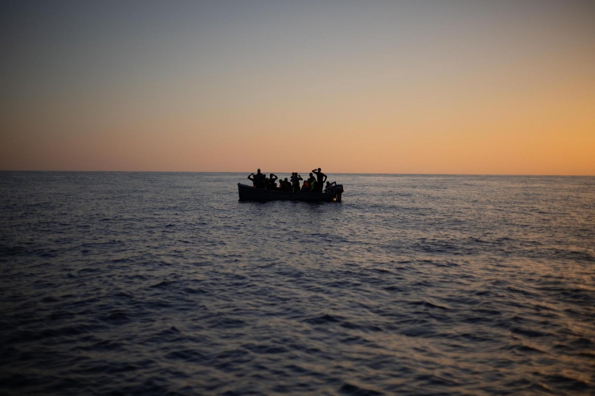
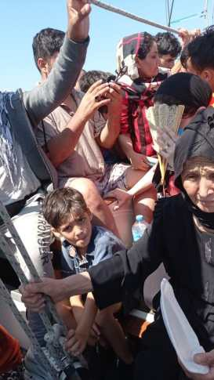
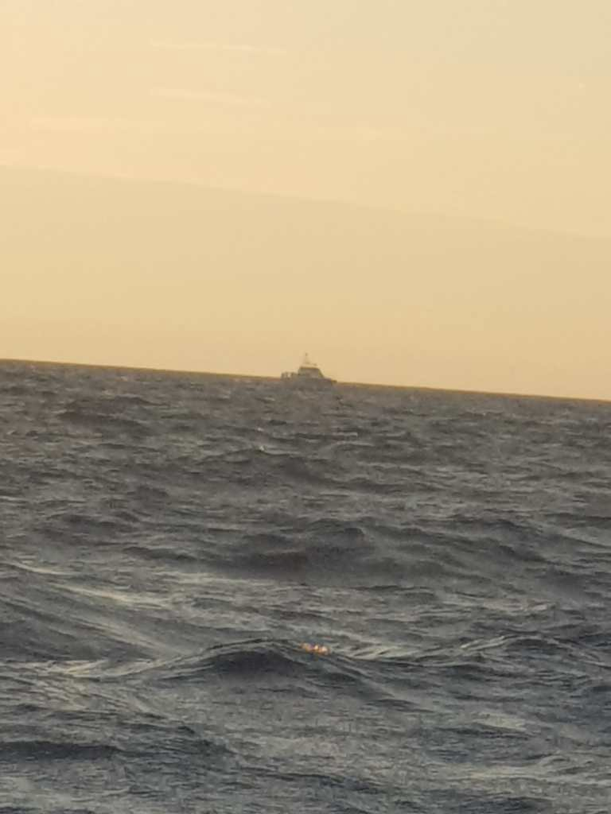
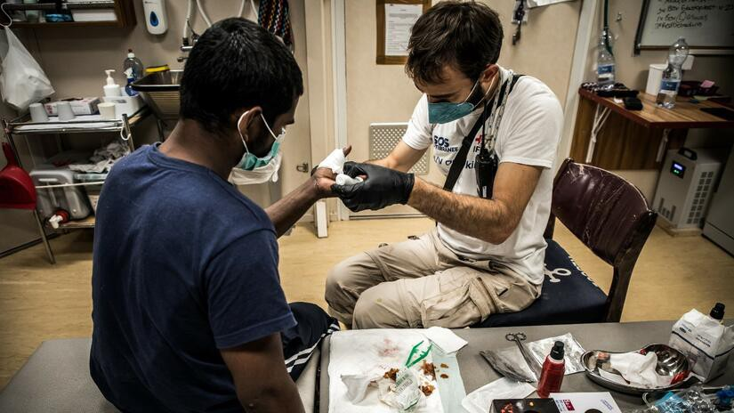

### AYS News Digest 02/09/22: Seven years since the death of two\-year\-old Alan Kurdi

Survivors of a shipwreck filed lawsuit against Lebanese military//EU continues to support the interception of boats by Libyan forces//Greek government has threatened Der Spiegel with legal action//A group of four refugees have been found not guilty after being accused of stealing property on Samos//FRONTEX officer argues there should be more monitoring on how Greek authorities manage asylum seekers//460 individuals still waiting on the Ocean Viking//Hunger strikes and protests taking place in detention centres due to the horrendous conditions and abuse taking place// and much more…

Source: The Civil Fleet — Solidarity is Not a Crime
#### TURKEY
### Amnesty International interviewed 74 Afghans who had been pushed back from Iran and Turkey — 48 of whom had come under fire as they tried to cross the border

In the last year, Iranian forces have injured and killed dozens of Afghans trying to cross the border\.

Those who do enter either Iran or Turkey are detained, subjected to torture and mistreatment and then sent back\. Interviewees describe the abuse, violence, and coercion that takes place at the hands of the Iranian and Turkish authorities\.

> The international legal principle of non\-refoulement prohibits states from returning anyone to a territory where they are at risk of persecution and other serious human rights violations\. We urge the Turkish and Iranian authorities to abide by this obligation and stop forcing people back to danger in Afghanistan — Marie Forestier, Researcher on Refugee and Migrants Rights at Amnesty International\. 

#### GREECE
### The Greek government has threatened Der Spiegel with legal action over their recent reporting

Reporter Giorgos Christides from Der Spiegel [reported on the death of a five\-year\-old girl who had been stuck on an islet](https://ecre.org/greece-government-takes-another-crack-at-preventing-free-press-reports-of-pushbacks-and-non-response-continue/?fbclid=IwAR1keMDHJGv8WlGKMp90p9lU2w_y6us0LlJbDRkDROfM1kRC4mxCokbW6Qo) in the Evros region\. The Greek authorities did not respond to the stranded group for a significant period of time\. The European Court of Human Rights implemented interim measures which were rejected by the authorities, but finally, days later, the authorities rescued the group\.

> The Ministry of Migration and Asylum alleges that Christidis accessed the Reception and Identification Centre \(RIC\) of Fylakio under a false pretext when he interviewed the family of the deceased girl, thereby breaking rules of confidentiality\. 

Notis Mitarachi and the Prime Minister, Kyriakos Mitsotakis, deny all responsibility and claim to have different data and information on the case than what has been reported\. Christidis has refuted the allegations and has thanked other NGOs and colleagues for their support\.

[Iasonas Apostolopoulos is another example of this obstruction and silencing of those who report on immigration in Greece](https://www.theguardian.com/global-development/2022/sep/01/speak-out-against-pushbacks-youre-an-enemy-of-greece-says-refugee-hero?fbclid=IwAR0aqRPiwWjctp5iiiBY3H5hQ1liUboFSIhcZYSwJzUIhp0N5K9nfi5xpiM) \. He was supposed to win a medal for his work\. However, one evening he received a phone call saying his award had been cancelled with no explanation as to why\. He has since received death threats on social media\. He states:

> If you speak out against pushbacks, you’re an ‘enemy of Greece’ — this is the narrative 

This adds to the mounting evidence relating to the restrictions against the press in Greece\. Greece currently ranks 108th out of 180 countries on the 2022 World Press Freedom Index\. Their freedom of press has been on the decline these last few years, especially when related to refugees and asylum seekers\.
#### RSA reports the data on asylum seekers reaching Greece in the first half of 2022

#### Issues already arising with the new asylum registration system in Greece

■■■■■■■■■■■■■■ 
> **[Border Violence Monitoring Network](https://twitter.com/Border_Violence) @ Twitter Says:** 

> > Statement from our member org @[mobileinfoteam](https://twitter.com/mobileinfoteam) on the new registration system for asylum seekers in 🇬🇷 - already people are facing significant delays or "no availability" error messages. A repeat of the failed Skype system?
#refugeesgr 

> **Tweeted at [2022-09-01 12:52:01](https://twitter.com/border_violence/status/1565321580485513217).** 

■■■■■■■■■■■■■■ 

#### A group of four refugees have been found not guilty after being accused of stealing property on Samos

■■■■■■■■■■■■■■ 
> **[Mare Liberum e.V.](https://twitter.com/teammareliberum) @ Twitter Says:** 

> > This was another ridiculous attempt to criminalise already marginalised people and distract from the real structural problems in the Greek camps. We are relieved that the four were found not guilty. In the #CACC in #Samos basic human rights are not protected.

 #AbolishAllCamps 

> **Tweeted at [2022-09-01 16:02:47](https://twitter.com/teammareliberum/status/1565369585590845440).** 

■■■■■■■■■■■■■■ 

#### FRONTEX officer argues there should be more monitoring on how Greek authorities manage asylum seekers

Jonas Grimheden, fundamental rights officer at FRONTEX, was hired to ensure that EU border management complies with international law\. He stated:

> I think that what is missing now from my side, is increasing the pressure, increasing the concreteness of what I think should be done in order to prevent violations\. 

He came into the role at a time when NGOs were calling for FRONTEX to be abolished, however, he argues FRONTEX is very much needed\. There have been numerous reports of FRONTEX involvement in pushbacks, however, Grimheden states that the organisation is attempting to resolve these previous malpractices and they are recruiting lots more fundamental rights officers\.

■■■■■■■■■■■■■■ 
> **[front-LEX](https://twitter.com/LexFront) @ Twitter Says:** 

> > The Guardian's @[JenniferMerode](https://twitter.com/JenniferMerode) talked to Alaa Hamoudi, claimant in the first ever pushback damages case against Frontex that we brought to Court in March. 

Alaa was left at sea for 17 hours, fearing for his life, with Frontex surveilling from above. 

[theguardian.com/world/2022/aug…](https://www.theguardian.com/world/2022/aug/31/i-was-close-to-death-syrian-man-tells-how-greek-officials-pushed-refugees-back-out-to-sea) 

> **Tweeted at [2022-08-31 12:20:28](https://twitter.com/lexfront/status/1564951253091860481).** 

■■■■■■■■■■■■■■ 

#### Alarm Phone reports on a group of 75 people in distress west of cape Tainaron — they have informed the Hellenic Coast Guard

■■■■■■■■■■■■■■ 
> **[Alarm Phone](https://twitter.com/alarm_phone) @ Twitter Says:** 

> > 🆘75 people, incl. 20 children, in distress west of cape Tainaron, Peloponnese, #Greece

They report that they have no food and water, and water is entering their boat. @[HCoastGuard](https://twitter.com/HCoastGuard) is informed. We hope they will rescue soon and bring the people to safety.

#StopPushbacks https://t.co/Nu42k6eVLf 

> **Tweeted at [2022-09-01 16:07:12](https://twitter.com/alarm_phone/status/1565370700814229505).** 

■■■■■■■■■■■■■■ 

#### The Aegean Boat Report writes about a recent pushback of a boat, holding roughly 90 people

Images and videos of the passengers at sea were sent to Aegean Boat Report\. They were drifting about 35km southeast of Koroni\. Water began entering the boat and the boat had lost power\.

The boat was crammed with people and despite several shipping boats sailing past them, no one came to help\.

A Greek Coast Guard vessel was spotted a few hundred metres from the boat, but it did not come any closer and just stayed there for roughly one hour\.

The group sent a video claiming that the Greek Coast Guard had circled the boat but did not provide any assistance\. The Aegean Boat Report lost contact with the group\.

> We have made inquiries regarding the whereabouts of this group from the drifting sailboat\. The Greek coast guard claims that they found no sailboat in the area, nor any signs of a shipwreck\. It’s very strange to claim that they have found no boat, when we have pictures of a vessel from the Hellenic coast guard a few hundred meters from the sailboat, there is no way they didn’t see them\. 

Finally, relatives and friends of the passengers confirmed that the group had been pushed back to Turkey and found by the Turkish Coast Guard\.

#### Another potential pushback reported…

■■■■■■■■■■■■■■ 
> **[International Kurdistan Committee of Greece](https://twitter.com/StopPushbacks) @ Twitter Says:** 

> > About 90 refugees are stranded in the #Greek waters near Kalamata, waiting to be rescued. Among them are Kurdish political #refugees fleeing persecution in Turkey. We urge the @[HCoastGuard](https://twitter.com/HCoastGuard) to rescue them and grant them the right to #asylum. No #pushback! @[GCRefugees](https://twitter.com/GCRefugees) @[UNHCRGreece](https://twitter.com/UNHCRGreece) https://t.co/bOwiUtpUsQ 

> **Tweeted at [2022-09-01 17:03:57](https://twitter.com/stoppushbacks/status/1565384982557822976).** 

■■■■■■■■■■■■■■ 

#### Waris Ali spent the last seven years of his life in Eleonas camp, and passed away in the early hours of the 31st August

It took two hours for an ambulance to show up, after he had already died\.

■■■■■■■■■■■■■■ 
> **[Ehsan Fardjadniya](https://twitter.com/EFardjadniya) @ Twitter Says:** 

> > Today in the early morning, Waris Ali, 52 yo, was left to die in Eleonas camp where he spent the last 7 years of his life. His wife and 3 children, were taken to the police office for the registration of his death, right after the funeral car took his coffin out of #Eleonascamp. https://t.co/z6tPReUNgC 

> **Tweeted at [2022-08-31 08:51:12](https://twitter.com/efardjadniya/status/1564898587686965248).** 

■■■■■■■■■■■■■■ 

#### A Twitter thread shows the lack of training, preparation and capabilities of some NGOs supporting refugees and asylum seekers

■■■■■■■■■■■■■■ 
> **[تارا/Tara](https://twitter.com/se_tareh) @ Twitter Says:** 

> > A handful of acclaimed ‘grassroots’/small NGOs in Athens are refusing assistance to people without documentation / with rejections. 

Some try to justify this with the difficulty they face registering people at their NGO & there being too many people in need. 

> **Tweeted at [2022-08-30 10:52:36](https://twitter.com/se_tareh/status/1564566750993211395).** 

■■■■■■■■■■■■■■ 

#### LIBYA
### The EU continues to support the Libyan forces in detecting and pulling back migrants’ boats

Last year, 32,450 people were intercepted by Libyan forces and brought back to Libya to be detained and abused\. [There has been a multitude of evidence showing that migrants and refugees have experienced torture and exploitation at the hands of Libyan forces](https://www.ultimavoce.it/l-indifferenza-dell-ue-per-l-agonia-dei-migranti-nellinferno-libia/?fbclid=IwAR3FlKsavUQAmILwIkS-uYhkIDFgNSky6q0UKPX_vtpQQKaK_QGzqMadbIQ) \.

Nevertheless, the EU has established a network of aerial assets, including a drone off the coast of Malta, to support Libyan forces with their interception of boats\. The drone’s flight paths act as evidence that it is monitoring boats, and that it has followed the trajectory of boats that are then intercepted by Libyan forces\.

#### SEA/SAR
### Seven years since the death of two\-year\-old Alan Kurdi

Photos of young Alan Kurdi lying face down on the beach in Turkey circulated the media, after the boat his family took had fallen apart and sunk, leading to the death of his brother, his mother and himself\.

The news of his death and the photos caused outrage, disgust, and made more people aware of the atrocities taking place at Europe’s borders\.

Seven years later, the situation at Europe’s borders is still horrific, and people continue to take life\-threatening routes across the Mediterranean\. People are either abandoned and left drifting at sea on their own, or are pushed back\.

> Since Alan’s death, we’ve seen the Mediterranean and Aegean become [a mass graveyard](https://thecivilfleet.wordpress.com/2019/10/17/eu-border-policies-have-turned-the-sea-into-a-refugee-graveyard-civil-migrant-rescue-fleet-charges/) \. 

You can read the full article [here](https://thecivilfleet.wordpress.com/2022/09/02/seven-years-since-alan-kurdis-tragic-death-the-mediterranean-and-aegean-seas-have-become-a-mass-graveyard/?fbclid=IwAR2xOeJWQsuuPQq3ZyvVlnXFsQLH6cT-YmJQH3kV974F9DXEYX202gFr-N8) \.
#### Four months ago, a boat carrying more than 80 people sank off the coast of Lebanon\. Survivors and families of the victims have filed a lawsuit against the Lebanese military for detaining two missing survivors\.

[The bodies of seven people were originally recovered, 48 survivors rescued, and 30 individuals went missing](https://www.infomigrants.net/en/post/43044/lebanese-families-file-lawsuit-against-army-for-migrant-boat-sinking) \. Last week, the remains of 10 victims were found\.

It is still unclear how exactly the boat sank\. However, survivors say that the Lebanese navy rammed into the boat\. Charges have been brought against the commander of the navy vessel\. Survivors are also now accusing the army of holding two survivors who have been missing since the boat sank\. They also accuse the Lebanese army of hiding footage of the night their vessel rammed into the boat\.

Human rights organisations have stated that the authorities are not taking the search for the victims seriously, and are taking a long time to investigate what happened that night\.
#### 460 individuals still waiting on the Ocean Viking

They have been waiting eight days to disembark and there are many with severe medical issues that need treating\.

_“We have never experienced such level of severe medical cases on board Ocean Viking before\. The survivors were found in the middle of high seas in unimaginable situations\. In a desperate attempt to find safety, they were near to die at sea, either by drowning, or by dehydration\. Per maritime law, their rescues will only be completed when they will have reached a Place of Safety\. The current blockade for their disembarkation must find an end without further delay,” — Xavier Lauth, SOS MEDITERRANEE Director of Operations_

■■■■■■■■■■■■■■ 
> **[SOS MEDITERRANEE](https://twitter.com/SOSMedIntl) @ Twitter Says:** 

> > A medical evacuation of a woman whose pregnancy is at high risk had to be performed on #OceanViking. 
Her husband, their 7 y/o daughter & 2 y/o son are still on the ship. Our team can only try to console them. 

The 459 remaining survivors must disembark in a Place of Safety now. https://t.co/jgAPBryvEK 

> **Tweeted at [2022-09-02 11:59:05](https://twitter.com/sosmedintl/status/1565670647774191620).** 

■■■■■■■■■■■■■■ 

#### Malta has abandoned 60 to 80 people who were stranded in their SAR zone today

Following on from the [AYS News Digest 31/8/22](ays-news-digest-31-8-22-malta-refuses-sea-rescues-frontex-report-shows-80af1e588ab8) , Alarm Phone have stated that the Maltese Armed Forces have not been reacting to a boat’s SOS calls\.

In the evening, a merchant ship was told by Malta’s rescue coordination centre to assist the 80 people in distress\. After roughly two hours, the merchant ship was told to leave and continue on their route\.

This is not the first time Malta has been accused of not assisting boats in distress\.

#### ITALY
### Five bodies found off the coast of Sardinia

The wreckage of the boat has not been found yet, but the bodies were all found within a space of 48 hours\. The coast guard and financial police have been searching for the wreckage\.

#### FRANCE

■■■■■■■■■■■■■■ 
> **[Utopia 56](https://twitter.com/Utopia_56) @ Twitter Says:** 

> > Ils n’ont pas pu aller à l’école aujourd'hui.
Ce soir, ils dormiront pour la 98e nuit à la rue.
Pourtant, ils sont comme tous les enfants.
Devant le parvis des droits de l’Homme, nous dénonçons le silence insupportable du gouvernement. https://t.co/GhqcP7YfJT 

> **Tweeted at [2022-09-01 17:35:07](https://twitter.com/utopia_56/status/1565392823502966784).** 

■■■■■■■■■■■■■■ 

#### BELGIUM
### Hunger strikes and protests taking place in detention centres due to the horrendous conditions and abuse taking place

> I **n Merksplas,** we hear a lot about systematic dunking as soon as a prisoner raises his voice\. On August 23, 2022, security came to take a man by force to expel him\. Several inmates protest and try to prevent this kidnapping\. Rage rises and objects fly; the management calls the police\. The robocops arrive in force to put down this rebellion\. As a result, 5 prisoners are put in solitary confinement as well as the man who was to be deported\. This person was finally taken to the airport the next day at 7am by the police\. 

#### UK
### So far this year, 22,000 people have arrived by boat across the Channel

This is a huge increase from 299 in 2018\.

The UK’s response has been to implement harsh and inhumane policies to prevent and deter people from crossing the Channel to reach the UK\. This includes, but is not limited to, signing an agreement with the Rwandan government to send asylum seekers to Rwanda instead of allowing them to claim asylum in the UK\. The idea of pushbacks was also brought up, but thankfully the UK navy refused to carry out such an action\.

> Even if the flights don’t take off, the prospect of deportation has led to [numerous](https://www.theguardian.com/uk-news/2022/jun/01/suicide-attempts-among-those-facing-rwanda-offshoring-uk-charities-warn) suicide attempts among people threatened with removal to Rwanda\. 

#### WORTH READING:
- _Global Detention Project — Issues related to Immigration Detention_

- _The New Humanitarian — How European courts are wrongfully prosecuting asylum seekers as smugglers\._ European countries have been criminalising and prosecuting more and more refugees using laws that aim to tackle people smuggling\.

**Find daily updates and special reports on our [Medium page](https://medium.com/are-you-syrious?source=email-156a28ef10e4-1660244456586-newsletter.subscribeToProfile-------------------------68bdcd3d_8cf3_4eba_889e_fd5281d60100--------3e266993d553) \.**

**If you wish to contribute, either by writing a report or a story, or by joining the Info Gathering team, please let us know\!**

**We strive to echo correct news from the ground through collaboration and fairness\. Every effort has been made to credit organisations and individuals with regard to the supply of information, video, and photo material \(in cases where the source wanted to be accredited\) \. Please notify us regarding corrections\.**

**If there’s anything you want to share or comment, contact us through Facebook, Twitter or write to: [areyousyrious@gmail\.com](mailto:areyousyrious@gmail.com)**

_Converted [Medium Post](https://medium.com/are-you-syrious/ays-news-digest-02-09-22-seven-years-since-the-death-of-two-year-old-alan-kurdi-dea0eff8b5e3) by [ZMediumToMarkdown](https://github.com/ZhgChgLi/ZMediumToMarkdown)._
