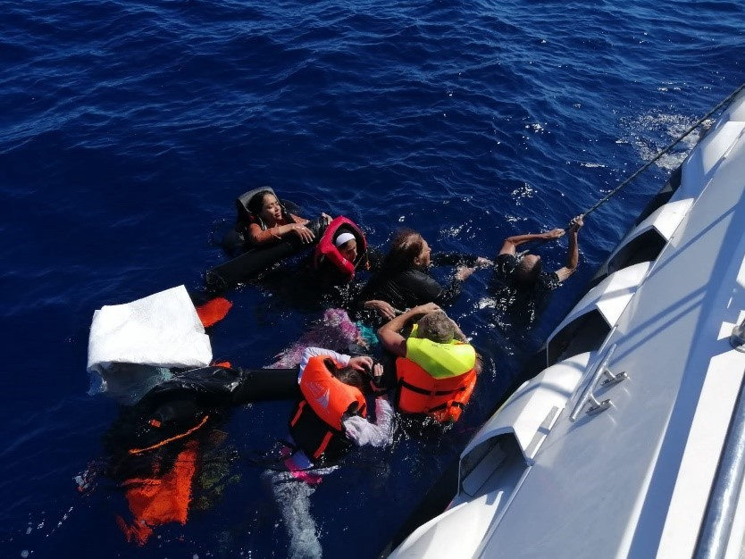
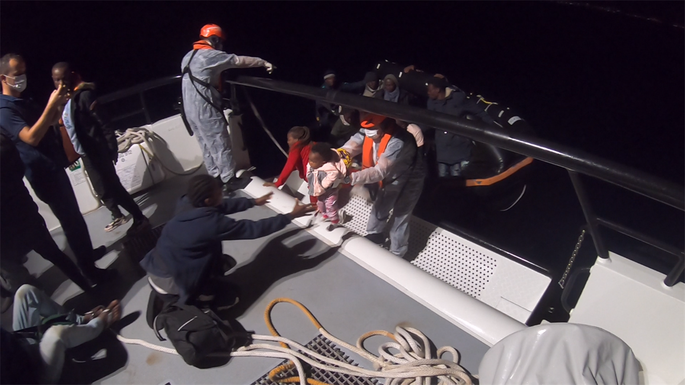
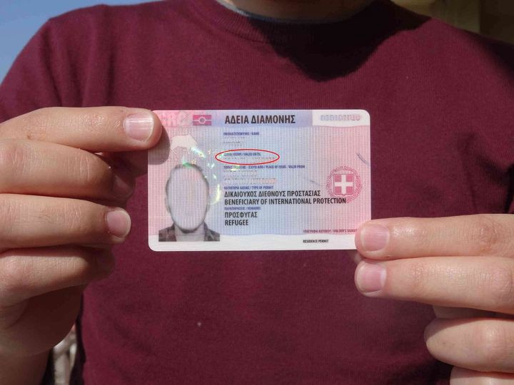

### AYS News Digest 17/09/22: Murder in the Aegean

Murder in the Aegean // Sea\-Watch 3 finally granted POS // Residency permit advice in Greece from Mobile Info Team // EU commission to fund Egypt’s Coast Guard €80 million // A report on the Melilla massacre // Border fence under construction in Latvia & Frontex stonewalls FOI requests…

The survivors of a pushback north of Rhodes, their life raft on the verge of sinking\. Source: Aegean Boat Report
#### FEATURE
#### 11 people have lost their lives in the Aegean, victims of a pushback by the Greek authorities

> ‘After five or six hours, they threw us in the middle of the sea in four plastic boats\. But the last one was broken, and there were lots of kids and women in the last boat’ 

This testimony comes from a survivor of a recent pushback, executed by the Greek authorities\. On 13th September 2022 at 00\.10, the Turkish coast guard received an email about a group of people adrift in Turkish waters\. Three life rafts were located north of Rhodes, with 66 individuals aboard\. When interviews with survivors revealed that a fourth raft, carrying 18 people, was still missing, a second rescue mission was launched by the Turkish coastguard\.

A semi\-submerged life raft was located with seven people clinging on, along with the tragically drowned corpses of a woman, three children and two infants\. A further five people remain missing\.

Notis Mitarachi, Greek Minister of Migration and Asylum, continues to try and undermine the veracity of testimonies, suggesting a disinformation campaign to smear Greece is responsible\. [Aegean Boat Report has pointed out that the life rafts used in this particular violation](https://twitter.com/ABoatReport/status/1569787463006146560) , as well as in 850 other documented pushbacks, are manufactured by the Greek company Lalizas\. Mitarachi’s rhetoric, blaming Turkish authorities, is not just a political game\. He is murdering people, using devices designed to save lives\.

■■■■■■■■■■■■■■ 
> **[Νότης Μηταράκης - Notis Mitarachi](https://twitter.com/nmitarakis) @ Twitter Says:** 

> > Turkish media report a fatal incident in Turkish territorial water, an incident for which Greece had no involvement. Turkey needs to do more to prevent illegal departures, which put human lives at risk. 

> **Tweeted at [2022-09-13 18:58:49](https://twitter.com/nmitarakis/status/1569762540888150016).** 

■■■■■■■■■■■■■■ 

[Aegean Boat Report has pointed out that the life rafts used in this particular violation](https://twitter.com/ABoatReport/status/1569787463006146560) , as well as in 850 other documented pushbacks, are manufactured by the Greek company Lalizas\. Years of documentation and investigations have proven Greece’s culpability for pushbacks, yet the authorities continue to lie through their teeth, and the rest of Europe looks away as “the shield of Europe” continues to violate international maritime law and human rights\.

An infant is rescued from a life raft made by a Greek company\. \. \. Source: ABR

**40,000 people have been pushed back since March 2020,** their lives needlessly endangered, and these systematic violations shamelessly funded by the EU\. How many more people will be subjected to such calculated cruelty before action is taken? Our thoughts are with those who have lost their family and friends at Europe’s borders\.
#### GREECE
#### RESIDENCY PERMITS — Practical information for people registered in Greece, from Mobile Info Team:

_“Always apply to renew your residence permit at least 30 days before it expires, otherwise you will have to pay a fine”_

They advise that people apply to renew their residence permits **three months before its expiry date** , as shown circled in red below:

Also important to know:
- In case your residence permit is about to expire, or has already expired, you can apply for a renewal request here: [https://applications\.migration\.gov\.gr/\. \. \./type\-8\. \. \./create](https://applications.migration.gov.gr/apps/type-8-applications/create?fbclid=IwAR2kdPPeJWojyw2ay5amDP3tIDMJ96qW2f6ch7G8K1zQAWw_2l_5VBN1OeI)
- You can choose a different language on the little triangle on the top right\. Please fill in your details exactly how they are written on your asylum decision and make sure to provide a valid email address\. On the bottom, please tick the second box where it is written, “To be issued with a statement stating that I have applied for a residence permit renewal”\. After a few days you should receive an email with a statement saying that you are waiting for the renewal of your residence permit\. This statement will be helpful for proving the legality of your stay in Greece in front of the police or other Greek authorities\. However, it does not allow you to travel outside of Greece\.

Full information from MIT can be found [here](https://www.facebook.com/mobileinfoteam/posts/pfbid02DRoVhH2qt5mDyHGXkKTWjqDxvCFHHqusJmViwA8VcYMv7BJbWFt8cbXQ2QVSD6kvl) \(also in French\), and Arabic, Farsi, Urdu and Kurdish versions of MIT’s advice can be found [here](https://www.facebook.com/mobileinfoteam/) \.
#### SEARCH AND RESCUE
#### Sea\-Watch 3 finally docks in Reggio Calabria, Italy after declaring a state of necessity on Friday 16th September

With 428 people on board, Sea\-Watch 3 requested a port of safety from European nations ten times\. With none granted, the boat put out an emergency request for safe harbour, no longer able to guarantee the well\-being of its crew and guests as supplies dwindled\. This morning people were finally able to disembark\.

■■■■■■■■■■■■■■ 
> **[Sea-Watch International](https://twitter.com/seawatch_intl) @ Twitter Says:** 

> > The #SeaWatch3 arrived in Reggio Calabria this morning. First, families, children, and unaccompanied minors could finally disembark our ship. Now all the remaining people we have rescued from distress at sea must be allowed to quickly come ashore. https://t.co/APcJVs089T 

> **Tweeted at [2022-09-17 13:03:30](https://twitter.com/seawatch_intl/status/1571122674830835714).** 

■■■■■■■■■■■■■■ 

■■■■■■■■■■■■■■ 
> **[Tam](https://twitter.com/tamhimo) @ Twitter Says:** 

> > One week in the Mediterranean Sea:

Mon:
- 6 dead near Tunisia

Tue:
- 6 dead in Eastern Central Mediterranean Sea

Wed:
- 2 dead near Lampedusa
- 7 dead in Aegean Sea

Thu:
- 11 dead in Aegean Sea after pushback
- 1 dead washed ashore in Libya

Fri:
- 1 dead in Central Med https://t.co/H1kzhwVo9L 

> **Tweeted at [2022-09-15 18:02:18](https://twitter.com/tamhimo/status/1570473094837571584).** 

■■■■■■■■■■■■■■ 

#### EGYPT
#### The European Commission is set to fund the Egyptian coast guard to the tune of €80 million

 on [Unsplash](https://unsplash.com?utm_source=medium&utm_medium=referral)](assets/b74caf71c797/0*agvSaowRkpmz_koL)

Photo by [Colin Lloyd](https://unsplash.com/@onthesearchforpineapples?utm_source=medium&utm_medium=referral) on [Unsplash](https://unsplash.com?utm_source=medium&utm_medium=referral)

In 2022, the European Commission has confirmed that it will allocate €23 million to the Egyptian authorities, and €57 in 2023\. This is officially to fund “search and rescue border surveillance at land and sea borders”\.

_Statewatch_ has observed the contradictory nature of the Commission’s statements, especially given that 3,500 Egyptians have fled their country for Italy in the past nine months\. The Commission stated that it:

_“…stands ready to support Egypt in maintaining its capacity to prevent irregular migration by sea, as well as to strengthen the control of its border with Libya and Sudan\. This is of particular importance in light of the six\-fold increase of irregular arrivals of Egyptian nationals to the EU in 2021 \(9 219\), of which over 90% to Italy, mostly via Libya\._

_An ex ante risk assessment will be conducted and monitoring will take place throughout the action to ensure that it does not pose any threats to the respect of international human rights standards and the protection of refugees and migrants\.”_

The lack of transparency as to the allocation of funds, information about which the Commission said is currently unavailable, is particularly worrying\. It is feared that the funds will be used to buy weapons in the same way that Libya armed its militias\. The EU is funding the Egyptian Coast Guard to protect its own interests, not those of vulnerable people\.

#### MOROCCO
#### Melilla Massacre — marking a shift from pushbacks ‘leaving people to their fate’ to undertaking pushbacks with ‘the explicit knowledge that they would be beaten and treated in an inhumane manner?’

Building upon a report by the Nador branch of the Association Marocain des Droits Humains \(AMDH\), _Statewatch_ have detailed a report of the change in border tactics that the Melilla massacre bore tragic witness to\.

> “Four ambulances that were on site since the early morning were only activated at 11:30 and, instead of dealing with the seriously injured, they began their work as instructed by removing dead bodies and taking them to hospital\. More ambulances arrived later and transferred many of the injured to hospital, with an important delay, in an operation that lasted until around 21:00\. Assistance was not provided on site to the injured people, despite availability of further ambulances and medical staff, also on the Spanish side\. **This non\-assistance demonstrates that cooperation is exclusively focused on security at the expense of all other considerations — even saving lives\.”** 

AMDH’s report concludes that migration policies have

> “… _gone beyond any limit, with a heavy balance of \[people\] dead, disappeared, injured and removed and cruel, inhuman and degrading treatment at the feet of a fence erected and financed for many years by European money_ ”\. 

It is **_really worth reading_** _Statewatch’s_ article in full, where they detail the events of the massacre, outline the human rights violations witnessed, and testify to the alarming attempt to cover up the violence in the immediate aftermath\. This is particularly pressing given the EU’s new partnership with Morocco, which has committed [**€500 million of funding**](https://elpais.com/espana/2022-08-15/marruecos-recibira-500-millones-de-la-ue-para-que-controle-sus-fronteras.html) for migration purposes between 2021 and 2027\.

AMDH’s original report is available here:

#### LATVIA
#### A 173km border fence with Belarus under construction

■■■■■■■■■■■■■■ 
> **[Belsat in English](https://twitter.com/Belsat_Eng) @ Twitter Says:** 

> > # Latvia has started building a 173 km fence with barbed wire at the top on the border with Belarus. The fence will prevent illegal migration 

source: [delfi.lv](http://delfi.lv) https://t.co/gNvHh3Lo8F 

> **Tweeted at [2022-09-15 08:13:12](https://twitter.com/belsat_eng/status/1570324843962241025).** 

■■■■■■■■■■■■■■ 

#### FRONTEX

A freedom of information request for the Fundamental Rights Officer’s Opinion on the overall fundamental rights situation at the Greek land and sea borders has been refused\. Part of their rationale, absurdly, is that the “interest in the disclosure” \[even in a redacted form\] is “disproportionate” to the “administrative burden necessary to identify and redact the releasable elements”\. It seems that any possible excuse to deny FOI requests, however absurd, will be found\. Supposedly there is “no overriding public interest” in fundamental human rights abuses occurring on the Greek border\.

■■■■■■■■■■■■■■ 
> **[Lena K.](https://twitter.com/lk2015r) @ Twitter Says:** 

> > News from the FOIA front: a while ago, I applied to #Frontex for the Fundamental Rights Officer’s Opinion on the overall fundamental rights situation at the Greek land and sea borders, issued in April 2022. Today, they refused to release it. This is their rationale: https://t.co/NkBlqPgwOb 

> **Tweeted at [2022-09-15 14:26:39](https://twitter.com/lk2015r/status/1570418826151624705).** 

■■■■■■■■■■■■■■ 

**Find daily updates and special reports on our [Medium page](https://medium.com/are-you-syrious?source=email-156a28ef10e4-1660244456586-newsletter.subscribeToProfile-------------------------68bdcd3d_8cf3_4eba_889e_fd5281d60100--------3e266993d553) \.**

**If you wish to contribute, either by writing a report or a story, or by joining the Info Gathering team, please let us know\!**

**We strive to echo correct news from the ground through collaboration and fairness\. Every effort has been made to credit organisations and individuals with regard to the supply of information, video, and photo material \(in cases where the source wanted to be accredited\) \. Please notify us regarding corrections\.**

**If there’s anything you want to share or comment, contact us through Facebook, Twitter or write to: [areyousyrious@gmail\.com](mailto:areyousyrious@gmail.com)**

_Converted [Medium Post](https://medium.com/are-you-syrious/ays-digest-17-09-22-murder-in-the-aegean-b74caf71c797) by [ZMediumToMarkdown](https://github.com/ZhgChgLi/ZMediumToMarkdown)._
