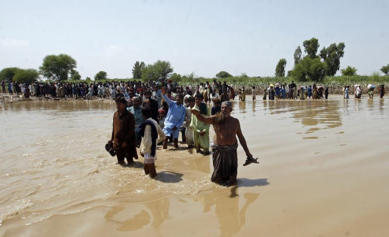
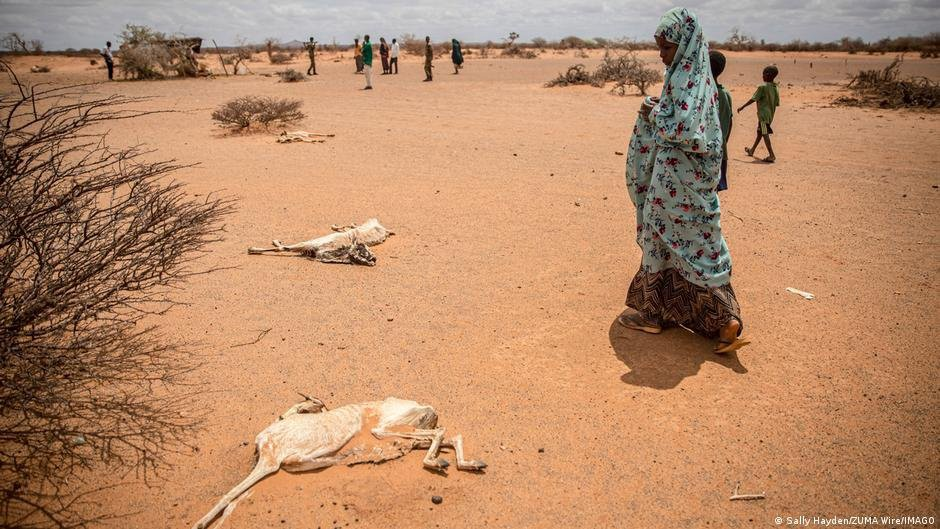
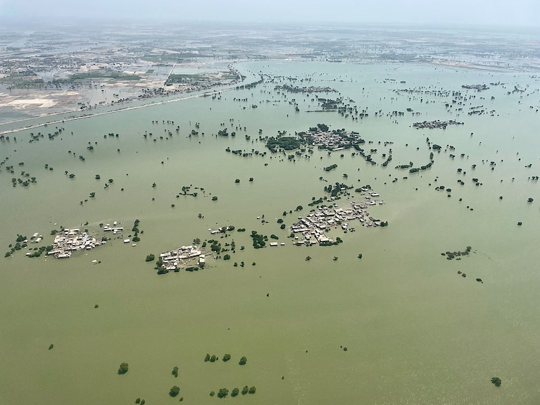
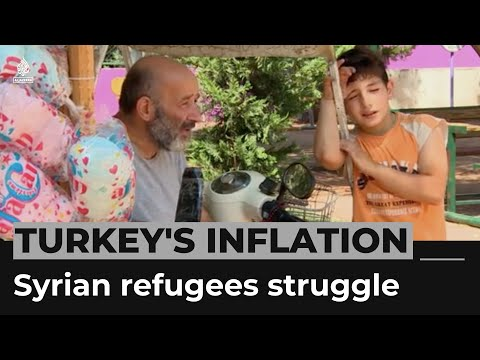
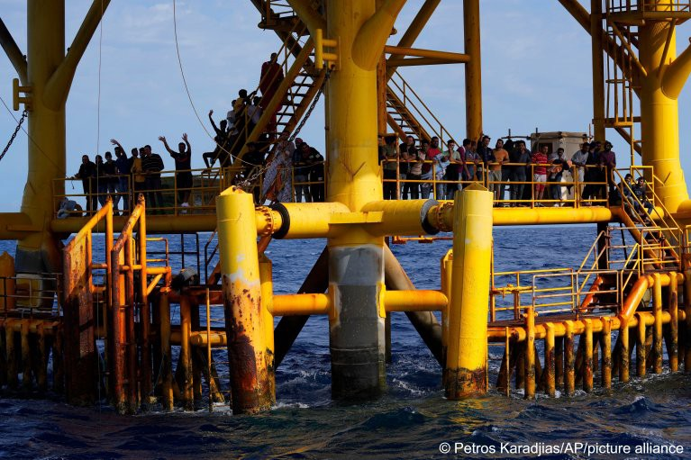

### AYS News Digest 19/9/22: Climate displacement becoming ever more critical

Pressure on the EU and the Greek government to create a just and sustainable asylum system / 35 people pushed back in Greece / Skin infections, low levels of hygiene, lack of sanitary products in Serbian camps / Boat in distress carrying 30 people, at risk of being pushed back / Local organisations in Italy have created a multi\-functional space to host refugees and offer integration support / Afghan refugee programme ‘extremely questionable’ / UK Home Office refuses the accelerate the visa case for a woman with terminal cancer…

Source: LeMonde — Pakistani disaster victims in Sindh province, September 7, 2022\. FAREED KHAN / AP
#### FEATURE
### The effects of the climate crisis on displacement is a very present and concerning issue

> Millions of people already suffering from ongoing conflict, rampant inequality and economic crises are now losing their livelihoods to severe weather disasters, climate extremes and the creeping changes — Oxfam International Director General, Gabriela Bucher 

Source: InfoMigrants, Climate migration: No longer a distant nightmare, 16/9/22

[On average every year, natural disasters force 21\.5 million people to flee their homes\.](https://www.infomigrants.net/en/post/43395/climate-migration-no-longer-a-distant-nightmare?preview=1663341230000)

The OECD has stated that [60 states have fallen into the category of ‘fragile contexts’](https://apnews.com/article/russia-ukraine-health-covid-1ce6053e313d0e3d3703aea65b2f9446?utm_campaign=TrueAnthem&utm_medium=AP&utm_source=Twitter) , which means that they are now experience heightened environmental, social, political risks that they do not have the capacity to deal with\.

> We are in an era defined by multiple crises, shocks and uncertainty — OECD 

After the recent floods in Pakistan, [that have affected 33 million people](https://www.thenewhumanitarian.org/news/2022/09/19/aid-double-standards-climate-emergency-UN-General-Assembly) , the country’s Prime Minister has planned to speak at a climate action round table on the 21st September, [as part of the UN General Assembly](https://www.un.org/en/climatechange/informal-climate-leaders-roundtable-climate-action-2022) in New York\.

Source: Washington Post — Flooding on Sept\. 9 in Dadu District, Sindh Province, Pakistan\. Dadu is one of the worst hit parts of Pakistan, where nearly a third of the country is underwater and more than 33 million people have been affected\.

The island of Vanuatu will also be leading the way at the round table, calling the International Court of Justice \(ICJ\) to issue legal advice and clarification on the roles of states in tackling climate change\.

The UN’s Intergovernmental Panel on Climate Change believes 143 million people will be displaced as a direct result of drought, floods, and rising temperatures within the next 30 years\.
#### TURKEY
### Al Jazeera video on the life of 2 Syrian refugees in Turkey:

### 5 forced migrants have been found dead in the Aegean Sea

The boat, carrying 20 people, sank off the coast of Izmir province\. 14 people were rescued, [5 bodies were found](https://www.infomigrants.net/en/post/43423/turkey-6-migrants-found-dead-in-aegean-sea) , and the Turkish coastguard is still searching for one missing person\.
#### GREECE
### NGOs, including Amnesty International, call on EU institutions and the Greek government to create a just and sustainable asylum system

Amnesty International reflects on the fact that it has been a year since the EU\-funded Closed Controlled Access Centre \(CCAC\) was set up on Samos\. Another 2 are now operational on the islands of Leros and Kos, while 2 more are being constructed on Lesvos and Chios\.

The article delves into the concerning problems related to CCACs, including the impact of containment on mental and physical health, and the prison\-like conditions\.

They call on the European Commission and the Greek Ministry of Migration and Asylum to answer the following questions:

> As COVID\-19 quarantine requirements are being waived across Europe, on what grounds are asylum seekers in Samos and Lesvos held in a quarantine section upon arrival? 

> When will the designated hosting areas for single women with their children and/or unaccompanied children inside the CCACs start operating? 

> What is the timeframe and what concrete measures have been taken towards ensuring adequate and specialised staffing of the Medical and Psychosocial Unit inside the CCACs? 

> Given that ongoing asylum trends in Greece indicate many residents of the camp\(s\) will be granted asylum, what measures have been taken to establish integration pathways, and how is the impact of having to reside in prison\-like conditions for protracted periods assessed with respect to prospects of integration? 

> Why does the Commission fund centres that are contrary to the Action Plan on Integration and Inclusion it has adopted? 

> What is the Commission’s assessment with respect to Greece’s approach to integration, particularly vis\-à\-vis the EU Action Plan on Integration and Inclusion? 

> What is the Commission’s assessment with respect to Greece’s compliance with the Reception Conditions Directive and the asylum acquis more broadly? 

> Given that the EU has provided material support for the construction and running of the CCACs and oversees Greece’s use of EU funds for these purposes, what steps will the Commission take to hold Greece accountable for violations of fundamental rights in these facilities? 

You can read the full statement [here](https://www.amnesty.eu/news/one-year-since-greece-opened-new-prison-like-refugee-camps-ngos-call-for-a-more-humane-approach/) \.
### On Sunday, a boat carrying 35 people was pushed back by, what is believed to be, the Hellenic Coast Guard

■■■■■■■■■■■■■■ 
> **[Aegean Boat Report](https://twitter.com/ABoatReport) @ Twitter Says:** 

> > A rubber boat carrying 35 people was pushed back outside Rhodes on Sunday. In the video we can clearly see three masked men, in what seems to be 🇬🇷 naval uniforms, in a RIB belonging to the @[HCoastGuard](https://twitter.com/HCoastGuard), ID number is visible, ΛΣ-1037, stationed on Rhodes.@[PrimeministerGR](https://twitter.com/PrimeministerGR) https://t.co/cg4GrqUN1n 

> **Tweeted at [2022-09-18 22:31:51](https://twitter.com/aboatreport/status/1571628093059772418).** 

■■■■■■■■■■■■■■ 

#### SERBIA
### **Critical areas in north eastern Serbia: Subotica, Sombor and Majdan**

Increasing numbers of people are trying to reach northern Serbia to make their way into the EU\. People on the move are setting up informal settlements in forests, in abandoned buildings, and private apartments and inns\. There are also three camps managed by the Serbian government\.

NoNameKitchen describe the work they are currently doing in Subotica:

> The team on the ground travels more than 150 kilometers every week in the area to learn about the situation of people on the move\. We reach more than 900 people weekly with personal hygiene items such as toothbrushes and toothpaste, shavers, soap; food such as bread, fruit, vegetables, rice, dry pasta, sugar, salt, oil, tomato sauce; and for some time now it has been providing hot showers and drinking water\. We also provide a recharging point for cell phones, which helps people who live without access to electricity to stay connected with their families and friends\. 

### Camp residents complain of skin infections, low levels of hygiene and a lack of sanitary products

■■■■■■■■■■■■■■ 
> **[NoNameKitchen](https://twitter.com/NoNameKitchen1) @ Twitter Says:** 

> > These camps are paid with money that European Union send to neighbouring countries, as Serbia, to host people that the same EU forces to stay behind the borders.

When we are asked why we do not work in camps, here an example of the millions of reasons we have. 

> **Tweeted at [2022-09-19 10:42:35](https://twitter.com/nonamekitchen1/status/1571811986349883393).** 

■■■■■■■■■■■■■■ 

#### SEA/SAR
### Open Arms rescued 403 individuals left adrift at sea over the weekend

On Saturday, they rescued roughly 300 people — [this was the largest rescue this weekend](https://www.infomigrants.net/en/post/43411/mediterranean-open-arms-rescues-402-migrants-seawatch-disembarks-428) \.

■■■■■■■■■■■■■■ 
> **[Pilotes Volontaires](https://twitter.com/PVolontaires) @ Twitter Says:** 

> > 🔴Partagés entre soulagement et inquiétude
L'embarcation en péril repérée hier a été secourue dans la nuit par l'#OpenArmsUno de @[openarms_fund](https://twitter.com/openarms_fund). Près de 300 personnes désormais en sécurité à son bord. 
Nous sommes toutefois inquiets pour les 30 personnes à la dérive repérées ajd. https://t.co/XbQ4558ObX 

> **Tweeted at [2022-09-18 18:00:41](https://twitter.com/pvolontaires/status/1571559849879818240).** 

■■■■■■■■■■■■■■ 

Sea Watch 3 also rescued 428 individuals and disembarked in a Southern Italian port\.
### However, Humanity 1 is waiting to disembark, with currently 398 people on board

■■■■■■■■■■■■■■ 
> **[SOS Humanity (international)](https://twitter.com/soshumanity_en) @ Twitter Says:** 

> > 1/2 Still no #SafePort for the remaining 398 rescued on board the #Humanity1! Supplies are running out, crew members are also getting infected, bad weather is approaching. We are particularly concerned about the 55 children under 13 years and 110 unaccompanied minors. https://t.co/AZoWEaNio7 

> **Tweeted at [2022-09-19 10:30:33](https://twitter.com/soshumanity_en/status/1571808961766240256).** 

■■■■■■■■■■■■■■ 

### Open Arms rescued 59 individuals from an oil rig

One man was shot by a human smuggler on the shore, and then forced the group to take the body on the boat with them\.

Source: InfoMigrants
### Alarm Phone has reported on a boat in distress carrying 30 people — they fear another pushback is on the horizon

■■■■■■■■■■■■■■ 
> **[Alarm Phone](https://twitter.com/alarm_phone) @ Twitter Says:** 

> > 🆘 People in danger of being pushed back! We received information of 30 people in distress near #Symi - the last position shows them on #Seskli island. We fear that @[HCoastGuard](https://twitter.com/HCoastGuard) is preparing another #pushback as we cannot reach the people anymore.

#StopPushbacks 

> **Tweeted at [2022-09-19 16:22:58](https://twitter.com/alarm_phone/status/1571897649762009096).** 

■■■■■■■■■■■■■■ 

#### ITALY
### Local organisations have created a multi\-functional space to host refugees and offer integration support

A former office building has been refurbished in Corsico and turned into a multi\-functional space for refugees\. The first floor will be able to house roughly 20 people, and other parts of the building will support with Italian language classes and school enrolment\.

It is part of IKEA Italia’s campaign — _Un posto da chiamare casa_ \(A place to call home\) — that has created 750 hosting projects across the country\.

#### GERMANY
### Afghan refugee programme ‘extremely questionable’

The programme was implemented [to accommodate some of the most vulnerable individuals, such as human rights defenders, journalists, activists, prosecutors, and judges](https://www.infomigrants.net/en/post/43416/germanys-afghan-refugee-program-extremely-questionable-aid-groups-warn?preview=1663597939327) \.

Several organisations, including, Pro Asyl, Amnesty International and Reporters without Borders have questioned the organisation and the general functions of the programme\. It would only work if Germany kept providing humanitarian visas, improved the its local staff procedure, and sped up family reunification processes\.

Issues have been raised on several occasions, and thousands of Afghans are still waiting for an appointment to apply for a German visa\. The government has taken steps to improve this programme but a lot more needs to be done\.
### German police have found 23 Syrian refugees near the Czech border

They had apparently been abandoned by smugglers in the forest\. 11 out of the 23 have already been sent back to the Czech Republic\. The police have stated that the other 12 individuals will also be sent back\.

#### UK
### After the recent expression and acts of Islamophobia in Leicester, a solidarity protest has been organised for Thursday

### Home Office refuses to accelerate the visa case for a woman with terminal cancer

Eulalee Pennant arrived in the UK in 2001 and was issued a student visa\. Her case was stuck in a Home Office backlog for roughly 10 years\. In 2019, she was granted discretionary leave to remain, however, this status has now expired\. She has re\-applied for leave to remain\.

Eulalee has no recourse to public funds so cannot access benefits that would allow her to live her last few months more comfortably\. She lives in a flat with her partner, that has no lift\. She is housebound and only leaves the flat when an ambulance crew carries her down the stairs to take her to appointments\.

MP Diane Abbott, as well as Eulalee’s friends and family members have all reached out to the Home Office to ask them to speed up her immigration process so that she can receive her status before she passes away\. However, they have so far denied this request\.

> “If the Home Office would sort my case out, my life would be a million times better than it is now\. They have messed with my life for so many years\. Their treatment is cruel, it’s hostile, it’s racism\. I have had a lot of struggle in my life\. I don’t know what I’ve done to deserve this\.” — Eulalee Pennant 

#### WORTH READING:
- This Week in Asia — Sri Lankan Muslims struggle to belong after civil war: ‘still outsiders’

- Journal of Ethnic and Migration Studies — ‘ [Promising victimhood’: contrasting deservingness requirements in refugee resettlement](https://www.tandfonline.com/doi/pdf/10.1080/1369183X.2022.2117686?needAccess=true)
- InfoMigrants — Iraq: One million displaced persons without essential papers, NGO

**Find daily updates and special reports on our [Medium page](https://medium.com/are-you-syrious?source=email-156a28ef10e4-1660244456586-newsletter.subscribeToProfile-------------------------68bdcd3d_8cf3_4eba_889e_fd5281d60100--------3e266993d553) \.**

**If you wish to contribute, either by writing a report or a story, or by joining the Info Gathering team, please let us know\!**

**We strive to echo correct news from the ground through collaboration and fairness\. Every effort has been made to credit organisations and individuals with regard to the supply of information, video, and photo material \(in cases where the source wanted to be accredited\) \. Please notify us regarding corrections\.**

**If there’s anything you want to share or comment, contact us through Facebook, Twitter or write to: [areyousyrious@gmail\.com](mailto:areyousyrious@gmail.com)**

_Converted [Medium Post](https://medium.com/are-you-syrious/ays-news-digest-19-9-22-climate-displacement-becoming-ever-more-critical-4758ccf8a545) by [ZMediumToMarkdown](https://github.com/ZhgChgLi/ZMediumToMarkdown)._
